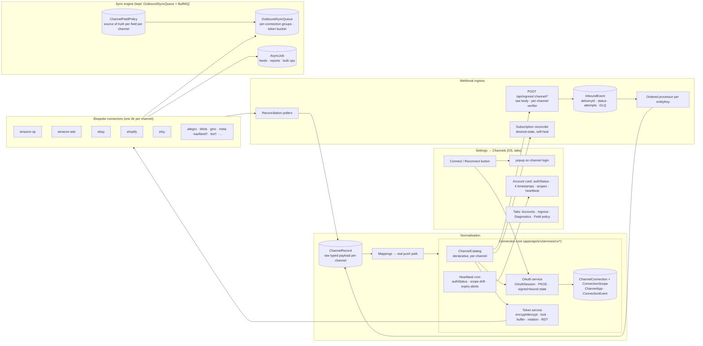

# CX — Channel Connections: Proposal (Phase C)

**Date:** 2026-08-29 · **Status:** PROPOSED — waiting for the Owner's approval before CX.0 · **Inputs:** `docs/2026-08-29-cx-audit.md` (Phase A), `docs/2026-08-29-cx-research.md` (Phase B) and their appendices. Nothing in this document has been built.

**The rules this design is held to** (from the brief): we own everything, no third-party integration infrastructure; the operator experience is *Connect → sign in → Allow*, with a named exception list; maximum scopes on every grant with drift detection; every channel feature reachable through a bespoke connector; a core model that never drops channel fields; honest UI; design system, tabs not routes, verify on prod, commit per verified unit. WooCommerce is out of scope (Owner, 2026-08-29).

---

## 1. Target architecture

### 1.1 One picture

† key-paste exception channels (no operator OAuth exists — §2.3).

### 1.2 The components and why (each references what Phase B found)

**A. `ChannelCatalog` — declarative, in code, one entry per channel** (Nango providers.yaml pattern, R8 #1; Panora metadata, R9). Fields: `authMode` (`oauth2_code | oauth2_pkce | oauth2_cc | api_key | hmac_key`), `authorizeUrl`, `tokenUrl`, `authorizationParams`, `tokenParams`, `refreshParams`, `scopeSeparator`, `requiredScopes` (**maximal**), `reviewGatedScopes`, `codeParamInCallback` (`spapi_oauth_code`), `callbackMetadata` (`selling_partner_id`, `sellerId`), `tokenResponseMetadata`, `regions` + per-region hosts, `refreshTokenLifetime` (eBay 18 mo, Ads 365 d, Etsy 90 d, Allegro 3 mo), `rotatesRefreshToken`, `heartbeat` (the API call that proves the grant), `identity` (the call that names the account), `rateLimit` (header names + model), `signing` (eBay digital signature, Kaufland HMAC, TikTok `sign`), `webhooks` (verifier scheme, subscription API or "portal-only", lifecycle topics), `apiVersion`, `sandbox`, `connectExceptionDoc` for key-paste channels. **Unlike Nango's commerce entries, ours carry rate-limit headers, refresh-token lifetime and region/marketplace ids** (R8 §8). Adding a channel = one catalogue entry + one connector directory; the UI is derived from the catalogue.

**B. Connection store — extend `ChannelConnection`, do not replace it** (MAP stays; rule "extend, don't fork"). Additive columns: `authStatus` (`connected | degraded | needs_reauth | revoked | disconnected`; Apideck state enum, R9), `region`, `credentialsEnc` (one AES-GCM envelope `v2:<kid>:<iv>.<tag>.<ct>` holding access/refresh/RDT-cache; Nango #19), `grantedScopes String[]`, `refreshTokenExpiresAt`, `accessTokenExpiresAt`, `lastRefreshAt`, `lastHeartbeatAt`, `lastInboundAt`, `lastOutboundAt`, `lastErrorAt`, `lastError`, `consecutiveFailures`, `identity Json` (username, sellerId, shop domain), `apiVersion`. Child tables: **`ConnectionScope`** (connectionId, kind `marketplace | shop | profile | storefront`, externalId, label, isActive — one SP-API grant → 11 marketplaces, one Ads grant → N profiles, one TikTok auth → N shops, one Kaufland key → 9 storefronts; this is what `AmazonAdsConnection` and `activeMarketplaces` become); **`ChannelApp`** (channelKey, environment, clientId, `clientSecretEnc`, redirectUris, `secretExpiresAt`, `rotatedAt` — our credentials, never copied into connection rows; R9 Revert; SP-API 180-day rotation, R1 §G); **`OAuthSession`** (id = state, channelKey, `codeVerifier`, `startedByUserId`, `intent` new/reconnect/adopt, `targetConnectionId`, `expiresAt`, `consumedAt`; Nango #5); **`ConnectionEvent`** (connectionId, type `grant | reconsent | refresh | refresh_failed | heartbeat_ok | heartbeat_failed | scope_drift | revoked | disconnected | secret_rotated`, actorUserId, detail Json; Saleor delivery-ledger spirit, R9). The legacy `ebay*` columns and `AmazonAdsConnection` are read-through during migration and dropped in a later, separately approved phase.

**C. Token service** (`services/cx/token.service.ts`) — the **only** code that decrypts. **Encryption is envelope encryption at the enterprise bar (upgraded 2026-08-29):** every credential blob is encrypted with its own AES-256-GCM data key; the data key is wrapped by a **master key held in AWS KMS** (`kms:GenerateDataKey` / `kms:Decrypt` under the AWS account that already serves SQS; key alias `alias/nexus-credentials-<env>`, automatic annual rotation, CloudTrail audit of every decrypt); wrapped keys are cached in memory with a short TTL; the envelope carries the key id (`v2:<kid>:<wrappedDek>.<iv>.<tag>.<ct>`) so rotation never needs downtime; the env-key path (`NEXUS_CREDENTIAL_ENC_KEY`) remains only for local development and as the documented break-glass when KMS is unreachable (alert, never silent). `getAccessToken(connectionId, opts?)`: buffer 15 min (catalogue-overridable), in-process in-flight map, **Postgres advisory lock** keyed on the connection id (we already run pgbouncer-safe transaction locks; Nango's Redis lock is admittedly non-distributed, R8 §8), double-check after lock, rotation = replace refresh token if the response carries one else keep (Etsy/TikTok rotate; Amazon/eBay do not), failure → `consecutiveFailures++`, `lastError`, cooldown 30 s, after N consecutive failures `authStatus = needs_reauth` + writes paused + `ConnectionEvent` + operator alert (Nango #3/#4 with the calendar-day counter fixed). `opts.restricted` mints and caches an SP-API RDT (Airbyte RDT authenticator, R9a #11). Resolver returns rows **without** credentials; callers get a `ConnectionHandle` and ask the token service. Refresh cron = one job over all connections with `accessTokenExpiresAt < now + buffer`.

**D. OAuth service + routes** (`services/cx/oauth.service.ts`, `routes/cx-connect.routes.ts`): `POST /api/cx/connect/:channel/start {intent, targetConnectionId?, region?}` → creates `OAuthSession`, returns `authorizeUrl` (PKCE S256 unless the catalogue says `disable_pkce` — SP-API/Walmart; `prompt=login` where the channel supports it); **`GET /api/cx/callback/:channel`** on the API host consumes the session (single use, TTL 10 min, cookie double-submit **enforced**, session bound to the starting user), exchanges the code, captures callback/token metadata, runs `identity`, applies the MAP fold/adopt/unmatched rules already proven for eBay, records `grantedScopes`, writes `ConnectionEvent`, then renders a DS-styled page that `postMessage`s `{type:'nexus:channel-connected'}` to the opener with an explicit origin, waits for ACK, closes (Nango #7; today's eBay behaviour kept). Popup opened synchronously in the click with same-tab fallback (unchanged). Errors from the provider (`error`, `error_description`) are shown verbatim on the callback page and logged to the session.

**E. Bespoke connectors** (`services/cx/connectors/<channel>/`) — one directory per channel, each exporting the same interface: `describe()` (catalogue entry), `verify(handle)` (heartbeat + identity), `resources` (typed clients generated from the channel's official OpenAPI/JSON schemas — SP-API models, Shopify GraphQL schema, Etsy OAS 3.0.0 (76 paths), eBay OpenAPI — so every endpoint is reachable and typed; rule 5), `signRequest?`, `parseRateLimit(response)`, `webhooks: { verify(raw, headers), route(payload) → {topic, entityKey, connectionScope}, desiredSubscriptions(handle), reconcile(handle) }`, `streams` (Airbyte-style declarative reads with cursor + per-stream state for reconciliation polling), `bulk` (feeds/reports/bulk-ops via `AsyncJob`), `lifecycle` (uninstall/deauth/account-deletion handlers). The existing hand-rolled clients are consolidated behind these directories phase by phase (the 19 Amazon auth sites become one).

**F. Webhook ingress subsystem** — single Fastify plugin `POST /api/ingress/:channel/:topic?` with `addContentTypeParser` **scoped to that prefix** capturing the raw buffer (S9), per-channel verifier from the connector (Shopify HMAC over raw body + `timingSafeEqual`; eBay ECDSA against `getPublicKey(kid)` with key cache; Kaufland HMAC; bol RSA; Meta `X-Hub-Signature-256`; TikTok HMAC; Etsy Standard-Webhooks; Amazon SQS poll dedupes on `NotificationId` and validates the SNS envelope where present), **fail-closed** (503 when the secret/app is missing — never "skip when unset"). `InboundEvent` (extends `WebhookEvent` additively: `deliveryId` unique per channel, `connectionId`, `topic`, `entityKey`, `status queued|processing|done|failed|dead`, `attempts`, `nextRetryAt`, `deadAt`, `processedAt`, `rawHeaders`, `signatureOk`) persisted **before** processing; a BullMQ worker processes ordered per `entityKey` with backoff and dead-letter; replay endpoint re-runs a stored event or re-fetches from the channel; **subscription reconciler** on connect + nightly (Shopify `webhookSubscriptions` diff → create/update/delete, R9 Shopify `register.ts`; eBay Notification API destination + subscriptions; SP-API destination + per-type subscriptions, already boot-healed); reconciliation pollers per channel (`streams`) close the gap when webhooks are missed (SP-API's own advice, R1 §D). Lifecycle topics (`app/uninstalled`, `MARKETPLACE_ACCOUNT_DELETION`, `SELLER_DEAUTHORIZATION`) flip `authStatus = revoked`; Shopify compliance topics write a `DataRequest` ledger row.

**G. Sync engine — keep the real one, retire the ghosts.** `OutboundSyncQueue` + BullMQ + the 60-s autopilot stay (they are the one live engine, A5 E12). Additions: per-`(channel, connectionId)` BullMQ group concurrency and a per-connection token bucket fed by `parseRateLimit` (Shopify `throttleStatus`, SP-API `x-amzn-RateLimit-Limit`, eBay daily quota, Etsy `x-remaining-*`); `AsyncJob` table (kind `feed | report | bulk_query | bulk_mutation | data_kiosk`, connectionId, externalId, status map, pollAfter, downloadUrl, resultDigest — Airbyte `AsyncRetriever`, R9a #8) replacing the three bespoke job tables over time; `ChannelFieldPolicy` (channel, marketplace?, field, sourceOfTruth `pim | channel`, conflict rule) so "PIM is master for X, channel for Y" is data, not 28 files; idempotency key = queue row id passed to channels that support it (Shopify `@idempotent`, S17/B3-17); `ChannelPublishAttempt` stays as the dry-run/live audit. The Phase-27 no-send lane, `inbound-sync.service`, `variation-sync-processor`, `unified-sync-orchestrator`, `marketplaces.ts`+`marketplace.service` are deleted (A5 dead table).

**H. Normalisation — invert the unified-model premise.** `ChannelRecord` (connectionId, scopeId?, entityType `product | variant | offer | order | return | payout | …`, externalId, `raw jsonb` typed per channel by generated TS types, `rawHash`, `fetchedAt`, `sourceEventId`, `deletedAt`; unique on (connectionId, entityType, externalId); Nango records #11 + Supaglue raw-beside-mapped) is the per-channel truth; core `Product/Variant/ChannelListing/Order` rows are **derived** by mappers that can be re-run, and every derived row carries `channelRecordId`. Nothing is dropped: the raw is queryable and the UI's "Channel data" tab shows it. `ChannelSchema` (536 rows already) becomes the writable-field catalogue per channel × product type and `Marketplace.schemaMapping` rules are wired into the **real** push builders (today they reach only the no-send lane, A5 §2.5). Generation-based delete detection (Nango #12) marks records no longer present on the channel.

**I. UI — Settings → Channels rebuilt on the design system, tabs not routes.** `/settings/channels` tabs: **Accounts** (one card per account: channel logo, identity, `authStatus` pill, four timestamps, scopes with drift → "Reconnect to grant new permissions", region/scopes chips, Test/Diagnose/Reconnect/Disconnect), **Connect** (grid from the catalogue; each channel's button opens the popup; key-paste exceptions show the DS form with the deep link, format validation and an immediate verify), **Ingress** (InboundEvent list, replay, subscription status per account, DLQ), **Diagnostics** (runs the heartbeat + one read per capability live, shows rate-limit headroom, last calls from `OutboundApiCallLog`). Amazon Ads moves onto the same Accounts tab as an `amazon-ads` channel (the manual form is deleted; `/settings/advertising` keeps mode/writes controls and links to Channels). One disconnect path: revoke at the channel + null credentials + `ConnectionEvent` + blast-radius confirm (MAP.4 kept).

### 1.3 Decisions taken from Phase B and why
- **Callback on the API host, not a web page** — one fewer browser hop, no CSRF-exposed `POST /callback` from the page, the session cookie is set and verified by the same host, and the catalogue can hold one allow-listed URI per channel. eBay keeps working through the web page until its RuName is re-pointed (open decision §5.1).
- **Postgres advisory locks + BullMQ**, not a new task table — Nango's Postgres scheduler (R8 #14) is the better design, but we already run BullMQ with a DB backstop and a janitor; the missing pieces (group concurrency, token buckets, `AsyncJob`) are additive. Revisit only if BullMQ becomes the bottleneck.
- **Bespoke connectors, generated types** — rule 5 forbids a lowest-common-denominator layer; generating clients from the channels' own schemas is how "every feature" stays true as APIs move.
- **`ChannelRecord` first** — every unified vendor in B2 lost fields and bolted a mapping layer on afterwards; two of three OSS clones are archived. Raw-typed-first is the only model that cannot lose a field.
- **Maximal scopes** (rule 4) with `reviewGatedScopes` listed per channel so the UI can say exactly what is missing and why.

---

## 2. The connect flow, channel by channel

Common path (all Tier-1): *Settings → Channels → Connect → "Connect eBay" → popup opens synchronously on the channel's login → operator signs in → consent screen shows every scope we request → redirect to `GET /api/cx/callback/:channel` → identity call → card appears with `authStatus = connected`, scopes recorded, heartbeat scheduled, subscriptions reconciled.* Anything more is a defect unless listed in §2.3.

### 2.1 Tier 1 (existing channels)
| Channel | Flow specifics | Prerequisite the Owner must do once (outside code) | Scopes we ask for |
|---|---|---|---|
| **eBay** | as today, moved onto the shared service; `prompt=login`; identity via `commerce/identity`; re-consent folds by `externalAccountId` (MAP.4 rules kept); **max scopes** → existing accounts show "Reconnect to grant new permissions" until re-consented | keep production keyset; re-point the RuName accept URL to the API callback (§5.1); confirm the Marketplace Account Deletion endpoint is set to the new ingress | every `sell.*`, `commerce.*` scope the keyset is eligible for (R2 list); review-gated ones listed on the card |
| **Amazon SP-API** | **new**: public-app OAuth via Seller Central consent (`application_id`, `state`, `version=beta` while draft) → `spapi_oauth_code` (5 min) → LWA exchange; `selling_partner_id` captured from the callback; region chosen on the Connect card (EU default); `getMarketplaceParticipations` populates `ConnectionScope`; the env-managed row becomes an `oauth` row on first connect (adopt); yearly re-auth surfaces 30 days ahead | register the app in the Solution Provider Portal with **every role** we are eligible for (Product Listing, Inventory & Order Tracking, Pricing, Amazon Fulfillment, Buyer Communication, Buyer Solicitation, Finance & Accounting, Brand Analytics, Selling Partner Insights, Account Information SP, Notifications in Seller Central, Direct-to-Consumer Shipping + Tax Invoicing as **restricted**), redirect URI = API callback, LWA client id/secret into `ChannelApp`; choose public (OAuth) so a second seller account can connect | all roles above; restricted roles gated by Amazon's PII review — shown as "pending approval" on the card |
| **Amazon Ads** | the existing route rebuilt on the shared service: LWA at `eu.account.amazon.com/ap/oa`, scope `advertising::campaign_management` (+ `advertising::test:create_account`, `advertising::audiences` if approved), PKCE; `/v2/profiles` per regional host → `ConnectionScope` per profile (replaces `AmazonAdsConnection`); 365-day expiry tracked | Ads console: allowed return URL = API callback; existing manual rows adopted by profile id | campaign_management + test + audiences |
| **Shopify** | **new**: Dev Dashboard app with **Custom distribution** (no review); Connect card asks for the shop domain (validated by the anchored regex), then auth-code grant → `X-Shopify-Access-Token`; `app/uninstalled` + `app/scopes_update` handled; compliance topics registered; per-shop webhook subscriptions reconciled; second shop = second custom app (unless Plus org) **or** client-credentials grant for stores in the same Dev Dashboard org (open decision §5.3) | create the app in the Dev Dashboard, redirect URL = API callback, client id/secret into `ChannelApp`, generate the custom install link per store | every `read_*/write_*` scope in R3 §B except payments-partner/Plus-only; `read_all_orders` requested |
| **Etsy** | **new**: Seller App (own shop, approved in minutes); PKCE mandatory; refresh rotates every hour-refresh — token service handles; 4 order webhooks registered in the Etsy portal (no API) pointing at the ingress; polling streams for listings/inventory/ledger; FR/DE address-field gating probed after connect and shown honestly | register the Seller App, callback URL exact-match = API callback, keystring into `ChannelApp`, add the four webhook endpoints in the Etsy portal | `listings_r listings_w listings_d shops_r shops_w transactions_r transactions_w email_r address_r` (the 9 that any endpoint uses) |

### 2.2 Tier 2 (new channels with real OAuth) — each is its own phase after CX.8
Allegro (auth-code + PKCE, device flow for headless; poll event streams), TikTok Shop (auth_code → `token/get`, signed calls, 16 webhooks, `shop_cipher` scopes), Google Merchant Center (Google OAuth `content` scope; developer registration; product notifications), Meta catalog (Login for Business, system-user token; App Review + Business Verification are one-time Owner tasks), OTTO **as a Service Partner** (auth-code `installation partnerId`).

### 2.3 The exception list (channels that physically offer no operator OAuth) — least-friction design
| Channel | What the operator does | How we make it trivial |
|---|---|---|
| Kaufland | copy Client Key + Secret Key from `sellerportal.kaufland.de/settings/api` | DS form with the deep link, hex-looking secret validation, immediate `GET /v2/info/storefront` verify → storefronts become `ConnectionScope`; push-notification subscriptions created automatically |
| bol.com | copy Client ID + Secret (Seller Dashboard → Settings → Services → API Settings) | form + verify (token + `GET /retailer/orders`); Subscriptions v11 created automatically with RSA-key verification |
| Mirakl instances | instance URL + API key (+ shop_id) per operator | one form per marketplace, `GET /api/account` verify, channels listed as scopes |
| Cdiscount / Octopia | clientId + clientSecret (+ SellerId) from the seller portal | form + verify |
| Zalando zDirect | invitation from the Fashion Partner, then client id/secret | form + verify; documented as "invite-gated" |
| ManoMano, eMAG | API key / Basic auth (+ IP allowlist) | form + verify; docs partially unverified — marked so on the card |
| OTTO (if we do **not** register as Service Partner) | client id/secret self-app | form + verify |

Every exception card states in one sentence *why* there is no sign-in button (rule 3), links the exact settings page, validates the key format before saving, encrypts on save, and runs the verify call before showing "Connected".

---

## 3. Keep / refactor / delete, with the migration path

### 3.1 Keep (unchanged or extended)
`ChannelConnection` + MAP.2a/2b/3/4 (resolver, AccountsPanel, primary/adopt rules, `ChannelConnection_active_account_key`), `OutboundSyncQueue` + `OutboundSyncService` + BullMQ + autopilot + janitor, `sync-control-core` quantity resolver + `SyncChannelPolicy`, `ChannelPublishAttempt` audit, `OutboundApiCallLog`, `ChannelStockEvent` drift triage, `amazon-eu-quantity-guard`, publish gates, `ChannelSchema` + PIM mappings UI, `AccountsPanel` (DS), `api/lib/crypto.ts` (upgraded to `v2` envelope with key id), `api/lib/auth/oauth-state.ts` (retired in favour of `OAuthSession` once eBay is on the shared service), the SQS poll job (becomes an ingress source), the Ads API client's quota ledger and retry (model for the others).

### 3.2 Refactor (moved behind the new core)
The eBay connect/callback/refresh/revoke code → `connectors/ebay` + shared services; the 14 `SellingPartner` constructions + 5 LWA exchanges → `connectors/amazon-sp` token service; `AmazonAdsConnection` → `ChannelConnection(channel='AMAZON_ADS')` + `ConnectionScope` per profile (additive migration + backfill, dual-read for one release); `WebhookEvent` → `InboundEvent` (additive columns; existing rows keep working); the 7 Shopify clients → `connectors/shopify`; `ebay-notification.routes.ts` receivers → ingress; `settings/channels` screens → DS tabs; `settings/advertising` manual form → Connect button; AccountsPanel disconnect → one revoke path.

### 3.3 Delete (dead, broken or harmful — evidence in the audit §4)
`amazon-auth-probe.routes.ts`, `/api/amazon-ads/debug/test-auth`, `webhooks.routes.ts` public stock routes, `etsy-webhooks.ts` (fictional), `woocommerce*` (out of scope — **park or delete, §5.5**), `sync/unified-sync-orchestrator.ts` + `product-sync.service.ts` + `sync/index.ts`, `marketplaces.ts` + `marketplace.service.ts`, `inbound-sync.service.ts` + route + Next proxy + unmounted button, `outbound-sync-phase9.service.ts` (fold `markSync*`), `variation-sync-processor.service.ts`, the Phase-27 `channel-sync` lane (repoint "Sync all" at `OutboundSyncQueue`), root `amazon-sync.service.ts` status/retry endpoints + the fabricating Next routes + `SyncStatusModal`, `services/marketplaces/ebay.service.ts` (app-token client) after its callers move, `services/ebay-sync.service.ts` (wrong endpoint), `sync-monitoring.service.ts` + `monitoring.routes.ts` + the two unmounted dashboards, `RealTimeStockMonitor.tsx`, `packages/shared/vault.ts`, the shadowed/unmatched manifest entries, 11 dead docs (A6 §3), `ChannelConnection.ebay*` columns and `MarketplaceSync`/`Channel`/`Listing` tables (**destructive — proposed separately, §5.6**).

### 3.4 Migration path (additive first; destructive waits)
1. **CX.1 migration (additive, pre-approved class):** new columns on `ChannelConnection`; new tables `ConnectionScope`, `ChannelApp`, `OAuthSession`, `ConnectionEvent`; backfill `credentialsEnc` from the plaintext columns and `authStatus` from `isActive`/`lastSyncStatus`; code reads `credentialsEnc` first, falls back to plaintext, and **stops writing plaintext**; plaintext columns nulled by a follow-up job once every active row has `credentialsEnc` (row-count-exact gate, MAP precedent).
2. **CX.3 migration (additive):** `ChannelConnection` rows for `AMAZON_ADS` + `ConnectionScope` per profile backfilled from `AmazonAdsConnection`; dual-read; Amazon env row converts to `oauth` on first connect.
3. **CX.4 migration (additive):** `WebhookEvent` gains the `InboundEvent` columns; existing 5,158 rows get `status='done'`.
4. **CX.7 migration (additive):** `ChannelRecord`, `ChannelFieldPolicy`, `AsyncJob`, `channelRecordId` FKs (SET NULL).
5. **Destructive (each its own approval):** drop `ebay*` columns; drop `AmazonAdsConnection`; drop `MarketplaceSync`, `Channel`, `Listing`; drop `EbayPushJob`/`AmazonFlatFileFeedJob` after `AsyncJob` parity.

---

## 4. Phased plan — each phase ships and is verified on prod alone

| Phase | Scope | Files (new / touched) | Migration | Verification on prod (real accounts, no mocks) | Risks · rollback |
|---|---|---|---|---|---|
| **CX.0 — Stop the bleed** (security, ≤1 day) | Delete S5 probe + S16 debug route; guard or delete S1 public stock routes; delete the fictional Etsy receiver (S2); put Ads `/connect` behind `channelsConnect` and make the callback reject a missing/unknown `state` (S4); register a raw-body parser for `/webhooks/*` + `/api/webhooks/*` and switch Shopify/eBay/Sendcloud verifiers to it with `timingSafeEqual` (S9); fail-closed on missing secrets (S6/S7/S12); revoke-on-disconnect in `accounts.routes.ts` (S11); pino `redact`; remove the 20-char token echo (S19); remind the Owner to rotate the Neon password (S3, outside code) | `routes/{amazon-auth-probe,amazon-ads-auth,webhooks,etsy-webhooks,ebay-notification,shopify-webhooks,accounts}.routes.ts`, `permissions-manifest.ts`, `index.ts` (parser), `utils/webhook.ts`, `utils/logger.ts` | none | curl each removed/guarded route → 404/401; replay a real Shopify webhook with the raw signature (dev store) → 200; eBay challenge still answers; AccountsPanel disconnect on `motovento` → eBay revoke confirmed by a failing token test, then reconnect | low; revert commit |
| **CX.1 — Connection core** | `ChannelCatalog` (eBay, Amazon SP, Amazon Ads, Shopify, Etsy entries); token service with encryption v2 + advisory lock + rotation + RDT; `OAuthSession`, `ChannelApp`, `ConnectionScope`, `ConnectionEvent`; `authStatus` + four timestamps + scope recording; heartbeat cron (eBay `commerce/identity`, Amazon `getMarketplaceParticipations` → `ConnectionScope`); eBay connect/callback/refresh/revoke moved onto the shared service with **maximal scopes**; refresh-token expiry tracked; alerts on `needs_reauth` and 30-day expiry; resolver stops returning credentials | new `services/cx/{catalog,token,oauth,heartbeat,events}.service.ts`, `routes/cx-connect.routes.ts`, `connectors/ebay/*`; touched `ebay-auth*.ts` (thin shims), `connection-resolver.service.ts`, `accounts.routes.ts`, `connections.routes.ts`, schema + migration | additive (§3.4.1) | reconnect `xaviaracing` on prod through the new popup → card shows real identity, **all granted scopes**, `refreshTokenExpiresAt`; DB shows `credentialsEnc` `v2:` and plaintext nulled; `ebay-financial-sync` succeeds the next night (proof the scope gap closed); two concurrent forced refreshes → one token exchange in `OutboundApiCallLog`; heartbeat row + `ConnectionEvent` rows; Amazon scopes list 11 marketplaces | medium (token path): dual-read fallback + feature flag `NEXUS_CX_TOKEN_SERVICE=0` routes back to the old `getValidToken`; migration is additive |
| **CX.2 — Channels UI on the DS** | `/settings/channels` tabs Accounts / Connect / Diagnostics; honest card (authStatus, four timestamps, scopes + drift, region/scopes chips, heartbeat result); Reconnect-for-scopes; one disconnect path; diagnostics panel runs live calls; Amazon Ads card on the same page, manual form removed; every control DS; "Coming soon" cards replaced by catalogue-driven Connect buttons (disabled with the reason until the connector phase ships) | `web/app/settings/channels/*` (rewritten on DS), `design-system/components/*` reuse, `routes/connections.routes.ts` | none | screenshots of every state on prod (connected, needs_reauth, revoked, key-paste exception); contrast/keyboard checks per DS guards; the card's "Last inbound" matches the newest `InboundEvent`; Test on Amazon runs a real `getMarketplaceParticipations` | low; feature flag on the page |
| **CX.3 — Amazon SP-API OAuth + Ads Connect** | `connectors/amazon-sp` (public-app consent flow, `spapi_oauth_code`, `selling_partner_id`, region, participations → scopes, yearly re-auth, LWA secret-rotation listener) and `connectors/amazon-ads` (shared OAuth, profiles → scopes, 365-day expiry); env row adopted; 19 auth sites → token service; SNS/queue policy verified | new connector dirs; touched `lib/amazon-sp-client.ts`, `clients/amazon-sp-api.client.ts`, `ads-api-client.ts`, `advertising.routes.ts`, `settings/advertising/page.tsx`, boot seed removed | additive (§3.4.2) | **Owner prerequisite:** app registered in SPP with all roles, redirect = API callback. Then: Connect Amazon on prod → consent on Seller Central → card shows seller id + 11 marketplaces; every existing Amazon cron runs green on the new token path for 24 h; Connect Amazon Ads → 9 profiles appear as scopes; bid engine writes continue (`lastWriteAt` advances) | medium: env token kept as fallback for one release; per-file flag |
| **CX.4 — Webhook ingress** | `POST /api/ingress/:channel/*` with raw body; verifiers (eBay ECDSA + `getPublicKey`, Shopify, Amazon SQS envelope/dedupe, Ads AMS persistence); `InboundEvent`; ordered processor + retry + DLQ + replay; subscription reconciler (eBay Notification API destination + topics incl. `MARKETPLACE_ACCOUNT_DELETION`; SP-API `ORDER_CHANGE` with filter + listing types; Shopify per-shop diff); lifecycle → `authStatus`; Ingress tab in the UI | new `routes/cx-ingress.routes.ts`, `services/cx/ingress/*`, `jobs/ingress-processor.job.ts`, `jobs/subscription-reconcile.job.ts`; touched SQS poll job, `ebay-notification.routes.ts` (retired) | additive (§3.4.3) | eBay sends a real `marketplace.order.created` (buy a test item on `motovento`) → InboundEvent verified `signatureOk`, order upserted, card "Last inbound" updates; eBay account-deletion test notification passes; SP-API `LISTINGS_ITEM_STATUS_CHANGE` subscription created and fires on a real listing edit; forged signature → 401 and no row; DLQ shows a deliberately failed event and replays | medium: old receivers stay registered behind a flag for one release |
| **CX.5 — Shopify connector** | Dev Dashboard custom app; auth-code connect with shop-domain validation; typed GraphQL client (2026-07), bulk operations via `AsyncJob`, inventory CAS + idempotency, markets/catalogs/price lists, metafields, translations; compliance + uninstall topics; reconciliation streams; the 7 old clients consolidated | `connectors/shopify/*`; touched image/publish/outbound Shopify paths | none beyond CX.4 | **Owner prerequisite:** app + custom install link. Connect the real store on prod → card shows shop domain + scopes; `products/update` webhook arrives verified; a real inventory set round-trips (`compareQuantity`); bulk product query completes as an `AsyncJob`; uninstall/reinstall flips `authStatus` | low-medium; Shopify writes stay behind the existing publish gate |
| **CX.6 — Etsy connector** | Seller App + PKCE; rotation-safe refresh; polling streams (receipts by `min_last_modified`, listings by state, batch inventory, ledger); four portal webhooks; listing writes (create/update/inventory/images/variation images/translations/personalization); FR/DE gating probe | `connectors/etsy/*`; old `etsy*` files deleted | none | **Owner prerequisite:** Seller App approved, webhooks added in the portal. Connect the real shop → identity; a real `order.paid` webhook arrives verified; hourly refresh rotates and the new refresh token is stored; a listing edit round-trips | low |
| **CX.7 — Normalisation layer** | `ChannelRecord` + generated types; derived-core mappers with `channelRecordId`; `ChannelFieldPolicy`; mappings wired into the real push builders; "Channel data" tab on the product; delete-detection by generation; retire ghost engines (§3.3) | `services/cx/records/*`, `services/cx/mappers/*`, push builders, product UI tab | additive (§3.4.4) | for each connected channel: pull → `ChannelRecord` count equals the channel's own count; a field that today is dropped (Shopify `vendor`, eBay `lineItems[].listingMarketplaceId`, Amazon `IsBusinessOrder`) is visible on the product's Channel data tab; a mapping rule changes the real Amazon payload (`ChannelPublishAttempt` digest changes) | medium: mappers run in shadow mode first, diff logged |
| **CX.8 — Sync engine hardening** | per-connection concurrency groups + token buckets fed by rate-limit headers; `AsyncJob` for SP-API feeds/reports, Shopify bulk, eBay Feed; `DeprecationWatch` job (headers + SP-API schedule); contract tests on recorded fixtures per connector version; sandbox-connect mode | `lib/queue.ts`, `bullmq-sync.worker.ts`, `services/cx/jobs/*`, tests | additive | a 429 storm on prod is absorbed (headroom visible on Diagnostics, no dead letters); an SP-API report runs end to end as an `AsyncJob`; deprecation alert fires on a known-deprecated call | low |
| **CX.9…n — New channels** | one phase each in this order (Owner to confirm): Allegro → TikTok Shop → Google Merchant Center → Meta catalog → Kaufland (exception) → bol.com (exception) → OTTO (Service Partner) → Mirakl instances (exception) | `connectors/<channel>/*` + catalogue entry | none | real connect on prod per channel; one inbound event; one outbound write | per channel |

Each phase: proposal of the exact change → build → self-verify on prod with real connects/webhooks and screenshots → commit + push (pre-push guards intact) → report what was and was not verified.

---

## 5. Decisions — **all twelve DECIDED per the recommendation (Owner, 2026-08-29: "I'll go with your recommendations")**

The recommendation in each item below is now the decision; the alternative is recorded for the audit trail only.

1. **Callback host.** *Recommend:* API-host `GET /api/cx/callback/:channel` for every channel, including eBay (Owner re-points the RuName accept URL once). *Alternative:* keep the web callback page for eBay only — two code paths forever.
2. **Amazon SP-API app type.** *Recommend:* **public app** in the Solution Provider Portal (OAuth consent, 25 authorisations, second seller account possible, required for rule 3). *Alternative:* private/self-authorise (paste a refresh token — violates rule 3, and only the primary user can do it).
3. **Shopify auth path for the merchant's own stores.** *Recommend:* **custom-distribution app + authorization-code grant** (real consent screen, non-expiring offline token, protected data always available). *Alternative:* client-credentials grant (no consent screen, 24 h tokens, requires app and store in the same Dev Dashboard org; store-count limit unverified).
4. **Etsy app tier.** *Recommend:* **Seller App** now (own shop, minutes). Personal/Commercial only if other sellers' shops must connect.
5. **WooCommerce code.** *Recommend:* **delete** in CX.0/CX.5 (S7 + broken ingest + no rows on prod). *Alternative:* park behind a flag.
6. **Destructive drops** (`ebay*` columns, `AmazonAdsConnection`, `MarketplaceSync`, `Channel`/`Listing`, bespoke job tables). *Recommend:* one approval each, after the additive phase that replaces them has run green for a week.
7. **Queue.** *Recommend:* keep BullMQ + additive groups/buckets. *Alternative:* Nango-style Postgres task table (cleaner, larger rewrite).
8. **OTTO.** *Recommend:* register as a Service Partner (true OAuth for the operator). *Alternative:* key-paste self-app on the exception list.
9. **Raw-event retention.** *Recommend (upgraded 2026-08-29 to the enterprise bar):* **archive, never delete** — `InboundEvent.payload` and superseded `ChannelRecord.raw` versions move to object storage (S3-compatible, bucket per environment, server-side encrypted, 7-year lifecycle) after 90 days; the ledger row keeps a pointer + digest so every event stays auditable and replayable; `ChannelRecord.raw` current version kept while the entity exists. (Saleor's delete-after-period is the recorded anti-pattern.)
10. **Amazon Ads placement.** *Recommend:* on the Channels page as an account (one connect experience); `/settings/advertising` keeps engine controls only.
11. **Order of new channels (CX.9+).** *Recommend:* Allegro, TikTok Shop, Google Merchant Center, Meta catalog, then the exception channels by revenue.
12. **The `ORDER_STATUS_CHANGE` gap.** Amazon removed it 2026-07-29 (prod stopped that day); *Recommend:* CX.4 subscribes `ORDER_CHANGE` with `eventFilter` immediately — flag it now so the Owner knows the notification loss predates this programme.

**Status 2026-08-29:** proposal approved with every decision taken per recommendation. Next: CX.0 proposed as an exact change in `docs/2026-08-29-cx0-security-stop-the-bleed.md`; nothing is built until that is approved.
