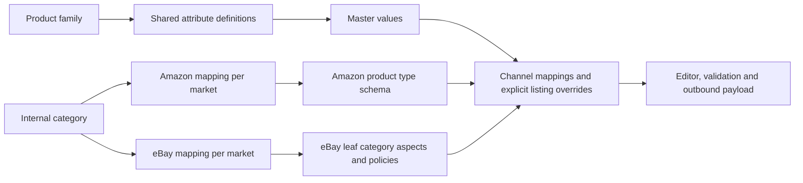

# Product editor attribute audit and recommended model

> Historical snapshot from the initial review. The approved implementation subsequently changed the model and counts. See [the implementation and acceptance record](2026-09-05-product-attribute-foundation.md) and [current field inventory](2026-09-05-product-attribute-inventory.md) for the latest state.

Reviewed 2026-09-05 against the running local API and editor, the source code, and official marketplace documentation. Live fixture: GALE-JACKET, 21 rows, Italy, Amazon OUTERWEAR and eBay category 177104. This is a review of the current implementation and those loaded schemas, not certification of every marketplace category or outbound payload.

## Recommendation

Build the shared product model and the category mappings together before expanding the taxonomy. Use a **product family** to define the shared attribute set, a **category tree** for classification, and **channel × market category mappings** to select marketplace schemas. Selecting a category can suggest the family and marketplace mappings, but moving a product between merchandising categories must not silently change its family or discard its values.

The repository already has `ProductFamily`, `CustomAttribute`, `AttributeGroup`, `FamilyAttribute`, additive family inheritance, `Category`, `ProductCategory`, `CategoryClosure`, and `CategoryChannelMapping`. Extend these. A second taxonomy or attribute registry would create the duplication this review is meant to remove. Here “product family” means the attribute template, distinct from the editor's parent-and-variation grouping.

This is consistent with the separation between families and categories in [Akeneo's catalog model](https://api-prd.akeneo.com/concepts/catalog-structure.html). Amazon definitions depend on product type and store, with seller-specific configuration and parentage also relevant; retrieve the applicable definition rather than treating OUTERWEAR or a browse node as a universal category. See [Amazon's definition retrieval documentation](https://developer-docs.amazon/sp-api/docs/retrieve-a-product-type-definition). eBay item specifics depend on the selected leaf category; [eBay's category workflow](https://developer.ebay.com/api-docs/sell/static/metadata/sell-categories.html) explicitly places aspect discovery after category selection.

## Measured findings and implemented changes

| Scope | Before | After | Interpretation |
| --- | ---: | ---: | --- |
| Master | 185 columns | 188 columns | Restored Armor Type, CE Certification and Waterproof; marketplace support must not determine whether an internal product fact exists. |
| Amazon · IT | 186 columns | 161 columns | All 107 loaded top-level schema attributes still represented by 160 columns, plus SKU. Removed 25 unlinked Master controls. |
| eBay · IT | 83 columns | 46 columns | All 20 cached aspects and 25 modeled listing fields retained, plus SKU. Removed 37 unlinked Master controls. |

The browser uses SKU in the Product identity band, so its All attributes counts are 160 for Amazon and 45 for eBay. Expanded lists and compounds mean column counts are not attribute counts. eBay's 45 is **not** a claim that eBay has only 45 supported fields.

- eBay previously displayed ten bullet fields, search keywords, Amazon ASINs, FBA/FBM, Buy Box/competitor pricing, and other Master fields without a corresponding eBay schema field. Channel columns now come from that channel's declarations, with SKU retained as context.
- Brand displayed `platformAttributes.itemSpecifics.Marca` on eBay but advertised a write to `Product.brand`. Channel Brand now reads and writes the channel layer through `attr_brand`; Amazon's shared native facts likewise use channel overrides. In the measured responses, no editable channel cell advertises a Master write.
- Amazon exposed five identical “Other Image Location” labels and eight identical “Other Image URL” labels. Each is now numbered. Distinct image slots remain independently addressable. eBay's duplicate Length and Width headers disappeared with the unrelated Master dimension controls.
- Master no longer drops internal category attributes when no marketplace declares them. Their declared product-type applicability is preserved.
- The legacy `productType` field is explicitly labeled **Amazon product type (default)** in Classification. It is not an internal taxonomy category or an eBay category.
- Product and category identity come before content, specifications, variations, images, compliance, offers and shipping. eBay's former Listing bucket is divided into Classification, Content, Variations, Images and media, Offer, Shipping and Policies; item specifics stay together. Empty groups are removed. Required fields stay together within their group; Title precedes Description.
- The browser no longer reranks the full sheet using the Essentials preset, which previously split groups and moved Condition ahead of Category. The default sheet, column picker and exports use the same server order. Explicit personal layouts remain personal layouts.
- Mapping resolution previously reported OUTERWEAR as the eBay category, and the sheet pinned every channel's rule set to the Master Amazon product type. Existing listing category/type now takes precedence for the mapping preview; the generic productType fallback is Amazon-only. All 21 measured eBay rows now resolve to 177104 with listing provenance.
- eBay's explicit category requirement/cardinality takes precedence over marketplace-wide fallback metadata. Recommended aspects are `bestPractice`, not `requiredIfRelevant`; they are not hard requirements.

No stored product values were migrated, no marketplace listings were published, and no existing personal layout was overwritten during verification.

## What still prevents an “everything is complete” claim

| Gap | Evidence in current code | Required implementation |
| --- | --- | --- |
| Master is partly an Amazon attribute union | `getSheetColumns()` loads `getAvailableFields({ productTypes, channels })` and adds channel specs; it does not load the family's effective `FamilyAttribute` set. | Serve universal fields plus the effective product-family schema. Keep channel defaults explicitly identified during migration. |
| Existing native product facts are absent from this sheet | Product has `hsCode`, `countryOfOrigin`, `ppeCategory`, `garmentClass`, notified-body details, declaration URL and structured `impactProtectors`; the sheet registry does not declare them. | Add the relevant family fields through their existing canonical stores, with structured editors where needed. Do not create another text copy of these facts. |
| Semantic duplicates remain across stores | Product `countryOfOrigin` versus Amazon `country_of_origin`; Product weight/dimensions versus channel item/package measures; simplified armor attributes versus structured protectors. | Define explicit semantic mappings and units, detect conflicting existing values, and reconcile before retiring aliases. Item and packaged dimensions are distinct concepts and must remain distinct. |
| Category selection does not yet drive every consumer consistently | Studio column builds start from `Product.productType`; eBay categories come from listing bags. Mapping preview now resolves listing/taxonomy categories. Bulk write validation rebuilds schemas without the listing's eBay leaf ids. | Pass one resolved category context through columns, row applicability, mapping, write validation, readiness and export/publish. Cover new listings, listing overrides and mixed-category families. |
| eBay cache union loses category-specific constraints | `loadEbaySpec()` unions aspects across categories, keeps the first matching aspect and first condition list, and can use marketplace-wide fallback aspects. | Preserve separate specs per leaf category and expose missing/partial/stale schemas. A field required in one category must not become required in every row. |
| eBay listing coverage is curated, not exhaustive | `ebaySpecFromCache()` models 25 listing fields. Price and quantity already exist on `ChannelListing`/row listing data but are not native editable eBay attribute columns; identifier and regulatory/policy capabilities need a systematic coverage audit. | Inventory supported Inventory/Trading/Metadata capabilities against actual read/write/publish paths. Expose fields using the existing listing stores. The aspect API alone is insufficient. |
| Raw marketplace representations need normalization | Adapter enums are Inventory-style; existing eBay stores/caches can contain Trading-style condition ids, format and duration values. | Choose a canonical representation and convert at API boundaries. Resolve policy ids to readable policy names. |
| Conditional and nested schema coverage is not proven by a column count | Amazon adapter classifies top-level attributes and conditional candidates; eBay cache metadata is incomplete. | Evaluate full conditional requirements on the effective row/payload, and test lossless nested arrays, selectors, measures and compound round trips. |
| Schema freshness and no-category cases need explicit UX | Amazon cache used here was fetched September 4; eBay cache August 20. A fallback aspect set is not proof of the chosen category's current requirements. | Cache version/checksum, category, market, locale, fetch time and seller context; refresh separately from keystrokes, show incomplete metadata honestly, and revalidate before publication. |
| Variation identity is inconsistent | The measured family advertises both Size/Color and Taglia/Colore axes, with sparse stored axis values. | One canonical axis identifier with localized labels; validate parent/child and listing-family axis mappings without silently merging different concepts. |

These are implementation gaps, not requests to fill invented fields. In particular, this review does not assert that a product is legally compliant or that a cached schema guarantees marketplace acceptance.

## Target attribute organization

| Shared Master group | Examples and ownership |
| --- | --- |
| Identity | SKU, internal name, brand, manufacturer, model/part identifiers, lifecycle |
| Classification | Product family, primary internal category, other category memberships; channel assignments are separate |
| Content | Localized title, description, feature bullets, search terms |
| Specifications | Family-specific material, construction, color, sizing, fit, care and performance |
| Variations | Canonical variation axes, child identifiers and family relationships |
| Media | Gallery, swatch, documents, video and shared assets |
| Dimensions and packaging | Item measurements and packaged measurements, each with units |
| Compliance and traceability | Applicable existing origin, customs, certification, protective-gear and responsible-party records |
| Commercial defaults | Cost and shared pricing/inventory inputs; actual marketplace offers belong to listings |

Amazon presents its selected product-type attributes, product identity/browse assignments, listing content, variations, images, applicable compliance data, offer and fulfillment. eBay presents its selected leaf category, content, category item specifics, variation details, media, offer/condition, shipping and policies. Every required or optional supported field remains available; task filters may narrow the view without redefining the schema.

Use one canonical semantic field across families and map it to channel fields explicitly. Shared content inherits to a listing until an explicit override is set; restoring inheritance is a distinct action. Do not merge fields just because translated labels match. UPC/EAN can be representations of a GTIN, while an ASIN is a channel identifier; package weight is not item weight; an eBay garment Length aspect is not necessarily a package length.

## Recommended implementation sequence

1. Establish the canonical shared attribute dictionary and effective family schema for the product types actually sold. Reuse the existing family and custom-attribute models, distinguish real duplicate stores, and record conversion/conflict rules.
2. Complete the relevant internal category branches and their reviewed Amazon/eBay mappings per market. Connect category/family selection to the editor. Existing listing assignments remain explicit overrides; category changes retain historical values and show what becomes relevant or invalid.
3. Carry that resolved context through all attribute consumers. Finish eBay metadata coverage and lossless schema shapes. Derive display, edit, validation and publishing from one contract per channel/category coordinate.
4. Reconcile stored duplicates with a reviewed migration report, then validate representative products in every supported family/market. Require read → edit → reload → preview consistency and marketplace validation evidence before calling the feature complete.

## Validation

117 focused API checks and 51 web checks pass. They cover schema coverage, no foreign channel controls, internal attribute retention/applicability, duplicate image names, channel write routing, category fallback isolation, eBay recommendation priority, and shared view/export ordering. Full API and web TypeScript checks pass. Browser checks cover all three Italy scopes and the grouped eBay column picker. The final live responses contain 395 columns across those scopes, with unique keys/labels, no empty groups, complete top-level coverage of the loaded channel specs and no editable channel cells targeting Master. No live product edits or outbound publishing were used as tests.

The complete per-column manifest from the verified local responses is in [the attribute inventory](2026-09-05-product-attribute-inventory.md).
