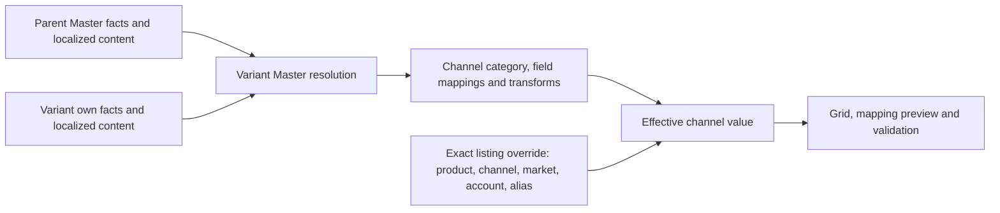

**Product grid quality audit — 6 September 2026**

The product editor has a sound separation between shared Master facts and channel-specific listing overrides, but this audit found real defects in inheritance writes, provenance, market selection, sorting and readiness. Those defects have been corrected and regression-tested. This is not a certification that every product or marketplace is ready to publish: the live fixture still has invalid/missing channel content and several markets lack category requirements.

The audit covered the existing working tree, including its pre-existing uncommitted changes. It used the GALE-JACKET family (`cmokmy3a40078pm0p1fvnu523`, one parent and 20 variants), local web/API services, mocked service/route regressions, real read-only API checks, dry-run writes and a reversible browser edit. No listings were published. The original explicit null override used in the browser test was restored and verified after reloading; save versions and audit history necessarily advanced.

**How Master supplies channel values**

For the parent listing, the first step uses the parent's own resolved Master facts. For a variant, the resolver merges applicable parent facts with that variant's own values and locale. Channel category selection determines which channel fields, types, limits, options and requirements apply; the Master family schema is a separate concern. Mapping rules, fallbacks, link groups and transforms derive channel defaults from the resolved context. An explicit target override wins over the mapped default and skips its transforms. The grid and preview share the batched channel resolver.

The exact listing coordinate includes product, channel, market, connection/account and alias. A parent **channel listing** is not a general fallback layer for its variants' channel listings. Editing an Amazon Italy parent title therefore does not automatically change every variant title or eBay Germany. Shared facts belong in Master; listing exceptions belong on the relevant channel row. The tooltip previously suggested a parent-listing cascade that the resolver does not implement.

Clearing and inheriting have different meanings. An explicit null/empty channel value stays pinned and can fail a required-field check. “Follow Master” deletes the override or restores the listing's follow flag; the effective value is then recalculated from the current Master/mapping context. A synchronized listing snapshot must not override Master while its follow flag is enabled. A mapping can transform Master, so the inherited channel value need not literally equal the raw Master cell.

Prices and stock also have dedicated services and synchronization side effects; they are not purely text-field inheritance. Price formulas remain restricted to supported price fields. No live price, stock or publication changes were made during this audit.

**Verified results**

| Check | Result |
| --- | --- |
| Product-edit, product-sheet and shared-grid frontend suites | 139 files, 2,137 tests passed |
| PIM, mapping, bulk-write and formula API suites | 68 files, 786 tests passed |
| Shared Master sheet contract | 14 tests passed |
| Additional Amazon live channel suite | 13 tests passed; default frontend run also covers the eBay live contract |
| Full frontend and API TypeScript checks | Passed |
| Isolated Next production build | Passed, including compilation, TypeScript and 99 static pages |
| Grid module boundary guard | Passed over 2,225 source files |
| Attribute dry-run writes | 264 of 264 accepted across Master, Amazon IT and eBay IT |
| Declared option checks | 4,448 checked |
| Invalid shape/precision checks | 13 passed |
| Foundation probes | 18 passed |
| Market matrix | 36 requests: 27 successful projections, 9 explicit unsupported-scope responses; 37,338 cells, 1,842 explicit overrides, no checked contract inconsistencies |

The added inheritance regression evaluates two Master versions over 32 combinations: two channels × four markets × two accounts × two aliases. It verifies that shared changes propagate, a child's own Master value stays intact, and an override in one exact coordinate does not leak into others. Additional route regressions distinguish reset from clear across JSON, listing columns and platform paths, exercise account/alias targeting and version guards, and ensure same-value pins are not optimized away.

Browser verification covered Master/Amazon/eBay switching, Italy/Germany/Belgium market states, channel-specific market choices, the boolean editor, autosave, pin/reset provenance, reset persistence and explicit-blank restoration. The blank GTIN-exemption override resolved to inherited “Yes” after reset, changed its badge without a page reload, and remained inherited after reloading. Restoring the original blank produced a pinned empty cell again. A server restart during development also exposed the network-error and parent-row filtering defects listed below.

**Corrections made**

| Defect | Result after correction |
| --- | --- |
| Bulk API ignored `intent: reset` and saved an empty pin | Reset removes stored override keys or restores follow flags; normal clear preserves an explicit blank |
| Same-value pin/no-op and multi-target no-op assumptions | Pin intent is preserved; a comparison with one listing cannot skip writes to other requested targets |
| Account/alias lookup and creation could choose a sibling account | Listing lookups and writes use the intended primary account and exact alias; newly created listings are draft and unpublished |
| Blank stored overrides looked inherited | Presence, including null/empty values, determines explicit provenance |
| Mapping results marked explicit overrides as derived | Override provenance renders as pinned; direct channel overrides remain independent of mapping transforms |
| Named-alias variant pins were mistaken for inherited alias values | Reset targets the variant's own listing override |
| Successful channel saves left stale effective values/badges | A quiet guarded refresh reconciles saved values and provenance without tearing down the grid or replacing newer pending, refused or unconfirmed edits |
| Unsupported markets/GLOBAL appeared in the selector | GLOBAL is excluded and channel scopes offer only their configured markets |
| Missing category schemas could display 100% required completeness | Affected rows report unavailable requirements and alias readiness has no percentage |
| AG Grid comparator received row metadata as the descending flag | A proper five-argument adapter preserves blank-last sorting in both directions |
| All `purchasable_offer` descendants qualified as price formulas | Dates and rule identifiers no longer qualify as price targets |
| Failed parent-row edits disappeared from affected-row filtering | Matching parent rows stay visible, and matching children retain their own listing band |
| Lost connections were labelled definite server refusals | They now report an unknown outcome and instruct the operator to reload to verify |
| Channel completeness tooltip called its denominator “master fields” | It explicitly names all channel fields, including optional ones |

Stale tests that asserted superseded attribute ordering or unrestricted non-price formulas were updated to the current product behavior. Relevant option/refusal/audit coverage was retained; those tests were not simply excluded.

**Remaining release work and recommended approach**

1. **Complete category setup before enabling publication for each market.** Amazon OUTERWEAR schemas are present for IT, DE, FR, ES, NL and UK. BE, IE, PL, SE and TR currently return only two fallback columns and missing-schema metadata. eBay IT has category-specific fields; DE, FR, ES and UK have generic fields and unresolved category requirements. The editor now reports unavailable validation explicitly. Use the application's schema/category setup to resolve these gaps; do not copy Italy's schema into other markets by assumption.
2. **Correct actual product content.** Amazon IT is missing Fabric Type on all 21 rows. Germany also lacks description, bullets and other required values. eBay IT has a missing description, an overlong title (127 characters against its cached 80-character limit) and an invalid season option. These are real catalog-data findings, not values a test should invent. Master “Ready 100%” is not a promise that channel content passes validation.
3. **Keep the present Master-first model and consolidate its implementation.** Prefer one canonical resolver and one override-write service shared by manual edits, import, formulas and synchronization. Model “inherit” separately from “explicit value,” including null, and carry the full listing coordinate consistently. This audit repaired concrete paths, but duplicated storage/routing knowledge remains a maintenance risk.
4. **Make list inheritance an explicit product decision.** Slots are independently editable cells, but storage overrides the whole array. A single slot cannot currently resume live inheritance independently. Such resets now refuse rather than silently discarding other slots. Prefer an explicit whole-list “Follow Master” action, or introduce per-slot inheritance metadata with defined behavior when Master reorders/inserts items.
5. **Do not assume formulas are account/alias-specific.** `CellFormula` is unique by product/scope/channel/market/locale/field, with no account or alias key. Expand that identity and migrate formulas before offering independent formulas per listing alias/account. The normal override and resolver account-isolation tests do not establish that broader formula capability.
6. **Unify concurrency across all write entry points.** The editor's tested listing paths use listing version guards. Some dedicated Master services and tokenless/mixed-target writes have different boundaries; for example, the price service changes `Product.basePrice` without incrementing `Product.version` itself, while the bulk route guards separately. A future transaction-level regression should cover simultaneous editor/import/service writes, and mixed Master/listing batches should carry separate tokens instead of dropping their guard.
7. **Add a repeatable disposable integration fixture to CI.** Run actual save → re-read → reset → re-read checks for text, boolean, price, measure, platform-path and list stores, with concurrent clients, aliases and account boundaries. Keep editor/preview/publish-validator parity checks and missing-schema checks in that gate. Use a disposable dataset because live price/stock services can queue outbound synchronization.

The existing architecture is worth retaining. I would not add parent-channel-listing inheritance implicitly: that would change the meaning of existing variant overrides. If that behavior is wanted, define it as a new visible layer with explicit reset destinations and regression tests first.

**Evidence and limits**

The retained [market audit JSON](2026-09-06-product-grid-market-audit.json) records each response, schema gap, validation issue and timing. The repeatable read-only runner is [audit-product-grid-markets.mts](../apps/api/scripts/audit-product-grid-markets.mts). Detailed local logs use `/tmp/nexus-product-grid-*`; the existing foundation/edit verification scripts write their own JSON evidence there.

The first production build stalled inside the sandbox; the approved rerun outside it passed. Build warnings remain about workspace-root inference from a parent lockfile and PostgreSQL SSL-mode compatibility. They did not fail the build. The legacy standalone editor-open guard skipped under sandbox networking and is not counted as a pass; the supported browser session supplied the interactive checks above.

This audit does not establish live Amazon/eBay acceptance, publication correctness for every account/category, an exhaustive accessibility audit, browser/device compatibility, large-catalog load behavior, or every application feature outside the product-edit/grid scope. It made no dependency upgrades, database migrations, commits or deployment. Passing tests and checked invariants provide strong evidence for the repaired behavior, not proof that no defect can exist.
