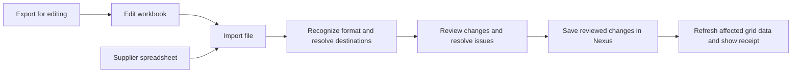

# Product editor import and export: proposed approach

2026-09-08. Design and implementation sequence based on the current working tree. This document proposes changes; it does not claim they are implemented or deployed.

Subsequent implementation and current verification: [implementation report](2026-09-08-product-import-export-implementation.md). The assessment below records the state before those changes.

Keep the existing catalog transfer engine. Make import and export a coherent editing workflow inside the product editor, with explicit products, destinations, value ownership and results. Multiple listing aliases must work throughout selection, files, review, application and recovery.

“AAA quality” should be demonstrated through acceptance checks and measured performance. It is not a claim of perfect performance or WCAG AAA conformance.

## What is already present

The editor's [ProductTransferDrawer](../apps/web/src/app/products/[id]/edit/_studio/import/ProductTransferDrawer.tsx) uses the catalog workbook, planner and durable job service. Both Shared and channel sheets use it. The [server boundary](../apps/api/src/services/pim/catalog-product-transfer.ts) freezes selected product and listing identities, restricts editor imports to existing records, and checks the boundary again during apply and each write transaction.

The canonical listing identity already includes product, channel, account, marketplace and alias. The wide workbook groups rows by SKU and alias within a declared destination. The planner and writer validate alias ownership. Blank alias keys represent primary listings. A named listing alias belongs to a product group and one channel/account/market; its parent and variant listings have their own record identities.

Existing protections include typed values, explicit SET/CLEAR/INHERIT, full-file validation, review ownership, record snapshots, schema checks, transactional record checkpoints and retry reviews. Imports save to Nexus; publication is a separate workflow. Keep these protections.

These are source-level observations supported by the focused tests below. Prior browser and database reports are historical evidence, not new live verification.

## Gaps that affect the proposed design

| Finding | Evidence and consequence |
| --- | --- |
| Selecting several aliases is unnecessarily broad | The drawer offers current destination or shared data plus all existing destinations. There is no choice for all aliases in the current account/market or specific destinations. |
| Alias names are missing from transfer presentation | Options return alias keys; the drawer and review display those keys. The editor already has friendly alias labels. Transfer should show those names while retaining IDs for matching. |
| Stored changes do not explain the resulting grid value | [Preview columns](../apps/web/src/app/products/catalog-transfer/previewColumns.tsx) show “No stored override” and “Use inherited value”, without the resolved value or its source. |
| Ordinary workbook edits require action-column knowledge | [Workbook v2](../apps/api/src/services/pim/catalog-workbook.ts) exports a value/action pair per field. Entering a value alongside INHERIT is refused until its action changes. Deleting a stored text value while retaining SET parses as SET of empty text. Validation may subsequently refuse it depending on the field. |
| Export versions are not mandatory on import | [The parser](../apps/api/src/services/pim/catalog-transfer-file.ts) accepts absent versions; the planner compares exported versions only when present. A probe of a generated editor workbook accepted a blanked version without an issue. Preview-to-apply snapshot checks remain, but the original export-to-preview stale-file check is lost for that record. |
| Formula ownership needs a dedicated acceptance case | Transfer reads/writes stored product/listing values; the inspected transfer planner/writer does not consult CellFormula. Manual literal replacement uses a separate formula-aware transaction. Whether a successful import remains authoritative after recalculation must be verified before promising correct formula behavior. |
| Large exports add operator work | Exports split into ZIP parts, which users must extract and review separately. The download implementation retains completed workbook buffers in memory. Import staging occurs before the initial response returns. Measure both paths before increasing limits. |
| Review requires too much navigation for a small edit | Outcomes are grouped in disclosures, with record pagination and separate attribute pagination. The initial filter is all outcomes. Lead with changes and issues, and retain access to every unchanged/excluded input. |

## The user flow

Use the existing Import and Export toolbar actions. Each should open directly to its task: Export to download choices, Import to file selection. Offer “Download an editing workbook” as help within Import. A recoverable previous review should be visible without preventing a new export.

Keep a compact scope summary visible throughout, for example: **3 SKUs · eBay Italy · Main account · Primary + Summer listing**. Show shared data and content languages separately when included. Scope changes must invalidate any prepared review.

Product choices should remain current SKU, selected grid rows, parent and variants, and specific SKUs. Default to the current SKU; make the inclusion of the parent explicit. Do not interpret a category family such as Jackets as a variant group.

Destination choices should be current listing, all aliases in this account and market, and specific destinations. A searchable selection can group channel → account → marketplace → alias, using existing Nexus controls. Shared product details should be an independent choice, so selecting more aliases does not also select shared data and every language.

For a recognized Nexus workbook, recover its declared scope and show it for review. The server must resolve it against the editor's permitted product group and available destinations; metadata must never enlarge authority automatically. Users should not have to reconstruct the same selection manually after reopening the editor.

For an external spreadsheet, reuse the existing source-mapping infrastructure: identify the header, match products and destinations, map columns, then review. Skip mapping for recognized Nexus files. Do not label the current editor upload as accepting arbitrary spreadsheets until that adapter is connected to the same product boundary.

## Multiple aliases as a first-class requirement

Treat aliases as separate listings of the same canonical product. Shared facts appear once per SKU, with separate localized content. Listing sheets contain one row per SKU and listing identity. Alias-specific values remain independent.

Illustrative example; these names and values are not catalog observations:

| SKU | Destination | Alias | Title value | Ownership |
| --- | --- | --- | --- | --- |
| COAT-S | Shared product | — | Rain coat | Shared |
| COAT-S | eBay / Main account / Italy | Primary | Rain coat | Inherited |
| COAT-S | eBay / Main account / Italy | Summer listing | Lightweight rain coat | Explicit override |
| COAT-S | eBay / Main account / Italy | Outlet listing | Rain coat — outlet | Explicit override |

Updating Summer listing must preserve Primary and Outlet. Updating the shared title may change inheriting listings, which the review must explain. The count is one product and three listings, never three products.

Use immutable product/listing IDs internally and in export metadata. Show SKU, account name, marketplace and alias label to people. Labels are reference text, not lookup authority; renaming an alias must not redirect an import. Never match listing writes on SKU alone or guess a primary alias when several targets match.

A request to copy one source value into several aliases must explicitly select those destinations and show the resulting changes. Unknown aliases should produce a correction path. Keep alias creation as an explicit product operation; typing a new name into an update workbook must not create an alias incidentally. Alias creation also has an existing database-index guard, so availability needs deployment verification.

If “aliases” also means alternate supplier/seller SKUs, use a separate identifier mapping to canonical product ID, with a source/account namespace and ambiguity detection. Do not overload listing alias IDs with alternate SKU text. This extension depends on the user's intended meaning; the core recommendation follows the existing Nexus listing model.

## Export choices and the editing workbook

Present two purposes:

1. **Edit in spreadsheet** — a typed XLSX that can be re-imported with identities, versions, ownership and validation guidance.
2. **Download current view** — a reference export with clearly stated row filters, displayed columns and scope. Its rendered values do not carry the complete editing contract.

The editing export should offer visible editable attributes and all editable attributes, with identity columns included in both. Use readable field labels and field help; retain stable field keys in metadata. Keep unrelated managed fields out of the normal editing area and list material exclusions. Freeze identity columns and use valid-value guidance without silently converting identifiers, units or enums.

AG Grid's CSV export uses value getters and, by default, formatters; cell renderers are not exported. It also documents spreadsheet formula interpretation of CSV text. This supports using a separately defined typed workbook for editing and treating the table download as a reference artifact. [AG Grid CSV export documentation](https://www.ag-grid.com/javascript-data-grid/csv-export/)

For a simpler editing experience, introduce a new workbook version instead of changing v2 semantics. Retain the canonical SET/CLEAR/INHERIT mutation model internally. Store an export baseline on the server, identified by an export ID, containing immutable destinations, record versions, original values and ownership. Protect metadata from accidental editing in Excel, but validate against the server baseline regardless of worksheet protection.

Proposed ordinary-edit rules:

| Workbook input | Proposed operation |
| --- | --- |
| Cell unchanged from the exported baseline | Preserve its ownership and value. |
| Blank cell without an explicit operation | Leave unchanged. |
| Changed, nonblank literal value | SET, with the destination shown in review. |
| Explicit Clear | CLEAR where supported. |
| Explicit Use inherited value | INHERIT where supported. |
| Explicit Set equal to the displayed inherited value | Create a deliberate override; equality alone must not imply that intention. |
| Removed row or column | No deletion. |

Keep Clear, Use inherited value and explicit Set available through advanced action columns with readable labels. Do not require action changes for ordinary value edits. State blank-cell behavior next to the editing instructions.

An inherited field can show its effective value for context only when the baseline records that value and its source. Re-importing it unchanged must preserve inheritance. Without a trustworthy baseline, keep effective values in a reference area instead of guessing which values became overrides.

Missing, invalid or expired baselines need an explicit recovery path. Never silently downgrade a protected editing workbook into an unversioned update. Keep supported older formats on their documented semantics and identify any weaker protection before review.

Preserve leading zeros, large identifiers, Unicode, multiline text, false, zero, empty text, typed lists and units. Reject spreadsheet formula/error cells until the user supplies verified values. Nexus formulas need their own rule: preserve them on unchanged imports; refuse changes to formula-controlled cells until explicit formula replacement can be reviewed and committed atomically. Do not extend formula writes to aliases/accounts that the existing formula model cannot represent.

## Review, save and recovery

The review should answer: **Which products and listings change, what will the grid show, and why?**

Lead with changed attributes, changed product/listing records, unchanged inputs, excluded inputs and issues. Use distinct units. Default to changed values; route directly to issues when blocked. Offer filters for product, destination and alias. Show exact workbook sheet/row/column locations with correction guidance.

For each changed field, show current effective value and source, proposed effective value and source, and the operation. For example: **Summer listing title: inherited “Rain coat” → override “Lightweight rain coat”**. Resolve the proposed state on the server using the same rules as the grid, including parent and shared changes staged earlier in the import. If the outcome cannot be resolved, say so instead of displaying an invented value.

For shared changes, identify inheriting variants/listings when feasible. Count only effects actually resolved; otherwise state that additional inheriting destinations may change. Do not label direct record counts as total affected listings.

Validation issues block the initial save. If a later concurrent change causes a partial job, show exact saved, unchanged, failed and unprocessed totals, with remaining records available for a fresh review. Preserve the existing transactional checkpoint behavior. Repeated apply requests must not replay committed mutations.

Use truthful states: reading file, preparing review, ready to save, saving in Nexus, saved, partially saved, or could not save. Show upload percentage only if measured, and record progress only when its denominator is known. “Download started” is more accurate than claiming the browser saved a file successfully. Closing a drawer must explain whether server work continues.

After save, refresh the affected records and their dependent values, preserve grid position/selection, and briefly mark confirmed changes. Distinguish “saved, refreshing grid” from a failed save when the read refresh fails. Keep a receipt and recovery link accessible across navigation. Undo, if later added, must be a reviewed inverse change with concurrency checks; do not promise unrestricted rollback.

Review and correction before submission also align with the W3C error-prevention criterion. Passing this workflow check alone does not establish whole-page AAA conformance. [W3C: Error Prevention (All)](https://www.w3.org/WAI/WCAG22/Understanding/error-prevention-all.html)

## Implementation sequence

1. **Identity and protection first.** Add named alias metadata and specific destination selection to the existing drawer; enforce editor workbook versions; define and verify behavior for formula-controlled values. Keep the server boundary intact. Cover multiple named aliases through real HTTP export → edit → preview → apply tests in an isolated store.
2. **Review the actual effects.** Extend the preview contract with resolved values/sources, clear counts, changes/issues filters and file locations. Reuse grid resolvers and field contracts. Make preview and manual editing agree for the same operation without creating a second set of validation rules.
3. **Simplify the workbook.** Introduce the versioned baseline format and ordinary-edit rules with backward compatibility tests. Add useful field selection. Reuse the canonical planner/writer rather than implementing another importer.
4. **Remove measured friction.** Add source mapping inside the editor, scope recovery, and batch acceptance of Nexus ZIP exports. A ZIP import must stage and validate the full declared batch, detect duplicate targets across parts, and never silently ignore a missing or rejected part. Bound decompressed size, cells and part count.
5. **Measure and complete acceptance.** Profile parse, staging, preview, apply, export serialization, peak memory and grid refresh independently. Move large exports to durable artifact jobs if request latency/memory warrants it; stream parts to bounded storage instead of retaining every completed workbook. Batch resolver/database reads by destination and schema while preserving transactional rechecks.

Use the Nexus design system for every changed control. Read the relevant component source before implementation. Any shared additions must be exported, documented in the catalog/changelog, recorded in DS-GAPS and mirrored to Factory. Preserve the established platform density.

## Acceptance gates

- Unchanged exports propose zero mutations, including inherited fields, named aliases, formulas, translations, legacy typed values and parent references.
- One workbook containing a primary listing and two named aliases updates each intended target independently; untouched products/accounts/markets/aliases remain equal.
- Alias label changes do not redirect matching. Archived, moved, replaced and unknown targets require correction. Product and listing counts remain distinct.
- Missing versions/baselines, stale exports, concurrent edits, duplicate field writes and ambiguous matches produce explicit outcomes. No last-row-wins behavior.
- SET, CLEAR and INHERIT have the same supported meaning in the workbook, preview, writer and refreshed grid. Formula-controlled values remain correct after recalculation.
- Every input is accounted for as changed, unchanged, excluded or invalid; every applied target is accounted for as saved, unchanged, failed or unprocessed. Counts use a stated unit and phase.
- Double apply, worker interruption, lost response, closing/reopening, retry and grid-refresh failure preserve durable truth and allow recovery.
- Keyboard-only use covers upload, scope, review, correction, save and focus restoration; screen-reader status and errors are understandable. Check light/dark themes, zoom and narrow screens with the existing control sizes.
- Benchmark 1, 25, 100 and 500 SKUs with several aliases and both sparse and dense files. Compare elapsed time, query count and peak memory to input records/attributes, not compressed file size alone. Proposed initial targets: scope selection under 100 ms locally, typical 25-SKU review under 3 seconds p95, and a promptly acknowledged job for larger work. These are targets to calibrate, not measured guarantees.

## Verification performed for this assessment

- API: **103 passed, 1 optional test skipped** across product boundaries, workbook values/scopes, planner, jobs, transactions and HTTP transfer flows. Log: `/tmp/nexus-transfer-approach-api-tests.log`.
- Web: **20 passed** across product transfer selection, preview rendering and workbook selection. Log: `/tmp/nexus-transfer-approach-web-tests.log`.
- A generated editor workbook was parsed after blanking its exported version: one row accepted, zero parser issues, no version. A second parser probe deleted the stored name while retaining SET: it proposed empty text. Neither probe applied data.
- No application implementation changed in this assessment. No working-catalog mutations, deployment, new browser acceptance, full type/token checks or production performance certification were performed.
