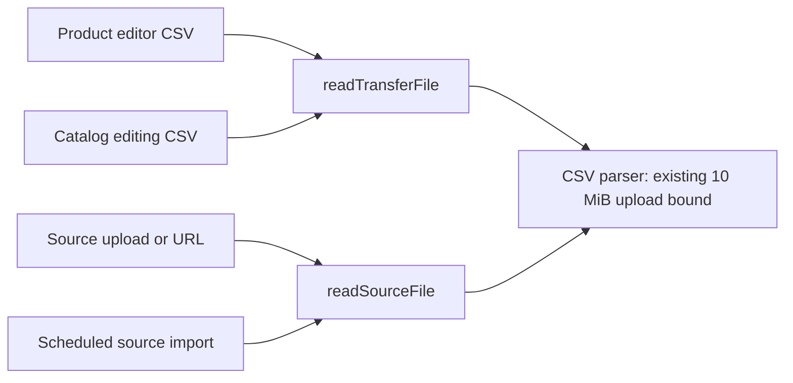

# Catalog CSV record-size fix

## Fixed behavior

Product editing CSVs and wide source CSVs no longer reject valid records merely
because a row exceeds 256,000 bytes. Both readers use the existing 10 MiB upload
limit as the CSV record bound. Long editing descriptions, multiple large source
cells, and multibyte Unicode values retain their exact contents.

The source reader still enforces 256,000 characters per cell, 200 columns, and
50,000 rows. Oversized source cells now reach that explicit validation instead of
failing with the internal parser error. The overall upload bounds, CSV syntax
validation, workbook limits, preview, versions, and apply safeguards remain active.

## Cause and connections

Both readers previously passed `max_record_size: 256_000` to `csv-parse`, although
the upload was already bounded to 10 MiB. A row can legitimately exceed that
smaller parser limit. The parser also accounts for encoded field bytes, so a
Unicode value below the source character limit could still fail.

Graphify's existing graph identified these connections, verified against source:

- `catalog-transfer.routes.ts:131` calls `readTransferFile`
  (`catalog-transfer-file.ts:69`) for catalog preview.
- `catalog-editor-workbook.ts:55` calls the same reader from `readEditorPart`,
  covering product-editor inspection and preview.
- `catalog-source.service.ts:19` calls `readSourceFile`
  (`catalog-source-file.ts:21`) for uploaded and URL-fetched sources.
- `scheduled-import.service.ts:199` calls that source reader for scheduled jobs.

Graph queries used the graph vocabulary `catalog`, `source`, `transfer`, `file`,
`import`, `csv` and the exact reader symbols. The existing graph is an index;
source inspection and regression tests establish the runtime behavior.

## Verification and release

- Before the fix, five of ten focused boundary tests failed with the old parser
  limit, including large descriptions, wide rows, Unicode, and the 10 MiB boundary.
- After the fix, all ten boundary tests passed.
- Related catalog and scheduled-import coverage passed: 206 tests across 15
  suites, with three existing opt-in tests skipped. The API build also passed.
- Real registered HTTP routes with an isolated store passed upload, inspection,
  preview, explicit apply, and exact description preservation above 256 KB.
- The deployment workflow runs the boundary suite before uploading to Railway.
  The general CI PIM suite also includes both boundary and HTTP regressions.
- No dependencies, database schema, or UI components change.

Production verification must confirm `/api/health/ready` serves the release SHA.
Rollback is a revert of this fix followed by the same deployment workflow; it
requires no data rollback. The user's original file was not available during the
initial reproduction, so the tests use deterministic CSV fixtures.
