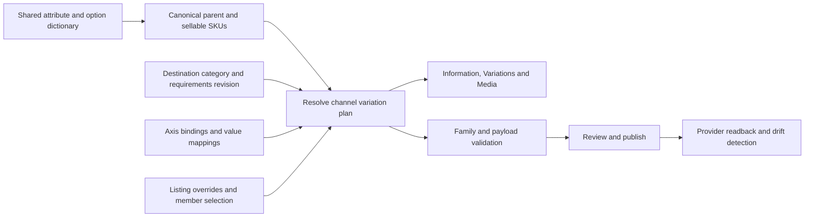

# Product variations: current state and recommended architecture

The subsequent workspace implementation and verification are recorded in [IMPLEMENTATION.md](IMPLEMENTATION.md). This document describes the preceding audit and the broader architecture proposal.

11 September 2026. Assessment of the current working tree and the running local product studio. This is an audit and implementation proposal; no product data, listing, application implementation or deployment was changed.

**Recommendation:** keep one canonical product family and its sellable SKUs, then define a separate, schema-validated representation for each channel destination. Give operators a Variations workspace in the new editor, backed by the existing Master dictionary, mapping engine, requirement evaluator and draft/publication safeguards. The same resolved representation must drive Information, variation editing, media grouping, previews, import/export and publication.

## What is already working

| Area | Current implementation | Assessment |
| --- | --- | --- |
| New editor | `/products/[id]/edit/studio`; shared Information sheet and Amazon/eBay/Shopify/Etsy scopes | A substantial foundation to extend. |
| Internal relationships | Sellable variants are child `Product` rows through `parentId`. Parent/Child/Standalone presentation and guarded family actions exist. | Preserve this identity model. The old `ProductVariation` table is migration history, not a new source of truth. |
| Shared dictionary | `CustomAttribute`, `AttributeOption` and `FamilyAttribute`; stable codes, labels, types, option metadata and family applicability | Reuse these identities for axes and values. `ProductFamily` classifies products; it is distinct from an individual parent and its SKU children. |
| Channel data | Exact destination coordinates, explicit overrides, mapping rules, value maps, size conversions, source indicators and version checks | Extend the existing resolution/write contracts. |
| Amazon requirements | Persisted full PTD documents, native field shapes, theme enumeration, conditional AJV validation and Amazon vocabulary | Full schema evaluation already exists in the new Information flow. Older advisory evaluators are not the whole current implementation. |
| Reference ingestion | Durable taxonomy snapshots, refresh jobs, requirement revisions and local category reads | Reuse the recent category work. Its deployment report still distinguishes local rollout from production rollout. |
| eBay variations | Shared family-axis resolution used by existing eBay surfaces and push, plus per-listing axis/value ordering | Useful precedent for one resolved channel-family representation. |
| Shopify family | Existing linked-product workspace preserves separate colour products and native size variants | Keep this representation available. It is not equivalent to a single Shopify product with Color and Size options. |
| Etsy | Category property IDs, allowed values, scales and variation eligibility reach the Information schema | The inventory/offering variation graph remains a separate unfinished workflow. |

Implementation references: [studio entry](../../../apps/web/src/app/products/[id]/edit/studio/page.tsx), [navigation](../../../apps/web/src/app/products/[id]/edit/_studio/StudioSubheader.tsx), [database models](../../../packages/database/prisma/schema.prisma), [family dictionary](../../../apps/api/src/services/pim/family-sheet-schema.ts), [Information delivery record](../2026-09-11-information/README.md), [taxonomy delivery record](../2026-09-11-category-taxonomies/README.md), [Shopify family record](../2026-09-09-shopify-linked-products/README.md), [Etsy scope boundary](../2026-09-10-etsy-attributes/README.md).

## What I observed on the actual page

Opened a separate browser tab at the user's current local studio URL for `GALE-JACKET`, with Germany selected. The family showed one parent and 20 children, declared as `Colore × Taglia`.

- Shared Information displayed blank Color/Size cells on the inspected children. This observation does not establish that every legacy or channel store lacks those values.
- Amazon DE showed `OUTERWEAR`, 163 attributes in the current view, 405 missing-required cell occurrences, 38 invalid-value occurrences, and three mapping-error occurrences. These are the page's diagnostic counts, not 446 unique defects or verified remote Amazon rejections. The Invalid values view identified Colour and Item Condition; one child displayed a missing colour source and `Neu` with a conditional requirement message. The precise Item Condition envelope issue needs a payload-level follow-up.
- The Amazon Requirements dialog reported `OUTERWEAR · 2026-09-11`.
- eBay DE lacked a category assignment in Information and reported incomplete requirements. Its separate Variation order view nevertheless resolved Colore values `Giallo, Nero` and Taglia values `XS` through `5XL`. It exposed listing/account/market context and up/down ordering controls. No order was saved.
- Product navigation exposed eBay Variation order and Shopify Product family, but no common Variations task for managing shared axes and their channel representations.

The difference between blank shared axis cells and populated eBay ordering is a concrete reason to unify value ownership and make provenance explicit. It does not establish that one side should automatically overwrite the other.

## Confirmed gaps, in priority order

### 1. The wizard can replace real Amazon themes with bundled guesses

The schema cache's `extractVariationThemes` returns `{ themes: [...] }`. The wizard's `parseThemes` accepts only an array. In the multi-channel path, an empty parse triggers `bundledThemesFor(productType)`, even when a cached theme document exists. An unmatched selected theme can then yield an empty missing-attributes list.

The read-only [probe](probe-wizard.mjs) executes the current service with in-memory dependencies. With cached `{ themes: ['COLOR/SIZE'] }`, the single-channel method returned no themes; the multi-channel method returned bundled `SIZE_COLOR`, `COLOR_NAME`, `SIZE_NAME` and no missing attributes for the unmatched selection. This is a confirmed service contract defect, not proof that a provider would accept a resulting submission.

Sources: [cache extractor](../../../apps/api/src/services/categories/schema-sync.service.ts), [wizard variation service](../../../apps/api/src/services/listing-wizard/variations.service.ts), [bundled constants](../../../apps/api/src/services/listing-wizard/product-types.constants.ts).

### 2. Theme and value interpretation still differs between workflows

The wizard infers required fields by splitting theme strings on underscores and hyphens. Given `COLOR/SIZE`, it asks for one `color/size` attribute. Given `Colore` and `Taglia`, its lowercase-only value lookup still reports `color` and `size` missing. Both behaviors were reproduced. The newer Master resolver already handles known translated axis aliases and reports conflicting alias values, so these are divergent implementations of the same concept.

Do not fix this solely with more string splitting. Use explicit bindings to the schema's actual field paths and validate the completed native structure. A theme's display label is not a reliable schema.

Sources: [wizard parser](../../../apps/api/src/services/listing-wizard/variations.service.ts), [canonical axis aliases](../../../apps/api/src/services/pim/variant-attribute-keys.ts), [Master resolver](../../../apps/api/src/services/pim/attribute-resolver.ts).

### 3. Shared variation facts have multiple storage and read paths

The studio's identity/axis coverage reads `Product.variantAttributes`. The current Master attribute writer merges `attr_*` edits into `Product.categoryAttributes`. The general resolver applies the variant bag and then the category bag, so an explicit category value can supersede the variant value. The wizard reads only `variantAttributes`; eBay can additionally read legacy `categoryAttributes.variations` and listing specifics.

The legacy variant-attributes endpoint still merges whole JSON objects after a separate read and attempts best-effort writes into the old `ProductVariation` table. Unlike newer writes, that handler has no expected-version condition or whole-family combination validation. This is a source-level concurrency and consistency gap; concurrent live edits were not attempted.

Use one canonical Master value location for each axis, consistent with the new dictionary's ordinary writes. Treat other bags as migration inputs or derived compatibility projections. Do not maintain independently editable copies indefinitely.

Sources: [studio axis reads](../../../apps/api/src/services/pim/studio-sheet.service.ts), [bulk writer](../../../apps/api/src/services/products/bulk-edit.service.ts), [legacy endpoint](../../../apps/api/src/routes/catalog.routes.ts), [eBay axis resolver](../../../apps/api/src/services/ebay-family-axes.service.ts).

### 4. Cell validity is not complete family validity

The new Information engine already validates conditional requirements, structured attributes, byte limits and selectors. Existing Amazon feed integration also validates completed full-update envelopes. Preserve this work.

What needs a dedicated contract is the complete family: selected members, unique effective combinations after channel mapping, consistent theme and listing relationships, missing axis assignments, accepted publication operations and explicit excluded members. Child creation currently warns about missing axes and does not check duplicate option tuples. Incomplete drafts are useful, but they must have an explicit incomplete state and cannot count as a validated family ready to publish.

Sources: [schema evaluator](../../../apps/api/src/services/pim/mapping/schema-requirements.ts), [Amazon payload integration](../../../apps/api/src/services/amazon/mapping-payload.ts), [new-child validation](../../../apps/web/src/app/products/[id]/edit/_studio/sheet/master/addVariation.ts).

### 5. Destination scope and capabilities need to be universal

Newer editor paths carry account, market, locale and alias identity. The older wizard variation request is keyed by platform and market and only implements Amazon/eBay themes. Its common-theme intersection excludes channels with unavailable themes, which cannot establish that a choice works everywhere.

Amazon's generic reference schema is deliberately marketplace-wide. Keep that provenance truthful and layer account-specific requirements where applicable; selecting credentials alone does not make a generic document seller-specific. Structural operations also need capability checks beyond editable scalar fields.

Sources: [wizard service](../../../apps/api/src/services/listing-wizard/variations.service.ts), [schema request context](../../../apps/api/src/services/categories/schema-sync.service.ts), [dispatch safeguards](../../../apps/api/src/services/pim/mapping/prepare-dispatch.ts).

## Target model

**Canonical identity.** Reference existing attribute IDs/codes for Color, Size, Fit and any other actual axis. Reference stable option identities for values such as black and size M. Labels, translations, swatches and display order are metadata; renaming `Black` to `Jet black` must not create a new SKU or move stock. Preserve meaningful size-system and unit context. Do not assume that equal text across two size scales denotes the same value.

**Per-family axes.** Declare which dictionary attributes distinguish this particular parent’s children, with their order. A field being `per_variant` does not automatically make it an axis. Store only actual sellable combinations; generating a Cartesian product is an explicit previewable action. Missing combinations can be intentional. Complete duplicate canonical tuples require reconciliation or an additional distinguishing axis; incomplete drafts may remain editable.

**Channel variation plan.** Persist the representation for workspace, family, connection, marketplace, listing group/alias and applicable content locale. A plan records member SKU identities, remote product/variant IDs, category/product type, schema revision, selected theme or options, axis bindings, value transforms, exclusions and supported presentation order. Reuse current listing/alias identities and review records; add relational group membership or constraints where needed instead of inventing another product catalog.

One internal family may yield one Amazon parent with children, several permitted Amazon groups, an eBay multi-variation listing, or linked Shopify colour products with native size variants. Membership is explicit. An excluded SKU stays in the internal family and inventory system. A channel family change does not reparent the internal catalog automatically.

**Two separate mappings.** First map the axis to its destination field or structured path; then map its values to valid provider values. Reuse the existing field rules, `FieldValueMap` and `SizeScaleMap`. Extend their scope where category/account/schema context changes meaning. Labels can be suggested automatically, but ambiguous identity matching and size conversions need review. Never infer missing facts from a SKU string silently.

**One value resolver.** Make a documented precedence contract from canonical SKU fact through the applicable mapping to an explicit listing override. Preserve the existing distinction between inherit, set and clear. The result must contain the effective typed value, source, exact destination, revision and validation issues. A channel override changes the channel representation; changing the underlying physical variation fact is a shared operation with an impact review. Imported/live provider observations remain separately attributable and do not silently become shared truth.

The family resolver must also check uniqueness after transformations. For example, two distinct internal colours mapped to the same channel colour and size produce a collision even when each individual value is allowed. Offer a reviewed remap, supported extra axis, group split or exclusion. Never drop a distinguishing axis silently.

## Amazon treatment

Amazon PTD requirements are scoped by product type and marketplace, with request context including requirements mode, seller and locale where applicable. The current API also supports parent/child/standalone-specific retrieval. A browse node is a classification reference, distinct from the product-type schema. Cache the full document and exact context; retain its provider version and content fingerprint. [Amazon PTD retrieval](https://developer-docs.amazon.com/sp-api/docs/retrieve-a-product-type-definition).

The workflow should be category/product type → permitted theme → bound axes → child values → family validation. Retain the exact theme wire value. A master Size may map to a structured size object with system/class/value fields; a generic text box cannot represent every category. Fields allowed as product attributes are not automatically allowed as variation axes.

Use the existing full JSON Schema evaluator and Amazon vocabulary for current conditional rules and value constraints. Make missing schema, unsupported validation, retired theme and invalid mapping distinct states. Keep drafts usable while blocking only the affected publish operation until authoritative requirements are available. [Amazon schema vocabulary](https://developer-docs.amazon.com/sp-api/docs/product-type-definition-meta-schema).

Generate parentage, parent SKU relationships and the theme from the reviewed channel family plan. Raw relationship fields in Information should route to that same plan command, avoiding independent cell changes that contradict the family. Check both local constraints and supported provider preview, then track asynchronous acceptance/issues and readback. `ACCEPTED` is initial submission acceptance, not final catalog confirmation. [Amazon listing workflow](https://developer-docs.amazon.com/sp-api/docs/building-listings-management-workflows-guide).

Do not promise control over Amazon's buyer-facing option sequence unless the applicable API actually supports it. Local ordering can still make the editor convenient. Where a current live family cannot be altered in place, explain the provider limitation and review the supported regrouping operation.

## Other channels

| Channel | Representation and rules |
| --- | --- |
| eBay | Verify category variation support and allowed specifics; retain market-specific names/values, member identity and supported image/order behavior. Reuse its existing shared axis resolver, while separating observed candidate keys from provider-validated choices. [eBay variations](https://developer.ebay.com/api-docs/user-guides/static/trading-user-guide/variations.html). |
| Shopify | Support both native options and the existing linked-colour-products model. Native Shopify products have up to three options; theme behavior must resolve actual variants. Preserve product, variant and inventory identities when changing presentation. [Shopify variants](https://shopify.dev/docs/storefronts/themes/product-merchandising/variants). |
| Etsy | Build around inventory products, property IDs, value IDs, scale IDs, offerings and the properties controlling SKU/price/quantity. Current Etsy supports three axes with `max_variations_supported=3`; do not build a two-axis assumption. Preserve all members and dimensions when updating inventory because omission can remove a variation. [Etsy third variation](https://developer.etsy.com/documentation/tutorials/third-variation/). |

Each adapter should declare supported axis kinds/counts, family size constraints, value types, grouping, ordering, media association and structural operations. Capabilities can depend on category, account, environment and API revision. Do not force every channel into Amazon's theme terminology.

## Operator experience

Add **Variations** alongside Information and Media, using the same destination switcher and existing Nexus components.

In Shared product, show the family axes, ordered values, existing combinations and per-axis coverage. Allow adding an existing dictionary axis, creating a new legitimate dictionary value, editing labels, adding selected combinations and viewing the impact of removing or merging an axis/value. Provide search and bulk fill. Keep SKU identity and stock separate from labels.

In a channel scope, show a compact configuration summary with category, theme/options and listing group. Render an axis mapping table with Shared axis, Channel field, Value mapping, Coverage and Issues. Below it, use the existing grid for included SKUs and effective values, with inherited/customized indicators and an immediate path to fix errors. Keep advanced provider fields in Information, reachable from the relevant variation issue.

For a hypothetical internal `Color=black, Size=M`, the operator might see an inherited Amazon-specific colour value, an explicit eBay label and a Shopify Black product/M variant. These displays need not be identical text to be consistent; they must refer to the same internal SKU through documented mappings.

Ordinary cell edits save Nexus drafts. Structural changes stage a family revision and show exact effects: affected SKUs/listings, preserved overrides, added/removed groups, incompatible values, duplicate combinations and media implications. Offer bulk operations once at the appropriate level. A rename of one option label should not require editing twenty children by hand.

Publication has a separate, concrete review. Show Draft saved, Needs attention, Ready for review, Queued, Processing, Confirmed and Failed/drifted states according to evidence. Existing remote listings with incomplete local drafts must not appear to have vanished or become unpublished. Where provider order or editing is unsupported, explain that limitation at the control.

## Implementation and acceptance sequence

1. **Close known contract gaps.** Replace wizard theme fallback-as-authority, unify cache parsing and source lookup, reject unrecognized selected themes, and migrate legacy variant writes to the normal versioned contract. Keep regression cases for the probe defects.
2. **Reconcile canonical data.** Inventory every axis/value source for all active families. Match to existing dictionary identities, report ambiguous synonyms, explicit clears, differing values, duplicates and missing values. Review the migration; preserve old values/provenance and listing identifiers. Switch writes to one owner and compare old/new reads before retiring compatibility paths.
3. **Implement the common family resolver and channel plans.** Start with Amazon because it exercises the hardest schema/relationship cases. Add whole-family validation, exact destination/schema revisions, reviewed membership and deterministic native payloads. Adapt the existing eBay, Shopify and Etsy workflows incrementally.
4. **Build the Variations workspace.** Read relevant Nexus component sources, compose existing grid/picker/order/review primitives, and document/mirror shared design-system additions in Factory, catalog, changelog and DS-GAPS. Retain platform density and semantic tokens.
5. **Verify the complete lifecycle and roll out by destination.** Establish equality between displayed effective values, exports, native preview and submitted payloads at the same revision. Run provider readback and reconcile differences without rewriting operator edits silently.

Required correctness cases include: translated label rename without identity changes; missing/explicitly cleared values; conflicting legacy sources; arbitrary supported axes; structured apparel sizes; category/theme changes with saved overrides; unavailable/retired schemas; partial family membership; tuple collisions after mapping; preserved Shopify colour products; Etsy three-axis inventory; multiple accounts/markets/aliases; schema or product changes during review; concurrent writes; worker retry/restart; parent success with child failure; external edits after publication; and preservation of SKU/stock/media associations.

Use database constraints and transactions for local invariants, optimistic revision checks for edits, durable operation identities and checkpoints for publication, bounded provider concurrency, and per-member results. External operations cannot be made one database transaction; retries must reconcile ambiguous outcomes before repeating structural writes. Previous local revisions aid recovery, but remote rollback is a tracked compensating action.

For scale, batch by family and distinct schema context, cache compiled validators by immutable revision with bounded retention, virtualize large grids, and avoid provider requests during ordinary typing. Measure representative small, sparse and maximum-supported channel families and large bulk jobs. Establish performance budgets from those workloads rather than publishing an unmeasured scalability claim.

“AAA quality” requires tested correctness, recovery, clarity and accessibility. Verify keyboard-only operation, focus return, non-drag ordering, screen-reader announcements, browser zoom, light/dark contrast and narrow layouts. The prior Information report explicitly does not certify WCAG AAA. An external marketplace can still change rules or reject catalog contributions; the engineering promise is no silent inconsistency and a visible, recoverable path for every failure.

## Verification performed for this audit

- Read-only browser inspection of the running GALE studio: Shared Information, Amazon DE requirements/invalid-value views, eBay DE Information and Variation order, and product task navigation. No product edit or publication was submitted. This was not an exhaustive browser accessibility test.
- Eight existing API suites passed: **109 tests**. Covered studio axes, canonical variant sources, full schema requirements, dispatch safeguards, channel specifications, eBay family-axis resolution/destination isolation and variation preflight. These are focused unit/service checks, not live publication acceptance or database concurrency evidence.
- [Read-only wizard probe](probe-wizard.mjs) reproduced the cache-shape mismatch, bundled fallback, slash-theme parsing and localized-axis lookup defects. Uses synthetic in-memory fixtures executing current source; it does not fetch current seller schemas.
- Reviewed current implementations and recent local verification records. No production deployment or live provider acceptance was verified in this audit. No application implementation changed, so full build/type/token guards were not rerun.

Reproduce the probe with `node docs/audits/2026-09-11-variation-management/probe-wizard.mjs` from the repository root.
