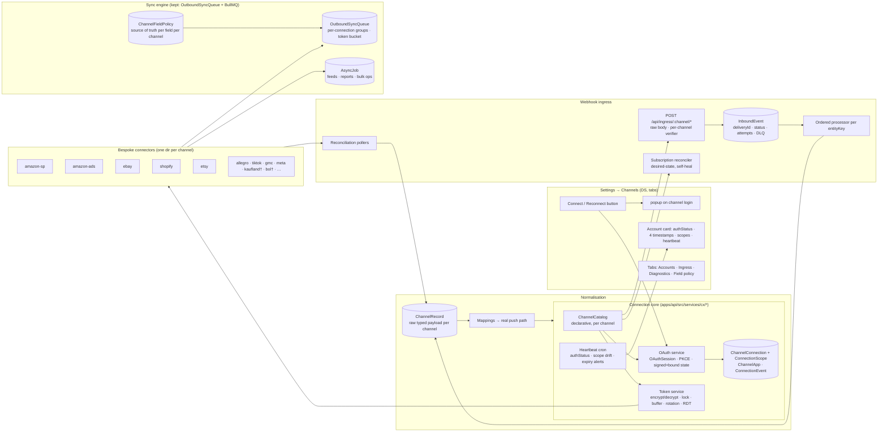

# Channel connections — all plans, full text

Proposals, exact-change specs, runbooks and plans for channel connections, accounts and channel sync.

65 source files, copied word for word.

## Contents


**Part A — the current programme (CX, business profiles, multi-account)**

1. [2026-08-29-cx-channel-connections.md](#2026-08-29-cx-channel-connections-md) — 37 KB
2. [2026-08-29-cx0-security-stop-the-bleed.md](#2026-08-29-cx0-security-stop-the-bleed-md) — 11 KB
3. [2026-08-29-cx1-connection-core.md](#2026-08-29-cx1-connection-core-md) — 33 KB
4. [2026-08-29-cx2-channels-ui.md](#2026-08-29-cx2-channels-ui-md) — 20 KB
5. [2026-08-29-cx3a-amazon-ads-on-the-core.md](#2026-08-29-cx3a-amazon-ads-on-the-core-md) — 13 KB
6. [2026-08-29-cx3b-ads-engine-on-the-core.md](#2026-08-29-cx3b-ads-engine-on-the-core-md) — 10 KB
7. [2026-08-29-cx3c-ads-truth-on-the-page.md](#2026-08-29-cx3c-ads-truth-on-the-page-md) — 5 KB
8. [2026-08-29-cx4a-inbound-ledger.md](#2026-08-29-cx4a-inbound-ledger-md) — 10 KB
9. [2026-08-29-kms-runbook.md](#2026-08-29-kms-runbook-md) — 5 KB
10. [2026-09-08-business-profiles-architecture.md](#2026-09-08-business-profiles-architecture-md) — 20 KB
11. [2026-09-16-bp-shared-accounts-and-access.md](#2026-09-16-bp-shared-accounts-and-access-md) — 77 KB
12. [2026-08-19-map-multi-account-profiles.md](#2026-08-19-map-multi-account-profiles-md) — 47 KB
13. [2026-08-19-map0-burndown.md](#2026-08-19-map0-burndown-md) — 0 KB
14. [2026-08-19-map6-flat-file-edit-list.md](#2026-08-19-map6-flat-file-edit-list-md) — 5 KB
15. [2026-07-30-ebay-multi-account-ema.md](#2026-07-30-ebay-multi-account-ema-md) — 24 KB

**Part B — older sync and flat-file plans (June–July). They may be superseded.**

16. [EBAY-INTEGRATION-PLAN.md](#ebay-integration-plan-md) — 11 KB
17. [superpowers/specs/2026-06-27-ebay-shared-variant-sku-sync-design.md](#superpowers-specs-2026-06-27-ebay-shared-variant-sku-sync-design-md) — 15 KB
18. [superpowers/specs/2026-06-29-nexus-hub-sku-linkage-design.md](#superpowers-specs-2026-06-29-nexus-hub-sku-linkage-design-md) — 4 KB
19. [superpowers/specs/2026-06-30-amazon-flat-file-browse-nodes-design.md](#superpowers-specs-2026-06-30-amazon-flat-file-browse-nodes-design-md) — 11 KB
20. [superpowers/specs/2026-06-30-realtime-inventory-sync-design.md](#superpowers-specs-2026-06-30-realtime-inventory-sync-design-md) — 12 KB
21. [superpowers/specs/2026-07-01-amazon-flat-file-custom-groups-design.md](#superpowers-specs-2026-07-01-amazon-flat-file-custom-groups-design-md) — 8 KB
22. [superpowers/specs/2026-07-01-feed-processing-summary-parity-design.md](#superpowers-specs-2026-07-01-feed-processing-summary-parity-design-md) — 7 KB
23. [superpowers/specs/2026-07-04-ebay-explicit-parentage-columns-design.md](#superpowers-specs-2026-07-04-ebay-explicit-parentage-columns-design-md) — 11 KB
24. [superpowers/specs/2026-07-06-channel-market-scoped-flat-files-design.md](#superpowers-specs-2026-07-06-channel-market-scoped-flat-files-design-md) — 16 KB
25. [superpowers/plans/2026-06-27-ebay-shared-sku-phase1-trading-api-foundation.md](#superpowers-plans-2026-06-27-ebay-shared-sku-phase1-trading-api-foundation-md) — 28 KB
26. [superpowers/plans/2026-06-27-ebay-shared-sku-phase2-membership-create-service.md](#superpowers-plans-2026-06-27-ebay-shared-sku-phase2-membership-create-service-md) — 26 KB
27. [superpowers/plans/2026-06-27-ebay-shared-sku-phase3-fanout-sync.md](#superpowers-plans-2026-06-27-ebay-shared-sku-phase3-fanout-sync-md) — 44 KB
28. [superpowers/plans/2026-06-27-ebay-shared-sku-phase4-flatfile-ux.md](#superpowers-plans-2026-06-27-ebay-shared-sku-phase4-flatfile-ux-md) — 24 KB
29. [superpowers/plans/2026-06-27-flat-file-shared-rebuild.md](#superpowers-plans-2026-06-27-flat-file-shared-rebuild-md) — 68 KB
30. [superpowers/plans/2026-06-30-amazon-flat-file-browse-nodes.md](#superpowers-plans-2026-06-30-amazon-flat-file-browse-nodes-md) — 57 KB
31. [superpowers/plans/2026-06-30-phase0-inventory-sync-baseline.md](#superpowers-plans-2026-06-30-phase0-inventory-sync-baseline-md) — 37 KB
32. [superpowers/plans/2026-06-30-phase1-outbound-ordering-correctness.md](#superpowers-plans-2026-06-30-phase1-outbound-ordering-correctness-md) — 15 KB
33. [superpowers/plans/2026-06-30-phase2-symmetric-oversell-guard.md](#superpowers-plans-2026-06-30-phase2-symmetric-oversell-guard-md) — 14 KB
34. [superpowers/plans/2026-06-30-phase3-reservation-lifecycle.md](#superpowers-plans-2026-06-30-phase3-reservation-lifecycle-md) — 16 KB
35. [superpowers/plans/2026-07-01-amazon-flat-file-custom-groups.md](#superpowers-plans-2026-07-01-amazon-flat-file-custom-groups-md) — 14 KB
36. [superpowers/plans/2026-07-01-ebay-sync-fix.md](#superpowers-plans-2026-07-01-ebay-sync-fix-md) — 13 KB
37. [superpowers/plans/2026-07-01-feed-processing-summary-parity.md](#superpowers-plans-2026-07-01-feed-processing-summary-parity-md) — 9 KB
38. [superpowers/plans/2026-07-01-phase4-latency-hardening.md](#superpowers-plans-2026-07-01-phase4-latency-hardening-md) — 10 KB
39. [superpowers/plans/2026-07-01-phase5-reconciliation-drift.md](#superpowers-plans-2026-07-01-phase5-reconciliation-drift-md) — 12 KB
40. [superpowers/plans/2026-07-01-phase6-control-tower.md](#superpowers-plans-2026-07-01-phase6-control-tower-md) — 9 KB
41. [superpowers/plans/2026-07-01-phase7-polish-closeout.md](#superpowers-plans-2026-07-01-phase7-polish-closeout-md) — 4 KB
42. [superpowers/plans/2026-07-02-ebay-add-variant-import-reparent.md](#superpowers-plans-2026-07-02-ebay-add-variant-import-reparent-md) — 5 KB
43. [superpowers/plans/2026-07-02-ebay-custom-groups.md](#superpowers-plans-2026-07-02-ebay-custom-groups-md) — 4 KB
44. [superpowers/plans/2026-07-02-ebay-shared-sku-flatfile-management.md](#superpowers-plans-2026-07-02-ebay-shared-sku-flatfile-management-md) — 17 KB
45. [superpowers/plans/2026-07-02-ebay-shared-sku-flatfile-unblock-persist.md](#superpowers-plans-2026-07-02-ebay-shared-sku-flatfile-unblock-persist-md) — 17 KB
46. [superpowers/plans/2026-07-06-channel-market-scoped-removal.md](#superpowers-plans-2026-07-06-channel-market-scoped-removal-md) — 28 KB
47. [superpowers/plans/2026-07-06-ebay-per-market-flat-file.md](#superpowers-plans-2026-07-06-ebay-per-market-flat-file-md) — 3 KB
48. [superpowers/plans/2026-07-06-scoped-view-load.md](#superpowers-plans-2026-07-06-scoped-view-load-md) — 15 KB
49. [superpowers/plans/2026-07-07-stock-import-wizard-perfection.md](#superpowers-plans-2026-07-07-stock-import-wizard-perfection-md) — 9 KB
50. [superpowers/plans/2026-07-08-follow-master-bulk-tool.md](#superpowers-plans-2026-07-08-follow-master-bulk-tool-md) — 12 KB
51. [superpowers/plans/2026-07-09-ebay-flatfile-excellence.md](#superpowers-plans-2026-07-09-ebay-flatfile-excellence-md) — 18 KB
52. [superpowers/plans/2026-07-10-ebay-axes-consistency-fix.md](#superpowers-plans-2026-07-10-ebay-axes-consistency-fix-md) — 13 KB
53. [superpowers/plans/2026-07-10-unified-flat-file-excellence.md](#superpowers-plans-2026-07-10-unified-flat-file-excellence-md) — 13 KB
54. [superpowers/plans/2026-07-16-ebay-dynamic-description-engine.md](#superpowers-plans-2026-07-16-ebay-dynamic-description-engine-md) — 4 KB
55. [superpowers/plans/2026-07-16-xlsm-amazon-template-hybrid.md](#superpowers-plans-2026-07-16-xlsm-amazon-template-hybrid-md) — 26 KB
56. [superpowers/plans/2026-07-17-amazon-import-excellence.md](#superpowers-plans-2026-07-17-amazon-import-excellence-md) — 8 KB
57. [superpowers/plans/2026-07-17-ebay-import-excellence.md](#superpowers-plans-2026-07-17-ebay-import-excellence-md) — 9 KB
58. [superpowers/plans/2026-07-19-flat-file-trust.md](#superpowers-plans-2026-07-19-flat-file-trust-md) — 29 KB
59. [superpowers/plans/2026-07-19-realtime-fbm-sync-perfection.md](#superpowers-plans-2026-07-19-realtime-fbm-sync-perfection-md) — 23 KB
60. [superpowers/plans/2026-07-20-pool-to-amazon-sync-study.md](#superpowers-plans-2026-07-20-pool-to-amazon-sync-study-md) — 31 KB
61. [superpowers/plans/2026-07-21-sync-control-datagrid.md](#superpowers-plans-2026-07-21-sync-control-datagrid-md) — 4 KB
62. [superpowers/plans/2026-07-21-sync-control-product-view-scv.md](#superpowers-plans-2026-07-21-sync-control-product-view-scv-md) — 10 KB
63. [superpowers/plans/2026-07-21-sync-control-sc-series.md](#superpowers-plans-2026-07-21-sync-control-sc-series-md) — 9 KB
64. [superpowers/plans/2026-07-25-sync-control-canonical-grouping.md](#superpowers-plans-2026-07-25-sync-control-canonical-grouping-md) — 10 KB
65. [superpowers/plans/2026-07-26-sct6-market-offer-control.md](#superpowers-plans-2026-07-26-sct6-market-offer-control-md) — 3 KB


---

# Part A — the current programme (CX, business profiles, multi-account)


---

<a id="2026-08-29-cx-channel-connections-md"></a>
## 1. SOURCE: `docs/2026-08-29-cx-channel-connections.md`

### CX — Channel Connections: Proposal (Phase C)

**Date:** 2026-08-29 · **Status:** PROPOSED — waiting for the Owner's approval before CX.0 · **Inputs:** `docs/2026-08-29-cx-audit.md` (Phase A), `docs/2026-08-29-cx-research.md` (Phase B) and their appendices. Nothing in this document has been built.

**The rules this design is held to** (from the brief): we own everything, no third-party integration infrastructure; the operator experience is *Connect → sign in → Allow*, with a named exception list; maximum scopes on every grant with drift detection; every channel feature reachable through a bespoke connector; a core model that never drops channel fields; honest UI; design system, tabs not routes, verify on prod, commit per verified unit. WooCommerce is out of scope (Owner, 2026-08-29).

---

#### 1. Target architecture

##### 1.1 One picture


† key-paste exception channels (no operator OAuth exists — §2.3).

##### 1.2 The components and why (each references what Phase B found)

**A. `ChannelCatalog` — declarative, in code, one entry per channel** (Nango providers.yaml pattern, R8 #1; Panora metadata, R9). Fields: `authMode` (`oauth2_code | oauth2_pkce | oauth2_cc | api_key | hmac_key`), `authorizeUrl`, `tokenUrl`, `authorizationParams`, `tokenParams`, `refreshParams`, `scopeSeparator`, `requiredScopes` (**maximal**), `reviewGatedScopes`, `codeParamInCallback` (`spapi_oauth_code`), `callbackMetadata` (`selling_partner_id`, `sellerId`), `tokenResponseMetadata`, `regions` + per-region hosts, `refreshTokenLifetime` (eBay 18 mo, Ads 365 d, Etsy 90 d, Allegro 3 mo), `rotatesRefreshToken`, `heartbeat` (the API call that proves the grant), `identity` (the call that names the account), `rateLimit` (header names + model), `signing` (eBay digital signature, Kaufland HMAC, TikTok `sign`), `webhooks` (verifier scheme, subscription API or "portal-only", lifecycle topics), `apiVersion`, `sandbox`, `connectExceptionDoc` for key-paste channels. **Unlike Nango's commerce entries, ours carry rate-limit headers, refresh-token lifetime and region/marketplace ids** (R8 §8). Adding a channel = one catalogue entry + one connector directory; the UI is derived from the catalogue.

**B. Connection store — extend `ChannelConnection`, do not replace it** (MAP stays; rule "extend, don't fork"). Additive columns: `authStatus` (`connected | degraded | needs_reauth | revoked | disconnected`; Apideck state enum, R9), `region`, `credentialsEnc` (one AES-GCM envelope `v2:<kid>:<iv>.<tag>.<ct>` holding access/refresh/RDT-cache; Nango #19), `grantedScopes String[]`, `refreshTokenExpiresAt`, `accessTokenExpiresAt`, `lastRefreshAt`, `lastHeartbeatAt`, `lastInboundAt`, `lastOutboundAt`, `lastErrorAt`, `lastError`, `consecutiveFailures`, `identity Json` (username, sellerId, shop domain), `apiVersion`. Child tables: **`ConnectionScope`** (connectionId, kind `marketplace | shop | profile | storefront`, externalId, label, isActive — one SP-API grant → 11 marketplaces, one Ads grant → N profiles, one TikTok auth → N shops, one Kaufland key → 9 storefronts; this is what `AmazonAdsConnection` and `activeMarketplaces` become); **`ChannelApp`** (channelKey, environment, clientId, `clientSecretEnc`, redirectUris, `secretExpiresAt`, `rotatedAt` — our credentials, never copied into connection rows; R9 Revert; SP-API 180-day rotation, R1 §G); **`OAuthSession`** (id = state, channelKey, `codeVerifier`, `startedByUserId`, `intent` new/reconnect/adopt, `targetConnectionId`, `expiresAt`, `consumedAt`; Nango #5); **`ConnectionEvent`** (connectionId, type `grant | reconsent | refresh | refresh_failed | heartbeat_ok | heartbeat_failed | scope_drift | revoked | disconnected | secret_rotated`, actorUserId, detail Json; Saleor delivery-ledger spirit, R9). The legacy `ebay*` columns and `AmazonAdsConnection` are read-through during migration and dropped in a later, separately approved phase.

**C. Token service** (`services/cx/token.service.ts`) — the **only** code that decrypts. **Encryption is envelope encryption at the enterprise bar (upgraded 2026-08-29):** every credential blob is encrypted with its own AES-256-GCM data key; the data key is wrapped by a **master key held in AWS KMS** (`kms:GenerateDataKey` / `kms:Decrypt` under the AWS account that already serves SQS; key alias `alias/nexus-credentials-<env>`, automatic annual rotation, CloudTrail audit of every decrypt); wrapped keys are cached in memory with a short TTL; the envelope carries the key id (`v2:<kid>:<wrappedDek>.<iv>.<tag>.<ct>`) so rotation never needs downtime; the env-key path (`NEXUS_CREDENTIAL_ENC_KEY`) remains only for local development and as the documented break-glass when KMS is unreachable (alert, never silent). `getAccessToken(connectionId, opts?)`: buffer 15 min (catalogue-overridable), in-process in-flight map, **Postgres advisory lock** keyed on the connection id (we already run pgbouncer-safe transaction locks; Nango's Redis lock is admittedly non-distributed, R8 §8), double-check after lock, rotation = replace refresh token if the response carries one else keep (Etsy/TikTok rotate; Amazon/eBay do not), failure → `consecutiveFailures++`, `lastError`, cooldown 30 s, after N consecutive failures `authStatus = needs_reauth` + writes paused + `ConnectionEvent` + operator alert (Nango #3/#4 with the calendar-day counter fixed). `opts.restricted` mints and caches an SP-API RDT (Airbyte RDT authenticator, R9a #11). Resolver returns rows **without** credentials; callers get a `ConnectionHandle` and ask the token service. Refresh cron = one job over all connections with `accessTokenExpiresAt < now + buffer`.

**D. OAuth service + routes** (`services/cx/oauth.service.ts`, `routes/cx-connect.routes.ts`): `POST /api/cx/connect/:channel/start {intent, targetConnectionId?, region?}` → creates `OAuthSession`, returns `authorizeUrl` (PKCE S256 unless the catalogue says `disable_pkce` — SP-API/Walmart; `prompt=login` where the channel supports it); **`GET /api/cx/callback/:channel`** on the API host consumes the session (single use, TTL 10 min, cookie double-submit **enforced**, session bound to the starting user), exchanges the code, captures callback/token metadata, runs `identity`, applies the MAP fold/adopt/unmatched rules already proven for eBay, records `grantedScopes`, writes `ConnectionEvent`, then renders a DS-styled page that `postMessage`s `{type:'nexus:channel-connected'}` to the opener with an explicit origin, waits for ACK, closes (Nango #7; today's eBay behaviour kept). Popup opened synchronously in the click with same-tab fallback (unchanged). Errors from the provider (`error`, `error_description`) are shown verbatim on the callback page and logged to the session.

**E. Bespoke connectors** (`services/cx/connectors/<channel>/`) — one directory per channel, each exporting the same interface: `describe()` (catalogue entry), `verify(handle)` (heartbeat + identity), `resources` (typed clients generated from the channel's official OpenAPI/JSON schemas — SP-API models, Shopify GraphQL schema, Etsy OAS 3.0.0 (76 paths), eBay OpenAPI — so every endpoint is reachable and typed; rule 5), `signRequest?`, `parseRateLimit(response)`, `webhooks: { verify(raw, headers), route(payload) → {topic, entityKey, connectionScope}, desiredSubscriptions(handle), reconcile(handle) }`, `streams` (Airbyte-style declarative reads with cursor + per-stream state for reconciliation polling), `bulk` (feeds/reports/bulk-ops via `AsyncJob`), `lifecycle` (uninstall/deauth/account-deletion handlers). The existing hand-rolled clients are consolidated behind these directories phase by phase (the 19 Amazon auth sites become one).

**F. Webhook ingress subsystem** — single Fastify plugin `POST /api/ingress/:channel/:topic?` with `addContentTypeParser` **scoped to that prefix** capturing the raw buffer (S9), per-channel verifier from the connector (Shopify HMAC over raw body + `timingSafeEqual`; eBay ECDSA against `getPublicKey(kid)` with key cache; Kaufland HMAC; bol RSA; Meta `X-Hub-Signature-256`; TikTok HMAC; Etsy Standard-Webhooks; Amazon SQS poll dedupes on `NotificationId` and validates the SNS envelope where present), **fail-closed** (503 when the secret/app is missing — never "skip when unset"). `InboundEvent` (extends `WebhookEvent` additively: `deliveryId` unique per channel, `connectionId`, `topic`, `entityKey`, `status queued|processing|done|failed|dead`, `attempts`, `nextRetryAt`, `deadAt`, `processedAt`, `rawHeaders`, `signatureOk`) persisted **before** processing; a BullMQ worker processes ordered per `entityKey` with backoff and dead-letter; replay endpoint re-runs a stored event or re-fetches from the channel; **subscription reconciler** on connect + nightly (Shopify `webhookSubscriptions` diff → create/update/delete, R9 Shopify `register.ts`; eBay Notification API destination + subscriptions; SP-API destination + per-type subscriptions, already boot-healed); reconciliation pollers per channel (`streams`) close the gap when webhooks are missed (SP-API's own advice, R1 §D). Lifecycle topics (`app/uninstalled`, `MARKETPLACE_ACCOUNT_DELETION`, `SELLER_DEAUTHORIZATION`) flip `authStatus = revoked`; Shopify compliance topics write a `DataRequest` ledger row.

**G. Sync engine — keep the real one, retire the ghosts.** `OutboundSyncQueue` + BullMQ + the 60-s autopilot stay (they are the one live engine, A5 E12). Additions: per-`(channel, connectionId)` BullMQ group concurrency and a per-connection token bucket fed by `parseRateLimit` (Shopify `throttleStatus`, SP-API `x-amzn-RateLimit-Limit`, eBay daily quota, Etsy `x-remaining-*`); `AsyncJob` table (kind `feed | report | bulk_query | bulk_mutation | data_kiosk`, connectionId, externalId, status map, pollAfter, downloadUrl, resultDigest — Airbyte `AsyncRetriever`, R9a #8) replacing the three bespoke job tables over time; `ChannelFieldPolicy` (channel, marketplace?, field, sourceOfTruth `pim | channel`, conflict rule) so "PIM is master for X, channel for Y" is data, not 28 files; idempotency key = queue row id passed to channels that support it (Shopify `@idempotent`, S17/B3-17); `ChannelPublishAttempt` stays as the dry-run/live audit. The Phase-27 no-send lane, `inbound-sync.service`, `variation-sync-processor`, `unified-sync-orchestrator`, `marketplaces.ts`+`marketplace.service` are deleted (A5 dead table).

**H. Normalisation — invert the unified-model premise.** `ChannelRecord` (connectionId, scopeId?, entityType `product | variant | offer | order | return | payout | …`, externalId, `raw jsonb` typed per channel by generated TS types, `rawHash`, `fetchedAt`, `sourceEventId`, `deletedAt`; unique on (connectionId, entityType, externalId); Nango records #11 + Supaglue raw-beside-mapped) is the per-channel truth; core `Product/Variant/ChannelListing/Order` rows are **derived** by mappers that can be re-run, and every derived row carries `channelRecordId`. Nothing is dropped: the raw is queryable and the UI's "Channel data" tab shows it. `ChannelSchema` (536 rows already) becomes the writable-field catalogue per channel × product type and `Marketplace.schemaMapping` rules are wired into the **real** push builders (today they reach only the no-send lane, A5 §2.5). Generation-based delete detection (Nango #12) marks records no longer present on the channel.

**I. UI — Settings → Channels rebuilt on the design system, tabs not routes.** `/settings/channels` tabs: **Accounts** (one card per account: channel logo, identity, `authStatus` pill, four timestamps, scopes with drift → "Reconnect to grant new permissions", region/scopes chips, Test/Diagnose/Reconnect/Disconnect), **Connect** (grid from the catalogue; each channel's button opens the popup; key-paste exceptions show the DS form with the deep link, format validation and an immediate verify), **Ingress** (InboundEvent list, replay, subscription status per account, DLQ), **Diagnostics** (runs the heartbeat + one read per capability live, shows rate-limit headroom, last calls from `OutboundApiCallLog`). Amazon Ads moves onto the same Accounts tab as an `amazon-ads` channel (the manual form is deleted; `/settings/advertising` keeps mode/writes controls and links to Channels). One disconnect path: revoke at the channel + null credentials + `ConnectionEvent` + blast-radius confirm (MAP.4 kept).

##### 1.3 Decisions taken from Phase B and why
- **Callback on the API host, not a web page** — one fewer browser hop, no CSRF-exposed `POST /callback` from the page, the session cookie is set and verified by the same host, and the catalogue can hold one allow-listed URI per channel. eBay keeps working through the web page until its RuName is re-pointed (open decision §5.1).
- **Postgres advisory locks + BullMQ**, not a new task table — Nango's Postgres scheduler (R8 #14) is the better design, but we already run BullMQ with a DB backstop and a janitor; the missing pieces (group concurrency, token buckets, `AsyncJob`) are additive. Revisit only if BullMQ becomes the bottleneck.
- **Bespoke connectors, generated types** — rule 5 forbids a lowest-common-denominator layer; generating clients from the channels' own schemas is how "every feature" stays true as APIs move.
- **`ChannelRecord` first** — every unified vendor in B2 lost fields and bolted a mapping layer on afterwards; two of three OSS clones are archived. Raw-typed-first is the only model that cannot lose a field.
- **Maximal scopes** (rule 4) with `reviewGatedScopes` listed per channel so the UI can say exactly what is missing and why.

---

#### 2. The connect flow, channel by channel

Common path (all Tier-1): *Settings → Channels → Connect → "Connect eBay" → popup opens synchronously on the channel's login → operator signs in → consent screen shows every scope we request → redirect to `GET /api/cx/callback/:channel` → identity call → card appears with `authStatus = connected`, scopes recorded, heartbeat scheduled, subscriptions reconciled.* Anything more is a defect unless listed in §2.3.

##### 2.1 Tier 1 (existing channels)
| Channel | Flow specifics | Prerequisite the Owner must do once (outside code) | Scopes we ask for |
|---|---|---|---|
| **eBay** | as today, moved onto the shared service; `prompt=login`; identity via `commerce/identity`; re-consent folds by `externalAccountId` (MAP.4 rules kept); **max scopes** → existing accounts show "Reconnect to grant new permissions" until re-consented | keep production keyset; re-point the RuName accept URL to the API callback (§5.1); confirm the Marketplace Account Deletion endpoint is set to the new ingress | the ~20-scope EU-seller set in the research doc B1.3 (every `sell.*`/`commerce.*` scope the keyset is eligible for); review/licence-gated ones (Buy, VeRO, Leads) listed on the card. **CX.1 also adds eBay request signing** (Key Management `createSigningKey` → RFC 9421 `Signature-Input`/`Signature`/`Content-Digest`/`x-ebay-signature-key` on Finances, `issueRefund`, Post-Order refunds — mandatory for EU/UK sellers; the daily prod Finances 403 is this) and subscribes `AUTHORIZATION_REVOCATION` in CX.4 |
| **Amazon SP-API** | **new**: public-app OAuth via Seller Central consent (`application_id`, `state`, `version=beta` while draft) → `spapi_oauth_code` (5 min) → LWA exchange; `selling_partner_id` captured from the callback; region chosen on the Connect card (EU default); `getMarketplaceParticipations` populates `ConnectionScope`; the env-managed row becomes an `oauth` row on first connect (adopt); yearly re-auth surfaces 30 days ahead | register the app in the Solution Provider Portal with **every role** we are eligible for (Product Listing, Inventory & Order Tracking, Pricing, Amazon Fulfillment, Buyer Communication, Buyer Solicitation, Finance & Accounting, Brand Analytics, Selling Partner Insights, Account Information SP, Notifications in Seller Central, Direct-to-Consumer Shipping + Tax Invoicing as **restricted**), redirect URI = API callback, LWA client id/secret into `ChannelApp`; choose public (OAuth) so a second seller account can connect | all roles above; restricted roles gated by Amazon's PII review — shown as "pending approval" on the card |
| **Amazon Ads** | the existing route rebuilt on the shared service: LWA at `eu.account.amazon.com/ap/oa`, scope `advertising::campaign_management` (+ `advertising::test:create_account`, `advertising::audiences` if approved), PKCE; `/v2/profiles` per regional host → `ConnectionScope` per profile (replaces `AmazonAdsConnection`); 365-day expiry tracked | Ads console: allowed return URL = API callback; existing manual rows adopted by profile id | campaign_management + test + audiences |
| **Shopify** | **new**: Dev Dashboard app with **Custom distribution** (no review); Connect card asks for the shop domain (validated by the anchored regex), then auth-code grant → `X-Shopify-Access-Token`; `app/uninstalled` + `app/scopes_update` handled; compliance topics registered; per-shop webhook subscriptions reconciled; second shop = second custom app (unless Plus org) **or** client-credentials grant for stores in the same Dev Dashboard org (open decision §5.3) | create the app in the Dev Dashboard, redirect URL = API callback, client id/secret into `ChannelApp`, generate the custom install link per store | every `read_*/write_*` scope in R3 §B except payments-partner/Plus-only; `read_all_orders` requested |
| **Etsy** | **new**: Seller App (own shop, approved in minutes); PKCE mandatory; refresh rotates every hour-refresh — token service handles; 4 order webhooks registered in the Etsy portal (no API) pointing at the ingress; polling streams for listings/inventory/ledger; FR/DE address-field gating probed after connect and shown honestly | register the Seller App, callback URL exact-match = API callback, keystring into `ChannelApp`, add the four webhook endpoints in the Etsy portal | `listings_r listings_w listings_d shops_r shops_w transactions_r transactions_w email_r address_r` (the 9 that any endpoint uses) |

##### 2.2 Tier 2 (new channels with real OAuth) — each is its own phase after CX.8
Allegro (auth-code + PKCE, device flow for headless; poll event streams), TikTok Shop (auth_code → `token/get`, signed calls, 16 webhooks, `shop_cipher` scopes), Google Merchant Center (Google OAuth `content` scope; developer registration; product notifications), Meta catalog (Login for Business, system-user token; App Review + Business Verification are one-time Owner tasks), OTTO **as a Service Partner** (auth-code `installation partnerId`).

##### 2.3 The exception list (channels that physically offer no operator OAuth) — least-friction design
| Channel | What the operator does | How we make it trivial |
|---|---|---|
| Kaufland | copy Client Key + Secret Key from `sellerportal.kaufland.de/settings/api` | DS form with the deep link, hex-looking secret validation, immediate `GET /v2/info/storefront` verify → storefronts become `ConnectionScope`; push-notification subscriptions created automatically |
| bol.com | copy Client ID + Secret (Seller Dashboard → Settings → Services → API Settings) | form + verify (token + `GET /retailer/orders`); Subscriptions v11 created automatically with RSA-key verification |
| Mirakl instances | instance URL + API key (+ shop_id) per operator | one form per marketplace, `GET /api/account` verify, channels listed as scopes |
| Cdiscount / Octopia | clientId + clientSecret (+ SellerId) from the seller portal | form + verify |
| Zalando zDirect | invitation from the Fashion Partner, then client id/secret | form + verify; documented as "invite-gated" |
| ManoMano, eMAG | API key / Basic auth (+ IP allowlist) | form + verify; docs partially unverified — marked so on the card |
| OTTO (if we do **not** register as Service Partner) | client id/secret self-app | form + verify |

Every exception card states in one sentence *why* there is no sign-in button (rule 3), links the exact settings page, validates the key format before saving, encrypts on save, and runs the verify call before showing "Connected".

---

#### 3. Keep / refactor / delete, with the migration path

##### 3.1 Keep (unchanged or extended)
`ChannelConnection` + MAP.2a/2b/3/4 (resolver, AccountsPanel, primary/adopt rules, `ChannelConnection_active_account_key`), `OutboundSyncQueue` + `OutboundSyncService` + BullMQ + autopilot + janitor, `sync-control-core` quantity resolver + `SyncChannelPolicy`, `ChannelPublishAttempt` audit, `OutboundApiCallLog`, `ChannelStockEvent` drift triage, `amazon-eu-quantity-guard`, publish gates, `ChannelSchema` + PIM mappings UI, `AccountsPanel` (DS), `api/lib/crypto.ts` (upgraded to `v2` envelope with key id), `api/lib/auth/oauth-state.ts` (retired in favour of `OAuthSession` once eBay is on the shared service), the SQS poll job (becomes an ingress source), the Ads API client's quota ledger and retry (model for the others).

##### 3.2 Refactor (moved behind the new core)
The eBay connect/callback/refresh/revoke code → `connectors/ebay` + shared services; the 14 `SellingPartner` constructions + 5 LWA exchanges → `connectors/amazon-sp` token service; `AmazonAdsConnection` → `ChannelConnection(channel='AMAZON_ADS')` + `ConnectionScope` per profile (additive migration + backfill, dual-read for one release); `WebhookEvent` → `InboundEvent` (additive columns; existing rows keep working); the 7 Shopify clients → `connectors/shopify`; `ebay-notification.routes.ts` receivers → ingress; `settings/channels` screens → DS tabs; `settings/advertising` manual form → Connect button; AccountsPanel disconnect → one revoke path.

##### 3.3 Delete (dead, broken or harmful — evidence in the audit §4)
`amazon-auth-probe.routes.ts`, `/api/amazon-ads/debug/test-auth`, `webhooks.routes.ts` public stock routes, `etsy-webhooks.ts` (fictional), `woocommerce*` (out of scope — **park or delete, §5.5**), `sync/unified-sync-orchestrator.ts` + `product-sync.service.ts` + `sync/index.ts`, `marketplaces.ts` + `marketplace.service.ts`, `inbound-sync.service.ts` + route + Next proxy + unmounted button, `outbound-sync-phase9.service.ts` (fold `markSync*`), `variation-sync-processor.service.ts`, the Phase-27 `channel-sync` lane (repoint "Sync all" at `OutboundSyncQueue`), root `amazon-sync.service.ts` status/retry endpoints + the fabricating Next routes + `SyncStatusModal`, `services/marketplaces/ebay.service.ts` (app-token client) after its callers move, `services/ebay-sync.service.ts` (wrong endpoint), `sync-monitoring.service.ts` + `monitoring.routes.ts` + the two unmounted dashboards, `RealTimeStockMonitor.tsx`, `packages/shared/vault.ts`, the shadowed/unmatched manifest entries, 11 dead docs (A6 §3), `ChannelConnection.ebay*` columns and `MarketplaceSync`/`Channel`/`Listing` tables (**destructive — proposed separately, §5.6**).

##### 3.4 Migration path (additive first; destructive waits)
1. **CX.1 migration (additive, pre-approved class):** new columns on `ChannelConnection`; new tables `ConnectionScope`, `ChannelApp`, `OAuthSession`, `ConnectionEvent`; backfill `credentialsEnc` from the plaintext columns and `authStatus` from `isActive`/`lastSyncStatus`; code reads `credentialsEnc` first, falls back to plaintext, and **stops writing plaintext**; plaintext columns nulled by a follow-up job once every active row has `credentialsEnc` (row-count-exact gate, MAP precedent).
2. **CX.3 migration (additive):** `ChannelConnection` rows for `AMAZON_ADS` + `ConnectionScope` per profile backfilled from `AmazonAdsConnection`; dual-read; Amazon env row converts to `oauth` on first connect.
3. **CX.4 migration (additive):** `WebhookEvent` gains the `InboundEvent` columns; existing 5,158 rows get `status='done'`.
4. **CX.7 migration (additive):** `ChannelRecord`, `ChannelFieldPolicy`, `AsyncJob`, `channelRecordId` FKs (SET NULL).
5. **Destructive (each its own approval):** drop `ebay*` columns; drop `AmazonAdsConnection`; drop `MarketplaceSync`, `Channel`, `Listing`; drop `EbayPushJob`/`AmazonFlatFileFeedJob` after `AsyncJob` parity.

---

#### 4. Phased plan — each phase ships and is verified on prod alone

| Phase | Scope | Files (new / touched) | Migration | Verification on prod (real accounts, no mocks) | Risks · rollback |
|---|---|---|---|---|---|
| **CX.0 — Stop the bleed** (security, ≤1 day) | Delete S5 probe + S16 debug route; guard or delete S1 public stock routes; delete the fictional Etsy receiver (S2); put Ads `/connect` behind `channelsConnect` and make the callback reject a missing/unknown `state` (S4); register a raw-body parser for `/webhooks/*` + `/api/webhooks/*` and switch Shopify/eBay/Sendcloud verifiers to it with `timingSafeEqual` (S9); fail-closed on missing secrets (S6/S7/S12); revoke-on-disconnect in `accounts.routes.ts` (S11); pino `redact`; remove the 20-char token echo (S19); remind the Owner to rotate the Neon password (S3, outside code) | `routes/{amazon-auth-probe,amazon-ads-auth,webhooks,etsy-webhooks,ebay-notification,shopify-webhooks,accounts}.routes.ts`, `permissions-manifest.ts`, `index.ts` (parser), `utils/webhook.ts`, `utils/logger.ts` | none | curl each removed/guarded route → 404/401; replay a real Shopify webhook with the raw signature (dev store) → 200; eBay challenge still answers; AccountsPanel disconnect on `motovento` → eBay revoke confirmed by a failing token test, then reconnect | low; revert commit |
| **CX.1 — Connection core** | `ChannelCatalog` (eBay, Amazon SP, Amazon Ads, Shopify, Etsy entries); token service with encryption v2 + advisory lock + rotation + RDT; `OAuthSession`, `ChannelApp`, `ConnectionScope`, `ConnectionEvent`; `authStatus` + four timestamps + scope recording; heartbeat cron (eBay `commerce/identity`, Amazon `getMarketplaceParticipations` → `ConnectionScope`); eBay connect/callback/refresh/revoke moved onto the shared service with **maximal scopes**; refresh-token expiry tracked; alerts on `needs_reauth` and 30-day expiry; resolver stops returning credentials | new `services/cx/{catalog,token,oauth,heartbeat,events}.service.ts`, `routes/cx-connect.routes.ts`, `connectors/ebay/*`; touched `ebay-auth*.ts` (thin shims), `connection-resolver.service.ts`, `accounts.routes.ts`, `connections.routes.ts`, schema + migration | additive (§3.4.1) | reconnect `xaviaracing` on prod through the new popup → card shows real identity, **all granted scopes**, `refreshTokenExpiresAt`; DB shows `credentialsEnc` `v2:` and plaintext nulled; `ebay-financial-sync` succeeds the next night (proof the scope gap closed); two concurrent forced refreshes → one token exchange in `OutboundApiCallLog`; heartbeat row + `ConnectionEvent` rows; Amazon scopes list 11 marketplaces | medium (token path): dual-read fallback + feature flag `NEXUS_CX_TOKEN_SERVICE=0` routes back to the old `getValidToken`; migration is additive |
| **CX.2 — Channels UI on the DS** | `/settings/channels` tabs Accounts / Connect / Diagnostics; honest card (authStatus, four timestamps, scopes + drift, region/scopes chips, heartbeat result); Reconnect-for-scopes; one disconnect path; diagnostics panel runs live calls; Amazon Ads card on the same page, manual form removed; every control DS; "Coming soon" cards replaced by catalogue-driven Connect buttons (disabled with the reason until the connector phase ships) | `web/app/settings/channels/*` (rewritten on DS), `design-system/components/*` reuse, `routes/connections.routes.ts` | none | screenshots of every state on prod (connected, needs_reauth, revoked, key-paste exception); contrast/keyboard checks per DS guards; the card's "Last inbound" matches the newest `InboundEvent`; Test on Amazon runs a real `getMarketplaceParticipations` | low; feature flag on the page |
| **CX.3 — Amazon SP-API OAuth + Ads Connect** | `connectors/amazon-sp` (public-app consent flow, `spapi_oauth_code`, `selling_partner_id`, region, participations → scopes, yearly re-auth, LWA secret-rotation listener) and `connectors/amazon-ads` (shared OAuth, profiles → scopes, 365-day expiry); env row adopted; 19 auth sites → token service; SNS/queue policy verified | new connector dirs; touched `lib/amazon-sp-client.ts`, `clients/amazon-sp-api.client.ts`, `ads-api-client.ts`, `advertising.routes.ts`, `settings/advertising/page.tsx`, boot seed removed | additive (§3.4.2) | **Owner prerequisite:** app registered in SPP with all roles, redirect = API callback. Then: Connect Amazon on prod → consent on Seller Central → card shows seller id + 11 marketplaces; every existing Amazon cron runs green on the new token path for 24 h; Connect Amazon Ads → 9 profiles appear as scopes; bid engine writes continue (`lastWriteAt` advances) | medium: env token kept as fallback for one release; per-file flag |
| **CX.4 — Webhook ingress** | `POST /api/ingress/:channel/*` with raw body; verifiers (eBay ECDSA + `getPublicKey`, Shopify, Amazon SQS envelope/dedupe, Ads AMS persistence); `InboundEvent`; ordered processor + retry + DLQ + replay; subscription reconciler (eBay Notification API destination + topics incl. `MARKETPLACE_ACCOUNT_DELETION`; SP-API `ORDER_CHANGE` with filter + listing types; Shopify per-shop diff); lifecycle → `authStatus`; Ingress tab in the UI | new `routes/cx-ingress.routes.ts`, `services/cx/ingress/*`, `jobs/ingress-processor.job.ts`, `jobs/subscription-reconcile.job.ts`; touched SQS poll job, `ebay-notification.routes.ts` (retired) | additive (§3.4.3) | eBay sends a real `marketplace.order.created` (buy a test item on `motovento`) → InboundEvent verified `signatureOk`, order upserted, card "Last inbound" updates; eBay account-deletion test notification passes; SP-API `LISTINGS_ITEM_STATUS_CHANGE` subscription created and fires on a real listing edit; forged signature → 401 and no row; DLQ shows a deliberately failed event and replays | medium: old receivers stay registered behind a flag for one release |
| **CX.5 — Shopify connector** | Dev Dashboard custom app; auth-code connect with shop-domain validation; typed GraphQL client (2026-07), bulk operations via `AsyncJob`, inventory CAS + idempotency, markets/catalogs/price lists, metafields, translations; compliance + uninstall topics; reconciliation streams; the 7 old clients consolidated | `connectors/shopify/*`; touched image/publish/outbound Shopify paths | none beyond CX.4 | **Owner prerequisite:** app + custom install link. Connect the real store on prod → card shows shop domain + scopes; `products/update` webhook arrives verified; a real inventory set round-trips (`compareQuantity`); bulk product query completes as an `AsyncJob`; uninstall/reinstall flips `authStatus` | low-medium; Shopify writes stay behind the existing publish gate |
| **CX.6 — Etsy connector** | Seller App + PKCE; rotation-safe refresh; polling streams (receipts by `min_last_modified`, listings by state, batch inventory, ledger); four portal webhooks; listing writes (create/update/inventory/images/variation images/translations/personalization); FR/DE gating probe | `connectors/etsy/*`; old `etsy*` files deleted | none | **Owner prerequisite:** Seller App approved, webhooks added in the portal. Connect the real shop → identity; a real `order.paid` webhook arrives verified; hourly refresh rotates and the new refresh token is stored; a listing edit round-trips | low |
| **CX.7 — Normalisation layer** | `ChannelRecord` + generated types; derived-core mappers with `channelRecordId`; `ChannelFieldPolicy`; mappings wired into the real push builders; "Channel data" tab on the product; delete-detection by generation; retire ghost engines (§3.3) | `services/cx/records/*`, `services/cx/mappers/*`, push builders, product UI tab | additive (§3.4.4) | for each connected channel: pull → `ChannelRecord` count equals the channel's own count; a field that today is dropped (Shopify `vendor`, eBay `lineItems[].listingMarketplaceId`, Amazon `IsBusinessOrder`) is visible on the product's Channel data tab; a mapping rule changes the real Amazon payload (`ChannelPublishAttempt` digest changes) | medium: mappers run in shadow mode first, diff logged |
| **CX.8 — Sync engine hardening** | per-connection concurrency groups + token buckets fed by rate-limit headers; `AsyncJob` for SP-API feeds/reports, Shopify bulk, eBay Feed; `DeprecationWatch` job (headers + SP-API schedule); contract tests on recorded fixtures per connector version; sandbox-connect mode | `lib/queue.ts`, `bullmq-sync.worker.ts`, `services/cx/jobs/*`, tests | additive | a 429 storm on prod is absorbed (headroom visible on Diagnostics, no dead letters); an SP-API report runs end to end as an `AsyncJob`; deprecation alert fires on a known-deprecated call | low |
| **CX.9…n — New channels** | one phase each in this order (Owner to confirm): Allegro → TikTok Shop → Google Merchant Center → Meta catalog → Kaufland (exception) → bol.com (exception) → OTTO (Service Partner) → Mirakl instances (exception) | `connectors/<channel>/*` + catalogue entry | none | real connect on prod per channel; one inbound event; one outbound write | per channel |

Each phase: proposal of the exact change → build → self-verify on prod with real connects/webhooks and screenshots → commit + push (pre-push guards intact) → report what was and was not verified.

---

#### 5. Decisions — **all twelve DECIDED per the recommendation (Owner, 2026-08-29: "I'll go with your recommendations")**

The recommendation in each item below is now the decision; the alternative is recorded for the audit trail only.

1. **Callback host.** *Recommend:* API-host `GET /api/cx/callback/:channel` for every channel, including eBay (Owner re-points the RuName accept URL once). *Alternative:* keep the web callback page for eBay only — two code paths forever.
2. **Amazon SP-API app type.** *Recommend:* **public app** in the Solution Provider Portal (OAuth consent, 25 authorisations, second seller account possible, required for rule 3). *Alternative:* private/self-authorise (paste a refresh token — violates rule 3, and only the primary user can do it).
3. **Shopify auth path for the merchant's own stores.** *Recommend:* **custom-distribution app + authorization-code grant** (real consent screen, non-expiring offline token, protected data always available). *Alternative:* client-credentials grant (no consent screen, 24 h tokens, requires app and store in the same Dev Dashboard org; store-count limit unverified).
4. **Etsy app tier.** *Recommend:* **Seller App** now (own shop, minutes). Personal/Commercial only if other sellers' shops must connect.
5. **WooCommerce code.** *Recommend:* **delete** in CX.0/CX.5 (S7 + broken ingest + no rows on prod). *Alternative:* park behind a flag.
6. **Destructive drops** (`ebay*` columns, `AmazonAdsConnection`, `MarketplaceSync`, `Channel`/`Listing`, bespoke job tables). *Recommend:* one approval each, after the additive phase that replaces them has run green for a week.
7. **Queue.** *Recommend:* keep BullMQ + additive groups/buckets. *Alternative:* Nango-style Postgres task table (cleaner, larger rewrite).
8. **OTTO.** *Recommend:* register as a Service Partner (true OAuth for the operator). *Alternative:* key-paste self-app on the exception list.
9. **Raw-event retention.** *Recommend (upgraded 2026-08-29 to the enterprise bar):* **archive, never delete** — `InboundEvent.payload` and superseded `ChannelRecord.raw` versions move to object storage (S3-compatible, bucket per environment, server-side encrypted, 7-year lifecycle) after 90 days; the ledger row keeps a pointer + digest so every event stays auditable and replayable; `ChannelRecord.raw` current version kept while the entity exists. (Saleor's delete-after-period is the recorded anti-pattern.)
10. **Amazon Ads placement.** *Recommend:* on the Channels page as an account (one connect experience); `/settings/advertising` keeps engine controls only.
11. **Order of new channels (CX.9+).** *Recommend:* Allegro, TikTok Shop, Google Merchant Center, Meta catalog, then the exception channels by revenue.
12. **The `ORDER_STATUS_CHANGE` gap.** Amazon removed it 2026-07-29 (prod stopped that day); *Recommend:* CX.4 subscribes `ORDER_CHANGE` with `eventFilter` immediately — flag it now so the Owner knows the notification loss predates this programme.

**Status 2026-08-29:** proposal approved with every decision taken per recommendation. Next: CX.0 proposed as an exact change in `docs/2026-08-29-cx0-security-stop-the-bleed.md`; nothing is built until that is approved.


---

<a id="2026-08-29-cx0-security-stop-the-bleed-md"></a>
## 2. SOURCE: `docs/2026-08-29-cx0-security-stop-the-bleed.md`

### CX.0 — Security stop-the-bleed: exact change proposal

**Status:** PROPOSED — nothing built. Parent: `docs/2026-08-29-cx-channel-connections.md` §4 (CX.0). Findings referenced by S-number from `docs/2026-08-29-cx-audit.md` §5.

**Goal:** close every Critical/High finding and the cheapest Mediums with the smallest diff that leaves the working system working. No schema change. No new subsystem — those start in CX.1. Every item below names the exact file, lines, and the change.

**Deliberately NOT in CX.0** (they belong to their phase and would widen the diff): the shared OAuth service and API-host callback (CX.1), eBay's real ECDSA notification verification and subscriptions (CX.4 — nothing arrives today: 0 eBay events on prod, no subscriptions exist), Shopify raw-body verification beyond the parser swap (CX.5), deleting Woo *services* that the live outbound engine and tracking-pushback still import (CX.5/CX.7), token encryption (CX.1), CSRF on body-less POSTs (S15, CX.1 with the new routes).

---

#### 1. Deletions (dead or dangerous surfaces)

| # | Finding | Change | Files |
|---|---|---|---|
| D1 | S1 — PUBLIC stock-mutating routes with no caller | Delete `routes/webhooks.routes.ts` (both routes); remove import `index.ts:40` and `app.register(webhookRoutes)` `index.ts:642`; delete `scripts/verify-s1-shadow-path.mjs` (its only caller). Stock movements from real channels never used this path (file header says so). | `apps/api/src/routes/webhooks.routes.ts` (−), `apps/api/src/index.ts`, `scripts/verify-s1-shadow-path.mjs` (−) |
| D2 | S2 — six unauthenticated Etsy receivers for a webhook product that does not exist in that shape | Delete `routes/etsy-webhooks.ts`; remove import `index.ts:29` + register `:625`; remove `dispatchEtsyWebhook` import from `routes/sync-logs.routes.ts:41-43` and its replay branch; remove the Etsy entries from the sync-logs webhook replay switch. (Etsy's real order webhooks arrive in CX.6 through the ingress.) | `routes/etsy-webhooks.ts` (−), `index.ts`, `routes/sync-logs.routes.ts` |
| D3 | S7 + decision #5 — Woo receivers never reject; Woo is out of scope | Delete `routes/woocommerce-webhooks.ts` and `routes/woocommerce.ts` (no caller anywhere); remove imports `index.ts:26-27` + registers `:622-623`; remove `dispatchWooWebhook` from `sync-logs.routes.ts`; delete `validateWooCommerceSignature` from `utils/webhook.ts:41-65`. Woo services stay until CX.5 (imported by `outbound-sync.service.ts:2117`, `tracking-pushback.job.ts`, `marketplace.service.ts`). | `routes/woocommerce-webhooks.ts` (−), `routes/woocommerce.ts` (−), `index.ts`, `sync-logs.routes.ts`, `utils/webhook.ts` |
| D4 | S5 — PUBLIC write-capable probe | Delete `routes/amazon-auth-probe.routes.ts`; remove import `index.ts:186` + register `:786`; remove the manifest entry + its two comment lines `lib/auth/permissions-manifest.ts:54-56`. | `routes/amazon-auth-probe.routes.ts` (−), `index.ts`, `permissions-manifest.ts` |
| D5 | S16 — debug route that decrypts credentials and fires live report jobs | Delete the `GET /amazon-ads/debug/test-auth` handler, `routes/amazon-ads-auth.routes.ts:79-269`, and any helper used only by it. | `routes/amazon-ads-auth.routes.ts` |
| D6 | S8 — unsigned refund test route gated by an env value | Delete `POST /webhooks/shopify/refunds/create-test`, `routes/shopify-webhooks.ts:1402-1418`; update `scripts/verify-r41-shopify-refund-webhook.mjs` and `scripts/smoke-returns-end-to-end.mjs` to sign a request to the real route with the secret from env instead (or delete them if they cannot). | `routes/shopify-webhooks.ts`, two scripts |
| D7 | S19 — 20-char token echoed to the client | `routes/ebay-auth.ts:551-556`: replace `token: token.substring(0, 20) + "..."` with `refreshed: true` (route has no web caller; full removal is CX.1). | `routes/ebay-auth.ts` |

#### 2. Guards and fail-closed verification

| # | Finding | Change | Files |
|---|---|---|---|
| G1 | S4 — Ads `/connect` PUBLIC; callback accepts any `code` without `state` | Manifest `permissions-manifest.ts:82`: change `p.startsWith('/api/amazon-ads/auth/')` to `p === '/api/amazon-ads/auth/callback'` so `/connect` falls through to the existing `RW(F.adsConnect…)` rule at `:138`. Callback `amazon-ads-auth.routes.ts:302-332`: `if (!state) return 400 {error:'missing_state'}`; `const pkce = PKCE_STORE.get(state)`; `if (!pkce || Date.now() >= pkce.expiresAt) return 400 {error:'invalid_state'}`; delete the entry; **always** send `code_verifier`. Add `PKCE_STORE` pruning of expired entries on each `/connect`. (The in-memory store is replaced by `OAuthSession` in CX.1; on a single Railway instance it is sufficient until then — instance count **unverified**, noted.) | `permissions-manifest.ts`, `routes/amazon-ads-auth.routes.ts` |
| G2 | S9 — HMAC over `JSON.stringify(body)`; `===` compare | In each receiver plugin function (they are plain async plugins, so Fastify encapsulation scopes the parser to that plugin's routes): `shopifyWebhookRoutes` (`shopify-webhooks.ts:918`), `ebayNotificationRoutes` (`ebay-notification.routes.ts:111`), `sendcloudWebhookRoutes` (`sendcloud-webhooks.routes.ts:97`) — add `app.addContentTypeParser('application/json', { parseAs: 'buffer' }, (req, buf, done) => { (req as RawBodyRequest).rawBody = buf; try { done(null, JSON.parse(buf.toString('utf8'))) } catch (e) { done(e as Error) } })` and a `RawBodyRequest` type in `utils/webhook.ts`. Shopify routes (`:929,996,1063,1130,1197,1264,1338`): `const body = request.rawBody` (Buffer) instead of `JSON.stringify(request.body)`. eBay (`:349`): use `req.rawBody` only; drop the `?? JSON.stringify` fallback. Sendcloud (`:136`): same, drop the re-stringify comment block. `utils/webhook.ts:17-38` `validateShopifySignature(body: Buffer, hmacHeader, secret)`: compute base64 HMAC over the buffer; compare with `crypto.timingSafeEqual` after a length check; return `isValid:false` on any header absence. | `utils/webhook.ts`, `routes/shopify-webhooks.ts`, `routes/ebay-notification.routes.ts`, `routes/sendcloud-webhooks.routes.ts` |
| G3 | S6 — eBay push verification skipped when the env token is unset | `ebay-notification.routes.ts:348-357`: if `!token` → `reply.code(503).send({error:'notification verification not configured'})` and `logger.error` once; keep the existing HMAC check for the configured case (it is the wrong scheme, but it now fails **closed** in both cases; the correct ECDSA verification + subscriptions land in CX.4). The `GET` challenge handler is unchanged. | `routes/ebay-notification.routes.ts` |
| G4 | S12 — AMS ingest fails open, `!==` compare | `advertising.routes.ts:8406-8410`: `if (!secret) return 503 {error:'ams_ingest_secret_not_configured'}`; compare with `timingSafeEqual` over equal-length buffers. | `routes/advertising.routes.ts` |
| G5 | S11 — AccountsPanel disconnect keeps live tokens | `accounts.routes.ts:384-387`: for `row.channelType === 'EBAY' && row.managedBy === 'oauth'` call `ebayAuthService.revokeTokens(row.id)` first (revokes at eBay, nulls all six token columns, sets `isActive:false`; `services/ebay-auth.service.ts:380-437`), then the existing update with `isPrimary:false, lastSyncError:'Disconnected by operator'` (keep `lastSyncStatus:'FAILED'` so health reads "Failing — disconnected"). For any other `oauth` row: null `accessToken/refreshToken/tokenExpiresAt` in the same update. Env rows unchanged (no button exists). Wrap the eBay revoke in try/catch: a failed remote revoke still nulls locally and is logged. | `routes/accounts.routes.ts` |
| G6 | S20 (log hygiene) | `utils/logger.ts` (custom JSON console logger, not pino): add `redact(context)` that deep-replaces values whose **key** matches `/(access|refresh)?token|secret|authorization|password|code_verifier|client_secret|api[_-]?key/i` with `"[redacted]"` before `JSON.stringify`. | `utils/logger.ts` |

#### 3. Secret scrub (S3)

Replace the three live connection strings in `docs/PHASE33-CLOUD-DEPLOYMENT-PREP.md:14,135,248` with `postgresql://<user>:<password>@<host>/<db>`. **The password must still be rotated in Neon by the Owner** — the value is in git history; the scrub only stops it being re-read from the tree. Railway `DATABASE_URL` must be updated in the same change window.

#### 4. What is NOT changed (explicitly)

`ebay-auth.ts` connect/callback (works; CX.1 moves it), the SQS poll job, `AmazonAdsConnection` and the advertising page's manual form (CX.3 replaces it), all Woo/Etsy/Shopify *sync services and jobs*, `permissions-manifest` PUBLIC prefixes for `/webhooks/` (the remaining receivers — Shopify, eBay, Sendcloud, Cloudinary — are signature-verified and fail closed after G2/G3), RBAC mode, `oauth-state.ts`.

#### 5. Tests

- `utils/webhook.vitest.test.ts` (new): Shopify HMAC over a byte-exact fixture containing `1.0`, unicode escapes and key order that `JSON.stringify` would change — passes over the raw buffer, and the old string path is shown to fail; missing header → invalid; length-mismatch → invalid without throwing.
- `routes/amazon-ads-auth.vitest.test.ts` (new): callback without `state` → 400; with unknown `state` → 400; with a stored `state` → exchange is attempted with `code_verifier`.
- `routes/accounts.vitest.test.ts` (extend): disconnect on an EBAY oauth row calls `revokeTokens` and the row ends with null token columns; env row untouched.
- Existing suites must stay green (`oauth-state.vitest.test.ts`, `connection-resolver.vitest.test.ts`, the eBay auth tests).

#### 6. Verification on prod (after deploy)

| Check | Expected |
|---|---|
| `POST /api/webhooks/order-created`, `POST /webhooks/stock-adjustment`, `GET /api/admin/amazon-auth-probe`, `GET /api/amazon-ads/debug/test-auth`, `POST /webhooks/etsy/listings/update`, `POST /webhooks/woocommerce/orders/create`, `POST /webhooks/shopify/refunds/create-test` (all unauthenticated) | **404** |
| `GET /api/amazon-ads/auth/connect` (unauthenticated) | **401** (was 302) |
| `GET /api/amazon-ads/auth/callback?code=x` (no state) | **400 missing_state**; `?code=x&state=bogus` → **400 invalid_state** |
| `POST /api/webhooks/ebay-notification` with a JSON body and no signature | **503** if the token env is unset on prod, else **204** with `invalid signature` logged (never processed) |
| `GET /api/webhooks/ebay-notification?challenge_code=abc` | 200 `{challengeResponse}` (unchanged) |
| `POST /webhooks/shopify/products/update` unsigned | **401**; signed with the prod secret from Railway via a local script over a raw fixture → **200** (this is the only way to exercise the raw-body path on prod without a connected store; the secret is read from Railway, never printed) |
| `POST /api/advertising/marketing-stream/ingest` with no `x-ams-secret` | **401** if the secret is set, **503** if not |
| AccountsPanel Disconnect | **Only with the Owner present** to reconnect afterwards: disconnect `motovento` → DB row shows null token columns and `ConnectionEvent`-equivalent log line; the eBay token test for that id fails; Owner reconnects through the popup → green. If the Owner is not available, this item is verified by the unit test and reported as **not live-verified**. |
| Existing crons | `ebay-token-refresh`, `ebay-orders-sync`, `amazon-sqs-poll`, `ams-sqs-poll` green for 24 h after deploy (CronRun) |
| Screenshots | Channels page unchanged; Advertising page unchanged (the manual form is CX.3) |

#### 7. Risk and rollback

Low: deletions of routes with no caller; two guard tightenings that only reject requests that were already either unauthenticated or unverifiable; one parser change scoped per plugin. Rollback = revert the single commit. The only behaviour an operator could notice is the eBay `POST` receiver returning 503 when the verification token is unset — which is the honest state.

#### 8. Commit shape

One commit `fix(cx0): stop the bleed — delete public probes/receivers, fail-closed webhook verification, ads OAuth state check, revoke on disconnect`, pushed through the normal pre-push guards, then the prod checks in §6, then the report.

**Waiting for the Owner's go-ahead on this exact change.**


---

<a id="2026-08-29-cx1-connection-core-md"></a>
## 3. SOURCE: `docs/2026-08-29-cx1-connection-core.md`

### CX.1 — Connection core: exact change proposal

**Status:** PROPOSED — nothing built. Parent: `docs/2026-08-29-cx-channel-connections.md` §1.2 A–D and §4 (CX.1). Decisions §5 apply (API-host callback, KMS envelope encryption, archive-never-delete). Findings by S-number from the audit §5; research facts from `docs/cx-research-2026-08-29/` (R2 eBay, R8 Nango, R9/R9a).

**Goal.** Replace the eBay-only, plaintext, unlocked, unrecorded connection plumbing with the shared core every later connector plugs into — **without changing what the operator sees working today** (the eBay popup keeps working before and after the RuName is re-pointed). After CX.1: credentials are envelope-encrypted with a KMS master key and decrypted in exactly one module; refreshes are leased (no double refresh, ever); every grant/refresh/revoke/heartbeat is a ledger row; `authStatus` and four honest timestamps exist; scopes are recorded and drift is computed; eBay asks for the full EU-seller scope set and signs the calls eBay requires EU sellers to sign; the resolver never hands out a token again.

**Not in CX.1:** the Channels page rebuild (CX.2 — CX.1 only exposes the new fields and populates the existing Scopes card), Amazon SP-API/Ads OAuth (CX.3 — CX.1 lays the catalogue entries and the token service they will use), the ingress (CX.4), Shopify/Etsy connectors (CX.5/6).

---

#### 1. Schema — one additive migration `20260830a_cx1_connection_core`

##### 1.1 `ChannelConnection` — new columns (all nullable or defaulted; nothing dropped)
| Column | Type | Meaning |
|---|---|---|
| `authStatus` | `String @default("unknown")` | `connected · degraded · needs_reauth · revoked · disconnected · unknown` (§4.3 state machine) |
| `region` | `String?` | catalogue region key (eBay `GLOBAL`, Amazon `EU/NA/FE`, Shopify shop, Etsy shop) |
| `credentialsEnc` | `String?` | **the** credential blob: `v2:<kid>:<wrappedDek>.<iv>.<tag>.<ct>` over JSON `{accessToken, refreshToken, accessTokenExpiresAt, refreshTokenExpiresAt?, extra?}` |
| `credentialsKeyId` | `String?` | KMS key id / alias version used (rotation bookkeeping) |
| `grantedScopes` | `String[] @default([])` | scopes the channel actually granted (from the token response / introspection) |
| `accessTokenExpiresAt` | `DateTime?` | copy of the blob's expiry for cheap cron queries (never the token itself) |
| `refreshTokenExpiresAt` | `DateTime?` | eBay: consent + 47,304,000 s; Ads: consent + 365 d (tokens issued ≥ 2026-07-30); Etsy: last refresh + 90 d |
| `lastRefreshAt` · `lastHeartbeatAt` · `lastInboundAt` · `lastOutboundAt` | `DateTime?` | the four honest timestamps (B3-19) |
| `lastErrorAt` · `lastError` | `DateTime?` · `String?` | last auth/heartbeat failure, class-tagged (`auth_revoked`, `auth_expired`, `rate_limited`, `network`, `unknown`) |
| `consecutiveFailures` | `Int @default(0)` | refresh/heartbeat failures since the last success |
| `refreshLeaseUntil` · `refreshLeaseOwner` | `DateTime?` · `String?` | the distributed refresh lease (§4.2) |
| `identity` | `Json?` | `{ userId, username, storeName?, storeUrl?, sellerId?, shopDomain? }` — replaces the legacy `ebaySignInName/ebayStoreName/ebayStoreFrontUrl` trio going forward |
| `apiVersion` | `String?` | connector API version pinned at connect |
Indexes: `@@index([authStatus])`, `@@index([accessTokenExpiresAt])`, `@@index([refreshTokenExpiresAt])`.

##### 1.2 New tables
- **`ConnectionScope`** (`id`, `connectionId` FK → ChannelConnection **ON DELETE CASCADE** — a scope has no meaning without its grant, unlike listings/orders which are SET NULL), `kind` (`marketplace | shop | profile | storefront`), `externalId`, `label`, `region?`, `isActive @default(true)`, `metadata Json?`, `createdAt/updatedAt`; unique `(connectionId, kind, externalId)`). Backfill: eBay rows get one `marketplace` scope per `connectionMetadata.activeMarketplaces` entry (or IT/DE/FR/ES/UK when empty); the Amazon env row gets one per `Marketplace` row with `isParticipating` (11 on prod).
- **`ChannelApp`** (`id`, `channelKey` (`EBAY | AMAZON_SP | AMAZON_ADS | SHOPIFY | ETSY | …`), `environment` (`production | sandbox`), `clientId`, `clientSecretEnc` (v2 envelope), `redirectUris String[]`, `extra Json?` (eBay RuName, Etsy keystring, SP-API application id), `signingKeyEnc String?` (eBay Key Management private key, §6.3), `signingKeyId String?`, `secretExpiresAt DateTime?`, `rotatedAt DateTime?`, `createdAt/updatedAt`; unique `(channelKey, environment)`). Seeded at boot **once** from the existing env vars (`EBAY_CLIENT_ID/SECRET/RUNAME`, `AMAZON_LWA_CLIENT_ID/SECRET`, `AMAZON_ADS_CLIENT_ID/SECRET`, `AMAZON_ADS_REDIRECT_URI`) when no row exists — env stays the source until the row exists, then the row wins (documented in §9).
- **`OAuthSession`** (`id` = the `state` (32 random bytes, base64url), `channelKey`, `intent` (`connect | reconnect | adopt`), `targetConnectionId?`, `startedByUserId`, `codeVerifier?`, `redirectUri`, `cookieNonce` (double-submit value), `region?`, `expiresAt` (10 min), `consumedAt?`, `resultConnectionId?`, `error?`, `createdAt`). Swept by the heartbeat job (`expiresAt < now - 1 day` → delete).
- **`ConnectionEvent`** (`id`, `connectionId?` (SET NULL), `channelKey`, `type` (`grant | reconsent | adopt | refresh | refresh_failed | revoke | disconnect | heartbeat_ok | heartbeat_failed | scope_drift | status_change | secret_rotated | signing_key_created`), `actorUserId?`, `detail Json?` (never contains token material — the writer redacts), `createdAt`; `@@index([connectionId, createdAt])`, `@@index([type, createdAt])`). **Archive, never delete** (decision 9): a nightly job moves rows older than 90 days to the object-store archive and keeps the row with `detail = null` + `archivedRef` — this needs an S3-compatible bucket; until the bucket exists the archiver is a no-op that logs, and nothing is deleted.

##### 1.3 Backfill inside the migration (SQL, transactional, gated)
1. `credentialsEnc` cannot be written by SQL (KMS). The migration only adds columns; the **`cx1-credentials-backfill` one-shot job** (§9) encrypts every row that has plaintext tokens and, per row, sets `credentialsEnc` then nulls `accessToken/refreshToken/ebayAccessToken/ebayRefreshToken` **in the same UPDATE** (`WHERE id=? AND credentialsEnc IS NULL`), so a row is never both. It refuses to null if the round-trip decrypt does not equal the plaintext it read.
2. `authStatus`: `isActive AND (tokens present OR managedBy='env') → 'connected'`; `NOT isActive → 'disconnected'`; the identity-superseded row (`lastSyncError LIKE 'Superseded%'`) → `'disconnected'`.
3. `refreshTokenExpiresAt` for eBay rows = `createdAt + 547 days` (conservative: the grant cannot be older than the row); replaced by the true value at the next re-consent.
4. `identity` for eBay rows from `ebaySignInName/ebayStoreName/ebayStoreFrontUrl/externalAccountId`; for the Amazon row from `externalAccountId`.
5. `ConnectionScope` backfill as in §1.2, with a `DO` block that RAISEs if the produced scope count is 0 for any active row (MAP precedent: prove the backfill before trusting it).

No unique key changes; MAP's `ChannelConnection_active_account_key` and `_channelType_primary_key` stay exactly as they are.

---

#### 2. `ChannelCatalog` — `apps/api/src/services/cx/catalog.ts`

One typed object per channel (Nango providers.yaml pattern, R8 #1, with the fields Nango lacks):

```ts
export interface ChannelSpec {
  key: ChannelKey; displayName: string;
  auth: { mode: 'oauth2_code' | 'oauth2_pkce' | 'oauth2_cc' | 'api_key' | 'hmac_key';
          authorizeUrl?: (ctx) => string; tokenUrl: (ctx) => string;
          authorizationParams?: Record<string,string>; tokenParams?: Record<string,string>; refreshParams?: Record<string,string>;
          tokenRequestAuth: 'basic' | 'body'; scopeSeparator: ' ' | ',';
          codeParamInCallback?: string;               // SP-API 'spapi_oauth_code'
          callbackMetadata?: string[];                // ['selling_partner_id'], ['sellerId']
          tokenResponseMetadata?: string[];
          pkce: boolean; promptParam?: Record<string,string>;   // eBay { prompt: 'login' }
          requiredScopes: string[]; reviewGatedScopes?: { scope: string; reason: string }[];
          accessTokenLifetimeSec?: number; refreshTokenLifetimeSec?: number | null; rotatesRefreshToken: boolean;
          revokeUrl?: string; introspectUrl?: string; };
  regions?: { key: string; label: string; hosts: Record<string,string> }[];
  identity: (handle) => Promise<{ userId: string; username?: string; extra?: Record<string,unknown> }>;
  heartbeat: (handle) => Promise<{ ok: true; scopes?: string[]; latencyMs: number } | { ok: false; errorClass: ErrorClass; message: string }>;
  discoverScopes?: (handle) => Promise<ConnectionScopeInput[]>;   // Amazon participations, Ads profiles, TikTok shops
  signing?: { scheme: 'ebay-rfc9421' | 'kaufland-hmac' | 'tiktok-sign'; appliesTo: (req) => boolean };
  rateLimit: { parse: (res) => RateLimitReading | null; model: 'token_bucket' | 'daily_quota' | 'leaky_bucket' | 'points' };
  webhooks: { scheme: 'ebay-ecdsa' | 'shopify-hmac' | 'sqs' | 'standard-webhooks' | 'none'; subscriptionApi: boolean; lifecycleTopics: string[] };
  apiVersion: string; sandbox?: { available: boolean; hosts?: Record<string,string> };
  connectException?: { reason: string; deepLink: string; keyFormat: RegExp; verify: (creds) => Promise<boolean> };
}
```
Entries in CX.1: **EBAY** (full — the ~20-scope EU set from research B1.3, `prompt=login`, `refreshTokenLifetimeSec: 47304000`, `rotatesRefreshToken: false`, revoke/introspect URLs, signing `ebay-rfc9421` applied to `/sell/finances/`, `issueRefund`, Trading `GetAccount`, Post-Order refunds, heartbeat = `GET /commerce/identity/v1/user/` on the `apiz` host, rate-limit parse of `X-EBAY-C-…`/429 `errorId 2001`), **AMAZON_SP** (consent URL builder per region host, `codeParamInCallback: 'spapi_oauth_code'`, `callbackMetadata: ['selling_partner_id']`, `pkce: false`, `refreshTokenLifetimeSec: 365 d` for public apps, heartbeat = `getMarketplaceParticipations`, `discoverScopes` = participations → `marketplace` scopes, rate-limit parse of `x-amzn-RateLimit-Limit`), **AMAZON_ADS** (EU consent host, scopes, `refreshTokenLifetimeSec: 365 d`, heartbeat = `/v2/profiles`, `discoverScopes` = profiles, `Retry-After`), **SHOPIFY** and **ETSY** (auth shape + scopes + heartbeat only; `available: false` until their phases — the catalogue is what lets CX.2 render honest "not yet available" cards instead of "Coming soon"). The UI, the OAuth service, the heartbeat job and the token service all read the catalogue; adding a channel later is one entry + one connector directory.

---

#### 3. Crypto v2 — `apps/api/src/lib/crypto.ts` (extended, `v1` still decrypts)

- **Envelope:** `v2:<kid>:<wrappedDek>.<iv>.<tag>.<ct>` (base64url parts). Per blob: 32-byte DEK from `kms:GenerateDataKey` (AES_256), AES-256-GCM with a 12-byte IV and 16-byte tag, `wrappedDek` = the KMS `CiphertextBlob`. Decrypt: `kms:Decrypt` on the wrapped DEK (cached in memory for 10 min keyed by the wrapped blob's hash, bounded LRU of 256), then GCM.
- **Master key:** `NEXUS_KMS_KEY_ID` (alias, e.g. `alias/nexus-credentials-production`), region `AWS_REGION` (already `eu-west-1` for SQS), credentials = the existing `AWS_ACCESS_KEY_ID/SECRET` (the IAM user needs `kms:GenerateDataKey`, `kms:Decrypt`, `kms:DescribeKey` on that key — **Owner prerequisite**, §10). Dependency: `@aws-sdk/client-kms` (same SDK family already in `apps/api/package.json`).
- **Break-glass:** if `NEXUS_KMS_KEY_ID` is unset, `encryptCredentials` uses the `v1` env-key path **and raises a `ConnectionEvent{type:'status_change', detail:{kmsFallback:true}}` + an `alert.service` warning once per boot**; `decryptCredentials` accepts both formats forever. Local dev runs on `v1` by design.
- **API:** `encryptCredentials(obj: Credentials): Promise<{ blob, keyId }>`, `decryptCredentials(blob): Promise<Credentials>`, `reencrypt(blob)` (used by the rotation job), `credentialsKeyIdOf(blob)`. `encryptSecret/decryptSecret` (v1) stay for the Ads/carrier callers until CX.3 migrates them.
- **Rotation:** KMS alias rotation is automatic yearly; because the DEK is wrapped under the key *version* at encryption time, old blobs keep decrypting; the `cx-reencrypt` job (manual trigger in the cron registry) re-wraps blobs whose `credentialsKeyId` is not the current key version.
- Tests: round-trip with a fake KMS client (`aws-sdk-client-mock`), tamper detection, `v1` fallback, cache eviction, and a test that the decrypted object never appears in `JSON.stringify(logger context)` (uses the CX.0 redactor).

---

#### 4. Token service — `apps/api/src/services/cx/token.service.ts` (the only decryptor)

##### 4.1 Public API
```ts
getAccessToken(connectionId, opts?: { restricted?: RdtRequest; forceRefresh?: boolean }): Promise<string>
refreshNow(connectionId, actor?: Actor): Promise<RefreshOutcome>            // manual + cron
revoke(connectionId, actor: Actor, reason: 'operator' | 'channel' | 'reauth'): Promise<void>
storeGrant(connectionId, grant: GrantResult, actor: Actor, event: 'grant'|'reconsent'|'adopt'): Promise<void>
handleOf(connection: ConnectionRow): ConnectionHandle                       // what connectors receive
```
`ConnectionHandle` carries id/channel/region/scopes/identity and a `token()` closure — **never the credentials**.

##### 4.2 Refresh algorithm (Nango #3/#4 with the two fixes)
1. Read `accessTokenExpiresAt`; if `> now + buffer` (catalogue `token_expiration_buffer`, default 15 min; eBay 10 min) → decrypt and return.
2. In-process in-flight map keyed by connection id (collapses concurrent callers in one process).
3. **Lease** (distributed, pgbouncer-safe — no advisory locks held across HTTP): `UPDATE "ChannelConnection" SET "refreshLeaseUntil" = now() + interval '30 seconds', "refreshLeaseOwner" = $owner WHERE id = $id AND ("refreshLeaseUntil" IS NULL OR "refreshLeaseUntil" < now())` → 1 row = we own it; 0 rows = another worker is refreshing → poll the row every 250 ms up to 12 s for a new `accessTokenExpiresAt`, return the fresh token (double-check), else fail with `RefreshContended`.
4. Under the lease: re-read (double-check), call the catalogue's refresh, parse; **rotation rule:** if the response carries a `refresh_token`, store it and (for Etsy) reset `refreshTokenExpiresAt`; if not, keep the old one (eBay/Amazon never rotate — verified in R1/R2).
5. Success: write `credentialsEnc`, `accessTokenExpiresAt`, `lastRefreshAt = now`, `consecutiveFailures = 0`, `authStatus` per §4.3, release the lease, `ConnectionEvent{refresh}`. **Never touch `lastSyncAt/lastSyncStatus`** — that is the lie CX.1 removes.
6. Failure: classify (`invalid_grant`/`401`/eBay `errorId 1001`/revoked → `auth_revoked`; `refreshTokenExpiresAt < now` → `auth_expired`; 429 → `rate_limited`; network → `network`), `consecutiveFailures++`, `lastError*`, release the lease, `ConnectionEvent{refresh_failed}`, 30-s cooldown before the next attempt; `auth_revoked/auth_expired` → `authStatus = needs_reauth` **immediately**; other classes → `degraded` after 3 consecutive failures, `needs_reauth` after 10 (≈ 5 h of 30-min crons) — consecutive, not calendar days (R8 §8).
7. `needs_reauth` pauses writes: `OutboundSyncService.dispatch` and the eBay push paths call `tokenService.assertWritable(connectionId)` which throws `ConnectionNeedsReauth` → the queue row is deferred (auth-class deferral already exists at `outbound-sync.service.ts:100-112`), reads keep using the access token while it lives.
8. RDT (`opts.restricted`): SP-API `createRestrictedDataToken` per `{method, path, dataElements}`, cached 50 min per key — used by CX.3; the interface is fixed here.

##### 4.3 `authStatus` state machine
`unknown` → `connected` on grant/heartbeat_ok/refresh; `connected` → `degraded` on 3 consecutive non-auth failures; `degraded` → `connected` on the next success (+ `ConnectionEvent{status_change}` + recovery alert); `connected|degraded` → `needs_reauth` on `auth_revoked/auth_expired` or on scope drift when a **required** scope is missing for a write path; `→ revoked` only from a channel signal (CX.4 `AUTHORIZATION_REVOCATION`, `app/uninstalled`) ; `→ disconnected` on operator disconnect; `needs_reauth|revoked|disconnected` → `connected` on a new grant (`reconsent`/`adopt`). Every transition writes `ConnectionEvent{status_change}` and — for `→ needs_reauth`, `→ revoked`, and 30/7/1-day-before `refreshTokenExpiresAt` — an `alert.service` **SYNC_FAILURE**-class alert (email + in-app via the existing channels; new `AlertType.CONNECTION_HEALTH`).

---

#### 5. OAuth service + routes — `services/cx/oauth.service.ts`, `routes/cx-connect.routes.ts`

- `POST /api/cx/connect/:channel/start` (`channelsConnect`): body `{ intent, targetConnectionId?, region? }` → validates against the catalogue (intent `adopt` requires an existing row of that channel), creates `OAuthSession` (state = id, `codeVerifier` when `pkce`, `cookieNonce`), sets cookie `nexus_oauth_<state>=<nonce>; Path=/api/cx/callback; HttpOnly; Secure; SameSite=None; Max-Age=600` (SameSite=None because the callback arrives as a cross-site top-level navigation from the channel), returns `{ authorizeUrl, state, expiresIn: 600 }`. Authorize URL = catalogue builder with **all `requiredScopes`**, `promptParam`, PKCE S256, `redirect_uri` = `ChannelApp.redirectUris[0]` (eBay: the RuName). Web opens the popup synchronously as today.
- `GET /api/cx/callback/:channel` (PUBLIC, the only public route): reads `state` + the channel's code param (`code` or `spapi_oauth_code`) + `error/error_description`; loads the session (`consumedAt IS NULL`, not expired) and **marks it consumed in the same UPDATE** (single use); checks the double-submit cookie (`nexus_oauth_<state>` must equal `cookieNonce`) — **enforced**, with a `NEXUS_OAUTH_COOKIE_ENFORCE=0` escape hatch for one release in case a browser strips it (event logged either way); exchanges the code (PKCE verifier when set; Basic or body auth per catalogue); captures `callbackMetadata`/`tokenResponseMetadata`; records `grantedScopes` from the token response `scope` (eBay returns none on the code grant → call `introspect`; SP-API none → roles are implicit; Ads `scope` present); runs `identity`; applies the MAP rules **moved verbatim** from `routes/ebay-auth.ts:266-377` into `services/cx/identity.service.ts` (fold by `externalAccountId`, adopt onto `targetConnectionId`, `EBAY_IDENTITY_UNMATCHED`/`_UNAVAILABLE` generalised to `IDENTITY_UNMATCHED`/`IDENTITY_UNAVAILABLE`); `tokenService.storeGrant(...)`; `discoverScopes` → `ConnectionScope` upsert; `ConnectionEvent{grant|reconsent|adopt}`; renders the **callback page** (server-rendered HTML using DS tokens, same look as the current success screen): `postMessage({type:'nexus:channel-connected', channel, connectionId, sellerName}, ORIGIN)` to `window.opener` **and** a `BroadcastChannel('nexus-oauth')`, waits up to 1.5 s for `{type:'nexus:ack'}`, then `window.close()`; without an opener it links back to `/settings/channels`. Provider errors (`error`, `error_description`) are shown verbatim and written to `OAuthSession.error`.
- **eBay compatibility bridge (no Owner action required):** the existing web page `/settings/channels/ebay-callback` becomes a one-line forwarder: `location.replace(`${API}/api/cx/callback/ebay?${location.search}`)`. The RuName keeps pointing at the web page; once the Owner re-points it to the API callback (decision §5.1) the bridge is dead code and is removed in CX.2. `POST /api/ebay/auth/initiate`, `/callback`, `/create-connection`, `/refresh`, `/revoke`, `/test` become thin shims over the new service (initiate → `start`, callback → 410 with a message, test → heartbeat) so nothing external breaks in the same release; the three routes with no caller are deleted.
- `ChannelsClient.tsx` `handleConnectEbay` → `POST /api/cx/connect/ebay/start` with `{ intent: adoptConnectionId ? 'adopt' : 'connect', targetConnectionId }` and `credentials: 'include'`; listener also accepts the `BroadcastChannel` message and replies with the ACK. That is the **only** web change in CX.1 besides the forwarder.

---

#### 6. eBay connector directory — `services/cx/connectors/ebay/`

- `spec.ts` (the catalogue entry), `client.ts` (`fetch` wrapper that injects the bearer, marketplace header, **request signing** for the catalogue's `appliesTo` paths, parses rate-limit headers, classifies errors), `auth.ts` (code exchange, refresh, revoke, introspect, identity — moved from `ebay-auth.service.ts`), `signing.ts`.
- **Scopes requested** (`spec.auth.requiredScopes`): `api_scope, sell.inventory, sell.inventory.readonly, sell.account, sell.account.readonly, sell.marketing, sell.marketing.readonly, sell.fulfillment, sell.fulfillment.readonly, sell.finances, sell.payment.dispute, sell.analytics.readonly, sell.logistics, sell.stores, sell.stores.readonly, sell.listing.read (if present on the keyset), commerce.identity.readonly, commerce.notification.subscription, commerce.notification.subscription.readonly, commerce.catalog.readonly, commerce.message, commerce.feedback, commerce.shipping`. The eBay consent page lists exactly what is requested; a scope the keyset is not entitled to makes eBay return `invalid_scope` on the authorize URL — CX.1 verification includes the real consent page, so the final list is whatever the production keyset accepts, recorded in `grantedScopes` (§11).
- **Scope drift:** `driftOf(connection) = requiredScopes − grantedScopes`; exposed on `/api/connections` and `/api/accounts` as `scopeDrift: string[]`; existing accounts (`xaviaracing`, `motovento`) will show drift until reconnected — the Accounts panel's existing **Reconnect** button already runs the adopt flow, so the operator's action is one click + sign-in.
- **Request signing (S-none, R2 §H — mandatory for EU/UK sellers):** `signing.ts` implements RFC 9421/9530: `Content-Digest: sha-256=:<b64(sha256(body))>:` (omitted on GET), `x-ebay-signature-key: <JWE from Key Management>`, `Signature-Input: sig1=("content-digest" "x-ebay-signature-key" "@method" "@path" "@authority");created=<unix>`, `Signature: sig1=:<b64(ED25519 over the signature base)>:`. The signing key is created once via `POST /developer/key_management/v1/signing_key` (ED25519) using the **application** token; the private key + JWE are stored in `ChannelApp.signingKeyEnc` (v2 envelope) — eBay does not store the private key, so losing it means creating a new pair (event-logged). Applied to `/sell/finances/**`, `POST …/issueRefund`, Trading `GetAccount`, Post-Order refund/cancellation approvals. `ebay-financial-events.service.ts` is switched to `connectors/ebay/client.ts` so **the daily prod 403 (errorId 215001) stops** — that is the CX.1 acceptance test for signing.
- Callers that read tokens directly (`ebay-orders.routes.ts:37,130,170`, `ebay.routes.ts:495-501`, `ebay-category.service.ts:406`, `ebay-notification.routes.ts:117-149`, `ebay-token-refresh.job.ts:47-49`, `ebay-returns/ingest.service.ts`, the flat-file routes' 12 `getValidToken` calls) keep calling `ebayAuthService.getValidToken(id)` which becomes `tokenService.getAccessToken(id)` — one shim, zero behavioural change for them.

---

#### 7. Heartbeat + expiry job — `jobs/cx-heartbeat.job.ts` (`*/15 * * * *`, registry key `cx-heartbeat`, default on)

For every `ChannelConnection` with `managedBy IN ('oauth','env') AND authStatus NOT IN ('disconnected','revoked')`: run the catalogue `heartbeat` (eBay identity call; Amazon env row → `getMarketplaceParticipations`, which also refreshes `ConnectionScope` and `Marketplace.participation*` — today stale since 2026-06-24), record `lastHeartbeatAt`, `latencyMs` into `OutboundApiCallLog`, apply §4.3, compute drift, emit expiry alerts at 30/7/1 days before `refreshTokenExpiresAt` and `ChannelApp.secretExpiresAt`, proactively refresh access tokens expiring within 2× the cron interval (replaces `ebay-token-refresh.job.ts`, which is deleted; its registry key is kept as an alias for one release). Also: prune expired `OAuthSession` rows; release stale leases (`refreshLeaseUntil < now - 5 min`).

---

#### 8. Resolver and read APIs

- `connection-resolver.service.ts`: `listActiveConnections`, `resolveConnection`, `tryResolveConnection`, `findAccountByExternalId` add `select: CONNECTION_PUBLIC_SELECT` (every column **except** `accessToken, refreshToken, ebayAccessToken, ebayRefreshToken, credentialsEnc`); return type `ConnectionRow` (a Prisma `Omit`). `tsc` then flags every site that touched a token through a resolver row — the audit's list (§6 above) — and they move to the token service. The resolver's contract, scopes and ratchet are unchanged.
- `/api/connections` and `/api/accounts` rows gain `authStatus, grantedScopes, scopeDrift, region, scopes[] (ConnectionScope), lastRefreshAt, lastHeartbeatAt, lastInboundAt, lastOutboundAt, refreshTokenExpiresAt, identity`; `deriveHealth` reads `authStatus` first (`needs_reauth/revoked → error`, `degraded → warn`, `connected → ok`, `unknown → unknown`) and only then `lastSyncStatus` — the AccountsPanel copy changes from "Healthy" to the truthful word without any layout change (CX.2 redesigns the card).
- `/api/settings/channels/:type/detail` returns `scopes = grantedScopes` and `scopeDrift`; the existing ScopesCard text "the OAuth callback writes them to connectionMetadata.scopes" is replaced by the real state ("N scopes granted · M missing — Reconnect to grant new permissions"). `connectionMetadata.scopes` is never written (the column is not the home).

---

#### 9. Boot, one-shot jobs, feature flags

- Boot: `seedChannelApps()` (env → `ChannelApp` rows once), `seedEnvManagedConnections()` unchanged except it no longer stamps `lastSyncStatus:'SUCCESS'` (it sets `authStatus:'unknown'` and lets the heartbeat decide within 15 min — S-honesty).
- One-shot `cx1-credentials-backfill` (registry-triggered, idempotent, logs `{encrypted, nulled, skipped}`; refuses to null on a failed round-trip) — run once on prod after deploy, verified by the DB query in §11.
- Flags: `NEXUS_CX_TOKEN_SERVICE` (default `1`; `0` routes `getValidToken` back to the legacy path for one release — rollback without redeploy), `NEXUS_OAUTH_COOKIE_ENFORCE` (default `1`), `NEXUS_KMS_KEY_ID` (unset = v1 fallback with alert).

---

#### 10. Owner prerequisites (outside code)
1. **AWS KMS key**: create a symmetric key with alias `alias/nexus-credentials-production` in `eu-west-1`, enable automatic rotation, and grant the IAM user that already holds `AWS_ACCESS_KEY_ID` the actions `kms:GenerateDataKey`, `kms:Decrypt`, `kms:DescribeKey` on it; set `NEXUS_KMS_KEY_ID` on Railway. Without it CX.1 still ships on the `v1` env key (with the alert) — but the enterprise bar says KMS, so this is the ask.
2. **eBay**: nothing required for CX.1 to work (the web forwarder bridges the RuName). Optional now, required by CX.2: re-point the RuName's *Auth Accepted URL* to `https://nexusapi-production-b7bb.up.railway.app/api/cx/callback/ebay`.
3. Be available for **one reconnect** of `xaviaracing` (the primary) so the full-scope grant, signing key and heartbeat can be verified live (§11). `motovento` can be reconnected later.

---

#### 11. Verification on prod (after deploy + backfill)
| Check | Expected |
|---|---|
| DB: `SELECT count(*) FROM "ChannelConnection" WHERE "credentialsEnc" IS NOT NULL` vs rows with plaintext tokens | every active oauth row has `credentialsEnc` starting `v2:` (or `v1:` if KMS is not yet configured — reported honestly) and **NULL** in all four plaintext columns |
| Reconnect `xaviaracing` via the panel (popup → eBay sign-in → consent lists the full scope set → callback page → ACK → closes) | row folds by `externalAccountId`; `grantedScopes` populated; `scopeDrift = []`; `refreshTokenExpiresAt ≈ now + 547 d`; `ConnectionEvent{reconsent}` with `actorUserId`; `OAuthSession.consumedAt` set; replaying the callback URL → 400 `state_consumed` |
| Cookie enforcement | a callback without the `nexus_oauth_<state>` cookie → 400 `state_cookie_missing` (curl) |
| Concurrency | two parallel `POST /api/cx/connections/:id/refresh` (new admin route, `settingsIntegrationsManage`) → exactly one token exchange in `OutboundApiCallLog`, one `ConnectionEvent{refresh}`, second call returns the same `accessTokenExpiresAt` |
| Signing | `ebay-financial-sync` triggered from the registry → **200** from `/sell/finances/v1/transaction` (was 403/215001 daily); `ConnectionEvent{signing_key_created}` once |
| Heartbeat | within 15 min every active row has `lastHeartbeatAt`; Amazon row's `ConnectionScope` = 11 marketplaces; `Marketplace.participationCheckedAt` advances |
| Honesty | Amazon card no longer says "Last sync: never" beside a green status — it shows `authStatus` from a real heartbeat and no `lastSyncStatus` stamp |
| Existing crons | `ebay-orders-sync`, `ebay-readback`, `amazon-sqs-poll`, `ams-sqs-poll`, all Amazon crons green for 24 h on the new token path |
| Old routes | `POST /api/ebay/auth/callback` → 410; `GET /api/ebay/auth/connections` → 404 |
| Screenshots | Channels page (unchanged layout, truthful health words + drift chip), eBay detail ScopesCard populated, the new callback page |

#### 12. Tests (vitest)
crypto v2 (fake KMS) · token service lease under 50 concurrent callers (one refresh) · rotation rule (Etsy-style rotate vs eBay-style keep) · state machine transitions · OAuth start/callback (state single-use, cookie enforced, PKCE verifier sent, provider error surfaced) · identity fold/adopt/unmatched (moved tests) · eBay RFC 9421 signature against the published eBay SDK test vector · heartbeat job classification · resolver select excludes credentials (a type-level test + a runtime `expect(row).not.toHaveProperty('accessToken')`).

#### 13. Risks · rollback
Medium. The token path is behind `NEXUS_CX_TOKEN_SERVICE`; the backfill is idempotent and nulls plaintext only after a verified round-trip; the migration is additive; the web forwarder keeps the RuName working. Rollback = flag off + revert commit; the encrypted blobs are ignored by the legacy path (plaintext columns would have to be restored from the blobs by the `cx1-credentials-restore` counterpart job, which ships with the backfill).

#### 14. Files
New: `services/cx/{catalog,token.service,oauth.service,identity.service,events.service,connectors/ebay/*}.ts`, `routes/cx-connect.routes.ts`, `routes/cx-connections.routes.ts` (refresh/revoke admin), `jobs/cx-heartbeat.job.ts`, `jobs/cx1-credentials-backfill.job.ts`, `lib/crypto.ts` (v2), migration `20260830a_cx1_connection_core`, tests. Touched: `connection-resolver.service.ts`, `accounts.routes.ts`, `connections.routes.ts`, `ebay-auth.ts` (shims), `ebay-auth.service.ts` (delegates), `ebay-financial-events.service.ts`, `ebay-token-refresh.job.ts` (deleted), `index.ts`, `cron-registry.ts`, `permissions-manifest.ts` (`/api/cx/connect` → channelsConnect, `/api/cx/callback` → PUBLIC), `apps/web/.../ChannelsClient.tsx`, `apps/web/.../ebay-callback/EbayCallbackContent.tsx` (forwarder), `ChannelDetailClient.tsx` (ScopesCard copy), `apps/api/package.json` (`@aws-sdk/client-kms`).

~~Waiting for the Owner's go-ahead on this exact change.~~ Approved 2026-08-29 ("Go ahead with the next unit"); see §15 for the build record.

#### 15. Build record (2026-08-29, Owner: "Go ahead with the next unit")

Built as specified, with these measured deviations, each for a reason:

| Spec said | Built | Why |
|---|---|---|
| §1.3 eBay rows with no `activeMarketplaces` seed the five EU market scopes | seed ONE `marketplace: GLOBAL` scope ("All eBay sites") | Prod probe: both active eBay rows have `activeMarketplaces` unset. Five EU codes would be an assumption rendered as a fact (`reference_fleet_stale_constant_class`); an eBay grant genuinely reaches every site. |
| §8 accounts rows expose `scopeDrift` | also expose `scopes` (ConnectionScope rows) and the four timestamps on `/api/accounts`; `/api/settings/channels/:type/detail` returns `scopeDrift` + `connectionScopes` | one round-trip per page; the detail page's ScopesCard renders granted vs. missing. |
| §5 `ebay-auth.ts` initiate → `start()` | plus `create-connection`/`callback` → **410** with `code: OAUTH_FLOW_MOVED`; `connections`/`connection/:id`/`refresh` **removed**; `test` runs a real heartbeat | a browser-posted callback was the spoofable shape; the read routes duplicated `/api/accounts` and leaked expiry. |
| `admin/ebay-token-status` read `refreshToken` off the row | reads `credentialsKeyId` + `refreshTokenExpiresAt` + `authStatus` | the resolver never returns credentials (`CONNECTION_PUBLIC_SELECT`); `hasRefreshToken` is now "an envelope exists and its refresh token has not expired". |
| — | `apps/api` compiles **without** `strictNullChecks`, so `if (result.ok)` does not narrow a discriminated union; `=== true` does | tsc fact, recorded so nobody "simplifies" it back. |

**Prod facts measured before the migration was committed** (read-only, `railway run`): 3 active connections — Amazon env row, eBay `xaviaracing` (primary, since 2026-07-03), eBay `motovento` (since 2026-08-20); both eBay rows still hold plaintext tokens; `Marketplace` has 12 AMAZON rows with ids (11 participating); last applied migration `20260828a_tag_icon`, nothing rolled back; no CX.1 column exists yet. The §1.3 gate therefore passes (2 eBay × GLOBAL + 12 Amazon scopes).

**Type checks:** API `tsc` 0 errors, web `tsc` 0 errors. **Existing suites touched:** 13 files / 195 tests green. **New suites:** crypto v2 (41), eBay RFC 9421 signing (18, incl. eBay's own byte-exact vectors) + the CX.1 unit suites listed in §12.

**Not yet done at the time of this record:** deploy (waits on the CX.0 deploy `f2036134…` that Railway has held in DEPLOYING since 02:20Z), `cx1-credentials-backfill` on prod, §11 verification, the Owner's KMS key (until it lands, envelopes use the v1 env key and a CONNECTION_HEALTH alert says so).


---

<a id="2026-08-29-cx2-channels-ui-md"></a>
## 4. SOURCE: `docs/2026-08-29-cx2-channels-ui.md`

### CX.2 — Channels UI on the design system (exact change)

Programme: `docs/2026-08-29-cx-channel-connections.md` §4 row **CX.2**. Owner, 2026-08-29: *"We should go ahead with CX to rebuild and make sure it all aligns properly with the nexus design system."*
Depends on CX.1 (`61774d222`, the fields this page renders). No migration. One web commit; rollback is `git revert` of it.

Rules applied throughout: DS-first (`feedback_design_system`, `DESIGN.md` mapping table — a control the DS lacks is **added to the DS**, not hand-rolled), extend-not-add (`/settings/channels` stays the one route; new capability = a **tab**), 100 % honest (every value traces to a real column or a real live call; nothing derived from `isActive` or `managedBy` is labelled "Connected"), visibility over minimalism (inline buttons, no "More ⋯"), keep-placeholder (the eBay category probe and the Ads engine controls stay, labelled for what they are), no `cursor: help`, no `disabled` attribute on a control that has a reason to give (`check-silent-disabled`), ship live.

#### 0. What is wrong today (measured — audit A6, screenshots 02/03/06/09)
1. Two surfaces say "connected" from two different facts: the DS `AccountsPanel` (health = `lastSyncStatus`) and a lower Tailwind card grid ("Connected" = `isActive`, "Env-managed" = `managedBy`). Neither reads `authStatus`, scopes, drift or the CX.1 timestamps — all of which `/api/accounts` now returns and **no client renders**.
2. Three "Coming soon / Connector deferred" cards (Shopify, Woo, Etsy) — Woo is out of scope, the other two are catalogue entries with a real reason.
3. Test is rendered for any connected channel but always calls the eBay endpoint; Diagnose is not connection-scoped; the purpose-built `POST /api/cx/connections/:id/heartbeat` has no caller.
4. Amazon Ads lives on a separate page as a **manual paste form** whose fields browser autofill fills with a saved password; the LWA OAuth route (`GET /api/amazon-ads/auth/connect`) has zero web callers.
5. `[type]` detail page: zero DS imports, its own `Card`/`Stat`/`Pill`, a raw `<table>`, a marketplace allowlist duplicated from the API, and a "Reconnect / advanced" card promised in its header comment and never built.
6. `ChannelsClient.tsx` (632 lines) mixes DS `AccountsPanel`, `@/components/ui` Tailwind adapters and hand-rolled skeleton/banner markup.

#### 1. Page structure — `/settings/channels`
`page.tsx` → `PageHeader` (title "Channels", subtitle "Marketplace and store accounts — sign-in, permissions, health.") + DS `Tabs` (`size="md"`) with URL sync `?tab=accounts|connect|diagnostics` (default `accounts`, param deleted for the default — the `OrderDetailClient.tsx:51-69` pattern). Each tab is its own client component; the popup bridge (postMessage + `BroadcastChannel('nexus-oauth')` + ACK) moves into one hook `useConnectPopup()` shared by Accounts (Reconnect) and Connect.

| Tab | Content | Data |
|---|---|---|
| **Accounts** | DS `AccountsPanel` (extended, §2) | `GET /api/accounts` |
| **Connect** | one DS `Card` per catalogue entry (§3) + Amazon Ads card + the corrected "About" card | `GET /api/cx/channels`, `GET /api/accounts`, `GET /api/advertising/connections` |
| **Diagnostics** | per-account live checks + ledger + inbound events (§4) | `POST /api/cx/connections/:id/heartbeat`, `POST …/refresh`, `GET …/events`, `GET /api/settings/channels/:type/detail`, `GET /api/ebay/diagnostics` |

The lower card grid, the hand-rolled skeleton and banner, and `CHANNELS` constant are deleted. Loading = DS `Skeleton`; notices = DS `Banner`; confirms = the existing `useConfirm` injected into the DS components (no `window.confirm`).

#### 2. Accounts tab — the honest row (DS change: `AccountsPanel.tsx`, `AccountSwitcher.tsx` type, `components.css`)
`AccountRow` gains the CX.1 block (all optional so an older API still types): `authStatus`, `region`, `grantedScopes`, `scopeDrift`, `scopes[{kind,externalId,label}]`, `accessTokenExpiresAt`, `refreshTokenExpiresAt`, `lastRefreshAt`, `lastHeartbeatAt`, `lastInboundAt`, `lastOutboundAt`, `lastErrorAt`, `lastError`, `consecutiveFailures`, `identity`.

Row, left → right, top → bottom:
- **Status `Pill` (dot)** from `authStatus`: connected → success "Connected" · degraded → warning "Degraded — N failures" · needs_reauth → danger "Sign-in needed" · revoked → danger "Access revoked" · disconnected → neutral "Disconnected" · unknown → info "Not yet checked". The old `health` dot is removed from the row (it encoded `lastSyncStatus`); `lastSyncStatus` stays as text in the timestamps line so nothing is lost.
- Name (editable, as today) · Primary badge · env-managed tag · region `Tag` (e.g. `EU`, `GLOBAL`).
- **Scope chips** (`Tag`, one per `scopes` row, label ?? externalId; Amazon shows 11 participating marketplaces, eBay "All eBay sites" until markets are configured) — measured facts from `ConnectionScope`, never the allowlist.
- **Permissions line**: "22 permissions granted" or, when `scopeDrift.length > 0`, a warning `Pill` "N permissions not granted" and the Reconnect button relabelled **"Reconnect to grant N permissions"**.
- **Timestamps line** (relative, absolute in `title`): `Refreshed · Heartbeat · Inbound · Outbound · Last sync`. A `null` renders as **"never"**; `lastInboundAt`/`lastOutboundAt` render **"not tracked yet"** because no receiver/sender writes them until CX.4 (saying "never" would be a lie about a column nothing feeds).
- **Error line** when `lastError` and status ∈ {degraded, needs_reauth}: the stored `lastError` verbatim (it is already redacted server-side).
- Buttons (inline, no menu): Rename · Make primary · **Test** → `POST /api/cx/connections/:id/heartbeat`, result inline on the row ("OK · 412 ms" / "Failed · auth_expired · …") — a real call, and `lastHeartbeatAt` advances · Reconnect (label as above) · Disconnect (the one path: `POST /api/accounts/:id/disconnect`, which revokes at the channel via the token service since CX.0/CX.1). Env-managed rows: Test works (Amazon participations call); Disconnect stays the "Set by environment" text.

#### 3. Connect tab — catalogue-driven
For each `GET /api/cx/channels` entry, ordered AMAZON_SP, AMAZON_ADS, EBAY, SHOPIFY, ETSY, a DS `Card` (`header` = displayName, `description` = one honest sentence), body:
- "Signs in with {authMode}" · "{requiredScopes.length} permissions requested{, M need channel review}" · refresh lifetime line ("Sign-in lasts ~18 months, then reconnect" for eBay; "rotates on every refresh" for Etsy) · region `Select` when `regions.length > 1` (Amazon: EU default).
- Primary action:
  - `available: true` → `Button variant="primary"` **Connect {name}** → popup opened synchronously → `POST /api/cx/connect/{key}/start` `{intent:'connect', region}`; already-connected channels also get **Connect another account** (eBay today — `xaviaracing`, `motovento`).
  - `available: false` → the same button **held** (`aria-disabled`, focusable); activating it shows the reason inline under the button, from a per-key table: AMAZON_SP "Amazon sign-in arrives with CX.3 (public-app registration is the Owner's step); the environment-managed account is connected under Accounts." · SHOPIFY "Arrives with CX.4 — needs the custom-distribution app." · ETSY "Arrives with CX.5 — needs the Seller App registration." No "Coming soon" badge; the reason is the badge.
  - `connectException` (none in Tier 1) → the key-paste form per §2.3 of the programme; not built here.
- **Amazon Ads card** (same page, replacing the separate manual form): profiles from `GET /api/advertising/connections` rendered as scope chips (`{accountLabel} · {marketplace} · sandbox|live`), and **Connect with Amazon Ads** → popup on `GET /api/amazon-ads/auth/connect` (the existing PKCE LWA flow; the callback upserts `AmazonAdsConnection`). The card says plainly that Ads accounts do not yet share Accounts' health (CX.3 merges them). `/settings/advertising` keeps its engine controls (mode, writes, allowlist) untouched; its **manual paste form is removed** and replaced by a DS `Banner` pointing at Channels → Connect. Nav description for Channels becomes "Marketplace & store accounts — sign-in, permissions, health" (today's says "Amazon, eBay, Shopify OAuth" — only eBay is).
- **About** card: four true sentences (popup sign-in; permissions recorded at consent + drift; heartbeat every 15 min; Disconnect revokes at the channel and archives the grant).

#### 4. Diagnostics tab
Account picker (`Listbox` over active accounts, primary preselected), then DS `Card`s:
1. **Live checks** — `Button` **Run heartbeat** (result: status pill, latency, error class + message) · **Refresh token now** (`POST …/refresh` → new expiry, 409 "another worker holds the lease" shown as-is) · both write real rows.
2. **Ledger** — `GET /api/cx/connections/:id/events` in DS `DataGrid` (time, type, actor, summary of `detail`), 100 rows, newest first. This is the archive-never-delete trail; nothing on the page can delete from it.
3. **Recent inbound events** — the detail endpoint's `recentEvents` in `DataGrid` (time, type, external id, processed, error) + the ok/failed/pending `MetricStrip`.
4. **eBay category probe** (eBay accounts only) — the existing `GET /api/ebay/diagnostics?marketplaceId=EBAY_IT`, labelled "Probes the IT site with the primary account's token — not scoped to the selected account" (placeholder kept, described honestly).

#### 5. `/settings/channels/[type]` detail — rebuilt on the DS
Same route, same endpoints. Local `Card`/`Stat`/`Pill`/`TONE_PILL` deleted → DS `Card`, new DS **`KeyValue`** (§6), DS `Pill`; header actions gain **Test / Reconnect / Disconnect** (the promised card, as buttons); marketplaces → `CheckboxCard` grid driven by the API's allowlist (the local duplicate deleted); events → `DataGrid`; scopes card renders granted + drift as in §2. `useSettingsForm` save bar unchanged.

#### 6. Design-system additions (files under `apps/web/src/design-system/`)
- `components/KeyValue.tsx` — `<dl>` term/value grid (`items: {label, value, hint?}[]`, `columns 1|2|3`), token-styled `.nds-kv`. Gap filed in `.claude/DS-GAPS.md` (no description-list primitive; the detail page's `Stat` was the fourth local spelling).
- `AccountsPanel.tsx` / `AccountSwitcher.tsx` — §2. New classes `.nds-acctp-status`, `.nds-acctp-scopes`, `.nds-acctp-times`, `.nds-acctp-err`, `.nds-acctp-test` in `styles/components.css` (frozen-differing in the fork baseline; free to edit).
- `components/index.ts` gains `KeyValue` — **mirrored byte-for-byte into `apps/factory/src/design-system/components/index.ts`** (identical today; the fork-drift ratchet would otherwise fail the push). `Tabs.tsx`/`Card.tsx` untouched.
- Tokens only (`--nds-*` / platform aliases); no hex, no Tailwind palette, no `cursor: help`; raw-primitive ratchet: every new file at zero raw controls.

#### 7. Files
New: `settings/channels/{AccountsTab,ConnectTab,DiagnosticsTab}.tsx`, `settings/channels/useConnectPopup.ts`, `design-system/components/KeyValue.tsx`, tests `settings/channels/__tests__/*.test.tsx`.
Rewritten: `settings/channels/page.tsx`, `ChannelsClient.tsx`, `[type]/ChannelDetailClient.tsx`, `ebay-callback/page.tsx` (DS `Spinner`, the forwarder stays).
Touched: `settings/advertising/page.tsx` (form → Banner), `settings/_shell/settings-nav.ts:226`, `design-system/components/{AccountsPanel,AccountSwitcher,index}.tsx`, `design-system/styles/components.css`, `apps/factory/…/components/index.ts` (mirror), `.claude/DS-GAPS.md` (+1 line).
Deleted: nothing outside those files; `@/components/ui/{Button,Badge}` lose their last channels callers but stay (other pages).

#### 8. Verification (prod, `nexus-commerce-three.vercel.app`)
1. Screenshots of every tab and state present on prod: Accounts (Amazon env row + two eBay rows with status pills, scope chips, permissions line, timestamps), Connect (eBay available, Amazon/Shopify/Etsy held with visible reasons, Ads card with the nine profiles), Diagnostics (heartbeat run, ledger rows, inbound events), detail page — light and dark.
2. States that cannot be produced on prod without breaking a grant (`degraded`, `needs_reauth`, `revoked`, drift > 0) are covered by component tests asserting pill tone/text and the Reconnect label for each `authStatus`; not screenshot-faked.
3. Geometry: the tab panel's content width ≈ viewport − rail − paddings (`getBoundingClientRect`), no right-side dead zone; icon/affordance symmetry on the rows measured.
4. Honesty round-trips: **Test** on `xaviaracing` → `lastHeartbeatAt` advances in the DB and a `heartbeat_ok` ledger row appears; **Refresh token now** → `lastRefreshAt` advances; the row's "Refreshed …" matches the column.
5. The held Connect buttons are reachable by Tab and produce their reason on Enter (the `check-silent-disabled` measurement).
6. All pre-push guards green (token-guard, raw-primitives ratchet, fork drift, silent-disabled, help-cursor, link targets, hex ratchet, button vocabulary).

#### 9. Risks · rollback
Low: read paths only, plus three POSTs the API already exposes. The Ads manual form removal is the one capability change — the OAuth route it is replaced by is live on prod and has been since the Ads integration shipped; if it fails for a profile, the Owner tells me and the form comes back under a flag. Rollback = revert one web commit.

#### 10. Tests
`AccountsPanel` row rendering per `authStatus` × drift (six statuses, drift 0/N, env vs oauth); `ConnectTab` catalogue rendering (available vs held + reason on Enter, region select only when >1); `useConnectPopup` bridge (own-origin and API-origin messages accepted, others ignored, ACK sent, BroadcastChannel path); `DiagnosticsTab` heartbeat result rendering; `KeyValue`.

#### 11. Build record + prod defects found and fixed (2026-08-29)

Shipped `9fadf5130` (+ `c86393577`, the two event lists onto `NexusGrid` because the pre-push grid-kit ratchet refuses new DS-`DataGrid` importers). Then verified **on prod, in the browser**, which found seven defects the local checks could not — every one of them a thing the screen said that was not true, or said twice:

| # | Defect, measured on prod | Fix |
|---|---|---|
| 1 | The page rendered its title **twice** — the settings shell already draws "Channels" + the nav description, and my `PageHeader` repeated both lines | `PageHeader` removed; the shell owns the header (no other settings page uses one) |
| 2 | Amazon Ads rendered **twice** on Connect: the catalogue entry ("Not yet") beside the profiles card ("9 active") — two cards disagreeing about one channel | the catalogue's `AMAZON_ADS` entry is filtered out and its facts (auth mode, scopes, renewal, API version) are folded into the one Ads card |
| 3 | Amazon Seller said "**0 requested**" permissions — SP-API grants roles at app registration, not OAuth scopes | "Set by the app's roles at the channel, not by scopes" when `requiredScopes` is empty |
| 4 | The env-managed Amazon row said "**0 permissions granted**" | "No OAuth permissions — credentials come from the environment" |
| 5 | "**Last sync never (SUCCESS)**" — a verdict with no timestamp behind it (the boot-stamped status CX.1 stopped writing) | no time ⇒ no verdict: "Last sync never" |
| 6 | `xaviaracing` showed "**eBay tokens not configured for this connection**" as a floating line under a **Connected** pill — the last *sync's* error, read as current state | the sync error is appended to the "Last sync … (FAILED): …" fact; `healthReason` is no longer repeated on a CX.1 row |
| 7 | **Run heartbeat's result vanished ~200 ms after it appeared** — the reset effect depended on the account *object*, and the refetch the check itself triggers hands back a new object for the same account | every diagnostics effect keys on `account.id` / `account.channel`; the reset runs only when the operator picks a different account |

Also: the ledger's Actor column printed a raw cuid; it now prints the actor *kind* (operator / cron / system) with the user id in the title, and `actorKind` is dropped from the Detail summary it duplicated.

**Verified live on prod** (`nexus-commerce-three.vercel.app`, API `ddc4ddba9`): three tabs render with URL sync; Accounts shows the status pill from `authStatus`, region and 12 Amazon marketplace chips / "All eBay sites", "22 permissions not granted" with Reconnect relabelled to match, and the four timestamps; Connect renders five catalogue cards + Ads; Diagnostics loads the ledger on `NexusGrid` — real `heartbeat_ok` rows every 15 minutes — and **Run heartbeat wrote a new ledger row `heartbeat_ok · actorKind: operator · 3087 ms`** attributed to the operator's user id. That is the round trip the honesty rule asks for: the button made a real call, the channel answered, the row landed.

**A note on the poll that said this was not deployed for an hour:** `useSearchParams` inside the `Suspense` boundary makes the page client-rendered, so its text never appears in the server HTML. A `curl | grep` for the new copy therefore reported "not deployed" while the page had been live the whole time. Measure a client-rendered page in a browser, never in `curl`.

##### 11a. Three more, measured on the detail page (same session)

| # | Defect | Fix |
|---|---|---|
| 8 | **502px of dead space on the right**, measured (`getBoundingClientRect`: cards 880px wide inside a 1662px main at a 1728px viewport). A fixed `PAGE_MAX_WIDTH = 880` — the one layout defect the operator has ruled out outright (`feedback_no_dead_space_layouts`) | the cap is gone; Connection and Permissions pair up in `.nds-cd-pair` (`auto-fit, minmax(420px, 1fr)`) and stack again below that |
| 9 | The Permissions card printed the same 38-character scope prefix 22 times and repeated "· not granted" on every chip | two labelled groups (Granted / Not granted — reconnect to grant them), each chip showing the scope's distinctive tail with the full value in `title` |
| 10 | **`--nds-space-*` is a literal PIXEL scale, not a step scale.** My page CSS used `--nds-space-1…4` meaning "steps" and got 1–4px gaps throughout the Channels page | rescaled to 6 / 8 / 12 / 16px — the values the DS's own stylesheets use |

Defect 10 is the one worth carrying forward: `--nds-space-3` is **3px**, not "step 3". Read the token file before using a scale, and measure the gap you got.

##### 11b. One "defect" that was not — and the control that proved it

The spec's §8.5 check ("the held Connect buttons are reachable by Tab and produce their reason on Enter") reported a failure on prod: the button was focused, a real `Return` was sent, and no reason appeared. Before filing it, I ran the same keypress against a **known-good enabled button** — the Diagnostics tab, whose activation changes `?tab=`. It did nothing either.

So the finding is about the probe, not the page: **the Chrome harness's key action does not activate a focused button.** What is genuinely measured on prod: the held button carries `aria-disabled="true"` with **no** `disabled` attribute, is focusable (`tabIndex 0`, `document.activeElement === el`), draws at 0.62 opacity from the new DS rule, has `cursor: default` (never `help`), and its handler produces the reason (`el.click()` → "Amazon sign-in arrives with CX.3 …"). Keyboard *activation* could not be verified with this tooling and is recorded here as unverified rather than claimed.

Nearly filing this was the false-positive failure mode aimed at correct code. The control is what stopped it.

##### 11c. "Last sync" was never a sync — the fossil, and the fix

Verifying the detail page turned up the deepest of these: `xaviaracing` showed **"Last sync FAILED 8h ago — eBay tokens not configured for this connection"** while the eBay orders sync had *just run successfully for that very account* (`connections=2 ok=2 partial=0 failed=0`).

The chain, each link measured:
1. `ebay-auth.service.ts:298` — the **legacy token refresh** wrote `lastSyncAt: new Date(), lastSyncStatus: 'SUCCESS'` on every refresh. So on an eBay connection "Last sync" was the last *token refresh*. Audit A6 §0.2 suspected this; this is the line that proves it.
2. `xaviaracing`'s 01:42Z "FAILED · eBay tokens not configured" was therefore a failed **refresh** on the pre-CX.1 plaintext path, wearing the word "sync".
3. CX.1's token service correctly stopped stamping sync fields on a refresh (`lastRefreshAt` is its own column, and the token test asserts `lastSyncAt` is never written).
4. But the scheduled `ebay-orders-sync` job never wrote them either — only the manual route did. So the field became a **fossil**: frozen at the last legacy refresh, and never updated again, no matter how many real syncs succeeded.

Fix: the cron records the same fact the manual route does — per connection, `lastSyncAt` / `lastSyncStatus` / `lastSyncError` from that connection's actual result, on success, partial, failure and throw. The field is live again and means what its name says.

This is the class the honesty rule exists for: not a wrong number, but **a true value under the wrong name**, which then outlives the thing that wrote it.


---

<a id="2026-08-29-cx3a-amazon-ads-on-the-core-md"></a>
## 5. SOURCE: `docs/2026-08-29-cx3a-amazon-ads-on-the-core.md`

### CX.3a — Amazon Ads onto the connection core (exact change)

Programme: `docs/2026-08-29-cx-channel-connections.md` §4 row **CX.3**, first half. Owner, 2026-08-29: *"Go ahead, I'll go with your recommendation."*
Depends on CX.1 (`61774d222`) and CX.2. **The SP-API OAuth half of CX.3 is NOT in this unit** — it is blocked on the Owner registering the public app in Seller Central, and nothing here waits on that.

#### 0. Why this is the right next unit, and why it stops where it stops

Amazon Ads is the last channel running its own private connection universe, and it is the one that spends real money: the bid engine writes to Amazon through it every day (`lastWriteAt` on four production profiles, most recent this morning). So the unit is scoped by risk, not by tidiness.

**Measured on prod (read-only, 2026-08-29):**

| Fact | Reading |
|---|---|
| `AmazonAdsConnection` rows | **9** — 4 `production` (DE, ES, FR, IT), 5 `sandbox` (IE, NL, PL, SE, UK) |
| Distinct credential blobs across those 9 | **1** — the same `{clientId, clientSecret, refreshToken}` encrypted into all nine rows |
| `lastVerifiedAt` | **2026-05-18 on every row** — 3 months stale; nothing verifies them |
| `tokenExpiresAt` | 2027-05-17, with `tokenIssuedAtIsEstimate = true` — an **estimate**, not a measurement |
| Credential chokepoint | **one**: `resolveCredentials` (`ads-api-client.ts:389`) feeding `liveCall` (:399); every live Ads call goes through it. One deliberate bypass in `ads-debug-probe.service.ts:472` |
| Read sites of the row | 75 in production code; the dominant shape is `findFirst({ where: { marketplace, isActive: true }, select: { profileId, region } })` |
| Write sites | **6** (auth callback upsert, the orphaned `POST /connections`, enable/disable-writes, set-mode, DELETE) + `recordSuccessfulWrite` |

The engine's 75 read sites are **not** converted here. This unit changes exactly one function on the credential path — the chokepoint every live call already funnels through — and leaves the row itself as the fallback. That is the change that can be proven with one real Amazon call and reverted with one flag.

#### 1. Target shape

One grant covers N profiles, so: **one `ChannelConnection` + nine `ConnectionScope` rows**, not nine connections.

```
ChannelConnection { channelType: 'AMAZON_ADS', managedBy: 'oauth', region: 'EU',
                    externalAccountId: <Ads account id>, identity: {...},
                    credentialsEnc: <envelope: the ONE refresh token>, grantedScopes: [...] }
  └── ConnectionScope { kind: 'profile', externalId: <profileId>, label: '<accountLabel> · <market>',
                        region: 'EU'|'NA'|'FE', isActive: <mode = production>,
                        metadata: { marketplace, marketplaceStringId, mode, writesEnabledAt, lastWriteAt, legacyRowId } }  × 9
ChannelApp { channelKey: 'AMAZON_ADS' }  ← already seeded from env at boot (verified in the CX.1 logs)
```

Constraint check (from the migration that created them, `20260819a_map2_account_dimension`): `ChannelConnection_active_account_key` is `(channelType, COALESCE(marketplace,'~'), COALESCE(externalAccountId,'~')) WHERE isActive` — one row with a set `externalAccountId` is legal; `ChannelConnection_channelType_primary_key` allows the one `isPrimary`. `ConnectionScope` is unique on `(connectionId, kind, externalId)`, which nine distinct profile ids satisfy. **No constraint is touched or added.**

#### 2. Migration `20260831a_cx3a_amazon_ads_scopes` (additive, idempotent)

No column added, no table created, **no write to `AmazonAdsConnection`**. It derives:

1. One `ChannelConnection` for `AMAZON_ADS` when none exists: `managedBy 'oauth'`, `isActive true`, `authStatus 'unknown'` (the heartbeat decides within 15 min — never stamped healthy by a migration), `region 'EU'`, `displayName` and `externalAccountId` from the most common `accountLabel`, `apiVersion 'ads-v1 · reporting-v3'`, `isPrimary true` (it is the only one).
2. Nine `ConnectionScope` rows from `AmazonAdsConnection`, `ON CONFLICT DO NOTHING`, carrying mode/marketplace/writesEnabledAt/lastWriteAt/legacy row id in `metadata`.
3. A gate: `RAISE` unless the scope count equals the count of `AmazonAdsConnection` rows — a partial fan-out must fail loudly, not silently under-report the account's reach.

Credentials are **not** moved by SQL (the envelope needs the service): a one-shot registry job does it, as in CX.1.

#### 3. The connector spec — `services/cx/connectors/amazon-ads/spec.ts`

Today it is a stub: `available: false`, `identity: () => null`, a canned "moves in CX.3" heartbeat failure, **no `discoverScopes`**, and auth hosts that disagree with the live route (`eu.account.amazon.com` + `api.amazon.co.uk` vs the live `www.amazon.com` + `api.amazon.com`). Replaced with the measured truth:

- `available: true`; auth hosts **matching the flow that actually works today** (`https://www.amazon.com/ap/oa`, `https://api.amazon.com/auth/o2/token`), PKCE S256, `requiredScopes: ['profile', 'advertising::campaign_management']` — the two the live flow requests. `advertising::test:create_account` and `advertising::audiences` are declared in `reviewGatedScopes`, so the UI says "2 need channel review" instead of showing drift against scopes we never ask for.
- `identity(handle)` — `GET /v2/profiles` on the region host; the account id and label from `accountInfo`.
- `heartbeat(handle)` — the same call, timed. This is what makes `lastVerifiedAt` mean something again after three months.
- `discoverScopes(handle)` — profiles **across all three regional hosts** (EU, NA, FE), not EU only. The live callback hard-codes `advertising-api-eu` (`amazon-ads-auth.routes.ts:42`), so NA/FE profiles are invisible today; the heartbeat will surface them if they exist.
- `refreshTokenLifetimeSec` 365 d, `rotatesRefreshToken: false`, `tokenExpirationBufferSec` 600.

#### 4. The credential path — the one function that changes

`resolveCredentials` (`ads-api-client.ts:389`) today: read the row → `decryptSecret(credentialsEncrypted)` → `{clientId, clientSecret, refreshToken}`.

After: **ask the connection core first, fall back to the row.**

```
1. the AMAZON_ADS ChannelConnection has credentialsEnc  → clientId/secret from ChannelApp,
                                                            refresh token from the envelope
2. otherwise (or NEXUS_CX_ADS_CREDENTIALS=0)             → today's row blob, unchanged
```

`getLwaToken`'s in-process cache and in-flight dedupe stay exactly as they are — this unit does not move Ads onto the leased refresh (that is CX.3b, once the core path has a day of green heartbeats). One function, one flag, one revert.

The deliberate bypass in `ads-debug-probe.service.ts` is left alone on purpose: its comment says it must not share the production token cache, and a debug probe that reads the same source as production is a worse probe.

#### 5. Keeping the legacy connect flow working (the Owner's console setting is not blocked on)

The Ads console's allowed return URL points at the legacy callback and only the Owner can change it. So `GET /api/amazon-ads/auth/callback` **keeps working** and gains a dual-write: after its existing per-profile upsert, it calls the core (`storeGrant` + scope upsert) so a reconnect updates both. Three defects in that route are fixed while it is open:

- it renders the **first 10 characters of the access token** into an HTML page (`:254-282`) → removed; no token material reaches a response body (the CX.0 rule).
- the success page links to `https://nexus-commerce-web.up.railway.app/settings/advertising`, a **dead host** → it redirects to the live web app's `/settings/channels?tab=accounts`.
- `MARKETPLACE_COUNTRY` (`:64-75`) maps `A1PA7PVP2ZEA0 → 'IT'`, `A1RKKUPIHCS9HS → 'DE'`, `APJ6JRA9NG5V4 → 'ES'` — **two of those are wrong** (`A1RKKUPIHCS9HS` is ES, `APJ6JRA9NG5V4` is IT). Replaced by the canonical map already in `utils/`, which is the single source the rest of the codebase uses.

`POST /api/advertising/connections` — the credential-paste route the web form used to call — has had no caller since CX.2 removed the form. It becomes **410 Gone**: a route that accepts a client secret over JSON and has no caller is a liability, not a feature.

#### 6. The UI

`/api/advertising/connections` keeps its exact response shape — nine web call sites depend on it (`MarketplaceContext`, the ads console chrome, overview, activity, automation, rank, and the settings page). Nothing about the engine's surfaces changes.

What changes is that Amazon Ads becomes a **real account** in Settings → Channels:
- Accounts tab: an `Amazon Ads` row with its status pill from `authStatus`, region, and **nine profile chips** (`XAVIA · DE · production`), the permissions line, and the four timestamps — the same row shape as eBay and Amazon.
- Connect tab: the bespoke Ads card is deleted; with `available: true` the catalogue card serves it, and CX.2's note "Ads profiles keep their own health for now … CX.3 folds them into Accounts" is removed **because it is no longer true**.
- The Advertising page keeps every engine control (mode, writes, allowlist) and drops the stale line claiming credentials are stored there.

#### 7. Files

Migration `20260831a_cx3a_amazon_ads_scopes`. New: `jobs/cx3a-ads-credentials.job.ts` (one-shot adopt, registry-triggered). Touched: `services/cx/connectors/amazon-ads/spec.ts` (real spec), `services/advertising/ads-api-client.ts` (`resolveCredentials` only), `routes/amazon-ads-auth.routes.ts` (dual-write + the three fixes), `routes/advertising.routes.ts` (`POST /connections` → 410), `apps/web/.../ConnectTab.tsx` (bespoke card out), `apps/web/.../settings/advertising/page.tsx` (stale copy), tests.

#### 8. Verification on prod

1. Migration applies; the gate passes; **nine** `ConnectionScope` rows with the right modes and markets.
2. The one-shot job reports `adopted=1`; the connection's `credentialsEnc` is set and `credentialsKeyId` recorded. The nine row blobs are **left in place** as the fallback (CX.3b removes them).
3. Within 15 minutes the heartbeat flips `authStatus` to `connected` and writes `lastHeartbeatAt` — the first real verification of these credentials since 2026-05-18.
4. **The honesty round-trip:** trigger a real Ads read (`ebay`-style: `ads-v1-sync` or `advertising/connections/test`) and confirm it succeeds *through the core credential path* — then flip `NEXUS_CX_ADS_CREDENTIALS=0`, confirm it still succeeds through the row blob, and flip it back. Both paths proven, not assumed.
5. The bid engine's write gate is unaffected: `checkAdsWriteGate` still reads the row, and `lastWriteAt` keeps advancing on the four production profiles.
6. Screenshots: Amazon Ads as an account row with nine profile chips; the Connect tab with one Ads card and no "CX.3 folds them" caveat.

#### 9. Risks · rollback

The only behaviour change on the money path is which store the refresh token is read from, behind `NEXUS_CX_ADS_CREDENTIALS`. Everything else is additive (a connection row, nine scopes, a heartbeat) or removes something with no caller. Rollback: set the flag to `0` — the row blobs are untouched and the engine reads exactly what it reads today. The migration is additive and needs no down-step.

**Not in this unit, and deliberately:** the 75 read sites (CX.3b), the leased refresh for Ads (CX.3b), nulling the nine duplicate blobs (CX.3b, after the core path has a day of green), and Amazon SP-API OAuth (blocked on the Owner's Seller Central app registration).

#### 10. Verified on prod (2026-08-29) — and what the verification found

Migration applied at 10:38Z, gate passed. `cx3a-ads-credentials` → `adopted=1 identity=yes appClientId=yes regions=EU,NA,FE`. The connection reads **Xavia Racing Italia**, `authStatus connected`, envelope present. The nine legacy rows: **9 rows, 9 credentials, untouched** — the rollback is real, not theoretical.

**Both credential paths proven live, in sequence, without a flag flip:**

| Time | `[ADS-LIVE] credential source` | Meaning |
|---|---|---|
| 10:40:01Z | `{"source":"row","flag":null}` | before adoption the fallback served real traffic — the rollback path, proven |
| 10:45:01Z | `{"source":"core"}` | after adoption the core serves it |

and a live Amazon call through the core returned `{ok:true, mode:"live", profileCount:9}`.

##### The account reaches 14 profiles, not 9

`discoverScopes` swept all three regional hosts and found **five profiles this system has never been able to see**, because the legacy callback hard-codes `advertising-api-eu`:

| Region | Profiles |
|---|---|
| EU | 9 (the ones we knew) |
| NA | **3 — Xavia Racing Usa · US, XAVIA · CA, XAVIA · MX** |
| FE | **2 — XAVIA · AU, XAVIA · JP** |

Nothing was wrong with the nine; the reach was simply never measured. This is the phase's own thesis landing: *ask the channel what it has, do not assume the shape you stored.*

##### Two defects the verification then exposed, both fixed

1. **Discovery erased the operator's own scope metadata.** The heartbeat's scope upsert *replaced* `metadata`, so the mode / `writesEnabledAt` / `lastWriteAt` the migration recorded were wiped on the first heartbeat. Discovery knows what the channel says; it does not know what *we* decided. It now **merges** — and a test pins it, because this would have silently returned on any future channel with `discoverScopes`.
2. **The Accounts panel rendered the raw `AMAZON_ADS`.** It carried its own second copy of the channel-label map. Deleted; there is one spelling now, exported from `AccountSwitcher`.


---

<a id="2026-08-29-cx3b-ads-engine-on-the-core-md"></a>
## 6. SOURCE: `docs/2026-08-29-cx3b-ads-engine-on-the-core.md`

### CX.3b — the Ads engine on the connection core (exact change)

Programme: `docs/2026-08-29-cx-channel-connections.md` §4 row **CX.3**, second half. Owner, 2026-08-29: *"Let's actually start it."*
Depends on CX.3a (`2d269c6f7`, `4be9d2c53`), live and verified.

#### 0. The concern I raised, and what replaces it

CX.3a's §9 said this unit should follow **a day of green heartbeats**. It has had about twenty minutes: 4 consecutive `heartbeat_ok` (10:45 → 11:08Z), one `adopt`, and the single pre-adoption `heartbeat_failed` that was expected because no credential existed yet. The Owner has asked to start now, so time is not the gate — **evidence is**, step by step:

- every step keeps a fallback and a flag, and none is merged on faith;
- the step that is genuinely irreversible — removing the duplicate credentials — ships **with its inverse job**, so "delete the fallback" becomes "move the fallback", and is run last, after the core path has served real Amazon traffic in this session;
- the write path to Amazon is proven by the gate's own refusal codes, not by a green test run.

That is a stricter bar than waiting a day would have been on its own, because a day of heartbeats proves the *read* path and says nothing about the *write* path.

#### 1. What is actually left

CX.3a moved the credential. Three things still make Amazon Ads a private universe:

| # | Today | After |
|---|---|---|
| A | ~75 sites resolve a profile with `prisma.amazonAdsConnection.findFirst({ where: { marketplace, isActive } })` | one shim, `adsProfileFor(marketplace)`, backed by `ConnectionScope`, falling back to the row |
| B | `getLwaToken` keeps its own per-profile token cache and in-flight map, with **no cross-replica coordination** | the CX leased refresh (`token.service.getAccessToken`), one token for the account |
| C | The same `{clientId, clientSecret, refreshToken}` is encrypted into **all nine** `AmazonAdsConnection` rows | one envelope on the connection; the nine columns emptied, reversibly |

**B is the substantive one.** The profile id travels in the `Amazon-Advertising-API-Scope` *header* (`ads-api-client.ts:30`), so the token is **account-level**: one refresh token yields one access token valid for every profile. The per-profile cache key is redundant — it holds fourteen entries for one token, and two replicas refreshing at once have nothing to stop them. The leased refresh already solves both.

#### 2. A — the resolver shim

New `services/advertising/ads-profile-resolver.ts`:

```ts
adsProfileFor(marketplace: string): Promise<AdsProfileRef | null>
// { profileId, region, connectionId, mode, writesEnabledAt, lastWriteAt, source: 'scope' | 'row' }
listAdsProfiles(opts?): Promise<AdsProfileRef[]>
```

- reads `ConnectionScope{kind:'profile'}` on the one `AMAZON_ADS` connection, matching `metadata->>'marketplace'` **through `utils/marketplace-code.ts`** — the legacy column holds a 2-letter code on some rows and a marketplace string id on others (the HB.8 sweep), so the shim normalises both sides rather than trusting either;
- falls back to `amazonAdsConnection` when the scope is absent, and reports which source answered (`source`), so a silent divergence is visible;
- `NEXUS_CX_ADS_RESOLVER=0` forces the row, the same revert shape as CX.3a.

**The write gate is converted first and alone.** `checkAdsWriteGate` (`ads-write-gate.ts:180`) is what stands between the engine and real spend; it needs exactly `mode === 'production'` and a non-null `writesEnabledAt`, and refuses with `connection` / `connection_writes`. Both live in the scope metadata the CX.3a migration seeded. Converting it first means the riskiest reader is the one that gets the most attention, not the one that gets swept along in a batch of 75.

The remaining read sites follow in shape groups, ingestion before writes. Sites that select `credentialsEncrypted` are **not** converted here — those are C.

#### 3. B — the leased refresh

`getLwaToken(profileId, creds)` → `getAccessToken(connectionId)` from the token service, behind `NEXUS_CX_ADS_LEASED_TOKEN`:

- one cache entry for the account instead of fourteen for one token;
- the DB lease means two replicas cannot both POST to LWA — today they can;
- the `authStatus` state machine sees Ads failures, so a dead Ads grant shows on the Channels page as `needs_reauth` instead of only in a log line;
- `ads-debug-probe.service.ts` keeps its deliberate bypass — a debug probe that shares production's cache is a worse probe, and its comment says so.

Kept exactly: the `Amazon-Advertising-API-Scope` header per call, `REGION_ENDPOINT`, the retry/quota ledger, and `recordSuccessfulWrite`.

#### 4. C — the nine duplicate secrets, moved rather than deleted

`cx3b-ads-credentials-archive` nulls `credentialsEncrypted` on the nine rows **after** re-reading the core envelope and confirming it decrypts to the same credential. `cx3b-ads-credentials-restore` writes them back from the envelope. Both are registry-triggered, never scheduled.

The credential is not destroyed by this: the identical refresh token lives in the connection's envelope, which is where CX.3a put it. What the archive removes is **eight redundant copies of a live secret**, which is the security finding that started this phase.

**Ordering is the safeguard**: C runs last, only after A and B have served real Amazon traffic on prod in this session.

#### 5. Files

New: `services/advertising/ads-profile-resolver.ts` (+ tests), `jobs/cx3b-ads-credentials-archive.job.ts` (+ restore).
Touched: `ads-write-gate.ts`, `ads-api-client.ts` (`getLwaToken` only), the read sites in shape groups, `cron-registry.ts`, tests.
Untouched: `ads-debug-probe.service.ts`, the Ads API surface, every UI contract (`/api/advertising/connections` keeps its shape — nine web call sites depend on it).

#### 6. Verification on prod

1. After A: `checkAdsWriteGate` still allows the four production markets and still refuses the five sandbox ones with `connection` — the gate's own codes, read from a real call, not a unit test.
2. After B: a live Ads read succeeds; `[ADS-LIVE]` reports the leased path; the connection's `lastRefreshAt` advances; two concurrent calls produce **one** LWA exchange.
3. After C: the nine `credentialsEncrypted` columns are null, a live Ads call still succeeds, and `cx3b-ads-credentials-restore` puts one back and is then re-archived — the inverse proven, not assumed.
4. Throughout: `lastWriteAt` keeps advancing on the four production profiles. The engine writing to Amazon is the fact that matters; everything else is plumbing.

#### 7. Risks · rollback

| Risk | Guard |
|---|---|
| The shim resolves a different profile than the row did | `source` is reported; the write gate is converted alone and first; `NEXUS_CX_ADS_RESOLVER=0` reverts |
| The leased refresh misbehaves on the money path | `NEXUS_CX_ADS_LEASED_TOKEN=0` reverts to the in-process cache, which is today's behaviour |
| The archive removes a credential we still need | the inverse job restores it from the envelope; C runs only after A and B are proven live |
| A marketplace code mismatch silently resolves nothing | the shim normalises both sides through the canonical map and returns `null` rather than guessing; the gate then refuses with `connection` rather than writing to the wrong market |

#### 8. Verified on prod (2026-08-29)

All three steps shipped and were verified in order, each gating the next.

**A — the resolver and the write gate.** `cx3b-ads-decisions-reseed` → `profiles=9 written=9`. The gate-field diff then agreed for **every market where writes are enabled** (DE, ES, FR, IT — all `production`, all `writes ON`) and for four of the five sandbox markets. Gate decisions read back correctly from prod: IT and DE `already_enabled` with real timestamps, UK refused as `connection_mode_not_production`.

**B — the leased refresh.** A live Amazon call returned `{ok:true, mode:"live", profileCount:9}`, and the log named both sources rather than leaving it to inference:

```
[ADS-LIVE] credential source  {"source":"core"}
[ADS-LIVE] access token source {"source":"leased"}
```

**C — the duplicate secrets.** `rows=9 archived=9 mismatched=0 unreadable=0`. **Zero credentials remain in `AmazonAdsConnection`; one envelope remains on the connection.** Then, because an inverse that has never run is not a rollback: `cx3b-ads-credentials-restore` → `restored=9` (nine rows, one distinct blob, exactly as before), a live call still succeeded, and the archive was re-run to leave prod in the intended state. Both directions are in the ledger.

And the failure this step was designed around, proven *not* to happen: `POST /advertising/v1/export-cycle` → **`created=9 · skipped=0`** with no row holding a credential. Before the `adsAccountHasCredential()` change that would have been `created=0` — no error, no failing test, just an ingestion pipeline quietly producing nothing.

##### The mismatch was real data, and its root cause was ours

One market disagreed: the row said profile `4392237479209848` was **IE**; Amazon's own `/v2/profiles` says `countryCode: BE`, `Europe/Brussels`, `AMEN7PMS3EDWL`. There is no Irish profile on this account.

`AMEN7PMS3EDWL` is amazon.com.be. Four files already had it right; `utils/marketplace-code.ts` — the map **38 call sites normalise through** — was the only one calling it Ireland, and Ireland's real id (`A28R8C7NBKEWEA`) was missing entirely. Fixed in `2c209a0c5`. The old code would have resolved an "IE" request to a *Belgian* profile; the new code resolves nothing and the gate refuses.

That is the third wrong marketplace id this phase has turned up, after the two in the Ads callback. All three were found the same way: asking the channel what it has instead of trusting what we stored.

#### 9. Not done, and why

The other ~39 read sites stay on the legacy row. The inventory showed the scope metadata does not carry `accountLabel`, `lastError` or the token timestamps that four endpoints select, and that the CX.3a migration and the OAuth callback write **different metadata shapes**. Reconciling that is its own unit; converting blind would have broken `/api/advertising/connections`, which nine web call sites depend on.


---

<a id="2026-08-29-cx3c-ads-truth-on-the-page-md"></a>
## 7. SOURCE: `docs/2026-08-29-cx3c-ads-truth-on-the-page.md`

### CX.3c — the Advertising page stops showing fossils (exact change)

Programme: `docs/2026-08-29-cx-channel-connections.md` §4 row **CX.3**, the remainder. Owner, 2026-08-29: *"Go ahead. I'll go with your recommendations."*
Depends on CX.3a and CX.3b, both live and prod-verified.

#### 0. What I expected to build, and what the measurement changed

I said CX.3c was blocked on "reconciling the metadata shape" so the remaining ~39 read sites could move. Checking what actually writes each field turned that inside out. Three of the columns those sites read are **not per-profile facts at all**, and two of them are **dead**:

| Column on `AmazonAdsConnection` | What writes it | Prod value (9 rows) |
|---|---|---|
| `lastVerifiedAt` | **nothing** | frozen at **2026-05-18** on every row — 3 months old |
| `lastError` / `lastErrorAt` | **nothing** | null on every row |
| `tokenIssuedAt` / `tokenExpiresAt` | the OAuth callback, once, as `issued + 365d` | `tokenIssuedAtIsEstimate = true` on **every** row |
| `accountLabel`, `marketplace`, `region` | the OAuth callback | per-profile channel facts |
| `mode`, `writesEnabledAt`, `lastWriteAt` | the operator's routes | per-profile decisions (CX.3b mirrors these) |

So `/api/advertising/connections` — read by **nine** web call sites and rendered on the Advertising page — shows an operator:

- a **"last verified"** that no code has updated since May;
- a **token expiry** that is a guess the schema itself flags as an estimate;
- a **"last error"** column that is structurally always empty, so a failing profile looks identical to a healthy one.

Meanwhile the connection core, since CX.1, holds the measured versions of all three: `lastHeartbeatAt` (a real `/v2/profiles` call every 15 minutes), `refreshTokenExpiresAt` (from the actual grant), and `lastError` + `authStatus` (from the state machine that has been running all day).

**This unit serves the truth the system already has, without changing the response shape.** That is worth more than converting 39 call sites, and it is the reason the conversion was blocked in the first place.

#### 1. The change

`GET /api/advertising/connections` keeps **every field name and type** — nine web call sites depend on the shape, and this unit must not touch them. What changes is where three of the values come from:

| Field | Was | Becomes |
|---|---|---|
| `lastVerifiedAt` | a dead column, May 2026 | the connection's `lastHeartbeatAt` — a real Amazon call, ≤15 min old |
| `lastError` / `lastErrorAt` | always null | the connection's, from the heartbeat state machine |
| `tokenExpiresAt` | `issued + 365d`, flagged as an estimate | the connection's `refreshTokenExpiresAt`, measured at the grant |
| `tokenIssuedAtIsEstimate` | `true` on every row | **false** when the value is the measured one |
| `daysToTokenExpiry` / `tokenExpiryStatus` | derived from the estimate | derived from the measurement |

Per-profile fields (`profileId`, `marketplace`, `region`, `accountLabel`, `mode`, `writesEnabledAt`, `lastWriteAt`, `isActive`) come from the scope when the core can answer, and from the row otherwise — through the CX.3b resolver, so there is one lookup path, not a second one.

When the core cannot answer, every value falls back to today's row exactly as now. `NEXUS_CX_ADS_RESOLVER=0` reverts the whole thing.

#### 2. The metadata shape, reconciled

Three writers touch a profile scope's `metadata`, and they wrote overlapping-but-different shapes. Now documented in one place (`ads-profile-resolver.ts`) and merged, never replaced:

| Key | Written by | Meaning |
|---|---|---|
| `marketplace`, `marketplaceStringId`, `currencyCode`, `timezone`, `accountId`, `accountType`, `accountName` | discovery (the heartbeat) | what the CHANNEL says |
| `mode`, `writesEnabledAt`, `lastWriteAt` | the operator's routes, mirrored | what WE decided |
| `legacyRowId` | the CX.3a migration | provenance, until the row goes |

`accountName` is added by discovery so `accountLabel` has a per-profile source that is Amazon's own answer rather than a column last written at connect time.

#### 3. What is deliberately NOT done

- **The dead columns are not dropped.** `lastVerifiedAt` and `lastError` stay on the table (`feedback_keep_placeholder_controls`); they simply stop being *displayed* as if current. Dropping columns is a destructive migration and needs its own decision.
- **The ~39 read sites stay as they are.** With the endpoint honest and the resolver in place, converting them is mechanical cleanup with no behaviour change — real work, but not urgent, and each one is a chance to introduce exactly the kind of silent difference this phase keeps finding. They move when something else needs them to.

#### 4. Verification on prod

1. `/api/advertising/connections` returns the same field set (compared key-by-key against the shape nine web callers expect).
2. `lastVerifiedAt` is **minutes** old, not months, and moves again after a heartbeat.
3. `tokenIssuedAtIsEstimate` is `false`, and `tokenExpiresAt` matches the connection's `refreshTokenExpiresAt`.
4. The Advertising page renders unchanged in structure, with the new values.
5. `NEXUS_CX_ADS_RESOLVER=0` restores today's values exactly.


---

<a id="2026-08-29-cx4a-inbound-ledger-md"></a>
## 8. SOURCE: `docs/2026-08-29-cx4a-inbound-ledger.md`

### CX.4a — the inbound ledger, and eBay's real signature (exact change)

Programme: `docs/2026-08-29-cx-channel-connections.md` §4 row **CX.4**, first slice. Owner, 2026-08-29: *"Go ahead, proceed with the next."*
Depends on CX.1 (`ebayAppToken`, `ChannelApp`) — both live.

#### 0. What the measurement changed about the plan

CX.4 was scoped as ingress + verifiers + processor + DLQ + reconciler + UI tab. Measuring prod first moved two of those and deleted the need for a third:

| Measured on prod, 2026-08-29 | Consequence for the plan |
|---|---|
| `WebhookEvent` = **5,158 rows, every one `AMAZON`** | eBay/Shopify/Etsy have never delivered a single inbound event. The ingress work is eBay-shaped, not generic-shaped. |
| **`unprocessed = 0`, `errored = 0`** | There is no existing backlog for a DLQ to inherit. Retry/DLQ is real work but it is not urgent work — it moves to CX.4c. |
| **`signature IS NULL` on all 5,158** | Not one inbound event on this system has ever retained evidence of how it was trusted. |
| `ORDER_STATUS_CHANGE` last arrived **2026-07-29 11:03**, `ORDER_CHANGE` still arriving (**2026-08-28 22:22**) | Decision 12 confirmed exactly. Orders are still covered by `ORDER_CHANGE`; the loss is a dead subscription, not a data gap. Cleanup, not an incident. |

So this slice is the ledger plus the one verifier that is provably wrong, and the processor/reconciler/UI follow.

#### 1. The defect this closes

`ebay-notification.routes.ts` verified inbound notifications with `HMAC-SHA256(rawBody, EBAY_NOTIFICATION_VERIFICATION_TOKEN)`.

eBay does not sign that way. The verification token exists **only** to compute the challenge response when eBay probes endpoint ownership. Real notifications carry an ECC signature over the payload, verified with a public key fetched by the key id inside the header. The audit recorded the mismatch on 2026-08-29 (`cx-audit.md` §eBay/Notifications: *"not eBay's ECDSA + `getPublicKey(kid)` scheme"*); this is the fix.

**What made it costly is not the wrong algorithm — it is that the wrong algorithm was unobservable.** A rejected notification returned `204` (with a comment asserting eBay requires 204 to stop retries) and wrote nothing. So "eBay has never sent us anything" and "eBay's notifications have all been silently discarded" produce byte-identical evidence. I cannot tell you which happened, and neither could anyone else — that is the actual bug.

Three separate errors, each fixed:

| | Was | Is |
|---|---|---|
| Algorithm | HMAC-SHA256 over the raw body, keyed by the verification token | ECC signature verified against `getPublicKey(kid)` |
| Reject status | `204` — which tells eBay the notification was **accepted** | `412`, which is what eBay's own SDK answers |
| Reject record | a `logger.warn`, nothing durable | a ledger row with `signatureOk=false` and the reason |

#### 2. The protocol, and where it came from

I did not implement this from memory. `developer.ebay.com` timed out and the session's web-search budget was spent, so the protocol was read verbatim out of eBay's own Apache-2.0 SDK (`eBay/event-notification-nodejs-sdk`, `lib/validator.js` + `lib/constants.js`) and **re-implemented** here — read the design, never vendor the code, per the standing rule.

That mattered: a summarised read of the same files reported the algorithm as `RSA-SHA256`; the constants file says `ALGORITHM: 'ssl3-sha1'`. Fetching the exact bytes rather than a paraphrase is the only reason this is right.

1. `x-ebay-signature` → base64-decode → ASCII → JSON → `{ kid, signature }`.
2. `GET /commerce/notification/v1/public_key/{kid}` with an **application** (client-credentials) token. `ebayAppToken` already existed from CX.1 — its docblock even says "and Notification public keys".
3. The returned `key` carries PEM markers but no line breaks; insert them.
4. Verify the base64 signature with an SHA-1 digest (`ssl3-sha1` is OpenSSL's alias; the key being EC is what makes it ECDSA). Proven against a real EC key pair on this runtime's OpenSSL 3.6.3 **before** any of it was written.

Signed bytes: eBay's SDK signs `JSON.stringify(payload)` — the re-serialised object, not the wire bytes. This implementation checks that form first because it is the one that interoperates, then the raw bytes as well. Accepting either cannot weaken the check: a signature valid over either still requires eBay's private key, and it removes a class of false rejection caused by whitespace we did not choose.

#### 3. The ledger

`WebhookEvent` becomes the programme's `InboundEvent` (§3.4.3) by extension, not replacement — 5,158 rows already hold the payloads and provider timestamps, and a parallel table would have split the history.

New columns: `connectionId`, `status`, `attempts`, `nextAttemptAt`, `signatureOk`, `verifiedBy`, `payloadDigest`, `lastError`, `archivedAt`, `archiveUri` (the last two declared now, used by the CX.4c archiver — decision 9, archive never delete).

**`signatureOk` is tri-state on purpose.** `true` = checked and passed; `false` = checked and failed; `null` = this transport carries no signature to check. Amazon's SP-API notifications are unsigned JSON on a queue we own, authenticated by its IAM policy (research R1) — `false` would claim a check failed and `true` would claim one happened. `verifiedBy` names what actually established trust (`sqs_iam`, `ebay_ecdsa`), so the null is explained rather than merely empty.

The rule the writer enforces: **arrival creates the row, not acceptance.** That is what makes the next silent rejection findable.

#### 4. Verified

- **Migration, dry-run against prod inside `BEGIN`/`ROLLBACK`, applied the way `migrate deploy` applies it (whole file, not split):** 10/10 columns; applied twice with no error (idempotent); all 5,158 rows backfilled to `status=done · verifiedBy=sqs_iam · signatureOk=null`; `isProcessed` and `status` agree on every row; 3 indexes created; rolled back with prod unchanged.
- **Verifier, 15 tests against real EC key pairs, no mocked crypto:** valid signature over the canonical JSON passes; valid signature over differing wire bytes passes; **tampered body rejected**; **wrong key rejected**; unfetchable key rejected (`public_key_unavailable` — an unverifiable event is not an accepted one); non-JSON body rejected; keys cached and fetched once.
- **The suite can fail:** mutating `signature_mismatch` → `ok` fails exactly the two tests that must catch it. Restored and re-run green.
- **Regression:** 430 files / 5,694 tests pass. `tsc --noEmit` clean.
- **Challenge endpoint still answers on prod** — `GET /api/webhooks/ebay-notification?challenge_code=…` → `200` with a hash, before and after.

#### 4a. A second ambiguity, found by the live probe

The first live rejection came back `public_key_unavailable` — and that reason was itself hiding two opposite problems. A key id eBay does not know is a **forged or stale notification**. A token we cannot obtain, or that eBay refuses, is **our own credential being broken**, which would reject every genuine notification with the identical message. That is the same silent-failure class this unit exists to end, rebuilt one level down.

Split into `app_token_unavailable`, `public_key_forbidden` and `public_key_not_found`, the first two logged at error level. This also makes the prod probe self-answering: a forged key id now reports `public_key_not_found` **only if** our application credential works, so one rejected row settles a question nobody could otherwise answer without eBay sending something.

#### 4b. Verified ON PROD after deploy

| Check | Result |
|---|---|
| Forged notification | `HTTP 412` (was `204` — "accepted") |
| Ownership challenge still answers | `HTTP 200` with a hash, unchanged |
| Ledger rows for eBay | **7** — the first eBay inbound records this system has ever held, all `status=failed · signatureOk=false · verifiedBy=ebay_ecdsa`, each with a reason |
| Rejected row identity | `sha256:ab215d4c…` — **not** the `notificationId` the unverified payload claimed |
| Amazon rows | 5,158, all `status=done · verifiedBy=sqs_iam · signatureOk=null` — unchanged |
| SQS poller | `SUCCESS` every minute, "no messages"; no failed cron in 2 h |

**And the credential question answered itself.** A forged key id now returns `public_key_not_found` — which is only reachable *after* eBay accepts our application token. So the client-credentials exchange works, eBay honours it on the notification key endpoint, and the whole chain from header parse → key fetch → verdict runs correctly in production. That was unobservable an hour ago.

The 7 eBay rows are deliberate probes and say so (`claimed id cx4a-*`). They are left in place: they are genuine records of rejected requests, and decision 9 is archive, never delete.

**A 15.2 h quiet spell on Amazon is ordinary, not a regression** — the last 30 days contain gaps of 17.6 h and 16.7 h, and the gap began before this shipped.

#### 5. What is NOT verified, and cannot be yet

**No eBay notification has been verified end to end, because nothing is subscribed.** No code creates a Notification API destination or topic subscription (audit: `grep commerce/notification` → 0). Until CX.4b creates one, eBay sends nothing and the new verifier has nothing real to check. The honest statement is: the algorithm is right, proven against real keys; whether eBay accepts our destination is untested.

Creating that subscription is an outward-facing write that makes eBay start pushing live traffic, so it is a decision to take deliberately rather than a side effect of this commit.

What remains unproven, precisely:

- **A genuine eBay signature has never been checked.** The algorithm, the digest and the choice of signed bytes are right per eBay's own SDK and proven against real EC keys — but not against eBay's actual output. The first real notification is the test.
- **The Amazon ledger write has not run in production.** The queue has been empty since before the deploy, so `recordInbound` has not been exercised on that path outside the test suite. The next real notification proves it. Note that a failure there logs at error level but does not fail the cron — deliberately, since blocking ingestion on an audit-write failure would be worse, but it means this one wants an eye on it rather than an assumption.

#### 6. Deliberately not done

- **`MARKETPLACE_ACCOUNT_DELETION` is acknowledged and recorded, and the erasure is NOT automated.** Acknowledging is mandatory and now happens (200 + ledger row + an error-level log). Carrying out the erasure deletes real customer data; doing that as a side effect of an inbound message would be the most destructive path in this codebase, and it needs the Owner's decision and its own unit.
- **Retry / DLQ / replay** — no backlog exists to justify it ahead of the reconciler. CX.4c.
- **The Ingress tab** — CX.4d, once there is inbound traffic worth rendering.
- **The dead `ORDER_STATUS_CHANGE` subscription** — cleanup, folded into CX.4b with the reconciler that owns subscriptions.


---

<a id="2026-08-29-kms-runbook-md"></a>
## 9. SOURCE: `docs/2026-08-29-kms-runbook.md`

### Turning on KMS for stored credentials — the Owner's steps, and how to check them

Everything on the code side is ready and has been since CX.1: `lib/crypto.ts` encrypts with a KMS-wrapped data key when `NEXUS_KMS_KEY_ID` is set, falls back to the environment key when it is not, and raises `CONNECTION_HEALTH` with `reason: "NEXUS_KMS_KEY_ID is not set"` every time it falls back. That alert has been firing since CX.1 shipped.

**Why it matters more now than this morning.** The Amazon Ads credential used to exist in ten places — nine duplicate row copies plus the envelope. CX.3b removed the nine. Consolidating was right, but it concentrated the risk: that single envelope is now the only copy of the credential authorising spend on four live Amazon marketplaces, and today it is protected by an environment variable that sits in the Railway config next to everything else.

#### 1. Create the key (AWS, eu-west-1)

```bash
aws kms create-key \
  --description "Nexus — channel credential envelopes (production)" \
  --key-usage ENCRYPT_DECRYPT \
  --key-spec SYMMETRIC_DEFAULT \
  --tags TagKey=app,TagValue=nexus TagKey=env,TagValue=production

# Give it a stable name so the id can be rotated without touching config:
aws kms create-alias \
  --alias-name alias/nexus-credentials-production \
  --target-key-id <KeyId from above>
```

A symmetric key is ~$1/month plus per-request charges that will be invisible at this volume (a handful of `GenerateDataKey`/`Decrypt` calls per refresh).

#### 2. Allow the API's identity to use it — and only to use it

The API already authenticates to AWS for SP-API (`AWS_ACCESS_KEY_ID` / `AWS_ROLE_ARN`). That principal needs exactly three actions, and nothing that would let it delete or re-policy the key:

```json
{
  "Version": "2012-10-17",
  "Statement": [{
    "Effect": "Allow",
    "Action": ["kms:GenerateDataKey", "kms:Decrypt", "kms:DescribeKey"],
    "Resource": "arn:aws:kms:eu-west-1:<account>:key/<KeyId>"
  }]
}
```

`kms:GenerateDataKey` to wrap a new data key on write, `kms:Decrypt` to unwrap on read, `kms:DescribeKey` so a misconfigured key id fails loudly at startup rather than at the first refresh.

#### 3. Set it on Railway

```
NEXUS_KMS_KEY_ID=alias/nexus-credentials-production
```

The service restarts. **New** encryptions are KMS-wrapped from that moment.

#### 3b. Prove the key works BEFORE anything real is wrapped in it

```
POST /api/sync-logs/cron/cx-credentials-preflight/trigger
```

It wraps and unwraps a throwaway marker — no real credential is touched — and reports one of three things:

- `ok mode=kms keyId=…` — wrap and unwrap both work. Proceed.
- `WARNING kmsConfigured=true but encryption used mode=env` — **the key is set and is not being used.** A wrong key id or a missing `kms:GenerateDataKey` falls back silently, so this is the state that looks fine and is not.
- `FAILED … do NOT rotate` — the key cannot round-trip.

**Why this step exists.** `encryptCredentials` degrades safely when KMS cannot *wrap*, but it never checked that what it wrote can be *read back* — and those are different IAM permissions. A policy granting `kms:GenerateDataKey` without `kms:Decrypt` stores envelopes perfectly and can never open them. Since CX.1 nulled the plaintext columns, an unreadable envelope means re-consenting that channel.

`cx-credentials-rotate` runs this check itself and **refuses** if it fails, because it rewrites every channel's credential — a wrap-only key would take out all of them at once. The refusal changes nothing.

#### 4. Migrate what already exists — this is the step that is easy to skip

Existing envelopes stay on the environment key until something rewrites them. `writeCredentials` runs on every token refresh, so eBay and Ads would migrate on their own within an hour or two — but "probably, eventually" is not a security posture, and a connection that has stopped refreshing (revoked, degraded, needs re-auth) would keep its env-keyed envelope indefinitely.

Trigger the rotation instead:

```
POST /api/sync-logs/cron/cx-credentials-rotate/trigger
```

Idempotent, and it leaves an existing envelope untouched if the new one cannot be produced.

#### 5. Verify — do not infer

```
POST /api/sync-logs/cron/cx-credentials-status/trigger
```

Reads back, e.g.:

```
active=4 withEnvelope=3 onKms=3 onEnvKey=0 noEnvelope=1 kmsConfigured=true
```

**`onEnvKey=0` and `kmsConfigured=true` is the finished state.** (`noEnvelope=1` is the Amazon environment-managed row, which holds no grant of ours — that one is expected.)

Then confirm the alert has stopped: no new `CONNECTION_HEALTH` with `"NEXUS_KMS_KEY_ID is not set"`, and a heartbeat still passes — `POST /api/cx/connections/<id>/heartbeat` returning `ok:true` proves the credential is still readable *through* KMS, which is the thing that actually matters.

#### If the key is wrong

The failure is designed to be safe: `encryptCredentials` falls back to the environment key and raises the alert rather than throwing, so a bad key id or a missing IAM permission degrades to today's behaviour instead of breaking authentication. You will see it in `cx-credentials-status` as `onEnvKey` staying above zero with `kmsConfigured=true` — the one combination that means "configured but not working".

#### Rolling back

Unset `NEXUS_KMS_KEY_ID` and run `cx-credentials-rotate` again; it re-encrypts everything under the environment key. Do not delete the KMS key until that reports `onKms=0` — a deleted key makes every envelope still wrapped by it permanently unreadable, and AWS's 7–30 day deletion window is the only chance to undo that.


---

<a id="2026-09-08-business-profiles-architecture-md"></a>
## 10. SOURCE: `docs/2026-09-08-business-profiles-architecture.md`

### Business profiles and channel accounts

Date: 2026-09-08
Status: implemented in the local working tree behind coordinated API/web feature flags.
Evidence: local PostgreSQL migration rehearsal, automated tests, and browser checks; see
[audit and rollout record](audits/2026-09-08-business-profiles/README.md). Production has not been migrated or enabled.

#### Recommendation

Make a **Business profile** a real workspace that owns business data, channel accounts,
settings, and access assignments. Use `Workspace` as its internal name. A person signs in
once and accesses workspaces through memberships. An email identifies a login; it does
not own the business data or define an authorization boundary.

For the requested example:

```text
Your Nexus login
  Membership: owner → Xavia Racing
    Amazon → Xavia Racing seller account → enabled marketplaces
    eBay   → Xavia Racing seller account → enabled marketplaces
    Other connected channels
  Membership: owner → Another business
    eBay   → a different seller account → enabled marketplaces
```

A workspace may contain several accounts on the same channel. A second eBay account can
belong to Xavia Racing when it is part of the same operation, or to a new workspace when
it needs separate settings, data, and access. Do not impose one account per channel.

**Implemented default:** separate catalogs and stock between
workspaces by default. Explicit sharing can be supported where needed. Catalog sharing
and inventory sharing are independent decisions; neither implies the other. Within a
workspace, channel destinations can use the same master products and explicitly assigned
stock pools without automatically publishing every product everywhere.

Keep the initial hierarchy shallow. A parent organization can group workspaces for
consolidated billing and administration if that requirement is established. It should not
be an extra mandatory selector or an excuse to merge workspace permissions. The requested
one-login/many-business behavior does not require that additional tier.

#### Terminology and ownership

| Concept | Meaning and ownership |
| --- | --- |
| User | The person signing in; owns personal identity, login security, and personal preferences. Use an immutable user ID for relationships. |
| Workspace / Business profile | The business operation; owns its business records, settings, channel accounts, and membership roster. |
| Membership | A user's access to one workspace, including status and role assignments. One person can have different roles in different workspaces. |
| Role | A set of permitted actions, such as Owner, Administrator, Operator, or Viewer. Role assignments are constrained by membership and any narrower account access. |
| Channel account | A verified external seller/shop identity, with one owning workspace. Names and colors are presentation, not identity. |
| Connection / authorization grant | Credentials and authorization lifecycle used to reach external accounts and destinations. Reauthorization preserves account identity and business history. |
| Marketplace destination | A selling market reached through a channel account. A country is not a separate business profile merely because it is another marketplace. |
| Listing | A product's representation at an explicit account and marketplace destination, with its own content, pricing, and publication state. |

Do not equate the number of credential grants with the number of business profiles.
Connector modeling must permit grant boundaries and account/market boundaries to differ.
Retain the existing connection and token services where they meet this contract; split
durable account identity from credential lifecycle when the connector requires it.

One external seller account should have one owning workspace. Access for several people
comes from memberships. If two brands need to operate the same seller account, model the
brands and product assignments inside its workspace, or design explicit delegated access;
do not duplicate the credentials and establish two competing owners of listings and stock.

Do not enable simple reassignment of a live account between workspaces. The implemented
assignment review permits unused, disconnected accounts only, with live Owner access to
both profiles. It refuses active credentials, pending sign-ins, recorded business activity
and linked business records. An account with business history needs a reviewed data migration.
An eligible assignment reserves the verified seller identity for the destination and creates
a new, inactive connection there without credentials. The source connection is retired and
cannot be reused; its events and scopes remain in the source business. Old job references
retain that inactive ID. The destination requires a fresh marketplace sign-in. Ownership,
connection creation and both audits commit atomically; stale reviews and retries are checked.
Disconnecting an account suspends integrations while preserving account attribution and
history. Archiving a workspace is distinct from deleting it.

The header retains the current profile and a small shortlist, with Search, Create and Manage
actions available even for one profile. The manager and account destination picker use
server-side search and cursor pagination. Creation has no hard profile-count limit; page
requests are bounded to 100 results and the UI normally requests 24. This removes full-list
preloading without claiming unlimited infrastructure capacity or a measured load ceiling.

#### Settings contract

| Settings area | Scope |
| --- | --- |
| Name, email, password, MFA, sessions, theme, personal display language | User |
| Business identity, address, operational timezone, reporting currency, branding, business defaults | Workspace |
| Team invitations, member access, account restrictions, business API keys and integrations | Workspace, optionally narrowed to an account |
| Connection status, credential permissions, synchronization options, account defaults | Channel account / authorization grant as appropriate |
| Marketplace shipping, returns, tax configuration and listing overrides | Account plus marketplace, where the channel supports these settings |
| Personal saved views and notification delivery preferences | User plus workspace when business context matters |
| Shared saved views and automation rules | Workspace, with explicit destination restrictions |

Inheritance must be defined per setting. Where supported, show whether a value is inherited
from workspace defaults or explicitly overridden for an account/market. Resetting an
override returns to the documented default. Never inherit across business profiles.
Business timezone and personal display timezone are different settings. Changing reporting
currency does not rewrite historical order currencies or silently convert listing prices.

#### Interaction contract

1. The global business switcher shows the current workspace and the workspaces the user can
   access. It always permits an authorized owner to create a second profile, including when
   only one exists. Creation establishes the workspace and owner membership atomically.
2. Keep personal identity/settings in the user menu. Manage roles under team settings;
   selecting a role is not switching businesses.
3. Inside a business profile, Channels lists its connected accounts and their actual health.
   Connecting another account captures the destination workspace before authorization starts.
   Reconnecting verifies the returned external identity against the existing account.
4. Pages may display several accounts within the current business. A channel operation
   names its account and marketplace; bulk operations enumerate their destinations explicitly.
5. Put the workspace in the route, for example `/w/<workspaceId>/products`. Account and
   marketplace selections further narrow that context. Switching preserves the page type and
   compatible filters; it cannot carry an old workspace's record ID into the new workspace.
6. Unsaved edits require a save/discard/cancel decision before leaving. Finish or detach pending
   work with its original context; changing the visible profile cannot retarget a write.
7. Different tabs may use different workspaces simultaneously. A last-used-workspace preference
   is only a navigation default, never the authority for an API request or background task.
8. Cross-profile reporting is an explicit aggregate view over authorized workspaces. It does not
   become an implicit destination for editing, publishing, or settings changes.

Implement platform UI using the existing Nexus design system. Read the relevant component
sources before implementation, document any reusable gap, and mirror shared changes to
Factory. Preserve documented control density. Verify keyboard access, focus, responsive
presentation, and both themes; “AAA quality” is a quality requirement, not a claim of audited
WCAG AAA conformance.

#### Enforcement and consistency

- Establish authenticated user, requested workspace, live membership, and permitted actions
  for each request. An owner is an owner within their workspace. Never union an Owner role in
  workspace A into authority in workspace B.
- Validate resource ownership as well as the route permission: an account, product, order,
  file, or listing ID must belong to the authorized workspace. An opaque ID is not permission.
- Apply the same contract to API routes, GraphQL, server actions, SSR, exports, search,
  webhooks, scheduled work, workers, and machine credentials. Inbound events derive context
  from a verified provider account mapping; missing or ambiguous mappings require resolution.
- Carry workspace and destination IDs into job payloads, audit events, cache keys, object
  storage namespaces, and subscriptions. Prevent late responses from rendering into another
  workspace. Queue execution rechecks relevant account status and current authority; scheduled
  integrations use an explicitly scoped service identity rather than an ambient browser user.
- Bind OAuth state to the initiating user, workspace, connector, operation, and reconnect
  target when applicable. Validate the one-time state and membership on return. A workspace
  switch in another tab must not change where the account is attached.
- Scope business data at the database layer through required ownership keys or unambiguous
  parent relationships, with constraints that prevent cross-workspace associations. Move
  global business uniqueness rules, such as SKU, into the appropriate workspace/catalog scope.
  Provider identifier uniqueness must respect the connector's identity domain, environment,
  account and marketplace where applicable.
- Defaults are suggestions inside an authorized workspace. Resolve and persist the actual
  destination before queueing a write; later default changes cannot retarget it. Never fall
  back to another workspace's primary account when a destination is missing or disconnected.
- Preserve one authority for stock reservations and quantities per pool. Cross-workspace
  sharing, if enabled, requires explicit grants and allocation rules; a copied catalog must
  not create two independent counters for the same physical stock.
- Use centralized authorization and scoped database access. PostgreSQL row-level security
  can provide an additional boundary where implemented with transaction-local context and
  application roles that cannot bypass policies. Verify pooling, workers, and migrations before
  relying on it; a dropdown and scattered query filters are insufficient.

Start with shared infrastructure and indexed workspace scopes. Add per-workspace/provider
queue fairness, concurrency and rate limits, observability, and usage accounting. Isolation
and explicit context permit later partitioning or dedicated infrastructure where measured
workload or contractual requirements justify it. More databases or services alone do not
make the business model more scalable.

#### Findings before implementation

The following table records the problems found at the start of this work. Its line numbers
refer to that source snapshot, not the current implementation. Business profiles, memberships,
scoped settings and connection ownership now replace the behavior described below.

| Finding | Evidence | Consequence |
| --- | --- | --- |
| The present profile selector reads permission roles and changes a client-side view. | `apps/web/src/app/_shared/ProfileScope.tsx:5`, `ProfileSwitcher.tsx:29` | Replace the business-switching concept; preserve role administration separately. |
| Channel connections already have external identity, labels, encrypted credential support, and market scopes, but no business workspace ownership. | `packages/database/prisma/schema.prisma:6183` | Extend the existing connection foundation instead of duplicating connector implementations. |
| Permissions resolve global role keys, with Owner granting implicit access; the resolver does not consume workspace membership. | `apps/api/src/lib/auth/rbac.ts:41`; `schema.prisma:4728` | Membership-scoped authorization is foundational, not a later UI enhancement. |
| Business settings select the first AccountSettings row. | `apps/web/src/app/settings/account/actions.ts:53` | Add workspace ownership before exposing settings for several businesses. |
| Personal profile writes and some legacy profile endpoints select the first user. | `apps/web/src/app/settings/profile/actions.ts:86`; `apps/api/src/routes/profile.routes.ts:39` | Resolve the authenticated user; correct these paths before treating the platform as isolated for multiple users. |
| Product SKU is globally unique and Product has no workspace owner. | `packages/database/prisma/schema.prisma:83` | Separate business catalogs need a schema and consumer migration. |
| Connections are selected by ID or channel without workspace context; declared resolution can select the primary account. | `apps/api/src/services/connection-resolver.service.ts:158`, `:167`, `:256` | Thread verified workspace context through resolution and bind writes to concrete destinations. |
| Listings and orders already carry channel-connection attribution in several models. | `schema.prisma:1652`, `:5178` | Reuse and validate attribution during migration; do not rebuild business history unnecessarily. |

The August multi-account design's MAP.8 describes account restrictions within role JSON.
That alone does not establish the business ownership, settings, and catalog boundaries
required here. This implementation extends the business model beyond that earlier milestone. Existing account-restricted legacy roles cause migration preflight to stop; they are never silently promoted to unrestricted business roles.

#### Implemented structure

- `Workspace`, memberships, membership roles, invitations and audit records hold business
  ownership and access. An owner creates a workspace, its settings and a default warehouse
  in one transaction. Creation retries are idempotent. Profile edits and access changes
  reject stale versions; an active last owner cannot be removed.
- All 409 inventoried business models have workspace ownership. PostgreSQL policies use
  a non-bypass runtime role and transaction-local context. Natural identifiers such as SKU
  are scoped, and database triggers reject links to another workspace’s records.
- `ChannelAccountOwnership` keeps verified seller ownership across disconnect/reconnect.
  `ChannelAccountRoute` is a minimal active index for verified inbound provider messages;
  account scope changes and reactivation update its destinations. OAuth state captures
  the original workspace, user, environment and reconnect target.
- Browser routes use `/w/<id>/...`; API and server-rendered requests validate live membership.
  Scoped database access also covers nested queries and transactions. Business API keys,
  background jobs and event delivery carry their original context.
- Scheduled work visits active businesses in bounded pages with renewable Redis leases.
  User jobs recheck membership, role version and API-key revocation. Archive blocks new
  access/work; restore marks a cutoff so old queued jobs cannot resume accidentally.
- Business caches, local catalog storage and search collections use workspace namespaces.
  Account credential resolution refuses another business’s account or an ambiguous account
  selection. Legacy environment credentials remain limited to the initial legacy business.
- The profile manager supports create, rename, archive and restore. Team settings support
  scoped roles, member access, revocation and private invitation links. Personal profile and
  security settings stay outside business selection. The switcher preserves page sections
  while dropping record IDs and account filters. Business settings use Nexus controls,
  guard unsaved changes, and reject competing edits from another tab.

The remaining sections define the intended release contract. They are not claims that a
production reconciliation, live seller authorization, large-scale load test, transfer of accounts with business history,
or cross-business reporting/sharing has been performed. See the audit record for precise
validation and remaining release conditions.

#### Migration sequence and release evidence

1. Inventory ownership and access across business entities and every entry point, including
   direct database server actions, workers, credentials, files and reporting. Resolve whether
   existing records belong to one initial workspace or several; do not infer ownership from
   account labels alone. Record current counts and attribution before changing anything.
2. Add workspace and membership models and ownership keys additively. Backfill only verified
   ownership. Preserve existing IDs, connections, credentials, and business history. Quarantine
   ambiguous attribution for review. Make the migration resumable and prepare rollback.
3. Enforce server and database scope, update unique constraints and foreign keys, and pin
   asynchronous destinations. Correct singleton user/settings paths. Verify all existing
   behavior with the initial workspace before enabling creation of a second one.
4. Build workspace creation/switching, scoped settings, account assignment/connect/reconnect,
   and team access on the same authorization contract. Include creation with zero channel
   accounts and access revocation while a workspace is open.
5. Enable multiple workspaces after migration reconciliation and isolation checks pass.
   Once new workspace records exist, rollback must preserve their ownership; falling back to
   an old unscoped application is not an acceptable rollback strategy. Use feature containment
   or a forward fix where restoring a pre-migration snapshot would lose subsequent writes.

Required evidence includes:

- One login switches between two workspaces; Amazon and eBay coexist in one workspace;
  two accounts on the same channel also work within one workspace.
- Identical SKUs in two separate workspace catalogs do not collide or merge records.
- Settings, files, search results, exports, notifications, and cache contents stay scoped.
- A member denied workspace B cannot read or mutate B by supplying its resource IDs through
  any exposed route or server action. A workspace A Owner gets no automatic authority in B.
- Revoked memberships and account restrictions take effect on open sessions and relevant
  queued work. Missing scope fails closed.
- Two tabs stay independent, stale requests cannot overwrite the newly visible context,
  and a queued publish remains attached to its original workspace/account/market.
- OAuth return after switching workspace, wrong-account reconnect, duplicate connection,
  disconnect, reconnect, and archival preserve identity and historical attribution.
- Migration counts, relationships, financial totals, and inventory reconcile; restoration
  or containment has been rehearsed for the supported rollout stage.

#### External reference checks

The concrete design above is a recommendation based on Nexus's requirements and local code.
It follows the separation between authenticated identity, business membership and resource
isolation described in [AWS tenant isolation guidance](https://docs.aws.amazon.com/whitepapers/latest/saas-architecture-fundamentals/tenant-isolation.html).
AWS explicitly distinguishes tenant isolation from authentication and general authorization.

[Auth0 Organizations](https://auth0.com/docs/manage-users/organizations) is another example of
business-specific membership and roles. This is supporting architectural context, not a
recommendation to replace Nexus authentication or introduce Auth0 as a dependency.


---

<a id="2026-09-16-bp-shared-accounts-and-access-md"></a>
## 11. SOURCE: `docs/2026-09-16-bp-shared-accounts-and-access.md`

### BP.S — Shared channel accounts and account-level access

Date: 2026-09-16. Status: **BP.S1, BP.S2, BP.S3 and loose ends L1/L2 COMPLETE** and
**committed** on the Owner's word (§23 — the "Nothing committed" lines below record each
section's state when it was written). **Not end-to-end AAA yet** — §18 and §22.4 list what is
still open.

Owner's ask, 2026-09-16: *"the ability to connect a single account to multiple profiles and limit
the profiles by access or something like that."*
Owner's scope decision, same day: **read-only sharing first, publish after**; and **both** access
limits — per profile (read vs publish) **and** per person (account restriction).

Builds on [business profiles](2026-09-08-business-profiles-architecture.md) (BP, dark until
2026-09-16) and [MAP](2026-08-19-map-multi-account-profiles.md).

---

#### 1. What was measured first

Every claim below was read out of the tree or run on 2026-09-16, not recalled.

| Fact | Evidence | Why it decides something |
| --- | --- | --- |
| One seller account maps to exactly ONE profile, by primary key. | `packages/database/prisma/schema.prisma:19034` — `ChannelAccountOwnership.@@id([channelType, environment, externalAccountId])` | Sharing cannot be expressed as a second owner. It has to be a *grant*. |
| 409 row-level-security policies all read `workspaceId = current_setting('nexus.workspace_id')`. | `packages/database/prisma/migrations/20260908b_workspace_data_isolation/migration.sql`, 409 × `CREATE POLICY` | A row belongs to one profile at the database layer. Sharing is a policy change, not a column change. |
| The policy's `USING` (read) and `WITH CHECK` (write) clauses are **separate**. | same file, `:7172` | Read-only sharing can be enforced *by PostgreSQL*, not by application discipline. Extend `USING`; leave `WITH CHECK` untouched and the guest physically cannot write the row. |
| An inbound notification resolves its profile by seller id and **refuses if it finds more than one**. | `apps/api/src/lib/workspace-ingress.ts:6` — `take: 2`, then `if (candidates.length !== 1) throw WorkspaceError('ingress_account_ambiguous', …, 503)` | 🔴 **The landmine.** Naïvely giving one account two profiles stops every incoming order for that account immediately. Inbound MUST stay with one owner. |
| Every connection lookup already names its account. | `apps/api/scripts/map0-connection-resolution-audit.mts --ratchet`, run 2026-09-16: **0 ambient**, 46 NAMED / 8 SCOPED / 31 WRITE / 14 OTHER, baseline 0, enforced in `.githooks/pre-push:223` | Both features get exactly one home. Nothing picks an account by accident, so nothing can silently pick a *shared* one either. |
| One module decrypts credentials. | `apps/api/src/services/cx/token.service.ts:2` — *"the ONLY module that decrypts a connection's credentials"*; `getAccessToken` at `:247` | The credential guard for a guest profile is **one function**, not a sweep. |
| `UserRole.channelScope` is still inert: stored, passed, displayed, never enforced. | `auth.routes.ts:321,343,425,471`; `team.routes.ts:71,79,124,132`; `team-access.service.ts:100,110,113` — every hit is a read/write/display, zero call sites gate on it | Per-person account limits are unbuilt, exactly as MAP.8 recorded. Not a lie to the operator: the web UI never offers it. |
| Route permissions resolve from `(method, pattern)` in a pre-handler. | `apps/api/src/lib/auth/rbac-hook.ts:42` — `permissionForRoute(method, pattern)` | 🔴 The RBAC hook **cannot** see which account a request will touch. This is why MAP.8 was parked in August. The 0-ambient result is what unparks it — see §5. |

---

#### 2. The model

**One owner, many guests.** A channel account keeps exactly one owning profile. Other profiles
receive a *grant*. Ownership, credentials, reconnect, disconnect and inbound routing never move.

```
Xavia Racing  (owner)  ──owns──▶  eBay: xaviaracing
      │                                  │
      │                                  └──grant(mode=read)──▶  Second Business  (guest)
      └──owns──▶  Amazon: A1VRHK…
```

Deliberately NOT chosen, and why:

- **A second `ChannelAccountOwnership` row.** Refused by the primary key, and it would make the
  ingress guard at `workspace-ingress.ts:6` throw 503 on every order.
- **Copying the connection into the guest profile.** Two encrypted credential copies, two refresh
  leases, two competing owners of the same listings and stock. The BP architecture doc rules this
  out in as many words; it is also what `nexus_assign_channel_account()` was written to prevent.
- **A `workspaceIds String[]` on `ChannelConnection`.** Would need all 409 policies re-reasoned and
  breaks the `nexus_workspace_reference_guard` trigger contract.

---

#### 3. BP.S1 — the grant, read-only

##### 3.1 Schema (additive)

```prisma
model ChannelAccountGrant {
  connectionId     String
  connection       ChannelConnection @relation(fields: [connectionId], references: [id], onDelete: Cascade)
  /// The GUEST profile. Never defaulted from request context: this row is WRITTEN
  /// by the owner and READ by the guest, so a context default would be wrong on
  /// one of the two paths.
  workspaceId      String
  workspace        Workspace @relation("GrantGuest", fields: [workspaceId], references: [id], onDelete: Restrict)
  /// The owner at grant time. Denormalised so the owner can list and revoke its
  /// own grants, and so an audit names both sides without a join to a row the
  /// reader may no longer see.
  ownerWorkspaceId String
  ownerWorkspace   Workspace @relation("GrantOwner", fields: [ownerWorkspaceId], references: [id], onDelete: Restrict)
  /// 'read' | 'publish'. BP.S1 honours ONLY 'read'; 'publish' is refused at the
  /// write path until BP.S3 lands its claim index. The column exists now so the
  /// UI and the API contract do not change shape later.
  mode             String   @default("read")
  /// Empty = every marketplace the account carries. Non-empty = that subset only.
  marketplaces     String[] @default([])
  grantedByUserId  String
  grantedAt        DateTime @default(now())
  revokedAt        DateTime?
  revokedByUserId  String?

  @@id([connectionId, workspaceId])
  @@index([workspaceId])
  @@index([ownerWorkspaceId])
}
```

Its own RLS — **two** policies, for the reason given in §3.2 (a single `FOR ALL` policy whose
`USING` named both sides would have let the guest `DELETE` its own grant row):

```sql
-- nexus_workspace_isolation      FOR ALL    — owner only, both USING and WITH CHECK
-- nexus_workspace_grant_guest_read FOR SELECT — the guest may read its own grant, nothing else
```

Revocation is a `revokedAt` write, never a `DELETE`, so the history survives.

##### 3.2 The one policy change — a SEPARATE `FOR SELECT` policy, not a wider `USING`

`ChannelConnection` and `ConnectionScope` only. The existing `nexus_workspace_isolation` policy is
**not modified**. A second, permissive, read-only policy is added beside it:

```sql
CREATE POLICY nexus_workspace_grant_read ON "ChannelConnection"
  FOR SELECT TO nexus_workspace_runtime
  USING (EXISTS (
    SELECT 1 FROM "ChannelAccountGrant" g
    JOIN "Workspace" w ON w.id = g."workspaceId"
    WHERE g."connectionId" = "ChannelConnection".id
      AND g."workspaceId"  = NULLIF(current_setting('nexus.workspace_id', true), '')
      AND g."revokedAt" IS NULL
      AND w.status = 'active'
  ));
```

🔴 **Why a separate `FOR SELECT` policy and not a second arm on the existing `USING`.** The existing
policy is `FOR ALL`. Its `USING` governs which rows `SELECT`, `UPDATE` **and `DELETE`** may target;
only `WITH CHECK` governs the resulting row on `INSERT`/`UPDATE`. So widening that `USING` would
have let a guest `DELETE` the owner's connection outright — `DELETE` consults `USING` alone and
never reaches `WITH CHECK`. PostgreSQL OR-combines permissive policies per command, so a separate
`FOR SELECT` policy adds read access and adds nothing else:

| command | policies consulted | guest result |
| --- | --- | --- |
| `SELECT` | isolation `USING` **OR** grant `USING` | ✅ reads the row |
| `UPDATE` | isolation `USING` only (grant policy is `FOR SELECT`) | ❌ no row to target |
| `DELETE` | isolation `USING` only | ❌ no row to target |
| `INSERT` | isolation `WITH CHECK` only | ❌ refused |

Verification arm §7.2 exercises `UPDATE` **and** `DELETE` as the guest, not just `UPDATE`.

Because the resolver ratchet is at 0, **no call site changes.** `listActiveConnections`,
`resolveConnection`, `primaryConnectionIds` and the 46 named lookups all pick up granted accounts
through the policy.

Because the resolver ratchet is at 0, **no call site changes.** `listActiveConnections`,
`resolveConnection`, `primaryConnectionIds` and the 46 named lookups all pick up granted accounts
through the policy.

##### 3.3 The credential guard — the security-critical piece

RLS grants ROW access, and `ChannelConnection.credentialsEnc` is a column on that row. Read access
alone must never yield a usable token.

One guard, in the one module that decrypts (`services/cx/token.service.ts`):

- `getAccessToken(connectionId)` and `refreshNow(connectionId)` resolve the connection's
  `workspaceId` and throw `WorkspaceError('account_not_owned', …, 403)` when it differs from the
  current context.
- A dedicated test asserts a guest context gets 403 from `getAccessToken` while the owner context
  gets a token — the positive control in the same run, per
  `reference_could_not_measure_vs_measured_empty`.

Outbound queue jobs already carry their originating workspace (`lib/workspace-jobs.ts`), so a job
queued by the owner keeps working; a guest cannot queue one because it cannot write.

##### 3.4 Inbound is untouched

`workspace-ingress.ts` still finds exactly one `ChannelAccountRoute` per account, because a grant
creates no route row. Orders, notifications and webhooks continue to land in the owner. **This is
the whole reason the design is a grant and not a second owner.** A test asserts
`verifiedChannelWorkspace` still returns one candidate with a grant present.

##### 3.5 What the guest actually gets

Read access to the account row and its marketplace scopes. That is what makes the account visible
in the guest's Channels page and nameable in reporting.

🔴 **It does NOT by itself make the owner's listings, orders or stock visible in the guest
profile.** Those rows carry their own `workspaceId` and their own policies. Extending them is a
separate decision with a separate blast radius, and it is **out of scope here** — see §6.

##### 3.6 UI (Nexus DS, existing surfaces, no new pages)

- `settings/channels` → Accounts tab: each account row gains **Share with a profile** beside the
  existing Assign profile, opening a dialog on the same `BusinessProfilePicker` the assignment
  dialog already uses. Owner-only.
- An account row in a **guest** profile renders a `Shared from <owner>` chip, no Rename / Test /
  Reconnect / Disconnect / Make primary / Assign profile, and the reason in words — not a disabled
  control, per MAP.4's finding that a `title` on a disabled button is unreachable and measured
  2.04:1.
- A **Shared accounts** section listing grants the owner has given, each with Revoke.

---

#### 4. BP.S2 — per-person account restriction (MAP.8, unparked)

August's blocker was structural: `rbac-hook.ts:42` resolves a permission from `(method, pattern)`
before the handler runs, so it cannot know which account the request will touch. Half-built
authorization is worse than none, so it was given its own engagement.

**The ratchet closing is what changes that.** With 0 ambient lookups, every site that reaches an
account names it, and the connection resolver is the single door. So:

- `WorkspaceMemberRole` gains an optional restriction: the set of `connectionId`s a membership may
  use. Empty = unrestricted (today's behaviour, so existing members are unchanged).
- `connection-resolver.service.ts` refuses a connection outside the actor's set, fail-closed, the
  same way it already refuses an ambiguous scope. `nexus.actor_id` is already in the database
  context (it is in all 409 policies), so this can be belt-and-braces in RLS too.
- The existing inert `UserRole.channelScope` is **migrated or removed, not left beside a second
  mechanism** — two access fields where one is enforced is exactly the lie
  `feedback_100_percent_honest_ui` forbids. The BP migration preflight already stops on non-empty
  `channelScope`, so the set is known and small.
- Team settings gets the control. Until it does, the field stays absent from the UI rather than
  present and ignored.

---

#### 5. BP.S3 — publish grants (named, NOT built)

Deferred by the Owner. Recorded so the shape is not re-invented:

A shared account with two publishing profiles needs, before it is safe:

1. **A listing claim index** on `(connectionId, marketplace, externalListingId)` → owning profile,
   so two profiles cannot both own one live listing. Two isolated catalogs can legitimately hold
   the same SKU — SKU uniqueness is per profile since `20260908b` — so the claim must key on the
   *channel's* identifier, not ours.
2. **A stock ownership rule.** One physical eBay quantity, two independent stock pools, is an
   oversell. `reference_oversell_is_per_channel_not_summed` and the shared Amazon EU quantity are
   the precedents.
3. **A publish preflight** that names the destination account and refuses on an unclaimed or
   foreign-claimed listing, before anything is queued.

Only then does `mode='publish'` stop being refused.

---

#### 6. Explicitly out of scope

- Sharing the owner's **listings, orders, stock or catalog** into a guest profile. BP.S1 shares the
  *account*, not its business records.
- Publishing from a guest profile (BP.S3).
- Cross-profile consolidated reporting.
- Moving an account **with** business history — still refused by `nexus_assign_channel_account()`.
- Any production migration or flag change. BP itself is local-only as of 2026-09-16.

---

#### 7. How this gets verified

Not "tests pass" — the specific arms that would fail if the design is wrong:

1. **Inbound survives.** With a grant present, `verifiedChannelWorkspace` returns one candidate.
   Positive control: insert a second `ChannelAccountRoute` by hand and watch it 503, proving the
   test can fail.
2. **The guest cannot write.** As `nexus_workspace_runtime` (the non-bypass role) in a guest
   context: `UPDATE` affects 0 rows, **`DELETE` affects 0 rows**, `INSERT` is refused — all by RLS,
   not by application code. The `DELETE` arm is the one that would have passed silently under a
   widened `FOR ALL` `USING`; it is the reason §3.2 uses a separate `FOR SELECT` policy. Positive
   control in the same run: the owner context updates the same row successfully, so a zero here
   means "refused", never "the statement never ran".
3. **The guest cannot get a token.** `getAccessToken` under a guest context → 403; under the owner
   context in the same run → a token.
4. **Revocation is immediate.** Set `revokedAt`, re-read in the guest context, row gone.
5. **An archived guest loses access.** The policy's `status = 'active'` arm.
6. **BP.S2:** a restricted member resolving a connection outside their set fails closed; an
   unrestricted member is unaffected.
7. Migration rehearsed on a disposable copy before it touches the local database, and applied
   directly — never `prisma migrate deploy`, which would drag the ~7 unrelated parked 0913–0915
   migrations (`reference_migrate_deploy_drags_parked_migrations`).

---

#### 8. Order of work

| Unit | Contents | Gate |
| --- | --- | --- |
| BP.S1a ✅ | `ChannelAccountGrant` + its policy + the two `FOR SELECT` policies. Migration only. | Done — see §9 |
| BP.S1b ✅ | The `token.service` credential guard + tests. | Done — see §10 |
| BP.S1c ✅ | API: grant / revoke / list endpoints, owner-only. | Done — see §12 |
| BP.S1d ✅ | UI on `settings/channels`. | Done — see §13 |
| BP.S2 ✅ | Per-person account restriction. | Done — see §14 |
| BP.S3 ✅ | Publish grants. | Done — see §16 |

Nothing is committed without the Owner's approval of this document.

---

#### 9. BP.S1a — build record (2026-09-16)

Migration `20260916a_bps1a_channel_account_grant`, applied to the **local** database only.
Applied directly, never `prisma migrate deploy` — the local tree is behind on ~7 unrelated
0913–0915 migrations that must not be dragged in
(`reference_migrate_deploy_drags_parked_migrations`).

Order was edit → verify → migrate → generate, as four steps, per PES.5's finding that combining
them left the database carrying a column the schema did not have.

##### 9.1 Design change made during the build

§3.2 originally widened the existing `FOR ALL` policy's `USING` clause. **That was a hole.** In
PostgreSQL, `DELETE` consults `USING` alone and never reaches `WITH CHECK`, so a guest could have
deleted the owner's connection outright. Replaced with a separate `FOR SELECT` policy, which
PostgreSQL OR-combines per command, adding read and nothing else. The rehearsal now exercises
`DELETE` as well as `UPDATE`; the `DELETE` arm is the one that would have passed silently.

##### 9.2 Rehearsal — 19 arms, all passed, then rolled back

Applied the migration inside one transaction, asserted, `ROLLBACK`. `ChannelAccountGrant` confirmed
absent afterwards. Script: `scratchpad/bps1a-rehearse.cjs`. Every context used
`SET LOCAL ROLE nexus_workspace_runtime` + `set_config('nexus.workspace_id'/'nexus.actor_id')` —
**the same statements `packages/database/workspace-adapter.ts:20-22` issues at runtime**, so the
rehearsal exercised the real enforcement path and not a superuser that bypasses RLS.

| Arm | Result |
| --- | --- |
| Guest sees nothing *before* a grant (the baseline that gives every later "1 row" meaning) | 0 rows |
| Owner creates a grant through RLS | 1 row |
| Guest **cannot** grant itself access | refused |
| Guest `SELECT`s the shared account / its scopes | 1 row / 1 of 1 |
| Guest `UPDATE` | 0 rows |
| 🔴 Guest `DELETE` | 0 rows |
| Guest cannot `DELETE` its own grant | 0 rows |
| **CONTROL** — owner `UPDATE`, same transaction | 1 row |
| Revoke → guest re-reads | 0 rows |
| Archived guest | 0 rows |
| Revoked member of the guest | 0 rows |
| **CONTROL** — membership restored | 1 row |
| 🔴 Inbound still resolves exactly ONE profile | 1 candidate |
| Guest profile has no ingress route at all | 0 routes |
| `mode` outside read\|publish | refused |
| Self-grant | refused |

##### 9.3 End-to-end, against the running app

A real grant was inserted as the owner, through RLS. The guest profile's Channels page then showed
the shared eBay account — **with no application code changed at all**, exactly as §3.2 predicted
from the 0-ambient ratchet. The grant was removed again afterwards; see §9.4.

Boundary confirmed in the guest's context, with a positive control in the same run:

| Guest context reads | Rows |
| --- | --- |
| the shared account | **1** |
| `Product` | 0 |
| `ChannelListing` on that account | 0 |
| `Order` on that account | 0 |
| `ConnectionEvent` on that account | 0 |
| *(superuser, same account)* | *274 listings — so each 0 above is a refusal, not an empty table* |

##### 9.4 🔴 What this exposed, and why the grant was removed again

With a grant live, the guest's account row rendered the **owner's** control set — Rename, Test,
Reconnect, **Disconnect**, Assign profile — plus a `Primary` badge that means nothing outside the
owning business. RLS would refuse every one of those writes, so they are safe but **dishonest**: a
control that cannot work must not be offered, and a disabled control is not the answer either
(MAP.4 measured a disabled button at 2.04:1 with an unreachable `title`).

The test grant was therefore deleted. `ChannelAccountGrant` is empty. **Do not create a grant
through the database until BP.S1d ships the guest control set** — the mechanism works, the UI does
not yet tell the truth about it.

`ConnectionEvent` is deliberately *not* in the read policy, so a guest's Diagnostics tab will show
no history for a shared account. BP.S1d decides whether that reads as honest or as broken.

##### 9.5 Gates

| Check | Result |
| --- | --- |
| `prisma validate` | valid |
| `apps/api` typecheck | 0 errors |
| `apps/web` typecheck | 0 errors |
| `check-schema-drift.mjs` (table-level) | pass — 434 models |
| `check-column-drift.mjs` (column-level) | pass — 434 tables |
| `map0-connection-resolution-audit --ratchet` | 0 ambient (unchanged; no call sites touched) |

Nothing committed.

---

#### 10. BP.S1b — build record (2026-09-16)

The guard that makes a READ grant genuinely read-only.

##### 10.1 The guard

`assertCredentialOwner(row)` in `apps/api/src/services/cx/token.service.ts`. A no-op while
`NEXUS_WORKSPACES_ENABLED !== '1'`; otherwise it throws
`WorkspaceError('account_not_owned', …, 403)` when the row's `workspaceId` is not the caller's.

Called in **two** places, not one:

1. `readCredentials(row)` — the private function every decrypt goes through, so it covers
   `getAccessToken`, `readRefreshToken`, `refreshNow`, `revoke`, `encryptLegacyRow` and
   `restorePlaintextRow` from a single line.
2. 🔴 `getAccessToken`, right after the row is fetched — because the branch below it,
   `managedBy === 'env' && channelType === 'AMAZON'`, **returns a token minted from the
   environment and never reaches `readCredentials` at all.** Guarding only the decrypt path would
   have left the env-managed Amazon account shareable-and-usable. Its own test arm covers it.

Fail-closed by construction: with profiles on and no business context,
`workspaceIdForQuery()` throws rather than defaulting. That branch is unreachable today —
`packages/database/workspace-adapter.ts:18` sets `nexus.workspace_id` to `''`, so RLS returns no
rows — but it refuses a future unscoped caller instead of trusting it.

##### 10.2 🔴 The engine, found late: policies are GENERATED, and the migration had bypassed it

`packages/database/scripts/workspace-policies.mjs` builds every policy from
`packages/database/workspaces/model-ownership.json`, and `formulaDatabase()` applies **that**, not
the migrations. So BP.S1a's hand-written policies existed in the deployed database and **not** in
the disposable database every test runs against — two builders, drifting from birth
(`reference_two_column_builders_drift`). Worse, `ChannelAccountGrant` was in neither
`globalModels` nor `workspaceModels`, so the generator emitted no `GRANT` for it and the runtime
role could not have read it at all.

Corrected to the pattern already in the tree — `account-assignment.sql` is byte-for-byte identical
to migration `20260908e`:

- `packages/database/workspaces/account-grant.sql` now holds the RLS + GRANT + four policies.
- The generator reads it, next to `account-assignment.sql`.
- Migration `20260916a` = table DDL + that file's exact bytes. Asserted: the migration **ends with**
  the shared file, byte for byte.
- `ChannelAccountGrant` classified in **`globalModels`**, beside `ChannelAccountOwnership` and
  `ChannelAccountRoute`. Global is correct: it spans two businesses by design, so the generated
  one-workspace `nexus_workspace_isolation` policy would be wrong for it. It brings its own.

🔴 **There is no gate keeping that map complete.** Nothing derives it from `schema.prisma`; a new
model can be added and silently left unclassified, which is what happened here and was caught only
because a test could not read its own table. Checked by hand after the fix: 434 models in the
schema, 434 classified, none unclassified, none stale. A derived gate is the obvious follow-up and
is **not** built — see §11.

##### 10.3 Test — real PostgreSQL, not a fake

`apps/api/src/services/cx/token-grant-ownership.vitest.test.ts`, 9 arms, all passing. It runs
against a disposable PostgreSQL carrying the **real generated policies**, with `db.js` mocked to a
Proxy that forwards to that client — because the point is the *interaction* between the policy that
grants the read and the guard that refuses the use. A mocked prisma could have let the guard pass
while the policy was wrong, or the reverse, and neither would have been visible.

| Arm | Result |
| --- | --- |
| **CONTROL** — owner reads the row *and* gets its token | token returned |
| Guest **can** see the shared account (else the refusals prove nothing) | row, `workspaceId` = owner |
| Guest `getAccessToken` | `account_not_owned` / 403 |
| Guest `readRefreshToken` | `account_not_owned` |
| Guest `refreshNow` | `account_not_owned` |
| 🔴 Guest `getAccessToken` on the **env-managed Amazon** account | `account_not_owned` |
| A business with no grant | row is `null` |
| Revoke → guest re-reads → restore | `null`, then the row again |
| **CONTROL** — guard inert with profiles off, same context, same row | token returned |

Two arms initially failed on `No ChannelSpec registered for EBAY`: `getAccessToken` resolves the
channel spec *before* returning a cached token, and specs register as an import side effect. Both
failures were the **success controls**. Fixed by importing the real connector rather than
weakening the assertions — a control that cannot run makes every refusal beside it meaningless.

The file restores `NEXUS_WORKSPACES_ENABLED` in `afterAll`: vitest may run several files per
worker, and the sibling `token.service.vitest.test.ts` asserts the profiles-off behaviour.

##### 10.4 Gates

| Check | Result |
| --- | --- |
| `apps/api` typecheck | 0 errors |
| `src/services/cx/` — 15 files | 301 passed |
| workspace / connection-resolver / workspace-jobs / product-workspace-scope | 67 passed |
| `check-schema-drift.mjs` | pass — 434 models |
| `check-column-drift.mjs` | pass — 434 tables |
| migration tail == `account-grant.sql` | byte-identical |
| ownership map completeness (by hand) | 434 / 434, none unclassified |

Nothing committed.

---

#### 11. Follow-ups this work exposed (NOT built, need their own yes)

1. **A gate deriving `model-ownership.json` from `schema.prisma`.** §10.2 — a new model can be left
   unclassified silently. Cheap; the one-line check already written by hand would become the gate.
2. **A parity gate for the shared policy files.** `account-grant.sql` and `account-assignment.sql`
   are byte-for-byte copies inside their migrations by convention only; nothing asserts it.
3. **`ConnectionEvent` for a guest.** Deliberately not shared, so a guest's Diagnostics tab shows no
   history for a shared account. BP.S1d decides whether that reads as honest or as broken.

---

#### 12. BP.S1c — build record (2026-09-16)

`apps/api/src/services/channel-account-grant.service.ts` + four routes on
`accounts.routes.ts`. Three layers, each covering what the others cannot:
RLS is the backstop, the service states WHY in words and enforces the OWNER role
(which RLS cannot express), and BP.S1b keeps credentials out of it.

##### 12.1 Routes

| Route | Permission | Notes |
| --- | --- | --- |
| `GET /api/accounts/:id/grants` | `settings.integrations.manage` | Owner view of who it is shared with |
| `POST /api/accounts/:id/grants` | `settings.integrations.manage` | Share; body `{destinationWorkspaceId, mode?, marketplaces?}` |
| `POST /api/accounts/:id/grants/:workspaceId/revoke` | `settings.integrations.manage` | **POST, not DELETE** — it writes `revokedAt` and keeps the row |
| `GET /api/accounts/shared-with-me` | `settings.integrations.manage` | Guest view: which rows belong to someone else |

Manifest entries sit **before** the broad `/api/accounts` one (first match wins),
because that entry reads at `PG.dashboard` and these lists **name other
businesses**. Resolution verified for all four plus the four existing routes,
which are unchanged.

##### 12.2 The rules, and why each exists

- **Owner of BOTH sides**, re-read from live membership via `workspaces.requireOwner`.
  An owner here gets no authority in the destination.
- 🔴 **The account must be OWNED here, not merely visible here.** Before `20260916a`
  a successful `findUnique` implied ownership; `nexus_workspace_grant_read` broke
  that. Without this a guest could pass on an account it only borrows, and the owner
  would never know about the second guest. Same lesson as BP.S1b's env-Amazon branch.
- **An API key can never share.** Its context carries `actorUserId: null` and
  `roleKeys: []` (`workspace-hook.ts:58`), so sharing stays a deliberate human act.
- **`mode: 'publish'` is refused by NAME** (`grant_mode_unavailable`, 400), not as a
  generic validation error — it is a real future value and the operator deserves to
  know it is not built yet, not that they typed something invalid.
- **Re-sharing UPDATES the same row** and clears `revokedAt`, so a share's history
  stays in one place instead of accumulating duplicates.
- **Both businesses get a `WorkspaceAudit` row.** A guest must be able to see how it
  got access.
- **A malformed `marketplaces` list is refused**, never coerced — a narrowing list
  that silently becomes empty widens the share.

##### 12.3 🔴 A test that passed for the wrong reason

`the guest CANNOT share on further an account it only borrows` was pointed at a
destination the actor did not own. It was refused — with
`workspace_owner_required`, because the destination check ran first. A true
refusal that said something untrue, and it would have gone on passing if the
account-ownership check were deleted.

Two fixes, both needed:
1. The service now answers **"can you share this account at all"** before
   **"may you share it there"** — the conceptual order, and the one that gives the
   accurate message.
2. The test gained a fourth business the actor genuinely owns, so the only thing
   left to refuse is the account. Plus a **control** proving that same actor CAN
   share that same destination an account it does own.

##### 12.4 Tests — 17 arms, real PostgreSQL

`apps/api/src/services/channel-account-grant.vitest.test.ts`. Controls first; both
refusal directions; the API-key arm; malformed marketplaces; revoke, double-revoke,
and re-share reusing one row.

##### 12.5 End-to-end through the running stack

Browser → Next proxy → API → RLS, on the real local database with a real session:

| Step | Result |
| --- | --- |
| Owner shares the eBay account with the second business | `200`, grant named `Second Business (test)` |
| Owner lists grants | the share |
| `mode: 'publish'` | `400 grant_mode_unavailable`, honest sentence |
| **Guest** `shared-with-me` | names the account AND its owner |
| **Guest** tries to re-share it | `403 account_not_owned` |
| **Guest** tries to list its grants | `403 account_not_owned` |
| Owner revokes | `200 revoked:true` |
| Owner revokes again | `404` "already been revoked" |
| Owner lists after revoke | the row survives, `revokedAt` set |

⚠ **A trap for BP.S1d:** the revoke POST has no body. Sending
`Content-Type: application/json` with an empty body makes Fastify reject it with
`FST_ERR_CTP_EMPTY_JSON_BODY` before the handler runs. `AccountsPanel` already
calls its no-body POSTs as bare `{ method: 'POST' }` with no headers
(`AccountsPanel.tsx:232,272`); match that. This bit the probe, not the code.

The error message for a borrowed account was reworded: it also answers a **list**
request, where "Only its owner can share it further" was not what had been asked.

All probe data was removed afterwards — `ChannelAccountGrant` is empty and the four
probe audit rows are deleted. **Still do not create a grant by hand until BP.S1d**
(§9.4).

##### 12.6 Gates

| Check | Result |
| --- | --- |
| `apps/api` typecheck | 0 errors |
| cx + workspace + grant + auth suites, 27 files | 481 passed |
| `check-schema-drift.mjs` / `check-column-drift.mjs` | pass — 434 / 434 |
| MAP.3 connection-resolver ratchet | 0 ambient (baseline 0) |
| Route permission resolution, 8 routes | all as intended, existing 4 unchanged |

Nothing committed.

---

#### 13. BP.S1d — build record (2026-09-16). BP.S1 is complete.

The screen now tells the truth about a borrowed account, which is what §9.4 said had
to happen before a grant could exist.

##### 13.1 The rule went in the ENGINE

`rowActions()` in `design-system/lib/accounts-panel.ts` — the pure function that already
decided every control on a row. It gains `sharedFromName` in, and `rename` + `sharedNote`
out. A borrowed account returns every action `false` and the reason in words.

Keeping it there rather than in the component is what makes **one** test cover every
control at once: a button added to `AccountsPanel` later cannot quietly appear on a
borrowed row without also appearing in that object.

Rendered as a **reason**, never as disabled buttons — the same measured cause as the
existing `envNote`: a `title` on a disabled control is unreachable (a disabled element
fires no pointer events) and its colours are dim enough to fail contrast besides
(MAP.4 measured 2.04:1). The `silent-disabled` ratchet passes.

`isPrimary` is deliberately ignored for a borrowed row: primary is a fact about the
**owner's** channel and would read as a claim about ours.

##### 13.2 🔴 The accessibility tree found what the screenshot did not

After the first pass the row looked right — no Rename, Test, Reconnect, Disconnect,
Assign profile or Share. `read_page` with `filter: interactive` showed it was not:
**eight colour swatches were still live**, because they are `<button>`s rendered in
their own block *above* `nds-acctp-actions`, which is all I had gated. Each is a
`PATCH /api/accounts/:id` that RLS refuses — safe, and exactly the lie this unit
exists to remove.

Gated too. The row now reports **0 interactive elements**. A screenshot shows what is
drawn; the accessibility tree shows what can be pressed, and only the second one
answers "can a guest act here".

##### 13.3 What shipped

- **Owner row:** a new `Share with a profile` button beside `Assign profile`. Both are
  offered so neither is mistaken for the other — Assign **moves** ownership and refuses
  any account with history; Share **lends** it read-only and changes nothing.
- **`ShareAccountDialog`** (`app/settings/channels/`), on the DS `Modal` + the existing
  `BusinessProfilePicker` with `permission="owner"`. It states the limits plainly before
  the act, lists who the account is already shared with, and each has `Stop sharing`.
  Its no-body POST sends no `Content-Type`, per §12.5.
- **Guest row:** a `Shared by <owner>` chip in place of `Primary`, zero controls, and
  `Shared by <owner> — only they can change or disconnect it`.
- **`AccountsTab`** reads `GET /api/accounts/shared-with-me` and passes the map down. A
  failed read leaves it empty, so rows render as owned — the wrong way round for
  honesty, but the server refuses those actions anyway and inventing a "shared" state we
  could not read would be worse. The reason is written at the call site.
- Mirrored to **Factory**: `accounts-panel.ts`, `accounts-panel.d.ts`,
  `AccountsPanel.tsx` and the spec. Parity back to its pre-existing 14 drifts, none of
  them mine.

##### 13.4 Measured on the running app

Owner shared the live eBay account with the second profile through the dialog; the
guest page was then read in both themes.

| Check | Result |
| --- | --- |
| Owner row offers `Share with a profile` | on every owned account |
| Dialog states the limits before the act | 4 bullets, plus the destination rule |
| Share, then `Shared with … Stop sharing` | listed in the dialog |
| Guest row — interactive elements | **0** |
| Guest row — chip | `Shared by Existing business` |
| Guest row — `Primary` badge | absent |
| Guest row — reason | `Shared by Existing business — only they can change or disconnect it` |
| Contrast, note (11.5px) | **7.38** dark · **5.91** light — both pass AA 4.5:1 |
| Contrast, chip (11px) | **13.23** dark · **8.71** light |
| Light theme render | correct |
| Horizontal overflow at 1512px | none |

⚠ **The 390px check did NOT run.** `resize_window` is clamped by the OS: asking for
390 left `innerWidth` at 1728, and asking for 420 gave 1440. So this is *not* a mobile
pass. What can be said instead: the note uses the **same** `nds-acctp-note` class, in
the same `display:flex; flex-wrap:wrap` parent, as the env-managed note that MAP.4 did
measure at 390px. That is an inference from a shared class, not a measurement.

##### 13.5 Gates

| Check | Result |
| --- | --- |
| web / factory / api typecheck | 0 errors each |
| `src/design-system` + `src/app/settings`, 118 files | 1480 passed |
| `accounts-panel` engine tests | 68 passed (6 new arms + a control) |
| DS parity (factory) | 272 identical · 14 drifted — all pre-existing, none mine |
| silent-disabled ratchet (U13) | pass |
| button-vocabulary ratchet | pass, 53 / 243 |
| raw-primitives ratchet | pass |
| `tokens:check` | in sync |

##### 13.6 State left behind

One **live grant** in the local database: the eBay account `xaviaracing`, owned by
*Existing business*, shared read-only with *Second Business (test)*. It is left in place
deliberately — the screen is now honest about it — and `Stop sharing` in the dialog
removes it in one click. `Second Business (test)` is also test data and can be archived
from `/profiles`.

Nothing committed.

---

#### 14. BP.S2 — build record (2026-09-16). Per-person account access.

Migration `20260916b_bps2_member_account_access`, service, routes, UI and 21 tests.

##### 14.1 It went in the database, not in 46 call sites

MAP.8 parked this in August for a structural reason that is still true:
`rbac-hook.ts:42` resolves a permission from `(method, pattern)` in a preHandler and
cannot know which account a request will touch. This does not solve it there — it
moves the question to the layer that always knows, the row.

`nexus_account_restriction` on `ChannelConnection` is **RESTRICTIVE**, so PostgreSQL
**ANDs** it with every permissive policy instead of OR-ing it in. One statement
therefore covers owned accounts *and* accounts shared in under BP.S1a, reads *and*
writes, all 46 named lookups, with no call site changed.

Probed before designing on it (PostgreSQL 17.11): a permissive `USING (true)` plus a
restrictive `USING (id = 1)` returned 1 row of 2. It ANDs.

Three arms, cheapest first: **no actor** (a job, a webhook — a restriction is about a
person and scheduled work has none), **not restricted** (the default and fast path),
**this account is on their list**.

🔴 `WITH CHECK` repeats `USING`, so a restricted member cannot INSERT a
ChannelConnection — a brand-new row cannot already be on their list. That is the
honest reading of "restricted to these accounts", and it fails at the database rather
than halfway through an OAuth callback.

##### 14.2 🔴 The rehearsal killed the first design

v1 put a boolean `accountsRestricted` on `WorkspaceMembership`. Measured:

```
relname               relrowsecurity  relforcerowsecurity
WorkspaceMembership   false           false      ← policies on it: 0
```

and a non-owner context ran `UPDATE "WorkspaceMembership" … → UPDATED 1 row(s)`.

**That table has no row-level security at all.** A flag there would have been guarded
only by the service layer while the allow-list beside it was guarded by the database —
and the person restricted could have lifted their own restriction with one write.

v2: the flag is a **row** in `WorkspaceMemberAccountLimit`, protected by the same
owner-only policy as the list. Presence = restricted, absence = unrestricted. A row
rather than "empty list means unrestricted" because removing the last allowed account
must not silently promote someone back to seeing everything.

##### 14.3 🔴 Two rehearsal arms passed for the wrong reason

In §E the first RLS violation **aborted the transaction**, and every later statement
failed with `current transaction is aborted` — which a `.catch()` reported as the
refusal being hoped for. Fixed with a per-probe `SAVEPOINT`, plus a live control
inside the same context. The arms now report distinct real outcomes:

| Probe | Outcome |
| --- | --- |
| member adds themselves an account | `raised: new row violates row-level security policy` |
| member deletes an entry from their own list | `0 row(s) affected` |
| 🔴 member deletes their own LIMIT row to free themselves | `0 row(s) affected` |
| **CONTROL** — they still read their own list | 1 row |

##### 14.4 Rehearsal — 20 arms, all passed, then rolled back

Applied inside one transaction, asserted, `ROLLBACK`; the table was confirmed absent
afterwards. Highlights: a restricted member saw **1 of 17** accounts, could not read
or write the other 16, **could** still write the one they were given (the control that
makes each zero a refusal), while the owner and a no-actor job both still saw 17. An
empty list meant **no** accounts, not all of them. A revoked member saw nothing.

🔴 The restricted member **must** be able to read their own allow-list: the policy
asks that table whether they may see an account, so hiding it would lock them out of
everything — a total lock-out that looks exactly like a correctly narrow restriction.
That arm is tested.

##### 14.5 The dead field is closed, not left beside a working one

`UserRole.channelScope` was stored, passed and displayed, and enforced nowhere. That
was harmless while nothing limited account access. It stops being harmless now, because
an administrator could set it, be told it saved, and believe someone was limited.

Both writers now **refuse** it with `channel_scope_retired` rather than storing it:
`team.routes.ts` (role assignment) and `auth.routes.ts` (invitations). The column is
**not dropped** — that is destructive, and production's contents are unknown; the BP
migration preflight already stops on a non-empty one.

##### 14.6 The routes had to move

They were written on `/api/team/users/...` and returned **410** in the browser:
`team.routes.ts:38` retires that whole surface the moment business profiles are on.
A route added there is unreachable in exactly the configuration it exists for.

They now sit on `/api/workspaces/:id/account-access` and
`/api/workspaces/:id/members/:memberId/account-access`, beside the other member writes.
🔴 That surface is a **control path** — `workspace-hook.ts:51` returns before it
establishes a workspace context — so the routes open the context themselves from live
membership (`inWorkspace`), never from the caller's word.

##### 14.7 Measured on the running app

Settings → Team & Access → Manage access now carries an **Account access** section:
a choice of *Every seller account in this business* / *Only the accounts I choose*, the
account list as checkboxes, and, when nothing is ticked, the sentence *"With nothing
selected, this person reaches no seller account."* — because an empty list is a real
instruction here, not an unfinished form. An **owner** gets a sentence instead of a
control, since owners reach everything by role.

Limiting a real member to one eBay account, through the real UI:

| Context | Accounts visible |
| --- | --- |
| the limited member | **1** (EBAY) |
| **CONTROL** — the owner | 17 |
| **CONTROL** — a background job | 17 |

with the limit row, the allow row and the audit row all written. The test data was
removed afterwards — it sat on another session's gate user.

##### 14.8 🔴 Turning the flag on breaks 20 test files that are not flag-ready

Measured on `src/services src/routes src/lib/auth`:

| Configuration | Result |
| --- | --- |
| `NEXUS_WORKSPACES_ENABLED=0` | 691 files pass, **1 fails** |
| `NEXUS_WORKSPACES_ENABLED=1` | 671 pass, **21 fail** (69 tests) |

The failures are `workspace_required — Select a business profile` and pre-existing 410
shims: tests that run with no workspace context, which the scoped client now refuses.
**None are caused by BP.S1 or BP.S2** — the same file passes with the flag flipped and
nothing else changed. The one baseline failure is
`amazon-classifications.vitest.test.ts` (AWS env vars, zero references to anything
touched here).

This is a real release prerequisite, and it is now quantified rather than guessed.

##### 14.9 Gates

| Check | Result |
| --- | --- |
| api / web / factory typecheck | 0 errors each |
| BP.S2 service tests | 21 passed |
| full api suite, flag off | 708 files, **8856 passed, 1 pre-existing failure** |
| web `src/app/settings` + `src/design-system` | 1480 passed |
| schema / column drift | pass — 436 / 436 |
| ownership map completeness | 436 / 436, none unclassified |
| DS parity (factory) | 272 identical · 14 drifted, all pre-existing |
| silent-disabled / raw-primitives / button-vocabulary | pass |

Nothing committed.

---

#### 15. Two things this work could not settle

1. 🔴 **`WorkspaceMembership`, `Workspace` and `WorkspaceMemberRole` have no
   row-level security.** Measured, not inferred (§14.2). It is why BP.S2's flag is a
   row in a protected table. Whether those tables *should* be protected is a separate
   question with a wide blast radius, and is **not** answered here.
2. ⚠ **A POST without the `x-nexus-csrf` header was not refused** on
   `/api/accounts/:id/grants` in local dev. `verifyCsrf` (`csrf.ts:45`) requires both
   the cookie and the header, and `workspace-hook.ts:83` calls it for every non-GET
   outside the `/api/workspaces` control paths, so it should have been a `csrf_failed`.
   Three probes — no header, wrong header name, correct header — all reached the
   handler and were refused for an unrelated reason. **Not investigated further and
   not caused by this work**; the UI sends the documented header regardless. Worth its
   own look before production.

---

#### 16. BP.S3 — build record (2026-09-16). A guest may publish.

Migration `20260916c_bps3_listing_claim`, `listing-claim.service.ts`, the preflight in
`outbound-enqueue.ts`, the credential guard extended, `mode: 'publish'` enabled, and the
UI. 14 claim tests, a 14-arm rehearsal, all API suites back to baseline.

##### 16.1 The model: one seller coordinate, one owning business

A seller account names a listing by the seller's own SKU inside that account and
marketplace. Two businesses sharing one account therefore share **one** SKU namespace.
`ChannelListingClaim`'s **primary key** `(connectionId, marketplace, sellerSku)` is the
exclusivity: the second business to reach a coordinate collides at the database
(`23505`) instead of overwriting a live listing or pushing a second quantity at it.

That also answers stock. Because a coordinate is exclusive, exactly **one** business ever
pushes quantity for it, so there are never two counters for one listing.

A claim is a **lock, not history**: it is deleted on release, because a released lock
still occupying its own primary key would block the next holder forever.
`WorkspaceAudit` carries who held it.

The seller identity comes from `sellerSkuForClaim`, deliberately the **same** rule as
`sellerSkuForDelist` — the coordinate a publish reserves must be the one a delist
releases. 🔴 When that rule returns `null` (a listing with two live seller identities) the
publish is **refused on a shared account**, never guessed: without one identity there is
no coordinate to be exclusive about.

##### 16.2 Zero blast radius for everyone who has not shared

The preflight is a **no-op** unless the account is shared. `sharedConnectionIds` is one
indexed read; an account with a single business behind it takes the early return. No
existing publish changes. The claim service is also imported **lazily**, past the flag
check, so the hot outbound path never loads it on a single-business install.

##### 16.3 A publish grant now mints a token — and a read grant still cannot

`assertCredentialOwner` (BP.S1b) admits an active `mode: 'publish'` grant, exactly where
its comment said BP.S3 would. The grant is **re-read on every call**, not cached, so a
revoked share stops working on the next push and not at the next restart — tested.

##### 16.4 🔴 A total refusal is loud; a partial one is reported

If **every** row of a publish is refused, `enqueueOutboundRowsInstant` **throws**
`listing_coordinate_claimed` (409). Returning `[]` would have made "nothing will be
published" indistinguishable from "there was nothing to do" — a Publish button that
succeeds and changes nothing. A partial refusal proceeds with the rest, calls
`onBlocked`, and is always logged.

##### 16.5 Rehearsal — 14 arms, distinct real error codes

| Arm | Outcome |
| --- | --- |
| Owner claims `(eBay, IT, SKU-SHARED)` | 1 row |
| 🔴 **Guest claims the same coordinate** | `23505` unique violation |
| **CONTROL** — guest claims a different SKU, same account | 1 row |
| Guest reads both claims (so a refusal can explain itself) | 2 rows |
| Guest deletes / re-points the owner's claim | 0 rows / 0 rows |
| Guest forges a claim in the owner's name | `42501` |
| **CONTROL** — guest releases its own claim | 1 row |
| Owner releases → guest takes the freed coordinate | 1 row / 1 row |
| Empty / whitespace SKU | `23514` / `23514` |
| Revoked share → ex-guest reads claims | 0 rows |

##### 16.6 What broke while building it, and why

- 🔴 **A top-level import turned a sibling suite into a load failure.**
  `channel-delist.vitest.test.ts` mocks `@nexus/database` with no default export; the claim
  service's import pulled that default into its graph. Fixed with the lazy import above —
  which is also the leaner design — not by editing another lane's mock.
- **My own BP.S1c test** asserted `publish` was refused. It now asserts `publish` is
  accepted and an undefined mode is refused.
- **A revoke test asserted the wrong refusal.** With the share gone the guest cannot even
  *see* the row, so `getAccessToken` fails with "not found" before the ownership question
  is asked — stronger than `account_not_owned`. The test now asserts what actually happens.

##### 16.7 UI — measured on the running app

- **Share dialog:** a *What they can do* choice — *See the account only* / *See it and
  publish with it*. **Every line of copy follows the mode**: the subtitle, the bold publish
  bullet explaining SKU exclusivity, and the hint *"Publishing reaches the real
  marketplace with your seller account."* The first build left the subtitle reading
  *"cannot … publish with it"* directly above a control offering exactly that. Fixed.
- **Upgrading an existing share** from read to publish works through the same dialog; the
  list then reads *"Second Business (test) — can publish"*.
- **Guest row:** one fact per element. The chip says who and which mode —
  `Shared by Existing business · can publish` (or `· read-only`; both modes are named so
  neither has to be inferred). The note says only the limit —
  `Only Existing business can change or disconnect it`. The first build put all of that in
  the note: **5 lines in a 145 px column**. Now **3**.
- The note's last line was a single orphaned word (*"…disconnect / it"*). `text-wrap:
  balance` on `.nds-acctp-note` evens the lines without widening the column. Browsers
  without it fall back to the wrapping that shipped before.
- Guest row interactive elements: **0**.

##### 16.8 Left in a safe state

The live share on the real eBay account `xaviaracing` was upgraded to `publish` to test
the UI, then **reverted to `read`** — a publish grant on a live seller account lent to a
*test* profile is not something to leave behind. `ChannelListingClaim` is empty.

---

#### 17. The two loose ends

##### 17.1 L1 — membership and role writes are now protected ✅

Migration `20260916d_l1_membership_write_guard`. `WorkspaceMembership` and
`WorkspaceMemberRole` had **no row-level security**; a non-owner could update their own
membership.

🔴 **Reads stay open, deliberately.** `workspace-hook.ts:97` resolves membership *before*
it opens a workspace context — the membership is what decides the context. A read policy
keyed on `nexus.workspace_id` would evaluate against `''` and **every sign-in would fail**.
Only writes are gated, which is where elevation actually lives.

Write rule: no actor (jobs, migrations) · an active OWNER of that row's business · or the
creation moment. 🔴 **The rehearsal caught that creating a business would have broken.**
Creation inserts the workspace, then the membership, then its OWNER role — and by the
third statement a membership exists, so the membership guard's "no members yet" arm had
closed, while no OWNER role existed yet for the owner arm to find: `42501`. Roles now
have their own bootstrap arm: the actor's **own** membership, with **no roles yet**, in a
business with **exactly one** membership. All three together are unreachable from an
established business.

| Arm | Outcome |
| --- | --- |
| 🔴 **Sign-in** — resolve memberships with no context | 2 memberships, roles OWNER |
| 🔴 **Create a business** — first membership, then OWNER role | 1 row, 1 row |
| Non-owner writes their own membership | 0 rows |
| Non-owner grants themselves OWNER | `42501` |
| Non-owner joins a business that has an owner | `42501` |
| **CONTROL** — owner writes a member / reads unchanged / job unaffected | 1 row / 3 / 3 rows |
| A stranger writes another business's memberships | 0 rows |

Then, through the real generated policies: `workspace.vitest.test.ts` (creation,
invitations, last-owner races, revocation) plus every BP suite — **98 passed**. Live:
signed in, and `/api/auth/me`, `/api/workspaces`, the profile, accounts and the access
list all return 200.

`Workspace` itself is still unprotected. Its writes are name and status, not access, and
it was left out to keep this change's blast radius on the login path as small as possible.

##### 17.2 L2 — CSRF: **not a vulnerability.** The alarm was the probe. ✅

§15.2 reported that a POST without `x-nexus-csrf` was accepted. Re-measured with a request
that would otherwise succeed:

| Request | Result |
| --- | --- |
| `fetch`, no header written | **200** |
| `fetch`, forged header | 403 `csrf_failed` |
| `fetch`, correct header | 200 |

A missing header accepted, a wrong one refused — that pattern is what gave it away.
`lib/auth/install-fetch.ts` patches `window.fetch` and **adds** `x-nexus-csrf` to every
mutating API request that lacks one. The "no header" probe was never header-less.

`XMLHttpRequest` is not patched, so it can send a genuinely header-less request:

| Request | Result |
| --- | --- |
| 🔴 **XHR, truly no header** | **403 `csrf_failed`** |
| **CONTROL** — XHR with the header | 400 `workspace_required` |

The control got **past** the CSRF gate and stopped at a later check (XHR also skips the
wrapper's workspace header). That is the discriminator. **CSRF is enforced.**

---

#### 18. 🔴 What is still NOT done — so "AAA end to end" is not claimed

1. ~~A claim refusal is enforced but not surfaced in background publish paths.~~
   **Closed — §19.**
2. **Turning the flag on breaks 42 API test files** (218 tests + 7 that do not load).
   ⚠ The earlier "20 files / 69 tests" was measured on a narrower scope, and it was wrong
   to say none were from this work: `token.service` had 54 failures from the BP.S3 guard.
   **Guarded — §22** (a ratchet: it can only shrink). The 42 files themselves are NOT fixed.
3. **No narrow-width check.** `resize_window` is clamped by the OS (390 → 1728, 420 →
   1440). Not measured.
4. ~~No derived gate for `model-ownership.json` or policy-file ⇄ migration parity.~~
   **Closed — §21.**
5. `Workspace` has no write protection (§17.1).
6. ~~The ads notifier fans out to every user.~~ **Closed — §20** (and it was not a leak; see §20.1).

Nothing committed. Production untouched.

---

#### 19. §18.1 closed — a refused publish now reaches a person. And BP.S3 was not working.

##### 19.1 🔴 Correction: BP.S3 did not let a guest publish

§16 stated a guest profile could publish. **It could not.** Proving the notice end to end
meant creating a real listing on a shared account, and the very first attempt failed:

```
Invalid `prisma.channelListing.create()` invocation: Foreign key constraint violated
```

`nexus_workspace_reference_guard` — the trigger that refuses a row pointing at another
business's record — read the account's owning business, found it differed from the
guest's, and raised `23503` (which Prisma reports as a foreign-key violation). The claim,
the publish preflight and the credential guard were all correct, and all sat behind
this. §16's tests never reached it: they exercised `claimCoordinate` on a coordinate and
**never created a real listing on a shared account**. A fixture that holds a dimension
constant cannot fail on it.

**Fix — migration `20260916e_bps3_publish_reference_guard`.** The guard moved into
`packages/database/workspaces/reference-guard.sql`, shared by the generator and the
migration like every other policy file. Its original body is unchanged — **proven
byte-for-byte** by removing the new block and comparing (995 = 995 characters,
identical). One exception is added. A link to `ChannelConnection` is allowed only when
**all** hold:

1. the row is `ChannelListing`, `VariantChannelListing` or `ProductListingAlias` — the
   three a publisher must write. **Not** `Order` (inbound stays with the owner), **not**
   `ConnectionScope`/`ConnectionEvent`, `EbayCampaign`, `SyncChannelPolicy` or
   `SharedListingMembership`;
2. this business holds an **active** grant on that account;
3. the grant is `publish`. A `read` grant still attaches nothing.

This guard fires on **every insert and update of every business table**, so the
rehearsal proved ordinary writes first:

| Arm | Result |
| --- | --- |
| 🔴 owner links a listing to its own account | 1 row |
| 🔴 ordinary update of an ordinary row | 1 row |
| 🔴 listing with no account link | 1 row |
| **publish guest attaches a listing to the shared account** | **1 row** |
| read guest | `23503` |
| revoked publish grant | `23503` |
| 🔴 publish guest attaches an **Order** to the owner's account | `23503` |
| guest sees accounts it has no grant on | 0 |
| ownership still cannot be reassigned | `23514` |

⚠ Revoking or downgrading a publish grant freezes the guest's existing listings on that
account: the guard fires on UPDATE, so they can no longer be edited. Intended — the same
moment the guest loses the right to push them.

##### 19.2 🔴 The bell had never shown a single notification

To surface a refusal "in the bell" it first had to be established that the bell worked.
It did not.

`notifications.routes.ts` read `userIdFor(_req) → 'default-user'` for every request,
with a note that it would use the session "when real auth lands". Real auth landed; this
never followed. Measured on the local database:

| | |
| --- | --- |
| notifications | **391,197** |
| addressed to a real user | **391,197** |
| addressed to `'default-user'` | **0** |
| unread, for the Owner alone | **195,806** |
| of which `ads-automation-rule` warnings | 195,565 (99.9%) |
| newest | 2026-09-06 — nothing in the last 7 days |
| buried inside | **1 `danger` automation-halt alarm**, 7 ads write refusals |

Everything this application had ever written to a person was written where no person
could see it. Anything BP.S3 surfaced would have joined it.

**Fixed:** every bell route now scopes to `request.authUser.id` and returns 401 without
one — never a shared default id, which would also let one person read another's.
The route also required `admin.view`, while the bell renders for **every** signed-in
person, so a non-admin got a 403 and an empty bell. Reading and dismissing your own
notifications is now `PG.dashboard`, safe because every query is scoped to the session's
user and, through the `Notification` isolation policy, to the business in context.

**The backlog**, per the Owner's decision: everything older than 7 days marked read
**except** `severity = 'danger'`. Nothing deleted. The write was committed only after it
matched a prediction taken beforehand:

| | predicted | actual |
| --- | --- | --- |
| marked read | 391,195 | 391,195 |
| total rows (none deleted) | 391,197 | 391,197 |
| still unread | 2 | 2 — both `ads-automation-halt` `danger` |

##### 19.3 The notifier

`apps/api/src/services/publish-refusal-notify.service.ts`, called once from
`enqueueOutboundRowsInstant`, so all six publish callers are covered. Two lessons from
the only other notifier in the codebase:

- 🔴 **Recipients are this business's people.** `ads-automation-notify.service.ts` fans out
  to `userProfile.findMany()` — every login on the system, across every business. A
  refusal **names another business**, so that would leak it. Recipients here: the actor if
  a person caused it, plus the active owners of the refused business.
- 🔴 **Deduped.** That notifier measured 41,466 notifications a day before its caps. One
  unread notice per listing per person; once read, a recurrence notifies again.

Copy, written for the person who has to act:

> **E2E refusal probe jacket was not published**
> Existing business already publishes E2E-REFUSAL-… on the shared eBay IT account. Use a
> different seller SKU, or ask Existing business to stop publishing it there.

Channel names come from `@nexus/shared/channel-label`, the one operator-facing channel
name — the first measured notice read *"EBAY IT"*. A draft fallback produced *"the shared
the shared account"*; `accountPhrase()` builds the phrase once and is tested for every
missing part.

##### 19.4 The bell, rebuilt on the design system

Measured the first day it returned real rows, then fixed:

| Defect | Measured | Now |
| --- | --- | --- |
| Panel in dark mode | `rgb(255, 255, 255)` — hand-written Tailwind | `rgb(24, 38, 59)` — DS tokens only |
| "All read" / "Refresh" | dark controls on the white panel | DS `Button`s |
| 🔴 **The one unread alarm** | below read digests; badge said "1 unread" | **first** |
| Unread vs read | identical | accent bar + weight + spoken "Unread." |
| 🔴 **Keyboard** | rows were `<div role="button">`, no tab stop, no key handler | real buttons |
| Inbox link | raw `<a href="/inbox">`, dropped the business | workspace `Link` |
| Trigger | no `aria-expanded`, no `aria-haspopup` | DS `ToolbarButton`, both set |

🔴 **The ordering fix first failed in the browser while its unit test passed.** Client-side
ordering (`notifications-order.ts`) was correct and tested, but the API returned the 30
**newest** rows and the alarm was older than all of them: `unreadCount: 1`,
`unreadRowsReturned: 0`. No client sort can surface a row it was never sent — and the
test passed because the test handed it the alarm. **Fixed at the source:** the API now
fetches every unread row first and fills the remainder with read ones.

Measured on the running app:

| Check | Result |
| --- | --- |
| Text contrast, dark — 95 elements | worst **7.27** (every element ≥ AAA 7:1) |
| Text contrast, light — 95 elements | worst **5.91**, **0** below AA 4.5:1 |
| First notification row is a focusable control | yes |
| Escape closes the panel | yes |
| Focus returns to the bell | yes |
| `aria-expanded` after close | `false` |
| A click **inside** the portalled panel keeps it open | yes |
| A click outside closes it | yes |

That inside-click arm matters: the panel is portalled to `<body>`, so it is outside the
trigger's wrapper in the DOM, and a naive click-outside handler closes it on every click
within.

##### 19.5 End to end — a real refusal, through the real code, into the real bell

`apps/api/scripts/bps3-refusal-e2e.mts`. Refuses to run unless `DATABASE_URL` is local and
business profiles are on; the queue is pointed at a dead port; every fixture is removed
and the share restored in `finally`.

| Arm | Result |
| --- | --- |
| Owner business holds the coordinate first | acquired |
| Guest business has its own product + listing on the shared account | created — **only after §19.1** |
| 🔴 The publish is refused | `listing_coordinate_claimed` |
| As a 409 | yes |
| 🔴 **Nothing was queued for the channel** | 0 rows |
| 🔴 **A notice reached the guest business's owner** | 1 |
| It names the business holding the SKU | yes |
| It links to the product | `/products/<id>/edit` |
| The bell's unread count | 0 → 1 |
| 🔴 The owner business sees none of it | 0 |
| Five more refusals of the same listing | still 1 notice |

**11 passed, 0 failed**, then confirmed on screen in the guest business's bell.

The first two runs of this probe failed on the probe, not the product: one edited the
share with no business in context (the owner-only policy correctly found nothing), and a
`--keep` run left a claim, a product and **the share set to `publish` on the live
account** — found by checking before the next run, and cleaned by value.

##### 19.6 Gates

| Check | Result |
| --- | --- |
| api / web / factory typecheck | 0 errors each |
| API suite (flag off) | **8,881 passed**, 1 pre-existing unrelated failure |
| web `components` + `design-system` + `settings` | 130 files, **1,596 passed** |
| notifier tests / ordering tests | 11 / 6 |
| schema / column drift | 437 / 437 |
| policy files ⇄ migrations | **5 of 5** byte-identical |
| raw-primitives · silent-disabled · token guard · DS conformance · token resolution · CSS parse · help-cursor | all pass |
| MAP.3 connection ratchet | 0 ambient |

State left: `ChannelListingClaim` empty, the live share on `read`, no test products.
Nothing committed.

---

#### 20. §18 follow-up — the ads notifier's recipients

##### 20.1 🔴 Correction to the risk as first reported

§18 / the report called this "a live privacy leak once profiles are on". **Measured, it is
not.** Rows addressed to someone outside a business are stored in that business, and the
`Notification` isolation policy only lets that business's members read them — so no screen
shows one business's alert to another. It was still wrong in three concrete ways.

##### 20.2 What was measured

`ads-automation-notify.service.ts` sent to `userProfile.findMany({ take: 100 })`:

| Login | Status | Businesses | Ads notices |
| --- | --- | --- | --- |
| the Owner | active | 2 | 195,785 |
| `fulfillment-test@nexus.local` | **deactivated** | **0** | **195,370** |

1. **Deactivated people were notified** — and could never read it.
2. **People outside the business were addressed**, their rows written into a business they
   do not belong to.
3. **`take: 100` silently dropped real members** once a system passed a hundred users.

And a fourth, in the dedupe: it asked whether an identical unread notice existed **for
anyone**, so one person's unread copy suppressed the notice for everyone — and a
deactivated account never reads anything.

##### 20.3 Fix

- Profiles **on**: the **active** members of the business the automation ran in.
- Profiles **off** (one business): every **active** user. **No cap.**
- Profiles on with **no business in context**: nobody, logged — never a guessed fan-out.
- Dedupe is **per person**: each gets at most one unread copy of their own.

Both documented invariants are kept and still tested: **`danger` is never deduped** (and
never even queried), and **`deduped` never reads as "reached nobody"**.

🔴 The "no context → nobody" rule could have switched ads alerts **off**, so the callers were
traced before relying on it: `lib/cron/clustered.ts` runs every schedule **once per active
business inside `withWorkspace`**, and `WorkspaceWorker` restores each job's business before
its processor runs. Both ads paths therefore carry a business.

##### 20.4 Tests

`ads-automation-notify.vitest.test.ts` — the 8 existing assertions moved to the new query
shape, plus 5 new (per-person dedupe; the dedupe only considers the people being notified;
active-only with no cap; business members only; no context → nobody). **13 passed.**

`ads-automation-notify.business.vitest.test.ts` — real PostgreSQL. **9 passed:**

| Arm | Result |
| --- | --- |
| Automation in business A reaches A's two active members | 2 |
| Member of only B | 0 |
| Member of both: sees it in A, not in B | 1 / 0 |
| 🔴 Deactivated member of A | 0 |
| Revoked member of A | 0 |
| 🔴 Active login in no business | 0 |
| Rows stored only in the producing business | A only |
| Same notice again | deduped, wouldHaveReached 2 |
| 🔴 One reads theirs → only they get the recurrence | created 1 |

##### 20.5 Gates

API typecheck 0 errors · API suite incl. `jobs` and `workers`: 731 files, **9,119 passed**, 1
pre-existing unrelated failure · MAP.3 ratchet 0.

---

#### 21. §18.4 closed — the two mistakes that repeated are now push-blocking checks

Both went wrong twice on 2026-09-16 and were caught only by counting by hand.

##### 21.1 `packages/database/scripts/check-model-ownership.mjs`

Every Prisma model must be in `workspaceModels` or `globalModels`. A model in neither gets
no GRANT to `nexus_workspace_runtime` and no policy — and `prisma validate`, tsc, both
schema-drift checks and every existing test still pass. Fails on: **unclassified**, stale
(listed but no longer a model), listed in **both**, listed twice, and **zero models parsed**
(an empty result is not a pass). Today: **437 models, 415 workspace · 22 global.**

##### 21.2 `packages/database/scripts/check-policy-migration-parity.mjs`

Row-level security has two builders — the generator the test database applies and the
migrations every deployed database applies. New manifest
`packages/database/workspaces/policy-migrations.json` names the migration carrying each
shared file's current body. Fails on: a `workspaces/*.sql` the generator never reads; a file
the generator reads that is missing; a file with no manifest entry; an entry naming a
migration that does not exist; 🔴 **a migration that does not end with the file's exact
bytes** — reporting the first differing line; and zero files. Today: **6 of 6 match.**

The failure message tells the author what to do and what not to: write a **new** migration
ending with the new bytes and repoint the entry — never edit an applied migration.

##### 21.3 Wired into `.githooks/pre-push`

Directly after the column-level drift check. 15 lines added, nothing else changed (`git
diff` confirmed). Executed as written, from the repo root:

| Tree | Result |
| --- | --- |
| the real tree | both ✓, **exit 0** |
| a copy with one unclassified model | ❌ names `ForgottenTable`, says how to classify it, **exit 1 — push stopped** |

The first wiring attempt matched nothing — the file uses `—` where the anchor had `-`. The
edit script asserted its anchor count **before** writing, so nothing was written.

##### 21.4 Mutation-tested — 14 arms, on a scratch copy, never the shared tree

| Arm | Result |
| --- | --- |
| **CONTROL** — untouched copy passes model-ownership | pass |
| **CONTROL** — untouched copy passes parity | pass |
| 🔴 new model nobody classified | red, names it |
| listed name that is no longer a model | red |
| model listed as both | red |
| empty schema | red |
| 🔴 one changed byte in a shared policy **file** | red, names the file |
| 🔴 one changed byte in the **migration** | red |
| reports where they differ | red, "first difference near line" |
| policy file the generator never reads | red |
| policy file with no manifest entry | red |
| entry naming a missing migration | red |
| generator reads a file that is not there | red |
| no policy files at all | red |

🔴 **The first run went 13/14 — and the 14th was the harness, not the gate.** The arm
changed `revokedAt` in `listing-claim.sql`, which does not contain that word; `sed`
changed nothing, and the gate correctly passed. The harness now hashes the file before and
after every mutation and **refuses to run an arm whose mutation changed nothing**.

⚠ The harness lives outside the repo. Nothing yet re-runs it, so a later edit that made
either script pass everything would not be caught. Moving it into a test is a follow-up,
not done here.

---

#### 22. §18.2 guarded — tests with profiles ON can only get better

The user chose "Guard now, fix over time". Three parts.

##### 22.1 The local test run stopped changing its own switch

`apps/api/.env` holds `NEXUS_WORKSPACES_ENABLED=1` for the local API. Vitest loads that file,
so **every** local test run — for every session sharing this tree — ran with profiles ON,
and 43 files / 272 tests went red for people who had changed nothing.

`apps/api/vitest.setup.ts` now sets the flag to `0` **only when the shell did not set it**,
and prints which mode the run is in. An exported `NEXUS_WORKSPACES_ENABLED=1` is kept.

| Run | Result |
| --- | --- |
| default suite (profiles OFF) | 9,119 passed · 1 failed (the known AWS credential test, not related) |
| `token.service.vitest.test.ts`, OFF and ON | green both ways — it now sets the flag itself and restores it in `afterAll` |

The OAuth callback 302s seen in the ON run are intended: the callback relays to the web app.

##### 22.2 The ratchet — `apps/api/scripts/profiles-on-ratchet.mjs`

Runs `src/services src/routes src/lib src/jobs src/workers` with profiles ON and a dead Redis
port, and compares each failing file with `apps/api/scripts/profiles-on-baseline.json`
(42 files, 218 tests, 7 marked `suite` = fails to load).

| Case | Result |
| --- | --- |
| file not in the baseline fails | ❌ NEW |
| baselined file has more failures | ❌ WORSE |
| a counted file now fails to load | ❌ WORSE |
| baselined file now fully passes but is still listed | ❌ remove it (`--write`) — the list can only shrink |
| fewer failures, not zero | ✓ with a note to lower the count |
| zero files measured / no report / no baseline | ❌ "could not measure" is not "clean" |

##### 22.3 Proven — 8 of 8 branches, then twice for real, then through the hook

Every branch was run on **copies** of a saved report and baseline (`--report=`, `--baseline=`),
never on the real baseline: CONTROL pass · NEW · WORSE · FIXED-still-listed · IMPROVED note ·
count → load failure · zero files · missing baseline. **8/8.**

Real run, twice: `738 files measured, 42 known-failing (218 tests) — none new, none worse.`
Same both times, so the baseline is stable.

Wired into `.githooks/pre-push` directly after the security tests. Executed as written:

| Hook lines | Result |
| --- | --- |
| as in the file | ✓ **exit 0** |
| same lines, pointed at a baseline with `bus.vitest.test.ts` lowered 14 → 13 | ❌ `WORSE … 13 → 14 failing`, **exit 1 — push stopped** |

Cost: about 30 seconds per push.

##### 22.4 Still open

- The **42 files are not fixed.** Most call code that correctly refuses to run without a
  business. The fix is to give each test a business (`withWorkspace`), area by area.
  Not yet read in depth: the catalogue live-DB `variation-*` suites, the clustered/relay
  mocks, `studio-matrix`, `reference-labels`, `amazon-variation-preflight`, `database-target`.
- The ratchet's branch proof and the §21.4 gate harness live in the scratchpad, not the repo.
  Nothing re-runs them.
- Runs where the local catalogue database exists (the hook). Not in CI: CI has no local
  database, so its numbers would differ.

Nothing committed. Production untouched.

---

#### 23. Committed (2026-09-16, on the Owner's word: "commit and push it all")

| Commit | What |
| --- | --- |
| `86a2a4777` | database: 5 migrations, shared policy files, generator, model classification |
| `80a6f4dc4` | api: sharing, credential guard, per-person access, claims, refusal notices |
| `b1e47aa34` | notifications: the bell reads the signed-in user, unread first |
| `b0390cb39` | ads notifier: active people only, deduped per person |
| `4b868085d` | web: Share with a profile, borrowed-account rows, Account access |
| `46a70bad3` | studio: keeps `/w/<id>` on the first cursor write |
| `2c84f7e5e` | checks: test-mode pin, model-ownership, policy parity, profiles-ON ratchet |
| `633dfc34e` | notifications: the inbox query moved from the route into a service |
| `431856f0e` | studio live test: skips when the local API needs sign-in (Owner's decision) |

##### 23.1 Checked before committing

- Full diff re-read. Fixed first: a BP.S3 comment block inserted between
  `enqueueOutboundRowsInstant` and its own doc comment; "read-only" wording left over from
  before publish sharing (routes, grant service, both AccountsPanel copies); a typo; a
  duplicate import; a stray blank line. Web and factory design-system changes confirmed
  identical.
- Type checks: api, web, factory — all exit 0. Policy parity, model ownership, table and
  column drift, `prisma validate`, MAP.3 resolver ratchet — all pass.
- Web tests for the touched files: 76/76. The factory copy of the accounts-panel test is not
  run by the factory config (it only includes `__tests__/*.test.ts`); its change is identical
  to the web copy.
- Full API suite: 15 failures in 11 files under heavy machine load (load average ~5.9; 9 were
  "Test timed out", 3 "failed to start worker"). Re-run alone: **all pass except two files**:
  - `amazon-classifications` — the known AWS-keys test, failing before this work.
  - `amazon-validation-preview` (5) — the test mocks the token but not the region lookup,
    which reads the live local Amazon connection. That row is `authStatus = 'disconnected'`,
    changed at 08:49 UTC with no ConnectionEvent, while this session ran nothing (last action
    08:26). **Not this work, and not reverted** — it is local data someone else changed.
- No secrets, emails or debug output in any committed file. Not committed (not this work):
  `.githooks/pre-push.backup`, `.graphifyignore`, `graphify-out/`.

🔴 **The first push was refused**, correctly, by the PH.4a route ratchet:
`notifications.routes.ts` went from 5 to 6 direct database calls. The fix is `633dfc34e` —
the query moved into `services/notification-inbox.service.ts` (route 6 → 3), with 5 tests
proven by mutation. The baseline was not raised. Nothing reached GitHub or production.

🔴 **The second push was refused too**, by `apps/web` unit tests:
`live-channel-scope.vitest.test.ts` calls the local API without a session, and the local API
has business profiles ON, so it answered 401 `unauthenticated` and the suite threw. That
blocked every push from this machine, for every session. Owner's decision: that one answer
means "cannot measure here" — `431856f0e` skips with a named reason, exactly as it already did
with no API running. Proven on a stub API: 401 `unauthenticated` skips; 401 with another code
fails; 403 fails; no API skips. ⚠ On a machine with profiles on, that suite now verifies
nothing until it can sign in.

Everything after the web tests was then run on its own before pushing again: web build, API
build, RBAC coverage (2,697 routes, 0 unmapped), security tests 134/134, profiles-ON ratchet
(739 files, none new, none worse) — all pass.

##### 23.2 What pushing does to production

`railway.toml` runs `prisma migrate deploy` before the API starts. The last production deploy
(`ed6bf877`, 05:40 UTC) reported 446 migrations and "No pending migrations", so the push applies
exactly these five. All their policies target `nexus_workspace_runtime`, the same as the 409 from
`20260908b`, which production has run since 09-08 with profiles off. With profiles off in
production, the new API checks return early and the new UI is hidden.

Two things DO change for production users:

1. **The bell starts working.** Production has its own unread backlog; the local mark-read
   (older than 7 days, except `danger`) was not applied there.
2. **Ads notices go to active users only**, one unread copy each.


---

<a id="2026-08-19-map-multi-account-profiles-md"></a>
## 12. SOURCE: `docs/2026-08-19-map-multi-account-profiles.md`

### MAP — Multi-Account & Profiles

**Status:** MAP.0, MAP.1, MAP.2a, MAP.2b, MAP.2b-ii, MAP.3a, MAP.3b **SHIPPED and prod-verified
2026-08-19**. MAP.4 shipped: identity, switching, and the Settings account list.
**Burn-down:** 60 → **12** ambient resolution sites. All 12 remaining are in the untouchable
`ebay-flat-file.routes.ts`, behind the MAP.6 gate. MAP.2b shipped; MAP.2b-ii (dropping the old keys) is the last step before MAP.4.
**Commits:** `0f9fc2fb9` (MAP.0/MAP.1) · `ba235d71e` (RBAC mapping)
**Date:** 2026-08-19
**Supersedes / absorbs:** [`2026-07-30-ebay-multi-account-ema.md`](2026-07-30-ebay-multi-account-ema.md)
(eBay-only, never shipped — verified: zero EMA commits, the blocking index is still in place).
**Goal:** Operate several seller accounts per channel from one Nexus, with a top-right account chip
that says which one you are in, and a two-click path to connect the next one.

**Decisions taken (operator, 2026-08-19):**

1. **Amazon — not now, but design for it.** MAP.5 (SP-API seller OAuth) is **dropped from the
   programme**. In exchange, MAP.2's schema and MAP.3's resolver are **channel-agnostic by
   requirement, not by accident**: nothing may hard-code `'EBAY'`, and Amazon must be addable later
   by adding a connect flow alone — no data-model or resolver rework. This costs nothing extra now
   and is the whole reason it is written down (§6, Q1).
2. **MAP.2's non-additive migration — approved**, conditional on a row-count-exact backfill verified
   *before* the old keys drop, and a rollback shipping alongside.
3. **Flat file — decided at MAP.6, not now.** Everything through MAP.4 leaves the flat-file files
   untouched; the chip reaches both flat files through the app chrome (§2.4) — shipped, verified on
   prod. The MAP.6 edit list goes back to the operator for approval when the phase comes up.
4. **Catalogue overlap — deliberately deferred, and made a data question.** See §6 Q4: the answer
   binds nothing before MAP.6, and the intent-label mechanism (§3.4) resolves it *per product*
   instead of forcing a global policy.

---

#### 0. Method, and what this study can and cannot claim

The operator supplied `~/Desktop/Screen Recording 2026-08-12 at 15.01.31.mov` (55:58, 3456×2234,
166,151 frames) and asked for a frame-by-frame read of **10:40–11:11**, focus **10:49–11:11**.

- Extracted **every frame** in 636.0–676.0 s with `-fps_mode passthrough` — **2,247 frames**
  (the file is VFR at ~56 fps; without passthrough ffmpeg pads to a nominal 120 and invents
  duplicates — see `reference_video_frame_study_method`).
- Per-frame change signal over the shared-screen region only (the Zoom participant tiles are above
  it and would otherwise swamp the signal). Threshold: fraction of pixels changed at |Δ|>24,
  measured against the **last kept keyframe**, not the previous frame, so slow cumulative drift
  cannot hide.
- **33 distinct visual states** in the whole window. All 33 were rendered at full resolution
  (2816×1584 crop of the shared screen) and read. The 24 not quoted below are intermediate scroll
  positions of one list, whose top, middle and bottom are all quoted.

**Limit, stated plainly: the recording has no audio track at all** (`ffprobe` reports one stream,
h264, video). Everything below is what the screen *shows*. What Alex Slater *said* about it is not
recoverable from this file. Where behaviour is inferred rather than seen, it is marked
**[INFERRED]**.

---

#### 1. What Rithum actually does — read off the screen

##### 1.1 The correction that matters

`~/Desktop/COMMERCE-PLATFORM-RESEARCH/02-RITHUM/00-RITHUM-INDEX.md:70` states:

> **Rithum did not build an "account switcher"**; it made the account a targeting dimension on the
> product.

**The video disproves the first half.** Rithum has a full account switcher, and it is the most
prominent control in the entire top nav. The prior study's Labels finding stands — Rithum has
**both**, and they answer different questions:

| Question | Rithum's answer | Where it lives |
|---|---|---|
| *Which account am I in right now?* | The top-right chip + switcher panel | Global chrome — **newly verified** |
| *Which accounts is this product meant for?* | Labels on the SKU | Product editor — previously verified |

Building only the switcher gives an operator a scope with nothing to route products into it.
Building only labels gives routing with no way to see or check the result. **We need both**, and
they arrive in different phases (§5).

##### 1.2 Anatomy of the switcher — verbatim from the frames

**The chip** (`t=636.010`, closed): far right of the primary purple nav bar, past the utility icons
(bell with `99+`, help, user, what's-new) and past a separate `Account` nav item:

```
🇬🇧  CA Sales Demo - UK  ▾
```

Flag + account name + caret. It is a focusable button — at `t=645.818` it carries a visible focus
ring with the panel not yet open, so keyboard reaches it.

**One click opens the panel** (`t=646.635`). It is wide (~55 % of the viewport), anchored under the
chip, and has four parts:

1. **`🔍 Search Accounts`** — a text input pinned to the top of the panel, autofocused (blue focus
   border). It stays fixed while everything below it scrolls; confirmed at four different scroll
   depths.
2. **`▾ Recent Accounts`** — 5 rows, then `+ 14 More`.
3. **`▾ Pinned Accounts`** — 5 rows, then `+ 5 More`.
4. **`▾ Accounts for "ChannelAdvisor Sales Demos (Auto-Maintained)"`** — the full roster of the
   *current account's organisation*, alphabetical, scrollable, ~40 rows.

All four section headers carry a disclosure triangle, so the sections collapse. **[INFERRED]** — no
frame shows one collapsed.

**A row** is: `🇮🇹 <Organisation>: <Account name> (<numeric account id>)` … `📌`

- The flag is the account's country, not the organisation's.
- The organisation prefix is part of every row, so identity is two-level: **organisation → account**.
- `Recent Accounts` crosses organisations — `A.M. LONDON FASHION LTD`, `TB International GmbH`,
  `Fitness Cubed Inc.` all appear beside the ChannelAdvisor demo org. The bottom section does not;
  it is scoped to one organisation.
- The pin at the far right is a **per-row toggle**: filled for pinned accounts, outline for the
  rest. The same account shows filled in both the Pinned section and the full roster.
- The current account (`CA Sales Demo - UK (22001379)`) is highlighted **everywhere it appears** —
  in Recent, in Pinned, and again down in the roster at `t=667.752`.

**A row is a real link.** The browser status bar reveals the href on hover, four times across the
window:

```
https://complete.channeladvisor.com/Surround.mvc/SelectAccount
    ?apid=12049263
    &url=https%3A%2F%2Fcomplete.channeladvisor.com%2F%3Fapid%3D22001379
```

Two facts fall out of that single URL, and both are load-bearing for us:

- **The account id is the scope, and it lives in the URL** — the page itself is
  `complete.channeladvisor.com/?apid=22001379`.
- **`url=` is the page you were on.** Switching account does not dump you on a dashboard; it
  re-enters *the same route* under the new account. This is the behaviour that makes a switcher
  usable rather than annoying, and it is the single most copyable detail in the whole clip.

**Dismissal** (`t=672.302`): a click outside closes the panel with no selection and no navigation.
Across the whole 40 s window the demo never actually switched account.

##### 1.3 The second scope, which is not the switcher

The Dashboard behind the panel shows the other half of the model. Two `Marketplace Summary` widgets
sit side by side, and **each has its own account selector**:

- widget 1: `CA Sales Demo - DE`
- widget 2: `2 Selected` ← a **multi-select**
- `Marketplace Performance Trends` below: `CA Sales Demo - UK`

So Rithum separates two things deliberately:

| | Working scope | Reporting scope |
|---|---|---|
| Cardinality | exactly **one** account | **many** accounts |
| Control | the top-right chip | a per-widget selector |
| Why | you edit, price and publish *into one store* | you compare stores |

That split is the answer to "how do I see everything at once" without widening every grid, and it is
exactly the trade EMA §3.2 chose blind. The video confirms the market leader made the same call.

##### 1.4 What Xavia should *not* copy

Rithum's panel is built for an agency with ~40 accounts across many organisations. Recent, Pinned,
`+ 14 More`, `+ 5 More`, search-first, organisation grouping — all of that is machinery for a list
too long to read. Xavia will have **2–6 accounts**. Copying the machinery would be
overcomplicating a list that fits on screen.

**Take:** the chip position, the flag/label/health identity, the current-account highlight, the
URL-carried scope, and above all `url=` (switch stays on the page).
**Leave:** organisation grouping, Recent, Pinned, `+N More`, and the search box — until the account
count actually crosses ~8, at which point search is added and nothing else.

---

#### 2. Where Nexus stands today — verified, not assumed

##### 2.1 The connection layer

`ChannelConnection` (`packages/database/prisma/schema.prisma:5812`) is the one table holding every
marketplace grant. `channelType` ∈ AMAZON | EBAY | SHOPIFY | WOOCOMMERCE | ETSY,
`managedBy` ∈ `oauth` | `env` | `pending`.

| Channel | State today | Multi-account distance |
|---|---|---|
| **eBay** | Real OAuth. `ChannelsClient.tsx:157` `handleConnectEbay()` → `POST /api/ebay/auth/initiate` → eBay consent → `/settings/channels/ebay-callback`. **Already two clicks.** | Short. Remove the index, replace the resolver. |
| **Amazon** | **No OAuth at all.** `seedEnvManagedConnections()` (`apps/api/src/index.ts:328`) synthesises one row per boot from `AMAZON_LWA_*` + `AWS_*` + a single `AMAZON_REFRESH_TOKEN`. `marketplace: null`. | Long. Needs a real SP-API authorization-code flow — **there is none in the repo** (grep for `/apps/authorize`: zero hits). Amazon *Advertising* OAuth exists (`amazon-ads-auth.routes.ts:296`, `amazon.com/ap/oa`) but writes ads tokens, not `ChannelConnection`. |
| **Shopify** | `pending` placeholder row so the settings card renders. | Full build. |
| Woo / Etsy | `pending`. Out of scope per `project_active_channels`. | — |

##### 2.2 The blocker, unchanged since EMA

`packages/database/prisma/migrations/20260506_h2_unify_channel_connection/migration.sql:72`:

```sql
CREATE UNIQUE INDEX "ChannelConnection_channelType_marketplace_active_key"
  ON "ChannelConnection" ("channelType", "marketplace") WHERE "isActive" = true;
```

At most one active connection per channel. `saveTokens` sets `isActive: true` without deactivating
the previous row, so a second eBay grant throws P2002 **after** the operator has already consented
at eBay. Today's only multi-account is revoke-A-then-connect-B.

##### 2.3 The singleton assumption — re-counted today, not quoted from EMA

```
63 occurrences of  channelType: 'EBAY'  across 37 files (excluding tests)
60 of them paired with  isActive: true
```

Identical to the July count. Nothing has drifted, and nothing has been fixed.

**The good news is still the most important fact here:** every layer *below* the resolver already
takes a `connectionId` — `getValidToken(connectionId)`, `getSnapshot(connectionId, marketplaceId)`,
`recordApiCall({ connectionId })`, and `EbayCampaign` already relates to `ChannelConnection` with
cascade. This is *replace the resolver*, not *rewrite the services*.

##### 2.4 The chrome — and a free win

`AppShell` (`apps/web/src/components/layout/AppShell.tsx:25`) renders `TopBar` on every route except
a standalone list: `/marketing/ads`, `/marketing/ads-console`, `/products/next`, `/shared`, and the
auth pages.

**`/products/amazon-flat-file` and `/products/ebay-flat-file` are not on that list.** They render
inside `AppShell`, so anything in the app chrome reaches them.

> A chip added to the chrome appears on both flat files **without editing a single flat-file file** —
> which is how the operator's first ask is delivered without going near
> `feedback_flat_file_untouchable`. Confirmed on prod, MAP.1.

**⚠ Corrected while building MAP.1 — where the chrome actually is.** The obvious answer,
`components/layout/TopBar.tsx`, is **dead code: nothing imports it.** It looks exactly like the app's
top bar and even carries two hard-coded marketplace chips —

```tsx
<span className="w-2 h-2 rounded-full bg-green-500" />
<span …>Amazon IT</span>          {/* static string, permanently green, reads from nothing */}
```

— but those have never rendered, so they are not the `reference_fleet_stale_constant_class` defect
this phase looked like it was retiring. The file was left untouched.

What actually renders on desktop:

| Slot | Component | Reaches |
|---|---|---|
| `sidebar` | `AppNavRail` | left rail, every non-standalone route (**and** `/products/next`) |
| `topBar` | `MobileTopBar` | `md:hidden` — phones only |
| `overlays` | `NotificationsBell`, `fixed top-3 right-3 z-40` | **the desktop top-right corner** |

So the chip is a sibling of the bell in `overlays`, offset left by its width. One mount point, not
three — and it lands exactly where the operator asked for it.

The other two shells were left alone on purpose: `AppNavRail` **already** fetches `/api/connections`
and derives real per-channel connected state, so a second control there would duplicate a working
one; and the ads console's `AdsPageHeader` is per-page furniture across 49 pages, where a global
identity chip does not belong until it can actually switch (MAP.4).

##### 2.5 Permissions already have the right bone

`UserRole` (`schema.prisma:4386`) carries:

```prisma
channelScope Json?   // null = all; else { "channels": ["EBAY"], "marketplaces": ["IT"] }
```

Deny-by-default, OWNER implicit-all, union across assignments, and `Invitation.channelScope`
(`:4418`) mirrors it so an invite can be pre-scoped. **The operator's "not every employee needs
access to everything" is one key away**: `accounts: [connectionId]` inside the JSON that already
exists. No new tables, no new spine.

##### 2.6 Design system inventory for this work

`Menu`, `Listbox`, `Combobox`, `Banner`, `Modal`, `Drawer`, `Card`, `DataGrid`, `Stepper`,
`SegmentedControl`, `Badge`, `Pill`, `Tag`, `Tooltip` all exist. The switcher composes from
`Menu` + `Combobox`; the accounts settings surface from `Card` + `Banner` + `Modal`. **No DS gap.**
The new `AccountSwitcher` and `AccountBadge` are built *into* the DS, not into a page directory.

---

#### 3. The design

##### 3.1 Scope model — one line

> **Account is the working scope, selected globally, carried in the URL, and it never changes the
> page you are on. Market stays the column axis. Reporting selects many accounts; editing selects
> one.**

This is Rithum's model, verified on screen, and it is what EMA chose in July on reasoning alone.

##### 3.2 The chip, for Xavia

```
┌──────────────────────────────────────┐
│  🟠 Xavia Racing · Amazon        ▾   │      ← closed chip, top-right of TopBar
└──────────────────────────────────────┘

┌────────────────────────────────────────────────────┐
│  AMAZON                                            │
│  ● 🟠 Xavia Racing            IT DE ES FR   ✓      │  ← current, checked
│  ● 🟠 Xavia Motorsport DE     DE                   │
│  EBAY                                              │
│  ● 🔵 xavia_racing            IT DE ES FR UK       │
│  ⚠ 🔵 xavia_outlet            IT            token  │  ← health surfaced inline
│  ─────────────────────────────────────────────────  │
│  + Connect another account            Manage ↗     │
└────────────────────────────────────────────────────┘
```

- **Grouped by channel**, not by organisation — Xavia has one organisation and three channels, so
  channel is the axis that actually separates the rows.
- **Health dot per row** (green / amber / red) driven by `isActive` + `tokenExpiresAt` +
  `lastSyncStatus`, which `/api/connections` already returns. This is what the two fake chips
  pretended to be.
- **Market badges** show reach at a glance — the thing an operator actually needs to know before
  editing.
- **`+ Connect another account`** at the foot of the panel: the two-click path, reachable from the
  chip, without hunting through Settings.
- **Account colour** is a design-system token, not an inline hex, so the chip, the flat-file header,
  the orders inbox and every future badge read the same identity.
- Selecting a row navigates to **the current route with `?account=` swapped** — Rithum's `url=`,
  done natively.
- No search until the roster crosses 8 rows.

##### 3.3 The rule that prevents every inconsistency

One resolver, and **when more than one account is active and the caller did not name one, it
throws.** It never picks.

```ts
resolveConnection(scope: ConnectionScope): Promise<ChannelConnection>
// { accountId } | { listingId } | { itemId } | { sku, marketplace } | { orderId }
```

`findFirst(…isActive: true, orderBy: updatedAt desc)` silently choosing the most recently touched row
is precisely how a push lands in the wrong store. Ambiguity becomes a loud early failure instead of a
quiet mis-push.

While exactly one account exists the resolver returns it — so the 63-site conversion ships with
**zero behaviour change**, which is what makes it verifiable on prod before any second account exists
to get it wrong.

##### 3.4 Labels — the half EMA never named

From the prior Rithum research, and still correct: `ChannelListing` records *"this product **has** a
listing on account B"* — an outcome. It cannot express *"this product **should** sell on account B"* —
an intent. Only the second makes these answerable:

- "Publish everything intended for `xavia_outlet` that isn't live yet"
- "Which products are on account A but not B?" — the gap report
- "This product is intended for two eBay accounts → **run the duplicate-title guard**"

That last one is not a nicety. eBay prohibits the same product listed simultaneously across
accounts, and links accounts by IP / fingerprint / payment details — a suspension on one propagates.
With a shared catalogue, **the intent set *is* the duplicate-risk signal**, and it must be queryable
rather than inferred.

---

#### 4. Phases

Each phase is independently shippable and live-by-default (`feedback_ship_live_not_dark`).
Phases marked **🔒** cannot start without an explicit operator decision — they are listed in §6.

> **MAP.0, MAP.1, MAP.2a, MAP.2b, MAP.3a and MAP.3b are SHIPPED and prod-verified, 2026-08-19.**
> What the build found that this plan did not predict is recorded in §2.4 (the chrome) and §7 (the
> defect, the DS gap, and two things MAP.4 inherits).

##### MAP.0 — Truth (read-only) ✅ SHIPPED
Audit script enumerating every connection-resolution site for **all** channels, classified by whether
the scope is derivable (listing / item / SKU / order in hand) or genuinely ambient (jobs, crons).
Plus `GET /api/connections/diagnostics` reporting the live single-account state so the "before" is
provable on prod.
**Ships:** one script, one read-only endpoint. No schema, no UI, no behaviour.

##### MAP.1 — The chip tells the truth ⭐ ✅ SHIPPED
DS `AccountSwitcher` + `AccountBadge` + an `AccountContext` provider. Reads the real
`/api/connections`. Shows every connected account grouped by channel, with real health, real market
reach, real labels. Mounted in `TopBar` (→ **both flat files inherit it, zero flat-file edits**), in
the ads shell, and in the products/next rail. Deletes the two hard-coded fake chips.

With one account per channel it does not yet *switch* anything — it **says what you are connected
to**, which today nothing does honestly. Fully useful on day one, and it is the surface every later
phase plugs into.
**Risk: none.** No schema, no writes, no resolver change.

##### MAP.2a — Data model, the part that is safe today ✅ SHIPPED
`20260819a_map2_account_dimension` (+ `rollback.sql`), applied to prod 2026-08-19.

- `ChannelConnection` gains `accountLabel`, `accountColor`, `isPrimary`, `sortOrder`, and
  **`externalAccountId`** — the account's identity at the marketplace.
- `channelConnectionId` (nullable, indexed, **`ON DELETE SET NULL`**) on `ChannelListing`,
  `SharedListingMembership`, `Order`, `SyncChannelPolicy`. SET NULL, not CASCADE: deleting a
  connection must never delete 977 listings or 4,394 orders. Disconnecting loses attribution, not
  history.
- **The singleton index is gone.** Its replacement keys on account *identity*, not on channel —
  `("channelType", COALESCE(marketplace,'~'), COALESCE("externalAccountId",'~')) WHERE isActive`.
  That is the channel-agnostic form decision 1 requires (no channel name appears in it) and a
  stronger invariant than "many rows, full stop": **the same seller account cannot be connected
  twice.** While `externalAccountId` is NULL it collapses to exactly today's constraint, so MAP.2a
  loosens nothing on its own — MAP.4 unlocks the second account by capturing identity, and cannot
  admit one it is unable to tell apart from the first.
- Plus one primary per channel, enforced by a partial unique index.

**The backfill gate.** Decision 2's condition is not a checklist item, it is §4 of the migration: a
`DO` block that counts every row which *could* have been attributed and was not, and `RAISE`s if the
count is non-zero — aborting the transaction before any index is dropped. Both directions were
proven against prod inside rolled-back transactions: the real run attributes **977/977 listings,
712/712 memberships, 4394/4394 orders** with zero channel mismatches; a deliberately sabotaged run
refused with *"MAP.2 backfill incomplete: 977 attributable row(s) … Old unique keys NOT dropped"*
and left the original index in place. A gate that has never refused is an unproven gate.

##### MAP.2b — The unique keys gain the account ✅ SHIPPED
`20260819b_map2b_account_unique_keys` (+ rollback), applied to prod 2026-08-19.

The blocker was real and measured: Prisma compiles a compound-unique `upsert` to
`INSERT … ON CONFLICT (<those exact columns>)`, and `ON CONFLICT` needs an index matching the named
columns exactly. The first design used expression indexes (`COALESCE`), which cannot match — the
dry-run confirmed it, returning **42P10** for the old three-column spec once its index was gone.

**What unblocked it: `NULLS NOT DISTINCT`.** Prod runs PostgreSQL 17.10 (measured), and since 15 a
unique index can declare that NULL collides with NULL. That buys all three properties at once:

- the column list stays plain, so `ON CONFLICT (a,b,c,d)` matches and every existing upsert works;
- Prisma can express it as a normal `@@unique`, so the client types carry the compound key and **the
  compiler forces every caller to name the account** — the 18 errors were the burn-down;
- an unattributed row still collides exactly as before, so nothing loosens for data no writer has
  reached.

`channelConnectionId NOT NULL` was the alternative and was rejected: it would block an INSERT for
any channel with no active connection — a Shopify listing created before Shopify is connected. There
are none today, but a constraint that depends on that staying true is a trap, not a guarantee.

**Additive only — the old keys are still there.** With the three-column index dropped, a rolling
deploy would serve the OLD container for a few seconds against the NEW schema, and every
three-column upsert in that window would throw 42P10. Both keys coexist for one release: the old
container matches the old index, the new one matches the new index. **MAP.2b-ii drops the old keys**
and must land before MAP.4 — until then the old index is still what stops a second account's listing
from being written.

**The verification that mattered.** A caller using the new four-column key must find the *same* row
it found with the old one; if not, its upsert inserts a duplicate instead of updating. Checked on
every row: **977/977 resolve to the identical row on both keys, zero mismatches, zero misses.**

18 call sites across 8 files now name the account. Resolution is hoisted out of every loop and out of
the one `$transaction` — `primaryConnectionIds` answers for several channels in one query, because
the answer cannot change mid-request and per-row resolution would be a round-trip each.

##### MAP.3a — The resolver, the ratchet, and the jobs ✅ SHIPPED

`services/connection-resolver.service.ts`. One function, **fail-closed**: when more than one account
is active for a channel and the caller has not said which one it means, it throws. It never picks.

The scope forms fall into three groups, and the naming is the point:

| Group | Forms | Why |
|---|---|---|
| **NAMED** | `{ accountId }` | the caller already holds the id |
| **DERIVED** | `{ listingId }` · `{ variantListingId }` · `{ itemId }` · `{ orderId }` · `{ channel, channelOrderId }` | reads the attribution MAP.2a backfilled, so it cannot drift |
| **DECLARED** | `{ channel, primary: true }` | for ambient work with no row to derive from. Verbose and greppable on purpose: "the primary account for this channel" is a claim someone can audit; "whatever `findFirst` returned" is not |

What it replaces did `orderBy: { updatedAt: 'desc' }` — **the most recently touched account**. With
one account that is correct by accident; with two it is a coin flip, and the coin is not even
weighted the way the author imagined, because sync heartbeats bump `updatedAt` constantly
(`reference_updatedat_is_a_sync_heartbeat`).

The decision itself is a **pure function**, `chooseConnection`, so the rule is testable without a
database — 13 tests, including one that asserts nothing is returned when the input is ambiguous.
Every scope form was also exercised against prod: all six derived forms resolve Amazon rows to the
Amazon account and eBay to eBay, and all three refusal cases throw rather than guess.

**The ratchet.** `map0-connection-resolution-audit.mts --ratchet` fails the push when the ambient
count exceeds `AMBIENT_BASELINE`, wired into `.githooks/pre-push`. Structural, not a grep — a regex
here counts comments and misses shorthand, which is exactly how the DS guard came to fail on a
comment. The resolver file itself is the one exemption: `listActiveConnections` genuinely means
"every active account for this channel", which is what the decision is made *from*.

**The jobs — all six converted, zero remain in the burn-down (60 → 54).** Not all six could take the
same treatment, and the differences are recorded rather than smoothed over:

- **Per-account sweeps** — `ebay-item-status-reconcile` iterates accounts and selects each account's
  memberships by `channelConnectionId`, with the cap applied *per account* so a second store cannot
  starve the first, and one account's token failure skipping only that account.
- **Enumerate-all** — `ebay-orders-sync`, `ebay-token-refresh`, `latency-watchdog` legitimately mean
  "every active account" (or "is any account live"), now through `listActiveConnections` so one
  definition of "active" serves them all.
- **Declared primary, with the gap named** — `ebay-feed-poll` because **`EbayPushJob` carries no
  `channelConnectionId`**, so iterating accounts would poll each account for tasks belonging to
  another; and `ebay-status-reconcile` because its ~150-line body has four early returns and module
  state, so a per-account loop needs a function extraction first. Both carry a 🔴 marker naming the
  follow-up. A named limitation beats a silent mis-poll.

##### MAP.3b — every site outside the flat file ✅ SHIPPED

**Burn-down 54 → 12.** Every remaining service and route resolves through
`resolveConnection` / `tryResolveConnection` / `listActiveConnections`.

`tryResolveConnection` was added for the many sites whose existing contract is to **degrade**, not
throw — "no active eBay connection" already meant `return summary` / `return 'failed'` / `503`.
Turning those into exceptions would be a behaviour change in a phase meant to be invisible. It only
accepts scopes that cannot be ambiguous, so it can never swallow the refusal this phase exists to
create.

What the sweep found, beyond the mechanical conversion:

- **Three sites already carried the account and were guessing anyway.** `refund-publisher` had
  `ret.order.id` in hand while its own comment called deriving from the order "future work";
  `ebay-live-images` had `liveItemId`; `ebay-flat-file-delete` had `itemId` + `marketplace`. All
  three are now DERIVED, which is correct for N accounts.
- **A second spelling of the same coin flip.** `ebay-feedback.adapter` ordered by
  `lastSyncAt desc` rather than `updatedAt desc` — a different field, the same "whichever account
  moved most recently" guess.
- **Five sites were already multi-account correct** (`ebay-returns/ingest`,
  `ebay-marketing-api`, the two eBay-notification sale handlers, `sync-logs` replay): they
  enumerate every account and let the idempotent order service dedupe. They now enumerate through
  `listActiveConnections` so "active" has one definition.
- **Four `count()` readiness checks** (`listing-wizard` ×3, `dashboard`, `inventory-sync-diagnostics`)
  are genuinely account-agnostic — "is any account live" — and say so.
- **Four test files were pinning the old query shape.** They mocked
  `channelConnection.findFirst`; the resolver reads the set with `findMany`, so the code correctly
  took its no-connection branch and the tests failed for a reason unrelated to what they assert. The
  mocks moved to the resolver seam, which is the boundary the code actually uses and will not break
  again on the next internal change.

##### 🔴 The 12 that remain — and why they are not next
All 12 are in **`routes/ebay-flat-file.routes.ts`**, a hard no-touch zone
(`feedback_flat_file_untouchable`) sitting behind the operator's MAP.6 gate (decision 3). They are
not forgotten and not blocked work — they are the one file MAP.3 is not permitted to open. The
ratchet baseline is 12 and drops to 0 in the MAP.6 commit.

##### MAP.2b-ii — drop the legacy keys ✅ SHIPPED
`20260819c_map2b_ii_drop_legacy_keys`. Held back one release so a rolling deploy could not fail;
that window closed when `20260819b` deployed at 18:16:13Z and the 18:20/18:25 crons ran on it.

**This is the statement that actually lets a second account exist.** Until it ran, the old
three-column index was still enforcing *one listing per product per channel per marketplace, across
all accounts* — the constraint the whole programme is about. Everything before it was preparation.

Proven in a rolled-back transaction against prod: a second active eBay connection inserts; the same
product then holds a listing on **both** accounts for the **same** marketplace; and a duplicate
*within* one account is still refused with 23505. The constraint narrowed. It did not disappear.

##### MAP.4 — Connect the second account ✅ SHIPPED

**Shipped: identity, and the chip that switches.**

- **eBay's identity scope.** `commerce.identity.readonly` added to the authorization request, plus
  `getSellerIdentity()` against the **apiz** host (a request to `api.ebay.com` 404s in a way that
  looks like a missing scope). This is what finally replaces `"eBay seller (verified)"` — the literal
  placeholder this integration has shown since it shipped — with a real username, and populates
  `externalAccountId`, which `ChannelConnection_active_account_key` keys on.
  It returns `null` rather than throwing: a connection whose identity we could not read is still
  usable, it just cannot be told apart from another one.
  ⚠ Additive scope — it takes effect on the **next** authorization. The already-connected eBay
  account keeps `externalAccountId = NULL` until the operator reconnects it.
- **Re-consent folds into the existing account.** A grant whose identity matches an active
  connection refreshes *that* row and deletes the placeholder row the flow created, instead of
  minting a second account for the same seller.
- **An unidentifiable second account is refused early**, with the reason, rather than surfacing a
  P2002 after the operator has already consented at eBay.
- **The chip switches.** Rows become selectable only when `canSwitch` says a channel really holds
  more than one account. Selecting one rewrites `?account=` **on the route you are already on**,
  keeping every other query param — the single most copyable detail in the Rithum recording, whose
  row hrefs carry `SelectAccount?apid=<id>&url=<the page you were on>`.
  Verified in the browser on `/orders?status=…&market=…`: stayed on `/orders`, `account` added,
  `status` and `market` preserved, panel closed, and the tick moved to the newly selected account.

**Shipped: the Settings surface** — `AccountsPanel`, a DS component mounted on `settings/channels`.

The page rendered ONE card per channel keyed by `channelType`, a shape that cannot express two eBay
accounts. Rather than rewrite those cards — they work, and they own the OAuth kickoff and the
diagnostics — the accounts list is a separate DS component above them. Per channel it shows every
account with its health, primary badge and identity state, and offers **Rename**, **Make primary**,
**Disconnect**, and **"+ Connect another eBay account"** (the two-click path, reusing the existing
OAuth kickoff the page already owned).

Backing it: `PATCH /api/accounts/:id` (label / colour / order, colour validated as `#rrggbb` because
it ends up in a style attribute), `POST /api/accounts/:id/primary`, `POST /api/accounts/:id/disconnect`,
and `GET /api/accounts/:id/blast-radius`. Reads stay signed-in; **writes require
`settingsIntegrationsManage`**.

Three details worth keeping:

- **Primary swap is one transaction, unset-then-set.** `ChannelConnection_channelType_primary_key` is
  a partial unique index on `(channelType) WHERE isPrimary`, so setting the new primary before
  clearing the old one collides with itself. Both in one transaction, so a failure between them
  cannot leave a channel with no primary — a state the resolver's DECLARED scope would refuse.
- **Disconnect deactivates, never deletes**, and refuses outright if the account is its channel's
  primary while other accounts exist ("make another primary first, so ambient work has somewhere to
  go"). The confirm quotes the real blast radius first — measured on prod, the eBay account carries
  **981 rows** (252 listings, 712 memberships, 4 orders, 13 ads campaigns).
- **The env-managed Amazon account has no Disconnect button at all** — it renders the reason in
  words. A `title` on a *disabled* control is unreachable, because a disabled element fires no
  pointer events; the explanation would have been written where nobody can read it. Verified: 0
  disabled controls in the panel, and **0 contrast failures across 27 text nodes in both themes**
  (the disabled button had measured 2.04:1 light / 2.78:1 dark before this change).

**Account colour, wired end to end.** `accountColor` shipped earlier as a validated write with
nothing that set it and nothing that read it — a dead field of my own making. It is now a **fixed
eight-swatch palette**, not a colour picker: §3.2 asks for account colour to be a token so every
surface reads the same identity, and a typed hex would drift between surfaces and could land
unreadable in one of the two themes. The panel sets it; the chip's channel pill takes its **primary
account's** colour as a left edge, and each panel row takes its own as a bar. Never a fill behind
text — the text contrast is verified against the panel ground, and tinting the whole pill would put
arbitrary text on an arbitrary colour.

**A semantic fix found by measuring.** The selected-account tick was green (`--nds-success`) and
measured **2.91:1** in light mode; `-strong` only reached **4.43:1**, still under the bar. The real
problem was not the shade: the tick means *selected*, and the row already carries a **health** dot
two elements to its left, so green conflated two different meanings on one row. It takes the text
colour now — semantically right and comfortably passing. Selection is also carried by the row tint
and `aria-current`, so it was never the only signal. **0 contrast failures across 62 text nodes in
both themes.**

🔴 **The MAP.3 ratchet caught this work twice** — the connect-flow lookups in `ebay-auth.ts` and the
sibling count in the disconnect route. Both times the answer was to move the query behind the
resolver (`findAccountByExternalId`, `countUnidentifiedAccounts`, `listActiveConnections`), not to
raise the baseline. A direct `findFirst` in a route is indistinguishable, to the audit, from the
singleton assumption returning.

##### ~~MAP.5 — Amazon becomes two clicks too~~ — **DROPPED** (decision 1)
One Amazon selling account is enough for now, so the SP-API seller authorization-code flow is not
built. **What survives is a constraint on MAP.2 and MAP.3**, and it is the reason this section stays
in the document rather than being deleted:

- No table, column, resolver branch or UI string may hard-code `'EBAY'`. `channelType` is a
  parameter everywhere, including in the pre-push ratchet.
- `ChannelConnection.marketplace` keeps its per-channel meaning (null for eBay, per-region for
  Amazon), and the replacement uniqueness rule must already express "many active eBay rows, one
  active Amazon row per region" — not "many active rows, full stop".
- Amazon's env row routes through `resolveConnection` like any other, so it is already a first-class
  account in the chip and in every scoped read.

Adding Amazon later then costs **one connect flow and nothing else**. If that ever happens:
Seller Central `/apps/authorize` → LWA exchange → `ChannelConnection` with `managedBy:'oauth'`;
`seedEnvManagedConnections` (`apps/api/src/index.ts:349-358`) already stands aside when an active
OAuth Amazon row exists, so the handover is anticipated in code today.

##### MAP.6 — The flat file, account-scoped 🔒 *touches untouchable files*
`?account=` honoured, rows / push / publish / pull all scoped, import-export carries an Account
column so a downloaded xlsx round-trips to the right store, and push preflight refuses when the
file's account and the selected account disagree. The 79-column format stays valid: the column is
additive and defaults to the primary account.

**The cross-account duplicate-listing guard ships here, not later** — the moment this page can push
the catalogue to account B, the eBay policy exposure is live, and a guard that arrives afterwards
arrives after the risk.

##### MAP.7 — Everything else per account, and intent
Orders inbox / returns / financials / images / descriptions / ads attributed and filtered by account
(ads is already connection-scoped — mostly verification). Pool fan-out across accounts with
per-account buffers and a per-account kill switch; the FBA-quantity rule untouched
(`feedback_fba_quantity_untouchable`). Product↔account **intent** (§3.4) driving publish-by-intent,
the gap report, and the duplicate guard.

##### MAP.8 — Profiles & permissions *(the operator's stated future)*
`accounts: [connectionId]` added to the `UserRole.channelScope` JSON that already exists; the team
page grows an Accounts column and the invite flow pre-scopes it. Every account-scoped mutation lands
in `SyncControlAudit` / `AuditLog` with the account on the row. Note `reference_rbac_enforce_ssr` —
SSR fetches go out anonymous, so enforcement needs the client-load fallback.

---

#### 5. Sequencing, and why this order

```
MAP.0 ──▶ MAP.1 ⭐ visible today, zero risk, no flat-file edit
            │
            ▼
         MAP.2 ──▶ MAP.3 ──▶ MAP.4  ← the second eBay account can now exist
          ✅        (both channel-agnostic     │
                     by requirement)           │
                                   ┌───────────┴───────────┐
                                   ▼                       ▼
                                MAP.6 🔒               MAP.7 ──▶ MAP.8
                              (flat file —            (intent labels,   (profiles &
                               approval at             per-account       permissions)
                               the phase)              everything else)

   MAP.5 (Amazon OAuth) — dropped. Re-enters as a leaf whenever wanted,
   costing one connect flow, because MAP.2/MAP.3 stay channel-agnostic.
```

MAP.2 and MAP.3 produce **no operator-visible change**. That is the point: the fail-closed resolver
must exist *before* a second account exists for a push to go wrong on, so the wrong-store failure
mode never gets a window.

---

#### 6. Gates

**Q1 — Amazon multi-account? → ANSWERED: not now, design for it.** MAP.5 dropped; the
channel-agnostic constraint on MAP.2/MAP.3 is what remains, and it is binding. See the MAP.5 entry
in §4 for exactly what that constrains.

**Q2 — MAP.2's non-additive migration? → ANSWERED: approved.** Dropping a unique index and changing
unique keys sits outside `feedback_additive_migrations_preapproved`, so this is the explicit yes.
Conditions: backfill row-count verified *before* old keys drop, rollback ships with it.

**Q3 — MAP.6 edits the flat file? → ANSWERED: decide at the phase.** The chip reaches the flat file
for free (§2.4). Making it genuinely *account-scoped* means editing `EbayFlatFileClient.tsx`
(4,717 lines) and `ebay-flat-file.routes.ts` (3,871 lines) — a hard no-touch zone under
`feedback_flat_file_untouchable`. The exact edit list goes back to the operator at MAP.6.

##### Q4 — Catalogue overlap: deferred on purpose, and why that is safe

EMA's July decision was "same catalogue on every account". The operator is **not sure** in August,
and that is the correct position, because the decision is a *commercial* one about what the second
store will sell — not an architectural one. Three things follow:

**It blocks nothing before MAP.6.** MAP.0–MAP.4 are identical under either answer. The chip, the
schema, the resolver and the connect flow do not care whether two accounts share products. So this
does not need answering to start.

**Picking wrong in either direction has a real cost.** Committing to "same catalogue" makes
per-account title/description divergence mandatory for every product and pulls a hard gate in front
of every push. Committing to "different catalogue" removes the gate — and eBay's duplicate-listing
policy links accounts by IP, fingerprint and payment details, so a wrong guess there risks a
suspension that propagates across accounts.

**So build the mechanism that answers it per product instead.** The intent labels of §3.4 record
which accounts a product is *meant* for. That turns the global policy question into a per-product
fact, and the guard becomes: *a product intended for more than one account must have a genuinely
different title and description on each.* Products intended for one account are unaffected and pay
no cost.

**Consequence for the plan:** the duplicate guard stays in MAP.6 as a **gate**, but scoped by intent
rather than applied to the whole catalogue — which is the safe reading of "not sure". If the answer
later turns out to be "same catalogue everywhere", the guard already covers it with no rework,
because every product will simply carry both labels.

**What would settle it:** whether the second eBay store is a *second shopfront for the same range*
(overlap → guard does real work) or a *distinct range*, e.g. an outlet or a different brand
(no overlap → guard idles). Worth revisiting at MAP.4, when the second account is about to exist and
the question stops being hypothetical.

---

#### 7. What MAP.0 found

##### 9.1 The measured state (prod, 2026-08-19)

`GET /api/accounts/diagnostics`: **11 `ChannelConnection` rows, 2 active** — one Amazon (`env`), one
eBay (`oauth`) — and **9 revoked eBay grants**, the residue of revoke-then-reconnect being the only
multi-account move available today. The partial unique index is present and read straight from
`pg_indexes`, not inferred from the migration file.

##### 9.2 The burn-down, counted structurally

`scripts/map0-connection-resolution-audit.mts` parses the TypeScript AST rather than grepping source
(`reference_verification_probe_false_positives`: ES6 shorthand beats a regex, a `vi.fn()` mock reads
as a call site, a comment counts). **94 call sites; 60 AMBIENT across 38 files** — 59 eBay, 1 Amazon.
That set is `docs/2026-08-19-map0-burndown.md`, and it is what MAP.3 converts.

##### 9.3 🔴 A live defect, three months old, found by the audit and NOT fixed

Two sites filter `ChannelConnection` on a field that does not exist:

```ts
await (prisma as any).channelConnection.findFirst({
  where: { channel: 'EBAY', isActive: true },   // the column is `channelType`
})
```

- `apps/api/src/routes/orders.routes.ts:994` — eBay **order cancellation**
- `apps/api/src/services/ebay-pushback/index.ts:226` — eBay **markAsShipped / tracking upload**

Both introduced 2026-05-07 (`45830c7ef`, `2da934350`). Proven, not inferred:

1. `Prisma.ChannelConnectionWhereInput` rejects `channel` at compile time — `error TS2353`. The
   `(prisma as any)` cast is exactly what hides it, the `reference_as_never_hides_write_failures`
   class again, third measured instance.
2. Run against the production database: `{ channel }` throws
   **`PrismaClientValidationError: Unknown argument 'channel'`**; `{ channelType }` returns a real
   connection id. Prisma rejects the unknown argument — it does not ignore it.

So both paths have thrown on every invocation since May. **Left unfixed pending approval** — it is a
plain bug outside the MAP.0/MAP.1 grant, and the one-word fix belongs to whoever owns those paths.

##### 9.4 A design-system gap

`.dark` (`design-system/styles/tokens.css:190`) redefines the text, surface and border tokens but
**not** `--nds-warning-strong`, `--nds-danger-strong` or `--nds-text-link`. On a dark panel those
light-mode values measure **2.94:1** and **3.18:1** — both below AA. Fixed scoped to the switcher's
own classes rather than to the tokens, because the token-level fix touches every component and
belongs to the DS-hardening session.

Contrast was verified by compositing each element against **its own** background
(`reference_contrast_probe_own_background`) with opacity folded in: **28 text nodes, 0 failures, in
both themes.**

##### 9.5 Two things MAP.4 now has to carry

- **eBay has no seller identity.** `ebay-auth.service.ts:451` writes the literal
  `"eBay seller (verified)"` because the OAuth scope in use returns no name. MAP.4 must add the
  identity scope, or it cannot reject a duplicate account by sign-in name.
- **Amazon's label is its merchant id.** `displayName` holds `AFXSELLER8BC38`. Both are surfaced as
  `labelIsPlaceholder`, which is the concrete case for MAP.2's `accountLabel`.

---

#### 8. Risks

| Risk | Mitigation |
|---|---|
| A push lands in the wrong store | Fail-closed resolver (MAP.3) + pre-push ratchet |
| eBay duplicate-listing policy → linked-account suspension. **Highest risk in the programme** | Guard ships in MAP.6, gating the first cross-account push; intent labels make the risk queryable |
| Backfill mis-attributes existing listings | Row-count-exact verification before old keys drop |
| eBay job cost multiplies per account | Per-account budget + stagger in MAP.3, never a `for` loop |
| Flat-file format churn breaks existing xlsx | Account column additive, defaults to primary; 79-col files keep working |
| Two accounts fight over one inventory pool | Per-account buffers + Pinned + per-account kill switch (MAP.7) |
| The chip ships and switches nothing, looking broken | MAP.1 is deliberately framed as *status*, not *switching*; the caret only appears once >1 account exists |

---

#### 9. Explicitly out of scope

- WooCommerce and Etsy (`project_active_channels`).
- Reopening shared-pool vs. split inventory (`project_inventory_split`).
- The legacy import path (`feedback_existing_import_untouchable`).
- Rithum's organisation grouping / Recent / Pinned / `+N More` machinery (§1.4) — revisit only if the
  account count crosses ~8.


---

<a id="2026-08-19-map0-burndown-md"></a>
## 13. SOURCE: `docs/2026-08-19-map0-burndown.md`

### MAP.0 — connection-resolution burn-down

Generated by `apps/api/scripts/map0-connection-resolution-audit.mts`.
0 ambient sites across 0 files.

Each line is a site that picks a connection without being told which one.
MAP.3 converts every one to `resolveConnection(scope)`; the box is ticked when it does.


---

<a id="2026-08-19-map6-flat-file-edit-list-md"></a>
## 14. SOURCE: `docs/2026-08-19-map6-flat-file-edit-list.md`

### MAP.6 — the flat-file edit list, for the operator's decision

**Status:** ✅ **(1) APPROVED AND SHIPPED 2026-08-19.** (2) still not proposed.
**Date:** 2026-08-19
**Why this document exists:** decision 3 (2026-08-19) was that the flat file is decided *at* MAP.6,
not up front, and that the edit list comes back before anything is opened. This is that list.

`apps/api/src/routes/ebay-flat-file.routes.ts` is a hard no-touch zone
(`feedback_flat_file_untouchable`). It holds the **last 12** ambient connection lookups in the
codebase — the MAP.3 ratchet baseline is 12 precisely because of them, and drops to 0 the day this
lands.

---

#### What each of the 12 would become

All twelve are the same shape today:

```ts
const conn = await prisma.channelConnection.findFirst({
  where: { channelType: 'EBAY', isActive: true },
})
```

| Line | What is in scope there | Becomes |
|---|---|---|
| 1298 | `itemId`, `sku` | **DERIVED** — `tryResolveConnection({ itemId })` |
| 2942 | `itemId`, `marketplace` | **DERIVED** — `{ itemId, marketplace }` |
| 3009 | `itemId`, `marketplace` | **DERIVED** — `{ itemId, marketplace }` |
| 3068 | `itemId`, `marketplace` | **DERIVED** — `{ itemId, marketplace }` |
| 3146 | `itemId`, `marketplace` | **DERIVED** — `{ itemId, marketplace }` |
| 784 | relink token flow | **DECLARED** — `{ channel: 'EBAY', primary: true }` |
| 1523 | — | **DECLARED** |
| 3181 | `parentProductId`, `marketplace` | **DECLARED** (a product is not an account; the family may not be published yet) |
| 3281 | republish mode | **DECLARED** |
| 3431 | — | **DECLARED** |
| 3551 | `marketplace` | **DECLARED** |
| 3594 | `marketplace` | **DECLARED** |

**Five of the twelve are genuinely derivable** — they already hold the eBay ItemID whose listing they
are editing, so they become correct for two accounts rather than merely explicit. The other seven
state the primary on purpose, which is what every other converted route in the codebase now does.

#### The size of it

- **12 statements changed**, each 3–5 lines → 1–2 lines, plus one import.
- **No behaviour change with one account**: every form returns the same single row today. That is the
  property that made the other 48 conversions verifiable on prod before a second account existed.
- **No change to the flat file's grammar, columns, import/export, or push semantics.** This is the
  connection lookup only.

#### What is NOT in this list, and would be a separate decision

The plan's MAP.6 also describes making the flat file **account-scoped** — `?account=` honoured, rows
and push filtered by account, an Account column in import/export, a push preflight that refuses when
the file's account and the selected account disagree, and the cross-account duplicate-listing guard.
That is a much larger change to `EbayFlatFileClient.tsx` (4,717 lines) and the route file's read and
write paths, and it is **not** proposed here.

**Two separable asks, then:**

1. **The 12 lookups** — mechanical, invisible on one account, closes the burn-down to zero. Low risk.
2. **Account-scoping the flat file** — the real MAP.6. Large, and worth its own review.

Approving (1) does not commit you to (2).

---

#### Outcome of (1) — shipped 2026-08-19

12 statements converted, 5 DERIVED and 7 DECLARED, exactly as tabled above. The diff is
**60 insertions / 46 deletions** in a 3,871-line file, most of it the explanatory comments.
Nothing else in the flat file was touched: not the grammar, not the columns, not import/export, not
push semantics.

**One thing the table above got wrong, found by reading the code rather than trusting the plan.**
A strictly-derived scope would have *broken* `reconcile-item`, `verify-item`, `convert-axes-italian`
and `relabel-item`. Those routes exist partly to CREATE the `SharedListingMembership` rows that
attribution is derived from — so on an item that has none yet, deriving strictly returns nothing and
the route would 503 on exactly the adoption case it is for. Each derived site therefore falls back to
the channel's primary:

```ts
const connection =
  (await tryResolveConnection({ itemId, marketplace })) ??
  (await tryResolveConnection({ channel: 'EBAY', primary: true }))
```

**Verified invisible.** For every distinct `(itemId, marketplace)` pair on prod — all 31 — the derived
path and today's behaviour resolve to the **same** connection; 0 differ, and 0 needed the fallback. An
unknown ItemID derives to nothing and falls back correctly, which is the adoption case working.

**The MAP.3 burn-down is closed: 60 → 0.** The ratchet baseline is now 0, so any new ambient lookup
anywhere in the codebase is a regression that fails the push, not a backlog item.

#### Why (1) is worth doing even if (2) never happens

Until those 12 are converted, `ebay-flat-file.routes.ts` is the only file left that can silently pick
an account. The moment a second eBay account exists, twelve of the operator's most-used write paths
resolve it with `findFirst … isActive: true` — the exact coin flip the whole programme removed
everywhere else. The ratchet cannot protect a file it is not allowed to change.


---

<a id="2026-07-30-ebay-multi-account-ema-md"></a>
## 15. SOURCE: `docs/2026-07-30-ebay-multi-account-ema.md`

### EMA — eBay Multi-Account

**Status:** PROPOSAL — awaiting gate. No code changed.
**Date:** 2026-07-30
**Goal:** Connect and operate multiple eBay seller accounts from Nexus as a single source of truth,
with the flat file remaining the primary control surface.

**Decisions taken (operator, 2026-07-30):**
1. **Scope model** — account is a top-level **scope switcher**; markets stay the column axis (§3.2).
2. **Catalog** — **the same Xavia catalog on every account.** This is load-bearing: it makes the
   cross-account duplicate-listing guard a *gate on first push*, not a late nicety (§4, EMA.4).
3. **Sequencing** — groundwork first: EMA.0-2 ship before a second account can connect.

---

#### 1. What exists today, and what each piece is for

##### 1.1 The connection layer

`ChannelConnection` (`packages/database/prisma/schema.prisma:5535`) is the single table holding every
marketplace grant. eBay rows carry `marketplace = null` on purpose — one eBay OAuth grant covers all
EU sites (IT/DE/FR/ES/UK), unlike Amazon where OAuth is per-region.

Columns that matter here:

| Column | Purpose |
|---|---|
| `channelType` | `"EBAY"` \| `"AMAZON"` \| `"SHOPIFY"` |
| `marketplace` | null for eBay (multi-site under one token) |
| `managedBy` | `oauth` \| `env` \| `pending` |
| `accessToken` / `refreshToken` / `tokenExpiresAt` | generic credentials (current) |
| `ebay*` (8 columns) | legacy eBay-specific mirror, still dual-written by `saveTokens` |
| `displayName`, `ebaySignInName`, `ebayStoreName` | seller identity — already captured per grant |
| `isActive`, `lastSyncStatus`, `lastSyncError` | health |

`OAuth` itself is app-level, not account-level: `EBAY_CLIENT_ID`, `EBAY_CLIENT_SECRET`, `EBAY_RUNAME`
come from env (`ebay-auth.service.ts:33-42`). **One app, many user grants** — which is exactly the
shape multi-account needs. No new eBay developer app, no per-account credentials.

##### 1.2 The blocker — verified, not inferred

`packages/database/prisma/migrations/20260506_h2_unify_channel_connection/migration.sql:72`:

```sql
CREATE UNIQUE INDEX "ChannelConnection_channelType_marketplace_active_key"
  ON "ChannelConnection" ("channelType", "marketplace")
  WHERE "isActive" = true;
```

**At most one active eBay connection can exist.** The migration's own comment (lines 69-71) is explicit:

> the application logic in ebay-auth.service.ts must mark the old row inactive before inserting the
> new one (today's flow already does this via the UI revoke path).

And `EbayAuthService.saveTokens` (`ebay-auth.service.ts:293`) sets `isActive: true` **without**
deactivating any other row. So connecting a second eBay account today does not degrade gracefully —
it throws a P2002 unique-constraint violation at the end of the OAuth callback, after the user has
already consented on eBay. Today's only "multi-account" is revoke-A-then-connect-B.

##### 1.3 The singleton assumption, and why it is more tractable than it looks

**63 call sites across 37 files** resolve the eBay connection with the same copy-pasted shape:

```ts
const connection = await prisma.channelConnection.findFirst({
  where: { channelType: 'EBAY', isActive: true },
  orderBy: { updatedAt: 'desc' },
})
const token = await ebayAuthService.getValidToken(connection.id)
```

Spread across: 11 jobs (`ebay-orders-sync`, `ebay-feed-poll`, `ebay-token-refresh`,
`ebay-status-reconcile`, `ebay-item-status-reconcile`, `latency-watchdog`…), 12 route files
(`ebay-flat-file.routes.ts` alone has **14** of them), and ~20 services.

**The good news, and it is the single most important fact in this document:** every layer *below* the
resolver already takes a `connectionId`.

- `ebayAuthService.getValidToken(connectionId)` — `ebay-auth.service.ts:195`
- `ebayAccountService.getSnapshot(connectionId, marketplaceId)` — `ebay-account.service.ts:74`,
  cache already keyed `${connectionId}:${marketplaceId}`
- `recordApiCall({ …, connectionId })` — every outbound eBay call already logs which connection it used
- `resolvePolicyDisplayNames(connectionId, marketplaceId, …)`

So this is **"replace the resolver", not "rewrite the services"**. The services are already
account-safe. What is missing is the caller's *intent* about which account it means.

##### 1.4 The data model — where accounts would collide

| Model | Unique key | Multi-account verdict |
|---|---|---|
| `VariantChannelListing` (`:1365`) | `[variantId, channel, marketplace]` | **Collides.** Already has a nullable `channelConnectionId` + index (`:1372`), but it is not in the key and is written in only 8 files. |
| `ChannelListing` (`:1421`) | `[productId, channel, marketplace]` | **Collides.** Has **no** connection column at all. This is the row that carries `flatFileSnapshot`, `platformAttributes`, per-market title/description/price. |
| `SharedListingMembership` (`:14617`) | `[marketplace, itemId, sku]` | **Survives** (eBay ItemIDs are globally unique) but has no account attribution — the pool fan-out cannot tell accounts apart. |
| `Order` (`:4437`) | `[channel, channelOrderId]` | **Survives** (order IDs globally unique) but no account attribution → "revenue by account" is unanswerable. |
| `EbayCampaign` (`:11782`) | — | **Already correct.** Relates to `ChannelConnection` with cascade. Ads is the one subsystem already account-scoped. |
| `SyncChannelPolicy` (`:14654`) | `[channel, marketplace]` | Needs an account dimension, or account-level pause is impossible. |

##### 1.5 The flat file — the primary surface

`/products/ebay-flat-file` → `EbayFlatFileClient.tsx` (4,717 lines) + `ebay-flat-file.routes.ts`
(3,871 lines). The important structural facts:

- `MARKETS = ['IT','DE','FR','ES','UK']` (`ebay-variation-push.service.ts:2305`).
- The grid already has a **second axis**: fixed column groups plus per-market column groups
  `market-IT`, `market-DE`, `market-FR`, `market-ES`, `market-UK` (`ebay-columns.ts:572-628`), each
  carrying that market's Price / Qty / Follow / Buffer / Title / Subtitle / Description / Theme.
- `ChannelStrip.tsx` is the sticky channel switcher (Amazon ⇄ eBay) that shows the active marketplace
  as a badge — the natural home for an account switcher.
- Two persistence lanes: **Lane A** `ChannelListing.flatFileSnapshot` (Inventory-API listings) and
  **Lane B** `SharedListingMembership.flatFileSnapshot` (Shared-SKU / Trading-API listings). Both
  round-trip the operator's verbatim row.
- Shared-SKU pooling is the whole point of the current setup: identical child SKUs across several
  listings with `Shared-SKU (Trading API)=TRUE`, and Nexus fans one inventory pool out to all of them.

**This is the crux.** The existing model already pools one warehouse across *many listings within one
account*. Multi-account is the same idea with one more dimension — and the Shared-SKU/Trading-API
approach already in use is precisely what the market leaders use for cross-account sync (§2.2).

##### 1.6 Surface area

137 eBay `.tsx` files under `apps/web/src/app`, ~100 eBay services, 11 eBay jobs, 12 eBay route files.
Settings UI (`settings/channels/ChannelsClient.tsx`) keys its connection map by `channelType`, not by
connection id — the comment at line 205 says so outright.

---

#### 2. What the market does

##### 2.1 The field

| Tool | Multi-account posture | Notable |
|---|---|---|
| **3Dsellers** | Unlimited eBay accounts, "switch between stores instantly" | Closest analogue to this request. Unified catalog, copy listings between accounts, bulk edit across accounts, SKU-keyed quantity sync across accounts, per-account role permissions, IP allowlisting, multi-client agency mode. From $24/mo. |
| **inkFrog** | Multiple accounts, one dashboard | Budget tier, $11/mo for 300 listings |
| **SixBit** | Multiple marketplace user IDs | Desktop. Documented "move listings from one eBay account to another"; bulk CSV across accounts |
| **Kyozou** | Multiple eBay profiles under one Kyozou account | Inventory/auction focus |
| **Sellbrite / Linnworks / Rithum (ChannelAdvisor)** | Multichannel-first; eBay accounts are just another channel instance | Scale tiers: Sellbrite ≤5k listings, Linnworks/Rithum above |
| **Zentail, Solid Commerce** | Multi-account + bulk import/export | Mid-market |

##### 2.2 The one pattern everyone converges on

**Account is a first-class scope object, and SKU is the cross-account linking key.**

3Dsellers' inventory sync is explicit about it: you pick multiple eBay accounts, enter the SKUs, and
quantity is linked across them. It separates two numbers — **Quantity** (what eBay displays) and
**Warehouse** (what you actually hold) — and restocks the displayed number from the warehouse after
each sale. Set them equal to disable restocking.

That is *the same two-number model Nexus already has* as pool-qty vs. `stockBuffer` / Follow vs.
Pinned (`ebay-columns.ts:559-568`). Nexus's version is better: it has per-listing and per-variant
opt-out (`SharedListingMembership.followPool`), which 3Dsellers' own docs do not describe.

**So the strategic read: Nexus is not behind on the hard part.** The pooling engine, per-variant
opt-out, buffers, and the Shared-SKU/Trading-API technique are already built and battle-tested. What
is missing is purely the *account dimension* wrapped around them.

##### 2.3 What the leaders have that Nexus would need

1. **Account switcher** with instant scope change and a persistent visual identity per account.
2. **Copy/clone listings between accounts** — the highest-value multi-account operation.
3. **Cross-account inventory sync keyed on SKU**, with per-account buffers.
4. **Per-account role permissions** (limit a VA to one account), plus IP allowlisting at the top end.
5. **Unified orders inbox** with account attribution.
6. **Cross-account rollup reporting** — revenue/health per account, side by side.
7. **Agency/multi-client mode** — hard separation with a cross-account overview.

##### 2.4 Platform constraints (must be designed around, not discovered later)

- **Rate limits.** eBay Sell API limits are largely **per seller token**, so N accounts ≈ N independent
  pools. But partner-level application limits also exist, and calls to a limit-maxed seller count
  against the partner's app limit. OAuth minting is capped separately: 10k/day authorization-code,
  50k/day refresh-token. With 11 jobs currently looping one connection, a naive "loop all accounts"
  multiplies job cost linearly — jobs need per-account budgeting and staggering, not a `for` loop.
- **eBay allows multiple selling accounts** — each needs its own unique email; same personal details,
  address and payment method are permitted. Accounts must not be used to evade restrictions or
  manipulate feedback.
- **Duplicate-listing policy is the real risk.** eBay prohibits listing the same product
  simultaneously across different accounts, and links accounts via IP / fingerprint / payment details
  — a suspension on one can propagate. **This matters directly here:** the current ALT1/ALT2/ALT3
  near-duplicate tactic (GALE 5 listings, MOSS 4, AIREON 4) is already operating at the edge of that
  policy *within* one account, where distinct titles and descriptions are the mitigation. Spreading
  the same catalog across accounts raises the exposure materially. **Nexus should enforce this, not
  just permit it** — see EMA.8.
- **MUAA is not a substitute.** eBay's Multi-User Account Access delegates staff access *within* one
  seller account (now live in UK/DE/AU/CA/FR/IT/ES). It solves "my VA needs access", not "I run two
  stores". Worth knowing so it is not confused with this work.

---

#### 3. Proposed architecture

##### 3.1 The spine — a fail-closed resolver

Everything else is downstream of one decision. Today, 63 sites each *guess* the account with
`findFirst(...isActive: true)`. The target is one function, used everywhere:

```ts
// apps/api/src/services/ebay-connection-resolver.service.ts
export async function resolveEbayConnection(scope: EbayScope): Promise<EbayConnection>
```

with `EbayScope` being an explicit discriminated union — `{ accountId }`, or
`{ listingId }` / `{ itemId }` / `{ sku, marketplace }` that resolve *through the data* to the owning
account.

**The rule that guarantees no inconsistency: when more than one account is active and the scope does
not name one, the resolver throws. It never picks.** `findFirst` + `orderBy: updatedAt desc` silently
picking the most recently touched account is exactly how a push lands in the wrong store. Ambiguity
becomes a loud, early failure instead of a quiet mis-push.

While exactly one account exists, the resolver returns it — so Phase 2 ships with **zero behaviour
change**, which is what makes the 63-site refactor safe to verify.

##### 3.2 Account as scope, market as axis

The flat file already spends its horizontal budget on 5 market column groups. Making account a second
*column* axis multiplies that to 5 × N and destroys the grid.

**Recommendation: account is a top-level scope selector; market stays the column axis.** One account
in view at a time, chosen in `ChannelStrip`, persisted in the URL as `?account=`, exactly as
`?marketplace=` works today. This matches how the leaders do it ("switch between stores instantly")
and how the operator actually works — a flat file is built for one store's listings.

Cross-account work then gets purpose-built surfaces rather than a wider grid: a **Copy to account**
action, and a **cross-account console** (§ EMA.7) for the side-by-side view.

##### 3.3 Inventory: one pool, many accounts

Per `project_inventory_split` the shared-pool model is settled and per-channel splitting is rejected;
this proposal does not reopen it. The pool spans accounts: one warehouse feeds account A and account B,
and a sale anywhere decrements everywhere. This is also what 3Dsellers does.

Per-account control comes from the mechanisms that already exist, lifted one level:

- `stockBuffer` per account×market — hold back units so account B never oversells account A.
- Follow / Pinned per account×market — pin a fixed quantity for one store.
- `followPool` per variant per listing — already per-listing, already correct.
- `SyncChannelPolicy.pushesPaused` gains an account dimension → per-account kill switch.

##### 3.4 Design system

Per `feedback_design_system` and `feedback_tables_use_datagrid`, everything new comes from
`apps/web/src/design-system` and any table uses the `/products/next` stack (DataGrid + GridToolbar +
FilterBar, all four DS stylesheets).

Concretely:
- **Account switcher** — DS `Listbox` or `Menu` inside `ChannelStrip`, with a per-account colour token
  and the seller sign-in name. Not a raw `<select>` (the pre-push DS ratchet greps for that — and per
  `reference_ds_guard_greps_comments`, it greps comments too).
- **Accounts settings page** — DS `Card` grid, `Banner` for token-expiry warnings, `Modal` for
  disconnect confirms. If it becomes a table, DataGrid.
- **Copy-to-account** — DS `Drawer`; any confirm inside it must use the `overlay=` slot, since
  `Drawer` z-61 sits above `Modal` z-50 (`reference_drawer_confirm_overlay`).
- **Account colour** must be a token in `design-system/tokens`, not an inline hex, so the switcher,
  the flat-file header, the orders inbox and the cross-account console all read the same identity.
- Density per `feedback_visibility_over_minimalism`; symmetric insets per
  `feedback_balanced_symmetric_spacing`; screenshot-diff + measure before showing, per
  `feedback_ui_self_verify`.

---

#### 4. Phases

Each phase is independently shippable and live-by-default per `feedback_ship_live_not_dark`.
Phases 0-2 are pure groundwork with **no operator-visible change** — they exist so that the moment a
second account appears, nothing can silently go to the wrong store.

##### EMA.0 — Truth: what actually assumes one account
Read-only audit script enumerating every eBay connection resolution, classified by whether the scope
is derivable (listing/item/SKU in hand) or genuinely ambient (jobs). Output: a checklist that Phase 2
burns down. Plus a `/api/ebay/accounts/diagnostics` endpoint reporting the current single-account
state so the "before" is provable on prod.
**Ships:** one script, one read-only endpoint. No schema, no behaviour.

##### EMA.1 — Data model
- Drop the partial unique index; replace with `(channelType, marketplace, id)` semantics — i.e. many
  active eBay rows allowed, still exactly one active Amazon row per region.
- Add to `ChannelConnection`: `accountLabel`, `accountColor`, `isPrimary`, `sortOrder`.
- Add `channelConnectionId` (nullable + index) to `ChannelListing`, `SharedListingMembership`, `Order`,
  `SyncChannelPolicy`.
- Extend the unique keys: `ChannelListing` → `[productId, channel, marketplace, channelConnectionId]`,
  `VariantChannelListing` → `[variantId, channel, marketplace, channelConnectionId]`.
- Backfill every existing eBay row to the one existing connection.
**Gate:** the index drop and the unique-key changes are **not** additive, so this needs explicit
approval beyond `feedback_additive_migrations_preapproved`. Backfill must be verified row-count-exact
before the old keys are dropped.

##### EMA.2 — The resolver
Introduce `resolveEbayConnection(scope)` and convert all 63 call sites. Fail-closed on ambiguity.
Jobs move from "resolve one connection" to "iterate accounts with per-account budget + stagger", with
one account's failure never aborting the others.
**Verification:** with exactly one account, prod behaviour is byte-identical. A pre-push ratchet
(same mechanism as the DS guard) blocks any new `channelType: 'EBAY'` + `isActive: true` lookup from
being added, so the singleton assumption cannot grow back.

##### EMA.3 — Connect a second account
Rework the OAuth flow to mint a new connection per grant instead of reusing the active one; capture
seller identity (`getSellerInfo` already exists) and reject a duplicate `ebaySignInName`. New
**Settings → Channels → eBay Accounts** page: connect, label, colour, set primary, health, token
expiry, disconnect (with a blast-radius preview — how many listings/orders reference it).
Per `feedback_preserve_sensitive_config`, disconnect never destroys tokens for other accounts.
**This is the first phase the operator can see.** Two accounts connected, both healthy, nothing else
changed yet.

##### EMA.4 — The flat file, account-scoped + the duplicate guard
`?account=` in the URL, account switcher in `ChannelStrip`, all rows/push/publish/pull scoped to the
selected account. Import/export carry an Account column so a downloaded xlsx round-trips to the right
store. Push preflight refuses to run when the file's account and the selected account disagree.
The 79-column format is unchanged for single-account files — the column is additive and defaults to
the primary account, so every existing xlsx keeps working untouched.

**Because the catalog is shared across accounts, the cross-account duplicate-listing guard ships in
this phase, not later.** The moment this page can push Xavia's catalog to account B, the eBay
duplicate-listing exposure described in §2.4 is live — a guard that arrives in EMA.8 arrives after the
risk. So the push preflight gains a second check: before publishing a family to account B, compare
title *and* description against every live listing for the same SKU set on every other account, and
block on a match. This is the machine-enforced form of the rule already governing ALT groups within
one account (`reference_nexus_ebay_flatfile_format`: titles *and* descriptions must be genuinely
different, not the same keywords reshuffled).

**This is the phase that delivers the actual request.**

##### EMA.5 — Pool fan-out across accounts
Extend the Shared-SKU fan-out and `outbound-sync.service.ts` so one pool feeds every account's
listings. Per-account buffers and Follow/Pinned. Per-account `pushesPaused` kill switch. A sale on
account B decrements what account A advertises, within one reconcile cycle.
**Guard:** the FBA-quantity rule is untouched and the fail-closed guard is not weakened
(`feedback_fba_quantity_untouchable`).

##### EMA.6 — Everything else per account
Orders inbox with account attribution and filter; returns; financial events; images publish;
description push + themes; ads (already connection-scoped — mostly verification). Each subsystem gets
the same treatment: scope through the resolver, attribute in the data, filter in the UI.

##### EMA.7 — Cross-account console
The single-source-of-truth view: accounts side by side — listings, health, token expiry, sales, sync
errors, pool exposure. Plus **Copy listing to another account**, the highest-value cross-account
operation, built on the existing family/variation push. Because the catalog is shared, copy-to-account
is also the operation most likely to manufacture a policy violation, so it runs the EMA.4 duplicate
guard and requires a distinct title + description before it will complete — the copy lands as a draft
with the differences to be written, never as a straight clone. Modelled on `/marketing/ads/trust`,
which is already the proven pattern in this codebase for a truth surface.

##### EMA.8 — Control and safety
- Per-account RBAC (limit a user to one account) on the existing `Role`/`UserRole` spine — noting
  `reference_rbac_enforce_ssr`: SSR fetches go out anonymous, so any enforcement needs the
  client-load fallback.
- Every account-scoped mutation into `SyncControlAudit` / `AuditLog` with the account on the row.
- Per-account rate-limit budgets surfaced in the console before eBay starts throttling.

---

#### 5. Decisions taken, and what follows from them

All three forks resolved by the operator on 2026-07-30. Two of them change the shape of the work:

**Same catalog on every account** — the consequential one.

- `ChannelListing` genuinely needs the account dimension. The same `productId` on the same
  `marketplace` will exist on two accounts simultaneously, so `[productId, channel, marketplace,
  channelConnectionId]` is load-bearing in EMA.1, not defensive. Same for `VariantChannelListing`.
- The duplicate-listing guard moves from EMA.8 to **EMA.4**, where it gates the first cross-account
  push, and is re-run by copy-to-account in EMA.7.
- The Shared-SKU / Trading-API technique already in use becomes an outright advantage: identical child
  SKUs across accounts are exactly what the pool fan-out keys on, so EMA.5 extends a mechanism that is
  already proven rather than inventing one. This is the same linking key the market leaders use (§2.2).
- Per-account **content divergence** becomes a first-class requirement, not a nicety. Each account
  needs its own title and description per family. `ChannelListing` already stores per-market title /
  subtitle / description; adding the account dimension gives per-account × per-market copy for free.

**Account as scope switcher** — grid width is unchanged, and every eBay page gets the same `?account=`
treatment. The cost is that comparing two accounts requires the EMA.7 console rather than a wide grid;
that is the intended trade.

**Groundwork first** — three phases with no operator-visible change before a second account can
connect. The payoff is that EMA.2's fail-closed resolver exists *before* there is any second account
for a push to go wrong on, so the wrong-store failure mode never has a window in which to occur.

---

#### 6. Risk register

| Risk | Mitigation |
|---|---|
| A push lands in the wrong store | Fail-closed resolver (§3.1) + pre-push ratchet in EMA.2 |
| Backfill mis-attributes existing listings | EMA.1 backfills to the single existing connection; row-count-exact verification before old keys drop |
| eBay duplicate-listing policy → linked-account suspension. **Highest risk in this programme**, because the catalog is shared | **EMA.4** push preflight blocks a publish whose title *and* description match a live listing for the same SKU set on another account; EMA.7 copy-to-account re-runs it and lands drafts, never clones |
| Per-account copy drifts or is forgotten, silently recreating duplicates | Per-account × per-market title/description on `ChannelListing` (EMA.4); the guard re-checks on every push, not only the first |
| Job cost multiplies with account count | EMA.2 per-account budget + stagger, not a `for` loop |
| Flat-file format churn breaks existing xlsx | Account column is additive and defaults to primary; 79-col files keep working |
| Two accounts fight over one pool | Per-account buffers + Pinned + per-account kill switch (EMA.5) |

---

#### 7. What is explicitly out of scope

- Amazon or Shopify multi-account. Amazon already has its own per-region connection + ads-profile
  model; nothing here changes it.
- Reopening the shared-pool vs. split-inventory decision (`project_inventory_split`).
- WooCommerce / Etsy (`project_active_channels`).
- Any change to the existing legacy import path (`feedback_existing_import_untouchable`).


---

# Part B — older sync and flat-file plans (June–July). They may be superseded.


---

<a id="ebay-integration-plan-md"></a>
## 16. SOURCE: `docs/EBAY-INTEGRATION-PLAN.md`

### Phase 3: eBay API Integration Plan

#### Overview

Phase 3 focuses on integrating eBay as a second marketplace channel. This plan outlines the architecture for OAuth2 authentication, token management, inventory synchronization, and order management with eBay.

#### 1. Database Schema Updates

##### 1.1 ChannelConnection Model Enhancement

The existing `ChannelConnection` model needs eBay-specific fields:

```prisma
model ChannelConnection {
  id                    String    @id @default(cuid())
  
  // Channel Type
  channelType           String    // "AMAZON", "EBAY", "SHOPIFY", "WOOCOMMERCE", "ETSY"
  
  // eBay OAuth2 Credentials
  ebayAccessToken       String?   // Current access token
  ebayRefreshToken      String?   // Refresh token (long-lived)
  ebayTokenExpiresAt    DateTime? // Token expiration timestamp
  ebayDevId             String?   // eBay Developer ID (from app)
  ebayAppId             String?   // eBay App ID (from app)
  ebaySignInName        String?   // eBay seller username
  ebayStoreName         String?   // eBay store name
  ebayStoreFrontUrl     String?   // eBay store URL
  
  // Connection Status
  isActive              Boolean   @default(false)
  lastSyncAt            DateTime?
  lastSyncStatus        String?   // "SUCCESS", "FAILED", "PARTIAL"
  lastSyncError         String?
  
  // Metadata
  connectionMetadata    Json?     // Additional eBay-specific data
  createdAt             DateTime  @default(now())
  updatedAt             DateTime  @updatedAt
  
  @@index([channelType])
  @@index([isActive])
}
```

##### 1.2 VariantChannelListing Model Enhancement

Ensure the model supports eBay ItemID linking:

```prisma
model VariantChannelListing {
  id                    String    @id @default(cuid())
  
  // Product Reference
  productVariation      ProductVariation @relation(fields: [variationId], references: [id], onDelete: Cascade)
  variationId           String
  
  // Channel Reference
  channel               String    // "AMAZON", "EBAY", "SHOPIFY", etc.
  
  // External Listing IDs
  externalListingId     String?   // eBay ItemID (12-digit number)
  externalSku           String?   // eBay custom SKU
  
  // Listing Status
  listingStatus         String    // "ACTIVE", "ENDED", "UNSOLD", "SOLD"
  listingUrl            String?
  
  // Pricing & Inventory
  currentPrice          Decimal   @db.Decimal(10, 2)
  quantity              Int
  quantitySold          Int       @default(0)
  
  // Metadata
  channelMetadata       Json?     // Channel-specific data
  createdAt             DateTime  @default(now())
  updatedAt             DateTime  @updatedAt
  
  @@unique([variationId, channel])
  @@index([externalListingId])
  @@index([channel])
}
```

#### 2. eBay Auth Service Architecture

##### 2.1 OAuth2 Flow Overview

**eBay uses OAuth2 with two flows:**

1. **User Consent Flow** (for seller authentication)
   - Redirect user to eBay login
   - User grants permission to access their account
   - eBay returns authorization code
   - Exchange code for access token + refresh token

2. **Client Credentials Flow** (for app-to-app communication)
   - Used for API calls that don't require user context
   - Direct token exchange using app credentials

##### 2.2 Token Management Strategy

```typescript
// apps/api/src/services/ebay-auth.service.ts

interface EbayTokenResponse {
  access_token: string;
  refresh_token?: string;
  expires_in: number;
  token_type: string;
}

interface EbayAuthConfig {
  clientId: string;
  clientSecret: string;
  redirectUri: string;
  environment: 'SANDBOX' | 'PRODUCTION';
}

class EbayAuthService {
  // 1. Generate OAuth2 authorization URL
  generateAuthUrl(state: string): string
  
  // 2. Exchange authorization code for tokens
  exchangeCodeForToken(code: string): Promise<EbayTokenResponse>
  
  // 3. Refresh expired access token
  refreshAccessToken(refreshToken: string): Promise<EbayTokenResponse>
  
  // 4. Validate token expiration and auto-refresh
  ensureValidToken(connection: ChannelConnection): Promise<string>
  
  // 5. Revoke token on disconnect
  revokeToken(accessToken: string): Promise<void>
}
```

##### 2.3 Token Refresh Mechanism

- **Automatic Refresh**: Check token expiration before each API call
- **Scheduled Refresh**: Background job to refresh tokens 1 hour before expiration
- **Error Handling**: Graceful degradation if refresh fails
- **Audit Trail**: Log all token operations for security

#### 3. Connection UI & Callback Flow

##### 3.1 Settings Page Structure

```
/settings/channels
├── Connected Channels (list)
│   ├── Amazon (connected)
│   ├── eBay (not connected)
│   └── Shopify (not connected)
└── Connect eBay Button
    └── Redirects to: /api/auth/ebay/authorize
```

##### 3.2 OAuth2 Callback Flow

```
1. User clicks "Connect eBay"
   ↓
2. Redirect to /api/auth/ebay/authorize
   ↓
3. Generate state token (CSRF protection)
   ↓
4. Redirect to eBay login portal
   ↓
5. User logs in and grants permission
   ↓
6. eBay redirects to /api/auth/ebay/callback?code=XXX&state=YYY
   ↓
7. Validate state token
   ↓
8. Exchange code for access token
   ↓
9. Save tokens to ChannelConnection
   ↓
10. Redirect to /settings/channels?success=true
```

##### 3.3 API Routes

```typescript
// apps/api/src/routes/ebay-auth.routes.ts

POST /api/auth/ebay/authorize
  - Generate state token
  - Redirect to eBay OAuth URL

GET /api/auth/ebay/callback
  - Validate state token
  - Exchange code for tokens
  - Save to database
  - Redirect to settings

POST /api/auth/ebay/disconnect
  - Revoke token
  - Delete ChannelConnection
  - Clean up listings

GET /api/auth/ebay/status
  - Check connection status
  - Return token expiration info
```

#### 4. Initial Inventory Pull & Auto-Matching

##### 4.1 eBay Inventory Sync Service

```typescript
// apps/api/src/services/ebay-inventory.service.ts

class EbayInventoryService {
  // 1. Fetch all active eBay listings
  async fetchAllListings(connection: ChannelConnection): Promise<EbayListing[]>
  
  // 2. Auto-match listings to products by SKU
  async autoMatchListings(listings: EbayListing[]): Promise<MatchResult[]>
  
  // 3. Create VariantChannelListing records
  async createChannelListings(matches: MatchResult[]): Promise<void>
  
  // 4. Sync inventory quantities
  async syncInventoryQuantities(connection: ChannelConnection): Promise<void>
  
  // 5. Update pricing from eBay
  async syncPricing(connection: ChannelConnection): Promise<void>
}
```

##### 4.2 Auto-Matching Algorithm

**Priority Order:**
1. **Exact SKU Match**: ProductVariation.sku === eBay custom SKU
2. **UPC Match**: Product.upc === eBay UPC
3. **EAN Match**: Product.ean === eBay EAN
4. **Title Similarity**: Fuzzy match on product name (>85% confidence)
5. **Manual Review**: Unmatched listings flagged for user review

##### 4.3 Matching Result Types

```typescript
interface MatchResult {
  ebayListing: EbayListing;
  matchedVariation?: ProductVariation;
  matchType: 'SKU' | 'UPC' | 'EAN' | 'TITLE' | 'MANUAL';
  confidence: number; // 0-100
  status: 'MATCHED' | 'PARTIAL' | 'UNMATCHED';
}
```

#### 5. Data Synchronization Strategy

##### 5.1 Inventory Sync

**Direction**: eBay → Database (read-only initially)

- Fetch active listings from eBay
- Update quantity in VariantChannelListing
- Alert if quantity differs from expected stock
- Track quantity sold

##### 5.2 Order Sync

**Direction**: eBay → Database (read-only)

- Fetch completed orders from eBay
- Create Order records linked to VariantChannelListing
- Track buyer information
- Monitor fulfillment status

##### 5.3 Pricing Sync

**Direction**: Database → eBay (write)

- Push price updates from our system to eBay
- Support bulk price updates
- Handle currency conversion
- Respect eBay pricing rules

#### 6. Error Handling & Resilience

##### 6.1 Token Expiration Handling

```
If token expired:
  1. Attempt refresh
  2. If refresh fails → Mark connection as inactive
  3. Notify user to reconnect
  4. Pause all eBay operations
```

##### 6.2 API Rate Limiting

- eBay has strict rate limits (100 calls/hour for some endpoints)
- Implement exponential backoff
- Queue requests if rate limit approached
- Log rate limit violations

##### 6.3 Data Validation

- Validate all eBay responses against schema
- Handle missing/null fields gracefully
- Log validation errors for debugging
- Fallback to cached data if API fails

#### 7. Security Considerations

##### 7.1 Token Storage

- Store tokens in database with encryption at rest
- Never log tokens
- Use environment variables for app credentials
- Implement token rotation

##### 7.2 CSRF Protection

- Generate random state token for OAuth flow
- Validate state token in callback
- Use secure session management

##### 7.3 API Key Management

- Store eBay App ID and Client Secret in environment variables
- Rotate credentials periodically
- Audit all API access

#### 8. Implementation Phases

##### Phase 3.1: Database & Auth (Week 1)
- [ ] Update ChannelConnection schema
- [ ] Update VariantChannelListing schema
- [ ] Create EbayAuthService
- [ ] Implement OAuth2 routes

##### Phase 3.2: UI & Connection (Week 2)
- [ ] Create /settings/channels page
- [ ] Implement "Connect eBay" button
- [ ] Build callback handler
- [ ] Add connection status display

##### Phase 3.3: Inventory Sync (Week 3)
- [ ] Create EbayInventoryService
- [ ] Implement listing fetch
- [ ] Build auto-matching algorithm
- [ ] Create VariantChannelListing records

##### Phase 3.4: Order Sync (Week 4)
- [ ] Create EbayOrderService
- [ ] Implement order fetch
- [ ] Link orders to products
- [ ] Build order management UI

#### 9. Testing Strategy

##### 9.1 Unit Tests
- Token refresh logic
- Auto-matching algorithm
- Data validation

##### 9.2 Integration Tests
- OAuth2 flow (sandbox)
- Listing fetch and matching
- Order sync

##### 9.3 End-to-End Tests
- Full connection flow
- Inventory sync
- Order management

#### 10. Monitoring & Logging

##### 10.1 Key Metrics
- Token refresh success rate
- API call latency
- Listing match rate
- Order sync success rate

##### 10.2 Logging
- All OAuth2 events
- API errors and retries
- Matching results
- Sync status updates

#### 11. eBay API Endpoints Used

##### Authentication
- `POST https://api.ebay.com/identity/v1/oauth2/token` - Get/refresh tokens

##### Inventory
- `GET https://api.ebay.com/sell/inventory/v1/inventory_item` - Get listings
- `GET https://api.ebay.com/sell/inventory/v1/inventory_item/{sku}` - Get specific listing

##### Orders
- `GET https://api.ebay.com/sell/fulfillment/v1/order` - Get orders
- `GET https://api.ebay.com/sell/fulfillment/v1/order/{orderId}` - Get order details

##### Pricing
- `POST https://api.ebay.com/sell/inventory/v1/inventory_item/{sku}/offer` - Update pricing

#### 12. Environment Variables Required

```
EBAY_CLIENT_ID=your_app_id
EBAY_CLIENT_SECRET=your_client_secret
EBAY_REDIRECT_URI=http://localhost:3000/api/auth/ebay/callback
EBAY_ENVIRONMENT=SANDBOX (or PRODUCTION)
EBAY_ENCRYPTION_KEY=for_token_encryption
```

#### 13. Success Criteria

- ✅ Users can connect eBay account via OAuth2
- ✅ Tokens are securely stored and auto-refreshed
- ✅ Listings are fetched and auto-matched to products
- ✅ Inventory quantities sync from eBay
- ✅ Orders are fetched and linked to products
- ✅ Connection status is visible in settings
- ✅ All operations are logged and monitored
- ✅ Error handling is graceful and user-friendly

---

**Next Steps**: Proceed with Phase 3.1 implementation (Database & Auth)


---

<a id="superpowers-specs-2026-06-27-ebay-shared-variant-sku-sync-design-md"></a>
## 17. SOURCE: `docs/superpowers/specs/2026-06-27-ebay-shared-variant-sku-sync-design.md`

### eBay Shared-Variant-SKU Multi-Listing Inventory Sync — Design Spec

**Date:** 2026-06-27
**Status:** Draft — awaiting user review before plan
**Owner:** Awais / Nexus
**Scope:** eBay only (Amazon + Shopify untouched)

---

#### 1. Problem & Goal

Xavia sells genuinely-different products on eBay (e.g. a *Touring Jacket* and an *Adventure Jacket*) that **share a physical stock component** — the same variant, identified by one SKU (e.g. an inner liner `LNR-BLK-M`). The operator wants to:

1. Reuse the **same variant SKU** under **different parent SKUs**, expressed as rows in the **single eBay flat file**, **without creating duplicate Nexus products** for the shared variant.
2. Have the **identical SKU string visible inside eBay Seller Hub** (the listing's Custom Label), in every listing that contains it.
3. Keep the shared variant's **inventory in real-time sync across all those listings** — a sale or stock edit anywhere updates every listing that draws on the shared pool.

This is **eBay-compliant** specifically because the parent listings are genuinely different products (not duplicate listings of an identical item). See §3.5.

##### Non-goals
- Not for **identical items** listed twice for SEO/exposure — that violates eBay's duplicate-listing policy (§3.5). This feature must not be used that way.
- Not changing the **default Inventory-API push path** for normal (non-shared) listings.
- Not **cross-marketplace** sync (IT↔DE↔…) — that already works today (one Inventory-API inventory item shared across markets).
- Not Amazon or Shopify.

---

#### 2. The one truth that shapes everything

A shared SKU is **not** what produces the sync. **eBay never syncs inventory across separate listings by shared SKU.** The shared variant SKU does two things only:

- **Data simplicity** — the operator types one SKU under multiple parents.
- **A join key** — it tells Nexus "these listings draw on one stock pool."

**Nexus is the sync engine.** When the shared pool's available quantity changes, Nexus pushes the new number to every listing that contains the SKU. This is already how Nexus syncs everything (§4.3).

---

#### 3. eBay platform reality (constraints that dictate the design)

##### 3.1 Inventory API (Nexus default) cannot do this
Every inventory item's SKU is **unique across the seller's inventory**, and you may publish **only one offer per SKU per marketplace**. So a SKU physically cannot appear as a variant in two live listings on the same marketplace via the Inventory API. ([Inventory item groups][1], [createOrReplaceInventoryItem][2])

##### 3.2 Trading API with `InventoryTrackingMethod = ItemID` is the only path to the literal shared SKU
`ItemID` is the **default** tracking method. With it, `Variation.SKU` is a **non-unique Custom Label** that **can repeat across listings**, and listings are identified by **ItemID**. (If `InventoryTrackingMethod = SKU`, variation SKUs become required and must be **unique across active listings** — the opposite of what we need, so we explicitly do **not** use SKU tracking.) ([AddFixedPriceItem][3], [VariationType][4])

> Caveat to accept: eBay's own My eBay / search pages identify listings by **ItemID**, not SKU; the shared SKU shows as the **Custom Label**. That is exactly the Seller-Hub visibility the operator asked for. ([AddFixedPriceItem][3])

##### 3.3 VariationSpecifics rules
All variations in a listing must use the **same set of specific names** (e.g. `Size`, `Color`); each variation must have a **unique value combination**. ([VariationType][4])

##### 3.4 Quantity updates are by (ItemID + SKU)
`ReviseInventoryStatus` updates a variation's quantity using **ItemID to identify the listing + SKU to identify the variation**. Fan-out therefore = **one `ReviseInventoryStatus` call per ItemID**, each carrying the shared SKU and the newly-computed quantity. ([ReviseInventoryStatus][5], [InventoryStatusType][6])

> Gotcha to verify in sandbox: eBay docs state that when a variation has already sold units, eBay **adds the sold quantity to the value you specify**. Implementation pushes the computed **available** quantity and relies on that behavior; verify against sandbox before trusting it in prod. ([ReviseInventoryStatus][5])

##### 3.5 Duplicate-listing policy guardrail
eBay prohibits "more than one fixed price listing of an identical item," explicitly including "listing an identical item in different categories"; penalties escalate from removal to **hiding from search** to suspension. This feature is compliant **only because the parents are genuinely different products**. The UI must make clear this is for shared *components across different products*, never for cloning one product. ([Duplicate listings policy][7])

---

#### 4. Current Nexus foundation (from codebase research)

##### 4.1 Trading API client — PARTIAL
`apps/api/src/providers/ebay.provider.ts`:
- `callTradingApi(callName, xmlPayload)` — POSTs XML to `https://api.ebay.com/ws/api.dll`, sets `X-EBAY-API-*` headers (`devId`/`appId`/`certId`/`siteId`, compat level `EBAY_COMPAT_LEVEL` default `1193`), parses `<Ack>`/`<ShortMessage>` for failures. Gated by `NEXUS_EBAY_REAL_API==='true'` (dry-run otherwise) and `EBAY_SANDBOX`.
- Implements `ReviseInventoryStatus`, `ReviseItem`, `ReviseItemImages`.
- **Missing:** `AddFixedPriceItem` (create multi-variation listing) — must be built.
- **Auth gap to resolve in plan:** the Trading XML must carry a user token. Trading API accepts an OAuth user token via the `X-EBAY-API-IAF-TOKEN` header. Nexus already mints valid OAuth tokens (§4.2) with `sell.inventory` scope. Plan must verify IAF-token auth works for `AddFixedPriceItem`/`ReviseInventoryStatus` (vs. legacy Auth'n'Auth token in `<RequesterCredentials>`).

##### 4.2 OAuth — DONE
`apps/api/src/services/ebay-auth.service.ts` → `getValidToken(connectionId)` returns a valid (auto-refreshed) OAuth access token. Scopes include `sell.inventory`, `sell.account`, `sell.fulfillment`, `sell.marketing`.

##### 4.3 Fan-out machinery — DONE and reusable
`apps/api/src/services/stock-movement.service.ts`:
- `applyStockMovement()` → `cascadeQuantityToListings()` (lines ~565–716): atomically recomputes per-listing quantity (respects FBA/FBM pool + `stockBuffer`), updates `ChannelListing`, and enqueues `OutboundSyncQueue` rows (`syncType: 'QUANTITY_UPDATE'`, `holdUntil` = 0ms for order-driven, 30s for manual).
- `OutboundSyncService.processPendingSyncs()` → `syncToEbay()` (`apps/api/src/services/outbound-sync.service.ts`) drains the queue and pushes to eBay (currently via Inventory API).
- `capToFbm()` (`apps/api/src/routes/ebay-flat-file.routes.ts:645`) + `computeAvailableToPublish()` provide oversell protection; reused.

##### 4.4 Site IDs — DONE
`apps/api/src/services/ebay-category.service.ts`: `EBAY_IT=101, EBAY_DE=77, EBAY_FR=71, EBAY_GB/UK=3, EBAY_ES=186` (these are the Trading-API site IDs).

##### 4.5 The blocker
`ChannelListing @@unique([productId, channel, marketplace])` (named `productId_channel_marketplace`, used by upserts) ⇒ a product can have **only one** eBay listing per marketplace. Our shared variant must belong to **multiple same-market listings**. We work around this with a dedicated membership table (§5.1) rather than relaxing the core constraint (which several upsert paths depend on).

---

#### 5. Recommended architecture

A **parallel Trading-API push path**, selected per parent listing, that reuses the existing stock→queue→worker fan-out. Five pieces:

##### 5.1 New model — `SharedListingMembership`
Maps a shared variant SKU to every eBay listing that contains it. Avoids touching `ChannelListing`'s unique constraint.

```
SharedListingMembership {
  id                String   @id @default(cuid())
  marketplace       String              // 'IT' | 'DE' | 'FR' | 'ES' | 'UK'
  sku               String              // shared variant SKU (eBay Custom Label)
  itemId            String              // eBay ItemID of the listing containing this variant
  parentSku         String              // parent listing grouping (operator-facing)
  productId         String?             // Nexus product whose StockLevel feeds this SKU (the shared inventory item)
  variationSpecifics Json               // { "Size": "M", "Color": "Nero" } — to target the variation
  status            String   @default("ACTIVE")  // ACTIVE | ENDED
  lastQtyPushed     Int?
  lastPushedAt      DateTime?
  lastError         String?
  createdAt         DateTime @default(now())
  updatedAt         DateTime @updatedAt
  @@unique([marketplace, itemId, sku])
  @@index([sku, marketplace])           // fan-out lookup
  @@index([productId])
}
```

##### 5.2 Trading-API create path
- Extend `ebay.provider.ts` with `addFixedPriceItem(input): Promise<{ itemId: string }>` — builds the `AddFixedPriceItem` XML: title/description/condition/price/policies, `InventoryTrackingMethod` left default (ItemID), a `<Variations>` block with shared `VariationSpecifics` names, one `<Variation>` per row (`SKU` = shared SKU, `StartPrice`, `Quantity`, `VariationSpecifics`), `VariationSpecificPictureSet` for per-colour galleries (mirror the existing `ReviseItemImages` image code), and the per-market Site ID.
- New service `apps/api/src/services/ebay-shared-listing-push.service.ts`: groups flat-file rows by parent SKU, builds + sends one `AddFixedPriceItem` per parent, captures the returned `ItemID`, and writes one `SharedListingMembership` row per (variant SKU, ItemID). Idempotent: if a membership/ItemID already exists, call `ReviseFixedPriceItem` instead of re-adding.

##### 5.3 Fan-out wiring
- In `cascadeQuantityToListings()` (or a sibling invoked right after it), after the normal cascade, **look up `SharedListingMembership` rows for the changed SKU(s)** and enqueue one `OutboundSyncQueue` row per membership: `syncType: 'QUANTITY_UPDATE'`, a new discriminator `pushVia: 'TRADING'` (in payload), `externalListingId = itemId`, `payload.sku`, `payload.quantity` (computed available via `computeAvailableToPublish`/`capToFbm`).
- Reuses the grace window, retry/DLQ, and worker drain unchanged.

##### 5.4 `syncToEbay` Trading branch
- In `outbound-sync.service.ts` `syncToEbay()`, branch on `payload.pushVia === 'TRADING'`: call `ebayProvider.reviseInventoryStatus({ itemId, sku, quantity })` instead of the Inventory-API GET-merge-PUT. Reuse existing FBM cap. On `Ack=Failure`, surface to `errorMessage` and let the queue's retry/DLQ handle it.

##### 5.5 Flat-file UX (untouchable files — modification approved, option A)
- `/products/ebay-flat-file` + `ebay-flat-file.routes.ts`: allow the **same variant SKU under different parent SKUs**; add a per-parent flag/column (e.g. `shared_sku_listing` / "Trading API") marking a parent listing as a Trading-API shared-SKU listing.
- On push: flagged parents route to `ebay-shared-listing-push.service.ts`; all others keep the existing Inventory-API `pushVariationGroup` path.
- A validation/guard surfaces the duplicate-listing-policy warning and requires the parents to be distinct products (§3.5).

---

#### 6. Data flow

**Create:** operator enters rows (same variant SKU under different parents, parent flagged shared) → push → `ebay-shared-listing-push.service.ts` builds + sends `AddFixedPriceItem` per parent → captures ItemIDs → writes `SharedListingMembership` rows → writeback to `ChannelListing`/`Product.ebayItemId`.

**Sync:** sale/edit → `applyStockMovement(sharedProduct)` → `cascadeQuantityToListings()` computes new available → fan-out looks up `SharedListingMembership` for the SKU → enqueues one queue row per listing → worker → `syncToEbay()` Trading branch → `ReviseInventoryStatus(ItemID, SKU, qty)` per listing → all listings reflect the shared pool.

---

#### 7. Error handling & edge cases
- **Trading `Ack=Failure`** → parsed (exists), mapped to `OutboundSyncQueue.errorMessage`, retried (`retryCount`/`maxRetries`), DLQ on exhaustion.
- **Partial create failure** across parents → per-parent isolation; successful parents keep their memberships; failed ones reported, not rolled back globally.
- **Oversell** → `capToFbm`/`computeAvailableToPublish` cap pushed quantity to the real pool minus buffer.
- **QuantitySold offset** (§3.4) → push computed available; verify eBay's "adds sold" behavior in sandbox.
- **Idempotency** → existing `SharedListingMembership`/ItemID ⇒ revise, not re-add; `@@unique([marketplace, itemId, sku])` prevents dupes.
- **Ended/deleted listing** → membership `status='ENDED'`; fan-out skips ENDED.
- **Dry-run** → `NEXUS_EBAY_REAL_API!=='true'` short-circuits real calls (existing gate); plan adds dry-run assertions on built XML.

---

#### 8. Testing strategy
Per project rule (no local Docker / scratch DBs — verify via tsc/validate + dry-run + eBay sandbox, then prod):
- **Unit:** `AddFixedPriceItem` XML builder (variations, specifics, picture sets, site id); membership writeback; fan-out enqueue (SKU → N rows); `syncToEbay` Trading branch dispatch; `capToFbm` cap.
- **Dry-run integration:** push with `NEXUS_EBAY_REAL_API` off — assert correct XML + correct `SharedListingMembership` rows + correct queue rows, no network.
- **Sandbox:** `EBAY_SANDBOX=true` end-to-end on a 2-parent/1-shared-variant fixture; verify the literal SKU appears as Custom Label in both listings and a stock change updates both.
- Push-hook `tsc`/validate gates as usual.

---

#### 9. Scope & proposed phasing (large — sequential sub-plans)
Each phase produces working, testable software:
1. **Trading API foundation** — `addFixedPriceItem()` + harden `reviseInventoryStatus()` wrappers, IAF-token auth verified, dry-run + unit tests.
2. **Model + create service** — `SharedListingMembership` migration + `ebay-shared-listing-push.service.ts` (build listings from rows, capture ItemIDs, writeback). Idempotent.
3. **Fan-out + worker branch** — `cascadeQuantityToListings` membership fan-out + `syncToEbay` Trading branch. Stock change → all listings synced.
4. **Flat-file UX** — same-SKU-under-different-parents entry + shared-listing flag + push routing + policy guard.

---

#### 10. Open decisions for sign-off
1. **Trading-API auth:** reuse existing OAuth via `X-EBAY-API-IAF-TOKEN` (preferred — no new secrets) vs. legacy Auth'n'Auth token. (Plan verifies before committing.)
2. **Workaround vs. constraint change:** `SharedListingMembership` table (recommended, isolated) vs. relaxing `ChannelListing @@unique` (higher blast radius). Spec assumes the table.
3. **Phasing:** one combined plan vs. four sequential sub-plans (recommended for a build this size).

---

#### Sources
- [1] eBay Inventory API — Creating and managing inventory item groups: https://developer.ebay.com/api-docs/sell/static/inventory/inventory-item-groups.html
- [2] eBay Inventory API — createOrReplaceInventoryItem: https://developer.ebay.com/api-docs/sell/inventory/resources/inventory_item/methods/createOrReplaceInventoryItem
- [3] eBay Trading API — AddFixedPriceItem: https://developer.ebay.com/devzone/xml/docs/reference/ebay/AddFixedPriceItem.html
- [4] eBay Trading API — VariationType: https://developer.ebay.com/devzone/xml/docs/reference/ebay/types/VariationType.html
- [5] eBay Trading API — ReviseInventoryStatus: https://developer.ebay.com/devzone/xml/docs/reference/ebay/ReviseInventoryStatus.html
- [6] eBay Trading API — InventoryStatusType: https://developer.ebay.com/devzone/xml/docs/reference/ebay/types/InventoryStatusType.html
- [7] eBay — Duplicate listings policy: https://www.ebay.com/help/policies/listing-policies/duplicate-listings-policy?id=4255


---

<a id="superpowers-specs-2026-06-29-nexus-hub-sku-linkage-design-md"></a>
## 18. SOURCE: `docs/superpowers/specs/2026-06-29-nexus-hub-sku-linkage-design.md`

### Nexus-as-Hub: 1:1 SKU Linkage + Complete Flat-File Lifecycle — Design

**Date:** 2026-06-29
**Status:** Draft for approval. Supersedes the Shadow-SKU draft (explicitly dropped — it created drift). NOTHING implemented yet.
**Goal:** Make Nexus the accurate hub for operating every platform — each Nexus product mirrors its channel listing **1:1** (SKU + identity) with **zero drift**, and the flat file is the **complete control surface** for the full listing lifecycle (create · update · delete · **relist-same-ASIN**).

---

#### 1. Principle — 1:1, no drift, ever

- `Product.sku` **== channel seller-SKU, always.** Nexus mirrors each platform exactly. One SKU per product. Nothing to reconcile, nothing to explain.
- Channel linkage is the stable external id — Amazon **ASIN**, eBay **ItemID**, Shopify **variant id** — on `ChannelListing.externalListingId`.
- "Renaming" a live SKU = the Amazon-native **relist**: delete the old SKU, relist the **same ASIN** under the new SKU. The new **Nexus** SKU equals the new **Amazon** SKU → still 1:1, reviews/ranking preserved (same ASIN).
- **Direct** SKU edits on a LIVE product (edit-page Master tab) stay **blocked** by the existing guard — a direct edit would desync from the channel. Drafts/unpublished rename freely (no channel impact; already works since Phase 1).

#### 2. What we build (so the flat file is the complete, perfectly-linked control surface)

##### 2a. Flat-file lifecycle gaps — the rename enabler
- **ASIN passthrough** — an input (`merchant_suggested_asin` / `external_product_id`) so a NEW SKU row attaches its offer to an **existing ASIN**, preserving reviews/ranking. (Today a new SKU mints a *new* ASIN → loses reviews — the core defect.)
- **Delete-sync** — `record_action=delete` rows also **soft-delete the local `ChannelListing`**, ending the split-brain (today: deleted on Amazon, still active in Nexus).
- **FBA visibility** — when a SKU being deleted/relisted has FBA stock, surface a clear warning + the required steps (removal order / sell-through / relabel). **Not automated** (stays operator-driven in Seller Central) — but never a silent surprise.

##### 2b. Linkage integrity — the hub trust layer
- The relist **carries the ASIN** (new SKU → same ASIN → `externalListingId` copied to the new `ChannelListing`), so linkage survives a rename.
- A **reconciliation / drift audit** (built on the existing `ListingReconciliation`) that flags any product whose Nexus SKU/identity ≠ what the channel actually reports — catching accidental divergence (e.g. a manual Seller-Central change) with a one-click fix. This is the safety net that keeps "1:1, no inconsistency" TRUE in the real world.

#### 3. Phasing

- **Phase 1 — Flat-file delete-sync.** Closes the split-brain; lowest risk. *(Untouchable file — approved.)*
- **Phase 2 — Flat-file ASIN passthrough.** The relist-same-ASIN enabler. *(Untouchable file.)*
- **Phase 3 — FBA visibility** on delete/relist.
- **Phase 4 — Linkage reconciliation** (Nexus↔channel drift audit + fix).
- **Channel order:** Amazon first (primary market + where the gaps are); eBay/Shopify lifecycle parity as a follow-on. The 1:1 principle applies to all channels now.

#### 4. Risks & mitigations

- Untouchable flat-file files → shared hooks/services + surgical edits + your explicit approval; verify each on prod before moving on.
- Delete-sync → **soft delete only** (reversible); confirm no unintended cascade on Offers/Stock/history.
- ASIN passthrough → validate the ASIN is real and the submitted feed **attaches the offer** (doesn't mint a new ASIN); test on one inactive SKU first.
- FBA → surface only, never auto-removal.
- **No migration and no publish-identity change in this plan** → dramatically lower risk than the rejected Shadow-SKU path.

#### 5. Out of scope

- Shadow SKU / internal-vs-channel SKU divergence — **rejected** (it creates exactly the drift we're eliminating).
- Automating FBA removal/relabel (operator-driven; surfaced only).
- eBay/Shopify SKU-rename-in-place (also relist-based; their flat-file lifecycle is a follow-on).

#### 6. Open decisions (please confirm on review)

1. **Delete-sync depth:** soft-delete the `ChannelListing` only and keep the `Product` (so history/links survive) — *recommended* — vs also archive the Product.
2. **ASIN passthrough UX:** an explicit flat-file column the operator fills (control + transparency) — *recommended* — vs an inferred "relist" action that auto-carries the prior ASIN.
3. **Reconciliation timing:** ship the lifecycle gaps first and add the drift audit as Phase 4 — *recommended* — vs build reconciliation up front.


---

<a id="superpowers-specs-2026-06-30-amazon-flat-file-browse-nodes-design-md"></a>
## 19. SOURCE: `docs/superpowers/specs/2026-06-30-amazon-flat-file-browse-nodes-design.md`

### Amazon Flat-File Browse Nodes & Category Model — Design

- **Date:** 2026-06-30
- **Surface:** `/products/amazon-flat-file` (Amazon flat-file editor) only
- **Status:** Approved design — ready for implementation plan
- **Series tag:** BN (browse-nodes)

> Note: code line numbers in this doc are anchors captured at the 2026-06-30 snapshot and may drift; treat the symbol names as authoritative, the line numbers as hints.

---

#### 1. Problem & goal

The Amazon flat-file editor lets a user pick one **product type** (and union extra types via "+ Add category") from a toolbar dropdown, which drives the column set. It does **not** surface **browse nodes** as a managed, validated, per-row concept — even though the Amazon schema we already fetch carries `recommended_browse_nodes`.

Browse nodes matter because a single parent ASIN can hold children of **different product types and different browse nodes** (the reference `AIREON COAT+PANT` file: jacket children → `COAT` → *Giacche* node `2420941031`; pant children → `PANTS` → *Pantaloni* node `2420943031`, all under parent `AIREON`). Each subgroup also requires a **different field set** (jacket rows fill 110 fields, pant rows 114).

**Goal:** make browse nodes first-class and auto-fresh, and replace the toolbar product-type controls with a **Category** model that assigns *product type + browse node together* to a selection / subgroup of rows, makes mixed families legible, and lights up the correct field columns per subgroup.

##### Non-goals
- No changes to the eBay flat-file editor or its routes.
- No changes to the product cockpit (`/products/[id]/edit?tab=AMAZON`); we **reuse** its browse-node infrastructure but do not modify it.
- No changes to existing working columns or the Product cell (surgical).
- US `item_type_keyword` placement path is not built now (EU/IT-first); design leaves room for it.

---

#### 2. Key facts the design depends on

1. **Required fields are driven by product type, not the browse node.** Amazon migrated to product-type-driven requirements. The browse node is *placement/discoverability* metadata. We assign them together as one "Category" gesture but **store and validate them as two separate fields**.
   - Evidence: Product Type Definitions API is authoritative for `required`; `recommended_browse_nodes` is placement-only. A missing node degrades discoverability but is not a validation failure (Amazon assigns the category root node).
2. **Browse-node ids are per-marketplace.** An IT id is invalid on DE/UK and must re-resolve when the market changes. Column token is `recommended_browse_nodes[marketplace_id=<MP>]#N.value`.
3. **The valid node set for (marketplace, productType) is readable from the PTD schema** as `recommended_browse_nodes.enum` (node ids) + `enumNames` (display paths) — present for *most* EU types, not all. When absent, fall back to the existing AI predictor.
4. **One parent can hold mixed product types/browse nodes** (confirmed by the user and the reference file). We validate each row against its own `product_type`. Amazon *may* reject mixed-type families for some categories → we **warn, not block**.
5. The flat-file value format in a downloaded template is `"<localized path> (<node id>)"`; the JSON schema field stores just the id string (`value`, maxLength 15). The picker stores the **id**, displays the **path**.

---

#### 3. Current architecture (reuse map)

##### Frontend — `apps/web/src/app/products/amazon-flat-file/AmazonFlatFileClient.tsx`
- `productType` state (~549), `productTypes` list `{value, source}` (~552), `sheetTypes` multi-category union (~557).
- `ProductTypeDropdown` in toolbar "Bar 3" (~4044, component ~5610); "+ Add category" `<select>` appends to `sheetTypes` (~4063).
- Columns derive from the manifest: `Manifest`/`ColumnGroup`/`Column` interfaces (~117–161); `effectiveManifest` = union or single (~568–583); `allColumns` (~1204).
- Template fetch `GET /api/amazon/flat-file/template?marketplace&productType` (~2252); union fetch `/api/amazon/flat-file/union-template` (~596).
- Grouping by `parentage_level` + `parent_sku` (~1309–1330); family coloring (~1354–1376).
- Persistence: URL params (`marketplace`, `productType`, ~2405) + localStorage draft keyed by market+type (~2045–2081). Submit/preflight (~3069–3110).
- Shared hook: `apps/web/src/components/flat-file/useFlatFileCore.ts` (rows/undo/sort/filters; per-instance, not cross-page).

##### Backend
- `apps/api/src/routes/amazon-flat-file.routes.ts`: `GET /template` (~149–192), in-memory `TtlCache` 30 min keyed `marketplace:productType` (~53–63), submit per-row validation against each row's own `product_type` (~277).
- `apps/api/src/services/amazon/flat-file.service.ts`: `generateManifest` (~1036–1284), `expandSchemaField` (~546–732), `mergeManifestsIntoUnion` tagging `applicableProductTypes`/`requiredForProductTypes` (~831–883), `buildPerTypeValidation` (~213–238).
- `apps/api/src/services/categories/schema-sync.service.ts`: `getDefinitionsProductType` (PTD API `2020-09-01`, `requirements=LISTING`, locale per market, ~180–276); `propertyGroups` embedded as `__propertyGroups` (~222). 24h DB cache via `CategorySchema`.

##### Existing browse-node infra (reuse)
- `apps/api/src/routes/categories.routes.ts` → `/api/categories` predicts `{ categoryPath, browseNodes }` from product type.
- `apps/api/src/services/feed/browse-node-predictor.service.ts` + `apps/api/src/jobs/browse-node-predictor.job.ts` (AI predictor cron).
- Cockpit `CategoryCard` browse-node picker.
- `ChannelListing.platformAttributes.browseNodeId` (`prisma/schema.prisma` ~1476–1479) — write-back target.

---

#### 4. Target design

##### 4.1 Data model
- Browse node lives in the existing schema column `recommended_browse_nodes[marketplace_id=<MP>]#1..N.value` per row; **no new DB column for the flat-file row** (rows are draft state in localStorage + serialized to feed).
- On sync/submit, write the chosen node id to `ChannelListing.platformAttributes.browseNodeId` (per marketplace), reusing the existing field.
- "Category" is a **derived UI concept**, not a stored field: `Category(row) = { productType: row.product_type, browseNode: row.recommended_browse_nodes#1 }`, rendered as a chip (e.g. `Giacche · COAT`).

##### 4.2 Browse-node source (Phase 0)
- New endpoint `GET /api/amazon/flat-file/browse-nodes?marketplace=&productType=` → `[{ id, path, label }]` extracted from the PTD schema `recommended_browse_nodes.enum`/`enumNames`.
- Fallback when the enum is absent: existing `/api/categories` predictor.
- Freshness: reuse the 24h `CategorySchema` cache; add a nightly cron that refreshes schemas for the markets×product-types currently in use; expose `force` for on-demand live refresh; surface "last refreshed" to the UI.

##### 4.3 UI model (Phases 1–3)
- **Pinned Category column** (always visible, left of the field columns, right of identity) rendering the category chip per row; read-only display.
- **Browse-node cell/picker** (Phase 1): search-as-you-type over the node list, shows full path, stores id; per-market aware; default 1 node, allow up to 2 (`#1`,`#2`).
- **"Set category" toolbar action** (Phase 2): operates on the current selection or a parent's child-subgroup → choose product type (drives fields) + browse node (filtered to that type's enum) → applies to all selected rows.
- **Dynamic columns:** the union manifest is driven by the **set of categories actually assigned across rows** (replacing the manual "+ Add category" list). Assigning `PANTS` to the pant subgroup makes pant-specific columns appear via the existing `applicableProductTypes` mechanism.
- **Toolbar replacement** (Phase 3): remove `ProductTypeDropdown` + "+ Add category"; replace with a "Categories in this sheet" chip summary (click → filter columns to that category via existing column-filter buttons) + the "Set category" action. Marketplace switcher stays.

##### 4.4 Per-market + validation (Phase 4)
- On market switch, node ids re-resolve per market (don't carry IT→DE); show an unresolved state + offer predictor auto-fill.
- Warn (not block) when a mixed-type family risks Amazon rejection; warn when an EU row has no node (root-node fallback).
- Per-type required-field validation already exists (`buildPerTypeValidation`); keep it authoritative.

---

#### 5. Phases (each independently testable, shippable, committed)

##### Phase 0 — Browse-node source of truth (backend only, zero UI risk)
- Extract `recommended_browse_nodes` `enum`+`enumNames` from the PTD schema per (marketplace, productType).
- Add `GET /api/amazon/flat-file/browse-nodes`; predictor fallback; nightly refresh cron; `force` live refresh.
- **Acceptance:** IT `COAT` returns node `2420941031` (*…> Giacche*); `PANTS` returns `2420943031` (*…> Pantaloni*); absent-enum type falls back to predictor without error.

##### Phase 1 — Browse node as a first-class, picker-driven column
- Managed `recommended_browse_nodes` column with search-as-you-type picker (path shown, id stored), per-market aware, 1–2 nodes.
- Serialize into `JSON_LISTINGS_FEED`; write back to `platformAttributes.browseNodeId` on sync.
- **Acceptance:** pick a node on a jacket row → submit → payload carries the id in the correct token; `browseNodeId` persisted on the listing.

##### Phase 2 — Category concept + per-group assignment (UX core)
- Pinned Category column (chip `Giacche · COAT`).
- "Set category" action on selection / child-subgroup → sets product type + browse node together.
- Union manifest driven by assigned categories; pant-specific columns appear when `PANTS` assigned.
- **Acceptance:** in one AIREON family, assign `COAT` to jacket rows + `PANTS` to pant rows → correct columns light up, per-type validation holds, mixed family readable.

##### Phase 3 — Toolbar replacement
- Remove `ProductTypeDropdown` + "+ Add category"; add "Categories in this sheet" summary + "Set category"; keep marketplace switcher.
- **Acceptance:** old controls gone; all assignment via column/action; column-filtering by category works; market switch intact.

##### Phase 4 — Freshness, per-market resolution, validation polish
- "Synced from Amazon / last refreshed · Refresh" indicator.
- Market-switch node re-resolution + unresolved state + predictor auto-fill.
- Mixed-family rejection warning; EU missing-node warning.
- **Acceptance:** IT→DE switch prompts re-resolution; missing-node + mixed-family warnings fire; manual refresh updates the node list.

---

#### 6. Cross-cutting constraints
- Build new UI from the design system (`apps/web/src/design-system`).
- Honor the editor's DSP discard/save/publish patterns + dirty-registry.
- Ship **live (enabled by default)**, not behind a dark flag; diff-then-apply + per-type validation are the safety.
- Commit + push after each verified phase.
- **Surgical:** no changes to unrelated columns or the Product cell. The flat-file "untouchable" rule is lifted **for this approved work only**.

---

#### 7. Risks / open items
- PTD `recommended_browse_nodes` enum present for *most* (not all) EU types → predictor fallback (Phase 0) covers gaps.
- Mixed-type families can be rejected by Amazon for some categories → warn, don't block (reference file proves moto-apparel works).
- Per-market node re-resolution is genuine work (Phase 4), not hand-waved.
- `maxUniqueItems` for nodes is large (schema ceiling 232) but practical usage is 1–2; UI caps at 2.


---

<a id="superpowers-specs-2026-06-30-realtime-inventory-sync-design-md"></a>
## 20. SOURCE: `docs/superpowers/specs/2026-06-30-realtime-inventory-sync-design.md`

### Real-Time Inventory Sync — Hardening Program (Design Spec)

**Date:** 2026-06-30
**Branch:** `worktree-inventory-col`
**Status:** Approved roadmap shape; per-phase plans pending
**Owner:** Awais + Claude

---

#### 1. Goal

Make cross-channel, cross-marketplace real-time inventory sync **provably correct and best-in-class**: when stock changes on any channel (or in our warehouse), the right available quantity reaches every other live channel quickly, no channel ever oversells, and any drift is visible and self-correcting. Today the system is sound in the common case but has specific correctness, latency, reconciliation, and observability gaps. This program closes them in priority order.

#### 2. Scope & non-goals

**Live channels (drive priority):** Amazon (FBA + FBM, EU markets) and eBay are transacting in production today. Shopify is connected but **not yet transacting** — Shopify work is built on the same channel-agnostic paths but sequenced *behind* eBay.

**In scope:** outbound quantity push correctness/latency, inbound order-driven decrement + cross-channel re-sync, reservation lifecycle, oversell guards, reconciliation/drift backstops, and the operator control-tower UX.

**Non-goals:** pricing/repricing logic (separate PH-series), listing content sync, WooCommerce/Etsy (out of channel scope), order financial reconciliation (DA-RT, done). We touch FBA only to *preserve* the existing fail-closed guard — we do not change FBA quantity ownership.

#### 3. Current architecture (as-built, for reference)

**Source of truth:** our DB for FBM / eBay / Shopify; **Amazon is the source of truth for FBA quantities.**

```
Stock change (order / edit / return / drift)
  └─ applyStockMovement()                          [stock-movement.service.ts]
       ├─ StockLevel (quantity / reserved / available) + StockMovement audit
       ├─ recompute Product.totalStock              (WAREHOUSE locations only; FBA excluded)
       ├─ cascadeQuantityToListings()               → ChannelListing.quantity + OutboundSyncQueue rows
       └─ post-commit: enqueue BullMQ jobs           (ORDER-driven delay 0; manual edit 30s grace)
  Consumers:
    • BullMQ worker (immediate, concurrency 5)       [bullmq-sync.worker.ts]  — only if ENABLE_QUEUE_WORKERS=1
    • sync.worker cron (every 60s)                   [sync.worker.ts]         — backstop / sole consumer if BullMQ off
  Push (each behind rate-limit + circuit-breaker gates):
    • Amazon  Listings PATCH, FBA-skip fail-closed   [outbound-sync.service.ts + amazon-sp-api.client.ts]
    • eBay    Inventory API / Trading API revise      [outbound-sync.service.ts]
    • Shopify inventory_levels/set                    [outbound-sync.service.ts]
Inbound:
    • Amazon  SQS poll ~30s (FBM orders + FBA qty changes)        [amazon-sqs-poll.job.ts]
    • eBay    Platform Notifications webhook (order.created→sync,  [ebay-notification.routes.ts]
              order.cancelled→restock, ItemRevised→drift) + 15-min poll backstop (default-OFF)
    • Shopify webhooks (orders/create, inventory_levels/update)   [shopify-webhooks.ts]
Safety/backstops:
    • fba-flip-guard (10m, auto-restore) · fba-drift-detector (daily) · sync-drift-detection (30m, alert)
    • channel-stock-event auto-apply ≤1u · reservation-sweep (5m, PENDING_ORDER only) · pool-drift (alert)
```

**Key data model:** `StockLevel` (quantity/reserved/available) per `StockLocation` (WAREHOUSE | AMAZON_FBA | CHANNEL_RESERVED); `StockReservation` (HARD/SOFT, OPEN_ORDER/PENDING_ORDER); `StockMovement` (append-only audit, `balanceAfter`); `ChannelListing` (per channel×marketplace; `quantity`, `stockBuffer`, `fulfillmentMethod`, `followMasterQuantity`, `version` for CAS); `ChannelStockEvent` (inbound drift); `FbaInventoryDetail` (per-FC SELLABLE/etc.). ATP via `atp-channel.service.ts`; available-to-publish via `available-to-publish.service.ts`.

#### 4. What's solid (preserve, do not regress)

- Single transactional mutation path with full audit (`StockMovement.balanceAfter`).
- **FBA fail-closed guard** (`isFbaListing` + hard block in SP-API client + 10-min flip-guard + auto-restore) — strongest piece; untouched except to extend its *pattern* to other channels.
- Reservation ledger separating `reserved` from consumed `quantity`.
- Idempotent order ingestion on `(channel, channelOrderId)` + `(orderId, lineItemId)`.
- Atomic cascade + 60s cron backstop (work never lost if Redis dies).

#### 5. Prioritized problems (the work)

| # | Severity | Problem | Evidence |
|---|----------|---------|----------|
| 1 | 🔴 | **Last-writer-wins on outbound quantity** — concurrent movements can push an older qty after a newer one; `jobId` dedups identical jobs only, cascade doesn't CAS the pushed value. | `stock-movement.service.ts` cascade; `bullmq-sync.worker.ts` concurrency 5 |
| 2 | 🔴 | **Cross-channel latency config-dependent** — `<5s` only if `ENABLE_QUEUE_WORKERS=1`; else bounded by 60s cron. No priority lane / SLA. | `index.ts:367`, `sync.worker.ts:60` |
| 3 | 🔴 | **Oversell warn-only off Amazon** — eBay/Shopify can publish qty > available; pool-drift alert-only. | `ebay-flat-file.routes.ts`, `fulfillment-pool-drift.service.ts` |
| 4 | 🔴 | **`OPEN_ORDER` reservations never auto-expire** (365-day TTL; sweep handles `PENDING_ORDER` only). | `stock-level.service.ts` sweep; `reservation-sweep.job.ts` |
| 5 | 🟡 | **No scheduled reconciliation** — `reconcileAllAmazonMarketplaces()` on-demand only. | `channel-reconciliation.service.ts` |
| 6 | 🟡 | **No eBay/Shopify inventory read-back** — drift only via webhooks; Shopify drops unmapped-location events; eBay read-back absent. | `channel-stock-event.service.ts`, `shopify-webhooks.ts` |
| 7 | 🟡 | **eBay real-time hinges on prod notification setup + possible legacy/REST topic gap.** | `ebay-notification.routes.ts:233,467` |
| 8 | 🟡 | **FBA sellable staleness 0–15m; DLQ no auto-escalation / no bulk-retry; circuit-open silently defers.** | `amazon-inventory-sync.job.ts`, `dlq-monitor.job.ts`, publish gates |
| 9 | 🟢 | **No per-SKU×channel live status, one-click resync, delta preview, suppress/hold, scheduled publish; negative-available not surfaced; phase9 dedup dead code.** | `StockWorkspace.tsx`, `outbound-sync-phase9.service.ts` |

#### 6. Cross-cutting design decisions

These shared decisions are referenced by multiple phases; per-phase plans implement them.

1. **Monotonic sequence stamping (fixes #1).** Each cascade write carries a per-listing monotonically increasing sequence (derived from the `StockMovement` id/timestamp or an explicit counter). The dispatch records `lastAppliedSeq` per `(channelListingId)`; a push is **skipped if its seq < lastAppliedSeq** (a newer value already won). Only the newest pending qty per listing is dispatched (coalesce). This is last-writer-**by-sequence**, not by wall-clock arrival.

2. **Single oversell chokepoint (fixes #3), policy = hard-block & clamp.** All outbound quantity dispatch funnels through one guard that computes `availableToPublish` and **clamps the pushed qty to ≤ available, logs, and emits an event**. This mirrors the FBA hard-block. Applied to eBay + Shopify + Amazon-FBM (never FBA — FBA stays fail-closed/skip).

3. **Reservation release by order status, not blind TTL (fixes #4).** A reconciliation releases/closes `OPEN_ORDER` reservations whose order is cancelled / terminal / provably stale, instead of relying on a 365-day TTL. Orphan-hold safety sweep added.

4. **Canary harness (Phase 0, reused everywhere).** A synthetic test SKU whose stock we perturb on demand, measuring true round-trip latency (provider-timestamp → channel-confirmed) per channel. This is both the latency SLO monitor and the regression harness for every later phase.

5. **Safety:** every behavior change ships behind a flag where the existing code uses one, defaults chosen per the "ship live, not dark" preference once verified; FBA guard is never weakened; no destructive migrations without explicit approval.

#### 7. Phases

Each phase is independently shippable, has its own detailed implementation plan (written + approved before coding), reuses the Phase 0 canary as its regression test, is verified on prod, then committed/pushed.

##### Phase 0 — Baseline & Truth *(read-only / instrumentation; no behavior change)*
- Confirm prod config: `ENABLE_QUEUE_WORKERS`, eBay Platform Notifications active?, Shopify status.
- Add end-to-end latency instrumentation + **synthetic canary** for Amazon + eBay.
- One-time reconciliation sweep (Amazon + eBay) to quantify current drift (units, SKUs, € exposure).
- **Acceptance:** a "current state" readout + a reusable canary command. **Risk:** none.

##### Phase 1 — Outbound Ordering Correctness 🔴
- Implement sequence stamping + coalesce (decision §6.1); wire up the dead `(listing+syncType)` dedup.
- **Acceptance:** concurrent-movement race test proves the channel settles on the newest qty; canary shows no latency regression.

##### Phase 2 — Symmetric Hard Oversell Guard 🔴
- Implement single oversell chokepoint with hard-block & clamp (decision §6.2). eBay first, Shopify same path.
- **Acceptance:** over-qty push lands clamped to available; unit + integration tests; FBA path provably unchanged.

##### Phase 3 — Reservation Lifecycle Correctness 🔴
- Release-by-status reconciliation + orphan sweep (decision §6.3); surface (optionally block) negative-available.
- **Acceptance:** cancel-then-release and stuck-order-release tests; no stock stays locked; negative-available visible.

##### Phase 4 — Real-Time Latency Hardening 🟡
- Confirm/enable immediate push; order-driven priority lane; make eBay webhook primary (close topic gap), 15-min poll a true backstop; SLA + breach alerting via the canary.
- **Acceptance:** measured order→channel p95 within target on prod; alert fires on injected breach.

##### Phase 5 — Reconciliation & Drift Backstop 🟡
- Scheduled reconciliation cron (Amazon + eBay) with auto-heal direction rules; eBay inventory read-back; Shopify read-back (lower priority); conflict escalation; cumulative-drift alerting.
- **Acceptance:** seeded drift is detected and healed/escalated per rules within one cron cycle.

##### Phase 6 — Operator Control Tower 🟢
- Per-SKU×channel live sync status, one-click resync, delta preview, per-marketplace suppress/hold, bulk-retry of failed/dead rows, real-time negative-available banner, DLQ auto-escalation. Built on the design system.
- **Acceptance:** operator can see and act on every SKU's cross-channel state from one surface.

##### Phase 7 — Best-in-Class Polish 🟢
- Velocity-aware safety buffer; per-channel allocation/fencing for high-risk SKUs; journal `followMasterQuantity` toggles; remove `phase9` dead code; refresh docs.

#### 8. Testing strategy

- **Canary** (Phase 0) is the spine: every phase runs it before/after to prove no regression.
- **Unit tests** for pure logic (sequence comparison, clamp math, reservation-release predicate) — extends existing `*.vitest.test.ts` patterns.
- **Integration tests** against the outbound queue + channel-handler seams (the codebase already has `outbound-sync.*.vitest.test.ts`, `atp-channel.service.test.ts`).
- **Prod verification** per the "verify on prod, not Docker" rule: commit+push → Railway/Vercel → observe via `/sync-logs/live` and the canary.

#### 9. Risks & rollback

- **FBA regression** is the highest-consequence risk — every phase includes an explicit assertion that FBA listings still skip merchant-qty push; the 10-min flip-guard + auto-restore remain the safety net.
- **Clamp surprising operators** (Phase 2) — emit a clear event + surface in the control tower so a clamp is never silent.
- **Reconciliation healing the wrong direction** (Phase 5) — explicit, tested direction rules; start in detect-only, flip to auto-heal after Phase 0 quantifies real drift.
- Each phase is flag-guarded where the surrounding code already uses flags; rollback = flip the flag / revert the phase commit. Work is isolated on `worktree-inventory-col`.

#### 10. Open items to resolve in Phase 0

- Exact prod values of `ENABLE_QUEUE_WORKERS`, eBay notification subscription state, Shopify publish gate.
- Whether the eBay legacy Trading-API sale topics actually drive ingestion or only the REST `marketplace.order.created` topic does.
- Real current drift magnitude (sets whether Phase 5 starts auto-healing or detect-only).


---

<a id="superpowers-specs-2026-07-01-amazon-flat-file-custom-groups-design-md"></a>
## 21. SOURCE: `docs/superpowers/specs/2026-07-01-amazon-flat-file-custom-groups-design.md`

### Amazon Flat-File — Custom Collapsible SKU Groups — Design Spec

**Date:** 2026-07-01
**Status:** APPROVED 2026-07-01 — decisions resolved (see below); proceeding to implementation plan
**Surface:** `/products/amazon-flat-file` (operator-flagged **untouchable** — building this requires explicit approval)

#### Goal
Let the operator organise the flat-file grid into **their own named, collapsible groups** of SKUs — beyond the existing variation-family grouping — so large sheets (265+ rows) are easier to navigate and manage. Absorbs the pending **FBA/FBM sub-group** follow-up as a built-in preset.

#### What already exists (reuse, don't rebuild)
- **Collapsible variation families** — `collapsedParents: Set<rowId>` (AmazonFlatFileClient.tsx:843); the visible-rows memo (~1453) pushes a parent then its children unless collapsed.
- **Family colour banding** — `FAMILY_PALETTE` / `FC_PARENT_ROW` / `FC_CHILD_ROW` (~355-399).
- **Per-market localStorage view state** — `ff-amazon-${m}-row-order`, `ff-amazon-${m}-sort`, `ff-frozen-cols`, `ff-col-widths`, etc.
- **View-only isolation pattern** — the synthetic Category column "NEVER enters data/paste/serialize paths" (BN.2.1, ~421); ghost rows "excluded from counts, save, submit and export" (~430). Groups follow the same rule.

---

#### Core design decisions

##### ★ D1 — Grouping granularity: **whole families are atomic**
A custom group contains **families and standalone products**, never a loose half of a variation family. The atomic unit is:
- a variation family (parent + all its children), or
- a standalone product.

**Why:** Amazon needs a family's parent+children together to submit. Letting you drop only `BLACK-M` into a group while `BLACK-L` sits elsewhere would risk a broken submit and a confusing grid. You still collapse *within* a family as today.
*Alternative (not recommended): allow per-variant grouping — more flexible, but breaks the family-integrity guarantee.*

##### ★ D2 — Grouping modes (one active at a time)
A toolbar **"Group by"** selector:
1. **Family** (default — today's behaviour, unchanged).
2. **Fulfillment** (preset — auto-groups into "FBA" / "FBM" using `ChannelListing.fulfillmentMethod` + `_FBM` SKU; this is the GALE follow-up, for free).
3. **Custom** — your named groups; anything unassigned falls into an **"Ungrouped"** section.

Only one mode is active at a time (no nested modes in v1) — keeps the mental model and the render logic simple.

##### ★ D3 — A custom group's shape
```ts
type FlatFileGroup = {
  id: string          // stable, generated
  name: string        // "Winter 2026"
  color: FamilyColor  // from the existing 6-colour palette
  order: number       // manual ordering of groups
  memberKeys: string[] // family keys = parent item_sku OR standalone item_sku
}
```
A family/product belongs to **at most one** custom group (moving it re-assigns).

##### ★ D4 — Persistence: **localStorage, per market** (v1)
Key `ff-amazon-${market}-groups` (definitions) + `ff-amazon-${market}-collapsed-groups` (collapse state) — matching every other view-pref in this editor.
*Trade-off:* per-browser, not shared across devices/teammates. If you want groups shared, that's a **DB-backed** variant (a `FlatFileGroup` table keyed by user+market) — more plumbing; propose as a fast-follow, not v1.

##### D5 — Strictly view-only
Group id/name/colour/membership **never** enter `data` / paste / serialize / submit / export / the Amazon feed. Same isolation as the Category column. Removing all groups leaves the sheet byte-identical to today.

##### D6 — Collapse mechanism
Add `collapsedGroups: Set<groupId>` alongside `collapsedParents`, and extend the visible-rows memo to emit **group header rows** and skip a group's members when collapsed — a direct parallel of the existing parent-collapse code.

---

#### UI

```
┌ Toolbar ─────────────────────────────────────────────────────────┐
│  … existing controls …     Group by: [ Custom ▾ ]   [Manage groups]│
└───────────────────────────────────────────────────────────────────┘

  ▾ 🟦  FBM items                                   18 SKUs   ⋯
        GALE_JACKET_BLACK_M_FBM   …row…
        GALE_JACKET_BLACK_L_FBM   …row…
        …
  ▸ 🟩  Winter 2026                                 12 SKUs   ⋯   (collapsed)
  ▾ ⬜  Ungrouped                                   235 SKUs
        … all families not in a custom group (normal family view) …
```

- **Group header row:** colour chip · name · SKU count · ▸/▾ collapse · `⋯` menu (Rename, Recolor, Move up/down, Ungroup all).
- **Create a group:** select rows/families (existing multi-select) → right-click → **"Group selected…"** → name + colour → done. (Same selection you use for "Set category".)
- **Manage groups modal** (a DS `Modal`, sibling to `SetCategoryModal`): list groups with rename/recolor/reorder/delete + membership counts.
- **Collapse-all / expand-all** affordance in the toolbar.
- Group headers are visually distinct from family parent rows (thicker band, all-caps name) so the two levels don't read the same.

---

#### Behaviour details
- **Search / filter:** filtered-out members are hidden; a group whose members are all filtered out shows a dimmed "0 shown" header (or hides — operator preference; default: dim).
- **Sort:** sort applies *within* each group; group order is manual (D3.order) or A→Z toggle.
- **Row-order localStorage:** custom grouping layers on top of the existing per-market row order.
- **Family collapse still works** inside a group.
- **New/imported rows:** land in "Ungrouped" until assigned.
- **A member family deleted/deactivated** → silently drops from the group.

#### Non-goals (v1)
- No change to the Amazon variation structure or feed.
- No nested groups (flat list only).
- No cross-market groups (per-market only).
- No DB sharing (localStorage only) — fast-follow if wanted.

#### Drawbacks / risks
1. **Untouchable editor** — a real change to a ~7,000-line component; needs sign-off + careful regression testing of paste, freeze, sort, serialize, submit, export.
2. **`ci`-index fragility** — the grid maps columns/rows by index in several places; group header rows must be injected at the render layer only (like the Category column), never into `allColumns`/data arrays.
3. **localStorage = per-browser** — groups don't follow you to another machine (accepted v1).
4. **Perf** — re-grouping 265+ rows on each change; must stay inside the existing `useMemo`.
5. **Scope creep** — keep modes to Family / Fulfillment / Custom; resist deeper hierarchy.

#### Implementation sketch
- **New:** `amazon-flat-file/group-model.ts` — types + pure helpers (assign, collapse, section-build), with unit tests (mirrors `category-model.ts`).
- **New:** `amazon-flat-file/ManageGroupsModal.tsx` — DS modal.
- **Edit:** `AmazonFlatFileClient.tsx` — group state + localStorage; extend visible-rows memo (~1453) to emit sections + honor `collapsedGroups`; "Group by" toolbar control; group header render; context-menu "Group selected…". Reuse `FAMILY_PALETTE`, `collapsedParents` pattern, existing selection.

#### Suggested phases (each independently shippable + testable)
- **P1 — Fulfillment preset** (Group by → Fulfillment): smallest slice, delivers the GALE FBA/FBM sub-group need immediately, proves the section/collapse rendering with zero persistence.
- **P2 — Custom groups**: create via selection, collapse, localStorage persistence, Ungrouped section.
- **P3 — Manage-groups modal**: rename/recolor/reorder/delete + membership editing.
- **P4 (optional) — DB-backed sharing**, if per-browser proves too limiting.

#### ★ Resolved decisions (operator, 2026-07-01)
1. **Persistence:** localStorage per-market (v1). DB-shared = optional fast-follow (P4), not now.
2. **Granularity:** whole-families-only (submit-safe).
3. **Start point:** go straight to **full custom groups**. Fulfillment stays as a built-in preset *mode*, not a separate phase.
4. **Empty-group-under-filter:** **dim** the header (show "0 shown"), don't hide.

Quality bar: best-in-class, **zero inconsistencies** — matches the density/polish of the rest of the editor; every interaction (paste, freeze, sort, filter, serialize, submit, export) verified unchanged.


---

<a id="superpowers-specs-2026-07-01-feed-processing-summary-parity-design-md"></a>
## 22. SOURCE: `docs/superpowers/specs/2026-07-01-feed-processing-summary-parity-design.md`

### Feed Processing Summary — Amazon-Parity — Design Spec

**Date:** 2026-07-01
**Status:** DRAFT — for operator review before implementation
**Scope (approved):** Full parity P1–P5; Amazon-first, structured for eBay/Shopify reuse. (P6 manual-.xlsm import deferred.)
**Surface:** Amazon flat-file editor feed reports (`FeedSubmissionsPanel` + parser + storage). The editor dir is operator-flagged **untouchable** — this is an approved exception; changes stay surgical.

#### Goal
Make Nexus's post-publish processing summary **as detailed as Amazon's**: report **every** error individually with its **error code, category, severity, full actionable message, affected attribute(s), and precise location**, plus a **by-error-code roll-up** — and let the operator **jump straight to the offending cell** in the editor. Export in a rich CSV and an **Amazon-layout Excel**.

#### Current state (the gap — verified)
The SP-API `JSON_LISTINGS_FEED` report gives each issue: `sku, code, severity, message, attributeNames[], categories[], details`. Our parser (`amazon-flat-file-feed.service.ts`) keeps only `sku/code/severity/message`, **collapses all of a SKU's issues into one string**, and **regex-guesses the field** from the message (fragile; fails on the GALE `20017` image error — Italian media message has no `attribute – X` pattern → no field → no cell highlight). We also **discard the raw report** and store only `resultSummary` + a flat `perSkuResults[]`. The UI shows SKU · status · code · message only; no attribute, category, location, by-code view, or jump-to-cell.

#### Design

##### Channel-agnostic core (reuse requirement)
Define a **channel-neutral** parsed shape so eBay/Shopify can produce the same downstream UI/export later:
```ts
type FeedIssueSeverity = 'error' | 'warning' | 'info'
interface FeedIssue {
  code: string                 // Amazon issue code (e.g. "20017")
  severity: FeedIssueSeverity
  category?: string            // Amazon categories[0] (e.g. "INVALID_IMAGE")
  message: string              // FULL, untruncated
  attributeNames: string[]     // Amazon attributeNames (reliable location source)
  details?: string             // Amazon details
}
interface PerSkuResult {       // superset of today's shape (backward-compatible)
  sku: string
  status: 'success' | 'warning' | 'error'
  issues: FeedIssue[]          // NEW — every issue preserved
  // legacy fields kept for back-compat with already-stored rows:
  code?: string; message?: string; fields?: string[]
}
interface ParsedFeedReport { channel: 'AMAZON'|'EBAY'|'SHOPIFY'; summary: FeedReportSummary; perSku: PerSkuResult[]; feedError?: string; pending?: boolean }
```
`FeedIssue`/`ParsedFeedReport` live in a channel-neutral module; the Amazon parser is one producer. eBay/Shopify adapters (later) map their report → the same shape → same UI/export unchanged.

##### P1 — Capture everything (backend parser)
- Rewrite the `JSON_LISTINGS_FEED` issue loop to emit `FeedIssue[]` per SKU: read `attributeNames`, `categories`, `details` directly; keep the **full** message; **do not concatenate** — one `FeedIssue` per report issue.
- Derive `status` per SKU from the max severity of its issues (unchanged rule).
- Keep the legacy `code/message/fields` fields populated (from the first/most-severe issue) so old UI paths + stored rows still work.
- **Persist the raw report** (gzip-decompressed JSON string) on the job for audit + re-parse.

##### P2 — Location resolver (attribute → cell)
- A resolver maps an `attributeName` → the editor **column** for that (market, productType): `main_product_image_locator → { columnId, label: "Main product image" }`. Handles expanded/numbered fields (`bullet_point` → `bullet_point_1..5`, `purchasable_offer__our_price`, etc.) using the existing manifest/`expandSchemaField` logic.
- Per error, the location = `{ sku, attributeNames[], columns: [{id,label}], rowRef }`. This is our equivalent of Amazon's `A6` — but resolved to a named column + the SKU's row, and clickable.
- Unmapped attributes degrade gracefully (show the raw attribute name).

##### P3 — UI parity (`FeedSubmissionsPanel`)
Two views per submission, mirroring Amazon's two sections:
1. **By error code (roll-up):** `code · category · severity · count · sample message` (e.g. "20017 · INVALID_IMAGE · ERROR · 18 · media blocked…"). Expand → the SKUs under that code.
2. **Per-error list:** one row **per issue** (not per SKU): `# · code · severity · category · affected column(s) · SKU · full message`. Full untruncated message (expand/collapse). Filter by status **and** code **and** attribute/category; search unchanged.
Summary block stays (processed / ok / warn / error). Backward-compat: if a stored job has no `issues[]`, fall back to today's per-SKU rendering.

##### P4 — Jump-to-cell
- Each per-error row + each highlighted grid cell gets a **"Go to cell"** affordance. Clicking: closes the panel, scrolls the editor to that SKU's row, selects/flashes the resolved column cell (reuse the existing `_errorFields` → cell-decoration layer at `AmazonFlatFileClient.tsx:1399`, now fed by reliable `attributeNames` instead of the regex).
- The feed-result→row merge (`AmazonFlatFileClient.tsx:3345`) switches to consume `issues[].attributeNames` (resolved to columnIds) for `_errorFields`, so highlighting is correct for image/media errors too.

##### P5 — Export parity
- **Rich CSV:** columns `sku, code, severity, category, affected_columns, message, details`.
- **Amazon-layout Excel (.xlsx):** three sheets/sections matching the sample — **Summary** (processed/errors/warnings), **By error code** (`# · code · category · message · affected column · count`), **By SKU** (`# · code · category · message · affected cell (column+SKU) · SKU`). Built server-side with `exceljs` (already a dep).

#### Data model
`AmazonFlatFileFeedJob` (additive, nullable — no destructive migration):
- `rawReport Json?` — the decompressed report (audit/re-parse).
- `perSkuResults` — existing `Json?` column; now stores the superset shape (`issues[]` added). No schema change needed for the shape (it's `Json`), but a migration adds `rawReport`.
- Existing rows remain valid (UI falls back when `issues[]` absent).

#### Non-goals
- P6 manual `.xlsm` import (deferred; separate follow-up).
- Actually wiring eBay/Shopify adapters (only the shape is made reusable now).
- Changing feed submission/polling mechanics (only parsing + display + export).

#### Risks / constraints
- **Untouchable editor:** `FeedSubmissionsPanel` + `AmazonFlatFileClient` changes are the approved exception; keep them surgical + verify the grid/submit/export unaffected.
- **Backward compatibility:** already-stored `AmazonFlatFileFeedJob.perSkuResults` lack `issues[]` — UI + export must handle both shapes.
- **Attribute→column coverage:** some Amazon attributeNames may not map 1:1 to a grid column (nested/compound); resolver must degrade gracefully, never crash.
- **i18n:** Amazon messages are localized (Italian here); we store + show them verbatim (operator UI stays English chrome, message content passes through).
- **Report size:** raw reports can be large; store decompressed JSON but cap/skip persistence above a sane size (e.g. >1MB) to protect the row.

#### Rough task breakdown (for the plan)
1. Channel-neutral `feed-report-types.ts` + `FeedIssue`/`ParsedFeedReport` (+ tests).
2. Parser rewrite to emit `issues[]` from `attributeNames/categories/details`, keep legacy fields, backward-compat (+ tests with a real `20017` report fixture).
3. `rawReport` column migration + persist raw report.
4. Attribute→column resolver (pure, tested) using the manifest.
5. `FeedSubmissionsPanel`: by-code roll-up + per-error list + full messages + filters (untouchable-surgical).
6. Jump-to-cell: feed-result merge uses resolved columns; "Go to cell" nav.
7. Rich CSV + Amazon-layout Excel export.
8. Regression pass: old jobs render, submit/grid unaffected, i18n/a11y.


---

<a id="superpowers-specs-2026-07-04-ebay-explicit-parentage-columns-design-md"></a>
## 23. SOURCE: `docs/superpowers/specs/2026-07-04-ebay-explicit-parentage-columns-design.md`

### eBay flat-file — explicit parent/child columns (Amazon-style) — design study

**Goal (operator's words):** Add a column next to SKU that says whether a SKU is a **parent or child** (like the Amazon flat file), so parentage is an editable/pasteable grid value instead of a manual, modal-driven, "follow-the-grid" gesture. Keep the visual **grouping**. Support **managing multiple parents / multiple listings from one sheet**, where the **same child SKU** sits under **different parent SKUs** (different parent IDs, different eBay ItemIDs) to **keep inventory in sync**. Preserve control over **image management** and **arrangement of the variation-axis values**. **eBay flat file only — do NOT change the Amazon flat file.**

#### A. How eBay does parent/child TODAY (implicit — the thing to replace)
- Source of truth is INTERNAL, not a column. `buildFlatRow` (apps/api/src/services/ebay-variation-push.service.ts:1420-1427) sets `platformProductId = product.parentId ?? product.id` (child → parent's id; parent → own id) and `_isParent = !product.parentId` (underscore metadata, not rendered).
- Grid grouping keys off `platformProductId`: `getGroupKey` (EbayFlatFileClient.tsx:1875), engine `FlatFileGrid.tsx:1034-1134` (parents pinned first).
- There is **no** `parentage`/`parent_sku` column (ebay-columns.ts has none). Parentage is changed only via 4 modal/selection flows that stamp `platformProductId`+`_isParent`: `addVariantRows.ts` (add variant), `importUnderParent.ts` (import under parent), `moveRows.ts` `moveRowsToParent`/`detachRowsToStandalone` (move/detach), `AddListingPopover.tsx` (new family). **Why the operator calls it "not scalable":** no cell to type/paste a parent into; re-parent needs the target parent already a row in the sheet; can't bulk-paste a parentage column; can't see a row's parent at a glance.

#### B. Amazon reference (the model to mirror — READ-ONLY, do not modify)
- Three schema-derived columns in a "Variations" group (apps/api/src/services/amazon/flat-file.service.ts:1150-1189): `parentage_level` (enum, selection-only, `['','parent','child']`, localized optionLabels), `parent_sku` (free text, `applicableParentage:['VARIATION_CHILD']`), `variation_theme` (enum, `applicableParentage:['VARIATION_PARENT']`). `item_sku` is the frozen first column.
- **Grouping is live + inline** by `child.parent_sku === parent.item_sku` (AmazonFlatFileClient.tsx displayRows memo :1525-1556); parent gets a collapse chevron, child is indented, ≥2 families get colour banding. Editing `parent_sku` re-nests instantly.
- **Edit** is unvalidated in-cell (updateCell sets `_dirty`; ghost rows materialize). **Validation**: one derived rule — orphaned-child (a child's `parent_sku` must match a parent row's `item_sku`), AmazonFlatFileClient.tsx:1422-1433. No cycle check; **no dedup** (SKU-keyed at save → last-write-wins on parentId).
- **Save** (flat-file.service.ts:2189-2345): `parentage_level → Product.isParent`; `parent_sku → resolve to real parentId` (bulk map + **parents-created-first** so a new family persists in one batch, temp→real via `parentIdBySku`); `buildProductCreateInput` writes isParent/parentId/variationAxes/variantAttributes. Round-trips back via getExistingRows (:1508-1524).
- **Push**: parent message `parentage_level:parent`+`variation_theme`+`requirements:'LISTING_PRODUCT_ONLY'` (non-buyable); child `parentage_level:child`+`child_parent_sku_relationship.parent_sku`; one JSON_LISTINGS_FEED.
- **Add rows / import under parent**: Add-rows "Attach to parent" `<select>` pre-fills `parent_sku`; variation wizard builds 1 parent + Cartesian children; `handleImportApply` stamps `parent_sku` when scoped to a family.
- **Images**: per-row `main_/other_product_image_locator_*` columns → ProductImage rows. **No flat-file parent→child inheritance** (that's Amazon-side on the PDP). **Axes**: values in dedicated columns (color/size), theme on parent; wizard TagInputs + Cartesian; order = TagInput order.
- **Canvas**: `_ghost` auto-grow buffer (GHOST_BUFFER=8) + `item_sku`-first column freeze — a clean editable canvas.
- **⚠ Amazon-specific, does NOT translate 1:1:** the linkage primitive is `parent_sku → Product.parentId` (a single self-join → **one child = one parent, last-write-wins**). `variation_theme` + `child_parent_sku_relationship` + `LISTING_PRODUCT_ONLY` are Amazon feed vocabulary. Only the **UI/column model** transfers; the backend save/push needs eBay-native equivalents.

#### C. Proposed eBay model (explicit columns, MORE capable than Amazon for the operator's goal)
- Add two columns to the **Identifiers** group after `sku`: **`parentage`** (enum `parent`/`child`/blank, strict) + **`parent_sku`** (text). Keep `variation_theme` + `shared_sku_listing`.
- **The key difference vs Amazon:** eBay already has a **many-to-many** parent linkage — `SharedListingMembership` (schema.prisma:14094-14113: a child `sku` is a member of many `(itemId, parentSku)` listings, all fed by **one** `Product.productId` = one stock pool). So on eBay the **same child SKU can appear on MULTIPLE rows, each with a different `parent_sku`**, and that is the natural, editable representation of "same child under many parents, one inventory pool" — exactly the operator's goal. Amazon can't do this (single parentId). One row is "primary" (owns `Product.parentId`); the rest become memberships.
- **This is why the operator's ask is a good fit:** the hard machinery (shared-SKU memberships, create/reparent pre-pass, duplicate-SKU-allowed-for-shared validation, collapse-to-one-Product, reparent suppression, membership fan-out for inventory sync) is **already built and shipped**. The explicit columns re-key it from implicit `platformProductId` to editable `parent_sku`/`parentage`.

#### D. Gap analysis
##### MUST CHANGE
| Area | Change | Anchor |
|---|---|---|
| Columns | Add `parentage` (enum parent/child, strict) + `parent_sku` (text) after `sku` | ebay-columns.ts:126-163 |
| buildFlatRow | Emit `parentage = parentId?'child':'parent'` + `parent_sku = <parent.sku>` (needs a `parentId→sku` map — build in the GET route, which already loads parent+children — or extend input with `parent?:{sku}`). Keep `_isParent`/`platformProductId` as derived back-compat during transition. | ebay-variation-push.service.ts:1296-1427; ebay-flat-file.routes.ts:78-100 |
| Grouping | Repoint `getGroupKey` to derive from `parent_sku` (parent→own sku, child→parent_sku). Engine unchanged (key-agnostic, parents already pinned). | EbayFlatFileClient.tsx:1875 |
| Save/create-reparent | Swap `inferIsChild` (ppid heuristic) for explicit `parentage`; resolve `parent_sku→parentId` (new-family = match a parentCreate's sku — the temp-id fallback already keys on sku at logic.ts:288; existing = `existingBySku`); reparent when `resolve(parent_sku).id !== existing.parentId`; detach when `parent_sku` cleared on a child. | ebay-flat-file-create.logic.ts:105-110, 280-381 |
| Shared-membership | Same child SKU on N rows (distinct `parent_sku`, all shared parents) → keep the existing collapse-to-one-Product + membership fan-out + reparent-suppression; feed the planner `parentage`/`parent_sku` instead of ppid. Optionally convert `loadSharedMembershipRows` from a read-only overlay into a real-row loader keyed by `parent_sku`. | logic.ts:246-276, 361-373; ebay-shared-membership-rows.ts:132-229 |
| Validation | Add orphaned-child (child's `parent_sku` must be a parent row's sku) + parent-needs-`variation_theme`. `isSharedDuplicateAllowed` unchanged. | EbayFlatFileClient.tsx:136-173; validateRows.shared.ts:24-37 |
| Images (the ONE true new gap) | To give parent-hero→variant inheritance the operator wants: extend the per-product image model / teach `EbayFlatFileImageModal` to cascade the parent bucket. Additive to image_1..6. | EbayFlatFileImageModal.tsx; buildFlatRow:1348-1410 |
| Axes (optional) | Surface `VariationValueOrderModal` (@dnd-kit order → PATCH /api/ebay/cockpit/variation-matrix) inline. | VariationValueOrderModal.tsx:266-280 |
| Canvas (optional) | Adopt Amazon's `_ghost` blanks (already supported by useFlatFileCore minGhostRows=8) to retire the `pinBlankRowsLast` interspersing band-aid. | EbayFlatFileClient.tsx:109-114; rowOrder.ts |

##### CAN BE REUSED (already built — the hard parts)
Create/reparent pre-pass (temp-id resolution, P2002 idempotency, shared-family suppression). Full shared-SKU stack (SharedListingMembership, createSharedListing/pushSharedListings, loadSharedMembershipRows, isSharedDuplicateAllowed, collapsedSkus, sharedFamilyKeys). The 4 parentage flows (become **column writers**: set `parent_sku`+`parentage` instead of stamping `platformProductId`) — their selection/guard logic transfers directly. The grouping/display engine (key-agnostic). The image + axis modals.

#### E. Risks / invariants
1. **Dual truth during transition** — `parent_sku` (sku) vs `platformProductId` (id). Keep both; derive `platformProductId` from resolved `parent_sku` server-side; retire the internal field only after cut-over. Memory trap [[reference_flatfile_snapshot_parent_sku]]: re-parenting in DB won't update the editor unless the children's `flatFileSnapshot.parent_sku` is rewritten too — the same stale-pointer class applies.
2. **`Product.sku @unique` vs same-SKU-multiple-rows** — ONLY safe for genuinely shared families (all parents `shared_sku_listing=true`). The existing `collapsedSkus`/`isSharedDuplicateAllowed` guards MUST gate it; a non-shared same-SKU duplicate must still error. **The single most important invariant.**
3. **"Primary" parent ambiguity** — with a child under N parents, exactly one row owns `Product.parentId`; the rest are memberships. Deterministic rule needed (e.g. the row whose `parent_sku` matches the child's existing `Product.parentId`, else the first non-shared parent).
4. **Untouchable-file approval** — column + page edits are approval-gated even within the active eBay engagement.

#### F. Verdict
**Predominantly ADDITIVE, not a re-architecture.** The pre-pass, the entire shared-SKU membership stack, the duplicate-SKU validation, the four parentage flows, and the grouping engine already exist and already handle same-child-under-multiple-parents — they are keyed on `platformProductId`/inference today and need to be **re-keyed on editable `parent_sku` + `parentage` columns**. Genuinely new work: two columns, `buildFlatRow` populating `parent_sku`, the resolution-key swap in the planner, orphan validation, and (if wanted) parent→variant **image inheritance** (the one real gap). Recommend doing it, PHASED, with the columns as source-of-truth and the existing modals kept as complementary column-writers. See [[project_ebay_shared_sku_flatfile]].

#### G. Suggested phasing
- **P1 (read-only display):** add the 2 columns; `buildFlatRow` populates them; repoint grouping to `parent_sku`; keep the save path on `platformProductId`. Low-risk — parentage visible/at-a-glance immediately, no behavior change.
- **P2 (editable → save):** make the columns editable and the source of truth for the create/reparent pre-pass (swap the resolution key); orphan validation; the 4 modal flows become column writers. Delivers paste-and-go parentage.
- **P3 (multi-parent in-grid):** same child SKU on N `parent_sku` rows → memberships; convert `loadSharedMembershipRows` to a real-row loader. Delivers the operator's multi-parent management.
- **P4 (optional polish):** parent→variant image inheritance; inline axis-value ordering; adopt `_ghost` canvas.


---

<a id="superpowers-specs-2026-07-06-channel-market-scoped-flat-files-design-md"></a>
## 24. SOURCE: `docs/superpowers/specs/2026-07-06-channel-market-scoped-flat-files-design.md`

### Per-Channel / Per-Market Flat Files + Action-Column Lifecycle — Design Spec

**Date:** 2026-07-06
**Status:** Awaiting Owner review (design approved verbally; spec pending review)
**Owner ask (verbatim intent):** *"A separate file for each channel and market, managed my way, while still keeping the inventories all in sync by using the child SKU."*

---

#### 1. Problem statement

The Amazon and eBay flat-file editors behave as **one unified surface across channels**, not as separate per-channel/market files. Concretely, deleting a SKU in the eBay flat file also removes it from the Amazon flat file. This blocks independent, per-channel/market listing management.

##### Root cause — three coupling layers (with intentional-vs-bug verdict)

| # | Coupling point | Where | Verdict | Action |
|---|---|---|---|---|
| C1 | **One shared `Product` per physical SKU; stock keyed on the child SKU** | `Product` (`schema.prisma`), stock fan-out | ✅ Intentional & correct — this *is* the inventory sync | **KEEP** |
| C2 | **Follow-master content propagation** (title/price/… shared unless overridden) | resolver / `ChannelListing.*Override` | ✅ Intentional & correct — edit-once, divergence is opt-in | **KEEP** |
| C3 | **Both editors load the *whole* catalog** then attach their channel's listings | eBay `ebay-flat-file.routes.ts:83` (`deletedAt: null`); Amazon `amazon/flat-file.service.ts:1332` `getExistingRows` (`{ deletedAt: null }`) | ⚠️ Intentional ("one catalog, two lenses") but predates the "separate files" requirement | **RE-SCOPE** |
| C4 | **eBay delete soft-deletes the shared `Product`** → vanishes from Amazon | `ebay-flat-file-delete.service.ts` `delete-product`/`delete-family` intents set `Product.deletedAt` | 🔴 Bug / wrong default. The channel-scoped `remove-listing` intent exists but only fires for `_shared` rows. Built 2026-07-04 under a "one product = one eBay listing" assumption that no longer holds | **FIX** |
| C5 | **Amazon delete is cosmetic** (local-only; reappears on reload) | `AmazonFlatFileClient.tsx` `deleteSelected`/`onDeleteRows` — no API call | 🔴 Bug / incomplete; asymmetric with eBay | **FIX** |

**Summary:** the *unified catalog + shared stock* (C1/C2) is correct and must stay. The *unified whole-catalog view* (C3) is intentional but wrong for the goal. The *eBay delete nuking the shared product* (C4) and the *cosmetic Amazon delete* (C5) are bugs.

---

#### 2. Goals / Non-goals

##### Goals
- Each **channel + market** is a **separately-managed flat file** (Amazon-IT, Amazon-DE, eBay-IT, …).
- Adding/removing/deactivating a listing in one file affects **only** that channel + market.
- Inventory stays **synced across all files** via the child SKU (one stock pool per physical item).
- Operator gets **staged, reversible-before-submit** control (Amazon-style Action column), with a dry-run preview.
- Support the shared-SKU **multi-group** model (same child SKU under multiple eBay parents / ItemIDs, per-listing price, shared stock).

##### Non-goals (explicitly excluded)
- ❌ **Forking the catalog / stock per channel.** No separate `Product` rows or per-channel stock counters. That re-opens overselling + duplication.
- ❌ Removing follow-master. Divergence stays opt-in via overrides.
- ❌ Any change to the FF2 **workbook v2** import/export engine's contract (it stays the unified round-trip source of truth; this spec *reuses* its preview/apply/diff internals).

---

#### 3. Invariants — what must NOT change (the inventory guard)

These are load-bearing. Every operation in this spec must respect them:

- **I1. One `Product` per physical child SKU.** Never create per-channel duplicate products.
- **I2. Stock lives on the child `Product`/SKU and is fanned out to listings.** No add/remove/deactivate-listing operation may ever mutate stock, the SKU, or the `Product` row itself.
- **I3. `Product.deletedAt` is a catalog-level (all-channel) operation.** It is reachable ONLY via the explicit, guarded "Delete product" verb — never as the default of a channel-scoped file.
- **I4. Removing a listing = removing a `ChannelListing` (Amazon) / `SharedListingMembership` (eBay shared)** — nothing else.

**Guard test (must ship with Phase 1):** *"Remove eBay-IT listing for child SKU X → the `Product` still exists (`deletedAt` null), its stock is unchanged, and its Amazon-IT listing is untouched."*

---

#### 4. The model — "a file" = a channel+market-scoped view over one catalog

A flat file is redefined from *"the whole catalog with this channel's columns"* to *"the SKUs listed on **this channel + market**."*

| File | Row set (membership) | Add a row means | Remove a row means |
|---|---|---|---|
| **Amazon-`{mkt}`** | Products with an `AMAZON`/`{mkt}` `ChannelListing` | create that `ChannelListing` | remove that `ChannelListing` (Product/stock untouched) |
| **eBay-`{mkt}`** | Products with an `EBAY`/`{mkt}` `ChannelListing` **+** synthesized shared-variant rows from `SharedListingMembership` | create the listing / membership | remove the listing / membership |

- Uniqueness already supports this: `ChannelListing @@unique([productId, channel, marketplace])` (`schema.prisma:1174`); `SharedListingMembership @@unique([marketplace, itemId, sku])` (`schema.prisma:14148`).
- Stock (I2) is shared across every file. The child SKU column is the join key, exactly as today.
- "Not-yet-listed" products no longer clutter a channel file; they surface only through an explicit **Add to this file** flow (create the listing).

**UX note:** "separate file per market" is a *scoped view* presentation, not a physical fork. It may render as a per-market switcher (today's model) or a scoped "one view per market" — implementation choice in the plan. Either way the data scoping is identical.

---

#### 5. The Action column (per-row, staged, channel/market-scoped)

Ported from Amazon's operation concept (`buildJsonFeedBody` already emits `UPDATE`/`PARTIAL_UPDATE`/`DELETE`), extended for eBay's richer lifecycle. The Action cell is the **one editable field** on otherwise read-only shared rows.

##### eBay Action values

| Value | Effect | Underlying capability | ItemID |
|---|---|---|---|
| *(blank)* | no change | — | — |
| **Deactivate** | set quantity 0 — pause, listing hidden | `ReviseInventoryStatus` (`ebay-trading-api.service.ts:231`) | **preserved** |
| **Reactivate** | restore quantity (valid only from Deactivated) | `ReviseInventoryStatus` | **preserved** |
| **End** | delist on eBay; keep Product/SKU in catalog | delist path (`dispatchChannelDelist` DELETE_LISTING) | **retired** (relist = new ItemID) |
| **Delete product** | soft-delete the shared `Product` (cross-channel) — guarded, typed-confirm, labeled *"removes from ALL channels"* | today's `delete-product`/`delete-family` | product gone |
| **Full / Partial update** *(Phase 2)* | revise live-listing content; blank cell = "leave as-is"; writes via follow-master resolver | **NEW `ReviseFixedPriceItem`** (does not exist yet) | preserved |

##### Amazon Action values

| Value | Effect | Notes |
|---|---|---|
| *(blank)* | no change | |
| **Remove from Amazon `{mkt}`** | remove that market's `AMAZON` `ChannelListing` | ASIN persists → reversible (re-add against same ASIN) |
| **Delete product** | soft-delete shared `Product` (cross-channel/market) — guarded | I3 |
| **Full / Partial update** | already derived by `buildJsonFeedBody`; surface it explicitly | existing plumbing |

##### Guardrails (all reused from the FF2 engine)
- **Staged:** nothing executes until submit. Changing the cell back = zero consequence, ItemID untouched.
- **Dry-run preview:** *"3 ends, 5 deactivates, 1 delete, 40 updates"* before commit (reuse `previewImport`/`diff.ts`).
- **Typed confirmation** for End / Delete product; explicit irreversibility warning on End (*"re-list mints a new ItemID"*).
- **Staleness/conflict detection** via the FF2 fingerprint mechanism (listing may have sold/ended/changed since load).
- **Post-apply row status** ("Ended" / "Paused" / greyed) so the sheet reflects reality (rows persist by design).

##### Key eBay nuance
You cannot "End" a single variant of a multi-variant fixed-price listing. **End on a parent** = `EndFixedPriceItem` for the whole listing; **End on a child/variant** = revise that variation to quantity 0 / remove it from the listing (Phase 2 for content removal; qty-0 works now).

---

#### 6. Full scenario matrix

Row types: **Parent** (`_isParent=true`), **Child** (owned variant, `_isParent=false`, has `parentId`), **Shared-variant** (`_shared=true, _readonly=true`, synthesized from `SharedListingMembership` — same child under a group it belongs to), **Not-listed** (no listing on this channel+market).

##### eBay — what each Action touches

| Action | Parent row | Child (owned) row | Shared-variant row | Not-listed |
|---|---|---|---|---|
| **Deactivate** | qty 0 for the listing (keep ItemID) | qty 0 for that variant (keep ItemID) | qty 0 for that membership's `itemId` (keep ItemID) | n/a |
| **End** | `EndFixedPriceItem` whole listing; keep Products; `ChannelListing`→ended | revise variant→qty 0 / remove from listing; keep Product | `remove-listing`: delete that `SharedListingMembership`; keep Product + other memberships; best-effort delist | n/a |
| **Delete product** | `delete-family`: soft-delete parent + children, remove memberships, delist — **cross-channel** | `delete-product`: soft-delete that child — **cross-channel** | soft-delete the underlying `Product` — **cross-channel** (warn: affects all groups + Amazon) | n/a |
| **Full/Partial update** *(P2)* | `ReviseFixedPriceItem` listing | revise that variant | revise that membership's listing (per-listing price via `ReviseInventoryStatus` now; content via `ReviseFixedPriceItem` P2) | create listing (`AddFixedPriceItem` → new ItemID) |

##### Amazon — what each Action touches

| Action | Parent row | Child row | Not-listed |
|---|---|---|---|
| **Remove from Amazon `{mkt}`** | remove parent+children `AMAZON/{mkt}` `ChannelListing`s | remove that child's `AMAZON/{mkt}` `ChannelListing` | n/a |
| **Delete product** | soft-delete parent + children — **cross-channel/market** | soft-delete child — **cross-channel/market** | n/a |
| **Full/Partial update** | `UPDATE`/`PARTIAL_UPDATE` feed for the listing | same, per child | create listing |

##### Before vs after submit (both channels)
- **Before submit:** the Action is a staged cell value — changeable, nothing executed, ItemID/Product untouched.
- **After submit:** executed against live channel + DB. End/Delete are **irreversible** (relist = new ItemID on eBay; on Amazon, remove is reversible because the ASIN persists).

---

#### 7. Shared-SKU / multi-group interaction (the originally-planned model)

Already in the model + create/read paths:
- `SharedListingMembership` (`@@unique([marketplace, itemId, sku])`) — one child SKU → many rows with different `itemId` + `parentSku`, one `productId` (shared stock), per-listing `price`.
- Read: `synthesizeSharedRow` / `loadSharedMembershipRows` (`ebay-shared-membership-rows.ts`) emit one `_shared` row per membership.
- Create: `createSharedListing` (`AddFixedPriceItem` → new ItemID, then membership writes) / `pushSharedListings`.

**This spec supplies the missing management layer:** the Action column makes each `_shared` row independently actionable (Deactivate/End that one group's listing via `remove-listing` — leaving other groups, Amazon, and stock intact). Full content editing of a live group is Phase 2 (same `ReviseFixedPriceItem` gap). Prior plans (`docs/superpowers/plans/2026-07-02-ebay-shared-sku-flatfile-management.md` Phase 2) are subsumed here.

---

#### 8. Phasing

**Phase 1 — Scoped files + lifecycle Action column + inventory guard** *(uses only existing capabilities)*
- Re-scope both load queries to channel+market membership (C3).
- eBay Action column: Deactivate / Reactivate / End / Delete-product; default destructive verb = End (channel-scoped), not delete-product (fixes C4).
- Amazon Action column: Remove-from-market (fixes C5) + surface existing Update/PartialUpdate/Delete.
- Staging + dry-run preview + typed-confirm + post-apply status (reuse FF2 engine).
- Inventory guard test (§3).

**Phase 2 — `ReviseFixedPriceItem` plumbing** *(the one net-new integration)*
- Build the eBay content-revise adapter → unblocks BOTH the Action column's Full/Partial content update AND live shared-group editing.

**Phase 3 — Amazon per-market parity polish**
- Scoped "one view per market" presentation + per-market Action column parity.

Phase 1 alone delivers the Owner's goal (separate, scoped, my-way files with synced stock).

> **Delivered 2026-07-06 — Plan 1 (channel/market-scoped removal + inventory guard):** the eBay editor's delete now removes only the EBAY/{market} `ChannelListing` (`remove-channel-listing` intent — Product/stock/other channels untouched), and the Amazon editor gained a real market-scoped removal (`removeAmazonListing` + `POST /api/amazon/flat-file/remove`), replacing its cosmetic delete. Both guarded by inventory-invariant tests (17/17 pass). See `docs/superpowers/plans/2026-07-06-channel-market-scoped-removal.md`. **Remaining:** scoped-view load (C3) + the staged Action column (Deactivate/End/Delete + `ReviseFixedPriceItem`) = Plans 2-3.

> **Delivered 2026-07-06 — Plan 2 (scoped-view load, C3):** both editors now default to their channel(+market) *listed* SKUs via the shared family-coherent `buildListingScopeWhere` helper, with a persistent **"This file" / "All products"** toggle (localStorage, SSR-guarded) and a "showing listed only — show all" cue. eBay scopes at channel level (multi-market editor); Amazon at channel+market. Drill-in (`familyId`/`productId`) ignores scope. See `docs/superpowers/plans/2026-07-06-scoped-view-load.md`. **Remaining:** the staged Action column (Deactivate/End/Delete verbs) + `ReviseFixedPriceItem` (eBay content revise) = Plan 3-4. Per-market eBay scoping is a noted future refinement.

---

#### 9. Affected surfaces (for the plan)

**API (apps/api):**
- `routes/ebay-flat-file.routes.ts` — scoped load (`GET /rows`, ~L77); Action-driven apply on `POST /push` / delete (~L1903).
- `services/ebay-flat-file-delete.service.ts` — default normal-row delete → `remove-listing`; keep `delete-product`/`family` for the explicit verb.
- `services/amazon/flat-file.service.ts` — scoped `getExistingRows` (~L1332); persistent per-market remove.
- `routes/amazon-flat-file.routes.ts` — real remove endpoint.
- `services/ebay-trading-api.service.ts` — add `ReviseFixedPriceItem` (Phase 2).
- **Reuse:** `services/flat-file/import/{diff,scope,apply,validate,report}.ts` (preview/conflict/apply engine).

**Web (apps/web) — untouchable exception, this spec is the approval:**
- `app/products/ebay-flat-file/EbayFlatFileClient.tsx` + `AddListingPopover.tsx` — Action column, staging, confirm modals, post-apply status.
- `app/products/amazon-flat-file/AmazonFlatFileClient.tsx` — Action column, real remove.
- `components/flat-file/*` / `app/products/_shared/*` — shared Action-column primitive (design-system), scoped-view plumbing.

**DB (packages/database):** no schema change expected for Phase 1 (membership/listing tables already model it). Any additive column (e.g. listing lifecycle status) is called out in the plan and gated on Owner go.

---

#### 10. Testing strategy
- **Inventory guard** (§3) — the headline invariant test.
- **Channel isolation** — remove eBay-IT ⇒ Amazon-IT + eBay-DE untouched; remove Amazon-IT ⇒ eBay untouched.
- **Scenario matrix** (§6) — unit coverage per action × row-type.
- **Round-trip** — untouched scoped file ⇒ zero changes (reuse FF2 round-trip harness).
- **ItemID lifecycle** — Deactivate keeps ItemID; End retires it; relist mints new.
- **Staleness** — DB changed since load ⇒ conflict surfaced, not silently overwritten.
- Verify on prod (Vercel/Railway) per house rule; local only for tsc/vitest.

---

#### 11. Risks & open decisions

| Item | Resolution |
|---|---|
| "Delete product" inside a channel file re-couples channels | Kept but guarded: default destructive verb is End (scoped); Delete-product is visually distinct, typed-confirm, cross-channel-labeled |
| Partial-update blank-cell semantics | Blank = "leave as-is"; writes via follow-master resolver |
| Deactivate depends on eBay **Out-of-Stock Control** account setting | Detect/require/warn; if off, qty-0 ends instead of hides — surface clearly |
| eBay revision rules stricter than Amazon (can't revise sold variations / ended items) | Per-operation validation + clear apply-time error surfacing (pattern: the category-schema banner) |
| Touching untouchable editors/routes | This spec = the approval; changes additive & surgical; design-system primitives only |

---

#### 12. Global constraints (carried into the plan)
- Design-system primitives only for new UI (`apps/web/src/design-system`).
- ESM: every relative import in `apps/api` ends in `.js`.
- No changes to FF2 workbook v2 contract; reuse its internals only.
- Preserve config/OAuth/marketplace tables (never touched).
- Commit + push after each verified unit (except migrations/destructive/live-gate flips).


---

<a id="superpowers-plans-2026-06-27-ebay-shared-sku-phase1-trading-api-foundation-md"></a>
## 25. SOURCE: `docs/superpowers/plans/2026-06-27-ebay-shared-sku-phase1-trading-api-foundation.md`

### eBay Shared-SKU — Phase 1: Trading-API Foundation — Implementation Plan

> **For agentic workers:** REQUIRED SUB-SKILL: Use superpowers:subagent-driven-development (recommended) or superpowers:executing-plans to implement this plan task-by-task. Steps use checkbox (`- [ ]`) syntax for tracking.

**Goal:** Build a tested, OAuth-authenticated, per-market eBay **Trading API** module that can create a multi-variation fixed-price listing (`AddFixedPriceItem`, `InventoryTrackingMethod`=ItemID so `Variation.SKU` may repeat across listings) and update one variation's quantity by **(ItemID + SKU)** via `ReviseInventoryStatus`.

**Architecture:** A new, self-contained module `apps/api/src/services/ebay-trading-api.service.ts`. Pure XML builders + a thin HTTP caller. Auth is the existing OAuth token (`ebayAuthService.getValidToken`) passed via the `X-EBAY-API-IAF-TOKEN` header — NOT the legacy static Auth'n'Auth token or fixed Site ID used by the existing `eBayAPIProvider` singleton (`apps/api/src/providers/ebay.provider.ts`), which is left untouched. **Supersedes spec §5.2 ("extend ebay.provider.ts") and resolves §10.1 (auth) → IAF token.**

**Tech Stack:** TypeScript (ESM, `.js` import specifiers), Node `fetch`, vitest 4. No new dependencies.

**Scope boundary:** Phase 1 is the client only. NO database, NO `SharedListingMembership` model, NO fan-out wiring, NO flat-file UX — those are Phases 2–4. Phase 1 ships a unit-tested module callable in dry-run.

#### Global Constraints

- **eBay only** — do not touch Amazon/Shopify code.
- **`InventoryTrackingMethod` = ItemID** — the default; NEVER emit `<InventoryTrackingMethod>SKU</InventoryTrackingMethod>`. This is what lets the same `Variation.SKU` repeat across listings.
- **Auth = OAuth IAF token** — every Trading call sets header `X-EBAY-API-IAF-TOKEN: <oauthToken>`; do NOT put `<eBayAuthToken>` in the XML body.
- **App headers from env** (verbatim names): `X-EBAY-API-DEV-NAME`=`EBAY_DEV_ID`, `X-EBAY-API-APP-NAME`=`EBAY_APP_ID`, `X-EBAY-API-CERT-NAME`=`EBAY_CERT_ID`, `X-EBAY-API-COMPATIBILITY-LEVEL`=`EBAY_COMPAT_LEVEL` (default `'1193'`), `X-EBAY-API-CALL-NAME`=the call, `X-EBAY-API-SITEID`=per-market site id.
- **Endpoint:** `EBAY_SANDBOX==='true'` → `https://api.sandbox.ebay.com/ws/api.dll`, else `https://api.ebay.com/ws/api.dll`.
- **Dry-run discipline (mirror `ebay.provider.ts` lines 391–444):** real call only when `NEXUS_EBAY_REAL_API==='true'`; otherwise non-production returns a simulated success, **production THROWS** (fail-loud — silent fake-success causes overselling).
- **Site IDs (Trading API):** IT=`101`, DE=`77`, FR=`71`, ES=`186`, UK=`3`.
- **Test runner:** vitest. Per-file run command: `cd apps/api && npx vitest run <relative-path>` (the `apps/api` package.json defines `"test": "vitest run"`). New test files use the `*.vitest.test.ts` suffix to match existing eBay tests.
- **No local Docker / scratch DB** — Phase 1 verifies via vitest (mocked fetch) + dry-run only; live sandbox verification is a manual step at the end.

---

##### Task 1: Module scaffold — `siteIdForMarket` + `escapeXml`

**Files:**
- Create: `apps/api/src/services/ebay-trading-api.service.ts`
- Test: `apps/api/src/services/ebay-trading-api.service.vitest.test.ts`

**Interfaces:**
- Produces: `escapeXml(s: string): string`; `siteIdForMarket(market: string): string` (accepts `'IT'|'DE'|'FR'|'ES'|'UK'` case-insensitively; throws `Error` on unknown).

- [ ] **Step 1: Write the failing test**

```ts
// apps/api/src/services/ebay-trading-api.service.vitest.test.ts
import { describe, it, expect } from 'vitest'
import { escapeXml, siteIdForMarket } from './ebay-trading-api.service.js'

describe('escapeXml', () => {
  it('escapes XML metacharacters', () => {
    expect(escapeXml(`Tom & "Jerry" <b>'x'</b>`)).toBe(
      'Tom &amp; &quot;Jerry&quot; &lt;b&gt;&apos;x&apos;&lt;/b&gt;',
    )
  })
})

describe('siteIdForMarket', () => {
  it('maps the five EU markets to Trading-API site ids', () => {
    expect(siteIdForMarket('IT')).toBe('101')
    expect(siteIdForMarket('DE')).toBe('77')
    expect(siteIdForMarket('FR')).toBe('71')
    expect(siteIdForMarket('ES')).toBe('186')
    expect(siteIdForMarket('UK')).toBe('3')
  })
  it('is case-insensitive', () => {
    expect(siteIdForMarket('it')).toBe('101')
  })
  it('throws on an unknown market', () => {
    expect(() => siteIdForMarket('XX')).toThrow(/unknown eBay market/i)
  })
})
```

- [ ] **Step 2: Run test to verify it fails**

Run: `cd apps/api && npx vitest run src/services/ebay-trading-api.service.vitest.test.ts`
Expected: FAIL — cannot resolve `./ebay-trading-api.service.js` / exports not defined.

- [ ] **Step 3: Write minimal implementation**

```ts
// apps/api/src/services/ebay-trading-api.service.ts
/**
 * eBay Trading API module (shared-SKU multi-listing feature).
 *
 * Purpose-built for OAuth (IAF-token) auth + per-market Site IDs +
 * multi-variation AddFixedPriceItem. Distinct from the legacy
 * `eBayAPIProvider` singleton in providers/ebay.provider.ts, which uses a
 * static Auth'n'Auth token + fixed Site ID and is left untouched.
 */

const SITE_ID_BY_MARKET: Record<string, string> = {
  IT: '101',
  DE: '77',
  FR: '71',
  ES: '186',
  UK: '3',
}

export function siteIdForMarket(market: string): string {
  const id = SITE_ID_BY_MARKET[(market ?? '').toUpperCase()]
  if (!id) throw new Error(`unknown eBay market: ${market}`)
  return id
}

export function escapeXml(s: string): string {
  return String(s)
    .replace(/&/g, '&amp;')
    .replace(/</g, '&lt;')
    .replace(/>/g, '&gt;')
    .replace(/"/g, '&quot;')
    .replace(/'/g, '&apos;')
}
```

- [ ] **Step 4: Run test to verify it passes**

Run: `cd apps/api && npx vitest run src/services/ebay-trading-api.service.vitest.test.ts`
Expected: PASS (4 tests).

- [ ] **Step 5: Commit**

```bash
git add apps/api/src/services/ebay-trading-api.service.ts apps/api/src/services/ebay-trading-api.service.vitest.test.ts
git commit -m "feat(ebay-trading): module scaffold — siteIdForMarket + escapeXml"
```

---

##### Task 2: `buildReviseInventoryStatusXml` (variation-aware quantity)

**Files:**
- Modify: `apps/api/src/services/ebay-trading-api.service.ts`
- Test: `apps/api/src/services/ebay-trading-api.service.vitest.test.ts`

**Interfaces:**
- Consumes: `escapeXml` (Task 1).
- Produces: `buildReviseInventoryStatusXml(input: { itemId: string; sku: string; quantity: number }): string` — returns a `ReviseInventoryStatusRequest` whose `<InventoryStatus>` carries BOTH `<ItemID>` (identifies the listing) and `<SKU>` (identifies the variation) plus `<Quantity>`. No `<RequesterCredentials>` (IAF token is sent as a header).

- [ ] **Step 1: Write the failing test**

```ts
// append to ebay-trading-api.service.vitest.test.ts
import { buildReviseInventoryStatusXml } from './ebay-trading-api.service.js'

describe('buildReviseInventoryStatusXml', () => {
  const xml = buildReviseInventoryStatusXml({ itemId: '110556677', sku: 'LNR-BLK-M', quantity: 7 })

  it('targets the variation by ItemID + SKU', () => {
    expect(xml).toContain('<ItemID>110556677</ItemID>')
    expect(xml).toContain('<SKU>LNR-BLK-M</SKU>')
    expect(xml).toContain('<Quantity>7</Quantity>')
  })
  it('does not embed an auth token in the body (IAF header is used instead)', () => {
    expect(xml).not.toContain('eBayAuthToken')
    expect(xml).not.toContain('<RequesterCredentials>')
  })
  it('is a ReviseInventoryStatusRequest', () => {
    expect(xml).toContain('<ReviseInventoryStatusRequest')
  })
})
```

- [ ] **Step 2: Run test to verify it fails**

Run: `cd apps/api && npx vitest run src/services/ebay-trading-api.service.vitest.test.ts`
Expected: FAIL — `buildReviseInventoryStatusXml` not exported.

- [ ] **Step 3: Write minimal implementation**

```ts
// append to ebay-trading-api.service.ts
export function buildReviseInventoryStatusXml(input: {
  itemId: string
  sku: string
  quantity: number
}): string {
  return `<?xml version="1.0" encoding="UTF-8"?>
<ReviseInventoryStatusRequest xmlns="urn:ebay:apis:eBLBaseComponents">
  <InventoryStatus>
    <ItemID>${escapeXml(input.itemId)}</ItemID>
    <SKU>${escapeXml(input.sku)}</SKU>
    <Quantity>${Math.max(0, Math.trunc(input.quantity))}</Quantity>
  </InventoryStatus>
</ReviseInventoryStatusRequest>`
}
```

- [ ] **Step 4: Run test to verify it passes**

Run: `cd apps/api && npx vitest run src/services/ebay-trading-api.service.vitest.test.ts`
Expected: PASS.

- [ ] **Step 5: Commit**

```bash
git add apps/api/src/services/ebay-trading-api.service.ts apps/api/src/services/ebay-trading-api.service.vitest.test.ts
git commit -m "feat(ebay-trading): variation-aware ReviseInventoryStatus XML builder"
```

---

##### Task 3: `buildAddFixedPriceItemXml` (multi-variation, ItemID tracking)

**Files:**
- Modify: `apps/api/src/services/ebay-trading-api.service.ts`
- Test: `apps/api/src/services/ebay-trading-api.service.vitest.test.ts`

**Interfaces:**
- Consumes: `escapeXml` (Task 1).
- Produces:
```ts
export interface TradingVariation {
  sku: string
  price: number
  quantity: number
  specifics: Record<string, string> // e.g. { Size: 'M', Color: 'Nero' }
}
export interface AddFixedPriceItemInput {
  title: string
  description: string
  categoryId: string
  conditionId: string          // e.g. '1000' (new)
  country: string              // ISO-2, e.g. 'IT'
  currency: string             // e.g. 'EUR'
  listingDuration?: string     // default 'GTC'
  variationSpecificNames: string[] // ordered axis names, e.g. ['Size','Color']
  variations: TradingVariation[]
  pictureUrls?: string[]                       // item-level gallery
  variationPictures?: { axisName: string; byValue: Record<string, string[]> }
  policies?: { fulfillmentPolicyId?: string; paymentPolicyId?: string; returnPolicyId?: string }
}
export function buildAddFixedPriceItemXml(input: AddFixedPriceItemInput): string
```
- Emits `<Variations>` containing one `<Variation>` per row (each with `<SKU>`, `<StartPrice>`, `<Quantity>`, `<VariationSpecifics>`), an optional `<Pictures>` block for one picture-axis, and a `<VariationSpecificsSet>` aggregating all distinct values per axis. Never emits `<InventoryTrackingMethod>`.

- [ ] **Step 1: Write the failing test**

```ts
// append to ebay-trading-api.service.vitest.test.ts
import { buildAddFixedPriceItemXml } from './ebay-trading-api.service.js'

describe('buildAddFixedPriceItemXml', () => {
  const xml = buildAddFixedPriceItemXml({
    title: 'Inner Liner & Pad',
    description: '<p>Liner</p>',
    categoryId: '57988',
    conditionId: '1000',
    country: 'IT',
    currency: 'EUR',
    variationSpecificNames: ['Size'],
    variations: [
      { sku: 'LNR-BLK-M', price: 49.9, quantity: 5, specifics: { Size: 'M' } },
      { sku: 'LNR-BLK-L', price: 49.9, quantity: 3, specifics: { Size: 'L' } },
    ],
    policies: { fulfillmentPolicyId: 'F1', paymentPolicyId: 'P1', returnPolicyId: 'R1' },
  })

  it('is an AddFixedPriceItemRequest with a GTC fixed-price item', () => {
    expect(xml).toContain('<AddFixedPriceItemRequest')
    expect(xml).toContain('<ListingDuration>GTC</ListingDuration>')
    expect(xml).toContain('<PrimaryCategory><CategoryID>57988</CategoryID></PrimaryCategory>')
  })
  it('NEVER sets InventoryTrackingMethod to SKU (keeps default ItemID)', () => {
    expect(xml).not.toContain('InventoryTrackingMethod')
  })
  it('emits one Variation per row with SKU + price + quantity + specifics', () => {
    expect(xml).toContain('<SKU>LNR-BLK-M</SKU>')
    expect(xml).toContain('<SKU>LNR-BLK-L</SKU>')
    expect(xml).toContain('<StartPrice>49.9</StartPrice>')
    expect(xml).toContain('<Quantity>5</Quantity>')
    expect(xml).toContain('<NameValueList><Name>Size</Name><Value>M</Value></NameValueList>')
  })
  it('aggregates distinct axis values in VariationSpecificsSet', () => {
    expect(xml).toMatch(/<VariationSpecificsSet>[\s\S]*<Name>Size<\/Name>[\s\S]*<Value>M<\/Value>[\s\S]*<Value>L<\/Value>[\s\S]*<\/VariationSpecificsSet>/)
  })
  it('wires seller profiles when policies are provided', () => {
    expect(xml).toContain('<ShippingProfileID>F1</ShippingProfileID>')
    expect(xml).toContain('<PaymentProfileID>P1</PaymentProfileID>')
    expect(xml).toContain('<ReturnProfileID>R1</ReturnProfileID>')
  })
  it('escapes the title', () => {
    expect(xml).toContain('<Title>Inner Liner &amp; Pad</Title>')
  })
})
```

- [ ] **Step 2: Run test to verify it fails**

Run: `cd apps/api && npx vitest run src/services/ebay-trading-api.service.vitest.test.ts`
Expected: FAIL — `buildAddFixedPriceItemXml` not exported.

- [ ] **Step 3: Write minimal implementation**

```ts
// append to ebay-trading-api.service.ts
export interface TradingVariation {
  sku: string
  price: number
  quantity: number
  specifics: Record<string, string>
}
export interface AddFixedPriceItemInput {
  title: string
  description: string
  categoryId: string
  conditionId: string
  country: string
  currency: string
  listingDuration?: string
  variationSpecificNames: string[]
  variations: TradingVariation[]
  pictureUrls?: string[]
  variationPictures?: { axisName: string; byValue: Record<string, string[]> }
  policies?: { fulfillmentPolicyId?: string; paymentPolicyId?: string; returnPolicyId?: string }
}

function nameValueList(name: string, values: string[]): string {
  const vals = values.map((v) => `<Value>${escapeXml(v)}</Value>`).join('')
  return `<NameValueList><Name>${escapeXml(name)}</Name>${vals}</NameValueList>`
}

export function buildAddFixedPriceItemXml(input: AddFixedPriceItemInput): string {
  const duration = input.listingDuration ?? 'GTC'

  const variationsXml = input.variations
    .map((v) => {
      const specifics = input.variationSpecificNames
        .map((n) => nameValueList(n, [v.specifics[n] ?? '']))
        .join('')
      return `      <Variation>
        <SKU>${escapeXml(v.sku)}</SKU>
        <StartPrice>${v.price}</StartPrice>
        <Quantity>${Math.max(0, Math.trunc(v.quantity))}</Quantity>
        <VariationSpecifics>${specifics}</VariationSpecifics>
      </Variation>`
    })
    .join('\n')

  // VariationSpecificsSet: distinct values per axis, preserving first-seen order.
  const setXml = input.variationSpecificNames
    .map((n) => {
      const seen: string[] = []
      for (const v of input.variations) {
        const val = v.specifics[n]
        if (val != null && !seen.includes(val)) seen.push(val)
      }
      return `        ${nameValueList(n, seen)}`
    })
    .join('\n')

  const galleryXml = (input.pictureUrls ?? []).length
    ? `    <PictureDetails>\n${(input.pictureUrls ?? [])
        .map((u) => `      <PictureURL>${escapeXml(u)}</PictureURL>`)
        .join('\n')}\n    </PictureDetails>\n`
    : ''

  let picturesXml = ''
  if (input.variationPictures && Object.keys(input.variationPictures.byValue).length) {
    const sets = Object.entries(input.variationPictures.byValue)
      .filter(([, urls]) => urls.length > 0)
      .map(([value, urls]) => {
        const pics = urls.map((u) => `          <PictureURL>${escapeXml(u)}</PictureURL>`).join('\n')
        return `        <VariationSpecificPictureSet>
          <VariationSpecificValue>${escapeXml(value)}</VariationSpecificValue>
${pics}
        </VariationSpecificPictureSet>`
      })
      .join('\n')
    picturesXml = `      <Pictures>
        <VariationSpecificName>${escapeXml(input.variationPictures.axisName)}</VariationSpecificName>
${sets}
      </Pictures>\n`
  }

  const profilesXml = input.policies
    ? `    <SellerProfiles>
      ${input.policies.fulfillmentPolicyId ? `<SellerShippingProfile><ShippingProfileID>${escapeXml(input.policies.fulfillmentPolicyId)}</ShippingProfileID></SellerShippingProfile>` : ''}
      ${input.policies.paymentPolicyId ? `<SellerPaymentProfile><PaymentProfileID>${escapeXml(input.policies.paymentPolicyId)}</PaymentProfileID></SellerPaymentProfile>` : ''}
      ${input.policies.returnPolicyId ? `<SellerReturnProfile><ReturnProfileID>${escapeXml(input.policies.returnPolicyId)}</ReturnProfileID></SellerReturnProfile>` : ''}
    </SellerProfiles>\n`
    : ''

  return `<?xml version="1.0" encoding="UTF-8"?>
<AddFixedPriceItemRequest xmlns="urn:ebay:apis:eBLBaseComponents">
  <ErrorLanguage>en_US</ErrorLanguage>
  <WarningLevel>High</WarningLevel>
  <Item>
    <Title>${escapeXml(input.title)}</Title>
    <Description><![CDATA[${input.description}]]></Description>
    <PrimaryCategory><CategoryID>${escapeXml(input.categoryId)}</CategoryID></PrimaryCategory>
    <ConditionID>${escapeXml(input.conditionId)}</ConditionID>
    <Country>${escapeXml(input.country)}</Country>
    <Currency>${escapeXml(input.currency)}</Currency>
    <ListingDuration>${escapeXml(duration)}</ListingDuration>
${galleryXml}${profilesXml}    <Variations>
${variationsXml}
${picturesXml}      <VariationSpecificsSet>
${setXml}
      </VariationSpecificsSet>
    </Variations>
  </Item>
</AddFixedPriceItemRequest>`
}
```

- [ ] **Step 4: Run test to verify it passes**

Run: `cd apps/api && npx vitest run src/services/ebay-trading-api.service.vitest.test.ts`
Expected: PASS.

- [ ] **Step 5: Commit**

```bash
git add apps/api/src/services/ebay-trading-api.service.ts apps/api/src/services/ebay-trading-api.service.vitest.test.ts
git commit -m "feat(ebay-trading): AddFixedPriceItem multi-variation XML builder (ItemID tracking)"
```

---

##### Task 4: `callTradingApi` — HTTP, IAF auth, dry-run, Ack/ItemID parse

**Files:**
- Modify: `apps/api/src/services/ebay-trading-api.service.ts`
- Test: `apps/api/src/services/ebay-trading-api.service.vitest.test.ts`

**Interfaces:**
- Produces:
```ts
export interface TradingCallContext { oauthToken: string; siteId: string }
export interface TradingCallResult { ack: string; itemId?: string; errors: string[]; raw: string }
export function callTradingApi(callName: string, xml: string, ctx: TradingCallContext): Promise<TradingCallResult>
```
- Real HTTP only when `NEXUS_EBAY_REAL_API==='true'`. Otherwise: non-prod returns `{ ack: 'Success', itemId: 'DRYRUN-<callName>', errors: [], raw: '' }`; prod throws. On real `<Ack>Failure</Ack>` throws with the `<ShortMessage>`/`<LongMessage>`. Parses `<ItemID>` for create calls.

- [ ] **Step 1: Write the failing test**

```ts
// append to ebay-trading-api.service.vitest.test.ts
import { describe, it, expect, vi, afterEach, beforeEach } from 'vitest'
import { callTradingApi } from './ebay-trading-api.service.js'

describe('callTradingApi', () => {
  const ctx = { oauthToken: 'OAUTH123', siteId: '101' }
  const OLD = { ...process.env }
  beforeEach(() => { vi.restoreAllMocks() })
  afterEach(() => { process.env = { ...OLD } })

  it('dry-run (no real-API) returns simulated success without calling fetch (non-prod)', async () => {
    process.env.NEXUS_EBAY_REAL_API = 'false'
    process.env.NODE_ENV = 'test'
    const fetchSpy = vi.spyOn(globalThis, 'fetch')
    const res = await callTradingApi('AddFixedPriceItem', '<x/>', ctx)
    expect(res.ack).toBe('Success')
    expect(res.itemId).toMatch(/^DRYRUN-/)
    expect(fetchSpy).not.toHaveBeenCalled()
  })

  it('production without real-API throws (fail-loud)', async () => {
    process.env.NEXUS_EBAY_REAL_API = 'false'
    process.env.NODE_ENV = 'production'
    await expect(callTradingApi('AddFixedPriceItem', '<x/>', ctx)).rejects.toThrow(/NEXUS_EBAY_REAL_API/)
  })

  it('real call sends IAF token + site id headers and parses ItemID', async () => {
    process.env.NEXUS_EBAY_REAL_API = 'true'
    process.env.EBAY_APP_ID = 'APP'; process.env.EBAY_DEV_ID = 'DEV'; process.env.EBAY_CERT_ID = 'CERT'
    const body = '<AddFixedPriceItemResponse><Ack>Success</Ack><ItemID>110556677</ItemID></AddFixedPriceItemResponse>'
    const fetchSpy = vi.spyOn(globalThis, 'fetch').mockResolvedValue(
      new Response(body, { status: 200 }),
    )
    const res = await callTradingApi('AddFixedPriceItem', '<x/>', ctx)
    expect(res.ack).toBe('Success')
    expect(res.itemId).toBe('110556677')
    const headers = (fetchSpy.mock.calls[0][1] as RequestInit).headers as Record<string, string>
    expect(headers['X-EBAY-API-IAF-TOKEN']).toBe('OAUTH123')
    expect(headers['X-EBAY-API-SITEID']).toBe('101')
    expect(headers['X-EBAY-API-CALL-NAME']).toBe('AddFixedPriceItem')
  })

  it('real call throws on Ack=Failure with the short message', async () => {
    process.env.NEXUS_EBAY_REAL_API = 'true'
    const body = '<R><Ack>Failure</Ack><Errors><ShortMessage>Bad category</ShortMessage></Errors></R>'
    vi.spyOn(globalThis, 'fetch').mockResolvedValue(new Response(body, { status: 200 }))
    await expect(callTradingApi('AddFixedPriceItem', '<x/>', ctx)).rejects.toThrow(/Bad category/)
  })
})
```

- [ ] **Step 2: Run test to verify it fails**

Run: `cd apps/api && npx vitest run src/services/ebay-trading-api.service.vitest.test.ts`
Expected: FAIL — `callTradingApi` not exported.

- [ ] **Step 3: Write minimal implementation**

```ts
// append to ebay-trading-api.service.ts
export interface TradingCallContext {
  oauthToken: string
  siteId: string
}
export interface TradingCallResult {
  ack: string
  itemId?: string
  errors: string[]
  raw: string
}

function tradingEndpoint(): string {
  return process.env.EBAY_SANDBOX === 'true'
    ? 'https://api.sandbox.ebay.com/ws/api.dll'
    : 'https://api.ebay.com/ws/api.dll'
}

export async function callTradingApi(
  callName: string,
  xml: string,
  ctx: TradingCallContext,
): Promise<TradingCallResult> {
  const realApiOptIn = process.env.NEXUS_EBAY_REAL_API === 'true'
  const isProduction = process.env.NODE_ENV === 'production'

  if (!realApiOptIn) {
    if (isProduction) {
      throw new Error(
        `eBay ${callName} not invoked: NEXUS_EBAY_REAL_API not enabled in production. ` +
          `Refusing to fake-success — would cause overselling.`,
      )
    }
    return { ack: 'Success', itemId: `DRYRUN-${callName}`, errors: [], raw: '' }
  }

  const res = await fetch(tradingEndpoint(), {
    method: 'POST',
    headers: {
      'X-EBAY-API-CALL-NAME': callName,
      'X-EBAY-API-COMPATIBILITY-LEVEL': process.env.EBAY_COMPAT_LEVEL || '1193',
      'X-EBAY-API-DEV-NAME': process.env.EBAY_DEV_ID || '',
      'X-EBAY-API-APP-NAME': process.env.EBAY_APP_ID || '',
      'X-EBAY-API-CERT-NAME': process.env.EBAY_CERT_ID || '',
      'X-EBAY-API-SITEID': ctx.siteId,
      'X-EBAY-API-IAF-TOKEN': ctx.oauthToken,
      'Content-Type': 'text/xml',
    },
    body: xml,
  })

  if (!res.ok) throw new Error(`eBay ${callName} HTTP ${res.status}`)
  const raw = await res.text()
  const ack = raw.match(/<Ack>([^<]+)<\/Ack>/)?.[1] ?? 'Unknown'
  const itemId = raw.match(/<ItemID>([^<]+)<\/ItemID>/)?.[1]
  const errors = [...raw.matchAll(/<(?:ShortMessage|LongMessage)>([^<]+)<\/(?:ShortMessage|LongMessage)>/g)].map(
    (m) => m[1],
  )
  if (ack === 'Failure') {
    throw new Error(`eBay ${callName} Failure: ${errors[0] ?? 'unknown'}`)
  }
  return { ack, itemId, errors, raw }
}
```

- [ ] **Step 4: Run test to verify it passes**

Run: `cd apps/api && npx vitest run src/services/ebay-trading-api.service.vitest.test.ts`
Expected: PASS.

- [ ] **Step 5: Commit**

```bash
git add apps/api/src/services/ebay-trading-api.service.ts apps/api/src/services/ebay-trading-api.service.vitest.test.ts
git commit -m "feat(ebay-trading): callTradingApi with IAF auth, per-market site id, dry-run + Ack parse"
```

---

##### Task 5: `addFixedPriceItem` + `reviseInventoryStatus` composition wrappers

**Files:**
- Modify: `apps/api/src/services/ebay-trading-api.service.ts`
- Test: `apps/api/src/services/ebay-trading-api.service.vitest.test.ts`

**Interfaces:**
- Consumes: `buildAddFixedPriceItemXml`, `buildReviseInventoryStatusXml`, `callTradingApi`, `siteIdForMarket`.
- Produces:
```ts
export function addFixedPriceItem(input: AddFixedPriceItemInput, ctx: { oauthToken: string; market: string }): Promise<{ itemId: string }>
export function reviseInventoryStatus(input: { itemId: string; sku: string; quantity: number }, ctx: { oauthToken: string; market: string }): Promise<void>
```
- `addFixedPriceItem` resolves site id from `ctx.market`, builds + calls, returns `{ itemId }`; throws if the call succeeds but returns no ItemID. `reviseInventoryStatus` builds + calls; the call itself throws on Failure.

- [ ] **Step 1: Write the failing test**

```ts
// append to ebay-trading-api.service.vitest.test.ts
import { addFixedPriceItem, reviseInventoryStatus } from './ebay-trading-api.service.js'

describe('addFixedPriceItem / reviseInventoryStatus (dry-run composition)', () => {
  const base = { oauthToken: 'OAUTH', market: 'IT' }
  beforeEach(() => { process.env.NEXUS_EBAY_REAL_API = 'false'; process.env.NODE_ENV = 'test' })

  it('addFixedPriceItem returns the dry-run ItemID', async () => {
    const { itemId } = await addFixedPriceItem(
      {
        title: 'X', description: 'x', categoryId: '1', conditionId: '1000',
        country: 'IT', currency: 'EUR', variationSpecificNames: ['Size'],
        variations: [{ sku: 'A-M', price: 9.9, quantity: 1, specifics: { Size: 'M' } }],
      },
      base,
    )
    expect(itemId).toMatch(/^DRYRUN-/)
  })

  it('reviseInventoryStatus resolves without throwing in dry-run', async () => {
    await expect(
      reviseInventoryStatus({ itemId: '110', sku: 'A-M', quantity: 4 }, base),
    ).resolves.toBeUndefined()
  })

  it('addFixedPriceItem rejects an unknown market', async () => {
    await expect(
      addFixedPriceItem(
        { title: 'X', description: 'x', categoryId: '1', conditionId: '1000', country: 'IT', currency: 'EUR', variationSpecificNames: ['Size'], variations: [{ sku: 'A', price: 1, quantity: 1, specifics: { Size: 'M' } }] },
        { oauthToken: 'O', market: 'ZZ' },
      ),
    ).rejects.toThrow(/unknown eBay market/i)
  })
})
```

- [ ] **Step 2: Run test to verify it fails**

Run: `cd apps/api && npx vitest run src/services/ebay-trading-api.service.vitest.test.ts`
Expected: FAIL — wrappers not exported.

- [ ] **Step 3: Write minimal implementation**

```ts
// append to ebay-trading-api.service.ts
export async function addFixedPriceItem(
  input: AddFixedPriceItemInput,
  ctx: { oauthToken: string; market: string },
): Promise<{ itemId: string }> {
  const siteId = siteIdForMarket(ctx.market)
  const xml = buildAddFixedPriceItemXml(input)
  const res = await callTradingApi('AddFixedPriceItem', xml, { oauthToken: ctx.oauthToken, siteId })
  if (!res.itemId) throw new Error('eBay AddFixedPriceItem succeeded but returned no ItemID')
  return { itemId: res.itemId }
}

export async function reviseInventoryStatus(
  input: { itemId: string; sku: string; quantity: number },
  ctx: { oauthToken: string; market: string },
): Promise<void> {
  const siteId = siteIdForMarket(ctx.market)
  const xml = buildReviseInventoryStatusXml(input)
  await callTradingApi('ReviseInventoryStatus', xml, { oauthToken: ctx.oauthToken, siteId })
}
```

- [ ] **Step 4: Run test to verify it passes**

Run: `cd apps/api && npx vitest run src/services/ebay-trading-api.service.vitest.test.ts`
Expected: PASS (all suites).

- [ ] **Step 5: Commit**

```bash
git add apps/api/src/services/ebay-trading-api.service.ts apps/api/src/services/ebay-trading-api.service.vitest.test.ts
git commit -m "feat(ebay-trading): addFixedPriceItem + reviseInventoryStatus composition wrappers"
```

---

#### Phase 1 exit verification (manual, after all tasks)

- [ ] `cd apps/api && npx vitest run src/services/ebay-trading-api.service.vitest.test.ts` — all green.
- [ ] `cd apps/api && npx tsc --noEmit` (or the repo's typecheck script) — no type errors.
- [ ] **Sandbox smoke (manual, optional, requires creds):** with `NEXUS_EBAY_REAL_API=true EBAY_SANDBOX=true` and a sandbox OAuth token, call `addFixedPriceItem` with a 2-variation fixture, then `VerifyAddFixedPriceItem` semantics via the sandbox; confirm the response `Ack` and that the **same `Variation.SKU` is accepted** (no uniqueness error) under `InventoryTrackingMethod=ItemID`. Confirm `ReviseInventoryStatus(ItemID, SKU, qty)` adjusts the variation. (Verifies the §3.4 "eBay adds sold to specified quantity" behavior before Phase 3 relies on it.)

#### Notes for the executor
- Do NOT modify `apps/api/src/providers/ebay.provider.ts` — the legacy singleton stays as-is.
- Do NOT add DB models, fan-out, or flat-file changes — those are Phases 2–4.
- If the repo's vitest invocation differs (pnpm/turbo), use the equivalent per-file run; the `apps/api` `test` script is `vitest run`.
- The exact `AddFixedPriceItem` tag nesting (`Pictures` vs `VariationSpecificPictureSet`, profile element names) should be confirmed against the sandbox during the exit smoke; the builder structure here follows the AddFixedPriceItem reference. If sandbox rejects a tag, fix the builder + its unit test together.


---

<a id="superpowers-plans-2026-06-27-ebay-shared-sku-phase2-membership-create-service-md"></a>
## 26. SOURCE: `docs/superpowers/plans/2026-06-27-ebay-shared-sku-phase2-membership-create-service.md`

### eBay Shared-SKU — Phase 2: SharedListingMembership model + create service — Implementation Plan

> **For agentic workers:** REQUIRED SUB-SKILL: Use superpowers:subagent-driven-development (recommended) or superpowers:executing-plans to implement this plan task-by-task. Steps use checkbox (`- [ ]`) syntax for tracking.

**Goal:** Add a `SharedListingMembership` Prisma model (+ migration, NOT applied) and `apps/api/src/services/ebay-shared-listing-push.service.ts` that takes flat-file rows grouped by parent, builds Trading-API `AddFixedPriceItem` input, calls Phase 1's `addFixedPriceItem` to create the listing (dry-run by default), and records one `SharedListingMembership` per variant SKU. Idempotent: skip creation if memberships already exist for that (marketplace, parentSku).

**Architecture:** Pure mapper (`buildSharedListingInput`) → orchestrator (`createSharedListing`, with injectable `addFixedPriceItem` + prisma for testability) → top-level fan-out (`pushSharedListings`) grouping rows by family. Reuses Phase 1's `ebay-trading-api.service.ts` for the actual eBay call. Reads — does not modify — `ebay-variation-push.service.ts` patterns.

**Tech Stack:** TypeScript (ESM, `.js` specifiers), Prisma (postgres/Neon), vitest 4. No new deps.

**Scope boundary:** Phase 2 does NOT wire the service into any route/flat-file (Phase 4) and does NOT enqueue fan-out sync (Phase 3). The migration is created but **NOT applied** — applying happens when this branch merges to `main` (Railway `prisma migrate deploy` on deploy), which is a gated approval step OUTSIDE this plan.

#### Global Constraints

- **eBay only.** Do not touch Amazon/Shopify.
- **Use Phase 1's `addFixedPriceItem` (Trading API)** from `apps/api/src/services/ebay-trading-api.service.ts` — signature: `addFixedPriceItem(input: AddFixedPriceItemInput, ctx: { oauthToken: string; market: string }): Promise<{ itemId: string }>`. Do NOT call `pushVariationGroup` (Inventory API) — it forces unique SKUs and defeats the shared-SKU goal.
- **`conditionId` is the numeric eBay ConditionID** (e.g. `'1000'` = New). Flat-file rows carry `condition` as that numeric string already — pass it straight through; do NOT map to the Inventory-API enum.
- **No DB writes in tests.** Inject prisma + `addFixedPriceItem` into the orchestrator; unit-test with mocks. No local DB exists.
- **Migration is NOT applied in this plan.** Generate the migration SQL via `prisma migrate diff` (no DB needed) and `prisma generate` for client types only.
- **Markets:** IT, DE, FR, ES, UK. Currency: EUR for IT/DE/FR/ES, GBP for UK. Country (item location) defaults to row `item_location_country` else `'IT'` (Xavia is Italy-based).
- **Do NOT modify** `apps/api/src/providers/ebay.provider.ts`, `apps/api/src/services/ebay-variation-push.service.ts`, `ebay-flat-file.routes.ts`, or the `/products/ebay-flat-file` page (those are Phase 4 / out of scope).
- **Test runner:** vitest. Per-file: `cd apps/api && npx vitest run <path>`. Prisma commands run from `packages/database` (schema at `packages/database/prisma/schema.prisma`).
- Repo conventions (verbatim): models use `id String @id @default(cuid())`, `DateTime @updatedAt`, named compound uniques `@@unique([...], name: "...")` optional, `@@index([...])`. Migration dirs: `packages/database/prisma/migrations/YYYYMMDD_<snake_tag>/migration.sql`.

---

##### Task 1: `SharedListingMembership` model + migration (NOT applied) + client generate

**Files:**
- Modify: `packages/database/prisma/schema.prisma` (add model)
- Create: `packages/database/prisma/migrations/20260627_shared_listing_membership/migration.sql`

**Interfaces:**
- Produces: Prisma model `SharedListingMembership` → `prisma.sharedListingMembership` client accessor with fields `{ id, marketplace, sku, itemId, parentSku, productId, variationSpecifics, status, lastQtyPushed, lastPushedAt, lastError, createdAt, updatedAt }`.

- [ ] **Step 1: Snapshot current schema (for a clean diff)**

Run: `cd packages/database && cp prisma/schema.prisma /tmp/schema-before.prisma`
Expected: copy succeeds (no output).

- [ ] **Step 2: Add the model to `schema.prisma`**

Append this block at the end of `packages/database/prisma/schema.prisma`:

```prisma
/// Maps one shared variant SKU to every eBay listing (ItemID) that contains it,
/// so a stock change can fan out to all of them. See docs/superpowers/specs/2026-06-27-ebay-shared-variant-sku-sync-design.md
model SharedListingMembership {
  id                 String    @id @default(cuid())
  marketplace        String // 'IT' | 'DE' | 'FR' | 'ES' | 'UK'
  sku                String // shared variant SKU (eBay Custom Label)
  itemId             String // eBay ItemID of the listing containing this variant
  parentSku          String // parent listing grouping (operator-facing)
  productId          String? // Nexus product whose StockLevel feeds this SKU
  variationSpecifics Json // { "Size": "M", "Color": "Nero" }
  status             String    @default("ACTIVE") // ACTIVE | ENDED
  lastQtyPushed      Int?
  lastPushedAt       DateTime?
  lastError          String?
  createdAt          DateTime  @default(now())
  updatedAt          DateTime  @updatedAt

  @@unique([marketplace, itemId, sku])
  @@index([sku, marketplace])
  @@index([productId])
}
```

- [ ] **Step 3: Validate schema**

Run: `cd packages/database && npx prisma validate`
Expected: "The schema at prisma/schema.prisma is valid 🚀"

- [ ] **Step 4: Generate the migration SQL via diff (NO database touched)**

Run:
```bash
cd packages/database && mkdir -p prisma/migrations/20260627_shared_listing_membership && \
npx prisma migrate diff \
  --from-schema-datamodel /tmp/schema-before.prisma \
  --to-schema-datamodel prisma/schema.prisma \
  --script > prisma/migrations/20260627_shared_listing_membership/migration.sql
```
Expected: a `migration.sql` containing `CREATE TABLE "SharedListingMembership"` plus its unique + two indexes, and nothing else (only the new table).

- [ ] **Step 5: Verify the migration SQL is the new table only**

Run: `grep -c 'CREATE TABLE' packages/database/prisma/migrations/20260627_shared_listing_membership/migration.sql` (expect `1`) and `grep -c 'CREATE.*INDEX' .../migration.sql` (expect `3` — one unique + two indexes).
Expected: exactly 1 CREATE TABLE, 3 indexes. If the diff produced unrelated statements, STOP — the snapshot was wrong.

- [ ] **Step 6: Generate the Prisma client (types only — no DB)**

Run: `cd packages/database && npx prisma generate`
Expected: "Generated Prisma Client" — `prisma.sharedListingMembership` is now typed. (Note: in the worktree this updates the symlinked client; the table is created only when this branch merges and Railway runs `prisma migrate deploy`.)

- [ ] **Step 7: Commit**

```bash
git add packages/database/prisma/schema.prisma packages/database/prisma/migrations/20260627_shared_listing_membership/migration.sql
git commit -m "feat(ebay-shared): SharedListingMembership model + migration (not applied)"
```

---

##### Task 2: Pure mapper `buildSharedListingInput`

**Files:**
- Create: `apps/api/src/services/ebay-shared-listing-push.service.ts`
- Test: `apps/api/src/services/ebay-shared-listing-push.service.vitest.test.ts`

**Interfaces:**
- Consumes: `AddFixedPriceItemInput`, `TradingVariation` from `./ebay-trading-api.service.js`.
- Produces:
```ts
export type SharedRow = Record<string, unknown> // a flat-file EbayRow
export type CapQtyFn = (productId: string | undefined, sku: string, requested: number, market?: string) => number
export function buildSharedListingInput(
  parentRow: SharedRow,
  variantRows: SharedRow[],
  market: string,
  capQty?: CapQtyFn,
): AddFixedPriceItemInput
```
- Behavior: `variationSpecificNames` = aspect axes (from `aspect_*` keys, underscores→spaces) that have >1 distinct value across `variantRows`. Each variation: `sku` from `row.sku`; `price` from `row[`${mkt}_price`] ?? row.price`; `quantity` = `capQty(row._productId, row.sku, Number(row[`${mkt}_qty`] ?? row.quantity ?? 0), market)` (or the raw number if no capQty); `specifics` = `{ [axis]: row['aspect_'+axis.replace(/ /g,'_')] }` for each axis. Title/description/categoryId/conditionId from `parentRow` (fallback to first variant). `currency` by market; `country` = `parentRow.item_location_country ?? 'IT'`. `pictureUrls` = `image_1..image_6` from parentRow (non-empty). `policies` from parentRow's `fulfillment_policy_id`/`payment_policy_id`/`return_policy_id` (undefined if absent). (Row-key reference: `ebay-feed.service.ts` `EbayFlatRow` lines 21–73; market prefix + capToFbm contract mirror `ebay-flat-file.routes.ts:713`.)

- [ ] **Step 1: Write the failing test**

```ts
// apps/api/src/services/ebay-shared-listing-push.service.vitest.test.ts
import { describe, it, expect, vi } from 'vitest'
import { buildSharedListingInput } from './ebay-shared-listing-push.service.js'

const parent = {
  sku: 'LNR-BLK', _isParent: true, title: 'Inner Liner', description: '<p>x</p>',
  category_id: '57988', condition: '1000', item_location_country: 'IT',
  image_1: 'https://img/a.jpg', fulfillment_policy_id: 'F1', payment_policy_id: 'P1', return_policy_id: 'R1',
}
const variants = [
  { sku: 'LNR-BLK-M', it_price: 49.9, it_qty: 5, aspect_Size: 'M', _productId: 'p1' },
  { sku: 'LNR-BLK-L', it_price: 49.9, it_qty: 3, aspect_Size: 'L', _productId: 'p2' },
]

describe('buildSharedListingInput', () => {
  const input = buildSharedListingInput(parent, variants, 'IT')

  it('derives variation axis names from aspect_* keys with >1 value', () => {
    expect(input.variationSpecificNames).toEqual(['Size'])
  })
  it('builds one variation per row with sku/price/qty/specifics', () => {
    expect(input.variations).toHaveLength(2)
    expect(input.variations[0]).toMatchObject({ sku: 'LNR-BLK-M', price: 49.9, quantity: 5, specifics: { Size: 'M' } })
    expect(input.variations[1]).toMatchObject({ sku: 'LNR-BLK-L', quantity: 3, specifics: { Size: 'L' } })
  })
  it('takes listing fields from the parent and currency/country from market', () => {
    expect(input.title).toBe('Inner Liner')
    expect(input.categoryId).toBe('57988')
    expect(input.conditionId).toBe('1000')
    expect(input.currency).toBe('EUR')
    expect(input.country).toBe('IT')
    expect(input.pictureUrls).toEqual(['https://img/a.jpg'])
    expect(input.policies).toEqual({ fulfillmentPolicyId: 'F1', paymentPolicyId: 'P1', returnPolicyId: 'R1' })
  })
  it('applies the capQty function to quantities', () => {
    const cap: any = vi.fn(() => 2)
    const capped = buildSharedListingInput(parent, variants, 'IT', cap)
    expect(capped.variations.every((v) => v.quantity === 2)).toBe(true)
    expect(cap).toHaveBeenCalledWith('p1', 'LNR-BLK-M', 5, 'IT')
  })
  it('UK market uses GBP', () => {
    expect(buildSharedListingInput(parent, [{ sku: 'X', uk_price: 9, uk_qty: 1, aspect_Size: 'M' }], 'UK').currency).toBe('GBP')
  })
})
```

- [ ] **Step 2: Run test to verify it fails**

Run: `cd apps/api && npx vitest run src/services/ebay-shared-listing-push.service.vitest.test.ts`
Expected: FAIL — module/exports missing.

- [ ] **Step 3: Write minimal implementation**

```ts
// apps/api/src/services/ebay-shared-listing-push.service.ts
import type { AddFixedPriceItemInput, TradingVariation } from './ebay-trading-api.service.js'

export type SharedRow = Record<string, unknown>
export type CapQtyFn = (productId: string | undefined, sku: string, requested: number, market?: string) => number

const CURRENCY_BY_MARKET: Record<string, string> = { IT: 'EUR', DE: 'EUR', FR: 'EUR', ES: 'EUR', UK: 'GBP' }

function str(v: unknown): string { return v == null ? '' : String(v) }
function num(v: unknown): number { const n = Number(v); return Number.isFinite(n) ? n : 0 }

export function buildSharedListingInput(
  parentRow: SharedRow,
  variantRows: SharedRow[],
  market: string,
  capQty?: CapQtyFn,
): AddFixedPriceItemInput {
  const mkt = market.toUpperCase()
  const prefix = mkt.toLowerCase()

  // Axis detection: aspect_* keys with >1 distinct value across variants.
  const valueSets = new Map<string, Set<string>>()
  for (const row of variantRows) {
    for (const [k, v] of Object.entries(row)) {
      if (k.startsWith('aspect_') && typeof v === 'string' && v) {
        const name = k.slice('aspect_'.length).replace(/_/g, ' ')
        if (!name) continue
        if (!valueSets.has(name)) valueSets.set(name, new Set())
        valueSets.get(name)!.add(v)
      }
    }
  }
  const variationSpecificNames = [...valueSets.entries()].filter(([, s]) => s.size > 1).map(([n]) => n)

  const variations: TradingVariation[] = variantRows.map((row) => {
    const sku = str(row.sku)
    const rawQty = num(row[`${prefix}_qty`] ?? row.quantity)
    const quantity = capQty ? capQty(row._productId as string | undefined, sku, rawQty, mkt) : rawQty
    const specifics: Record<string, string> = {}
    for (const name of variationSpecificNames) {
      const key = `aspect_${name.replace(/ /g, '_')}`
      const val = str(row[key])
      if (val) specifics[name] = val
    }
    return { sku, price: num(row[`${prefix}_price`] ?? row.price), quantity, specifics }
  })

  const src = parentRow ?? variantRows[0] ?? {}
  const pictureUrls = ['image_1', 'image_2', 'image_3', 'image_4', 'image_5', 'image_6']
    .map((k) => str(src[k]))
    .filter(Boolean)

  const policyVals = {
    fulfillmentPolicyId: str(src.fulfillment_policy_id) || undefined,
    paymentPolicyId: str(src.payment_policy_id) || undefined,
    returnPolicyId: str(src.return_policy_id) || undefined,
  }
  const policies = (policyVals.fulfillmentPolicyId || policyVals.paymentPolicyId || policyVals.returnPolicyId)
    ? policyVals
    : undefined

  return {
    title: str(src.title),
    description: str(src.description),
    categoryId: str(src.category_id),
    conditionId: str(src.condition) || '1000',
    country: str(src.item_location_country) || 'IT',
    currency: CURRENCY_BY_MARKET[mkt] ?? 'EUR',
    variationSpecificNames,
    variations,
    pictureUrls: pictureUrls.length ? pictureUrls : undefined,
    policies,
  }
}
```

- [ ] **Step 4: Run test to verify it passes**

Run: `cd apps/api && npx vitest run src/services/ebay-shared-listing-push.service.vitest.test.ts`
Expected: PASS.

- [ ] **Step 5: Commit**

```bash
git add apps/api/src/services/ebay-shared-listing-push.service.ts apps/api/src/services/ebay-shared-listing-push.service.vitest.test.ts
git commit -m "feat(ebay-shared): pure row->AddFixedPriceItemInput mapper"
```

---

##### Task 3: Orchestrator `createSharedListing` (build → addFixedPriceItem → write memberships, idempotent)

**Files:**
- Modify: `apps/api/src/services/ebay-shared-listing-push.service.ts`
- Test: `apps/api/src/services/ebay-shared-listing-push.service.vitest.test.ts`

**Interfaces:**
- Consumes: `buildSharedListingInput` (Task 2); `addFixedPriceItem` from `./ebay-trading-api.service.js`; `prisma.sharedListingMembership` (Task 1).
- Produces:
```ts
export interface SharedListingCtx {
  oauthToken: string
  market: string
  capQty?: CapQtyFn
  // injectable seams for tests:
  addFixedPriceItemFn?: (input: AddFixedPriceItemInput, ctx: { oauthToken: string; market: string }) => Promise<{ itemId: string }>
  db?: { sharedListingMembership: { findFirst: Function; create: Function } }
}
export interface SharedListingResult {
  status: 'CREATED' | 'SKIPPED_EXISTS' | 'ERROR'
  itemId?: string
  parentSku: string
  market: string
  memberships: number
  message: string
}
export function createSharedListing(parentRow: SharedRow, variantRows: SharedRow[], ctx: SharedListingCtx): Promise<SharedListingResult>
```
- Behavior: resolve `parentSku = str(parentRow.sku)`. Idempotency: if `db.sharedListingMembership.findFirst({ where: { marketplace: market, parentSku } })` returns a row → return `{ status: 'SKIPPED_EXISTS', ... }` without calling eBay. Else build input, call `addFixedPriceItemFn` → `{ itemId }`, then for each variation `db.sharedListingMembership.create({ data: { marketplace, sku, itemId, parentSku, productId: <variantRow._productId>, variationSpecifics: <specifics>, lastQtyPushed: <quantity>, lastPushedAt: new Date(), status: 'ACTIVE' } })`. Return `CREATED` with the membership count. Any throw → `{ status: 'ERROR', message }` (do not rethrow).

- [ ] **Step 1: Write the failing test**

```ts
// append to ebay-shared-listing-push.service.vitest.test.ts
import { createSharedListing } from './ebay-shared-listing-push.service.js'

function mockDb(existing: unknown = null) {
  const created: any[] = []
  return {
    created,
    sharedListingMembership: {
      findFirst: vi.fn(async () => existing),
      create: vi.fn(async ({ data }: any) => { created.push(data); return data }),
    },
  }
}

describe('createSharedListing', () => {
  const ctx0 = { oauthToken: 'O', market: 'IT' as const }

  it('creates the listing and one membership per variant', async () => {
    const db = mockDb(null)
    const addFn = vi.fn(async () => ({ itemId: '110556677' }))
    const res = await createSharedListing(parent, variants, { ...ctx0, db, addFixedPriceItemFn: addFn })
    expect(res.status).toBe('CREATED')
    expect(res.itemId).toBe('110556677')
    expect(res.memberships).toBe(2)
    expect(db.created).toHaveLength(2)
    expect(db.created[0]).toMatchObject({ marketplace: 'IT', sku: 'LNR-BLK-M', itemId: '110556677', parentSku: 'LNR-BLK', variationSpecifics: { Size: 'M' } })
    expect(addFn).toHaveBeenCalledOnce()
  })

  it('is idempotent: skips creation when a membership already exists', async () => {
    const db = mockDb({ id: 'x' })
    const addFn = vi.fn(async () => ({ itemId: 'NEW' }))
    const res = await createSharedListing(parent, variants, { ...ctx0, db, addFixedPriceItemFn: addFn })
    expect(res.status).toBe('SKIPPED_EXISTS')
    expect(addFn).not.toHaveBeenCalled()
    expect(db.created).toHaveLength(0)
  })

  it('returns ERROR (no throw) when the eBay call fails', async () => {
    const db = mockDb(null)
    const addFn = vi.fn(async () => { throw new Error('eBay AddFixedPriceItem Failure: Bad category') })
    const res = await createSharedListing(parent, variants, { ...ctx0, db, addFixedPriceItemFn: addFn })
    expect(res.status).toBe('ERROR')
    expect(res.message).toMatch(/Bad category/)
    expect(db.created).toHaveLength(0)
  })
})
```

- [ ] **Step 2: Run test to verify it fails**

Run: `cd apps/api && npx vitest run src/services/ebay-shared-listing-push.service.vitest.test.ts`
Expected: FAIL — `createSharedListing` not exported.

- [ ] **Step 3: Write minimal implementation**

```ts
// append to ebay-shared-listing-push.service.ts
import prisma from '../db.js'
import { addFixedPriceItem, type AddFixedPriceItemInput } from './ebay-trading-api.service.js'

export interface SharedListingCtx {
  oauthToken: string
  market: string
  capQty?: CapQtyFn
  addFixedPriceItemFn?: (input: AddFixedPriceItemInput, ctx: { oauthToken: string; market: string }) => Promise<{ itemId: string }>
  db?: { sharedListingMembership: { findFirst: Function; create: Function } }
}
export interface SharedListingResult {
  status: 'CREATED' | 'SKIPPED_EXISTS' | 'ERROR'
  itemId?: string
  parentSku: string
  market: string
  memberships: number
  message: string
}

export async function createSharedListing(
  parentRow: SharedRow,
  variantRows: SharedRow[],
  ctx: SharedListingCtx,
): Promise<SharedListingResult> {
  const market = ctx.market.toUpperCase()
  const parentSku = str(parentRow.sku)
  const db = ctx.db ?? (prisma as unknown as NonNullable<SharedListingCtx['db']>)
  const addFn = ctx.addFixedPriceItemFn ?? addFixedPriceItem

  try {
    const existing = await db.sharedListingMembership.findFirst({ where: { marketplace: market, parentSku } })
    if (existing) {
      return { status: 'SKIPPED_EXISTS', parentSku, market, memberships: 0, message: 'memberships already exist for this parent+market' }
    }

    const input = buildSharedListingInput(parentRow, variantRows, market, ctx.capQty)
    const { itemId } = await addFn(input, { oauthToken: ctx.oauthToken, market })

    let count = 0
    for (let i = 0; i < input.variations.length; i++) {
      const v = input.variations[i]
      await db.sharedListingMembership.create({
        data: {
          marketplace: market,
          sku: v.sku,
          itemId,
          parentSku,
          productId: (variantRows[i]?._productId as string | undefined) ?? null,
          variationSpecifics: v.specifics,
          lastQtyPushed: v.quantity,
          lastPushedAt: new Date(),
          status: 'ACTIVE',
        },
      })
      count++
    }
    return { status: 'CREATED', itemId, parentSku, market, memberships: count, message: `created ${count} memberships` }
  } catch (err) {
    return { status: 'ERROR', parentSku, market, memberships: 0, message: err instanceof Error ? err.message : String(err) }
  }
}
```

- [ ] **Step 4: Run test to verify it passes**

Run: `cd apps/api && npx vitest run src/services/ebay-shared-listing-push.service.vitest.test.ts`
Expected: PASS.

- [ ] **Step 5: Commit**

```bash
git add apps/api/src/services/ebay-shared-listing-push.service.ts apps/api/src/services/ebay-shared-listing-push.service.vitest.test.ts
git commit -m "feat(ebay-shared): createSharedListing orchestrator (idempotent, membership writeback)"
```

---

##### Task 4: Fan-out `pushSharedListings` (group rows by family)

**Files:**
- Modify: `apps/api/src/services/ebay-shared-listing-push.service.ts`
- Test: `apps/api/src/services/ebay-shared-listing-push.service.vitest.test.ts`

**Interfaces:**
- Consumes: `createSharedListing` (Task 3).
- Produces: `export function pushSharedListings(rows: SharedRow[], ctx: SharedListingCtx): Promise<SharedListingResult[]>`.
- Behavior: group rows into families by key `(row.platformProductId ?? row.sku)` (mirrors `ebay-flat-file.routes.ts:755-760`). Within a family, the parent is the row with `_isParent === true` (or `_productId === platformProductId`), else the first row; the rest are variants (if none flagged, all rows are variants). Call `createSharedListing(parent, variants, ctx)` per family sequentially. Return the array of results.

- [ ] **Step 1: Write the failing test**

```ts
// append to ebay-shared-listing-push.service.vitest.test.ts
import { pushSharedListings } from './ebay-shared-listing-push.service.js'

describe('pushSharedListings', () => {
  it('groups rows into families and creates one listing per family', async () => {
    const db = mockDb(null)
    const addFn = vi.fn(async () => ({ itemId: 'IT-' + Math.random().toString(36).slice(2, 6) }))
    const rows = [
      { sku: 'A', _isParent: true, platformProductId: 'A', title: 'A', category_id: '1', condition: '1000' },
      { sku: 'A-M', platformProductId: 'A', it_price: 5, it_qty: 1, aspect_Size: 'M', _productId: 'a1' },
      { sku: 'A-L', platformProductId: 'A', it_price: 5, it_qty: 1, aspect_Size: 'L', _productId: 'a2' },
      { sku: 'B', _isParent: true, platformProductId: 'B', title: 'B', category_id: '1', condition: '1000' },
      { sku: 'B-M', platformProductId: 'B', it_price: 7, it_qty: 2, aspect_Size: 'M', _productId: 'b1' },
    ]
    const results = await pushSharedListings(rows, { oauthToken: 'O', market: 'IT', db, addFixedPriceItemFn: addFn })
    expect(results).toHaveLength(2)
    expect(results.every((r) => r.status === 'CREATED')).toBe(true)
    expect(addFn).toHaveBeenCalledTimes(2)
    expect(db.created).toHaveLength(3) // A: 2 variants, B: 1 variant
  })
})
```

- [ ] **Step 2: Run test to verify it fails**

Run: `cd apps/api && npx vitest run src/services/ebay-shared-listing-push.service.vitest.test.ts`
Expected: FAIL — `pushSharedListings` not exported.

- [ ] **Step 3: Write minimal implementation**

```ts
// append to ebay-shared-listing-push.service.ts
export async function pushSharedListings(rows: SharedRow[], ctx: SharedListingCtx): Promise<SharedListingResult[]> {
  const families = new Map<string, SharedRow[]>()
  for (const row of rows) {
    const key = (row.platformProductId as string | undefined) ?? str(row.sku)
    if (!families.has(key)) families.set(key, [])
    families.get(key)!.push(row)
  }

  const isParent = (r: SharedRow) =>
    r._isParent === true ||
    (r._productId != null && r.platformProductId != null && String(r._productId) === String(r.platformProductId))

  const results: SharedListingResult[] = []
  for (const familyRows of families.values()) {
    const parent = familyRows.find(isParent) ?? familyRows[0]
    const variantsAll = familyRows.filter((r) => !isParent(r))
    const variants = variantsAll.length > 0 ? variantsAll : familyRows
    results.push(await createSharedListing(parent, variants, ctx))
  }
  return results
}
```

- [ ] **Step 4: Run test to verify it passes**

Run: `cd apps/api && npx vitest run src/services/ebay-shared-listing-push.service.vitest.test.ts`
Expected: PASS (all suites).

- [ ] **Step 5: Commit**

```bash
git add apps/api/src/services/ebay-shared-listing-push.service.ts apps/api/src/services/ebay-shared-listing-push.service.vitest.test.ts
git commit -m "feat(ebay-shared): pushSharedListings family fan-out"
```

---

#### Phase 2 exit verification (after all tasks)

- [ ] `cd apps/api && npx vitest run src/services/ebay-shared-listing-push.service.vitest.test.ts` — all green.
- [ ] `cd apps/api && npx tsc --noEmit 2>&1 | grep -E 'ebay-shared-listing|sharedListingMembership' || echo "no type errors in new code"` — confirm the new code (incl. `prisma.sharedListingMembership` usage) type-checks.
- [ ] Confirm files touched are ONLY: `packages/database/prisma/schema.prisma`, the new migration dir, and the two `ebay-shared-listing-push.service.*` files. `ebay-variation-push.service.ts` / `ebay-flat-file.routes.ts` / `ebay.provider.ts` untouched.

#### GATED — do NOT do in this plan
- **Do NOT run `prisma migrate deploy` / apply the migration to any database.**
- **Do NOT merge this branch to `main` without explicit user approval** — Railway's start runs `prisma migrate deploy`, so merging auto-applies the `SharedListingMembership` table on the next deploy. The controller pauses here and asks the user before merging (per the standing migration-approval rule).

#### Notes for the executor
- Keep a SINGLE consolidated `import { ... } from 'vitest'` at the top of the test file (append-merge across tasks).
- `prisma generate` in the worktree updates the symlinked client (shared with main) — that is expected and harmless (additive type; table created only on the gated deploy).
- The orchestrator's `db`/`addFixedPriceItemFn` seams exist for tests; in real use they default to the live `prisma` and Phase-1 `addFixedPriceItem`.


---

<a id="superpowers-plans-2026-06-27-ebay-shared-sku-phase3-fanout-sync-md"></a>
## 27. SOURCE: `docs/superpowers/plans/2026-06-27-ebay-shared-sku-phase3-fanout-sync.md`

### eBay Shared-SKU — Phase 3: inventory FAN-OUT to all shared listings — Implementation Plan

> **For agentic workers:** REQUIRED SUB-SKILL: Use superpowers:subagent-driven-development (recommended) or superpowers:executing-plans to implement this plan task-by-task. Steps use checkbox (`- [ ]`) syntax for tracking.

**Goal:** When a shared variant SKU's available quantity changes, push the new quantity to **every** eBay listing (ItemID) that contains it. Reuse the existing stock→queue→worker fan-out (no new queue, no new worker, no new cron): the stock cascade additionally enqueues one `OutboundSyncQueue` row **per `SharedListingMembership`** for the changed SKU, tagged `payload.pushVia:'TRADING'`; the existing eBay worker (`OutboundSyncService.syncToEbay`) grows ONE branch that — when it sees `payload.pushVia === 'TRADING'` — calls Phase 1's `reviseInventoryStatus({ itemId, sku, quantity }, { oauthToken, market })` (Trading API `ReviseInventoryStatus`) instead of the Inventory-API GET-merge-PUT path.

**Architecture:**
```
applyStockMovement (existing)
  └─ cascadeQuantityToListings(tx, args)               [stock-movement.service.ts ~565]
        ├─ (existing) ChannelListing fan-out → OutboundSyncQueue QUANTITY_UPDATE rows
        └─ (NEW) enqueueSharedTradingFanout(tx, {productId, sku?, market?, capQty})  ← Task 2
              └─ look up SharedListingMembership rows (status ACTIVE) for the changed product/SKU
              └─ compute capped qty per membership (reuse computeAvailableToPublish — same maths as the cascade above)
              └─ insert OutboundSyncQueue rows:
                   productId, channelListingId: null, targetChannel: 'EBAY',
                   syncType: 'QUANTITY_UPDATE', holdUntil,
                   externalListingId: itemId,
                   payload: { source:'STOCK_MOVEMENT_SHARED', pushVia:'TRADING',
                              sku, itemId, market, marketplaceId, quantity, oldQuantity }
        └─ return queuedSyncIds  (now includes the shared rows so applyStockMovement enqueues BullMQ jobs for them)

OutboundSyncService.syncToEbay(queueItem)                [outbound-sync.service.ts ~673]
  └─ (NEW, top of method) if queueItem.payload.pushVia === 'TRADING':
        return this.syncSharedTradingQuantity(queueItem)   ← Task 4
           ├─ gate (getEbayPublishMode) / connection lookup / circuit / rate-limit / dry-run  (reuse existing helpers)
           ├─ token = ebayAuthService.getValidToken(connection.id)
           ├─ reviseInventoryStatus({ itemId, sku, quantity }, { oauthToken: token, market })
           └─ writeback SharedListingMembership.lastQtyPushed/lastPushedAt/lastError
  └─ (else) existing Inventory-API path unchanged
```

**Tech Stack:** TypeScript (ESM, `.js` specifiers), Prisma (postgres/Neon), BullMQ (existing `outboundSyncQueue`), vitest 4. **No new deps. No new tables. No migration.** The discriminator lives in `payload` JSON (`payload.pushVia:'TRADING'`), reusing the existing `OutboundSyncQueue` model verbatim — confirmed below.

**Scope boundary:** Phase 3 does NOT add any route/UI (that is Phase 4) and does NOT change how memberships are *created* (Phase 2). It only wires the *quantity fan-out*. The `SharedListingMembership` table is created when this branch merges (Railway `prisma migrate deploy`), a gated step OUTSIDE this plan — see GATED below.

#### Global Constraints

- **eBay only.** Do NOT touch Amazon/Shopify/Woo code paths. The new branch is fully contained inside `syncToEbay` and a new private method; Amazon/Shopify dispatch is unchanged.
- **Reuse the existing fan-out.** Do NOT create a new queue, worker, BullMQ queue, or cron. Enqueue into the SAME `OutboundSyncQueue` table inside the SAME `cascadeQuantityToListings` transaction so the existing `applyStockMovement` BullMQ-enqueue loop (stock-movement.service.ts:471-499) and the existing `processSingle`/`processPendingSyncs` drain pick the rows up unchanged.
- **No new column.** Use `payload.pushVia:'TRADING'` as the discriminator (avoids a migration). Verified the model already has `payload Json`, `externalListingId String?`, `targetChannel SyncChannel` and allows `channelListingId = null` (only "at least one of productId/channelListingId" is required, and `productId` is set). `OutboundSyncQueue` model: `packages/database/prisma/schema.prisma:5136-5193` — fields used: `productId`, `channelListingId?`, `targetChannel`, `targetRegion?`, `syncStatus`, `syncType`, `payload`, `externalListingId?`, `holdUntil?`, `maxRetries`.
- **Use Phase 1's `reviseInventoryStatus`** from `apps/api/src/services/ebay-trading-api.service.ts:231-238` — exact signature:
  `reviseInventoryStatus(input: { itemId: string; sku: string; quantity: number }, ctx: { oauthToken: string; market: string }): Promise<void>`.
  `market` is the **2-letter** code (`IT|DE|FR|ES|UK`) — `siteIdForMarket` (`ebay-trading-api.service.ts:18-22`) maps it to the Site ID. Do NOT pass `EBAY_IT` here.
- **Token acquisition mirrors the existing eBay worker:** `ebayAuthService.getValidToken(connection.id)` where `connection = prisma.channelConnection.findFirst({ where: { channelType:'EBAY', isActive:true }, orderBy:{ updatedAt:'desc' } })`. See `outbound-sync.service.ts:762-765` (connection lookup) and `:825-834` (token fetch). Import already present: `outbound-sync.service.ts:26`.
- **Reuse the cap maths.** Pushed quantity is reserved-adjusted warehouse-available minus buffer, identical to the ChannelListing cascade: `computeAvailableToPublish({ fulfillmentMethod:'FBM', warehouseAvailable, fbaSellable:0, stockBuffer }).available` (`available-to-publish.service.ts:49-57`; cascade usage `stock-movement.service.ts:637-645`). Shared eBay listings are FBM (own-warehouse) — Trading-API `ReviseInventoryStatus` is a merchant-fulfilled call.
- **`market` mapping (both directions):**
  - membership.marketplace is the 2-letter code (`'IT'|'DE'|'FR'|'ES'|'UK'`) — pass straight to `reviseInventoryStatus` as `market`.
  - `payload.marketplaceId` for logging/circuit/rate-limit uses the existing eBay form `'EBAY_' + (market==='UK'?'GB':market)` (the existing worker keys circuit/rate-limit + `ebayCurrencyForMarket` on `EBAY_GB`; see `outbound-sync.service.ts:53`, `:676`).
- **`SharedListingMembership` model** (Phase 2): fields used here — `marketplace`, `sku`, `itemId`, `productId?`, `status` (`'ACTIVE'`), `lastQtyPushed`, `lastPushedAt`, `lastError`. Indexes `@@index([sku, marketplace])` and `@@index([productId])` make the lookups cheap. Source: `packages/database/prisma/schema.prisma` (model `SharedListingMembership`).
- **No DB/network in tests.** Inject `prisma` (or just the `sharedListingMembership` + `outboundSyncQueue` accessors) and `reviseInventoryStatus` into the new functions via optional params; unit-test with mocks. No local DB exists; do not call real eBay.
- **Test runner:** vitest. Per-file: `cd apps/api && npx vitest run <path>`.
- **Do NOT modify** `apps/api/src/services/ebay-trading-api.service.ts`, `ebay-shared-listing-push.service.ts` (Phase 1/2 are done), `ebay-variation-push.service.ts`, `ebay-flat-file.routes.ts`, `ebay.provider.ts`, or the flat-file pages. New code lives in stock-movement.service.ts (one call site + one new function) and outbound-sync.service.ts (one branch + one new method), plus a new shared helper module for the enqueue/cap logic so it is unit-testable without the stock transaction.

---

##### Task 1: Pure helper — build the shared Trading fan-out queue rows

Put the testable, side-effect-free logic in its own module so we never need the stock `$transaction` in tests. It takes membership rows + a per-membership capped quantity and returns ready-to-insert `OutboundSyncQueue` create-inputs.

**Files:**
- Create: `apps/api/src/services/ebay-shared-fanout.service.ts`
- Test: `apps/api/src/services/ebay-shared-fanout.service.vitest.test.ts`

**Interfaces:**
- Produces:
```ts
export interface SharedMembershipRow {
  sku: string
  itemId: string
  marketplace: string // 'IT'|'DE'|'FR'|'ES'|'UK'
  productId: string | null
}
/** marketplace 2-letter -> eBay marketplaceId form used for logging/circuit/rate-limit. */
export function ebayMarketplaceIdForMarket(market: string): string // 'IT' -> 'EBAY_IT', 'UK' -> 'EBAY_GB'

export interface SharedFanoutRow {
  productId: string | null
  channelListingId: null
  targetChannel: 'EBAY'
  targetRegion: string // the 2-letter market
  syncStatus: 'PENDING'
  syncType: 'QUANTITY_UPDATE'
  holdUntil: Date
  externalListingId: string // = itemId
  maxRetries: number
  payload: {
    source: 'STOCK_MOVEMENT_SHARED'
    pushVia: 'TRADING'
    sku: string
    itemId: string
    market: string         // 2-letter, for reviseInventoryStatus
    marketplaceId: string  // 'EBAY_xx', for logging/circuit/rate-limit
    quantity: number
    oldQuantity: number | null
    productId: string | null
  }
}
/**
 * Pure builder: one OutboundSyncQueue create-input per membership.
 * `cappedQtyFor(m)` returns the already-pool-capped quantity for that membership
 * (caller computes it from warehouse-available − buffer); rows whose qty equals
 * `lastQtyPushed` (passed per row) are dropped as no-ops.
 */
export function buildSharedFanoutRows(
  memberships: Array<SharedMembershipRow & { lastQtyPushed: number | null }>,
  cappedQtyFor: (m: SharedMembershipRow) => number,
  holdUntil: Date,
): SharedFanoutRow[]
```
- Behavior: for each membership, `quantity = cappedQtyFor(m)`; **skip** the row if `quantity === m.lastQtyPushed` (nothing changed — avoid wasted jobs, mirrors the cascade's `newListingQty !== listing.quantity` guard at `stock-movement.service.ts:647`). Otherwise emit a `SharedFanoutRow` with `externalListingId = m.itemId`, `targetRegion = m.marketplace`, `payload.market = m.marketplace`, `payload.marketplaceId = ebayMarketplaceIdForMarket(m.marketplace)`, `payload.quantity = quantity`, `payload.oldQuantity = m.lastQtyPushed`, `maxRetries: 3`. `ebayMarketplaceIdForMarket('UK') === 'EBAY_GB'`; all others `'EBAY_' + market.toUpperCase()`.

- [ ] **Step 1: Write the failing test**

```ts
// apps/api/src/services/ebay-shared-fanout.service.vitest.test.ts
import { describe, it, expect } from 'vitest'
import { buildSharedFanoutRows, ebayMarketplaceIdForMarket } from './ebay-shared-fanout.service.js'

const hold = new Date('2026-06-27T00:00:00Z')
const members = [
  { sku: 'LNR-M', itemId: '110', marketplace: 'IT', productId: 'p1', lastQtyPushed: 9 },
  { sku: 'LNR-M', itemId: '220', marketplace: 'IT', productId: 'p1', lastQtyPushed: 3 }, // same sku, 2nd listing
  { sku: 'LNR-L', itemId: '330', marketplace: 'DE', productId: 'p2', lastQtyPushed: 5 },
]

describe('ebayMarketplaceIdForMarket', () => {
  it('maps UK -> EBAY_GB and others -> EBAY_xx', () => {
    expect(ebayMarketplaceIdForMarket('UK')).toBe('EBAY_GB')
    expect(ebayMarketplaceIdForMarket('IT')).toBe('EBAY_IT')
    expect(ebayMarketplaceIdForMarket('de')).toBe('EBAY_DE')
  })
})

describe('buildSharedFanoutRows', () => {
  it('emits one TRADING row per membership, itemId in externalListingId + payload', () => {
    const rows = buildSharedFanoutRows(members, () => 4, hold)
    expect(rows).toHaveLength(3)
    expect(rows[0]).toMatchObject({
      productId: 'p1', channelListingId: null, targetChannel: 'EBAY',
      targetRegion: 'IT', syncType: 'QUANTITY_UPDATE', externalListingId: '110',
      holdUntil: hold, maxRetries: 3,
    })
    expect(rows[0].payload).toMatchObject({
      source: 'STOCK_MOVEMENT_SHARED', pushVia: 'TRADING', sku: 'LNR-M', itemId: '110',
      market: 'IT', marketplaceId: 'EBAY_IT', quantity: 4, oldQuantity: 9,
    })
    expect(rows[2].payload).toMatchObject({ market: 'DE', marketplaceId: 'EBAY_DE', itemId: '330' })
  })

  it('drops no-op rows where capped qty equals lastQtyPushed', () => {
    // cap returns each membership's lastQtyPushed -> all no-ops
    const rows = buildSharedFanoutRows(members, (m) =>
      (members.find((x) => x.itemId === m.itemId)?.lastQtyPushed ?? -1), hold)
    expect(rows).toHaveLength(0)
  })

  it('emits a row when lastQtyPushed is null (never pushed)', () => {
    const fresh = [{ sku: 'X', itemId: '1', marketplace: 'IT', productId: 'p', lastQtyPushed: null }]
    expect(buildSharedFanoutRows(fresh, () => 0, hold)).toHaveLength(1) // 0 !== null
  })
})
```

- [ ] **Step 2: Run test to verify it fails**

Run: `cd apps/api && npx vitest run src/services/ebay-shared-fanout.service.vitest.test.ts`
Expected: FAIL — module/exports missing.

- [ ] **Step 3: Write minimal implementation**

```ts
// apps/api/src/services/ebay-shared-fanout.service.ts
//
// Phase 3 — builds OutboundSyncQueue create-inputs that fan a shared variant
// SKU's quantity out to every eBay listing (ItemID) containing it. Tagged
// payload.pushVia:'TRADING' so the existing OutboundSyncService.syncToEbay
// worker routes them through Phase-1 reviseInventoryStatus instead of the
// Inventory-API path. Pure + side-effect-free so it is unit-testable without
// the stock transaction or the network.

export interface SharedMembershipRow {
  sku: string
  itemId: string
  marketplace: string
  productId: string | null
}

export function ebayMarketplaceIdForMarket(market: string): string {
  const m = (market ?? '').toUpperCase()
  return m === 'UK' ? 'EBAY_GB' : `EBAY_${m}`
}

export interface SharedFanoutPayload {
  source: 'STOCK_MOVEMENT_SHARED'
  pushVia: 'TRADING'
  sku: string
  itemId: string
  market: string
  marketplaceId: string
  quantity: number
  oldQuantity: number | null
  productId: string | null
}
export interface SharedFanoutRow {
  productId: string | null
  channelListingId: null
  targetChannel: 'EBAY'
  targetRegion: string
  syncStatus: 'PENDING'
  syncType: 'QUANTITY_UPDATE'
  holdUntil: Date
  externalListingId: string
  maxRetries: number
  payload: SharedFanoutPayload
}

export function buildSharedFanoutRows(
  memberships: Array<SharedMembershipRow & { lastQtyPushed: number | null }>,
  cappedQtyFor: (m: SharedMembershipRow) => number,
  holdUntil: Date,
): SharedFanoutRow[] {
  const rows: SharedFanoutRow[] = []
  for (const m of memberships) {
    const quantity = Math.max(0, Math.trunc(cappedQtyFor(m)))
    if (m.lastQtyPushed != null && quantity === m.lastQtyPushed) continue // no-op
    rows.push({
      productId: m.productId,
      channelListingId: null,
      targetChannel: 'EBAY',
      targetRegion: m.marketplace,
      syncStatus: 'PENDING',
      syncType: 'QUANTITY_UPDATE',
      holdUntil,
      externalListingId: m.itemId,
      maxRetries: 3,
      payload: {
        source: 'STOCK_MOVEMENT_SHARED',
        pushVia: 'TRADING',
        sku: m.sku,
        itemId: m.itemId,
        market: m.marketplace,
        marketplaceId: ebayMarketplaceIdForMarket(m.marketplace),
        quantity,
        oldQuantity: m.lastQtyPushed,
        productId: m.productId,
      },
    })
  }
  return rows
}
```

- [ ] **Step 4: Run test to verify it passes**

Run: `cd apps/api && npx vitest run src/services/ebay-shared-fanout.service.vitest.test.ts`
Expected: PASS.

- [ ] **Step 5: Commit**

```bash
git add apps/api/src/services/ebay-shared-fanout.service.ts apps/api/src/services/ebay-shared-fanout.service.vitest.test.ts
git commit -m "feat(ebay-shared): pure builder for Trading-API quantity fan-out rows"
```

---

##### Task 2: `enqueueSharedTradingFanout` — look up memberships, compute capped qty, insert queue rows (in-tx)

The orchestrator that runs inside the stock cascade transaction: query `SharedListingMembership` (ACTIVE) for the changed product, cap each by the warehouse pool (passed in), build rows via Task 1, `createMany` them, and return the ids of the rows just enqueued (so `applyStockMovement` can add BullMQ jobs).

**Files:**
- Modify: `apps/api/src/services/ebay-shared-fanout.service.ts`
- Test: `apps/api/src/services/ebay-shared-fanout.service.vitest.test.ts`

**Interfaces:**
- Consumes: `buildSharedFanoutRows` (Task 1); `computeAvailableToPublish` from `./available-to-publish.service.js`; a Prisma transaction client (or an injected stub exposing `sharedListingMembership.findMany`, `outboundSyncQueue.createMany`, `outboundSyncQueue.findMany`).
- Produces:
```ts
export interface SharedFanoutDeps {
  sharedListingMembership: { findMany: Function }
  outboundSyncQueue: { createMany: Function; findMany: Function }
}
export interface SharedFanoutArgs {
  productId: string
  /** Reserved-adjusted own-warehouse available for this product (cascade already
   *  computed it — pass it straight through). */
  warehouseAvailable: number
  /** Overselling buffer to subtract (the cascade reads ChannelListing.stockBuffer;
   *  shared listings have no ChannelListing, so default 0 unless a future per-SKU
   *  buffer exists). */
  stockBuffer?: number
  holdUntil: Date
  /** Optional: restrict to a single changed SKU (else all of the product's
   *  memberships re-push). */
  sku?: string
}
/** Returns the OutboundSyncQueue ids enqueued (so the caller adds BullMQ jobs). */
export async function enqueueSharedTradingFanout(
  db: SharedFanoutDeps,
  args: SharedFanoutArgs,
): Promise<string[]>
```
- Behavior:
  1. `where = { productId, status: 'ACTIVE' }`; if `args.sku` set, add `sku: args.sku`. `const memberships = await db.sharedListingMembership.findMany({ where, select: { sku:true, itemId:true, marketplace:true, productId:true, lastQtyPushed:true } })`.
  2. If none → return `[]` (no work).
  3. `const cap = () => computeAvailableToPublish({ fulfillmentMethod:'FBM', warehouseAvailable: args.warehouseAvailable, fbaSellable:0, stockBuffer: args.stockBuffer ?? 0 }).available` — same number for every membership of this product (all FBM own-warehouse). [If per-market caps are ever needed, swap to a per-`m.marketplace` lookup — out of scope now.]
  4. `const rows = buildSharedFanoutRows(memberships, cap, args.holdUntil)`. If empty → return `[]`.
  5. `await db.outboundSyncQueue.createMany({ data: rows })`.
  6. Re-read the just-enqueued ids: `db.outboundSyncQueue.findMany({ where: { productId: args.productId, channelListingId: null, syncType:'QUANTITY_UPDATE', syncStatus:'PENDING' }, orderBy:{ createdAt:'desc' }, take: rows.length, select:{ id:true } })` → return `r.id` array. (Mirrors the cascade's just-enqueued re-read at `stock-movement.service.ts:702-712`, but keyed on `channelListingId: null` to isolate shared rows from the ChannelListing rows enqueued in the same tx.)

- [ ] **Step 1: Write the failing test**

```ts
// append to ebay-shared-fanout.service.vitest.test.ts
import { enqueueSharedTradingFanout } from './ebay-shared-fanout.service.js'
import { vi } from 'vitest'

function mockDb(members: any[]) {
  const created: any[] = []
  return {
    created,
    sharedListingMembership: { findMany: vi.fn(async () => members) },
    outboundSyncQueue: {
      createMany: vi.fn(async ({ data }: any) => { created.push(...data); return { count: data.length } }),
      findMany: vi.fn(async () => created.map((_, i) => ({ id: `q${i}` }))),
    },
  }
}

describe('enqueueSharedTradingFanout', () => {
  const hold = new Date('2026-06-27T00:00:00Z')

  it('enqueues one row per ACTIVE membership, capped by warehouse-available − buffer', async () => {
    const db = mockDb([
      { sku: 'A', itemId: '1', marketplace: 'IT', productId: 'p', lastQtyPushed: 0 },
      { sku: 'A', itemId: '2', marketplace: 'IT', productId: 'p', lastQtyPushed: 0 },
    ])
    const ids = await enqueueSharedTradingFanout(db, { productId: 'p', warehouseAvailable: 10, stockBuffer: 2, holdUntil: hold })
    expect(db.sharedListingMembership.findMany).toHaveBeenCalledWith(
      expect.objectContaining({ where: { productId: 'p', status: 'ACTIVE' } }),
    )
    expect(db.created).toHaveLength(2)
    expect(db.created[0].payload.quantity).toBe(8) // 10 − 2 buffer
    expect(db.created[0].externalListingId).toBe('1')
    expect(db.created[0].payload.pushVia).toBe('TRADING')
    expect(ids).toEqual(['q0', 'q1'])
  })

  it('filters to a single SKU when args.sku is set', async () => {
    const db = mockDb([{ sku: 'A', itemId: '1', marketplace: 'IT', productId: 'p', lastQtyPushed: 0 }])
    await enqueueSharedTradingFanout(db, { productId: 'p', warehouseAvailable: 5, holdUntil: hold, sku: 'A' })
    expect(db.sharedListingMembership.findMany).toHaveBeenCalledWith(
      expect.objectContaining({ where: { productId: 'p', status: 'ACTIVE', sku: 'A' } }),
    )
  })

  it('returns [] and enqueues nothing when no memberships', async () => {
    const db = mockDb([])
    const ids = await enqueueSharedTradingFanout(db, { productId: 'p', warehouseAvailable: 5, holdUntil: hold })
    expect(ids).toEqual([])
    expect(db.outboundSyncQueue.createMany).not.toHaveBeenCalled()
  })

  it('returns [] when every membership is a no-op (qty unchanged)', async () => {
    const db = mockDb([{ sku: 'A', itemId: '1', marketplace: 'IT', productId: 'p', lastQtyPushed: 8 }])
    const ids = await enqueueSharedTradingFanout(db, { productId: 'p', warehouseAvailable: 10, stockBuffer: 2, holdUntil: hold })
    expect(ids).toEqual([]) // cap = 8 === lastQtyPushed
    expect(db.outboundSyncQueue.createMany).not.toHaveBeenCalled()
  })
})
```

- [ ] **Step 2: Run test to verify it fails**

Run: `cd apps/api && npx vitest run src/services/ebay-shared-fanout.service.vitest.test.ts`
Expected: FAIL — `enqueueSharedTradingFanout` not exported.

- [ ] **Step 3: Write minimal implementation**

```ts
// append to ebay-shared-fanout.service.ts
import { computeAvailableToPublish } from './available-to-publish.service.js'

export interface SharedFanoutDeps {
  sharedListingMembership: { findMany: Function }
  outboundSyncQueue: { createMany: Function; findMany: Function }
}
export interface SharedFanoutArgs {
  productId: string
  warehouseAvailable: number
  stockBuffer?: number
  holdUntil: Date
  sku?: string
}

export async function enqueueSharedTradingFanout(
  db: SharedFanoutDeps,
  args: SharedFanoutArgs,
): Promise<string[]> {
  const where: Record<string, unknown> = { productId: args.productId, status: 'ACTIVE' }
  if (args.sku) where.sku = args.sku

  const memberships = (await db.sharedListingMembership.findMany({
    where,
    select: { sku: true, itemId: true, marketplace: true, productId: true, lastQtyPushed: true },
  })) as Array<SharedMembershipRow & { lastQtyPushed: number | null }>
  if (memberships.length === 0) return []

  const capped = computeAvailableToPublish({
    fulfillmentMethod: 'FBM',
    warehouseAvailable: args.warehouseAvailable,
    fbaSellable: 0,
    stockBuffer: args.stockBuffer ?? 0,
  }).available

  const rows = buildSharedFanoutRows(memberships, () => capped, args.holdUntil)
  if (rows.length === 0) return []

  await db.outboundSyncQueue.createMany({ data: rows })
  const justEnqueued = (await db.outboundSyncQueue.findMany({
    where: {
      productId: args.productId,
      channelListingId: null,
      syncType: 'QUANTITY_UPDATE',
      syncStatus: 'PENDING',
    },
    orderBy: { createdAt: 'desc' },
    take: rows.length,
    select: { id: true },
  })) as Array<{ id: string }>
  return justEnqueued.map((r) => r.id)
}
```

- [ ] **Step 4: Run test to verify it passes**

Run: `cd apps/api && npx vitest run src/services/ebay-shared-fanout.service.vitest.test.ts`
Expected: PASS (all suites in the file).

- [ ] **Step 5: Commit**

```bash
git add apps/api/src/services/ebay-shared-fanout.service.ts apps/api/src/services/ebay-shared-fanout.service.vitest.test.ts
git commit -m "feat(ebay-shared): enqueueSharedTradingFanout — in-tx membership lookup + queue insert"
```

---

##### Task 3: Hook the fan-out into the stock cascade

Call `enqueueSharedTradingFanout` from inside `cascadeQuantityToListings` (same tx), and fold its returned ids into the `queuedSyncIds` the cascade already returns — so `applyStockMovement`'s existing BullMQ-enqueue loop picks them up with no change there.

**Files:**
- Modify: `apps/api/src/services/stock-movement.service.ts`

**Interfaces:**
- `cascadeQuantityToListings` already computes `warehouseAvailable` (`stock-movement.service.ts:596-598`) and `holdUntil` (`:616-618`) and returns `{ cascadedListingIds, snapshottedListingIds, queuedSyncIds }` (`:715`). We append the shared queue ids to `queuedSyncIds`.

- [ ] **Step 1: Add the import (top of file, near line 7)**

```ts
import { enqueueSharedTradingFanout } from './ebay-shared-fanout.service.js'
```

- [ ] **Step 2: Call the fan-out just before the `return` of `cascadeQuantityToListings`**

Locate the existing tail (verbatim, `stock-movement.service.ts:699-716`):

```ts
  let queuedSyncIds: string[] = []
  if (queueRowsToCreate.length > 0) {
    await tx.outboundSyncQueue.createMany({ data: queueRowsToCreate })
    const justEnqueued = await tx.outboundSyncQueue.findMany({
      where: {
        channelListingId: { in: cascadedListingIds },
        syncType: 'QUANTITY_UPDATE',
        syncStatus: 'PENDING',
      },
      orderBy: { createdAt: 'desc' },
      take: cascadedListingIds.length,
      select: { id: true },
    })
    queuedSyncIds = justEnqueued.map((r) => r.id)
  }

  return { cascadedListingIds, snapshottedListingIds, queuedSyncIds }
```

Insert the shared fan-out **between** the `if` block and the `return`:

```ts
  // Phase 3 — shared-SKU eBay fan-out. Every SharedListingMembership for this
  // product (one row per ItemID that contains the variant SKU) gets a Trading-API
  // quantity push enqueued in THIS tx, so a single stock change updates all the
  // shared eBay listings via the existing queue+worker. channelListingId is null
  // on these rows (the shared SKU is not a ChannelListing); the worker routes
  // them by payload.pushVia:'TRADING'. Best-effort: a failure here must not roll
  // back the stock movement — the ChannelListing cascade above is the source of
  // truth and these rows are also healed by the next backstop drain.
  try {
    const sharedIds = await enqueueSharedTradingFanout(
      tx as unknown as Parameters<typeof enqueueSharedTradingFanout>[0],
      {
        productId,
        warehouseAvailable,
        stockBuffer: 0, // shared listings have no per-listing ChannelListing buffer (yet)
        holdUntil,
      },
    )
    if (sharedIds.length > 0) queuedSyncIds = [...queuedSyncIds, ...sharedIds]
  } catch (err) {
    logger.warn('cascadeQuantityToListings: shared eBay fan-out enqueue failed (non-fatal)', {
      productId,
      err: err instanceof Error ? err.message : String(err),
    })
  }

  return { cascadedListingIds, snapshottedListingIds, queuedSyncIds }
```

> Note: `tx` is a `Prisma.TransactionClient`, which structurally provides `sharedListingMembership.findMany` / `outboundSyncQueue.createMany` / `outboundSyncQueue.findMany` — the cast just narrows it to the injected-deps shape. `applyStockMovement` already iterates `queuedSyncIds` to add BullMQ `sync-job`s (`stock-movement.service.ts:471-499`); the shared ids ride that loop unchanged, so they get the same `enqueueDelay` (0 for order-driven, else 30s grace).

- [ ] **Step 3: Type-check the change**

Run: `cd apps/api && npx tsc --noEmit 2>&1 | grep -E 'stock-movement|ebay-shared-fanout' || echo "no type errors in touched files"`
Expected: "no type errors in touched files".

- [ ] **Step 4: Smoke-test the existing stock-movement suite still passes (no regression)**

Run: `cd apps/api && npx vitest run src/services/stock-movement 2>&1 | tail -20` (if a suite exists; if none, skip — the unit coverage is in Task 2).
Expected: green, or "No test files found" (acceptable — the new logic is covered by Task 2's injected-deps tests).

- [ ] **Step 5: Commit**

```bash
git add apps/api/src/services/stock-movement.service.ts
git commit -m "feat(ebay-shared): fan out shared eBay quantity from the stock cascade"
```

---

##### Task 4: `syncToEbay` Trading branch — route `pushVia:'TRADING'` rows to `reviseInventoryStatus`

Add ONE early branch to `OutboundSyncService.syncToEbay`: when the queue row is a shared Trading row, call a new private `syncSharedTradingQuantity` that reuses the existing gate/connection/circuit/rate-limit/dry-run scaffolding and then calls Phase 1's `reviseInventoryStatus`, writing the result back to `SharedListingMembership`.

**Files:**
- Modify: `apps/api/src/services/outbound-sync.service.ts`
- Test: `apps/api/src/services/outbound-sync.shared-trading.vitest.test.ts` (new file — keeps the large existing test file untouched)

**Interfaces:**
- Consumes: `reviseInventoryStatus` from `./ebay-trading-api.service.js`; the existing module helpers `getEbayPublishMode`, `checkEbayCircuit`, `acquireEbayPublishToken`, `recordEbayOutcome`, `ebayAuthService.getValidToken`, `writeAttemptLog`, `prisma` (all already imported/defined in this file). The Phase-1 fn is injected via an optional static seam so the test never hits the network.
- Reads off the queue row: `queueItem.payload.{ pushVia, sku, itemId, market, marketplaceId, quantity }` and `queueItem.externalListingId` (= itemId, fallback). `queueItem.product` is the related Product (may be null; the Trading path keys on `payload.sku`, NOT `product.sku`).

- [ ] **Step 1: Add the injectable seam + branch dispatch**

Near the top of the `OutboundSyncService` class (or as a module-level binding), add an overridable reference so tests can stub the network call:

```ts
// at module scope, after the existing imports in outbound-sync.service.ts
import { reviseInventoryStatus as ebayReviseInventoryStatus } from './ebay-trading-api.service.js'

// test seam — overridable in unit tests; defaults to the real Phase-1 fn.
export const __ebayTrading = {
  reviseInventoryStatus: ebayReviseInventoryStatus,
}
```

Add the branch as the FIRST statement inside `syncToEbay(queueItem)` (before the existing `const { product, payload, id: queueId } = queueItem;` / cap block at `outbound-sync.service.ts:674`):

```ts
    // Phase 3 — shared-SKU Trading-API quantity fan-out. These rows have no
    // ChannelListing and must use ReviseInventoryStatus (multi-listing shared
    // SKU), NOT the Inventory-API GET-merge-PUT path below.
    if (queueItem?.payload?.pushVia === 'TRADING') {
      return this.syncSharedTradingQuantity(queueItem);
    }
```

- [ ] **Step 2: Write the failing test**

```ts
// apps/api/src/services/outbound-sync.shared-trading.vitest.test.ts
import { describe, it, expect, vi, beforeEach } from 'vitest'

// Mock prisma BEFORE importing the service.
vi.mock('../db.js', () => {
  const connection = { id: 'conn1' }
  return {
    default: {
      channelConnection: { findFirst: vi.fn(async () => connection) },
      sharedListingMembership: { updateMany: vi.fn(async () => ({ count: 1 })) },
      outboundSyncQueue: { update: vi.fn(async () => ({})), findUnique: vi.fn(), findMany: vi.fn() },
    },
  }
})
// Force the eBay publish mode to "live" and stub auth + rate/circuit so we reach the call.
vi.mock('./ebay-auth.service.js', () => ({
  ebayAuthService: { getValidToken: vi.fn(async () => 'TOKEN-XYZ') },
}))

import prisma from '../db.js'
import { OutboundSyncService, __ebayTrading } from './outbound-sync.service.js'

describe('syncToEbay TRADING branch', () => {
  beforeEach(() => {
    vi.clearAllMocks()
    process.env.NEXUS_ENABLE_EBAY_PUBLISH = 'true'
    process.env.EBAY_PUBLISH_MODE = 'live'
  })

  const queueItem = {
    id: 'q1',
    externalListingId: '110556677',
    product: { id: 'p1', sku: 'PARENT' },
    payload: {
      pushVia: 'TRADING', sku: 'LNR-M', itemId: '110556677',
      market: 'IT', marketplaceId: 'EBAY_IT', quantity: 7,
    },
  }

  it('calls reviseInventoryStatus with itemId/sku/quantity + market and reports SUCCESS', async () => {
    const spy = vi.spyOn(__ebayTrading, 'reviseInventoryStatus').mockResolvedValue(undefined)
    const svc = new OutboundSyncService()
    const res = await (svc as any).syncToEbay(queueItem)
    expect(spy).toHaveBeenCalledWith(
      { itemId: '110556677', sku: 'LNR-M', quantity: 7 },
      { oauthToken: 'TOKEN-XYZ', market: 'IT' },
    )
    expect(res.success).toBe(true)
    expect(res.channel).toBe('EBAY')
    // membership writeback (lastQtyPushed/lastPushedAt, lastError cleared)
    expect((prisma as any).sharedListingMembership.updateMany).toHaveBeenCalledWith(
      expect.objectContaining({
        where: { marketplace: 'IT', itemId: '110556677', sku: 'LNR-M' },
        data: expect.objectContaining({ lastQtyPushed: 7, lastError: null }),
      }),
    )
  })

  it('does NOT touch the Inventory-API path (no fetch) for TRADING rows', async () => {
    const fetchSpy = vi.spyOn(globalThis, 'fetch' as any)
    vi.spyOn(__ebayTrading, 'reviseInventoryStatus').mockResolvedValue(undefined)
    const svc = new OutboundSyncService()
    await (svc as any).syncToEbay(queueItem)
    expect(fetchSpy).not.toHaveBeenCalled()
  })

  it('reports FAILED + records lastError when reviseInventoryStatus throws', async () => {
    vi.spyOn(__ebayTrading, 'reviseInventoryStatus').mockRejectedValue(new Error('eBay ReviseInventoryStatus Failure: Item not found'))
    const svc = new OutboundSyncService()
    const res = await (svc as any).syncToEbay(queueItem)
    expect(res.success).toBe(false)
    expect(res.error).toMatch(/Item not found/)
    expect((prisma as any).sharedListingMembership.updateMany).toHaveBeenCalledWith(
      expect.objectContaining({ data: expect.objectContaining({ lastError: expect.stringMatching(/Item not found/) }) }),
    )
  })

  it('is a dry-run no-op (no call) when EBAY_PUBLISH_MODE is not live', async () => {
    process.env.EBAY_PUBLISH_MODE = 'dry-run'
    const spy = vi.spyOn(__ebayTrading, 'reviseInventoryStatus').mockResolvedValue(undefined)
    const svc = new OutboundSyncService()
    const res = await (svc as any).syncToEbay(queueItem)
    expect(spy).not.toHaveBeenCalled()
    expect(res.success).toBe(true) // dry-run reports success-but-dryRun
    expect(res.dryRun ?? res.status === 'SUCCESS').toBeTruthy()
  })
})
```

> Confirm the exact env-var names + mode helper before finalising the test: read `getEbayPublishMode` (defined in this module) and align `process.env` setup so `mode === 'live'`. If `getEbayPublishMode` reads other/additional flags, set them in `beforeEach`. (The names above match the documented flags `NEXUS_ENABLE_EBAY_PUBLISH` + `EBAY_PUBLISH_MODE`; verify, don't assume.)

- [ ] **Step 3: Run test to verify it fails**

Run: `cd apps/api && npx vitest run src/services/outbound-sync.shared-trading.vitest.test.ts`
Expected: FAIL — `syncSharedTradingQuantity` not implemented / branch missing.

- [ ] **Step 4: Implement `syncSharedTradingQuantity`**

Add this private method to `OutboundSyncService` (next to `syncToEbay`). It reuses the SAME gate/connection/circuit/rate-limit/dry-run sequence as `syncToEbay` (lines 751-821) but swaps the network step for `reviseInventoryStatus`, and writes back to the membership:

```ts
  /**
   * Phase 3 — shared-SKU quantity fan-out via Trading API ReviseInventoryStatus.
   * These OutboundSyncQueue rows carry payload.pushVia:'TRADING' and have no
   * ChannelListing; the SKU lives in MANY listings (one membership per ItemID),
   * which the multi-variation shared listing model needs (the Inventory API
   * forces unique SKUs and can't address a shared SKU). Reuses the eBay gate +
   * connection + circuit + rate-limit + dry-run scaffolding from syncToEbay.
   */
  private async syncSharedTradingQuantity(queueItem: any): Promise<SyncResult> {
    const { payload, id: queueId } = queueItem;
    const sku: string = payload?.sku ?? "(unknown sku)";
    const itemId: string = payload?.itemId ?? queueItem.externalListingId ?? "";
    const market: string = payload?.market ?? "IT";
    const marketplaceId: string = payload?.marketplaceId ?? `EBAY_${market}`;
    const quantity: number = Math.max(0, Math.trunc(Number(payload?.quantity ?? 0)));
    const digest = digestPayload({ quantity });

    const writeMembership = async (data: Record<string, unknown>) => {
      try {
        await prisma.sharedListingMembership.updateMany({
          where: { marketplace: market, itemId, sku },
          data,
        });
      } catch { /* writeback is best-effort */ }
    };

    // 1. Feature flag
    const mode = getEbayPublishMode();
    if (mode === "gated") {
      return { success: false, queueId, channel: "EBAY", status: "FAILED",
        message: "eBay outbound sync gated",
        error: "NEXUS_ENABLE_EBAY_PUBLISH=false — set true to enable eBay outbound sync." };
    }

    // 2. Connection lookup
    const connection = await prisma.channelConnection.findFirst({
      where: { channelType: "EBAY", isActive: true },
      orderBy: { updatedAt: "desc" },
    });
    if (!connection) {
      return { success: false, queueId, channel: "EBAY", status: "FAILED",
        message: "No active eBay connection", error: "No active eBay connection — link an eBay account in Settings first." };
    }

    // 3. Circuit breaker
    const circuit = checkEbayCircuit(connection.id, marketplaceId);
    if (!circuit.ok) {
      return { success: false, queueId, channel: "EBAY", status: "FAILED",
        message: "Circuit open", error: circuit.error ?? "Circuit open" };
    }

    // 4. Rate limiter
    const t0 = Date.now();
    const acquired = await acquireEbayPublishToken(connection.id, marketplaceId);
    if (!acquired.ok) {
      return { success: false, queueId, channel: "EBAY", status: "FAILED",
        message: "Rate limited", error: acquired.error ?? "Rate limited" };
    }

    // 5. Dry-run short-circuit (parity with syncToEbay — no membership writeback on a no-op)
    if (mode === "dry-run") {
      recordEbayOutcome(connection.id, marketplaceId, true);
      writeAttemptLog({ channel: "EBAY", marketplace: marketplaceId, sellerId: connection.id, sku,
        productId: payload?.productId ?? null, mode: "dry-run", outcome: "success",
        payloadDigest: digest, durationMs: Date.now() - t0 });
      return { success: true, queueId, channel: "EBAY", status: "SUCCESS",
        message: `Shared ${sku}@${itemId} dry-run (ReviseInventoryStatus)`, dryRun: true };
    }

    // 6. Auth
    let token: string;
    try {
      token = await ebayAuthService.getValidToken(connection.id);
    } catch (err) {
      const message = `Could not obtain eBay token: ${err instanceof Error ? err.message : String(err)}`;
      recordEbayOutcome(connection.id, marketplaceId, false);
      await writeMembership({ lastError: message });
      return { success: false, queueId, channel: "EBAY", status: "FAILED", message: "eBay auth failed", error: message };
    }

    // 7. The Trading-API call (Phase 1). Guard the itemId so we never call with an empty ID.
    if (!itemId) {
      const message = `shared Trading row missing itemId (sku ${sku})`;
      await writeMembership({ lastError: message });
      return { success: false, queueId, channel: "EBAY", status: "FAILED", message, error: message };
    }
    try {
      await __ebayTrading.reviseInventoryStatus({ itemId, sku, quantity }, { oauthToken: token, market });
    } catch (err) {
      const message = err instanceof Error ? err.message : String(err);
      recordEbayOutcome(connection.id, marketplaceId, false);
      writeAttemptLog({ channel: "EBAY", marketplace: marketplaceId, sellerId: connection.id, sku,
        productId: payload?.productId ?? null, mode, outcome: "failed",
        payloadDigest: digest, errorMessage: message.slice(0, 500), durationMs: Date.now() - t0 });
      await writeMembership({ lastError: message.slice(0, 500) });
      return { success: false, queueId, channel: "EBAY", status: "FAILED", message: "Failed to sync to eBay (Trading)", error: message };
    }

    // 8. Success — record outcome, log, write back the membership.
    recordEbayOutcome(connection.id, marketplaceId, true);
    writeAttemptLog({ channel: "EBAY", marketplace: marketplaceId, sellerId: connection.id, sku,
      productId: payload?.productId ?? null, mode, outcome: "success",
      payloadDigest: digest, durationMs: Date.now() - t0 });
    await writeMembership({ lastQtyPushed: quantity, lastPushedAt: new Date(), lastError: null });
    return { success: true, queueId, channel: "EBAY", status: "SUCCESS",
      message: `Shared ${sku} qty ${quantity} pushed to ItemID ${itemId} (${market})` };
  }
```

> Before finalising: confirm `digestPayload`, `writeAttemptLog`, `getEbayPublishMode`, `checkEbayCircuit`, `acquireEbayPublishToken`, `recordEbayOutcome` are all in module scope of `outbound-sync.service.ts` (they are used by the existing `syncToEbay`, lines 715-938 — so all in scope). Match the `SyncResult` field names by reading the type. If `getEbayPublishMode` only returns `'gated'|'dry-run'|'sandbox'|'live'`, treat `'sandbox'` like `'live'` here (it points the base URL at sandbox in the Inventory path; for Trading, `callTradingApi` already routes to the sandbox endpoint via `EBAY_SANDBOX`/`NEXUS_EBAY_REAL_API` — so a `'sandbox'`/`'live'` mode both proceed to the call and let `callTradingApi`'s own env gate decide dry-run-vs-real).

- [ ] **Step 5: Run test to verify it passes**

Run: `cd apps/api && npx vitest run src/services/outbound-sync.shared-trading.vitest.test.ts`
Expected: PASS.

- [ ] **Step 6: Type-check + commit**

```bash
cd apps/api && npx tsc --noEmit 2>&1 | grep -E 'outbound-sync|ebay-trading-api|ebay-shared-fanout' || echo "no type errors in touched files"
```
Expected: "no type errors in touched files".

```bash
git add apps/api/src/services/outbound-sync.service.ts apps/api/src/services/outbound-sync.shared-trading.vitest.test.ts
git commit -m "feat(ebay-shared): syncToEbay Trading branch -> reviseInventoryStatus + membership writeback"
```

---

#### Phase 3 exit verification (after all tasks)

- [ ] `cd apps/api && npx vitest run src/services/ebay-shared-fanout.service.vitest.test.ts src/services/outbound-sync.shared-trading.vitest.test.ts` — all green.
- [ ] `cd apps/api && npx tsc --noEmit 2>&1 | grep -E 'ebay-shared-fanout|outbound-sync|stock-movement' || echo "no type errors in new code"` — confirm the touched files type-check.
- [ ] Confirm the only files touched are: NEW `ebay-shared-fanout.service.ts` (+ test), NEW `outbound-sync.shared-trading.vitest.test.ts`, and EDITS to `stock-movement.service.ts` (one import + one block) and `outbound-sync.service.ts` (one import + one seam + one branch + one method). `ebay-trading-api.service.ts`, `ebay-shared-listing-push.service.ts`, `ebay-variation-push.service.ts`, `ebay-flat-file.routes.ts`, `ebay.provider.ts` are UNTOUCHED.
- [ ] Manual trace (read-only): a stock change on a product with ACTIVE memberships → `cascadeQuantityToListings` enqueues N shared `OutboundSyncQueue` rows (`channelListingId=null`, `payload.pushVia='TRADING'`, `externalListingId=itemId`) → `applyStockMovement` adds BullMQ jobs for them → `processSingle`→`dispatchSync`→`syncToEbay` sees `pushVia==='TRADING'` → `syncSharedTradingQuantity` → `reviseInventoryStatus`. No new queue/worker/cron introduced.

#### GATED — do NOT do in this plan
- **Do NOT run `prisma migrate deploy` / apply any migration.** Phase 3 adds NO migration (discriminator is in `payload`), but it depends on the Phase-2 `SharedListingMembership` table, which is created only when this branch merges to `main` and Railway runs `prisma migrate deploy`.
- **Do NOT merge this branch to `main` without explicit user approval** — merging auto-applies the Phase-2 table on the next deploy (standing migration-approval rule). The controller pauses here and asks before merging.
- **Do NOT enable live pushes as part of this plan.** `NEXUS_ENABLE_EBAY_PUBLISH` / `EBAY_PUBLISH_MODE` / `NEXUS_EBAY_REAL_API` stay at their current values; the code defaults to dry-run/gated. Flipping live flags is a separate gated step.

#### Notes for the executor
- The shared rows deliberately set `channelListingId: null`. `OutboundSyncQueue` requires "at least one of productId/channelListingId"; `productId` carries the relation. The just-enqueued re-read in Task 2 keys on `channelListingId: null` to avoid colliding with the ChannelListing rows the cascade enqueues in the same tx.
- The fan-out qty uses the SAME `computeAvailableToPublish` pool maths as the ChannelListing cascade, so a shared listing and a (hypothetical) direct ChannelListing for the same product would publish the same number — no oversell-skew between paths. Defensive cap in `syncToEbay`'s Inventory path (`outbound-sync.service.ts:685-713`) does NOT run for the Trading branch (it short-circuits first); the cap is already applied at enqueue time.
- `__ebayTrading` is the test seam for the network call. In production it is the real Phase-1 `reviseInventoryStatus` — do not remove it.
- Keep a SINGLE consolidated `import { ... } from 'vitest'` at the top of each test file.
- If a future need arises for per-market caps or a per-SKU buffer, swap Task 2's single `capped` for a per-`marketplace` lookup and thread a buffer in — out of scope here.


---

<a id="superpowers-plans-2026-06-27-ebay-shared-sku-phase4-flatfile-ux-md"></a>
## 28. SOURCE: `docs/superpowers/plans/2026-06-27-ebay-shared-sku-phase4-flatfile-ux.md`

### eBay Shared-SKU — Phase 4: Flat-File UX (route shared-flagged families to pushSharedListings) — Implementation Plan

> **For agentic workers:** REQUIRED SUB-SKILL: Use superpowers:subagent-driven-development (recommended) or superpowers:executing-plans to implement this plan task-by-task. Steps use checkbox (`- [ ]`) syntax for tracking.

**Goal:** Wire Phase 2's `pushSharedListings(rows, ctx)` into the eBay flat-file push. A per-parent **shared-SKU listing (Trading API)** flag, persisted on the parent row, causes that family to publish via the Trading-API multi-variation path (where the same variant SKU may repeat across different parent listings) instead of the unique-SKU Inventory-API `pushVariationGroup`. Add a per-parent boolean column + a compliance warning that this is ONLY for genuinely-different products that legitimately share stock (NOT identical-item cloning, which violates eBay's duplicate-listing policy).

**Architecture:** Flag is a free-form boolean that round-trips through the **existing** `ChannelListing.platformAttributes` JSON (`sharedSkuListing`) — no schema change, no migration. `packSharedFields` writes it; `buildFlatRow` reads it; the unchanged `/push` body already carries the full row (incl. the flag + `_isParent`) to the backend. The push handler adds ONE branch: when a multi-row family's parent has the flag, call `pushSharedListings(familyRows, { oauthToken: token, market: mp, capQty: capToFbm })`; otherwise the current `pushVariationGroup` path. Frontend adds one `boolean` column (mirroring `best_offer_enabled`) plus a compliance panel in the existing push-extras surface.

**Tech Stack:** TypeScript (ESM, `.js` specifiers), Fastify, Prisma (postgres/Neon), Next.js (App Router, client component), vitest 4. No new deps.

**Scope boundary:** Phase 4 wires the EXISTING Phase 2 service into the route + UI. It does NOT change `pushSharedListings`/`createSharedListing`/`buildSharedListingInput` (Phase 2) and does NOT enqueue fan-out sync (Phase 3). It does NOT add a DB migration (the flag reuses existing JSON). The `SharedListingMembership` table from Phase 2 is created only when that branch merges and Railway runs `prisma migrate deploy` — a gated step OUTSIDE this plan; until then `pushSharedListings` writes memberships against a table that exists on `main` only post-merge, so live exercise of this path is itself gated behind that merge.

#### Global Constraints

- **eBay only.** Do not touch Amazon/Shopify.
- **UNTOUCHABLE-FILES EXCEPTION — APPROVED (option A).** `/products/ebay-flat-file` page + components and `apps/api/src/routes/ebay-flat-file.routes.ts` are normally zero-change-without-approval (see memory: "Flat-file editor untouchable"). The user **explicitly approved** modifying them **for this feature**. Keep every change **minimal and additive** — new column, new branch, new warning panel; do not refactor or reflow existing logic.
- **Reuse Phase 2 `pushSharedListings`** from `apps/api/src/services/ebay-shared-listing-push.service.ts` — signature: `pushSharedListings(rows: SharedRow[], ctx: SharedListingCtx): Promise<SharedListingResult[]>`, where `SharedListingCtx = { oauthToken: string; market: string; capQty?: CapQtyFn; ... }`. Do NOT reimplement listing-building.
- **Resolve `oauthToken` via the path's existing values.** The `/push` handler already resolves `token = await ebayAuthService.getValidToken(connection.id)` (`ebay-flat-file.routes.ts:576`) and `capToFbm` (the pool-aware qty cap, `:645-697`). Pass `{ oauthToken: token, market: mp, capQty: capToFbm }` straight to `pushSharedListings` — `CapQtyFn` and `capToFbm` already share the exact `(pid, sku, requested, market) => number` contract (`:645`).
- **Branch only the multi-SKU family path.** The shared-SKU concept is inherently a multi-variation listing. Route the flag only inside the existing `if (familyRows.length > 1)` block (`:780`); single-row families keep the current per-row Inventory-API flow. Offers-only strategy (`:766`) is unaffected (it's a re-price-only fast path).
- **Flag persistence = existing JSON, NO migration.** Store the flag at `ChannelListing.platformAttributes.sharedSkuListing` (boolean) via `packSharedFields` (`ebay-variation-push.service.ts:1546`) and read it back in `buildFlatRow` (`:1382`-style). `Product` already has `parentId` (schema.prisma:249) and several `Json?` columns, but reusing `platformAttributes` keeps the change to two existing functions and avoids a Product migration entirely.
- **`_isParent` marks the parent.** `buildFlatRow` sets `_isParent: !product.parentId` and `platformProductId: product.parentId ?? product.id` (`:1421`,`:1424`); the push handler picks the parent as `familyRows.find(r => r._isParent) ?? familyRows[0]` (`:785`). The flag attaches to that parent row.
- **Compliance, not enforcement.** The "genuinely different products" guard is a WARNING surfaced to the operator (eBay forbids listing the *same* item as multiple listings — [eBay duplicate-listing policy]); Nexus cannot mechanically prove two SKUs are different products, so it warns and lets the operator proceed. Do NOT hard-block.
- **Test runner:** vitest. Backend per-file: `cd apps/api && npx vitest run <path>`. UI: i18n/locale does not switch headlessly in Playwright and SSE/grid render is hard to assert in CI (repo norm) — UI changes are verified by `tsc` + manual; do NOT add a Playwright test for the toggle.
- Repo conventions: ESM `.js` import specifiers in `apps/api`; `'use client'` components in `apps/web/src/app/...`; column model lives in `apps/web/src/app/products/ebay-flat-file/ebay-columns.ts`.

---

##### Task 1: Persist the `shared_sku_listing` flag through the existing JSON round-trip (no migration)

**Files:**
- Modify: `apps/api/src/services/ebay-variation-push.service.ts` (`packSharedFields` write + `buildFlatRow` read)

**Interfaces:**
- Produces: `ChannelListing.platformAttributes.sharedSkuListing: boolean` (persisted on every market listing of the family by the existing PATCH `/rows` → `packSharedFields` path); flat row key `shared_sku_listing: boolean` (read back by `buildFlatRow`).
- Consumed by: Task 2 (push handler reads `parentRow.shared_sku_listing`) and Task 4 (column).

**Why no migration:** `packSharedFields` already serialises ~25 fields into `platformAttributes` (`ebay-variation-push.service.ts:1546-1571`); adding one boolean key is additive JSON. `buildFlatRow` already hydrates flat-row fields from `firstAttrs` (`:1380-1411`). Reusing this avoids a `Product`/`ChannelListing` schema change.

- [ ] **Step 1: Add the write in `packSharedFields`**

In `apps/api/src/services/ebay-variation-push.service.ts`, inside the `platformAttributes: { ... }` object literal returned by `packSharedFields` (the block beginning at line 1546), add one line alongside the other flags (e.g. directly after `subtitle:`):

```ts
      // Phase 4 — shared-SKU listing routing flag (Trading-API multi-variation,
      // shared variant SKUs across parents). Round-trips via existing JSON; no migration.
      sharedSkuListing: Boolean(row.shared_sku_listing),
```

- [ ] **Step 2: Add the read in `buildFlatRow`**

In the same file, in the `const row: Record<string, unknown> = { ... }` literal built by `buildFlatRow` (begins line 1371), add one field near the other `firstAttrs`-sourced flags (e.g. after the `subtitle:` line ~1383):

```ts
    // Phase 4 — shared-SKU listing flag (parent-level), read back from platformAttributes.
    shared_sku_listing: (firstAttrs.sharedSkuListing as boolean | undefined) ?? false,
```

- [ ] **Step 3: Type-check**

Run: `cd apps/api && npx tsc --noEmit 2>&1 | grep -E 'ebay-variation-push' || echo "no type errors in ebay-variation-push.service.ts"`
Expected: no errors in the file.

- [ ] **Step 4: Commit**

```bash
git add apps/api/src/services/ebay-variation-push.service.ts
git commit -m "feat(ebay-shared): round-trip shared_sku_listing flag via platformAttributes (no migration)"
```

---

##### Task 2: Route shared-flagged multi-SKU families to `pushSharedListings` in the push handler

**Files:**
- Modify: `apps/api/src/routes/ebay-flat-file.routes.ts` (import + the multi-SKU branch inside the family loop)

**Interfaces:**
- Consumes: `pushSharedListings`, `SharedListingResult` from `../services/ebay-shared-listing-push.service.js`; the route's existing `token` (`:576`), `capToFbm` (`:645`), per-market loop var `mp` (`:762`), `familyRows`/parent detection (`:765`,`:785`).
- Produces: shared-flagged families publish via Trading API; `perRowResults` gets one `{ sku, market, status, message, itemId }` entry per variant SKU (shape-compatible with the existing array at `:746-752`).

**Branch point (verified):** inside `for (const [familyKey, familyRows] of families)` (`:765`), after the `offers-only` early-continue (`:766-779`), at the top of the `if (familyRows.length > 1)` block (`:780`). The full row object (incl. `shared_sku_listing` + `_isParent`) is already in `familyRows` because the client posts `toPush` rows verbatim (`EbayFlatFileClient.tsx:706`).

- [ ] **Step 1: Add the import**

Near the other service imports at the top of `apps/api/src/routes/ebay-flat-file.routes.ts` (e.g. after the `ebay-variation-push.service.js` imports, ~line 40), add:

```ts
import { pushSharedListings, type SharedListingResult } from '../services/ebay-shared-listing-push.service.js';
```

- [ ] **Step 2: Add the routing branch**

Inside the `if (familyRows.length > 1) {` block (line 780), as the FIRST statements (before `const parentRowForKey = ...` at `:785`), insert:

```ts
          // Phase 4 — shared-SKU listing routing. A genuinely-different-products
          // family that legitimately shares stock can publish as a Trading-API
          // multi-variation listing (same variant SKU may repeat across parents),
          // instead of the unique-SKU Inventory-API group. Flag lives on the parent.
          const sharedParent = familyRows.find((r) => r._isParent) ?? familyRows[0]
          if (sharedParent?.shared_sku_listing === true) {
            const sharedResults: SharedListingResult[] = await pushSharedListings(
              familyRows as Array<Record<string, unknown>>,
              { oauthToken: token, market: mp, capQty: capToFbm },
            )
            for (const r of sharedResults) {
              perRowResults.push({
                sku: r.parentSku,
                market: mp,
                status: r.status === 'ERROR' ? 'ERROR' : 'PUSHED',
                message: r.itemId ? `${r.message} (ItemID ${r.itemId})` : r.message,
                itemId: r.itemId,
              })
            }
            continue
          }
```

> Notes: `pushSharedListings` re-groups by `platformProductId` internally, so passing the single family's rows yields exactly one `SharedListingResult` here; the loop is future-proof if that changes. `SKIPPED_EXISTS` (idempotency) maps to `PUSHED` so re-pushing a live shared listing is not surfaced as an error. The `EbayPushJob` durable-history write at `:1100` already serialises `perRowResults`, so shared pushes appear in history with no extra work.

- [ ] **Step 3: Type-check**

Run: `cd apps/api && npx tsc --noEmit 2>&1 | grep -E 'ebay-flat-file.routes' || echo "no type errors in ebay-flat-file.routes.ts"`
Expected: no errors in the file. (If `r._isParent`/`r.shared_sku_listing` flag a type error because `rows` is `Array<Record<string, unknown>>`, cast the predicate row as in the snippet — values are `unknown` and the `=== true` comparisons are valid on `unknown`.)

- [ ] **Step 4: Commit**

```bash
git add apps/api/src/routes/ebay-flat-file.routes.ts
git commit -m "feat(ebay-shared): route shared-flagged families to pushSharedListings (Trading API)"
```

---

##### Task 3: Backend routing unit test (parent-flag decides Trading-API vs Inventory-API)

**Files:**
- Create: `apps/api/src/services/ebay-shared-listing-push.routing.vitest.test.ts`

**Interfaces:**
- Consumes: `pushSharedListings` (exercised with injected `db` + `addFixedPriceItemFn` seams that already exist on `SharedListingCtx`, Phase 2). This test asserts the **routing decision contract** the handler relies on: a family whose parent has `shared_sku_listing` is publishable purely from its rows via `pushSharedListings`, and the `capQty`/`oauthToken`/`market` ctx wiring matches `capToFbm`'s shape.

> Why test the service-via-ctx rather than the Fastify route: the route needs a live eBay connection + token + prisma; the repo's norm for this code is mock-injected service tests (see Phase 2's `ebay-shared-listing-push.service.vitest.test.ts`). This test pins the exact call the handler makes (`pushSharedListings(familyRows, { oauthToken, market, capQty })`) and the `capQty` contract, which is the part most likely to regress.

- [ ] **Step 1: Write the failing test**

```ts
// apps/api/src/services/ebay-shared-listing-push.routing.vitest.test.ts
import { describe, it, expect, vi } from 'vitest'
import { pushSharedListings, type CapQtyFn } from './ebay-shared-listing-push.service.js'

function mockDb() {
  const created: any[] = []
  return {
    created,
    sharedListingMembership: {
      findFirst: vi.fn(async () => null),
      create: vi.fn(async ({ data }: any) => { created.push(data); return data }),
    },
  }
}

// A flagged family exactly as the push handler hands it to pushSharedListings:
// the full flat rows, parent carrying _isParent + shared_sku_listing.
const familyRows = [
  { sku: 'LNR-BLK', _isParent: true, shared_sku_listing: true, platformProductId: 'P', title: 'Inner Liner', category_id: '57988', condition: '1000' },
  { sku: 'SHARED-M', platformProductId: 'P', it_price: 49.9, it_qty: 9, aspect_Size: 'M', _productId: 'p1' },
  { sku: 'SHARED-L', platformProductId: 'P', it_price: 49.9, it_qty: 9, aspect_Size: 'L', _productId: 'p2' },
]

describe('Phase 4 shared-SKU routing contract', () => {
  it('publishes a flagged family via the injected addFixedPriceItem and writes one membership per variant', async () => {
    const db = mockDb()
    const addFn = vi.fn(async () => ({ itemId: '110099887766' }))
    const results = await pushSharedListings(familyRows, { oauthToken: 'TKN', market: 'IT', db, addFixedPriceItemFn: addFn })
    expect(results).toHaveLength(1)
    expect(results[0].status).toBe('CREATED')
    expect(results[0].itemId).toBe('110099887766')
    expect(addFn).toHaveBeenCalledOnce()
    // ctx.market threads through to the Trading-API call:
    expect(addFn).toHaveBeenCalledWith(expect.anything(), { oauthToken: 'TKN', market: 'IT' })
    expect(db.created).toHaveLength(2) // M + L (parent is not a sellable variant)
  })

  it('applies capToFbm-shaped capQty to each variant quantity', async () => {
    const db = mockDb()
    const addFn = vi.fn(async () => ({ itemId: 'X' }))
    // Mirror the route's capToFbm signature: (pid, sku, requested, market) => number
    const capQty: CapQtyFn = vi.fn((_pid, _sku, requested) => Math.min(requested, 3))
    await pushSharedListings(familyRows, { oauthToken: 'T', market: 'IT', db, addFixedPriceItemFn: addFn, capQty })
    // requested 9 → capped 3 on both variants
    expect(db.created.every((m) => m.lastQtyPushed === 3)).toBe(true)
    expect(capQty).toHaveBeenCalledWith('p1', 'SHARED-M', 9, 'IT')
  })
})
```

- [ ] **Step 2: Run to verify it fails, then passes**

Run: `cd apps/api && npx vitest run src/services/ebay-shared-listing-push.routing.vitest.test.ts`
Expected: GREEN (Phase 2 already provides the injectable seams; this test should pass once the file is added — its value is as a regression pin on the exact ctx contract the handler uses. If it fails, the Phase 2 service contract drifted — STOP and reconcile, do not weaken the test).

- [ ] **Step 3: Commit**

```bash
git add apps/api/src/services/ebay-shared-listing-push.routing.vitest.test.ts
git commit -m "test(ebay-shared): pin Phase 4 routing ctx contract (capQty/oauthToken/market)"
```

---

##### Task 4: Frontend — `shared_sku_listing` boolean column + EbayRow field + compliance warning

**Files:**
- Modify: `apps/web/src/app/products/ebay-flat-file/ebay-columns.ts` (new column in the Listing group)
- Modify: `apps/web/src/app/products/ebay-flat-file/EbayFlatFileClient.tsx` (`EbayRow` field; compliance panel in `renderPushExtras`)

**Interfaces:**
- Produces: a `boolean` grid column `shared_sku_listing` editable on parent rows; its value flows to the backend unchanged via the existing `POST /push` body (`EbayFlatFileClient.tsx:706`) and is persisted via PATCH `/rows` → Task 1.
- Consumes: existing `boolean` cell rendering (`EbayFlatFileClient.tsx:1060`) and toggle pattern (mirrors `best_offer_enabled`, `:1134`); existing `renderPushExtras` warning surface (`:1161`).

- [ ] **Step 1: Add the column to the Listing group**

In `apps/web/src/app/products/ebay-flat-file/ebay-columns.ts`, in the `listing` group's `columns` array (after the `variation_theme` column, ~line 205), add:

```ts
      {
        id: 'shared_sku_listing',
        label: 'Shared-SKU (Trading API)',
        description: 'Publish this family as an eBay Trading-API multi-variation listing whose variant SKUs may also appear in OTHER listings (shared stock across genuinely-different products). Leave OFF for normal unique-SKU listings. Only set on the parent row. WARNING: never use to clone the SAME item into multiple listings — eBay prohibits duplicate listings.',
        required: false,
        kind: 'boolean',
        width: 150,
      },
```

- [ ] **Step 2: Add the field to `EbayRow`**

In `EbayFlatFileClient.tsx`, in the `EbayRow` interface (after `_isParent?: boolean`, line 74), add:

```ts
  /** Phase 4 — publish this family via the Trading-API shared-SKU path (parent-level). */
  shared_sku_listing?: boolean
```

- [ ] **Step 3: Restrict editing to the parent row (optional, additive)**

The `boolean` cell already toggles generically. Because the flag only has meaning on the parent, optionally guard the toggle so it is a no-op / disabled on variant rows. Find the boolean toggle handler that mirrors `best_offer_enabled` (around `EbayFlatFileClient.tsx:1134`) — when handling `col.id === 'shared_sku_listing'`, only apply on rows where `(row as EbayRow)._isParent === true`. Keep this minimal; if it complicates the generic handler, skip it and rely on the description + the parent-only read in the backend (`familyRows.find(r => r._isParent)`), which already ignores the flag on non-parent rows.

- [ ] **Step 4: Add the compliance warning to `renderPushExtras`**

In `renderPushExtras` (`EbayFlatFileClient.tsx:1161`), add a sibling panel after the `incompleteBefore` panel (after line 1194, before the `<div className="flex items-center gap-2">` at 1195). It shows when the push set contains a flagged parent and the publish panel is open:

```tsx
      {publishPanelOpen && rows.some((r) => (r as EbayRow)._isParent && (r as EbayRow).shared_sku_listing) && (
        <div className="absolute bottom-full mb-1.5 right-0 w-80 rounded-lg border border-blue-300 bg-blue-50 dark:bg-blue-950/30 dark:border-blue-800 px-3 py-2 shadow-sm z-50">
          <p className="text-xs font-semibold text-blue-800 dark:text-blue-300 mb-1">
            Shared-SKU listing (Trading API)
          </p>
          <p className="text-[10px] text-blue-700 dark:text-blue-400">
            One or more families publish as Trading-API multi-variation listings whose variant SKUs may
            also appear in other listings. Use this ONLY for genuinely-different products that legitimately
            share stock. Listing the <span className="font-semibold">same item</span> as multiple listings
            violates eBay&rsquo;s duplicate-listing policy.
          </p>
        </div>
      )}
```

> Position note: `renderPushExtras` stacks absolutely-positioned panels at `bottom-full right-0`. If two panels could show at once, bump this one's offset (e.g. `mb-1.5` → a larger margin) so they don't overlap — verify visually per the repo's "self-verify before showing" norm.

- [ ] **Step 5: Add the flag to the `renderPushExtras` dependency array**

Because the new panel reads `rows` (already a param) but the memo deps list at `:1222` does not include row contents, confirm the panel re-renders on toggle. `renderPushExtras` is a `useCallback`; `rows` arrives as a call argument (from `PushExtrasCtx`), so no dep change is needed — but verify the toggle visibly flips the panel in the running app.

- [ ] **Step 6: Type-check the web app**

Run: `cd apps/web && npx tsc --noEmit 2>&1 | grep -E 'ebay-flat-file|ebay-columns' || echo "no type errors in eBay flat-file UI"`
Expected: no errors in the touched files.

- [ ] **Step 7: Commit**

```bash
git add apps/web/src/app/products/ebay-flat-file/ebay-columns.ts apps/web/src/app/products/ebay-flat-file/EbayFlatFileClient.tsx
git commit -m "feat(ebay-shared): shared-SKU parent toggle + compliance warning on eBay flat-file"
```

---

#### Phase 4 exit verification (after all tasks)

- [ ] `cd apps/api && npx vitest run src/services/ebay-shared-listing-push.routing.vitest.test.ts` — green.
- [ ] `cd apps/api && npx vitest run src/services/ebay-shared-listing-push.service.vitest.test.ts` — Phase 2 suite still green (untouched).
- [ ] `cd apps/api && npx tsc --noEmit 2>&1 | grep -E 'ebay-flat-file.routes|ebay-variation-push|ebay-shared-listing' || echo "api clean"` — no type errors in touched API files.
- [ ] `cd apps/web && npx tsc --noEmit 2>&1 | grep -E 'ebay-flat-file|ebay-columns' || echo "web clean"` — no type errors in touched UI files.
- [ ] Confirm files touched are ONLY: `apps/api/src/services/ebay-variation-push.service.ts`, `apps/api/src/routes/ebay-flat-file.routes.ts`, the new routing test, `apps/web/src/app/products/ebay-flat-file/ebay-columns.ts`, `apps/web/src/app/products/ebay-flat-file/EbayFlatFileClient.tsx`. `ebay-shared-listing-push.service.ts` (Phase 2) is NOT modified.
- [ ] Manual (post-merge of Phase 2 table only — see GATED): on `/products/ebay-flat-file`, load a family, tick **Shared-SKU (Trading API)** on the parent, save, push → push history shows a Trading-API ItemID; an unflagged family still goes through the Inventory-API group path unchanged.

#### GATED — do NOT do in this plan
- **No DB migration is introduced by Phase 4** (the flag reuses `ChannelListing.platformAttributes` JSON). Do NOT add a `Product`/`ChannelListing` column.
- **Do NOT run `prisma migrate deploy` / apply any migration.** The `SharedListingMembership` table (Phase 2) is applied only when the feature branch merges to `main` and Railway deploys — a gated approval step. Until then the shared-SKU push path will throw at the membership write against a missing table on any non-merged environment; that is expected and is why live exercise of this path is gated behind the merge.
- **Do NOT merge to `main` without explicit user approval** (standing migration-approval rule — merging triggers `prisma migrate deploy` and creates the Phase 2 table).
- **Do NOT flip `NEXUS_ENABLE_EBAY_PUBLISH`** or otherwise change the publish gate (`ebay-flat-file.routes.ts:545`); the route already honours it for shared pushes since the gate check runs before the family loop.

#### Notes for the executor
- The whole `toPush` row array (incl. `_isParent`, `platformProductId`, `shared_sku_listing`, all `aspect_*`/market fields) is posted verbatim to `/push` (`EbayFlatFileClient.tsx:706`) — no payload shape change is needed for the flag to reach the handler.
- The grid's `sku` column is free text (`ebay-columns.ts:132-141`); it does NOT prevent the same variant SKU appearing under different parent rows — which is exactly what shared-SKU listings need. CAVEAT: `validateRows` (`EbayFlatFileClient.tsx:124`) flags duplicate SKUs **across the whole loaded sheet** as a blocking error. If an operator loads two shared families that intentionally repeat a SKU into ONE sheet, that pre-push guard would block them. Phase 4 does not need to change this (operators normally load/push one family at a time via `?familyId=`), but if cross-family shared SKUs in one sheet become a real workflow, relax that check to skip rows whose parent has `shared_sku_listing` — note it as a known limitation rather than fixing speculatively.
- `capToFbm` and Phase 2's `CapQtyFn` share the identical `(productId, sku, requested, market) => number` signature (`ebay-flat-file.routes.ts:645`), so it drops into `ctx.capQty` with no adapter.
- UI: locale won't switch headlessly in Playwright and the grid/push panel are awkward to assert in CI (repo norm) — rely on `tsc` + the manual check above; do not add a Playwright spec for the toggle.


---

<a id="superpowers-plans-2026-06-27-flat-file-shared-rebuild-md"></a>
## 29. SOURCE: `docs/superpowers/plans/2026-06-27-flat-file-shared-rebuild.md`

### Flat-File Shared Editor Rebuild

> **For agentic workers:** REQUIRED SUB-SKILL: Use superpowers:subagent-driven-development (recommended) or superpowers:executing-plans to implement this plan task-by-task. Steps use checkbox (`- [ ]`) syntax for tracking.

**Goal:** Unify Amazon and eBay flat-file editors behind one shared component tree so any change to toolbar, shortcuts, column-group UX, or shared state is auto-applied to all channels — while also fixing icon confusion and replacing the inline column-group badge bar with a proper DS modal.

**Architecture:** Extract a `useFlatFileCore` hook for all shared state, build a canonical `FlatFileToolbar` component in `components/flat-file/` (replacing `_shared/FlatFileIconToolbar`), and introduce a `ColumnGroupModal` (DS `Modal` + `@dnd-kit/sortable`) to replace the confusing draggable-badge-bar row. The existing `FlatFileGrid` is already channel-agnostic; this plan keeps it intact and wires everything on top via controlled props.

**Tech Stack:** Next.js 14 App Router · React 18 hooks · lucide-react icons · @dnd-kit/sortable (already installed) · Design-system primitives (`Modal`, `Tooltip`, `Kbd`, `Button`, `Toggle`) · localStorage for persistence · TypeScript strict mode

#### Global Constraints

- `/products/amazon-flat-file` and `/products/ebay-flat-file` routes/pages are modified ONLY within this plan's scope — no unrelated changes
- All new UI uses DS primitives from `apps/web/src/design-system/`; no hand-rolled buttons, modals, or tooltips
- No changes to any API routes or Prisma schema
- `FlatFileGrid.tsx` internals modified only where strictly necessary; all new props added as optional (non-breaking)
- Every task ends in a working, testable state — no half-finished states committed
- `storageKey` param drives all localStorage namespacing; never hardcode `ff-amazon-*` or `ff-ebay-*` inside shared components
- Icons: `lucide-react` only; no new icon libraries

---

#### File Map

**Created:**
```
apps/web/src/components/flat-file/
  toolbar-icons.ts             # canonical icon + label + shortcut registry
  FlatFileToolbar.tsx          # redesigned toolbar (canonical; replaces _shared/FlatFileIconToolbar)
  ColumnGroupModal.tsx         # DS Modal + @dnd-kit reorder for group visibility
  useFlatFileCore.ts           # all shared state + actions hook

apps/web/src/app/products/_shared/
  flat-file-filter.types.ts    # GenericFFFilterState<T> + AmazonFilterDims + EbayFilterDims
  FFFilterPanelBase.tsx        # channel-agnostic filter panel shell
  AmazonFFFilterPanel.tsx      # Amazon-specific filter panel (wraps Base)
  EbayFFFilterPanel.tsx        # eBay-specific filter panel (wraps Base)
```

**Modified:**
```
apps/web/src/components/flat-file/
  FlatFileGrid.types.ts        # add ValidationIssue, SortLevel, ConditionalRule if missing;
                               # add optional closedGroups/groupOrder/onColumnsClick props
  FlatFileGrid.tsx             # remove badge-bar JSX; accept controlled closedGroups/groupOrder;
                               # wire ⌘G → onColumnsClick

apps/web/src/app/products/_shared/
  FlatFileIconToolbar.tsx      # becomes re-export shim → FlatFileToolbar
  FFFilterPanel.tsx            # becomes re-export shim → AmazonFFFilterPanel
  flat-file-shortcuts.ts       # add ⌘G entry for Columns modal

apps/web/src/app/products/amazon-flat-file/
  AmazonFlatFileClient.tsx     # rebuilt: shared state → useFlatFileCore,
                               # toolbar → FlatFileToolbar, group UI → ColumnGroupModal

apps/web/src/app/products/ebay-flat-file/
  EbayFlatFileClient.tsx       # rebuilt: same as above for eBay
```

---

#### Task 1: Generic filter types + channel-specific filter panels

**Files:**
- Create: `apps/web/src/app/products/_shared/flat-file-filter.types.ts`
- Create: `apps/web/src/app/products/_shared/FFFilterPanelBase.tsx`
- Create: `apps/web/src/app/products/_shared/AmazonFFFilterPanel.tsx`
- Create: `apps/web/src/app/products/_shared/EbayFFFilterPanel.tsx`
- Modify: `apps/web/src/app/products/_shared/FFFilterPanel.tsx` (re-export shim)

**Interfaces:**
- Produces: `GenericFFFilterState<T>`, `AmazonFilterDims`, `EbayFilterDims`, `AmazonFFFilterState`, `EbayFFFilterState`, `FFFilterPanelBase`, `AmazonFFFilterPanel`, `EbayFFFilterPanel`

- [ ] **Step 1: Create flat-file-filter.types.ts**

```typescript
// apps/web/src/app/products/_shared/flat-file-filter.types.ts
export interface GenericFFFilterState<T = Record<string, never>> {
  missingRequired: boolean
  channel: T
}

export interface AmazonFilterDims {
  parentage: 'any' | 'parent' | 'child'
  hasAsin: 'any' | 'yes' | 'no'
}

export interface EbayFilterDims {
  hasItemId: 'any' | 'yes' | 'no'
  isParent: 'any' | 'parent' | 'child'
}

export type AmazonFFFilterState = GenericFFFilterState<AmazonFilterDims>
export type EbayFFFilterState = GenericFFFilterState<EbayFilterDims>

export const AMAZON_FILTER_DEFAULT: AmazonFFFilterState = {
  missingRequired: false,
  channel: { parentage: 'any', hasAsin: 'any' },
}

export const EBAY_FILTER_DEFAULT: EbayFFFilterState = {
  missingRequired: false,
  channel: { hasItemId: 'any', isParent: 'any' },
}
```

- [ ] **Step 2: Create FFFilterPanelBase.tsx**

```tsx
// apps/web/src/app/products/_shared/FFFilterPanelBase.tsx
import { type ReactNode } from 'react'
import { Button } from '@/design-system/primitives/Button'

export interface FFFilterPanelBaseProps {
  open: boolean
  onOpenChange: (v: boolean) => void
  missingRequired: boolean
  onMissingRequiredChange: (v: boolean) => void
  children: ReactNode
  onReset: () => void
  activeCount: number
}

export function FFFilterPanelBase({
  open,
  onOpenChange,
  missingRequired,
  onMissingRequiredChange,
  children,
  onReset,
  activeCount,
}: FFFilterPanelBaseProps) {
  if (!open) return null
  return (
    <div
      role="dialog"
      aria-label="Filter rows"
      className="absolute left-3 top-10 z-30 w-72 rounded-xl border border-slate-200 bg-white shadow-lg dark:border-slate-700 dark:bg-slate-900"
    >
      <div className="flex items-center justify-between border-b border-slate-100 px-4 py-2.5 dark:border-slate-800">
        <span className="text-sm font-semibold text-slate-800 dark:text-slate-100">
          Filters{activeCount > 0 && <span className="ml-1 text-blue-500">({activeCount})</span>}
        </span>
        <Button variant="ghost" size="sm" onClick={onReset}>Reset</Button>
      </div>
      <div className="space-y-4 px-4 py-3">
        <label className="flex cursor-pointer items-center gap-2">
          <input
            type="checkbox"
            checked={missingRequired}
            onChange={(e) => onMissingRequiredChange(e.target.checked)}
            className="rounded"
          />
          <span className="text-sm text-slate-700 dark:text-slate-300">Missing required fields</span>
        </label>
        {children}
      </div>
    </div>
  )
}
```

- [ ] **Step 3: Create AmazonFFFilterPanel.tsx**

```tsx
// apps/web/src/app/products/_shared/AmazonFFFilterPanel.tsx
import { FFFilterPanelBase } from './FFFilterPanelBase'
import { type AmazonFFFilterState, AMAZON_FILTER_DEFAULT } from './flat-file-filter.types'

interface Props {
  open: boolean
  onOpenChange: (v: boolean) => void
  value: AmazonFFFilterState
  onChange: (next: AmazonFFFilterState) => void
}

export function AmazonFFFilterPanel({ open, onOpenChange, value, onChange }: Props) {
  const activeCount =
    (value.missingRequired ? 1 : 0) +
    (value.channel.parentage !== 'any' ? 1 : 0) +
    (value.channel.hasAsin !== 'any' ? 1 : 0)

  return (
    <FFFilterPanelBase
      open={open}
      onOpenChange={onOpenChange}
      missingRequired={value.missingRequired}
      onMissingRequiredChange={(v) => onChange({ ...value, missingRequired: v })}
      onReset={() => onChange(AMAZON_FILTER_DEFAULT)}
      activeCount={activeCount}
    >
      <div>
        <p className="mb-1.5 text-xs font-medium text-slate-500 dark:text-slate-400">Row type</p>
        {(['any', 'parent', 'child'] as const).map((v) => (
          <label key={v} className="flex cursor-pointer items-center gap-2 py-0.5">
            <input
              type="radio"
              name="parentage"
              value={v}
              checked={value.channel.parentage === v}
              onChange={() => onChange({ ...value, channel: { ...value.channel, parentage: v } })}
            />
            <span className="text-sm capitalize text-slate-700 dark:text-slate-300">
              {v === 'any' ? 'Any' : v}
            </span>
          </label>
        ))}
      </div>
      <div>
        <p className="mb-1.5 text-xs font-medium text-slate-500 dark:text-slate-400">Amazon ASIN</p>
        {(['any', 'yes', 'no'] as const).map((v) => (
          <label key={v} className="flex cursor-pointer items-center gap-2 py-0.5">
            <input
              type="radio"
              name="hasAsin"
              value={v}
              checked={value.channel.hasAsin === v}
              onChange={() => onChange({ ...value, channel: { ...value.channel, hasAsin: v } })}
            />
            <span className="text-sm text-slate-700 dark:text-slate-300">
              {v === 'any' ? 'Any' : v === 'yes' ? 'Has ASIN' : 'No ASIN'}
            </span>
          </label>
        ))}
      </div>
    </FFFilterPanelBase>
  )
}
```

- [ ] **Step 4: Create EbayFFFilterPanel.tsx**

```tsx
// apps/web/src/app/products/_shared/EbayFFFilterPanel.tsx
import { FFFilterPanelBase } from './FFFilterPanelBase'
import { type EbayFFFilterState, EBAY_FILTER_DEFAULT } from './flat-file-filter.types'

interface Props {
  open: boolean
  onOpenChange: (v: boolean) => void
  value: EbayFFFilterState
  onChange: (next: EbayFFFilterState) => void
}

export function EbayFFFilterPanel({ open, onOpenChange, value, onChange }: Props) {
  const activeCount =
    (value.missingRequired ? 1 : 0) +
    (value.channel.hasItemId !== 'any' ? 1 : 0) +
    (value.channel.isParent !== 'any' ? 1 : 0)

  return (
    <FFFilterPanelBase
      open={open}
      onOpenChange={onOpenChange}
      missingRequired={value.missingRequired}
      onMissingRequiredChange={(v) => onChange({ ...value, missingRequired: v })}
      onReset={() => onChange(EBAY_FILTER_DEFAULT)}
      activeCount={activeCount}
    >
      <div>
        <p className="mb-1.5 text-xs font-medium text-slate-500 dark:text-slate-400">Row type</p>
        {(['any', 'parent', 'child'] as const).map((v) => (
          <label key={v} className="flex cursor-pointer items-center gap-2 py-0.5">
            <input
              type="radio"
              name="isParent"
              value={v}
              checked={value.channel.isParent === v}
              onChange={() => onChange({ ...value, channel: { ...value.channel, isParent: v } })}
            />
            <span className="text-sm capitalize text-slate-700 dark:text-slate-300">
              {v === 'any' ? 'Any' : v}
            </span>
          </label>
        ))}
      </div>
      <div>
        <p className="mb-1.5 text-xs font-medium text-slate-500 dark:text-slate-400">eBay Item ID</p>
        {(['any', 'yes', 'no'] as const).map((v) => (
          <label key={v} className="flex cursor-pointer items-center gap-2 py-0.5">
            <input
              type="radio"
              name="hasItemId"
              value={v}
              checked={value.channel.hasItemId === v}
              onChange={() => onChange({ ...value, channel: { ...value.channel, hasItemId: v } })}
            />
            <span className="text-sm text-slate-700 dark:text-slate-300">
              {v === 'any' ? 'Any' : v === 'yes' ? 'Has Item ID' : 'No Item ID'}
            </span>
          </label>
        ))}
      </div>
    </FFFilterPanelBase>
  )
}
```

- [ ] **Step 5: Convert FFFilterPanel.tsx to a re-export shim**

Read `apps/web/src/app/products/_shared/FFFilterPanel.tsx`, then replace the entire file content with:

```typescript
// Re-export shim — canonical implementation is AmazonFFFilterPanel.
// Kept so existing imports in AmazonFlatFileClient don't break during transition.
export { AmazonFFFilterPanel as FFFilterPanel } from './AmazonFFFilterPanel'
export type { AmazonFFFilterState as FFFilterState } from './flat-file-filter.types'
```

- [ ] **Step 6: Run type-check**

```bash
cd /Users/awais/nexus-commerce && npx tsc --noEmit -p apps/web/tsconfig.json 2>&1 | head -40
```
Expected: 0 new errors (existing errors, if any, were pre-existing)

- [ ] **Step 7: Commit**

```bash
git add apps/web/src/app/products/_shared/flat-file-filter.types.ts \
        apps/web/src/app/products/_shared/FFFilterPanelBase.tsx \
        apps/web/src/app/products/_shared/AmazonFFFilterPanel.tsx \
        apps/web/src/app/products/_shared/EbayFFFilterPanel.tsx \
        apps/web/src/app/products/_shared/FFFilterPanel.tsx
git commit -m "refactor(flat-file): generic FFFilterPanel with typed Amazon+eBay channel variants"
```

---

#### Task 2: `toolbar-icons.ts` — canonical icon + label + shortcut registry

**Files:**
- Create: `apps/web/src/components/flat-file/toolbar-icons.ts`
- Modify: `apps/web/src/app/products/_shared/flat-file-shortcuts.ts` (add ⌘G)

**Purpose:** Single source of truth for every toolbar tool. When tool order, icons, or labels change, edit this one file; all consumers auto-update.

**Interfaces:**
- Produces: `ToolbarToolId` union type, `ToolbarToolDef` interface, `TOOLBAR_TOOLS` constant, `getToolDef(id)` helper

- [ ] **Step 1: Create toolbar-icons.ts**

```typescript
// apps/web/src/components/flat-file/toolbar-icons.ts
import {
  Undo2, Redo2, Copy, ArrowRightLeft, ShieldAlert,
  ClipboardList, ImageIcon, SlidersHorizontal, Replace,
  Paintbrush2, Wand2, BrainCircuit, Columns3,
  type LucideIcon,
} from 'lucide-react'

export type ToolbarToolId =
  | 'undo' | 'redo'
  | 'copy' | 'replicate'
  | 'validation' | 'smart-paste'
  | 'row-images'
  | 'sort'
  | 'find-replace'
  | 'conditional-format'
  | 'ai-bulk'
  | 'ai-assistant'
  | 'columns'

export interface ToolbarToolDef {
  id: ToolbarToolId
  icon: LucideIcon
  label: string
  shortcut?: string
  description: string
  group: 'history' | 'clipboard' | 'view' | 'sort' | 'search' | 'ai' | 'columns'
  iconColor?: string
}

export const TOOLBAR_TOOLS: ToolbarToolDef[] = [
  // History
  { id: 'undo',               icon: Undo2,              label: 'Undo',             shortcut: '⌘Z',   description: 'Undo the last change',                          group: 'history' },
  { id: 'redo',               icon: Redo2,              label: 'Redo',             shortcut: '⌘⇧Z',  description: 'Re-apply the last undone change',               group: 'history' },
  // Clipboard
  { id: 'copy',               icon: Copy,               label: 'Copy to market',                     description: 'Copy selected rows to another marketplace',      group: 'clipboard' },
  { id: 'replicate',          icon: ArrowRightLeft,     label: 'Replicate',                          description: 'Copy selected columns to multiple markets',      group: 'clipboard' },
  // View
  { id: 'validation',         icon: ShieldAlert,        label: 'Validation',                         description: 'Show field errors and warnings',                 group: 'view' },
  { id: 'smart-paste',        icon: ClipboardList,      label: 'Smart paste',                        description: 'Map paste by column header instead of position', group: 'view' },
  { id: 'row-images',         icon: ImageIcon,          label: 'Row images',                         description: 'Show product thumbnail in each row',             group: 'view' },
  // Sort
  { id: 'sort',               icon: SlidersHorizontal,  label: 'Sort',                               description: 'Sort rows by one or more columns',               group: 'sort' },
  // Search & format
  { id: 'find-replace',       icon: Replace,            label: 'Find & replace',   shortcut: '⌘F',   description: 'Search and replace values across all cells',    group: 'search' },
  { id: 'conditional-format', icon: Paintbrush2,        label: 'Highlight rules',                    description: 'Color cells by value conditions',                group: 'search' },
  // AI
  { id: 'ai-bulk',            icon: Wand2,              label: 'AI bulk edit',                       description: 'Apply AI instructions to selected rows',         group: 'ai', iconColor: 'text-amber-500' },
  { id: 'ai-assistant',       icon: BrainCircuit,       label: 'AI assistant',                       description: 'Open AI content assistant panel',                group: 'ai', iconColor: 'text-violet-500' },
  // Columns
  { id: 'columns',            icon: Columns3,           label: 'Columns',          shortcut: '⌘G',   description: 'Show, hide and reorder column groups',           group: 'columns' },
]

export function getToolDef(id: ToolbarToolId): ToolbarToolDef {
  const def = TOOLBAR_TOOLS.find((t) => t.id === id)
  if (!def) throw new Error(`Unknown toolbar tool: ${id}`)
  return def
}
```

- [ ] **Step 2: Add ⌘G to flat-file-shortcuts.ts**

Read `apps/web/src/app/products/_shared/flat-file-shortcuts.ts`. Find the "Toolbar" shortcut group array. Add an entry:
```typescript
{ key: '⌘G', action: 'Open / close Columns modal' },
```
after the existing `'?'` entry.

- [ ] **Step 3: Run type-check**

```bash
cd /Users/awais/nexus-commerce && npx tsc --noEmit -p apps/web/tsconfig.json 2>&1 | head -20
```
Expected: 0 errors for the new files

- [ ] **Step 4: Commit**

```bash
git add apps/web/src/components/flat-file/toolbar-icons.ts \
        apps/web/src/app/products/_shared/flat-file-shortcuts.ts
git commit -m "feat(flat-file): canonical toolbar icon+label+shortcut registry; add ⌘G shortcut"
```

---

#### Task 3: `ColumnGroupModal` — DS Modal + @dnd-kit group manager

**Files:**
- Create: `apps/web/src/components/flat-file/ColumnGroupModal.tsx`

**Interfaces:**
- Consumes: `FlatFileColumnGroup` from `FlatFileGrid.types.ts`, DS `Modal`, `Button`, `Toggle`, `@dnd-kit/*`
- Produces: `ColumnGroupModal`, `ColumnGroupModalProps`

- [ ] **Step 1: Verify @dnd-kit is installed**

```bash
ls /Users/awais/nexus-commerce/apps/web/node_modules/@dnd-kit 2>&1
```
Expected: `core  sortable  utilities` directories listed

- [ ] **Step 2: Create ColumnGroupModal.tsx**

```tsx
// apps/web/src/components/flat-file/ColumnGroupModal.tsx
'use client'
import { useState } from 'react'
import {
  DndContext, closestCenter, KeyboardSensor, PointerSensor,
  useSensor, useSensors, type DragEndEvent,
} from '@dnd-kit/core'
import {
  arrayMove, SortableContext, sortableKeyboardCoordinates,
  useSortable, verticalListSortingStrategy,
} from '@dnd-kit/sortable'
import { CSS } from '@dnd-kit/utilities'
import { GripVertical, RotateCcw } from 'lucide-react'
import { Modal } from '@/design-system/components/Modal'
import { Button } from '@/design-system/primitives/Button'
import { Toggle } from '@/design-system/primitives/Toggle'
import { type FlatFileColumnGroup } from './FlatFileGrid.types'

const GROUP_DOT: Record<string, string> = {
  slate: 'bg-slate-400', blue: 'bg-blue-400', purple: 'bg-purple-400',
  emerald: 'bg-emerald-400', orange: 'bg-orange-400', teal: 'bg-teal-400',
  cyan: 'bg-cyan-400', sky: 'bg-sky-400', amber: 'bg-amber-400',
  violet: 'bg-violet-400', red: 'bg-red-400',
}

interface SortableRowProps {
  group: FlatFileColumnGroup
  visible: boolean
  onToggle: (id: string) => void
  canHide: boolean
}

function SortableRow({ group, visible, onToggle, canHide }: SortableRowProps) {
  const { attributes, listeners, setNodeRef, transform, transition, isDragging } = useSortable({ id: group.id })
  return (
    <div
      ref={setNodeRef}
      style={{ transform: CSS.Transform.toString(transform), transition, opacity: isDragging ? 0.4 : 1 }}
      className="flex items-center gap-3 rounded-lg px-1 py-2 hover:bg-slate-50 dark:hover:bg-slate-800/50"
    >
      <button
        {...attributes}
        {...listeners}
        tabIndex={-1}
        aria-label={`Drag to reorder ${group.label}`}
        className="flex-shrink-0 cursor-grab text-slate-300 hover:text-slate-500 active:cursor-grabbing dark:text-slate-600 dark:hover:text-slate-400"
      >
        <GripVertical size={16} />
      </button>
      <span
        className={`h-2.5 w-2.5 flex-shrink-0 rounded-full ${GROUP_DOT[group.color] ?? 'bg-slate-400'}`}
        aria-hidden
      />
      <div className="min-w-0 flex-1">
        <span className={`text-sm font-medium ${visible ? 'text-slate-800 dark:text-slate-100' : 'text-slate-400 dark:text-slate-500'}`}>
          {group.label}
        </span>
        <span className="ml-2 text-xs text-slate-400 dark:text-slate-500">
          {group.columns.length} {group.columns.length === 1 ? 'column' : 'columns'}
        </span>
      </div>
      <Toggle
        checked={visible}
        onChange={() => { if (!visible || canHide) onToggle(group.id) }}
        disabled={visible && !canHide}
        aria-label={`${visible ? 'Hide' : 'Show'} ${group.label}`}
      />
    </div>
  )
}

export interface ColumnGroupModalProps {
  open: boolean
  onClose: () => void
  groups: FlatFileColumnGroup[]
  closedGroups: Set<string>
  groupOrder: string[]
  onApply: (closedGroups: Set<string>, groupOrder: string[]) => void
}

export function ColumnGroupModal({ open, onClose, groups, closedGroups, groupOrder, onApply }: ColumnGroupModalProps) {
  const [localOrder, setLocalOrder] = useState<string[]>(() =>
    groupOrder.length ? groupOrder : groups.map((g) => g.id),
  )
  const [localClosed, setLocalClosed] = useState<Set<string>>(() => new Set(closedGroups))

  const sensors = useSensors(
    useSensor(PointerSensor),
    useSensor(KeyboardSensor, { coordinateGetter: sortableKeyboardCoordinates }),
  )

  const orderedGroups = [
    ...localOrder.map((id) => groups.find((g) => g.id === id)).filter(Boolean) as FlatFileColumnGroup[],
    ...groups.filter((g) => !localOrder.includes(g.id)),
  ]

  const visibleCount = groups.length - localClosed.size
  const canHide = visibleCount > 1

  function handleDragEnd({ active, over }: DragEndEvent) {
    if (!over || active.id === over.id) return
    const oldIdx = orderedGroups.findIndex((g) => g.id === active.id)
    const newIdx = orderedGroups.findIndex((g) => g.id === over.id)
    setLocalOrder(arrayMove(orderedGroups.map((g) => g.id), oldIdx, newIdx))
  }

  function handleToggle(id: string) {
    setLocalClosed((prev) => {
      const next = new Set(prev)
      next.has(id) ? next.delete(id) : next.add(id)
      return next
    })
  }

  function handleReset() {
    setLocalOrder(groups.map((g) => g.id))
    setLocalClosed(new Set())
  }

  function handleApply() {
    onApply(localClosed, localOrder)
    onClose()
  }

  // Sync local state when modal opens with fresh external state
  function handleOpen() {
    setLocalOrder(groupOrder.length ? groupOrder : groups.map((g) => g.id))
    setLocalClosed(new Set(closedGroups))
  }

  return (
    <Modal
      open={open}
      onClose={onClose}
      title="Column groups"
      subtitle="Show, hide, and reorder groups. Drag the handle to reorder."
      size="md"
      footer={
        <div className="flex w-full items-center justify-between">
          <Button variant="ghost" size="sm" onClick={handleReset} className="gap-1.5">
            <RotateCcw size={14} />
            Reset to default
          </Button>
          <div className="flex gap-2">
            <Button variant="secondary" size="sm" onClick={onClose}>Cancel</Button>
            <Button variant="primary" size="sm" onClick={handleApply}>Apply</Button>
          </div>
        </div>
      }
    >
      <DndContext sensors={sensors} collisionDetection={closestCenter} onDragEnd={handleDragEnd}>
        <SortableContext items={orderedGroups.map((g) => g.id)} strategy={verticalListSortingStrategy}>
          <div className="space-y-0.5">
            {orderedGroups.map((group) => (
              <SortableRow
                key={group.id}
                group={group}
                visible={!localClosed.has(group.id)}
                onToggle={handleToggle}
                canHide={canHide}
              />
            ))}
          </div>
        </SortableContext>
      </DndContext>
      {!canHide && (
        <p className="mt-3 text-xs text-slate-400 dark:text-slate-500">
          At least one group must remain visible.
        </p>
      )}
    </Modal>
  )
}
```

- [ ] **Step 3: Run type-check**

```bash
cd /Users/awais/nexus-commerce && npx tsc --noEmit -p apps/web/tsconfig.json 2>&1 | grep -i "ColumnGroupModal\|dnd-kit" | head -20
```
Expected: no output (no errors)

- [ ] **Step 4: Commit**

```bash
git add apps/web/src/components/flat-file/ColumnGroupModal.tsx
git commit -m "feat(flat-file): ColumnGroupModal — DS Modal + @dnd-kit sortable group visibility"
```

---

#### Task 4: `FlatFileToolbar` redesign with rich tooltips + fixed icons

Fixes the icon confusion:
- `Sparkles` (white) for Conditional Format → `Paintbrush2` ("Highlight rules")
- `Sparkles` (amber) for AI Bulk → `Wand2` ("AI bulk edit")
- `AlertTriangle` for Validation → `ShieldAlert` ("Validation")
- `ClipboardPaste` for Smart Paste → `ClipboardList` ("Smart paste")
- Every button gets a DS `Tooltip` with label + description + `Kbd` shortcut chip
- New "Columns" button (⌘G) replaces the badge-bar concept

**Files:**
- Create: `apps/web/src/components/flat-file/FlatFileToolbar.tsx`
- Modify: `apps/web/src/app/products/_shared/FlatFileIconToolbar.tsx` (re-export shim)

**Interfaces:**
- Produces: `FlatFileToolbarProps`, `FlatFileToolbar`, `TbBtn` (exported for channel-specific slot buttons)

- [ ] **Step 1: Verify DS Tooltip + Kbd import paths**

```bash
grep -r "export.*Tooltip\|export.*Kbd" /Users/awais/nexus-commerce/apps/web/src/design-system/ --include="*.tsx" --include="*.ts" | head -10
```
Note the exact import paths for use in Step 2.

- [ ] **Step 2: Create FlatFileToolbar.tsx**

```tsx
// apps/web/src/components/flat-file/FlatFileToolbar.tsx
'use client'
import { type ReactNode } from 'react'
import {
  Undo2, Redo2, Copy, ArrowRightLeft, ShieldAlert,
  ClipboardList, ImageIcon, SlidersHorizontal, Replace,
  Paintbrush2, Wand2, BrainCircuit, Columns3,
} from 'lucide-react'
import { Tooltip } from '@/design-system/primitives/Tooltip'
import { Kbd } from '@/design-system/primitives/Kbd'
import { cn } from '@/lib/utils'
import { getToolDef } from './toolbar-icons'

// ── TbBtn ──────────────────────────────────────────────────────────────────

export interface TbBtnProps {
  icon: ReactNode
  title: string
  tooltipContent?: ReactNode
  onClick?: () => void
  disabled?: boolean
  active?: boolean
  badge?: number
  className?: string
}

export function TbBtn({ icon, title, tooltipContent, onClick, disabled, active, badge, className }: TbBtnProps) {
  const btn = (
    <button
      type="button"
      onClick={onClick}
      disabled={disabled}
      aria-label={title}
      aria-pressed={active}
      className={cn(
        'relative flex h-7 w-7 items-center justify-center rounded',
        'text-slate-600 dark:text-slate-400',
        'hover:bg-slate-100 hover:text-slate-900 dark:hover:bg-slate-800 dark:hover:text-slate-100',
        active && 'bg-slate-100 text-slate-900 dark:bg-slate-800 dark:text-slate-100',
        disabled && 'pointer-events-none opacity-40',
        className,
      )}
    >
      {icon}
      {badge != null && badge > 0 && (
        <span
          aria-hidden
          className="pointer-events-none absolute -right-0.5 -top-0.5 flex h-3.5 min-w-[14px] items-center justify-center rounded-full bg-blue-500 px-0.5 text-[9px] font-semibold leading-none text-white"
        >
          {badge > 99 ? '99+' : badge}
        </span>
      )}
    </button>
  )

  return (
    <Tooltip label={tooltipContent ?? <span className="text-xs">{title}</span>}>
      {btn}
    </Tooltip>
  )
}

// ── Rich tooltip content ───────────────────────────────────────────────────

function ToolTip({ label, description, shortcut }: { label: string; description: string; shortcut?: string }) {
  return (
    <div className="flex max-w-[200px] flex-col gap-0.5">
      <div className="flex items-center gap-2">
        <span className="text-xs font-semibold text-slate-900 dark:text-slate-100">{label}</span>
        {shortcut && <Kbd className="text-[9px]">{shortcut}</Kbd>}
      </div>
      <span className="text-[11px] leading-tight text-slate-500 dark:text-slate-400">{description}</span>
    </div>
  )
}

// ── Divider ────────────────────────────────────────────────────────────────

function TbDivider() {
  return <div aria-hidden className="mx-1 h-4 w-px bg-slate-200 dark:bg-slate-700" />
}

// ── FlatFileToolbarProps ───────────────────────────────────────────────────

export interface FlatFileToolbarProps {
  // History
  canUndo: boolean
  canRedo: boolean
  onUndo: () => void
  onRedo: () => void
  // Copy / Replicate
  onCopy: () => void
  copyActive?: boolean
  copyDisabled?: boolean
  copyTitle?: string
  onReplicate?: () => void
  replicateActive?: boolean
  replicateDisabled?: boolean
  // Validation
  validationErrorCount: number
  validationWarnCount: number
  validationActive: boolean
  onValidationClick: () => void
  validationDisabled?: boolean
  // Smart paste
  smartPasteEnabled: boolean
  onSmartPasteToggle: () => void
  // Row images
  showRowImages: boolean
  rowImageSize: 24 | 32 | 48 | 64 | 96
  onRowImagesToggle: () => void
  onRowImageSizeChange: (size: 24 | 32 | 48 | 64 | 96) => void
  rowImagesDisabled?: boolean
  // Sort
  sortLevelCount: number
  sortPanelOpen: boolean
  onSortClick: () => void
  sortDisabled?: boolean
  sortPanel?: ReactNode
  // Find & Replace
  findReplaceOpen: boolean
  onFindReplaceClick: () => void
  findReplaceDisabled?: boolean
  // Conditional format
  conditionalEnabledCount: number
  conditionalOpen: boolean
  onConditionalClick: () => void
  conditionalDisabled?: boolean
  // AI Bulk
  aiBulkSelectedCount: number
  onAiBulkClick: () => void
  aiBulkDisabled?: boolean
  // AI Assistant
  aiAssistantOpen?: boolean
  onAiAssistantClick?: () => void
  // Columns modal (NEW)
  onColumnsClick: () => void
  columnsActive?: boolean
  // Channel-specific slots
  slotAfterReplicate?: ReactNode
  slotAfterSmartPaste?: ReactNode
  trailing?: ReactNode
}

// ── FlatFileToolbar ────────────────────────────────────────────────────────

export function FlatFileToolbar({
  canUndo, canRedo, onUndo, onRedo,
  onCopy, copyActive, copyDisabled, copyTitle,
  onReplicate, replicateActive, replicateDisabled,
  validationErrorCount, validationWarnCount, validationActive, onValidationClick, validationDisabled,
  smartPasteEnabled, onSmartPasteToggle,
  showRowImages, rowImageSize, onRowImagesToggle, onRowImageSizeChange, rowImagesDisabled,
  sortLevelCount, sortPanelOpen, onSortClick, sortDisabled, sortPanel,
  findReplaceOpen, onFindReplaceClick, findReplaceDisabled,
  conditionalEnabledCount, conditionalOpen, onConditionalClick, conditionalDisabled,
  aiBulkSelectedCount, onAiBulkClick, aiBulkDisabled,
  aiAssistantOpen, onAiAssistantClick,
  onColumnsClick, columnsActive,
  slotAfterReplicate, slotAfterSmartPaste, trailing,
}: FlatFileToolbarProps) {
  const validationBadge = validationErrorCount + validationWarnCount
  const IMAGE_SIZES = [24, 32, 48, 64, 96] as const
  const IMAGE_LABELS = ['XS', 'S', 'M', 'L', 'XL']

  return (
    <div className="flex h-8 items-center gap-0.5 border-b border-slate-100 bg-white px-3 dark:border-slate-800/60 dark:bg-slate-950">

      {/* History */}
      <TbBtn icon={<Undo2 size={14} />} title="Undo" tooltipContent={<ToolTip {...getToolDef('undo')} />} onClick={onUndo} disabled={!canUndo} />
      <TbBtn icon={<Redo2 size={14} />} title="Redo" tooltipContent={<ToolTip {...getToolDef('redo')} />} onClick={onRedo} disabled={!canRedo} />

      <TbDivider />

      {/* Clipboard */}
      <TbBtn
        icon={<Copy size={14} />}
        title={copyTitle ?? 'Copy to market'}
        tooltipContent={<ToolTip {...getToolDef('copy')} label={copyTitle ?? getToolDef('copy').label} />}
        onClick={onCopy}
        active={copyActive}
        disabled={copyDisabled}
      />
      {onReplicate && (
        <TbBtn
          icon={<ArrowRightLeft size={14} />}
          title="Replicate"
          tooltipContent={<ToolTip {...getToolDef('replicate')} />}
          onClick={onReplicate}
          active={replicateActive}
          disabled={replicateDisabled}
        />
      )}
      {slotAfterReplicate}

      <TbDivider />

      {/* Validation + Smart Paste */}
      <TbBtn
        icon={<ShieldAlert size={14} />}
        title="Validation"
        tooltipContent={
          <ToolTip
            {...getToolDef('validation')}
            label={validationBadge > 0
              ? `Validation — ${validationErrorCount} error(s), ${validationWarnCount} warning(s)`
              : 'Validation — no issues'}
          />
        }
        onClick={onValidationClick}
        disabled={validationDisabled}
        active={validationActive}
        badge={validationBadge || undefined}
        className={validationErrorCount > 0 ? 'text-red-500 dark:text-red-400' : validationWarnCount > 0 ? 'text-amber-500 dark:text-amber-400' : undefined}
      />
      <TbBtn
        icon={<ClipboardList size={14} />}
        title="Smart paste"
        tooltipContent={<ToolTip {...getToolDef('smart-paste')} label={smartPasteEnabled ? 'Smart paste ON' : 'Smart paste OFF'} />}
        onClick={onSmartPasteToggle}
        active={smartPasteEnabled}
      />
      {slotAfterSmartPaste}

      <TbDivider />

      {/* Row images */}
      <TbBtn
        icon={<ImageIcon size={14} />}
        title="Row images"
        tooltipContent={<ToolTip {...getToolDef('row-images')} />}
        onClick={onRowImagesToggle}
        active={showRowImages}
        disabled={rowImagesDisabled}
      />
      {showRowImages && IMAGE_SIZES.map((sz, i) => (
        <button
          key={sz}
          type="button"
          onClick={() => onRowImageSizeChange(sz)}
          className={cn(
            'h-6 rounded px-1.5 text-[10px] font-medium',
            rowImageSize === sz
              ? 'bg-slate-800 text-white dark:bg-slate-100 dark:text-slate-900'
              : 'text-slate-500 hover:bg-slate-100 dark:text-slate-400 dark:hover:bg-slate-800',
          )}
        >
          {IMAGE_LABELS[i]}
        </button>
      ))}

      <TbDivider />

      {/* Sort */}
      <div className="relative">
        <TbBtn
          icon={<SlidersHorizontal size={14} />}
          title="Sort"
          tooltipContent={<ToolTip {...getToolDef('sort')} label={sortLevelCount > 0 ? `Sort — ${sortLevelCount} level(s) active` : 'Sort'} />}
          onClick={onSortClick}
          active={sortPanelOpen || sortLevelCount > 0}
          disabled={sortDisabled}
          badge={sortLevelCount || undefined}
        />
        {sortPanel}
      </div>

      <TbDivider />

      {/* Find/Replace + Highlight + AI Bulk */}
      <TbBtn
        icon={<Replace size={14} />}
        title="Find & replace"
        tooltipContent={<ToolTip {...getToolDef('find-replace')} />}
        onClick={onFindReplaceClick}
        active={findReplaceOpen}
        disabled={findReplaceDisabled}
      />
      <TbBtn
        icon={<Paintbrush2 size={14} />}
        title="Highlight rules"
        tooltipContent={<ToolTip {...getToolDef('conditional-format')} label={conditionalEnabledCount > 0 ? `Highlight rules (${conditionalEnabledCount} active)` : 'Highlight rules'} />}
        onClick={onConditionalClick}
        active={conditionalOpen}
        disabled={conditionalDisabled}
        badge={conditionalEnabledCount || undefined}
      />
      <TbBtn
        icon={<Wand2 size={14} />}
        title="AI bulk edit"
        tooltipContent={<ToolTip {...getToolDef('ai-bulk')} label={aiBulkSelectedCount > 0 ? `AI bulk edit (${aiBulkSelectedCount} rows)` : 'AI bulk edit'} />}
        onClick={onAiBulkClick}
        disabled={aiBulkDisabled || aiBulkSelectedCount === 0}
        badge={aiBulkSelectedCount || undefined}
        className="text-amber-500"
      />

      {trailing}

      <TbDivider />

      {/* Columns */}
      <TbBtn
        icon={<Columns3 size={14} />}
        title="Columns"
        tooltipContent={<ToolTip {...getToolDef('columns')} />}
        onClick={onColumnsClick}
        active={columnsActive}
      />

      {/* AI Assistant */}
      {onAiAssistantClick && (
        <>
          <TbDivider />
          <TbBtn
            icon={<BrainCircuit size={14} />}
            title="AI assistant"
            tooltipContent={<ToolTip {...getToolDef('ai-assistant')} label={aiAssistantOpen ? 'Close AI assistant' : 'AI assistant'} />}
            onClick={onAiAssistantClick}
            active={aiAssistantOpen}
            className="text-violet-500"
          />
        </>
      )}
    </div>
  )
}
```

- [ ] **Step 3: Convert FlatFileIconToolbar.tsx to re-export shim**

Read `apps/web/src/app/products/_shared/FlatFileIconToolbar.tsx` (to confirm its current exports), then replace entirely with:

```typescript
// apps/web/src/app/products/_shared/FlatFileIconToolbar.tsx
// Canonical implementation moved to components/flat-file/FlatFileToolbar.tsx
// This shim preserves existing import paths during transition.
export {
  FlatFileToolbar as FlatFileIconToolbar,
  TbBtn,
  type FlatFileToolbarProps as FlatFileIconToolbarProps,
} from '@/components/flat-file/FlatFileToolbar'
```

- [ ] **Step 4: Run type-check**

```bash
cd /Users/awais/nexus-commerce && npx tsc --noEmit -p apps/web/tsconfig.json 2>&1 | head -40
```
Expected: 0 new errors

- [ ] **Step 5: Commit**

```bash
git add apps/web/src/components/flat-file/FlatFileToolbar.tsx \
        apps/web/src/app/products/_shared/FlatFileIconToolbar.tsx
git commit -m "feat(flat-file): redesigned FlatFileToolbar — fixed icons, DS tooltips+Kbd, Columns button"
```

---

#### Task 5: `useFlatFileCore` — shared state hook

Extract all state that is duplicated between `AmazonFlatFileClient` and `EbayFlatFileClient` into a single reusable hook.

**Files:**
- Create: `apps/web/src/components/flat-file/useFlatFileCore.ts`
- Modify: `apps/web/src/components/flat-file/FlatFileGrid.types.ts` (add missing shared types if absent)

**Interfaces:**
- Produces: `UseFlatFileCoreOptions<TRow, TFilterDims>`, `UseFlatFileCoreReturn<TRow, TFilterDims>`

- [ ] **Step 1: Read FlatFileGrid.types.ts to identify existing types**

```bash
cat -n /Users/awais/nexus-commerce/apps/web/src/components/flat-file/FlatFileGrid.types.ts
```

- [ ] **Step 2: Add missing shared types to FlatFileGrid.types.ts**

If `ValidationIssue`, `SortLevel`, or `ConditionalRule` are not already exported from this file, add them:

```typescript
// Add to FlatFileGrid.types.ts if missing:
export interface ValidationIssue {
  rowId: string
  columnId: string
  message: string
  severity: 'error' | 'warning'
}

export interface SortLevel {
  id: string
  colId: string
  mode: 'asc' | 'desc' | 'custom'
  customOrder?: string[]
}

export interface ConditionalRule {
  id: string
  columnId: string
  op: 'lt' | 'lte' | 'gt' | 'gte' | 'eq' | 'neq' | 'contains' | 'startsWith' | 'endsWith' | 'empty' | 'notEmpty'
  value: unknown
  tone: 'red' | 'amber' | 'green' | 'blue' | 'slate'
  enabled: boolean
}
```

- [ ] **Step 3: Create useFlatFileCore.ts**

```typescript
// apps/web/src/components/flat-file/useFlatFileCore.ts
'use client'
import { useState, useCallback, useRef, useMemo } from 'react'
import type { BaseRow, FlatFileColumnGroup, SortLevel, ConditionalRule, ValidationIssue } from './FlatFileGrid.types'
import type { GenericFFFilterState } from '@/app/products/_shared/flat-file-filter.types'

const MAX_HISTORY = 50

export interface UseFlatFileCoreOptions<TRow extends BaseRow, TFilterDims> {
  storageKey: string
  initialRows: TRow[]
  makeBlankRow: () => TRow
  minGhostRows?: number
  initialFilter: GenericFFFilterState<TFilterDims>
  validate?: (rows: TRow[]) => ValidationIssue[]
}

export function useFlatFileCore<TRow extends BaseRow, TFilterDims>({
  storageKey,
  initialRows,
  makeBlankRow,
  minGhostRows = 8,
  initialFilter,
  validate,
}: UseFlatFileCoreOptions<TRow, TFilterDims>) {

  // ── Rows ──────────────────────────────────────────────────────────────────
  const [rows, setRows] = useState<TRow[]>(() => {
    const ghosts = Array.from({ length: minGhostRows }, () =>
      ({ ...makeBlankRow(), _ghost: true, _dirty: false, _isNew: false }),
    )
    return [...initialRows, ...ghosts]
  })

  // ── Undo / Redo ───────────────────────────────────────────────────────────
  const historyRef = useRef<TRow[][]>([])
  const futureRef = useRef<TRow[][]>([])
  const [canUndo, setCanUndo] = useState(false)
  const [canRedo, setCanRedo] = useState(false)

  const pushSnapshot = useCallback((snap: TRow[]) => {
    historyRef.current = [...historyRef.current.slice(-(MAX_HISTORY - 1)), snap]
    futureRef.current = []
    setCanUndo(true)
    setCanRedo(false)
  }, [])

  const updateCell = useCallback((rowId: string, colId: string, value: unknown) => {
    setRows((prev) => {
      pushSnapshot(prev)
      return prev.map((r) =>
        r._rowId === rowId ? { ...r, [colId]: value, _dirty: true, _ghost: false } : r,
      )
    })
  }, [pushSnapshot])

  const handleUndo = useCallback(() => {
    const snap = historyRef.current.pop()
    if (!snap) return
    setRows((cur) => { futureRef.current.push(cur); return snap })
    setCanUndo(historyRef.current.length > 0)
    setCanRedo(true)
  }, [])

  const handleRedo = useCallback(() => {
    const snap = futureRef.current.pop()
    if (!snap) return
    setRows((cur) => { historyRef.current.push(cur); return snap })
    setCanUndo(true)
    setCanRedo(futureRef.current.length > 0)
  }, [])

  // ── Sort ──────────────────────────────────────────────────────────────────
  const [sortConfig, setSortConfig] = useState<SortLevel[]>(() => {
    try { return JSON.parse(localStorage.getItem(`${storageKey}-sort`) ?? '[]') } catch { return [] }
  })
  const persistSort = useCallback((next: SortLevel[]) => {
    setSortConfig(next)
    try { localStorage.setItem(`${storageKey}-sort`, JSON.stringify(next)) } catch { /* ignore */ }
  }, [storageKey])

  // ── Conditional formatting ─────────────────────────────────────────────────
  const [cfRules, setCfRules] = useState<ConditionalRule[]>(() => {
    try { return JSON.parse(localStorage.getItem(`${storageKey}-cf-rules`) ?? '[]') } catch { return [] }
  })
  const persistCfRules = useCallback((next: ConditionalRule[]) => {
    setCfRules(next)
    try { localStorage.setItem(`${storageKey}-cf-rules`, JSON.stringify(next)) } catch { /* ignore */ }
  }, [storageKey])

  // ── Filter ────────────────────────────────────────────────────────────────
  const [ffFilter, setFfFilter] = useState<GenericFFFilterState<TFilterDims>>(initialFilter)

  // ── Smart paste ───────────────────────────────────────────────────────────
  const [smartPasteEnabled, setSmartPasteEnabled] = useState(() => {
    try { return localStorage.getItem(`${storageKey}-smart-paste`) === '1' } catch { return false }
  })
  const toggleSmartPaste = useCallback(() => {
    setSmartPasteEnabled((v) => {
      const next = !v
      try { localStorage.setItem(`${storageKey}-smart-paste`, next ? '1' : '0') } catch { /* ignore */ }
      return next
    })
  }, [storageKey])

  // ── Row images ────────────────────────────────────────────────────────────
  const [showRowImages, setShowRowImages] = useState(() => {
    try { return localStorage.getItem(`${storageKey}-show-images`) === '1' } catch { return false }
  })
  const [rowImageSize, setRowImageSize] = useState<24 | 32 | 48 | 64 | 96>(() => {
    try { return (parseInt(localStorage.getItem(`${storageKey}-image-size`) ?? '48') || 48) as 24 | 32 | 48 | 64 | 96 } catch { return 48 }
  })
  const toggleRowImages = useCallback(() => {
    setShowRowImages((v) => {
      const next = !v
      try { localStorage.setItem(`${storageKey}-show-images`, next ? '1' : '0') } catch { /* ignore */ }
      return next
    })
  }, [storageKey])
  const changeImageSize = useCallback((sz: 24 | 32 | 48 | 64 | 96) => {
    setRowImageSize(sz)
    try { localStorage.setItem(`${storageKey}-image-size`, String(sz)) } catch { /* ignore */ }
  }, [storageKey])

  // ── Column group settings ─────────────────────────────────────────────────
  const [closedGroups, setClosedGroups] = useState<Set<string>>(() => {
    try { return new Set(JSON.parse(localStorage.getItem(`${storageKey}-closed-groups`) ?? '[]') as string[]) } catch { return new Set() }
  })
  const [groupOrder, setGroupOrder] = useState<string[]>(() => {
    try { return JSON.parse(localStorage.getItem(`${storageKey}-group-order`) ?? '[]') } catch { return [] }
  })
  const applyGroupSettings = useCallback((nextClosed: Set<string>, nextOrder: string[]) => {
    setClosedGroups(nextClosed)
    setGroupOrder(nextOrder)
    try {
      localStorage.setItem(`${storageKey}-closed-groups`, JSON.stringify([...nextClosed]))
      localStorage.setItem(`${storageKey}-group-order`, JSON.stringify(nextOrder))
    } catch { /* ignore */ }
  }, [storageKey])
  const [columnGroupModalOpen, setColumnGroupModalOpen] = useState(false)

  // ── Panel open states ─────────────────────────────────────────────────────
  const [sortPanelOpen, setSortPanelOpen] = useState(false)
  const [findReplaceOpen, setFindReplaceOpen] = useState(false)
  const [conditionalOpen, setConditionalOpen] = useState(false)
  const [validationOpen, setValidationOpen] = useState(false)
  const [aiPanelOpen, setAiPanelOpen] = useState(false)
  const [aiModalOpen, setAiModalOpen] = useState(false)

  // ── Selection ─────────────────────────────────────────────────────────────
  const [selectedRows, setSelectedRows] = useState<Set<string>>(new Set())

  // ── Validation ────────────────────────────────────────────────────────────
  const realRows = useMemo(() => rows.filter((r) => !r._ghost), [rows])
  const validationIssues = useMemo(
    () => (validate ? validate(realRows as TRow[]) : []),
    [validate, realRows],
  )
  const validationErrorCount = useMemo(() => validationIssues.filter((i) => i.severity === 'error').length, [validationIssues])
  const validationWarnCount = useMemo(() => validationIssues.filter((i) => i.severity === 'warning').length, [validationIssues])

  // ── Dirty state ───────────────────────────────────────────────────────────
  const dirtyRows = useMemo(() => realRows.filter((r) => r._dirty || r._isNew), [realRows])
  const hasDirty = dirtyRows.length > 0

  return {
    rows, setRows, updateCell, realRows, dirtyRows, hasDirty, pushSnapshot,
    canUndo, canRedo, handleUndo, handleRedo,
    sortConfig, persistSort,
    cfRules, persistCfRules,
    ffFilter, setFfFilter,
    smartPasteEnabled, toggleSmartPaste,
    showRowImages, rowImageSize, toggleRowImages, changeImageSize,
    closedGroups, groupOrder, applyGroupSettings,
    columnGroupModalOpen, setColumnGroupModalOpen,
    sortPanelOpen, setSortPanelOpen,
    findReplaceOpen, setFindReplaceOpen,
    conditionalOpen, setConditionalOpen,
    validationOpen, setValidationOpen,
    aiPanelOpen, setAiPanelOpen,
    aiModalOpen, setAiModalOpen,
    selectedRows, setSelectedRows,
    validationIssues, validationErrorCount, validationWarnCount,
  }
}
```

- [ ] **Step 4: Run type-check**

```bash
cd /Users/awais/nexus-commerce && npx tsc --noEmit -p apps/web/tsconfig.json 2>&1 | head -30
```
Expected: 0 new errors

- [ ] **Step 5: Commit**

```bash
git add apps/web/src/components/flat-file/useFlatFileCore.ts \
        apps/web/src/components/flat-file/FlatFileGrid.types.ts
git commit -m "feat(flat-file): useFlatFileCore shared state hook; add ValidationIssue/SortLevel/ConditionalRule types"
```

---

#### Task 6: Rebuild `AmazonFlatFileClient.tsx` with shared infrastructure

Reduces ~7917 lines to target ~4000 by replacing duplicated shared state and toolbar rendering with the new shared components.

**Files:**
- Modify: `apps/web/src/app/products/amazon-flat-file/AmazonFlatFileClient.tsx`

**Keep:** All Amazon-specific logic — pull flow, feed submission, replicate modal, cascade modal, override badges, AI assistant panel, market sync badges, variation family creation, push panel, multi-type manifest union.

**Remove (moved to shared):** Undo/redo history stack + refs, sort state + localStorage, CF rules state + localStorage, filter state, smart-paste state + localStorage, row-images state + localStorage, closed-groups + group-order state + localStorage, all panel-open booleans, selected-rows state, validation issue memoization.

- [ ] **Step 1: Read the first 200 lines of AmazonFlatFileClient.tsx to understand import block**

```bash
head -200 /Users/awais/nexus-commerce/apps/web/src/app/products/amazon-flat-file/AmazonFlatFileClient.tsx
```

- [ ] **Step 2: Add new imports after reading**

At the top of the imports block (after existing imports), add:
```typescript
import { useFlatFileCore } from '@/components/flat-file/useFlatFileCore'
import { FlatFileToolbar } from '@/components/flat-file/FlatFileToolbar'
import { ColumnGroupModal } from '@/components/flat-file/ColumnGroupModal'
import { AmazonFFFilterPanel } from '../_shared/AmazonFFFilterPanel'
import { AMAZON_FILTER_DEFAULT, type AmazonFFFilterState, type AmazonFilterDims } from '../_shared/flat-file-filter.types'
```

- [ ] **Step 3: Replace shared state with useFlatFileCore**

In the component body, find the block of `useState` / `useRef` calls for: `undoStack`, `redoStack`, `sortConfig`, `cfRules`, `ffFilter`, `smartPasteEnabled`, `showRowImages`, `imageSize`, `closedGroups`, `groupOrder`, `sortPanelOpen`, `findReplaceOpen`, `cfOpen`, `showValidPanel`, `aiPanelOpen`, `aiModalOpen`, `selectedRows`.

Replace ALL of those with:

```typescript
const core = useFlatFileCore<AmazonRow, AmazonFilterDims>({
  storageKey: `ff-amazon-${marketplace}-${effectiveProductType}`,
  initialRows,
  makeBlankRow: () => makeEmptyRow(marketplace),
  initialFilter: AMAZON_FILTER_DEFAULT,
  validate: (rows) => validateAmazonRows(rows, effectiveManifest),
})

const {
  rows, setRows, updateCell, realRows, dirtyRows, hasDirty, pushSnapshot,
  canUndo, canRedo, handleUndo, handleRedo,
  sortConfig, persistSort: setSortConfig,
  cfRules, persistCfRules: setCfRules,
  ffFilter, setFfFilter,
  smartPasteEnabled, toggleSmartPaste: handleSmartPasteToggle,
  showRowImages, rowImageSize, toggleRowImages: handleRowImagesToggle, changeImageSize: handleImageSizeChange,
  closedGroups, groupOrder, applyGroupSettings,
  columnGroupModalOpen, setColumnGroupModalOpen,
  sortPanelOpen, setSortPanelOpen,
  findReplaceOpen, setFindReplaceOpen,
  conditionalOpen: cfOpen, setConditionalOpen: setCfOpen,
  validationOpen: showValidPanel, setValidationOpen: setShowValidPanel,
  aiPanelOpen, setAiPanelOpen,
  aiModalOpen, setAiModalOpen,
  selectedRows, setSelectedRows,
  validationErrorCount, validationWarnCount,
} = core
```

Note: If the existing code has local function names that differ (e.g., `handleUndo` vs `undo`), use the destructuring aliases shown above to maintain the same local names and avoid changing call sites.

- [ ] **Step 4: Replace FlatFileIconToolbar JSX with FlatFileToolbar**

Find `<FlatFileIconToolbar` in the JSX return and change to `<FlatFileToolbar`. Add two new props:
```tsx
onColumnsClick={() => setColumnGroupModalOpen(true)}
columnsActive={columnGroupModalOpen}
```

- [ ] **Step 5: Add ColumnGroupModal to JSX return**

Inside the return statement, before the closing `</div>` of the root element, add:
```tsx
<ColumnGroupModal
  open={columnGroupModalOpen}
  onClose={() => setColumnGroupModalOpen(false)}
  groups={effectiveManifest?.groups.map((g) => ({
    id: g.id,
    label: g.labelEn,
    color: g.color,
    columns: g.columns,
  })) ?? []}
  closedGroups={closedGroups}
  groupOrder={groupOrder}
  onApply={applyGroupSettings}
/>
```

Note: `FlatFileColumnGroup` from `FlatFileGrid.types.ts` expects `label` (not `labelEn`/`labelLocal`). Map the Amazon manifest group shape to the canonical type at this call site.

- [ ] **Step 6: Replace FFFilterPanel with AmazonFFFilterPanel**

Find `<FFFilterPanel` usage and replace with `<AmazonFFFilterPanel`. The prop interface is the same; only the import changes (already added in Step 2).

- [ ] **Step 7: Remove the old badge bar JSX**

Search for the `<div>` that renders the draggable group badges row (contains `setDraggingGroupId`, group badge buttons with `draggable={true}`). Delete that entire `<div>` block. The `ColumnGroupModal` replaces it.

```bash
grep -n "setDraggingGroupId\|draggingGroupId\|group.*badge\|draggable.*true" \
  /Users/awais/nexus-commerce/apps/web/src/app/products/amazon-flat-file/AmazonFlatFileClient.tsx | head -20
```
Use the line numbers to locate and remove the badge bar block.

- [ ] **Step 8: Run type-check**

```bash
cd /Users/awais/nexus-commerce && npx tsc --noEmit -p apps/web/tsconfig.json 2>&1 | head -50
```
Expected: 0 errors

- [ ] **Step 9: Measure line reduction**

```bash
wc -l /Users/awais/nexus-commerce/apps/web/src/app/products/amazon-flat-file/AmazonFlatFileClient.tsx
```

- [ ] **Step 10: Commit**

```bash
git add apps/web/src/app/products/amazon-flat-file/AmazonFlatFileClient.tsx
git commit -m "refactor(amazon-flat-file): replace shared state+toolbar+group-bar with useFlatFileCore+FlatFileToolbar+ColumnGroupModal"
```

---

#### Task 7: Rebuild `EbayFlatFileClient.tsx` with shared infrastructure

**Files:**
- Modify: `apps/web/src/app/products/ebay-flat-file/EbayFlatFileClient.tsx`

**Keep:** All eBay-specific logic — aspects panel, category search modal, description editor modal, variation value order modal, push history panel, channel strip (market tabs), per-market field handling, AddListingPopover.

**Remove (moved to shared):** Same list as Task 6.

- [ ] **Step 1: Read the first 150 lines of EbayFlatFileClient.tsx**

```bash
head -150 /Users/awais/nexus-commerce/apps/web/src/app/products/ebay-flat-file/EbayFlatFileClient.tsx
```

- [ ] **Step 2: Add new imports**

```typescript
import { useFlatFileCore } from '@/components/flat-file/useFlatFileCore'
import { FlatFileToolbar } from '@/components/flat-file/FlatFileToolbar'
import { ColumnGroupModal } from '@/components/flat-file/ColumnGroupModal'
import { EbayFFFilterPanel } from '../_shared/EbayFFFilterPanel'
import { EBAY_FILTER_DEFAULT, type EbayFFFilterState, type EbayFilterDims } from '../_shared/flat-file-filter.types'
```

- [ ] **Step 3: Replace shared state with useFlatFileCore**

```typescript
const core = useFlatFileCore<EbayRow, EbayFilterDims>({
  storageKey: `ff-ebay-${marketplace}`,
  initialRows,
  makeBlankRow: () => makeBlankEbayRow(),
  initialFilter: EBAY_FILTER_DEFAULT,
  validate: (rows) => validateEbayRows(rows),
})

const {
  rows, setRows, updateCell, realRows, dirtyRows, hasDirty, pushSnapshot,
  canUndo, canRedo, handleUndo, handleRedo,
  sortConfig, persistSort: setSortConfig,
  cfRules, persistCfRules: setCfRules,
  ffFilter, setFfFilter,
  smartPasteEnabled, toggleSmartPaste: handleSmartPasteToggle,
  showRowImages, rowImageSize, toggleRowImages: handleRowImagesToggle, changeImageSize: handleImageSizeChange,
  closedGroups, groupOrder, applyGroupSettings,
  columnGroupModalOpen, setColumnGroupModalOpen,
  sortPanelOpen, setSortPanelOpen,
  findReplaceOpen, setFindReplaceOpen,
  conditionalOpen: cfOpen, setConditionalOpen: setCfOpen,
  validationOpen: showValidPanel, setValidationOpen: setShowValidPanel,
  aiModalOpen, setAiModalOpen,
  selectedRows, setSelectedRows,
  validationErrorCount, validationWarnCount,
} = core
```

Note: eBay does not use `aiPanelOpen` (no AI assistant panel on eBay). Omit that from the destructuring.

- [ ] **Step 4: Replace toolbar JSX + add ColumnGroupModal**

Find `<FlatFileIconToolbar` → replace with `<FlatFileToolbar ... onColumnsClick={() => setColumnGroupModalOpen(true)} columnsActive={columnGroupModalOpen} />`.

Add `<ColumnGroupModal open={columnGroupModalOpen} onClose={() => setColumnGroupModalOpen(false)} groups={columnGroups} closedGroups={closedGroups} groupOrder={groupOrder} onApply={applyGroupSettings} />` before the closing root div.

Note: `columnGroups` in `EbayFlatFileClient` is a `FlatFileColumnGroup[]` already (eBay uses the canonical type directly unlike Amazon's manifest shape), so no mapping is needed.

- [ ] **Step 5: Remove badge bar JSX**

```bash
grep -n "setDraggingGroupId\|draggingGroupId\|group.*badge\|draggable.*true" \
  /Users/awais/nexus-commerce/apps/web/src/app/products/ebay-flat-file/EbayFlatFileClient.tsx | head -20
```
Delete the badge bar block found at those lines.

- [ ] **Step 6: Replace FFFilterPanel with EbayFFFilterPanel**

If eBay currently has a filter panel, replace it with `<EbayFFFilterPanel ...>`. If eBay doesn't have one, skip this step.

- [ ] **Step 7: Run type-check**

```bash
cd /Users/awais/nexus-commerce && npx tsc --noEmit -p apps/web/tsconfig.json 2>&1 | head -50
```
Expected: 0 errors

- [ ] **Step 8: Measure line reduction**

```bash
wc -l /Users/awais/nexus-commerce/apps/web/src/app/products/ebay-flat-file/EbayFlatFileClient.tsx
```

- [ ] **Step 9: Commit**

```bash
git add apps/web/src/app/products/ebay-flat-file/EbayFlatFileClient.tsx
git commit -m "refactor(ebay-flat-file): replace shared state+toolbar+group-bar with useFlatFileCore+FlatFileToolbar+ColumnGroupModal"
```

---

#### Task 8: Lift column group state into FlatFileGrid controlled props + wire ⌘G

The `FlatFileGrid` currently manages `closedGroups` and `groupOrder` as internal state. Now that both client files drive these via `useFlatFileCore`, the grid should accept them as controlled props so `ColumnGroupModal.onApply` flows directly into the grid's rendering.

Also wire `⌘G` keyboard shortcut inside the grid.

**Files:**
- Modify: `apps/web/src/components/flat-file/FlatFileGrid.types.ts`
- Modify: `apps/web/src/components/flat-file/FlatFileGrid.tsx`

- [ ] **Step 1: Add controlled props to FlatFileGridProps**

In `FlatFileGrid.types.ts`, add to the props interface:
```typescript
// Controlled column group state (from useFlatFileCore)
closedGroupsProp?: Set<string>
groupOrderProp?: string[]
onColumnsClick?: () => void     // ⌘G opens the ColumnGroupModal in the parent
```

- [ ] **Step 2: Use controlled props in FlatFileGrid.tsx with internal fallback**

In `FlatFileGrid.tsx`, find where `closedGroups` and `groupOrder` state are declared (currently internal `useState`). Change to:

```typescript
// If parent provides controlled values, use them; otherwise use internal state
const [internalClosedGroups, setInternalClosedGroups] = useState<Set<string>>(() => {
  try { return new Set(JSON.parse(localStorage.getItem(`${storageKey}-closed-groups`) ?? '[]') as string[]) } catch { return new Set() }
})
const [internalGroupOrder, setInternalGroupOrder] = useState<string[]>(() => {
  try { return JSON.parse(localStorage.getItem(`${storageKey}-group-order`) ?? '[]') } catch { return [] }
})
const closedGroups = props.closedGroupsProp ?? internalClosedGroups
const groupOrder = props.groupOrderProp ?? internalGroupOrder
```

Any places that call `setClosedGroups` or `setGroupOrder` inside the grid (from the old badge-bar drag handlers) now only update internal state (they'll only fire if the parent doesn't provide controlled props). This is the "uncontrolled fallback" path.

- [ ] **Step 3: Remove badge bar from FlatFileGrid.tsx**

Find lines containing the draggable group badge bar in FlatFileGrid.tsx:
```bash
grep -n "draggingGroupId\|setDraggingGroupId\|group-badge\|onDragStart.*group\|onDrop.*group" \
  /Users/awais/nexus-commerce/apps/web/src/components/flat-file/FlatFileGrid.tsx | head -20
```

Delete:
1. The `[draggingGroupId, setDraggingGroupId]` state declaration
2. The JSX block rendering the badge-bar row (the `<div>` with draggable group buttons)
3. The drag event handlers attached to those badges (onDragStart, onDragOver, onDrop on the badge buttons)

Keep: `closedGroups`, `groupOrder`, `orderedGroups`, `openGroups`, `visibleGroups`, `allColumns` — all still needed for the grid rendering and header coloring.

- [ ] **Step 4: Add ⌘G keyboard shortcut**

In `FlatFileGrid.tsx`, find the `handleKeyDown` function (the main keyboard event handler for the grid container). Find where `⌘F` is handled:
```bash
grep -n "KeyF\|key.*=.*'f'\|metaKey.*f\|findReplace" \
  /Users/awais/nexus-commerce/apps/web/src/components/flat-file/FlatFileGrid.tsx | head -10
```

In the same block, add immediately after the `⌘F` handler:
```typescript
if (e.key === 'g' && (e.metaKey || e.ctrlKey)) {
  e.preventDefault()
  props.onColumnsClick?.()
  return
}
```

- [ ] **Step 5: Pass controlled props from both clients**

In `AmazonFlatFileClient.tsx`, find `<FlatFileGrid` and add:
```tsx
closedGroupsProp={closedGroups}
groupOrderProp={groupOrder}
onColumnsClick={() => setColumnGroupModalOpen(true)}
```

In `EbayFlatFileClient.tsx`, find `<FlatFileGrid` (or the component that wraps it) and add the same three props.

- [ ] **Step 6: Run type-check**

```bash
cd /Users/awais/nexus-commerce && npx tsc --noEmit -p apps/web/tsconfig.json 2>&1 | head -40
```
Expected: 0 errors

- [ ] **Step 7: Commit**

```bash
git add apps/web/src/components/flat-file/FlatFileGrid.tsx \
        apps/web/src/components/flat-file/FlatFileGrid.types.ts \
        apps/web/src/app/products/amazon-flat-file/AmazonFlatFileClient.tsx \
        apps/web/src/app/products/ebay-flat-file/EbayFlatFileClient.tsx
git commit -m "refactor(flat-file-grid): controlled closedGroups/groupOrder props; remove badge bar; wire ⌘G shortcut"
```

---

#### Task 9: Update KeyboardShortcutsModal to include ⌘G + use DS primitives

**Files:**
- Modify: whichever file `KeyboardShortcutsModal` lives in (likely `apps/web/src/app/_shared/grid-lens/KeyboardShortcutsModal.tsx`)

- [ ] **Step 1: Find the file**

```bash
find /Users/awais/nexus-commerce/apps/web/src -name "KeyboardShortcutsModal*" 2>/dev/null
```

- [ ] **Step 2: Read the file**

Read it completely.

- [ ] **Step 3: Add ⌘G entry to the Toolbar section**

Find the toolbar shortcuts array and add:
```typescript
{ key: '⌘G', action: 'Open Columns modal — show, hide, reorder column groups' },
```

- [ ] **Step 4: Verify it uses DS Modal + Kbd**

Check that:
- The modal wrapper uses `Modal` from `@/design-system/components/Modal` (not a raw `dialog` or custom overlay)
- Keyboard key chips use `Kbd` from `@/design-system/primitives/Kbd`

If either is missing, replace the relevant part with DS equivalents (keep the layout the same).

- [ ] **Step 5: Run type-check**

```bash
cd /Users/awais/nexus-commerce && npx tsc --noEmit -p apps/web/tsconfig.json 2>&1 | head -20
```

- [ ] **Step 6: Commit**

```bash
git add [path to KeyboardShortcutsModal file]
git commit -m "feat(flat-file): KeyboardShortcutsModal — add ⌘G; verify DS Modal+Kbd"
```

---

#### Task 10: Deploy + full parity verification

- [ ] **Step 1: Final type-check**

```bash
cd /Users/awais/nexus-commerce && npx tsc --noEmit -p apps/web/tsconfig.json 2>&1 | tail -5
```
Expected: `Found 0 errors.`

- [ ] **Step 2: Push to Railway + Vercel**

```bash
git push origin main
```

- [ ] **Step 3: Verify Amazon flat file**

Open `/products/amazon-flat-file?marketplace=IT&productType=OUTERWEAR` on production.

Toolbar icon checks:
- [ ] Validation button: `ShieldAlert` icon (was `AlertTriangle`) — verify it changed
- [ ] Highlight rules button: `Paintbrush2` icon (was `Sparkles` white) — verify it changed
- [ ] AI bulk edit button: `Wand2` icon (was `Sparkles` amber) — verify it changed
- [ ] Smart paste button: `ClipboardList` icon (was `ClipboardPaste`) — verify it changed
- [ ] New "Columns" button appears (last button before AI assistant)

Tooltip checks (hover each button):
- [ ] Undo tooltip: "Undo" + description + `⌘Z` Kbd chip
- [ ] Find & replace tooltip: "Find & replace" + description + `⌘F` Kbd chip
- [ ] Columns tooltip: "Columns" + description + `⌘G` Kbd chip

Column modal checks:
- [ ] Click "Columns" button → `ColumnGroupModal` opens
- [ ] All column groups listed with color dot + column count
- [ ] Toggle a group OFF → Apply → group columns disappear from grid
- [ ] Drag group up/down → Apply → column order changes in grid
- [ ] Reset to default → Apply → all groups visible, original order
- [ ] Press ⌘G → modal opens; Esc or Cancel → modal closes
- [ ] Old badge bar is gone (no second row below toolbar)

- [ ] **Step 4: Verify eBay flat file**

Open `/products/ebay-flat-file?marketplace=IT` on production.

- [ ] Same toolbar icon changes verified
- [ ] "Columns" button opens ColumnGroupModal with eBay-specific groups (Identifiers, Listing, Content, Pricing, Inventory, Images, Policies, Status, Item Specifics, Market groups)
- [ ] Filter panel shows "eBay Item ID" and "Row type" filters (not "Amazon ASIN")
- [ ] All eBay-specific features intact: Aspects panel, Category search, Variation value order modal, Push history

- [ ] **Step 5: Cross-channel change propagation test**

In `toolbar-icons.ts`, change `label: 'Highlight rules'` → `label: 'Cell highlighting'`. Run type-check + push. Verify BOTH Amazon and eBay toolbars show the new label without touching either client file. Revert after confirming.

```bash
# Revert test change
git checkout apps/web/src/components/flat-file/toolbar-icons.ts
git push origin main
```

- [ ] **Step 6: Regression check on core grid operations**

On both editors:
- [ ] Cell edit (F2 / double-click) works
- [ ] Undo ⌘Z / Redo ⌘⇧Z work
- [ ] Copy ⌘C / Paste ⌘V work
- [ ] Fill down ⌘D works
- [ ] Find & Replace ⌘F works
- [ ] Sort panel opens and applies correctly
- [ ] Conditional formatting rules apply
- [ ] Row images toggle works

---

#### Self-Review

**Spec coverage:**
1. ✅ Shared toolbar — `FlatFileToolbar` in `components/flat-file/`; both clients import from there; one change propagates to all
2. ✅ Shared shortcuts — `flat-file-shortcuts.ts` + `TOOLBAR_TOOLS` registry; ⌘G wired in grid keyboard handler
3. ✅ Shared column group UX — `ColumnGroupModal` used by both clients; replaces confusing badge bar
4. ✅ Shared state — `useFlatFileCore` generic hook; both clients destructure from it
5. ✅ Icon clarity — Sparkles×2 resolved: `Paintbrush2` + `Wand2` + `ShieldAlert` + `ClipboardList`
6. ✅ Rich tooltips — DS `Tooltip` wraps every `TbBtn`; content includes label, description, `Kbd` shortcut
7. ✅ Column modal — DS `Modal` + `@dnd-kit/sortable`; replaces draggable badge bar entirely
8. ✅ DS primitives only — `Modal`, `Tooltip`, `Kbd`, `Button`, `Toggle` all from `design-system/`
9. ✅ No API changes — zero route/schema modifications
10. ✅ No new icon libraries — `lucide-react` throughout
11. ✅ FFFilterPanel generalized — `FFFilterPanelBase` + typed `AmazonFFFilterPanel` + `EbayFFFilterPanel`
12. ✅ Both clients rebuilt — Tasks 6+7 cover Amazon and eBay respectively
13. ✅ Backwards-compatible — `FlatFileIconToolbar` and `FFFilterPanel` become re-export shims; no broken imports elsewhere

**Type consistency:**
- `FlatFileColumnGroup` (from `FlatFileGrid.types.ts`) used by `ColumnGroupModal`, `FlatFileGrid`, and both clients ✅
- `GenericFFFilterState<T>` used by `useFlatFileCore` and both channel filter panels ✅
- `AmazonFilterDims` defined in `flat-file-filter.types.ts`, used in `AmazonFFFilterPanel` and `useFlatFileCore` call in Task 6 ✅
- `EbayFilterDims` same pattern for Task 7 ✅
- `FlatFileToolbarProps.onColumnsClick: () => void` — required prop, wired in Tasks 6+7 ✅
- `FlatFileGridProps.onColumnsClick?: () => void` — optional, wired in Task 8 ✅
- `ToolbarToolId` union covers all 13 tools; `getToolDef` throws on unknown id — catches typos at runtime ✅


---

<a id="superpowers-plans-2026-06-30-amazon-flat-file-browse-nodes-md"></a>
## 30. SOURCE: `docs/superpowers/plans/2026-06-30-amazon-flat-file-browse-nodes.md`

### Amazon Flat-File Browse Nodes & Category Model — Implementation Plan

> **For agentic workers:** REQUIRED SUB-SKILL: Use superpowers:subagent-driven-development (recommended) or superpowers:executing-plans to implement this plan task-by-task. Steps use checkbox (`- [ ]`) syntax for tracking.

**Goal:** Surface Amazon browse nodes as a first-class, per-group, auto-fresh **Category** concept in `/products/amazon-flat-file`, replacing the toolbar product-type controls with per-group category assignment (product type + browse node).

**Architecture:** The Amazon product-type-definition (PTD) schema Nexus already fetches carries `recommended_browse_nodes` with `enum` (node ids) + `enumNames` (paths). We extract those into the manifest column's existing `options` + `optionLabels`, so the existing `EnumDropdown` cell renders a search-as-you-type browse-node picker for free. We then add a derived **Category** column (product type + browse node) and a "Set category" action that bulk-applies to selected rows and drives the existing union-manifest machinery so the right field columns appear per subgroup. A dedicated `/browse-nodes` endpoint + nightly schema refresh keep the valid node set fresh per (marketplace, product type).

**Tech Stack:** TypeScript, Fastify (apps/api), Next.js/React (apps/web), Prisma, Amazon SP-API Product Type Definitions API, Vitest (backend unit), Playwright (frontend e2e against the live deploy), node-cron.

#### Global Constraints

- **Surface:** `/products/amazon-flat-file` only. No changes to the eBay flat-file editor, its routes, or the product cockpit (reuse cockpit browse-node infra; do not modify it).
- **Surgical:** no changes to unrelated working columns or the Product cell. The flat-file "untouchable" rule is lifted **for this approved work only**.
- **Design system:** build any new UI from `apps/web/src/design-system` primitives where one fits; match the existing flat-file component idiom (the `EnumDropdown`/`ProductTypeDropdown` patterns).
- **DSP discard/save/publish:** respect the editor's existing dirty-registry / save / sync flow (`handleSave` → `syncToPlatform`); do not introduce silent auto-save.
- **Ship live (enabled by default):** no dark flag. Per-type validation + diff-then-apply are the safety.
- **Required fields are driven by product type, not the browse node.** Browse node is placement metadata. Store/validate as two separate fields; assign together via one "Category" gesture.
- **Browse-node ids are per-marketplace.** Token is `recommended_browse_nodes[marketplace_id=<MP>]#N.value`. An IT id is invalid on DE/UK.
- **Node cap:** UI supports 1–2 nodes (`#1`, `#2`); default 1. (Schema ceiling is 232; not exposed.)
- **EU/IT-first.** US `item_type_keyword` placement path is out of scope.
- **Commit + push after each verified task.** Other Claude sessions commit to `main` in parallel: use `git commit --only <paths>`, and on push rejection `git pull --rebase` then push. Never `--no-verify` past a failing pre-push build.
- **Verify on the live deploy, not Docker.** Frontend Playwright specs run against `https://nexus-commerce-three.vercel.app` after the push is green.

**Reference spec:** `docs/superpowers/specs/2026-06-30-amazon-flat-file-browse-nodes-design.md`

---

#### File Structure

**Backend (apps/api):**
- Create `src/services/amazon/browse-nodes.ts` — pure `extractBrowseNodes(schema, marketplaceId)` + types. One responsibility: turn a PTD schema into `{id, path}[]`.
- Create `src/services/amazon/browse-nodes.vitest.test.ts` — unit tests for the extractor.
- Modify `src/services/amazon/flat-file.service.ts` — in `expandSchemaField`, attach `options`+`optionLabels` to the `recommended_browse_nodes` column using the extractor.
- Modify `src/routes/amazon-flat-file.routes.ts` — add `GET /amazon/flat-file/browse-nodes`; extend `sync-rows` write-back (Task 1.3) to persist `platformAttributes.browseNodeId`.
- Create `src/routes/amazon-flat-file.browse-nodes.vitest.test.ts` — route + write-back tests.
- Modify `src/jobs/schema-refresh.job.ts` (existing `startSchemaRefreshCron`) — ensure in-use (marketplace, productType) pairs are refreshed nightly.

**Frontend (apps/web):**
- Modify `src/app/products/amazon-flat-file/AmazonFlatFileClient.tsx` — derived Category column + cell; "Set category" action + modal; drive `sheetTypes` from assigned categories; remove the Bar-3 product-type controls; freshness indicator; per-market re-resolution; warnings.
- Create `src/app/products/amazon-flat-file/category-model.ts` — pure helpers (`categoryOf`, `assignCategory`, `productTypesInUse`, `unresolvedNodeRows`) so logic is unit-testable with Vitest.
- Create `src/app/products/amazon-flat-file/category-model.vitest.test.ts` — unit tests for those helpers.
- Create `apps/web/tests/amazon-flat-file-browse-nodes.spec.ts` — Playwright regression guard (runs against the live deploy).

---

#### Phase 0 — Browse-node source of truth (backend)

##### Task 0.1: `extractBrowseNodes` pure function

**Files:**
- Create: `apps/api/src/services/amazon/browse-nodes.ts`
- Test: `apps/api/src/services/amazon/browse-nodes.vitest.test.ts`

**Interfaces:**
- Produces: `export interface BrowseNode { id: string; path: string }` and `export function extractBrowseNodes(schema: Record<string, unknown>, marketplaceId: string): BrowseNode[]`. Returns `[]` when the schema has no `recommended_browse_nodes` enum. The extractor walks `properties.recommended_browse_nodes` → array `items` → the first descendant property carrying parallel `enum` + `enumNames`, filtering to `marketplaceId` if a sibling `marketplace_id` const/enum scopes the block.

- [ ] **Step 1: Write the failing test**

```typescript
// apps/api/src/services/amazon/browse-nodes.vitest.test.ts
import { describe, it, expect } from 'vitest'
import { extractBrowseNodes } from './browse-nodes.js'

// Representative slice of an Amazon PTD schema for IT motorcycle apparel.
// Mirrors the live shape: recommended_browse_nodes → array → items.properties.value
// carries enum (node ids) + enumNames (localized browse paths).
const IT_COAT_SCHEMA = {
  properties: {
    recommended_browse_nodes: {
      type: 'array',
      items: {
        type: 'object',
        properties: {
          value: {
            type: 'string',
            maxLength: 15,
            enum: ['2420941031', '2420945031'],
            enumNames: [
              'Auto e Moto > Moto, accessori e componenti > Abbigliamento protettivo > Giacche',
              'Auto e Moto > Moto, accessori e componenti > Abbigliamento protettivo > Tute',
            ],
          },
        },
      },
    },
  },
} as Record<string, unknown>

describe('extractBrowseNodes', () => {
  it('pairs enum ids with enumNames paths', () => {
    const nodes = extractBrowseNodes(IT_COAT_SCHEMA, 'APJ6JRA9NG5V4')
    expect(nodes).toEqual([
      { id: '2420941031', path: 'Auto e Moto > Moto, accessori e componenti > Abbigliamento protettivo > Giacche' },
      { id: '2420945031', path: 'Auto e Moto > Moto, accessori e componenti > Abbigliamento protettivo > Tute' },
    ])
  })

  it('returns [] when the attribute/enum is absent (e.g. US item_type_keyword path)', () => {
    expect(extractBrowseNodes({ properties: {} }, 'ATVPDKIKX0DER')).toEqual([])
    expect(extractBrowseNodes({}, 'ATVPDKIKX0DER')).toEqual([])
  })

  it('falls back to id-as-path when enumNames is missing or length-mismatched', () => {
    const s = { properties: { recommended_browse_nodes: { items: { properties: { value: { enum: ['111', '222'] } } } } } } as Record<string, unknown>
    expect(extractBrowseNodes(s, 'APJ6JRA9NG5V4')).toEqual([
      { id: '111', path: '111' },
      { id: '222', path: '222' },
    ])
  })
})
```

- [ ] **Step 2: Run test to verify it fails**

Run: `cd apps/api && npm run test -- services/amazon/browse-nodes.vitest.test.ts`
Expected: FAIL — `extractBrowseNodes` not found / module missing.

- [ ] **Step 3: Write minimal implementation**

```typescript
// apps/api/src/services/amazon/browse-nodes.ts
export interface BrowseNode {
  id: string
  path: string
}

/** Deep-find the first node carrying a string `enum` (and optional parallel
 *  `enumNames`) under a schema subtree. Amazon nests the node-id enum under
 *  recommended_browse_nodes → items → properties.value (sometimes inside an
 *  allOf/anyOf scoped by marketplace_id). We walk defensively. */
function findEnumNode(
  node: unknown,
  marketplaceId: string,
): { enum: string[]; enumNames?: string[] } | null {
  if (!node || typeof node !== 'object') return null
  const obj = node as Record<string, unknown>

  // A marketplace-scoped block: skip blocks that pin a different marketplace.
  const mp = obj.marketplace_id ?? (obj.properties as any)?.marketplace_id
  const mpConst =
    (mp as any)?.const ??
    (Array.isArray((mp as any)?.enum) ? (mp as any).enum[0] : undefined)
  if (typeof mpConst === 'string' && mpConst !== marketplaceId) return null

  if (Array.isArray(obj.enum) && obj.enum.every((v) => typeof v === 'string')) {
    return {
      enum: obj.enum as string[],
      enumNames: Array.isArray(obj.enumNames) ? (obj.enumNames as string[]) : undefined,
    }
  }

  for (const key of ['items', 'properties', 'value', 'allOf', 'anyOf', 'oneOf']) {
    const child = obj[key]
    if (Array.isArray(child)) {
      for (const c of child) {
        const found = findEnumNode(c, marketplaceId)
        if (found) return found
      }
    } else if (child) {
      const found = findEnumNode(child, marketplaceId)
      if (found) return found
    }
  }
  return null
}

export function extractBrowseNodes(
  schema: Record<string, unknown>,
  marketplaceId: string,
): BrowseNode[] {
  const props = (schema?.properties ?? {}) as Record<string, unknown>
  const rbn = props.recommended_browse_nodes
  if (!rbn) return []
  const found = findEnumNode(rbn, marketplaceId)
  if (!found) return []
  const names = found.enumNames
  const usable = !!names && names.length === found.enum.length
  return found.enum.map((id, i) => ({ id, path: usable ? names![i] : id }))
}
```

- [ ] **Step 4: Run test to verify it passes**

Run: `cd apps/api && npm run test -- services/amazon/browse-nodes.vitest.test.ts`
Expected: PASS (3 tests).

- [ ] **Step 5: Commit**

```bash
git commit --only apps/api/src/services/amazon/browse-nodes.ts apps/api/src/services/amazon/browse-nodes.vitest.test.ts \
  -m "feat(flat-file): extractBrowseNodes — PTD enum/enumNames → {id,path} (BN.0.1)

Co-Authored-By: Claude Opus 4.8 (1M context) <noreply@anthropic.com>"
```

---

##### Task 0.2: Attach browse nodes to the manifest column (`options` + `optionLabels`)

**Files:**
- Modify: `apps/api/src/services/amazon/flat-file.service.ts` (`expandSchemaField` ~546–732; it already builds the `recommended_browse_nodes#N` columns from the schema)
- Test: `apps/api/src/services/amazon/flat-file.browse-nodes.vitest.test.ts` (create)

**Interfaces:**
- Consumes: `extractBrowseNodes` (Task 0.1), `amazonMarketplaceId` (from `src/services/categories/marketplace-ids.ts`).
- Produces: every `recommended_browse_nodes[...]#N.value` column in the manifest has `kind: 'enum'`, `selectionOnly: false`, `options: string[]` (node ids), `optionLabels: Record<string,string>` (id → path). The existing `EnumDropdown` then renders the picker.

- [ ] **Step 1: Write the failing test**

```typescript
// apps/api/src/services/amazon/flat-file.browse-nodes.vitest.test.ts
import { describe, it, expect } from 'vitest'
import { decorateBrowseNodeColumn } from './flat-file.service.js'

describe('decorateBrowseNodeColumn', () => {
  const nodes = [
    { id: '2420941031', path: '… > Giacche' },
    { id: '2420943031', path: '… > Pantaloni' },
  ]
  it('turns a browse-node column into an enum with id→path labels', () => {
    const col = {
      id: 'recommended_browse_nodes_1',
      fieldRef: 'recommended_browse_nodes[marketplace_id=APJ6JRA9NG5V4]#1.value',
      kind: 'text' as const,
      options: undefined,
      optionLabels: undefined,
    }
    const out = decorateBrowseNodeColumn(col as any, nodes)
    expect(out.kind).toBe('enum')
    expect(out.selectionOnly).toBe(false)
    expect(out.options).toEqual(['2420941031', '2420943031'])
    expect(out.optionLabels).toEqual({ '2420941031': '… > Giacche', '2420943031': '… > Pantaloni' })
  })
  it('leaves non-browse-node columns untouched', () => {
    const col = { id: 'color', fieldRef: 'color#1.value', kind: 'text' as const }
    expect(decorateBrowseNodeColumn(col as any, nodes)).toBe(col)
  })
})
```

- [ ] **Step 2: Run test to verify it fails**

Run: `cd apps/api && npm run test -- services/amazon/flat-file.browse-nodes.vitest.test.ts`
Expected: FAIL — `decorateBrowseNodeColumn` is not exported.

- [ ] **Step 3: Write minimal implementation**

Add to `apps/api/src/services/amazon/flat-file.service.ts` (near `expandSchemaField`):

```typescript
import { extractBrowseNodes, type BrowseNode } from './browse-nodes.js'

/** BN.0.2 — if `col` is a recommended_browse_nodes value column, make it an
 *  enum carrying node ids (options) + localized paths (optionLabels) so the
 *  grid renders the existing search-as-you-type EnumDropdown. Free-text still
 *  allowed (selectionOnly=false) since a market may surface a node not in enum. */
export function decorateBrowseNodeColumn(col: FlatFileColumn, nodes: BrowseNode[]): FlatFileColumn {
  if (!/^recommended_browse_nodes\b/.test(col.fieldRef) || nodes.length === 0) return col
  const options = nodes.map((n) => n.id)
  const optionLabels: Record<string, string> = {}
  for (const n of nodes) optionLabels[n.id] = n.path
  return { ...col, kind: 'enum', selectionOnly: false, options, optionLabels }
}
```

Then in `generateManifest`, after the groups are built and before returning, decorate the browse-node columns. Compute nodes once:

```typescript
// inside generateManifest, after `def`/`properties` are resolved and `mp` known:
const browseNodes = extractBrowseNodes(def, amazonMarketplaceId(mp))
// …after building `groups`:
for (const g of groups) {
  g.columns = g.columns.map((c) => decorateBrowseNodeColumn(c, browseNodes))
}
```

(Use the existing `amazonMarketplaceId` import already present in the schema-sync path; add the import to this file if missing.)

- [ ] **Step 4: Run test to verify it passes**

Run: `cd apps/api && npm run test -- services/amazon/flat-file.browse-nodes.vitest.test.ts`
Expected: PASS (2 tests).

- [ ] **Step 5: Typecheck + commit**

```bash
cd apps/api && npx tsc --noEmit && cd ..
git commit --only apps/api/src/services/amazon/flat-file.service.ts apps/api/src/services/amazon/flat-file.browse-nodes.vitest.test.ts \
  -m "feat(flat-file): decorate recommended_browse_nodes column as id→path enum (BN.0.2)

Co-Authored-By: Claude Opus 4.8 (1M context) <noreply@anthropic.com>"
```

---

##### Task 0.3: `GET /amazon/flat-file/browse-nodes` endpoint (with predictor fallback)

**Files:**
- Modify: `apps/api/src/routes/amazon-flat-file.routes.ts` (add route near `/product-types` ~94–142; reuse the `/template` pattern ~149–192)
- Test: `apps/api/src/routes/amazon-flat-file.browse-nodes.vitest.test.ts` (create)

**Interfaces:**
- Consumes: `flatFileService` (already in scope in the route file), `extractBrowseNodes`, the schema service `getSchema({channel:'AMAZON', marketplace, productType}, {force})` (returns `{ schemaDefinition, fetchedAt }`), `amazonMarketplaceId`. Fallback: `predictBrowseNode` is per-product, so the route's fallback is the existing `/api/categories` predictor shape — but for a product-type-level list with no product context we simply return `source:'none'` when the enum is absent (the picker then allows free-text id entry).
- Produces: `GET /amazon/flat-file/browse-nodes?marketplace=&productType=&force=` →
  `{ marketplace: string; productType: string; nodes: { id: string; path: string; label: string }[]; source: 'schema' | 'none'; fetchedAt: string }`.

- [ ] **Step 1: Write the failing test**

```typescript
// apps/api/src/routes/amazon-flat-file.browse-nodes.vitest.test.ts
import { describe, it, expect, vi } from 'vitest'
import Fastify from 'fastify'
import { registerAmazonFlatFileRoutes } from './amazon-flat-file.routes.js'

function buildApp(schemaDefinition: Record<string, unknown>) {
  const app = Fastify()
  // Stub the schema service the route depends on.
  const schemas = { getSchema: vi.fn().mockResolvedValue({ schemaDefinition, fetchedAt: '2026-06-30T00:00:00Z' }) }
  registerAmazonFlatFileRoutes(app, { schemas } as any)
  return app
}

describe('GET /amazon/flat-file/browse-nodes', () => {
  it('returns nodes from the PTD enum', async () => {
    const app = buildApp({
      properties: {
        recommended_browse_nodes: { items: { properties: { value: {
          enum: ['2420941031'], enumNames: ['… > Giacche'],
        } } } },
      },
    })
    const res = await app.inject({ method: 'GET', url: '/amazon/flat-file/browse-nodes?marketplace=IT&productType=COAT' })
    expect(res.statusCode).toBe(200)
    const body = res.json()
    expect(body.source).toBe('schema')
    expect(body.nodes).toEqual([{ id: '2420941031', path: '… > Giacche', label: '… > Giacche' }])
  })

  it('400 when productType missing', async () => {
    const app = buildApp({ properties: {} })
    const res = await app.inject({ method: 'GET', url: '/amazon/flat-file/browse-nodes?marketplace=IT' })
    expect(res.statusCode).toBe(400)
  })

  it('source=none when the enum is absent', async () => {
    const app = buildApp({ properties: {} })
    const res = await app.inject({ method: 'GET', url: '/amazon/flat-file/browse-nodes?marketplace=IT&productType=WIDGET' })
    expect(res.json().source).toBe('none')
    expect(res.json().nodes).toEqual([])
  })
})
```

> Note: if `registerAmazonFlatFileRoutes` does not currently accept an injectable `{ schemas }` dependency, adapt the test to the file's existing wiring (it imports a singleton schema service). In that case `vi.mock('../services/categories/schema-sync.service.js', …)` to stub `getSchema`. Inspect the top of `amazon-flat-file.routes.ts` first and mirror its actual import style — keep the test hermetic (no live SP-API).

- [ ] **Step 2: Run test to verify it fails**

Run: `cd apps/api && npm run test -- routes/amazon-flat-file.browse-nodes.vitest.test.ts`
Expected: FAIL — route returns 404.

- [ ] **Step 3: Write minimal implementation**

Add to `apps/api/src/routes/amazon-flat-file.routes.ts` (mirror the `/template` handler; reuse a `TtlCache` keyed `${marketplace}:${productType}`):

```typescript
import { extractBrowseNodes } from '../services/amazon/browse-nodes.js'
import { amazonMarketplaceId } from '../services/categories/marketplace-ids.js'

const browseNodeCache = new TtlCache<unknown>({ ttlMs: 30 * 60_000, maxEntries: 200 })

fastify.get<{ Querystring: { marketplace?: string; productType?: string; force?: string } }>(
  '/amazon/flat-file/browse-nodes',
  async (request, reply) => {
    const marketplace = (request.query.marketplace ?? 'IT').toUpperCase()
    const productType = (request.query.productType ?? '').toUpperCase()
    const force = request.query.force === '1'
    if (!productType) return reply.code(400).send({ error: 'productType is required' })

    const cacheKey = `${marketplace}:${productType}`
    if (!force) {
      const cached = browseNodeCache.get(cacheKey)
      if (cached !== undefined) return reply.send(cached)
    }
    try {
      const schema = await schemaService.getSchema(
        { channel: 'AMAZON', marketplace, productType },
        { force },
      )
      const def = (schema.schemaDefinition ?? {}) as Record<string, unknown>
      const nodes = extractBrowseNodes(def, amazonMarketplaceId(marketplace))
      const payload = {
        marketplace,
        productType,
        nodes: nodes.map((n) => ({ id: n.id, path: n.path, label: n.path })),
        source: nodes.length ? 'schema' : 'none',
        fetchedAt: schema.fetchedAt ?? new Date().toISOString(),
      }
      if (!force) browseNodeCache.set(cacheKey, payload)
      return reply.send(payload)
    } catch (err: any) {
      request.log.error(err, 'flat-file/browse-nodes failed')
      return reply.code(500).send({ error: err?.message ?? 'Failed to load browse nodes' })
    }
  },
)
```

(Wire `schemaService` from the same import the route file already uses for schemas; if the file currently reaches schemas only via `flatFileService`, add a direct import of the schema-sync singleton, matching `categories.routes.ts`.)

- [ ] **Step 4: Run test to verify it passes**

Run: `cd apps/api && npm run test -- routes/amazon-flat-file.browse-nodes.vitest.test.ts`
Expected: PASS (3 tests).

- [ ] **Step 5: Integration smoke (manual, against cached schema)**

Run the API locally or hit the deployed API:
`curl '<API_BASE>/api/amazon/flat-file/browse-nodes?marketplace=IT&productType=COAT'`
Expected: `source:"schema"` and a node whose `path` ends in `Giacche`. If `source:"none"`, the IT COAT schema lacks the enum → that's the documented fallback; note it and proceed.

- [ ] **Step 6: Commit**

```bash
git commit --only apps/api/src/routes/amazon-flat-file.routes.ts apps/api/src/routes/amazon-flat-file.browse-nodes.vitest.test.ts \
  -m "feat(flat-file): GET /amazon/flat-file/browse-nodes (PTD enum + cache) (BN.0.3)

Co-Authored-By: Claude Opus 4.8 (1M context) <noreply@anthropic.com>"
```

---

##### Task 0.4: Nightly freshness — ensure in-use (market, type) schemas refresh

**Files:**
- Modify: `apps/api/src/jobs/schema-refresh.job.ts` (the existing `startSchemaRefreshCron` wired at `apps/api/src/index.ts:834`)
- Test: `apps/api/src/jobs/schema-refresh.vitest.test.ts` (create or extend)

**Interfaces:**
- Consumes: the existing schema service `refreshSchema({channel, marketplace, productType})`, `prisma.categorySchema` (distinct in-use product types), `prisma.channelListing` (markets in use).
- Produces: an exported `collectInUseSchemaTargets(prisma): Promise<{ marketplace: string; productType: string }[]>` the cron iterates. This guarantees the browse-node enums for every (market, type) the seller actually edits stay ≤24h fresh.

- [ ] **Step 1: Write the failing test**

```typescript
// apps/api/src/jobs/schema-refresh.vitest.test.ts
import { describe, it, expect, vi } from 'vitest'
import { collectInUseSchemaTargets } from './schema-refresh.job.js'

describe('collectInUseSchemaTargets', () => {
  it('returns distinct (marketplace, productType) pairs from cached schemas', async () => {
    const prisma = {
      categorySchema: {
        findMany: vi.fn().mockResolvedValue([
          { marketplace: 'IT', productType: 'COAT' },
          { marketplace: 'IT', productType: 'PANTS' },
          { marketplace: 'IT', productType: 'COAT' },
        ]),
      },
    } as any
    const out = await collectInUseSchemaTargets(prisma)
    expect(out).toEqual([
      { marketplace: 'IT', productType: 'COAT' },
      { marketplace: 'IT', productType: 'PANTS' },
    ])
  })
})
```

- [ ] **Step 2: Run test to verify it fails**

Run: `cd apps/api && npm run test -- jobs/schema-refresh.vitest.test.ts`
Expected: FAIL — `collectInUseSchemaTargets` not exported.

- [ ] **Step 3: Write minimal implementation**

In `apps/api/src/jobs/schema-refresh.job.ts`, export the collector and call it from the cron body (refresh each target with a small concurrency cap). If `schema-refresh.job.ts` does not exist under that exact name, locate the file defining `startSchemaRefreshCron` (referenced at `index.ts:834`) and add this there:

```typescript
export async function collectInUseSchemaTargets(
  prisma: PrismaClient,
): Promise<{ marketplace: string; productType: string }[]> {
  const rows = await prisma.categorySchema.findMany({
    where: { channel: 'AMAZON', isActive: true },
    select: { marketplace: true, productType: true },
    orderBy: [{ marketplace: 'asc' }, { productType: 'asc' }],
  })
  const seen = new Set<string>()
  const out: { marketplace: string; productType: string }[] = []
  for (const r of rows) {
    const mp = r.marketplace ?? 'IT'
    const key = `${mp}:${r.productType}`
    if (seen.has(key)) continue
    seen.add(key)
    out.push({ marketplace: mp, productType: r.productType })
  }
  return out
}
```

Then ensure the scheduled callback iterates `collectInUseSchemaTargets(prisma)` and calls `refreshSchema` for each (sequential or small batches; wrap in `recordCronRun('schema-refresh', …)` if not already). Do **not** change the existing cron schedule expression.

- [ ] **Step 4: Run test to verify it passes**

Run: `cd apps/api && npm run test -- jobs/schema-refresh.vitest.test.ts`
Expected: PASS.

- [ ] **Step 5: Typecheck + commit + push (Phase 0 ships)**

```bash
cd apps/api && npx tsc --noEmit && cd ..
git commit --only apps/api/src/jobs/schema-refresh.job.ts apps/api/src/jobs/schema-refresh.vitest.test.ts \
  -m "feat(flat-file): nightly refresh of in-use PTD schemas keeps browse nodes fresh (BN.0.4)

Co-Authored-By: Claude Opus 4.8 (1M context) <noreply@anthropic.com>"
git pull --rebase && git push
```

**Phase 0 acceptance:** `/amazon/flat-file/browse-nodes?marketplace=IT&productType=COAT` returns the Giacche node (or documented `source:none` fallback); the manifest's browse-node column is an `enum` with id→path labels; in-use schemas refresh nightly.

---

#### Phase 1 — Browse node as a first-class, picker-driven column (frontend)

> Frontend tests in this repo are Playwright specs run against the live deploy (no auth on the editor), matching the FF-EN series. Pure logic is extracted into `category-model.ts` and unit-tested with Vitest; UI behavior is guarded by a Playwright spec after the push is green.

##### Task 1.1: Confirm + label the browse-node column in the grid

**Files:**
- Modify: `apps/web/src/app/products/amazon-flat-file/AmazonFlatFileClient.tsx` (the column-label/normalize path that maps the backend manifest column → frontend `Column`)
- Test: `apps/web/tests/amazon-flat-file-browse-nodes.spec.ts` (create)

**Interfaces:**
- Consumes: the manifest column from Task 0.2 (`kind:'enum'`, `options`, `optionLabels`).
- Produces: the browse-node column renders the existing `EnumDropdown` (search-as-you-type over the path), shows the **path** while storing the **id**, and displays a friendly header label "Browse node" instead of the raw `recommended_browse_nodes…` token.

- [ ] **Step 1: Write the failing test (Playwright, runs post-deploy)**

```typescript
// apps/web/tests/amazon-flat-file-browse-nodes.spec.ts
import { test, expect } from '@playwright/test'

// A family with a browse-node-bearing product type (COAT/PANTS). Override via env if reseeded.
const MARKET = process.env.PLAYWRIGHT_MARKET ?? 'IT'
const PRODUCT_TYPE = process.env.PLAYWRIGHT_PRODUCT_TYPE ?? 'COAT'

test.describe('amazon flat-file — browse nodes (BN)', () => {
  test('a Browse node column renders and its picker searches paths', async ({ page }) => {
    await page.goto(`/products/amazon-flat-file?marketplace=${MARKET}&productType=${PRODUCT_TYPE}`, {
      waitUntil: 'domcontentloaded', timeout: 60_000,
    })
    await page.waitForTimeout(8000)
    const body = (await page.locator('body').innerText()).toLowerCase()
    expect(body).not.toContain('application error')
    // The friendly header label exists.
    await expect(page.getByText('Browse node', { exact: false }).first()).toBeVisible()
  })
})
```

- [ ] **Step 2: Run to verify it fails (or is red pre-deploy)**

Run: `PLAYWRIGHT_BASE_URL=https://nexus-commerce-three.vercel.app npx playwright test amazon-flat-file-browse-nodes --workspace=@nexus/web`
Expected: FAIL — no "Browse node" header yet (current build shows the raw token / no labeled column).

- [ ] **Step 3: Implement the friendly label + ensure enum rendering**

In `AmazonFlatFileClient.tsx`, where backend columns are mapped to the frontend `Column` (search for where `labelEn`/`labelLocal` are assigned per column, or where columns are normalized after fetch), add a label override for browse-node columns. Keep it surgical — a single mapping helper:

```typescript
// near the manifest-normalization code
function prettyColumnLabel(col: Column): Column {
  if (/^recommended_browse_nodes\b/.test(col.fieldRef)) {
    const n = col.fieldRef.match(/#(\d+)\.value/)?.[1]
    return { ...col, labelEn: n && n !== '1' ? `Browse node ${n}` : 'Browse node', labelLocal: n && n !== '1' ? `Browse node ${n}` : 'Browse node' }
  }
  return col
}
```

Apply `prettyColumnLabel` wherever the manifest groups' columns are first turned into the grid's `Column[]` (map over `group.columns`). The cell itself already renders `EnumDropdown` because Task 0.2 set `kind:'enum'` + `options` — no cell change needed.

- [ ] **Step 4: Push, then run the Playwright spec green**

```bash
git commit --only apps/web/src/app/products/amazon-flat-file/AmazonFlatFileClient.tsx apps/web/tests/amazon-flat-file-browse-nodes.spec.ts \
  -m "feat(flat-file): Browse node column label + enum picker (BN.1.1)

Co-Authored-By: Claude Opus 4.8 (1M context) <noreply@anthropic.com>"
git pull --rebase && git push
```
Wait for the Vercel deploy, then:
Run: `PLAYWRIGHT_BASE_URL=https://nexus-commerce-three.vercel.app npx playwright test amazon-flat-file-browse-nodes --workspace=@nexus/web`
Expected: PASS.

---

##### Task 1.2: `category-model.ts` helpers (pure, unit-tested)

**Files:**
- Create: `apps/web/src/app/products/amazon-flat-file/category-model.ts`
- Test: `apps/web/src/app/products/amazon-flat-file/category-model.vitest.test.ts`

**Interfaces:**
- Produces:
  - `export interface RowCategory { productType: string; nodeId: string | null; nodePath: string | null }`
  - `export function browseNodeFieldRef(marketplaceId: string, n?: number): string` → `recommended_browse_nodes[marketplace_id=<MP>]#<n>.value`
  - `export function categoryOf(row: Record<string, unknown>, marketplaceId: string, labels: Record<string,string>): RowCategory`
  - `export function productTypesInUse(rows: Array<Record<string, unknown>>): string[]` (distinct, non-empty `product_type`, order of first appearance)
  - `export function assignCategory(row: Record<string, unknown>, c: { productType: string; nodeId: string | null }, marketplaceId: string): Record<string, unknown>` (returns a new row with `product_type` + the `#1` browse-node field set)

- [ ] **Step 1: Write the failing test**

```typescript
// category-model.vitest.test.ts
import { describe, it, expect } from 'vitest'
import { browseNodeFieldRef, categoryOf, productTypesInUse, assignCategory } from './category-model.js'

const MP = 'APJ6JRA9NG5V4'

describe('category-model', () => {
  it('builds the per-market field ref', () => {
    expect(browseNodeFieldRef(MP)).toBe('recommended_browse_nodes[marketplace_id=APJ6JRA9NG5V4]#1.value')
    expect(browseNodeFieldRef(MP, 2)).toBe('recommended_browse_nodes[marketplace_id=APJ6JRA9NG5V4]#2.value')
  })

  it('reads a row category (type + node id + path label)', () => {
    const row = { product_type: 'COAT', [browseNodeFieldRef(MP)]: '2420941031' }
    const c = categoryOf(row, MP, { '2420941031': '… > Giacche' })
    expect(c).toEqual({ productType: 'COAT', nodeId: '2420941031', nodePath: '… > Giacche' })
  })

  it('lists distinct product types in first-seen order', () => {
    const rows = [{ product_type: 'COAT' }, { product_type: 'PANTS' }, { product_type: 'COAT' }, { product_type: '' }]
    expect(productTypesInUse(rows)).toEqual(['COAT', 'PANTS'])
  })

  it('assigns category onto a row immutably', () => {
    const row = { item_sku: 'X', product_type: 'COAT' }
    const out = assignCategory(row, { productType: 'PANTS', nodeId: '2420943031' }, MP)
    expect(out.product_type).toBe('PANTS')
    expect(out[browseNodeFieldRef(MP)]).toBe('2420943031')
    expect(row.product_type).toBe('COAT') // original untouched
  })
})
```

- [ ] **Step 2: Run to verify it fails**

Run: `cd apps/web && npx vitest run src/app/products/amazon-flat-file/category-model.vitest.test.ts`
Expected: FAIL — module missing. (If `apps/web` has no Vitest configured, add `vitest` per the api package's config; check `apps/web/package.json` first and mirror `apps/api`'s test script. If web truly has no unit runner, place this file + test under `apps/api`'s reach is wrong — instead add a minimal `vitest.config.ts` to `apps/web`. Prefer reusing an existing web unit test if one exists.)

- [ ] **Step 3: Implement**

```typescript
// category-model.ts
export interface RowCategory { productType: string; nodeId: string | null; nodePath: string | null }

export function browseNodeFieldRef(marketplaceId: string, n = 1): string {
  return `recommended_browse_nodes[marketplace_id=${marketplaceId}]#${n}.value`
}

export function categoryOf(
  row: Record<string, unknown>,
  marketplaceId: string,
  labels: Record<string, string>,
): RowCategory {
  const productType = String(row.product_type ?? '')
  const nodeRaw = row[browseNodeFieldRef(marketplaceId)]
  const nodeId = nodeRaw == null || nodeRaw === '' ? null : String(nodeRaw)
  return { productType, nodeId, nodePath: nodeId ? labels[nodeId] ?? null : null }
}

export function productTypesInUse(rows: Array<Record<string, unknown>>): string[] {
  const seen = new Set<string>()
  const out: string[] = []
  for (const r of rows) {
    const t = String(r.product_type ?? '').toUpperCase()
    if (t && !seen.has(t)) { seen.add(t); out.push(t) }
  }
  return out
}

export function assignCategory(
  row: Record<string, unknown>,
  c: { productType: string; nodeId: string | null },
  marketplaceId: string,
): Record<string, unknown> {
  return {
    ...row,
    product_type: c.productType.toUpperCase(),
    [browseNodeFieldRef(marketplaceId)]: c.nodeId ?? '',
  }
}
```

- [ ] **Step 4: Run to verify it passes**

Run: `cd apps/web && npx vitest run src/app/products/amazon-flat-file/category-model.vitest.test.ts`
Expected: PASS (4 tests).

- [ ] **Step 5: Commit**

```bash
git commit --only apps/web/src/app/products/amazon-flat-file/category-model.ts apps/web/src/app/products/amazon-flat-file/category-model.vitest.test.ts \
  -m "feat(flat-file): category-model pure helpers (BN.1.2)

Co-Authored-By: Claude Opus 4.8 (1M context) <noreply@anthropic.com>"
```

---

##### Task 1.3: Write-back browse node id → `platformAttributes.browseNodeId`

**Files:**
- Modify: `apps/api/src/routes/amazon-flat-file.routes.ts` (the `POST /amazon/flat-file/sync-rows` handler that serializes rows)
- Test: extend `apps/api/src/routes/amazon-flat-file.browse-nodes.vitest.test.ts`

**Interfaces:**
- Consumes: each synced row's `recommended_browse_nodes[...]#1.value`.
- Produces: on sync, the chosen node id is persisted to the row's `ChannelListing.platformAttributes.browseNodeId` for that marketplace (reusing the cockpit field), in addition to flowing into the feed. A pure helper `export function browseNodeIdFromRow(row, marketplaceId): string | null` is added to `browse-nodes.ts` and unit-tested.

- [ ] **Step 1: Write the failing test**

```typescript
// add to apps/api/src/services/amazon/browse-nodes.vitest.test.ts
import { browseNodeIdFromRow } from './browse-nodes.js'
describe('browseNodeIdFromRow', () => {
  it('reads the #1 node id for the marketplace', () => {
    const row = { 'recommended_browse_nodes[marketplace_id=APJ6JRA9NG5V4]#1.value': '2420941031' }
    expect(browseNodeIdFromRow(row, 'APJ6JRA9NG5V4')).toBe('2420941031')
  })
  it('null when absent/empty', () => {
    expect(browseNodeIdFromRow({}, 'APJ6JRA9NG5V4')).toBeNull()
  })
})
```

- [ ] **Step 2: Run to verify it fails**

Run: `cd apps/api && npm run test -- services/amazon/browse-nodes.vitest.test.ts`
Expected: FAIL — `browseNodeIdFromRow` not exported.

- [ ] **Step 3: Implement helper + wire into sync-rows**

Add to `browse-nodes.ts`:

```typescript
export function browseNodeIdFromRow(row: Record<string, unknown>, marketplaceId: string): string | null {
  const v = row[`recommended_browse_nodes[marketplace_id=${marketplaceId}]#1.value`]
  return v == null || v === '' ? null : String(v)
}
```

In the `sync-rows` handler, where each row is persisted to its `ChannelListing`, merge the node id into `platformAttributes` (preserve existing keys):

```typescript
import { browseNodeIdFromRow } from '../services/amazon/browse-nodes.js'
import { amazonMarketplaceId } from '../services/categories/marketplace-ids.js'
// per row, when updating/creating the ChannelListing:
const nodeId = browseNodeIdFromRow(row, amazonMarketplaceId(marketplace))
// merge into the platformAttributes JSON you already write:
const platformAttributes = { ...(existing.platformAttributes as object ?? {}), ...(nodeId ? { browseNodeId: nodeId } : {}) }
```

(Adapt to the handler's actual upsert shape — locate where `platformAttributes` is currently written for sync-rows and extend that object; do not overwrite sibling keys like `bulletPoints`.)

- [ ] **Step 4: Run to verify it passes**

Run: `cd apps/api && npm run test -- services/amazon/browse-nodes.vitest.test.ts`
Expected: PASS.

- [ ] **Step 5: Typecheck + commit + push (Phase 1 ships)**

```bash
cd apps/api && npx tsc --noEmit && cd ..
git commit --only apps/api/src/services/amazon/browse-nodes.ts apps/api/src/services/amazon/browse-nodes.vitest.test.ts apps/api/src/routes/amazon-flat-file.routes.ts \
  -m "feat(flat-file): persist browse node id to platformAttributes.browseNodeId on sync (BN.1.3)

Co-Authored-By: Claude Opus 4.8 (1M context) <noreply@anthropic.com>"
git pull --rebase && git push
```

**Phase 1 acceptance:** the grid shows a labeled "Browse node" column with a path-searchable picker; picking a node on a jacket row and saving persists `browseNodeId` on the listing; `category-model` helpers are green.

---

#### Phase 2 — Category concept + per-group assignment (UX core)

##### Task 2.1: Pinned, derived "Category" column

**Files:**
- Modify: `apps/web/src/app/products/amazon-flat-file/AmazonFlatFileClient.tsx` (inject a synthetic column into `allColumns`; render its cell; include it in `frozenColCount`/`stickyLeftByColIdx`)
- Test: extend `apps/web/tests/amazon-flat-file-browse-nodes.spec.ts`

**Interfaces:**
- Consumes: `categoryOf` (Task 1.2), the active `marketplaceId`, the manifest's browse-node `optionLabels` (id→path).
- Produces: a non-editable, pinned **Category** column (id `__category`) rendering a chip `<path-leaf> · <PRODUCT_TYPE>` per real row (blank for parent rows). It is a display column — edits happen via "Set category" (Task 2.2) and the Browse-node/Product-type cells.

- [ ] **Step 1: Write the failing test**

```typescript
// add to amazon-flat-file-browse-nodes.spec.ts
test('a pinned Category column shows type · node chips', async ({ page }) => {
  await page.goto(`/products/amazon-flat-file?marketplace=${MARKET}&productType=${PRODUCT_TYPE}`, { waitUntil: 'domcontentloaded', timeout: 60_000 })
  await page.waitForTimeout(8000)
  await expect(page.getByRole('columnheader', { name: /category/i }).first()).toBeVisible()
})
```

- [ ] **Step 2: Run to verify it fails**

Run: `PLAYWRIGHT_BASE_URL=https://nexus-commerce-three.vercel.app npx playwright test amazon-flat-file-browse-nodes --workspace=@nexus/web`
Expected: FAIL — no Category column header.

- [ ] **Step 3: Implement**

Add a synthetic column to the front of the derived `allColumns` (just after the identity columns). Build it in a `useMemo` that depends on the effective manifest:

```typescript
const CATEGORY_COL: Column = {
  id: '__category', fieldRef: '__category', labelEn: 'Category', labelLocal: 'Category',
  required: false, kind: 'text', width: 200,
}
// where allColumns is derived, prepend it:
const allColumns = useMemo<Column[]>(() => [CATEGORY_COL, ...visibleGroups.flatMap((g) => g.columns)], [visibleGroups])
```

In the cell renderer (`SpreadsheetCell`), short-circuit `col.id === '__category'` to a read-only chip built from `categoryOf(row, marketplaceId, browseNodeLabels)` (compute `browseNodeLabels` once from the manifest's browse-node column `optionLabels`). Render the leaf of the path (`path.split('>').pop()?.trim()`) + ` · ` + `productType`; render nothing for parent rows (`parentage_level === 'parent'`). Reuse the existing family color dot if present.

Ensure the Category column is frozen: it is index 0 of `allColumns`, and `frozenColCount` defaults to 1, so `stickyLeftByColIdx` already pins it. Bump the default `ff-frozen-cols` floor to include identity + category if needed (keep ≥1).

- [ ] **Step 4: Push, deploy, run spec green**

```bash
git commit --only apps/web/src/app/products/amazon-flat-file/AmazonFlatFileClient.tsx apps/web/tests/amazon-flat-file-browse-nodes.spec.ts \
  -m "feat(flat-file): pinned derived Category column (BN.2.1)

Co-Authored-By: Claude Opus 4.8 (1M context) <noreply@anthropic.com>"
git pull --rebase && git push
```
After deploy: `PLAYWRIGHT_BASE_URL=https://nexus-commerce-three.vercel.app npx playwright test amazon-flat-file-browse-nodes --workspace=@nexus/web` → PASS.

---

##### Task 2.2: "Set category" action + modal (bulk-apply to selection)

**Files:**
- Modify: `apps/web/src/app/products/amazon-flat-file/AmazonFlatFileClient.tsx` (toolbar action; new `SetCategoryModal` component in the same file or a sibling)
- Create: `apps/web/src/app/products/amazon-flat-file/SetCategoryModal.tsx`
- Test: extend `apps/web/tests/amazon-flat-file-browse-nodes.spec.ts`

**Interfaces:**
- Consumes: `selectedRows: Set<string>` + `setRows` (from the editor), `assignCategory` (Task 1.2), the `/amazon/flat-file/product-types` endpoint (existing) for the type list, and `/amazon/flat-file/browse-nodes?marketplace=&productType=` (Task 0.3) for the node list.
- Produces: a toolbar button "Set category" (enabled when `selectedRows.size > 0`) opening `SetCategoryModal`. The modal: pick product type (reuse the `ProductTypeDropdown` pattern) → fetch its browse nodes → pick a node (reuse `EnumDropdown`) → Apply runs `assignCategory` over every selected row and updates `rows`.

- [ ] **Step 1: Write the failing test**

```typescript
// add to amazon-flat-file-browse-nodes.spec.ts
test('Set category applies a type + node to the selected rows', async ({ page }) => {
  await page.goto(`/products/amazon-flat-file?marketplace=${MARKET}&productType=${PRODUCT_TYPE}`, { waitUntil: 'domcontentloaded', timeout: 60_000 })
  await page.waitForTimeout(8000)
  // select all
  const selectAll = page.locator('thead input[type="checkbox"]').first()
  await selectAll.check()
  const btn = page.getByRole('button', { name: /set category/i })
  await expect(btn).toBeVisible()
  await btn.click()
  await expect(page.getByText(/browse node/i).first()).toBeVisible()
})
```

- [ ] **Step 2: Run to verify it fails**

Run the spec → FAIL (no "Set category" button).

- [ ] **Step 3: Implement the modal**

Create `SetCategoryModal.tsx` using design-system primitives (`Button`, dialog) + the existing `EnumDropdown` for the node picker. Props:

```typescript
interface SetCategoryModalProps {
  open: boolean
  marketplace: string
  marketplaceId: string
  productTypeOptions: { value: string; source: string }[]
  onApply: (c: { productType: string; nodeId: string | null }) => void
  onClose: () => void
}
```

Behavior: on product-type change, `fetch('/api/amazon/flat-file/browse-nodes?marketplace=' + marketplace + '&productType=' + pt)` → set node options (`nodes.map(n => n.id)`) + labels (`id→path`); render `EnumDropdown` with those. "Apply" calls `onApply({ productType, nodeId })`.

In `AmazonFlatFileClient.tsx`, add the toolbar button + wire `onApply`:

```typescript
const applyCategory = useCallback((c: { productType: string; nodeId: string | null }) => {
  setRows((prev) => prev.map((r) =>
    selectedRows.has(r._rowId as string) && !r._ghost
      ? { ...assignCategory(r, c, marketplaceId), _dirty: true }
      : r))
  setSheetTypes((s) => [...new Set([...s, c.productType.toUpperCase()])]) // drives union columns (Task 2.3)
  setShowSetCategory(false)
}, [selectedRows, marketplaceId])
```

- [ ] **Step 4: Push, deploy, run spec green**

```bash
git commit --only apps/web/src/app/products/amazon-flat-file/AmazonFlatFileClient.tsx apps/web/src/app/products/amazon-flat-file/SetCategoryModal.tsx apps/web/tests/amazon-flat-file-browse-nodes.spec.ts \
  -m "feat(flat-file): Set category action + modal (bulk type+node) (BN.2.2)

Co-Authored-By: Claude Opus 4.8 (1M context) <noreply@anthropic.com>"
git pull --rebase && git push
```
After deploy: run the spec → PASS.

---

##### Task 2.3: Drive union columns from assigned categories

**Files:**
- Modify: `apps/web/src/app/products/amazon-flat-file/AmazonFlatFileClient.tsx` (the `useEffect` at ~588 that resets `sheetTypes` to `[productType]` on type/market change, and the union fetch ~595)
- Test: extend `category-model.vitest.test.ts` (the `productTypesInUse` driver) + the Playwright spec

**Interfaces:**
- Consumes: `productTypesInUse(rows)` (Task 1.2).
- Produces: `sheetTypes` reflects the union of product types actually present in the rows (so assigning PANTS to a subgroup makes pant columns appear), instead of being reset purely from the single toolbar `productType`. Single-type sheets are unaffected (one type → no union).

- [ ] **Step 1: Write the failing test (driver behavior)**

```typescript
// add to category-model.vitest.test.ts
it('productTypesInUse drives union membership including assigned subgroups', () => {
  const rows = [
    { product_type: 'COAT', parentage_level: 'child' },
    { product_type: 'PANTS', parentage_level: 'child' },
  ]
  expect(productTypesInUse(rows)).toEqual(['COAT', 'PANTS'])
})
```

- [ ] **Step 2: Run to verify it fails or passes**

Run: `cd apps/web && npx vitest run src/app/products/amazon-flat-file/category-model.vitest.test.ts`
Expected: PASS for the helper (it already exists); this locks the contract. If it passes immediately, proceed — the real change is the wiring below, guarded by the Playwright spec.

- [ ] **Step 3: Implement the wiring**

Replace the reset effect so `sheetTypes` derives from the rows' product types (union of toolbar type + assigned types), while still resetting on a market switch:

```typescript
useEffect(() => {
  const inUse = productTypesInUse(rows)
  const next = [...new Set([productType.toUpperCase(), ...inUse])].filter(Boolean)
  setSheetTypes(next.length ? next : [productType])
  // eslint-disable-next-line react-hooks/exhaustive-deps
}, [productType, marketplace, rows])
```

Keep the existing union-template fetch effect (it already runs when `sheetTypes.length > 1`). Verify single-type sheets (one product type across all rows) keep `sheetTypes.length === 1` → no regression.

- [ ] **Step 4: Push, deploy, regression spec green**

Add to the Playwright spec a check that after assigning two types, a pant-only column header appears (pick a real PANTS-only field, e.g. an inseam/`bottoms_size_class` label). Then:

```bash
git commit --only apps/web/src/app/products/amazon-flat-file/AmazonFlatFileClient.tsx apps/web/src/app/products/amazon-flat-file/category-model.vitest.test.ts apps/web/tests/amazon-flat-file-browse-nodes.spec.ts \
  -m "feat(flat-file): union columns follow assigned categories (BN.2.3)

Co-Authored-By: Claude Opus 4.8 (1M context) <noreply@anthropic.com>"
git pull --rebase && git push
```
After deploy: run the spec → PASS.

**Phase 2 acceptance:** in one AIREON family, assigning COAT to jacket rows and PANTS to pant rows shows correct per-type columns, the Category column reads `Giacche · COAT` / `Pantaloni · PANTS`, and per-type validation holds.

---

#### Phase 3 — Toolbar replacement

##### Task 3.1: Remove Bar-3 product-type controls; add "Categories in this sheet" summary

**Files:**
- Modify: `apps/web/src/app/products/amazon-flat-file/AmazonFlatFileClient.tsx` (Bar 3 JSX ~4038–4149)
- Test: extend `apps/web/tests/amazon-flat-file-browse-nodes.spec.ts`

**Interfaces:**
- Consumes: `productTypesInUse(rows)`, `setFilterType` (existing union column filter), `selectedRows` (for "Set category").
- Produces: Bar 3 no longer renders `ProductTypeDropdown` or the "+ Add category" `<select>`. It renders: the Market switcher (unchanged), a **"Categories in this sheet"** chip row (one chip per distinct product type → click toggles `filterType` to show only that category's columns), the **Set category** button, and the existing **Refresh schema** button. Search stays.

- [ ] **Step 1: Write the failing test**

```typescript
// add to amazon-flat-file-browse-nodes.spec.ts
test('toolbar shows Categories summary, not the old product-type dropdown', async ({ page }) => {
  await page.goto(`/products/amazon-flat-file?marketplace=${MARKET}&productType=${PRODUCT_TYPE}`, { waitUntil: 'domcontentloaded', timeout: 60_000 })
  await page.waitForTimeout(8000)
  await expect(page.getByText(/categories in this sheet/i).first()).toBeVisible()
  await expect(page.getByText('+ Add category')).toHaveCount(0)
})
```

- [ ] **Step 2: Run to verify it fails**

Run the spec → FAIL (old controls still present).

- [ ] **Step 3: Implement**

In Bar 3, delete the block from `<span>Product Type</span>` through the `productTypes.length > 1 && (…)` multi-category region (the `ProductTypeDropdown`, the `+ Add category` `<select>`, and the inline chips). Replace with:

```tsx
<div className="flex items-center gap-2">
  <span className="text-xs text-slate-400 font-medium">Categories in this sheet</span>
  <div className="flex items-center gap-1 flex-wrap">
    {productTypesInUse(rows).length === 0 ? (
      <span className="text-[11px] text-slate-400 italic">none yet — select rows and Set category</span>
    ) : productTypesInUse(rows).map((t) => (
      <button key={t} type="button"
        onClick={() => setFilterType((f) => (f === t ? null : t))}
        className={cn('px-1.5 py-0.5 rounded text-[11px] font-semibold border transition-colors',
          filterType === t ? 'bg-indigo-100 text-indigo-700 border-indigo-300 dark:bg-indigo-900/40 dark:text-indigo-300'
          : 'border-slate-200 text-slate-500 hover:border-indigo-400')}>
        {t}
      </button>
    ))}
  </div>
  <Button size="sm" variant="secondary" disabled={selectedRows.size === 0} onClick={() => setShowSetCategory(true)}>
    Set category{selectedRows.size > 0 ? ` (${selectedRows.size})` : ''}
  </Button>
  {productType && (
    <Button size="sm" variant="ghost" onClick={() => void loadData(marketplace, productType, true)} loading={loading}
      title="Refresh schema from Amazon — updates columns/groups, keeps row edits">
      <RefreshCw className="w-3 h-3 mr-1" />Refresh schema
    </Button>
  )}
</div>
```

Remove the now-unused `ProductTypeDropdown` import/usage only if nothing else references it (keep the component definition if the Set-category modal reuses it). Keep `navigateTo` for market switching.

- [ ] **Step 4: Push, deploy, run spec green**

```bash
git commit --only apps/web/src/app/products/amazon-flat-file/AmazonFlatFileClient.tsx apps/web/tests/amazon-flat-file-browse-nodes.spec.ts \
  -m "feat(flat-file): replace toolbar product-type controls with Categories summary + Set category (BN.3.1)

Co-Authored-By: Claude Opus 4.8 (1M context) <noreply@anthropic.com>"
git pull --rebase && git push
```
After deploy: run the spec → PASS.

**Phase 3 acceptance:** old `ProductTypeDropdown` + "+ Add category" gone; assignment is via Category column + Set category; clicking a category chip filters columns; market switch + Refresh schema intact.

---

#### Phase 4 — Freshness, per-market resolution, validation polish

##### Task 4.1: "Synced from Amazon · last refreshed · Refresh" indicator on the node picker

**Files:**
- Modify: `apps/web/src/app/products/amazon-flat-file/SetCategoryModal.tsx`
- Test: extend the Playwright spec

**Interfaces:**
- Consumes: the `/browse-nodes` response `{ source, fetchedAt }` (Task 0.3).
- Produces: the modal shows `Synced from Amazon · <relative fetchedAt>` and a Refresh button that re-fetches with `&force=1`; when `source === 'none'`, it shows "No Amazon node list for this type — enter a node id manually" and allows free-text id entry.

- [ ] **Step 1: Write the failing test**

```typescript
test('node picker shows a freshness line', async ({ page }) => {
  await page.goto(`/products/amazon-flat-file?marketplace=${MARKET}&productType=${PRODUCT_TYPE}`, { waitUntil: 'domcontentloaded', timeout: 60_000 })
  await page.waitForTimeout(8000)
  await page.locator('thead input[type="checkbox"]').first().check()
  await page.getByRole('button', { name: /set category/i }).click()
  await expect(page.getByText(/synced from amazon|enter a node id manually/i).first()).toBeVisible()
})
```

- [ ] **Step 2: Run → FAIL.**

- [ ] **Step 3: Implement** the freshness line in `SetCategoryModal` from the fetch response (`source`, `fetchedAt`), with a Refresh button issuing `&force=1`.

- [ ] **Step 4: Commit + push + spec green**

```bash
git commit --only apps/web/src/app/products/amazon-flat-file/SetCategoryModal.tsx apps/web/tests/amazon-flat-file-browse-nodes.spec.ts \
  -m "feat(flat-file): node-picker freshness + manual-id fallback (BN.4.1)

Co-Authored-By: Claude Opus 4.8 (1M context) <noreply@anthropic.com>"
git pull --rebase && git push
```

---

##### Task 4.2: Per-market node re-resolution on market switch

**Files:**
- Modify: `apps/web/src/app/products/amazon-flat-file/AmazonFlatFileClient.tsx`
- Create: helper `unresolvedNodeRows` in `category-model.ts` + unit test

**Interfaces:**
- Produces: `export function unresolvedNodeRows(rows, fromMarketplaceId, toMarketplaceId): string[]` → `_rowId`s whose `#1` node is set under the old market token but empty under the new market token. On market switch, the editor flags these rows (amber Category chip "node not set for <market>") and offers a one-click "Auto-fill via prediction" calling the existing predictor.

- [ ] **Step 1: Write the failing test**

```typescript
// category-model.vitest.test.ts
import { unresolvedNodeRows } from './category-model.js'
it('flags rows whose node is unset for the new market', () => {
  const IT = 'APJ6JRA9NG5V4', DE = 'A1PA6795UKMFR9'
  const rows = [
    { _rowId: 'r1', [`recommended_browse_nodes[marketplace_id=${IT}]#1.value`]: '2420941031' },
    { _rowId: 'r2', [`recommended_browse_nodes[marketplace_id=${IT}]#1.value`]: '2420941031', [`recommended_browse_nodes[marketplace_id=${DE}]#1.value`]: '999' },
  ]
  expect(unresolvedNodeRows(rows, IT, DE)).toEqual(['r1'])
})
```

- [ ] **Step 2: Run → FAIL.**

- [ ] **Step 3: Implement** `unresolvedNodeRows` (compare old vs new market tokens) and wire a market-switch check that sets an amber state on flagged rows; "Auto-fill via prediction" calls the existing predictor endpoint per flagged SKU.

- [ ] **Step 4: Run unit → PASS; commit + push + deploy.**

```bash
git commit --only apps/web/src/app/products/amazon-flat-file/category-model.ts apps/web/src/app/products/amazon-flat-file/category-model.vitest.test.ts apps/web/src/app/products/amazon-flat-file/AmazonFlatFileClient.tsx \
  -m "feat(flat-file): per-market node re-resolution + predictor auto-fill (BN.4.2)

Co-Authored-By: Claude Opus 4.8 (1M context) <noreply@anthropic.com>"
git pull --rebase && git push
```

---

##### Task 4.3: Mixed-family + missing-node warnings

**Files:**
- Modify: `apps/web/src/app/products/amazon-flat-file/AmazonFlatFileClient.tsx` (preflight/validation surface)
- Create: helpers `mixedTypeFamilies`, `euRowsMissingNode` in `category-model.ts` + unit tests

**Interfaces:**
- Produces:
  - `export function mixedTypeFamilies(rows): string[]` → parent SKUs whose children span >1 product type (warn: "Amazon may reject mixed-type families").
  - `export function euRowsMissingNode(rows, marketplaceId): string[]` → `_rowId`s with no `#1` node (warn: "no browse node — Amazon will use the category root").
  - Both surface as non-blocking warnings in the existing preflight banner (do not block submit).

- [ ] **Step 1: Write the failing test**

```typescript
import { mixedTypeFamilies, euRowsMissingNode } from './category-model.js'
it('detects mixed-type families', () => {
  const rows = [
    { item_sku: 'AIREON', parentage_level: 'parent' },
    { parent_sku: 'AIREON', parentage_level: 'child', product_type: 'COAT' },
    { parent_sku: 'AIREON', parentage_level: 'child', product_type: 'PANTS' },
  ]
  expect(mixedTypeFamilies(rows)).toEqual(['AIREON'])
})
it('flags EU rows with no node', () => {
  const MP = 'APJ6JRA9NG5V4'
  const rows = [{ _rowId: 'r1', parentage_level: 'child' }]
  expect(euRowsMissingNode(rows, MP)).toEqual(['r1'])
})
```

- [ ] **Step 2: Run → FAIL.**

- [ ] **Step 3: Implement** both helpers + render their results as warnings in the existing preflight/validation banner (reuse the current warning UI; non-blocking).

- [ ] **Step 4: Run unit → PASS; commit + push + deploy + final spec.**

```bash
git commit --only apps/web/src/app/products/amazon-flat-file/category-model.ts apps/web/src/app/products/amazon-flat-file/category-model.vitest.test.ts apps/web/src/app/products/amazon-flat-file/AmazonFlatFileClient.tsx apps/web/tests/amazon-flat-file-browse-nodes.spec.ts \
  -m "feat(flat-file): mixed-family + missing-node warnings (BN.4.3)

Co-Authored-By: Claude Opus 4.8 (1M context) <noreply@anthropic.com>"
git pull --rebase && git push
```

**Phase 4 acceptance:** IT→DE switch flags rows needing a DE node + offers auto-fill; a mixed-type family shows a non-blocking warning; an EU row without a node warns about the root-node fallback; manual Refresh updates the node list.

---

#### Self-Review (completed against the spec)

- **Spec §4.2 (browse-node source):** Tasks 0.1–0.3. ✅
- **Spec §4.2 (freshness/nightly):** Task 0.4. ✅
- **Spec §4.1 (write-back to platformAttributes):** Task 1.3. ✅
- **Spec §4.3 (Category column):** Task 2.1. ✅
- **Spec §4.3 (Set category per-group):** Task 2.2. ✅
- **Spec §4.3 (dynamic columns via union):** Task 2.3. ✅
- **Spec §4.3 (toolbar replacement):** Task 3.1. ✅
- **Spec §4.4 (freshness indicator):** Task 4.1. ✅
- **Spec §4.4 (per-market re-resolution):** Task 4.2. ✅
- **Spec §4.4 (mixed-family + missing-node warnings):** Task 4.3. ✅
- **Type consistency:** `BrowseNode{id,path}`, `RowCategory{productType,nodeId,nodePath}`, `browseNodeFieldRef`, `assignCategory`, `productTypesInUse`, `unresolvedNodeRows`, `mixedTypeFamilies`, `euRowsMissingNode` used consistently across tasks. ✅
- **Open risk noted in spec §7:** PTD enum may be absent for some EU types → Task 0.3 `source:'none'` + Task 4.1 manual-id fallback cover it. ✅

> Execution note: several frontend tasks land deep in a ~6k-line component. Each task's "Implement" step names the exact anchor (Bar-3 JSX 4038–4149; `EnumDropdown` 6262–6378; union wiring 566–610; sticky cols 2007–2015; selection in `useFlatFileCore` 279). Read the current code at that anchor before editing — line numbers may have drifted as sibling sessions commit.


---

<a id="superpowers-plans-2026-06-30-phase0-inventory-sync-baseline-md"></a>
## 31. SOURCE: `docs/superpowers/plans/2026-06-30-phase0-inventory-sync-baseline.md`

### Phase 0 — Inventory Sync Baseline & Truth — Implementation Plan

> **For agentic workers:** REQUIRED SUB-SKILL: Use superpowers:subagent-driven-development (recommended) or superpowers:executing-plans to implement this plan task-by-task. Steps use checkbox (`- [ ]`) syntax for tracking.

**Goal:** Add read-only instrumentation that tells us the *actual* state of real-time inventory sync — outbound push latency per channel, a consolidated config/health diagnostic, a one-time drift baseline, and a reusable (gated) synthetic canary — so every later phase has before/after evidence.

**Architecture:** Pure, unit-tested metric functions in one module (`sync-metrics.ts`), consumed by two thin read-only admin endpoints and two operational scripts. Mirrors the existing `push-latency.routes.ts` (RT.3) inbound-latency pattern, extended to the outbound `OutboundSyncQueue` (`createdAt → syncedAt`). No behavior change to any sync path; the only writes are in the canary script, which defaults to dry-run and is net-zero + manually invoked.

**Tech Stack:** Fastify (API routes), Prisma (`OutboundSyncQueue`, `CronRun`, `ChannelListing`), Vitest (unit tests), tsx (scripts), `pg`/`dotenv` (script DB access), TypeScript.

#### Global Constraints

- **Read-only / no behavior change.** No edits to `stock-movement.service.ts`, `outbound-sync.service.ts`, `bullmq-sync.worker.ts`, `sync.worker.ts`, the inbound webhooks, or any cron. Phase 0 only *observes*.
- **FBA guard is never weakened or touched.** No changes to `isFbaListing`, `amazon-sp-api.client.ts`, or the FBA flip-guard/restore.
- **Live channels = Amazon + eBay** (Shopify connected, not transacting) — reports must still include Shopify columns but treat empty Shopify data as expected, not an error.
- **Verify on prod, not Docker** — endpoints verified against the deployed API; scripts run against `DATABASE_URL`. Local is for `vitest` + `tsc` only.
- **Commit + push after each task** (standing rule). Pre-push hook builds `apps/api`; a task isn't done until it builds clean.
- **Untouchable flat-file pages** and the FBA guard are out of scope by definition.
- Branch: `worktree-inventory-col`.

---

#### File Structure

| File | Responsibility |
|------|----------------|
| `apps/api/src/services/sync-metrics.ts` (create) | Pure, tested metric helpers: latency percentiles/histogram, outbound row→delta, outbound-latency response builder, diagnostics summarizer. The single home for Phase 0 logic. |
| `apps/api/src/services/sync-metrics.vitest.test.ts` (create) | Unit tests for every pure function above. |
| `apps/api/src/routes/outbound-latency.routes.ts` (create) | `GET /api/admin/outbound-latency` — thin route: query `OutboundSyncQueue`, call `sync-metrics`, return. |
| `apps/api/src/routes/inventory-sync-diagnostics.routes.ts` (create) | `GET /api/admin/inventory-sync/diagnostics` — gather config + queue/DLQ/cron facts, call `summarizeDiagnostics`, return. |
| `apps/api/src/index.ts` (modify) | Register the two new route plugins (mirrors `pushLatencyRoutes`). |
| `scripts/inventory-drift-baseline.ts` (create) | One-time: Amazon reconcile (existing service) + eBay DB-drift (ChannelListing.quantity vs ATP) → printed drift report. |
| `scripts/inventory-canary.ts` (create) | Gated, dry-run-default, net-zero synthetic canary measuring stock-change → channel `syncedAt` round-trip per channel. Reused as the regression harness in later phases. |

---

##### Task 1: `sync-metrics` pure module + tests

**Files:**
- Create: `apps/api/src/services/sync-metrics.ts`
- Test: `apps/api/src/services/sync-metrics.vitest.test.ts`

**Interfaces:**
- Consumes: nothing (pure).
- Produces (later tasks rely on these exact names/types):
  - `LATENCY_BUCKETS: Array<{ label: string; maxMs: number }>`
  - `interface HistogramBucket { bucket: string; count: number }`
  - `interface LatencyStats { sampleCount: number; p50Ms: number|null; p95Ms: number|null; p99Ms: number|null; minMs: number|null; maxMs: number|null; histogram: HistogramBucket[] }`
  - `computeLatencyStats(deltasMs: number[]): LatencyStats`
  - `outboundDeltaMs(row: { createdAt: Date; syncedAt: Date | null }): number | null`
  - `interface OutboundLatencyRow { targetChannel: string; createdAt: Date; syncedAt: Date | null }`
  - `interface ChannelLatency extends LatencyStats { channel: string; pendingCount: number }`
  - `buildOutboundLatencyResponse(rows: OutboundLatencyRow[], window: string, checkedAtIso: string): { window: string; channels: ChannelLatency[]; checkedAt: string }`
  - `interface DiagnosticsInput { queueWorkersEnabled: boolean; redisConfigured: boolean; ebayNotificationsActive: boolean | null; shopifyPublishLive: boolean; amazonPublishLive: boolean; outboundPending: number; outboundOldestPendingAgeMs: number | null; dlqDepth: number; crons: Array<{ name: string; lastRunAt: string | null; lastStatus: string | null; ageMs: number | null }> }`
  - `interface DiagnosticsReport { checkedAt: string; dispatchPath: 'immediate-bullmq' | 'cron-60s-only'; realtimeReady: boolean; warnings: string[]; config: { queueWorkersEnabled: boolean; redisConfigured: boolean; amazonPublishLive: boolean; ebayNotificationsActive: boolean | null; shopifyPublishLive: boolean }; queue: { pending: number; oldestPendingAgeMs: number | null; dlqDepth: number }; crons: DiagnosticsInput['crons'] }`
  - `summarizeDiagnostics(input: DiagnosticsInput, checkedAtIso: string): DiagnosticsReport`

- [ ] **Step 1: Write the failing test**

Create `apps/api/src/services/sync-metrics.vitest.test.ts`:

```ts
import { describe, it, expect } from 'vitest'
import {
  computeLatencyStats,
  outboundDeltaMs,
  buildOutboundLatencyResponse,
  summarizeDiagnostics,
} from './sync-metrics.js'

describe('computeLatencyStats', () => {
  it('returns nulls and zero count for empty input', () => {
    expect(computeLatencyStats([])).toEqual({
      sampleCount: 0,
      p50Ms: null, p95Ms: null, p99Ms: null, minMs: null, maxMs: null,
      histogram: [
        { bucket: '0-1s', count: 0 }, { bucket: '1-5s', count: 0 },
        { bucket: '5-15s', count: 0 }, { bucket: '15-60s', count: 0 },
        { bucket: '1-5min', count: 0 }, { bucket: '5-15min', count: 0 },
        { bucket: '15-60min', count: 0 }, { bucket: '>1h', count: 0 },
      ],
    })
  })

  it('computes nearest-rank percentiles and min/max', () => {
    const s = computeLatencyStats([500, 1500, 8000, 40000])
    expect(s.sampleCount).toBe(4)
    expect(s.minMs).toBe(500)
    expect(s.maxMs).toBe(40000)
    expect(s.p50Ms).toBe(1500) // ceil(0.5*4)=2 -> index 1
    expect(s.p95Ms).toBe(40000)
  })

  it('buckets each delta into the right histogram band', () => {
    const s = computeLatencyStats([500, 3000, 40000])
    const get = (b: string) => s.histogram.find((h) => h.bucket === b)!.count
    expect(get('0-1s')).toBe(1)
    expect(get('1-5s')).toBe(1)
    expect(get('15-60s')).toBe(1)
  })
})

describe('outboundDeltaMs', () => {
  it('returns null when not yet synced', () => {
    expect(outboundDeltaMs({ createdAt: new Date(), syncedAt: null })).toBeNull()
  })
  it('returns syncedAt - createdAt in ms', () => {
    const created = new Date('2026-06-30T10:00:00.000Z')
    const synced = new Date('2026-06-30T10:00:03.500Z')
    expect(outboundDeltaMs({ createdAt: created, syncedAt: synced })).toBe(3500)
  })
  it('clamps negative (clock skew) to 0', () => {
    const created = new Date('2026-06-30T10:00:05.000Z')
    const synced = new Date('2026-06-30T10:00:00.000Z')
    expect(outboundDeltaMs({ createdAt: created, syncedAt: synced })).toBe(0)
  })
})

describe('buildOutboundLatencyResponse', () => {
  it('groups by channel, counts pending separately, and stats only synced rows', () => {
    const c = new Date('2026-06-30T10:00:00.000Z')
    const s2 = new Date('2026-06-30T10:00:02.000Z')
    const res = buildOutboundLatencyResponse(
      [
        { targetChannel: 'AMAZON', createdAt: c, syncedAt: s2 },
        { targetChannel: 'AMAZON', createdAt: c, syncedAt: null },
        { targetChannel: 'EBAY', createdAt: c, syncedAt: s2 },
      ],
      '24h',
      '2026-06-30T10:01:00.000Z',
    )
    expect(res.window).toBe('24h')
    expect(res.checkedAt).toBe('2026-06-30T10:01:00.000Z')
    const amazon = res.channels.find((x) => x.channel === 'AMAZON')!
    expect(amazon.sampleCount).toBe(1)
    expect(amazon.pendingCount).toBe(1)
    expect(amazon.p50Ms).toBe(2000)
    const ebay = res.channels.find((x) => x.channel === 'EBAY')!
    expect(ebay.pendingCount).toBe(0)
  })
})

describe('summarizeDiagnostics', () => {
  const base = {
    queueWorkersEnabled: true, redisConfigured: true,
    ebayNotificationsActive: true, shopifyPublishLive: false, amazonPublishLive: true,
    outboundPending: 0, outboundOldestPendingAgeMs: null, dlqDepth: 0, crons: [],
  }
  it('reports immediate path + realtime-ready with no warnings when healthy', () => {
    const r = summarizeDiagnostics(base, '2026-06-30T10:00:00.000Z')
    expect(r.dispatchPath).toBe('immediate-bullmq')
    expect(r.realtimeReady).toBe(true)
    expect(r.warnings).toEqual([])
  })
  it('warns and downgrades when queue workers are off', () => {
    const r = summarizeDiagnostics({ ...base, queueWorkersEnabled: false }, 'now')
    expect(r.dispatchPath).toBe('cron-60s-only')
    expect(r.realtimeReady).toBe(false)
    expect(r.warnings.some((w) => w.includes('queue workers'))).toBe(true)
  })
  it('warns when eBay notifications inactive, DLQ non-empty, and backlog is old', () => {
    const r = summarizeDiagnostics(
      { ...base, ebayNotificationsActive: false, dlqDepth: 3, outboundOldestPendingAgeMs: 10 * 60_000 },
      'now',
    )
    expect(r.warnings.some((w) => w.toLowerCase().includes('ebay'))).toBe(true)
    expect(r.warnings.some((w) => w.includes('dead-letter') || w.includes('DLQ'))).toBe(true)
    expect(r.warnings.some((w) => w.toLowerCase().includes('backlog'))).toBe(true)
  })
})
```

- [ ] **Step 2: Run the test to verify it fails**

Run: `cd apps/api && npx vitest run src/services/sync-metrics.vitest.test.ts`
Expected: FAIL — `Cannot find module './sync-metrics.js'`.

- [ ] **Step 3: Write the implementation**

Create `apps/api/src/services/sync-metrics.ts`:

```ts
/**
 * Phase 0 — pure metric helpers for inventory-sync instrumentation.
 *
 * Outbound latency = OutboundSyncQueue.syncedAt - createdAt, grouped by
 * targetChannel. Mirrors the inbound RT.3 push-latency math so the two
 * dashboards read the same way. No DB or IO here — all pure + tested.
 */

export interface HistogramBucket {
  bucket: string
  count: number
}

export interface LatencyStats {
  sampleCount: number
  p50Ms: number | null
  p95Ms: number | null
  p99Ms: number | null
  minMs: number | null
  maxMs: number | null
  histogram: HistogramBucket[]
}

export const LATENCY_BUCKETS: Array<{ label: string; maxMs: number }> = [
  { label: '0-1s', maxMs: 1_000 },
  { label: '1-5s', maxMs: 5_000 },
  { label: '5-15s', maxMs: 15_000 },
  { label: '15-60s', maxMs: 60_000 },
  { label: '1-5min', maxMs: 5 * 60_000 },
  { label: '5-15min', maxMs: 15 * 60_000 },
  { label: '15-60min', maxMs: 60 * 60_000 },
  { label: '>1h', maxMs: Number.POSITIVE_INFINITY },
]

function percentile(sortedMs: number[], pct: number): number | null {
  if (sortedMs.length === 0) return null
  const rank = Math.ceil((pct / 100) * sortedMs.length)
  return sortedMs[Math.max(0, Math.min(sortedMs.length - 1, rank - 1))] ?? null
}

function bucketIndex(ms: number): number {
  for (let i = 0; i < LATENCY_BUCKETS.length; i++) {
    if (ms <= LATENCY_BUCKETS[i]!.maxMs) return i
  }
  return LATENCY_BUCKETS.length - 1
}

export function computeLatencyStats(deltasMs: number[]): LatencyStats {
  const sorted = [...deltasMs].sort((a, b) => a - b)
  const histogram = LATENCY_BUCKETS.map((b) => ({ bucket: b.label, count: 0 }))
  for (const d of sorted) histogram[bucketIndex(d)]!.count++
  return {
    sampleCount: sorted.length,
    p50Ms: percentile(sorted, 50),
    p95Ms: percentile(sorted, 95),
    p99Ms: percentile(sorted, 99),
    minMs: sorted[0] ?? null,
    maxMs: sorted[sorted.length - 1] ?? null,
    histogram,
  }
}

export function outboundDeltaMs(row: { createdAt: Date; syncedAt: Date | null }): number | null {
  if (!row.syncedAt) return null
  return Math.max(0, row.syncedAt.getTime() - row.createdAt.getTime())
}

export interface OutboundLatencyRow {
  targetChannel: string
  createdAt: Date
  syncedAt: Date | null
}

export interface ChannelLatency extends LatencyStats {
  channel: string
  pendingCount: number
}

export function buildOutboundLatencyResponse(
  rows: OutboundLatencyRow[],
  window: string,
  checkedAtIso: string,
): { window: string; channels: ChannelLatency[]; checkedAt: string } {
  const byChannel = new Map<string, { deltas: number[]; pending: number }>()
  for (const r of rows) {
    const entry = byChannel.get(r.targetChannel) ?? { deltas: [], pending: 0 }
    const d = outboundDeltaMs(r)
    if (d === null) entry.pending++
    else entry.deltas.push(d)
    byChannel.set(r.targetChannel, entry)
  }
  const channels: ChannelLatency[] = [...byChannel.entries()]
    .map(([channel, { deltas, pending }]) => ({
      channel,
      pendingCount: pending,
      ...computeLatencyStats(deltas),
    }))
    .sort((a, b) => a.channel.localeCompare(b.channel))
  return { window, channels, checkedAt: checkedAtIso }
}

export interface DiagnosticsInput {
  queueWorkersEnabled: boolean
  redisConfigured: boolean
  ebayNotificationsActive: boolean | null
  shopifyPublishLive: boolean
  amazonPublishLive: boolean
  outboundPending: number
  outboundOldestPendingAgeMs: number | null
  dlqDepth: number
  crons: Array<{ name: string; lastRunAt: string | null; lastStatus: string | null; ageMs: number | null }>
}

export interface DiagnosticsReport {
  checkedAt: string
  dispatchPath: 'immediate-bullmq' | 'cron-60s-only'
  realtimeReady: boolean
  warnings: string[]
  config: {
    queueWorkersEnabled: boolean
    redisConfigured: boolean
    amazonPublishLive: boolean
    ebayNotificationsActive: boolean | null
    shopifyPublishLive: boolean
  }
  queue: { pending: number; oldestPendingAgeMs: number | null; dlqDepth: number }
  crons: DiagnosticsInput['crons']
}

const BACKLOG_WARN_MS = 5 * 60_000

export function summarizeDiagnostics(input: DiagnosticsInput, checkedAtIso: string): DiagnosticsReport {
  const immediate = input.queueWorkersEnabled && input.redisConfigured
  const dispatchPath = immediate ? 'immediate-bullmq' : 'cron-60s-only'
  const warnings: string[] = []

  if (!immediate) {
    warnings.push(
      'Outbound queue workers are OFF — cross-channel push is bounded by the 60s cron, not real-time.',
    )
  }
  if (input.ebayNotificationsActive === false) {
    warnings.push(
      'eBay Platform Notifications inactive — eBay sales may lag up to 15min (poll backstop).',
    )
  }
  if (input.dlqDepth > 0) {
    warnings.push(`${input.dlqDepth} dead-letter (DLQ) row(s) need manual retry.`)
  }
  if (input.outboundOldestPendingAgeMs !== null && input.outboundOldestPendingAgeMs > BACKLOG_WARN_MS) {
    warnings.push(
      `Outbound backlog: oldest pending sync is ${Math.round(input.outboundOldestPendingAgeMs / 1000)}s old.`,
    )
  }

  const realtimeReady = immediate && input.ebayNotificationsActive !== false

  return {
    checkedAt: checkedAtIso,
    dispatchPath,
    realtimeReady,
    warnings,
    config: {
      queueWorkersEnabled: input.queueWorkersEnabled,
      redisConfigured: input.redisConfigured,
      amazonPublishLive: input.amazonPublishLive,
      ebayNotificationsActive: input.ebayNotificationsActive,
      shopifyPublishLive: input.shopifyPublishLive,
    },
    queue: {
      pending: input.outboundPending,
      oldestPendingAgeMs: input.outboundOldestPendingAgeMs,
      dlqDepth: input.dlqDepth,
    },
    crons: input.crons,
  }
}
```

- [ ] **Step 4: Run the test to verify it passes**

Run: `cd apps/api && npx vitest run src/services/sync-metrics.vitest.test.ts`
Expected: PASS (4 describe blocks, all green).

- [ ] **Step 5: Commit**

```bash
git add apps/api/src/services/sync-metrics.ts apps/api/src/services/sync-metrics.vitest.test.ts
git commit -m "feat(inventory-sync): P0.1 pure sync-metrics helpers (latency + diagnostics)"
```

---

##### Task 2: `GET /api/admin/outbound-latency` endpoint

**Files:**
- Create: `apps/api/src/routes/outbound-latency.routes.ts`
- Modify: `apps/api/src/index.ts` (import + register, next to `pushLatencyRoutes` at ~line 166 / 635)

**Interfaces:**
- Consumes: `buildOutboundLatencyResponse`, `OutboundLatencyRow` from `sync-metrics.js` (Task 1).
- Produces: route `GET /api/admin/outbound-latency?window=24h|7d&syncType=QUANTITY_UPDATE` returning `{ window, channels: ChannelLatency[], checkedAt }`.

- [ ] **Step 1: Write the route**

Create `apps/api/src/routes/outbound-latency.routes.ts`:

```ts
/**
 * Phase 0 — outbound push-latency dashboard (complement to RT.3 inbound).
 *
 * Measures OutboundSyncQueue.syncedAt - createdAt per targetChannel over
 * the window. For order-driven QUANTITY_UPDATE rows, createdAt is the
 * cascade time (~the stock movement), so this is the stock-change →
 * channel-confirmed latency. Read-only.
 *
 * GET /api/admin/outbound-latency?window=24h|7d&syncType=QUANTITY_UPDATE
 */
import type { FastifyInstance } from 'fastify'
import prisma from '../db.js'
import { logger } from '../utils/logger.js'
import { buildOutboundLatencyResponse, type OutboundLatencyRow } from '../services/sync-metrics.js'

export default async function outboundLatencyRoutes(app: FastifyInstance): Promise<void> {
  app.get('/admin/outbound-latency', async (req, reply) => {
    reply.header('Cache-Control', 'private, max-age=30')
    const q = req.query as { window?: string; syncType?: string }
    const window = q.window === '7d' ? '7d' : '24h'
    const sinceMs = window === '7d' ? 7 * 24 * 60 * 60_000 : 24 * 60 * 60_000
    const since = new Date(Date.now() - sinceMs)

    try {
      const rows = (await prisma.outboundSyncQueue.findMany({
        where: {
          createdAt: { gte: since },
          ...(q.syncType ? { syncType: q.syncType } : {}),
        },
        select: { targetChannel: true, createdAt: true, syncedAt: true },
        take: 50_000,
      })) as OutboundLatencyRow[]

      return reply.send(buildOutboundLatencyResponse(rows, window, new Date().toISOString()))
    } catch (err: any) {
      logger.error('[outbound-latency] failed', { message: err?.message ?? String(err) })
      return reply.status(500).send({ error: err?.message ?? String(err) })
    }
  })
}
```

- [ ] **Step 2: Register the route in `index.ts`**

Add the import next to the other route imports (near line 166):

```ts
import outboundLatencyRoutes from "./routes/outbound-latency.routes.js";
```

Add the registration next to `pushLatencyRoutes` (near line 635):

```ts
// Phase 0 — outbound push-latency dashboard (complement to RT.3).
app.register(outboundLatencyRoutes, { prefix: '/api' });
```

- [ ] **Step 3: Typecheck**

Run: `cd apps/api && npx tsc --noEmit`
Expected: no errors (the route is wiring over the Task-1 tested helpers).

- [ ] **Step 4: Commit + push (prod verify)**

```bash
git add apps/api/src/routes/outbound-latency.routes.ts apps/api/src/index.ts
git commit -m "feat(inventory-sync): P0.2 outbound push-latency endpoint"
git push
```

Then verify against the deployed API (replace `<API>` with the Railway URL from `reference_deployed_urls`):

Run: `curl -s "<API>/api/admin/outbound-latency?window=24h&syncType=QUANTITY_UPDATE" | jq '.channels[] | {channel, sampleCount, p50Ms, p95Ms, pendingCount}'`
Expected: one object per channel (AMAZON, EBAY at minimum) with numeric `p50Ms`/`p95Ms`. **Record these numbers — this is the outbound latency baseline.**

---

##### Task 3: `GET /api/admin/inventory-sync/diagnostics` endpoint

**Files:**
- Create: `apps/api/src/routes/inventory-sync-diagnostics.routes.ts`
- Modify: `apps/api/src/index.ts` (import + register)

**Interfaces:**
- Consumes: `summarizeDiagnostics`, `DiagnosticsInput` from `sync-metrics.js` (Task 1).
- Produces: route `GET /api/admin/inventory-sync/diagnostics` returning a `DiagnosticsReport`.

Notes for the implementer:
- `ebayNotificationsActive`: best-effort. Query whether any active eBay `ChannelConnection` exists AND the env `EBAY_NOTIFICATION_VERIFICATION_TOKEN` is set (the webhook can't validate without it). If you can't determine it, return `null` (the summarizer treats `null` as "unknown", not a warning).
- Cron names to surface (verified against real `recordCronRun(...)` callsites 2026-06-30): `'sync-drift-detection'`, `'fba-flip-guard'`, `'reservation-sweep'`, `'amazon-inventory-sync'`, `'ebay-orders-sync'`. (`dlq-monitor` deliberately excluded — that job writes no `CronRun` row; DLQ depth is already surfaced via `queue.dlqDepth`.) Pull the latest `CronRun` per name. `CronRun` fields confirmed: `jobName`, `startedAt`, `status`.
- DLQ depth = `OutboundSyncQueue` rows with `isDead: true`.

- [ ] **Step 1: Write the route**

Create `apps/api/src/routes/inventory-sync-diagnostics.routes.ts`:

```ts
/**
 * Phase 0 — consolidated inventory-sync diagnostics. One call answers
 * "is real-time sync actually wired right now?": dispatch path (immediate
 * BullMQ vs 60s cron), eBay notification readiness, queue backlog, DLQ
 * depth, and the last run of the key inventory crons. Read-only.
 *
 * GET /api/admin/inventory-sync/diagnostics
 */
import type { FastifyInstance } from 'fastify'
import prisma from '../db.js'
import { logger } from '../utils/logger.js'
import { summarizeDiagnostics, type DiagnosticsInput } from '../services/sync-metrics.js'

const CRON_NAMES = [
  'sync-drift-detection',
  'fba-flip-guard',
  'reservation-sweep',
  'amazon-inventory-sync',
  'ebay-orders-sync',
]

export default async function inventorySyncDiagnosticsRoutes(app: FastifyInstance): Promise<void> {
  app.get('/admin/inventory-sync/diagnostics', async (_req, reply) => {
    reply.header('Cache-Control', 'private, max-age=15')
    try {
      const now = Date.now()

      const queueWorkersEnabled = process.env.ENABLE_QUEUE_WORKERS === '1'
      const redisConfigured = Boolean(process.env.REDIS_URL || process.env.REDIS_HOST)
      const amazonPublishLive =
        process.env.NEXUS_ENABLE_AMAZON_PUBLISH === 'true' && process.env.AMAZON_PUBLISH_MODE === 'live'
      const shopifyPublishLive =
        process.env.NEXUS_ENABLE_SHOPIFY_PUBLISH === 'true' && process.env.SHOPIFY_PUBLISH_MODE === 'live'

      const [activeEbay, oldestPending, outboundPending, dlqDepth, cronRows] = await Promise.all([
        (prisma as any).channelConnection.count({ where: { channelType: 'EBAY', isActive: true } }),
        prisma.outboundSyncQueue.findFirst({
          where: { syncStatus: 'PENDING' },
          orderBy: { createdAt: 'asc' },
          select: { createdAt: true },
        }),
        prisma.outboundSyncQueue.count({ where: { syncStatus: 'PENDING' } }),
        prisma.outboundSyncQueue.count({ where: { isDead: true } }),
        Promise.all(
          CRON_NAMES.map(async (name) => {
            const row = await prisma.cronRun.findFirst({
              where: { jobName: name },
              orderBy: { startedAt: 'desc' },
              select: { startedAt: true, status: true },
            })
            return {
              name,
              lastRunAt: row?.startedAt ? row.startedAt.toISOString() : null,
              lastStatus: row?.status ?? null,
              ageMs: row?.startedAt ? now - row.startedAt.getTime() : null,
            }
          }),
        ),
      ])

      const ebayNotificationsActive: boolean | null =
        activeEbay > 0 ? Boolean(process.env.EBAY_NOTIFICATION_VERIFICATION_TOKEN) : null

      const input: DiagnosticsInput = {
        queueWorkersEnabled,
        redisConfigured,
        ebayNotificationsActive,
        shopifyPublishLive,
        amazonPublishLive,
        outboundPending,
        outboundOldestPendingAgeMs: oldestPending ? now - oldestPending.createdAt.getTime() : null,
        dlqDepth,
        crons: cronRows,
      }

      return reply.send(summarizeDiagnostics(input, new Date().toISOString()))
    } catch (err: any) {
      logger.error('[inventory-sync diagnostics] failed', { message: err?.message ?? String(err) })
      return reply.status(500).send({ error: err?.message ?? String(err) })
    }
  })
}
```

> **Implementer note (resolved 2026-06-30):** `CronRun` fields `jobName`/`startedAt`/`status` are confirmed present, and the `CRON_NAMES` list above is the verified-correct set. No further schema investigation needed for Task 3.

- [ ] **Step 2: Register the route in `index.ts`**

Add the import near line 166:

```ts
import inventorySyncDiagnosticsRoutes from "./routes/inventory-sync-diagnostics.routes.js";
```

Add the registration near line 635:

```ts
// Phase 0 — consolidated inventory-sync diagnostics.
app.register(inventorySyncDiagnosticsRoutes, { prefix: '/api' });
```

- [ ] **Step 3: Typecheck**

Run: `cd apps/api && npx tsc --noEmit`
Expected: no errors. (If `CronRun` field names differ, fix per the implementer note until clean.)

- [ ] **Step 4: Commit + push (prod verify)**

```bash
git add apps/api/src/routes/inventory-sync-diagnostics.routes.ts apps/api/src/index.ts
git commit -m "feat(inventory-sync): P0.3 consolidated sync diagnostics endpoint"
git push
```

Then verify against the deployed API:

Run: `curl -s "<API>/api/admin/inventory-sync/diagnostics" | jq '{dispatchPath, realtimeReady, warnings, config, queue}'`
Expected: a report. **This answers the open Phase 0 questions:** `dispatchPath` (`immediate-bullmq` vs `cron-60s-only`), `config.ebayNotificationsActive`, `queue.dlqDepth`. **Record this — it sets whether Phase 4 must enable the immediate path and whether eBay is truly real-time.**

---

##### Task 4: One-time drift baseline script

**Files:**
- Create: `scripts/inventory-drift-baseline.ts`

**Interfaces:**
- Consumes: `reconcileAllAmazonMarketplaces({ daysBack? })` from `apps/api/src/services/channel-reconciliation.service.ts`; Prisma `ChannelListing` (+ its `product` relation).
- Produces: console report only (no writes).

Notes (verified against the codebase 2026-06-30):
- Amazon side: call `reconcileAllAmazonMarketplaces({ daysBack: 30 })` (reporting-only per the service) and print its per-marketplace FBA-unit + order drift.
- eBay side — **coarse DB-side baseline that mirrors the production `sync-drift-detection` job** (`apps/api/src/jobs/sync-drift-detection.job.ts`): for each `followMasterQuantity` ACTIVE eBay `ChannelListing`, compute `expected = max(0, Product.totalStock − stockBuffer)` and `drift = quantity − expected`. Print rows where `drift ≠ 0`, worst-first, with a SKU-count + absolute-unit total. This is intentionally coarse (ignores reservations / per-location ATP); the full ATP-accurate, channel-API read-back is Phase 5. Field facts: `ChannelListing.channel` is a `String` (`'EBAY'`), `listingStatus` is a `String` (`'ACTIVE'`), `Product.totalStock` is an `Int`. Do NOT use `resolveAtpAcrossChannels` here — it requires a pre-assembled `byLocation` array that only the stock-detail route builds.

- [ ] **Step 1: Write the script**

Create `scripts/inventory-drift-baseline.ts`:

```ts
#!/usr/bin/env tsx
/**
 * Phase 0 — one-time inventory drift baseline (READ-ONLY).
 *
 *   Amazon: existing reconcile service (orders + FBA units vs our DB).
 *   eBay:   DB-side drift — ChannelListing.quantity (last pushed) vs ATP
 *           (what it should be now). Channel API read-back is Phase 5.
 *
 * Run: npx tsx scripts/inventory-drift-baseline.ts
 */
import { reconcileAllAmazonMarketplaces } from '../apps/api/src/services/channel-reconciliation.service.js'
import prisma from '../apps/api/src/db.js'

async function main() {
  console.log('\n=== Phase 0 drift baseline ===\n')

  // ── Amazon ───────────────────────────────────────────────
  console.log('--- Amazon reconcile (last 30d) ---')
  try {
    const amazon = await reconcileAllAmazonMarketplaces({ daysBack: 30 })
    console.log(JSON.stringify(amazon, null, 2))
  } catch (err) {
    console.error('Amazon reconcile failed:', err instanceof Error ? err.message : err)
  }

  // ── eBay (coarse DB-side; mirrors sync-drift-detection job) ──
  // expected = max(0, totalStock - stockBuffer); drift = pushed qty - expected.
  // Coarse on purpose (ignores reservations / per-location ATP) — Phase 5 adds
  // the ATP-accurate channel-API read-back.
  console.log('\n--- eBay DB-side drift (pushed qty vs max(0, totalStock - buffer)) ---')
  const ebayListings = await prisma.channelListing.findMany({
    where: { channel: 'EBAY', listingStatus: 'ACTIVE', followMasterQuantity: true },
    select: {
      id: true,
      marketplace: true,
      quantity: true,
      stockBuffer: true,
      product: { select: { sku: true, totalStock: true } },
    },
  })

  const drifted = ebayListings
    .map((l) => {
      const expected = Math.max(0, (l.product.totalStock ?? 0) - (l.stockBuffer ?? 0))
      const pushed = l.quantity ?? 0
      return { sku: l.product.sku, marketplace: l.marketplace, pushed, expected, drift: pushed - expected }
    })
    .filter((r) => r.drift !== 0)
    .sort((a, b) => Math.abs(b.drift) - Math.abs(a.drift))

  console.log(`eBay followMaster ACTIVE listings checked: ${ebayListings.length}, drifted: ${drifted.length}`)
  for (const r of drifted.slice(0, 50)) {
    console.log(`  ${r.sku} [${r.marketplace}] pushed=${r.pushed} expected=${r.expected} drift=${r.drift > 0 ? '+' : ''}${r.drift}`)
  }
  const totalUnits = drifted.reduce((s, r) => s + Math.abs(r.drift), 0)
  console.log(`\neBay drift totals: ${drifted.length} SKUs, ${totalUnits} units of absolute drift.`)

  await prisma.$disconnect()
}

main().catch((e) => {
  console.error(e)
  process.exit(1)
})
```

> **Implementer note (resolved 2026-06-30):** all field names + the `reconcileAllAmazonMarketplaces({ daysBack })` signature above are verified against the codebase — transcribe the script as written. It is operational tooling (runs against `DATABASE_URL`, not in the test sandbox); verification for this task is that it **typechecks / imports resolve**, since the live run is the separate baseline-capture step.

- [ ] **Step 2: Verify by faithful transcription + self-review**

`scripts/` is not covered by a tsconfig and the script connects to the DB on run, so there is no meaningful in-sandbox execution check. Verify by: (a) the file matches the brief code exactly; (b) the imports (`reconcileAllAmazonMarketplaces`, `prisma`) and the field names (`channel`, `listingStatus`, `followMasterQuantity`, `stockBuffer`, `product.totalStock`) match the confirmed signatures in this brief. **The live run against `DATABASE_URL` is the separate baseline-capture step (the controller runs it); its totals decide whether Phase 5 starts detect-only or auto-heal.**

- [ ] **Step 3: Commit**

```bash
git add scripts/inventory-drift-baseline.ts
git commit -m "feat(inventory-sync): P0.4 one-time drift baseline script"
```

---

##### Task 5: Gated synthetic canary script

**Files:**
- Create: `scripts/inventory-canary.ts`

**Interfaces:**
- Consumes: `applyStockMovement` from `apps/api/src/services/stock-movement.service.ts`; Prisma `OutboundSyncQueue`.
- Produces: console report of round-trip (movement → `syncedAt`) per channel. **Net-zero** (+delta then −delta) and **dry-run by default**.

Behavior:
- Args: `--sku <SKU>` (required), `--confirm` (without it, dry-run: print what it would do and exit), `--delta <n>` (default 1), `--wait <seconds>` (default 90).
- With `--confirm`: read the SKU's current stock, apply `+delta` via `applyStockMovement` (reason `'MANUAL_ADJUSTMENT'` — a valid `MovementReason`), capture timestamp T0, poll `OutboundSyncQueue` for rows with this product created ≥ T0 until each channel's row has `syncedAt` (or `--wait` elapses), then apply `−delta` to restore. Print per-channel `syncedAt - createdAt`.
- **Grace-window caveat:** `MANUAL_ADJUSTMENT` is NOT an order-driven reason, so its outbound rows carry the ~30s manual undo-grace (`DEFAULT_HOLD_MS`) before dispatch — the measured round-trip *includes* that 30s. Order-driven pushes (real sales) skip the grace (delay 0). Print this caveat in the output so the number isn't misread; the default `--wait 90` comfortably covers grace + push. (A Phase 4 latency variant can exercise the order-driven path.)
- **Safety:** intended for a SKU the operator designates as safe (ideally not on live channels, or accept the ±1 round-trip). The net change is zero. Never runs from a cron.

- [ ] **Step 1: Write the script**

Create `scripts/inventory-canary.ts`:

```ts
#!/usr/bin/env tsx
/**
 * Phase 0 — synthetic inventory canary. Perturbs ONE designated SKU by
 * ±delta (net zero) and measures stock-change → channel syncedAt per
 * channel. Reused as the regression harness in later phases.
 *
 * Dry-run by default. Writes only with --confirm.
 *
 *   npx tsx scripts/inventory-canary.ts --sku CANARY-001            # dry-run
 *   npx tsx scripts/inventory-canary.ts --sku CANARY-001 --confirm  # live ±1
 */
import { applyStockMovement } from '../apps/api/src/services/stock-movement.service.js'
import prisma from '../apps/api/src/db.js'

function arg(name: string): string | undefined {
  const i = process.argv.indexOf(`--${name}`)
  return i >= 0 ? process.argv[i + 1] : undefined
}
const has = (name: string) => process.argv.includes(`--${name}`)
const sleep = (ms: number) => new Promise((r) => setTimeout(r, ms))

async function main() {
  const sku = arg('sku')
  if (!sku) { console.error('Missing --sku <SKU>'); process.exit(1) }
  const delta = Number(arg('delta') ?? '1')
  const waitS = Number(arg('wait') ?? '90')
  const confirm = has('confirm')

  const product = await prisma.product.findUnique({ where: { sku }, select: { id: true, sku: true, totalStock: true } })
  if (!product) { console.error(`No product with sku ${sku}`); process.exit(1) }

  if (!confirm) {
    console.log(`[dry-run] would +${delta} then -${delta} on ${product.sku} (current totalStock=${product.totalStock}) and measure round-trip. Re-run with --confirm.`)
    await prisma.$disconnect()
    return
  }

  const t0 = new Date()
  console.log(`Canary: +${delta} on ${product.sku} at ${t0.toISOString()}`)
  console.log('NOTE: round-trip includes the ~30s manual undo-grace (MANUAL_ADJUSTMENT is not order-driven). Real sales skip it.')
  await applyStockMovement({ productId: product.id, change: delta, reason: 'MANUAL_ADJUSTMENT' })

  const deadline = Date.now() + waitS * 1000
  const seen = new Map<string, number>()
  while (Date.now() < deadline) {
    const rows = await prisma.outboundSyncQueue.findMany({
      where: { productId: product.id, createdAt: { gte: t0 }, syncType: 'QUANTITY_UPDATE' },
      select: { targetChannel: true, createdAt: true, syncedAt: true },
    })
    for (const r of rows) {
      if (r.syncedAt && !seen.has(r.targetChannel)) {
        seen.set(r.targetChannel, r.syncedAt.getTime() - r.createdAt.getTime())
        console.log(`  ${r.targetChannel}: round-trip ${seen.get(r.targetChannel)}ms`)
      }
    }
    if (rows.length > 0 && rows.every((r) => r.syncedAt)) break
    await sleep(2000)
  }

  console.log(`Canary: restoring -${delta} on ${product.sku}`)
  await applyStockMovement({ productId: product.id, change: -delta, reason: 'MANUAL_ADJUSTMENT' })

  console.log('\nRound-trip summary:', Object.fromEntries(seen))
  await prisma.$disconnect()
}

main().catch((e) => { console.error(e); process.exit(1) })
```

> **Implementer note (resolved 2026-06-30):** `applyStockMovement(input: StockMovementInput)` takes `{ productId, change, reason, ... }`; `reason: 'MANUAL_ADJUSTMENT'` is a valid `MovementReason` (no `as any` cast needed — the inline object is contextually typed). Transcribe as written.

- [ ] **Step 2: Verify by faithful transcription + self-review**

`scripts/` isn't covered by a tsconfig and even `--dry-run` reads the DB, so there's no in-sandbox execution check. Verify by: (a) the file matches the brief code exactly; (b) the `applyStockMovement({ productId, change, reason: 'MANUAL_ADJUSTMENT' })` call and the `prisma.outboundSyncQueue.findMany` select (`targetChannel`, `createdAt`, `syncedAt`) match the confirmed signatures. The `--sku` dry-run + `--confirm` live run happen in the controller's baseline-capture step against the real DB.

- [ ] **Step 3: Commit**

```bash
git add scripts/inventory-canary.ts
git commit -m "feat(inventory-sync): P0.5 gated synthetic canary harness"
git push
```

---

#### Self-Review

**1. Spec coverage** — Phase 0 of the spec asks for: (a) confirm prod config (`ENABLE_QUEUE_WORKERS`, eBay notifications, Shopify) → Task 3 diagnostics; (b) latency instrumentation + canary → Task 2 (outbound latency) + Task 5 (canary); (c) one-time reconciliation/drift baseline → Task 4. All three covered. The spec's "open items to resolve in Phase 0" map to the Task 3 + Task 4 recorded outputs.

**2. Placeholder scan** — No "TBD/handle errors/similar to". The three "implementer note" callouts are deliberate schema-confirmation steps (CronRun fields, ATP return shape, StockMovementInput), not vague hand-waves — each names the exact file to check and what to adjust. Acceptable for operational tasks touching unverified schema.

**3. Type consistency** — `LatencyStats`, `ChannelLatency`, `DiagnosticsInput`, `DiagnosticsReport`, `outboundDeltaMs`, `buildOutboundLatencyResponse`, `summarizeDiagnostics` are defined once in Task 1 and consumed by name in Tasks 2–3. `OutboundLatencyRow` field names (`targetChannel`, `createdAt`, `syncedAt`) match the `OutboundSyncQueue` select in Task 2.

**Risk note carried forward:** Tasks 3–5 each have exactly one schema/signature touch-point flagged for confirmation against the live Prisma schema / service before running — these are the only places the plan can drift from the codebase, and each is isolated to a single, called-out edit.


---

<a id="superpowers-plans-2026-06-30-phase1-outbound-ordering-correctness-md"></a>
## 32. SOURCE: `docs/superpowers/plans/2026-06-30-phase1-outbound-ordering-correctness.md`

### Phase 1 — Outbound Ordering Correctness (kill last-writer-wins) — Implementation Plan

> **For agentic workers:** REQUIRED SUB-SKILL: Use superpowers:subagent-driven-development to implement this plan task-by-task. Steps use checkbox (`- [ ]`) syntax for tracking.

**Goal:** Eliminate the last-writer-wins race where a stale quantity can overwrite a fresher one on a channel, by (a) re-reading the *current* `ChannelListing.quantity` at dispatch instead of pushing the snapshot captured at enqueue, and (b) coalescing superseded PENDING quantity rows so only the latest dispatches.

**Architecture:** Two small, independently-testable additions behind one kill-switch flag (`NEXUS_SYNC_ORDERING_V2`, default ON). A pure `resolveDispatchQuantity()` co-located in `outbound-sync.service.ts` (tested via the existing db-mocked suite), and a tiny isolated `sync-coalesce.ts` module (`coalescePendingQuantityRows()`) tested with a mock transaction. No schema migration: coalescing reuses the existing `OutboundSyncStatus.CANCELLED` value that `processSingle` already skips (the undo-grace path).

**Tech Stack:** Fastify/Prisma/BullMQ, Vitest, TypeScript (ESM, `.js` import extensions).

#### Global Constraints

- **No schema migration.** Coalescing sets `syncStatus = 'CANCELLED'` (an existing enum value already handled by `processSingle` at `outbound-sync.service.ts:367`). Do not add columns or enum values.
- **FBA guard untouched.** The re-read only substitutes the quantity *value*; `isFbaListing()` and the FBA qty-skip in `buildAmazonListingPatch()` are unchanged. An FBA listing still drops the quantity patch regardless of the value.
- **Flag-guarded, default ON.** Both behaviors gate on `process.env.NEXUS_SYNC_ORDERING_V2 !== '0'`. Setting `NEXUS_SYNC_ORDERING_V2=0` restores the exact old behavior (kill-switch).
- **Coalesce targets `syncStatus = 'PENDING'` only** — never `IN_PROGRESS` (in-flight) or `CANCELLED`. Never touches FBA/non-quantity rows (`syncType = 'QUANTITY_UPDATE'` only).
- **Live channels are Amazon + eBay.** The dispatch re-read is wired for Amazon + eBay (both already fetch the `ChannelListing`). Shopify re-read is explicitly deferred (Shopify isn't transacting and its dispatch path doesn't currently fetch the listing) — coalescing still covers Shopify. Note this in code, don't silently skip it.
- **Branch only.** All work stays on `worktree-inventory-col`. No merge to main, no deploy, no live-gate flip without separate approval.
- Commit + push per task (pre-push hook builds `apps/api`).

---

#### File Structure

| File | Responsibility |
|------|----------------|
| `apps/api/src/services/outbound-sync.service.ts` (modify) | Add exported pure `resolveDispatchQuantity()`; wire the re-read (flag-guarded) into `syncToAmazon` + `syncToEbay`. |
| `apps/api/src/services/outbound-sync.vitest.test.ts` (modify) | Unit tests for `resolveDispatchQuantity`. |
| `apps/api/src/services/sync-coalesce.ts` (create) | Isolated `coalescePendingQuantityRows(tx, ids)` — the only logic, no heavy imports, trivially testable. |
| `apps/api/src/services/sync-coalesce.vitest.test.ts` (create) | Mock-transaction tests for the coalescer. |
| `apps/api/src/services/stock-movement.service.ts` (modify) | Call `coalescePendingQuantityRows(tx, cascadedListingIds)` inside the cascade tx, before `createMany` (flag-guarded). |

---

##### Task 1: `resolveDispatchQuantity` pure helper + tests

**Files:**
- Modify: `apps/api/src/services/outbound-sync.service.ts` (add an exported function near the other exported pure helpers like `buildAmazonListingPatch`)
- Test: `apps/api/src/services/outbound-sync.vitest.test.ts`

**Interfaces:**
- Produces: `export function resolveDispatchQuantity(currentListingQty: number | null | undefined, payloadQty: number | null | undefined): number | undefined`

- [ ] **Step 1: Write the failing test** (append to `outbound-sync.vitest.test.ts`)

```ts
import { resolveDispatchQuantity } from './outbound-sync.service.js'

describe('Phase 1 — resolveDispatchQuantity (re-read latest at dispatch)', () => {
  it('prefers the current listing quantity over the stale payload snapshot', () => {
    expect(resolveDispatchQuantity(45, 50)).toBe(45)
  })
  it('treats 0 as a real current value (not falsy-skipped)', () => {
    expect(resolveDispatchQuantity(0, 50)).toBe(0)
  })
  it('falls back to the payload snapshot when current is null/undefined', () => {
    expect(resolveDispatchQuantity(null, 50)).toBe(50)
    expect(resolveDispatchQuantity(undefined, 50)).toBe(50)
  })
  it('returns undefined when neither is available', () => {
    expect(resolveDispatchQuantity(null, undefined)).toBeUndefined()
    expect(resolveDispatchQuantity(undefined, null)).toBeUndefined()
  })
})
```

- [ ] **Step 2: Run it, verify it fails**

Run: `cd apps/api && npx vitest run src/services/outbound-sync.vitest.test.ts`
Expected: FAIL — `resolveDispatchQuantity` is not exported.

- [ ] **Step 3: Implement** (add near the other exported helpers in `outbound-sync.service.ts`)

```ts
/**
 * Phase 1 — at dispatch time, the freshest committed quantity is the current
 * ChannelListing.quantity (the cascade always updates it transactionally to the
 * latest value). Pushing that instead of the payload snapshot prevents a stale
 * in-flight job from overwriting a newer value (last-writer-wins). `0` is a real
 * value (out of stock) and must not be treated as falsy.
 */
export function resolveDispatchQuantity(
  currentListingQty: number | null | undefined,
  payloadQty: number | null | undefined,
): number | undefined {
  if (typeof currentListingQty === 'number') return currentListingQty
  return payloadQty ?? undefined
}
```

- [ ] **Step 4: Run it, verify it passes**

Run: `cd apps/api && npx vitest run src/services/outbound-sync.vitest.test.ts`
Expected: PASS (all prior + 4 new).

- [ ] **Step 5: Commit**

```bash
git add apps/api/src/services/outbound-sync.service.ts apps/api/src/services/outbound-sync.vitest.test.ts
git commit -m "feat(inventory-sync): P1.1 resolveDispatchQuantity helper (re-read latest)"
```

---

##### Task 2: `sync-coalesce` module + tests

**Files:**
- Create: `apps/api/src/services/sync-coalesce.ts`
- Test: `apps/api/src/services/sync-coalesce.vitest.test.ts`

**Interfaces:**
- Produces: `export async function coalescePendingQuantityRows(tx: { outboundSyncQueue: { updateMany: (args: any) => Promise<{ count: number }> } }, channelListingIds: string[]): Promise<number>`
  - (The narrow structural `tx` type keeps the module testable with a mock and free of heavy imports; the real `Prisma.TransactionClient` satisfies it.)

- [ ] **Step 1: Write the failing test**

Create `apps/api/src/services/sync-coalesce.vitest.test.ts`:

```ts
import { describe, it, expect, vi } from 'vitest'
import { coalescePendingQuantityRows } from './sync-coalesce.js'

describe('coalescePendingQuantityRows', () => {
  it('cancels prior PENDING QUANTITY_UPDATE rows for the given listings', async () => {
    const updateMany = vi.fn().mockResolvedValue({ count: 3 })
    const tx = { outboundSyncQueue: { updateMany } }
    const n = await coalescePendingQuantityRows(tx, ['l1', 'l2'])
    expect(n).toBe(3)
    expect(updateMany).toHaveBeenCalledWith({
      where: {
        channelListingId: { in: ['l1', 'l2'] },
        syncType: 'QUANTITY_UPDATE',
        syncStatus: 'PENDING',
      },
      data: { syncStatus: 'CANCELLED' },
    })
  })

  it('is a no-op (no query) for an empty listing set', async () => {
    const updateMany = vi.fn()
    const tx = { outboundSyncQueue: { updateMany } }
    const n = await coalescePendingQuantityRows(tx, [])
    expect(n).toBe(0)
    expect(updateMany).not.toHaveBeenCalled()
  })
})
```

- [ ] **Step 2: Run it, verify it fails**

Run: `cd apps/api && npx vitest run src/services/sync-coalesce.vitest.test.ts`
Expected: FAIL — `./sync-coalesce.js` not found.

- [ ] **Step 3: Implement**

Create `apps/api/src/services/sync-coalesce.ts`:

```ts
/**
 * Phase 1 — coalesce superseded outbound quantity rows.
 *
 * When a stock movement cascades a fresh QUANTITY_UPDATE for a listing, any
 * older PENDING QUANTITY_UPDATE rows for the same listing are now stale. Mark
 * them CANCELLED (an existing OutboundSyncStatus value that processSingle
 * already skips — same mechanism as the undo-grace) so only the latest value
 * dispatches. Targets PENDING only: never an in-flight (IN_PROGRESS) row, never
 * a non-quantity sync, never FBA-specifics (those ride the same QUANTITY_UPDATE
 * rows and are handled at dispatch by the FBA guard).
 *
 * Runs inside the caller's transaction so the cancel + the fresh insert are atomic.
 */
type CoalesceTx = {
  outboundSyncQueue: {
    updateMany: (args: unknown) => Promise<{ count: number }>
  }
}

export async function coalescePendingQuantityRows(
  tx: CoalesceTx,
  channelListingIds: string[],
): Promise<number> {
  if (channelListingIds.length === 0) return 0
  const res = await tx.outboundSyncQueue.updateMany({
    where: {
      channelListingId: { in: channelListingIds },
      syncType: 'QUANTITY_UPDATE',
      syncStatus: 'PENDING',
    },
    data: { syncStatus: 'CANCELLED' },
  })
  return res.count
}
```

- [ ] **Step 4: Run it, verify it passes**

Run: `cd apps/api && npx vitest run src/services/sync-coalesce.vitest.test.ts`
Expected: PASS (2/2).

- [ ] **Step 5: Commit**

```bash
git add apps/api/src/services/sync-coalesce.ts apps/api/src/services/sync-coalesce.vitest.test.ts
git commit -m "feat(inventory-sync): P1.2 coalescePendingQuantityRows (cancel superseded)"
```

---

##### Task 3: Wire both behaviors into the live paths (flag-guarded)

**Files:**
- Modify: `apps/api/src/services/outbound-sync.service.ts` (re-read in `syncToAmazon` + `syncToEbay`)
- Modify: `apps/api/src/services/stock-movement.service.ts` (coalesce call in `cascadeQuantityToListings`)

**Interfaces:**
- Consumes: `resolveDispatchQuantity` (Task 1), `coalescePendingQuantityRows` (Task 2).

- [ ] **Step 1: Coalesce in the cascade** — `stock-movement.service.ts`

Add the import at the top with the other service imports:

```ts
import { coalescePendingQuantityRows } from './sync-coalesce.js'
```

In `cascadeQuantityToListings`, inside the `if (queueRowsToCreate.length > 0) {` block, **immediately before** `await tx.outboundSyncQueue.createMany({ data: queueRowsToCreate })`, insert:

```ts
    // P1 — the listings that actually receive a fresh queue row this cascade.
    // Scope cancel == replace so coalesce can't cancel a pending row for a
    // channel that isn't getting a replacement (a cascaded listing on a
    // non-syncable channel is in cascadedListingIds but has no fresh row).
    const replacedListingIds = queueRowsToCreate
      .map((r) => r.channelListingId)
      .filter((id): id is string => Boolean(id))
    // P1 — cancel stale PENDING quantity rows for these listings before
    // inserting the fresh ones, so an older snapshot can't dispatch after the
    // new value. Same tx → atomic. Kill-switch: NEXUS_SYNC_ORDERING_V2=0.
    if (process.env.NEXUS_SYNC_ORDERING_V2 !== '0') {
      await coalescePendingQuantityRows(tx, replacedListingIds)
    }
```

Then change the following `justEnqueued` query's `where.channelListingId.in` and `take` from `cascadedListingIds` to `replacedListingIds` so the re-query scope matches the fresh rows exactly.

> **Correction (reviewer P1.3 minor, applied 2026-06-30):** the original plan coalesced on `cascadedListingIds`, which is a superset (it includes cascaded listings on channels outside `validTargets`). Scoping to `replacedListingIds` (the listings in `queueRowsToCreate`) makes cancel-scope == replace-scope. For the in-scope channel set (Amazon/eBay/Shopify, all `validTargets`) the two sets are equal, so behavior is unchanged today; this removes a latent footgun if a future channel is cascaded but not synced.

- [ ] **Step 2: Re-read at dispatch — Amazon** — `outbound-sync.service.ts`, in `syncToAmazon`

**Immediately before** the line `const amazonPayload = buildAmazonListingPatch(payload, marketplaceId, productType, isFba ? "FBA" : "FBM");`, insert:

```ts
    // P1 — push the CURRENT listing quantity (the latest committed value), not
    // the stale enqueue-time snapshot. FBA listings still drop the qty patch
    // below regardless of value. Kill-switch: NEXUS_SYNC_ORDERING_V2=0.
    if (process.env.NEXUS_SYNC_ORDERING_V2 !== '0' && cl && payload.quantity !== undefined) {
      payload.quantity = resolveDispatchQuantity(cl.quantity, payload.quantity);
    }
```

(`cl` is the `ChannelListing` already fetched earlier in `syncToAmazon`. `resolveDispatchQuantity` is in this same file — no import needed.)

- [ ] **Step 3: Re-read at dispatch — eBay** — `outbound-sync.service.ts`, in `syncToEbay`

In `syncToEbay`, after the `ChannelListing` (`cl`) is fetched and **before** the warehouse-available cap comparison (`if (payload.quantity > cap)`), insert:

```ts
    // P1 — base the eBay push on the CURRENT listing quantity, then apply the
    // warehouse cap below. Kill-switch: NEXUS_SYNC_ORDERING_V2=0.
    if (process.env.NEXUS_SYNC_ORDERING_V2 !== '0' && cl && payload.quantity !== undefined) {
      payload.quantity = resolveDispatchQuantity(cl.quantity, payload.quantity);
    }
```

> **Implementer note:** confirm the exact variable name for the fetched eBay `ChannelListing` in `syncToEbay` (the cap block reads `cl?.stockBuffer`, so it is `cl`). Place the insert after that `cl` is resolved and before the `cap` comparison. Do NOT add a re-read to `syncToShopify` (out of scope this phase — see Global Constraints).

- [ ] **Step 4: Typecheck**

Run: `cd apps/api && npx tsc --noEmit`
Expected: no errors.

- [ ] **Step 5: Run the touched suites**

Run: `cd apps/api && npx vitest run src/services/outbound-sync.vitest.test.ts src/services/sync-coalesce.vitest.test.ts`
Expected: all green (the wiring doesn't change the pure helpers; this confirms no import/typo regressions).

- [ ] **Step 6: Commit + push**

```bash
git add apps/api/src/services/outbound-sync.service.ts apps/api/src/services/stock-movement.service.ts
git commit -m "feat(inventory-sync): P1.3 wire re-read + coalesce behind NEXUS_SYNC_ORDERING_V2"
git push
```

---

#### Self-Review

**1. Spec coverage** — The spec's Phase 1 (decision §6.1: monotonic-by-value ordering + coalesce) is delivered as: re-read-latest (Tasks 1+3) + coalesce-superseded (Tasks 2+3). The plan deliberately implements the *re-read* form rather than a new `seq` column, achieving the same "newest value wins" guarantee with no migration (documented in Architecture). Airtight per-push sequence numbering is noted as a possible future hardening, not required for the race this phase closes.

**2. Placeholder scan** — No TBD/vague steps. The one "implementer note" (confirm the eBay `cl` variable + insert point) is a concrete placement instruction, not hand-waving.

**3. Type consistency** — `resolveDispatchQuantity(number|null|undefined, number|null|undefined): number|undefined` is defined in Task 1 and called identically in Task 3. `coalescePendingQuantityRows(tx, string[]): Promise<number>` defined in Task 2, called in Task 3 with `(tx, cascadedListingIds)`.

**Risk note:** Task 3 is the only behavior-changing step and the only one touching the hot path; it is fully flag-guarded (`NEXUS_SYNC_ORDERING_V2=0` = exact old behavior) and ships on the branch only. The FBA qty-skip is downstream of the re-read and unaffected (value substitution can't re-enable a dropped FBA patch).


---

<a id="superpowers-plans-2026-06-30-phase2-symmetric-oversell-guard-md"></a>
## 33. SOURCE: `docs/superpowers/plans/2026-06-30-phase2-symmetric-oversell-guard.md`

### Phase 2 — Symmetric Hard Oversell Guard — Implementation Plan

> **For agentic workers:** REQUIRED SUB-SKILL: Use superpowers:subagent-driven-development. Steps use checkbox (`- [ ]`) syntax.

**Goal:** No FBM channel can publish more units than the warehouse can ship. eBay-FBM already clamps to the warehouse pool at dispatch; this phase adds the same clamp to **Amazon-FBM** (currently unclamped) and makes every clamp **emit an observable event** instead of clamping silently.

**Architecture:** A pure `applyOversellClamp(requested, available)` helper + a new `sync.oversell.clamped` event on the existing `order-events` bus (surfaced by RT alerting). Amazon-FBM gets a warehouse-pool fetch + clamp (mirroring eBay's existing `whRows` pattern), gated by `NEXUS_OVERSELL_CLAMP` (default ON). eBay keeps its always-on clamp but now emits the event. FBA listings are never clamped (Amazon owns that quantity; the FBA guard already drops the merchant-qty patch).

**Tech Stack:** Fastify/Prisma, the `order-events.service.ts` pub/sub bus, `available-to-publish.service.ts` (`computeAvailableToPublish`), Vitest, TypeScript (ESM `.js` imports).

#### Global Constraints

- **FBA never clamped.** The clamp applies to FBM dispatch only. FBA listings keep the existing fail-closed qty-skip (`buildAmazonListingPatch` drops the patch). Never compute or push a merchant quantity for an FBA listing.
- **eBay must not regress.** eBay's existing warehouse cap stays always-on (it's pre-existing defence-in-depth). This phase only *adds* the event emission to it and refactors it to share the pure helper — the clamp value/behavior must be identical.
- **New Amazon clamp is flag-guarded** on `process.env.NEXUS_OVERSELL_CLAMP !== '0'` (default ON; `=0` = no Amazon clamp, exact pre-phase behavior).
- **Clamp math = `computeAvailableToPublish` semantics** for FBM: `available = max(0, warehouseAvailable − stockBuffer)`, where `warehouseAvailable = Σ StockLevel.available` over WAREHOUSE locations (already reserved-adjusted; `pendingReserved = 0` for FBM).
- **Observability only — never block ingestion.** Clamping reduces the pushed quantity; it must never throw or fail the sync. Emit-event failures are swallowed (logged), like the other bus emitters.
- Shopify dispatch clamp is **deferred** (not transacting; its dispatch path has no warehouse fetch) — note in code, don't silently skip.
- Branch only; no migration (the event is a TS union member, not a DB enum); no merge/deploy without separate approval. Commit + push per task.

---

#### File Structure

| File | Responsibility |
|------|----------------|
| `apps/api/src/services/order-events.service.ts` (modify) | Add the `sync.oversell.clamped` variant to the `OrderEvent` union. |
| `apps/api/src/services/outbound-sync.service.ts` (modify) | Add exported pure `applyOversellClamp()`; wire the Amazon-FBM clamp (flag-guarded) + emit; refactor eBay clamp to the shared helper + emit. |
| `apps/api/src/services/outbound-sync.vitest.test.ts` (modify) | Unit tests for `applyOversellClamp`. |

---

##### Task 1: `applyOversellClamp` pure helper + `sync.oversell.clamped` event type

**Files:**
- Modify: `apps/api/src/services/outbound-sync.service.ts` (add exported helper near `resolveDispatchQuantity`)
- Modify: `apps/api/src/services/order-events.service.ts` (extend the `OrderEvent` union)
- Test: `apps/api/src/services/outbound-sync.vitest.test.ts`

**Interfaces:**
- Produces: `export function applyOversellClamp(requested: number, available: number): { quantity: number; clamped: boolean }`
- Produces (event union member): `{ type: 'sync.oversell.clamped'; sku: string; channel: string; marketplace?: string | null; requested: number; clampedTo: number; available: number; ts: number }`

- [ ] **Step 1: Write the failing test** (append to `outbound-sync.vitest.test.ts`)

```ts
import { applyOversellClamp } from './outbound-sync.service.js'

describe('Phase 2 — applyOversellClamp', () => {
  it('clamps a request above available down to available', () => {
    expect(applyOversellClamp(50, 12)).toEqual({ quantity: 12, clamped: true })
  })
  it('passes through when request is within available', () => {
    expect(applyOversellClamp(8, 12)).toEqual({ quantity: 8, clamped: false })
  })
  it('is a no-op at exact equality', () => {
    expect(applyOversellClamp(12, 12)).toEqual({ quantity: 12, clamped: false })
  })
  it('clamps to 0 when nothing is available', () => {
    expect(applyOversellClamp(5, 0)).toEqual({ quantity: 0, clamped: true })
  })
})
```

- [ ] **Step 2: Run it, verify it fails**

Run: `cd apps/api && npx vitest run src/services/outbound-sync.vitest.test.ts`
Expected: FAIL — `applyOversellClamp` not exported.

- [ ] **Step 3: Implement the helper** (in `outbound-sync.service.ts`, near `resolveDispatchQuantity`)

```ts
/**
 * Phase 2 — hard oversell guard. Clamp a requested dispatch quantity to what
 * the backing pool can actually ship. `clamped` flags an overshoot so the
 * caller can emit a sync.oversell.clamped event (never silent). Pure.
 */
export function applyOversellClamp(
  requested: number,
  available: number,
): { quantity: number; clamped: boolean } {
  if (requested > available) return { quantity: available, clamped: true }
  return { quantity: requested, clamped: false }
}
```

- [ ] **Step 4: Extend the `OrderEvent` union** in `order-events.service.ts`

Add this member to the `export type OrderEvent =` union (place it next to the other `sync.*` members like `sync.dlq.threshold`):

```ts
  // P2 — an outbound push was clamped to the backing pool (oversell prevented).
  // Surfaced via RT alerting so a clamp is never silent.
  | {
      type: 'sync.oversell.clamped'
      sku: string
      channel: string
      marketplace?: string | null
      requested: number
      clampedTo: number
      available: number
      ts: number
    }
```

- [ ] **Step 5: Run it, verify it passes**

Run: `cd apps/api && npx vitest run src/services/outbound-sync.vitest.test.ts` → PASS (all prior + 4 new).
Then: `cd apps/api && npx tsc --noEmit` → no errors (confirms the union extension typechecks).

- [ ] **Step 6: Commit**

```bash
git add apps/api/src/services/outbound-sync.service.ts apps/api/src/services/outbound-sync.vitest.test.ts apps/api/src/services/order-events.service.ts
git commit -m "feat(inventory-sync): P2.1 applyOversellClamp helper + sync.oversell.clamped event"
```

---

##### Task 2: Wire the Amazon-FBM clamp (flag-guarded) + emit

**Files:**
- Modify: `apps/api/src/services/outbound-sync.service.ts` (`syncToAmazon`)

**Interfaces:**
- Consumes: `applyOversellClamp` (Task 1), `computeAvailableToPublish` (from `./available-to-publish.service.js`), `publishOrderEvent` (from `./order-events.service.js`).

Notes (verified): `syncToAmazon` already computes `isFba` and (Phase 1) re-reads `payload.quantity = resolveDispatchQuantity(cl.quantity, payload.quantity)` right before `const amazonPayload = buildAmazonListingPatch(...)`. The Amazon path has **no** warehouse fetch today — add one for the FBM clamp, mirroring eBay's `whRows` query.

- [ ] **Step 1: Add the imports** at the top of `outbound-sync.service.ts` (if not already present)

```ts
import { computeAvailableToPublish } from './available-to-publish.service.js'
import { publishOrderEvent } from './order-events.service.js'
```

- [ ] **Step 2: Insert the Amazon-FBM clamp** — in `syncToAmazon`, **after** the Phase-1 re-read line (`payload.quantity = resolveDispatchQuantity(cl.quantity, payload.quantity)`) and **before** `const amazonPayload = buildAmazonListingPatch(...)`:

```ts
    // P2 — hard oversell guard for Amazon-FBM. FBA is never clamped (Amazon
    // owns the qty; buildAmazonListingPatch drops the patch for FBA anyway).
    // Kill-switch: NEXUS_OVERSELL_CLAMP=0.
    if (
      process.env.NEXUS_OVERSELL_CLAMP !== '0' &&
      !isFba &&
      payload.quantity !== undefined &&
      product?.id
    ) {
      const whRows = await prisma.stockLevel.findMany({
        where: { productId: product.id, location: { type: 'WAREHOUSE' } },
        select: { available: true },
      })
      const warehouseAvailable = whRows.reduce((s, r) => s + (r.available ?? 0), 0)
      const { available } = computeAvailableToPublish({
        fulfillmentMethod: 'FBM',
        warehouseAvailable,
        fbaSellable: 0,
        stockBuffer: cl?.stockBuffer ?? 0,
      })
      const { quantity, clamped } = applyOversellClamp(payload.quantity, available)
      if (clamped) {
        payload.quantity = quantity
        try {
          publishOrderEvent({
            type: 'sync.oversell.clamped',
            sku,
            channel: 'AMAZON',
            marketplace: marketplaceId,
            requested: payload.quantity, // already clamped — see note below
            clampedTo: quantity,
            available,
            ts: Date.now(),
          })
        } catch { /* observability must never break the sync */ }
      }
    }
```

> **Implementer note:** capture the pre-clamp value BEFORE reassigning `payload.quantity` so the event's `requested` is the original request, not the clamped value. i.e. read `const requested = payload.quantity` at the top of the block and use it in both `applyOversellClamp(requested, available)` and the event's `requested: requested`. Also confirm `sku` and `marketplaceId` are in scope in `syncToAmazon` (they are — `sku` is derived near the top, `marketplaceId` is resolved for the patch).

- [ ] **Step 3: Typecheck + tests**

Run: `cd apps/api && npx tsc --noEmit` → no errors.
Run: `cd apps/api && npx vitest run src/services/outbound-sync.vitest.test.ts` → green.

- [ ] **Step 4: Commit**

```bash
git add apps/api/src/services/outbound-sync.service.ts
git commit -m "feat(inventory-sync): P2.2 Amazon-FBM oversell clamp + emit (NEXUS_OVERSELL_CLAMP)"
```

---

##### Task 3: Refactor eBay clamp to the shared helper + emit

**Files:**
- Modify: `apps/api/src/services/outbound-sync.service.ts` (`syncToEbay`)

Notes: `syncToEbay` already computes `warehouseAvailable` (from `whRows`) and `cap`, then `if (payload.quantity > cap) { ...log...; payload.quantity = cap }`. Replace that inline clamp with `applyOversellClamp` and emit the event on clamp. The clamp VALUE must stay identical (`cap` = `available`).

- [ ] **Step 1: Replace the inline eBay cap** — find the existing block:

```ts
        if (payload.quantity > cap) {
          logger.warn(
            `[EBAY] capping ${sku} quantity ${payload.quantity} -> ${cap} (warehouse available ${warehouseAvailable}, buffer ${cl?.stockBuffer ?? 0})`,
          );
          payload.quantity = cap;
        }
```

Replace it with:

```ts
        const requested = payload.quantity
        const { quantity: clampedQty, clamped } = applyOversellClamp(requested, cap)
        if (clamped) {
          logger.warn(
            `[EBAY] capping ${sku} quantity ${requested} -> ${clampedQty} (warehouse available ${warehouseAvailable}, buffer ${cl?.stockBuffer ?? 0})`,
          );
          payload.quantity = clampedQty;
          try {
            publishOrderEvent({
              type: 'sync.oversell.clamped',
              sku,
              channel: 'EBAY',
              marketplace: marketplaceId,
              requested,
              clampedTo: clampedQty,
              available: cap,
              ts: Date.now(),
            })
          } catch { /* observability must never break the sync */ }
        }
```

> **Implementer note:** confirm the exact variable names in `syncToEbay` (`cap`, `warehouseAvailable`, `cl`, `sku`, `marketplaceId`) and that this block sits inside the `if (payload.quantity !== undefined && product?.id)` guard where `cap` is defined. `applyOversellClamp` + `publishOrderEvent` are already imported from Task 1/2 — do not duplicate imports. The clamp value is unchanged (`cap`), so eBay behavior is identical except for the added event.

- [ ] **Step 2: Typecheck + tests**

Run: `cd apps/api && npx tsc --noEmit` → no errors.
Run: `cd apps/api && npx vitest run src/services/outbound-sync.vitest.test.ts` → green.

- [ ] **Step 3: Commit + push**

```bash
git add apps/api/src/services/outbound-sync.service.ts
git commit -m "feat(inventory-sync): P2.3 eBay clamp via shared helper + emit oversell event"
git push
```

---

#### Self-Review

**1. Spec coverage** — Spec §6.2 (single oversell chokepoint, hard-block & clamp, applied to eBay + Amazon-FBM, FBA never clamped, emit-on-clamp): Task 1 (pure helper + event), Task 2 (Amazon-FBM clamp+emit), Task 3 (eBay emit + shared helper). Shopify deferred per Global Constraints (not transacting). The "single chokepoint" is the shared `applyOversellClamp` + `computeAvailableToPublish` pair, used identically by both channels.

**2. Placeholder scan** — No vague steps. The two implementer notes are concrete (capture pre-clamp `requested`; confirm in-scope variable names) — required because the exact surrounding variable names live in unchanged code.

**3. Type consistency** — `applyOversellClamp(number, number): { quantity, clamped }` defined in Task 1, used identically in Tasks 2-3. The `sync.oversell.clamped` event shape (Task 1) matches both `publishOrderEvent` call sites (Tasks 2-3): `sku/channel/marketplace/requested/clampedTo/available/ts`.

**Risk note:** Amazon-FBM clamp is the only new behavior and is flag-guarded (`NEXUS_OVERSELL_CLAMP=0` disables). eBay's clamp value is unchanged (only an event is added). FBA is explicitly excluded from both. The extra warehouse query in `syncToAmazon` runs once per FBM Amazon dispatch — acceptable (mirrors eBay).

#### Operator runbook note (from consolidated review)

- `NEXUS_OVERSELL_CLAMP=0` disables only the **Amazon-FBM** clamp. eBay's warehouse clamp is pre-existing defence-in-depth and stays **unconditional**, and its new `sync.oversell.clamped` emission is likewise unconditional. So with both `NEXUS_OVERSELL_CLAMP=0` and `NEXUS_SYNC_ORDERING_V2=0` the **pushed quantities** are byte-identical to pre-change, but the eBay path may still emit `sync.oversell.clamped` events on RT alerting (it only fires when eBay was *already* clamping silently before — i.e. it surfaces a previously-hidden oversell condition, it does not change what's pushed). Don't be alarmed by these events when the kill-switches are flipped.
- `sync.oversell.clamped` events are advisory observability (an oversell was *prevented*); they are not failures.


---

<a id="superpowers-plans-2026-06-30-phase3-reservation-lifecycle-md"></a>
## 34. SOURCE: `docs/superpowers/plans/2026-06-30-phase3-reservation-lifecycle.md`

### Phase 3 — Reservation Lifecycle Correctness — Implementation Plan

> **For agentic workers:** REQUIRED SUB-SKILL: Use superpowers:subagent-driven-development. Steps use checkbox (`- [ ]`) syntax.

**Goal:** Stop `OPEN_ORDER` reservations from locking stock forever. Today they're released only by `consumeOpenOrder` (on SHIPPED) or `releaseOpenOrder` (on a cancellation cascade); an order that reaches a terminal state by any other path leaves its reservation active for the 365-day TTL, so `available` stays wrongly depressed (phantom stockouts). This phase adds a periodic reconciliation that resolves orphaned `OPEN_ORDER` reservations **by order status** — and is deliberately conservative: it only auto-acts on unambiguous cases.

**Architecture:** A pure `classifyOpenOrderReconciliation(orderStatus, ageMs, staleMs)` decision function (fully unit-tested) + a thin orchestrator `reconcileOpenOrderReservations()` that groups active `OPEN_ORDER` reservations by order, classifies each, and calls the existing **idempotent** `releaseOpenOrder` / `consumeOpenOrder`. A new hourly cron runs it (flag `NEXUS_RESERVATION_RECONCILE`, default ON). Ambiguous cases are logged + counted, never auto-acted. A cheap negative-`available` scan is surfaced in the same pass.

**Tech Stack:** Prisma (`StockReservation`, `Order`, `StockLevel`), `stock-level.service.ts` (existing idempotent `consumeOpenOrder`/`releaseOpenOrder`), `cron-observability.ts` (`recordCronRun`), Vitest, TypeScript (ESM `.js` imports).

#### Global Constraints

- **Release vs consume vs alert — the safety core.** For an active `OPEN_ORDER` reservation (`releasedAt = null AND consumedAt = null AND reason = 'OPEN_ORDER'`) whose order is:
  - `CANCELLED` → **release** (`releaseOpenOrder`) — never shipped; free the hold without touching `quantity`.
  - `SHIPPED` or `DELIVERED` → **consume** (`consumeOpenOrder`) — the unit physically left; decrement `quantity`+`reserved`. (Releasing here would wrongly inflate `available`.)
  - `REFUNDED` or `RETURNED` → **alert only** — ambiguous (depends whether it shipped first + how returns restocked); log + count, never auto-act.
  - non-terminal (`PENDING`/`PROCESSING`/`PARTIALLY_SHIPPED`/`ON_HOLD`/`AWAITING_PAYMENT`) and **older than `staleMs`** → **alert only** — an order legitimately awaiting fulfillment must keep its hold.
  - otherwise → **skip** (active order, hold is correct).
- **Reuse the existing idempotent ops.** `releaseOpenOrder({ orderId, reason })` and `consumeOpenOrder({ orderId })` already exist, are idempotent on already-settled reservations, and key by `orderId`. Do NOT write new stock-mutation logic.
- **Flag-guarded, default ON.** The cron no-ops when `process.env.NEXUS_RESERVATION_RECONCILE === '0'`.
- **Conservative cadence + bound.** Hourly; cap the number of orders processed per run (e.g. 500) and log if capped — never an unbounded sweep.
- **No schema migration.** Uses existing models/fields only.
- **Observability:** the cron's `recordCronRun` summary reports `released/consumed/alerted/negativeAvailable` counts; alert cases also `logger.warn`. No new event-union member this phase.
- Branch only (`worktree-inventory-col`); isolate to its own PR at consolidation. Commit + push per task.

---

#### File Structure

| File | Responsibility |
|------|----------------|
| `apps/api/src/services/reservation-reconcile.ts` (create) | Pure `classifyOpenOrderReconciliation(...)` + orchestrator `reconcileOpenOrderReservations(opts)`. |
| `apps/api/src/services/reservation-reconcile.vitest.test.ts` (create) | Unit tests for the classifier (the decision matrix). |
| `apps/api/src/jobs/reservation-reconcile.job.ts` (create) | Hourly cron wrapper (`recordCronRun('reservation-reconcile', …)`), flag-guarded. |
| `apps/api/src/index.ts` (modify) | Start the cron at boot (mirror `startReservationSweepCron`). |

---

##### Task 1: `classifyOpenOrderReconciliation` pure decision function + tests

**Files:**
- Create: `apps/api/src/services/reservation-reconcile.ts` (classifier only for this task)
- Test: `apps/api/src/services/reservation-reconcile.vitest.test.ts`

**Interfaces:**
- Produces: `export type ReconcileAction = 'release' | 'consume' | 'alert' | 'skip'`
- Produces: `export function classifyOpenOrderReconciliation(orderStatus: string, ageMs: number, staleMs: number): ReconcileAction`

- [ ] **Step 1: Write the failing test**

Create `apps/api/src/services/reservation-reconcile.vitest.test.ts`:

```ts
import { describe, it, expect } from 'vitest'
import { classifyOpenOrderReconciliation } from './reservation-reconcile.js'

const DAY = 24 * 60 * 60 * 1000
const STALE = 90 * DAY

describe('classifyOpenOrderReconciliation', () => {
  it('releases a held reservation for a CANCELLED order', () => {
    expect(classifyOpenOrderReconciliation('CANCELLED', 1 * DAY, STALE)).toBe('release')
  })
  it('consumes for SHIPPED and DELIVERED (unit left — must decrement quantity)', () => {
    expect(classifyOpenOrderReconciliation('SHIPPED', 1 * DAY, STALE)).toBe('consume')
    expect(classifyOpenOrderReconciliation('DELIVERED', 1 * DAY, STALE)).toBe('consume')
  })
  it('only alerts (never auto-acts) for REFUNDED / RETURNED — ambiguous', () => {
    expect(classifyOpenOrderReconciliation('REFUNDED', 1 * DAY, STALE)).toBe('alert')
    expect(classifyOpenOrderReconciliation('RETURNED', 1 * DAY, STALE)).toBe('alert')
  })
  it('skips a fresh non-terminal order (hold is legitimate)', () => {
    expect(classifyOpenOrderReconciliation('PROCESSING', 2 * DAY, STALE)).toBe('skip')
    expect(classifyOpenOrderReconciliation('PENDING', 10 * DAY, STALE)).toBe('skip')
  })
  it('alerts (does NOT release) a stale non-terminal order past staleMs', () => {
    expect(classifyOpenOrderReconciliation('PROCESSING', 120 * DAY, STALE)).toBe('alert')
    expect(classifyOpenOrderReconciliation('ON_HOLD', 200 * DAY, STALE)).toBe('alert')
  })
  it('skips unknown statuses defensively', () => {
    expect(classifyOpenOrderReconciliation('SOME_NEW_STATUS', 1 * DAY, STALE)).toBe('skip')
  })
})
```

- [ ] **Step 2: Run it, verify it fails**

Run: `cd apps/api && npx vitest run src/services/reservation-reconcile.vitest.test.ts`
Expected: FAIL — module not found.

- [ ] **Step 3: Implement the classifier**

Create `apps/api/src/services/reservation-reconcile.ts` with (for this task) just:

```ts
/**
 * Phase 3 — decide what to do with an active OPEN_ORDER reservation whose
 * order has moved on. Conservative: only auto-act on unambiguous cases.
 *
 *   CANCELLED            -> release  (never shipped; free the hold)
 *   SHIPPED | DELIVERED  -> consume  (unit left; decrement quantity)
 *   REFUNDED | RETURNED  -> alert    (ambiguous; surface, don't auto-act)
 *   non-terminal & stale -> alert    (legitimately may still await fulfillment)
 *   otherwise            -> skip     (fresh, active — hold is correct)
 */
export type ReconcileAction = 'release' | 'consume' | 'alert' | 'skip'

const NON_TERMINAL = new Set([
  'PENDING',
  'PROCESSING',
  'PARTIALLY_SHIPPED',
  'ON_HOLD',
  'AWAITING_PAYMENT',
])

export function classifyOpenOrderReconciliation(
  orderStatus: string,
  ageMs: number,
  staleMs: number,
): ReconcileAction {
  if (orderStatus === 'CANCELLED') return 'release'
  if (orderStatus === 'SHIPPED' || orderStatus === 'DELIVERED') return 'consume'
  if (orderStatus === 'REFUNDED' || orderStatus === 'RETURNED') return 'alert'
  if (NON_TERMINAL.has(orderStatus)) return ageMs > staleMs ? 'alert' : 'skip'
  return 'skip'
}
```

- [ ] **Step 4: Run it, verify it passes**

Run: `cd apps/api && npx vitest run src/services/reservation-reconcile.vitest.test.ts` → PASS (6 cases).

- [ ] **Step 5: Commit**

```bash
git add apps/api/src/services/reservation-reconcile.ts apps/api/src/services/reservation-reconcile.vitest.test.ts
git commit -m "feat(inventory-sync): P3.1 classifyOpenOrderReconciliation decision fn"
```

---

##### Task 2: `reconcileOpenOrderReservations` orchestrator

**Files:**
- Modify: `apps/api/src/services/reservation-reconcile.ts` (add the orchestrator below the classifier)

**Interfaces:**
- Consumes: `classifyOpenOrderReconciliation` (Task 1); `releaseOpenOrder`, `consumeOpenOrder` from `./stock-level.service.js`; Prisma `stockReservation` / `order` / `stockLevel`.
- Produces: `export async function reconcileOpenOrderReservations(opts?: { staleMs?: number; maxOrders?: number; actor?: string }): Promise<{ scanned: number; released: number; consumed: number; alerted: number; negativeAvailable: number; capped: boolean }>`

Notes (verified):
- Active OPEN_ORDER reservation filter: `{ reason: 'OPEN_ORDER', releasedAt: null, consumedAt: null, orderId: { not: null } }` (StockReservation has `orderId`, `reason`, `releasedAt`, `consumedAt`).
- `releaseOpenOrder({ orderId, reason })` and `consumeOpenOrder({ orderId })` are idempotent and act on all open reservations for the order — so process **one orderId once**, not per-reservation.
- Order has `status` (the `OrderStatus` enum) and `updatedAt`.

- [ ] **Step 1: Implement the orchestrator** (append to `reservation-reconcile.ts`)

```ts
import prisma from '../db.js'
import { logger } from '../utils/logger.js'
import { releaseOpenOrder, consumeOpenOrder } from './stock-level.service.js'

const DEFAULT_STALE_MS = 90 * 24 * 60 * 60 * 1000 // 90d
const DEFAULT_MAX_ORDERS = 500

export async function reconcileOpenOrderReservations(opts?: {
  staleMs?: number
  maxOrders?: number
  actor?: string
}): Promise<{
  scanned: number
  released: number
  consumed: number
  alerted: number
  negativeAvailable: number
  capped: boolean
}> {
  const staleMs = opts?.staleMs ?? DEFAULT_STALE_MS
  const maxOrders = opts?.maxOrders ?? DEFAULT_MAX_ORDERS
  const actor = opts?.actor ?? 'reservation-reconcile'

  // Distinct orderIds with an active OPEN_ORDER reservation.
  const active = await prisma.stockReservation.findMany({
    where: { reason: 'OPEN_ORDER', releasedAt: null, consumedAt: null, orderId: { not: null } },
    select: { orderId: true },
    distinct: ['orderId'],
    take: maxOrders + 1,
  })
  const capped = active.length > maxOrders
  const orderIds = active.slice(0, maxOrders).map((r) => r.orderId!).filter(Boolean)

  let released = 0
  let consumed = 0
  let alerted = 0

  if (orderIds.length > 0) {
    const orders = await prisma.order.findMany({
      where: { id: { in: orderIds } },
      select: { id: true, status: true, updatedAt: true },
    })
    const now = Date.now()
    for (const o of orders) {
      const ageMs = now - o.updatedAt.getTime()
      const action = classifyOpenOrderReconciliation(String(o.status), ageMs, staleMs)
      try {
        if (action === 'release') {
          released += await releaseOpenOrder({ orderId: o.id, reason: 'reconcile: order terminal (cancelled)', actor })
        } else if (action === 'consume') {
          consumed += await consumeOpenOrder({ orderId: o.id, actor })
        } else if (action === 'alert') {
          alerted++
          logger.warn('reservation-reconcile: open reservation needs review', {
            orderId: o.id,
            status: o.status,
            ageDays: Math.round(ageMs / (24 * 60 * 60 * 1000)),
          })
        }
      } catch (err) {
        logger.warn('reservation-reconcile: action failed (non-fatal)', {
          orderId: o.id,
          action,
          err: err instanceof Error ? err.message : String(err),
        })
      }
    }
  }

  // Cheap negative-available surfacing (if the DB CHECK ever lets one through).
  const negativeAvailable = await prisma.stockLevel.count({ where: { available: { lt: 0 } } })
  if (negativeAvailable > 0) {
    logger.warn('reservation-reconcile: negative available detected', { count: negativeAvailable })
  }

  if (capped) {
    logger.warn('reservation-reconcile: order scan capped', { maxOrders })
  }

  return { scanned: orderIds.length, released, consumed, alerted, negativeAvailable, capped }
}
```

> **Implementer note:** confirm `releaseOpenOrder`'s arg shape accepts `{ orderId, reason, actor }` (read `stock-level.service.ts` ~line 420) — if `actor` isn't a param, drop it. Confirm `consumeOpenOrder` returns `number` (it does) and `releaseOpenOrder` returns `number` (verify; if it returns void, count it as `+1` per order instead of `+= await`). Confirm `Order.updatedAt` exists (it's a standard Prisma field). The classifier is already imported (same file).

- [ ] **Step 2: Typecheck + tests**

Run: `cd apps/api && npx tsc --noEmit` → no errors.
Run: `cd apps/api && npx vitest run src/services/reservation-reconcile.vitest.test.ts` → still green (classifier unchanged).

- [ ] **Step 3: Commit**

```bash
git add apps/api/src/services/reservation-reconcile.ts
git commit -m "feat(inventory-sync): P3.2 reconcileOpenOrderReservations orchestrator"
```

---

##### Task 3: Hourly cron + boot wiring (flag-guarded)

**Files:**
- Create: `apps/api/src/jobs/reservation-reconcile.job.ts`
- Modify: `apps/api/src/index.ts`

**Interfaces:**
- Consumes: `reconcileOpenOrderReservations` (Task 2), `recordCronRun` (`../utils/cron-observability.js`).

- [ ] **Step 1: Create the cron job** — `apps/api/src/jobs/reservation-reconcile.job.ts`

```ts
/**
 * Phase 3 — hourly reconciliation of orphaned OPEN_ORDER reservations.
 * Releases holds for cancelled orders, consumes for shipped/delivered, and
 * alerts (logs) on ambiguous cases. Gated by NEXUS_RESERVATION_RECONCILE.
 */
import cron from 'node-cron'
import { reconcileOpenOrderReservations } from '../services/reservation-reconcile.js'
import { recordCronRun } from '../utils/cron-observability.js'
import { logger } from '../utils/logger.js'

const JOB = 'reservation-reconcile'
let scheduledTask: ReturnType<typeof cron.schedule> | null = null

export function startReservationReconcileCron(): void {
  if (process.env.NEXUS_RESERVATION_RECONCILE === '0') {
    logger.info('reservation-reconcile cron: disabled via env')
    return
  }
  if (scheduledTask) {
    logger.warn('reservation-reconcile cron already started — skipping')
    return
  }
  const schedule = process.env.NEXUS_RESERVATION_RECONCILE_SCHEDULE ?? '15 * * * *' // hourly at :15
  if (!cron.validate(schedule)) {
    logger.error('reservation-reconcile cron: invalid schedule, not starting', { schedule })
    return
  }
  scheduledTask = cron.schedule(schedule, () => {
    void recordCronRun(JOB, async () => {
      const r = await reconcileOpenOrderReservations()
      return `scanned=${r.scanned} released=${r.released} consumed=${r.consumed} alerted=${r.alerted} negAvail=${r.negativeAvailable}${r.capped ? ' (capped)' : ''}`
    }).catch((err) => {
      logger.error('reservation-reconcile cron: run failed', {
        err: err instanceof Error ? err.message : String(err),
      })
    })
  })
  logger.info('reservation-reconcile cron started', { schedule })
}
```

> **Implementer note:** confirm `recordCronRun(name, fn)` returns the handler result and that returning a string summary is the convention (it is — see other jobs like `fba-flip-guard.job.ts`). Mirror the exact import style of a sibling job.

- [ ] **Step 2: Register at boot** — `apps/api/src/index.ts`

Add the import next to `startReservationSweepCron`:

```ts
import { startReservationReconcileCron } from "./jobs/reservation-reconcile.job.js";
```

And call it where the other cron starts are invoked (next to `startReservationSweepCron()`):

```ts
startReservationReconcileCron();
```

> **Implementer note:** find the existing `startReservationSweepCron` import + call site in `index.ts` and place these immediately adjacent, mirroring the pattern.

- [ ] **Step 3: Typecheck**

Run: `cd apps/api && npx tsc --noEmit` → no errors.

- [ ] **Step 4: Commit + push**

```bash
git add apps/api/src/jobs/reservation-reconcile.job.ts apps/api/src/index.ts
git commit -m "feat(inventory-sync): P3.3 hourly reservation-reconcile cron (NEXUS_RESERVATION_RECONCILE)"
git push
```

---

#### Self-Review

**1. Spec coverage** — Spec Phase 3 (release-by-status for never-expiring OPEN_ORDER reservations + surface negative-available): Task 1 (the decision matrix), Task 2 (orchestrator using the existing idempotent ops + negative-available scan), Task 3 (cron). The blind 365-day TTL is now backstopped by a status-driven hourly reconciliation.

**2. Placeholder scan** — No vague steps. Three implementer notes are concrete signature confirmations (`releaseOpenOrder`/`consumeOpenOrder` return types + args; `recordCronRun` convention; `index.ts` call site) — necessary because they live in unchanged code.

**3. Type consistency** — `ReconcileAction` + `classifyOpenOrderReconciliation(string, number, number)` defined in Task 1, used in Task 2. `reconcileOpenOrderReservations(opts?): Promise<{…counts…}>` defined in Task 2, called in Task 3.

**Safety note:** the only stock mutations go through the existing idempotent `releaseOpenOrder`/`consumeOpenOrder`; the phase never writes stock directly. Auto-action is restricted to unambiguous statuses (CANCELLED→release, SHIPPED/DELIVERED→consume); everything ambiguous is alert-only. Flag `NEXUS_RESERVATION_RECONCILE=0` disables the cron entirely. The orchestrator is bounded (`maxOrders`, logged when capped).


---

<a id="superpowers-plans-2026-07-01-amazon-flat-file-custom-groups-md"></a>
## 35. SOURCE: `docs/superpowers/plans/2026-07-01-amazon-flat-file-custom-groups.md`

### Amazon Flat-File — Custom Collapsible SKU Groups — Implementation Plan

> **For agentic workers:** REQUIRED SUB-SKILL: Use superpowers:subagent-driven-development to implement this plan task-by-task. Steps use checkbox (`- [ ]`) syntax.

**Goal:** Add operator-defined, collapsible SKU groups (plus a built-in Fulfillment FBA/FBM preset) to the Amazon flat-file grid, as a pure render-layer view feature that never touches the data/feed.

**Architecture:** One new pure module (`group-model.ts`, TDD) holds types + grouping logic + localStorage. The editor gains group state, a "Group by" toolbar control, a `renderRows` memo that reorders data rows into group sections and injects header rows at render time only, a `GroupHeaderRow` component, a context-menu "Group selected…" action, and a `ManageGroupsModal`. Grouping is whole-families-atomic and strictly view-only.

**Tech Stack:** Next.js/React (client), TypeScript, Vitest (run from repo root: `npx vitest run <file>`), Tailwind + design-system primitives.

#### Global Constraints (every task inherits these)
- **Untouchable editor:** `/products/amazon-flat-file` is operator-flagged untouchable. This work is the explicitly-approved exception. Make **surgical, additive** changes only.
- **View-only, zero feed leak:** group id/name/colour/membership/header-rows must NEVER enter `rows`, `data`, paste, serialize, submit (`handleSubmitToMarkets` ~2916), export (`exportFile` ~3586), or the Amazon feed. Header rows exist only in the render output, never in `displayRows`/`rows`. Removing all groups must leave the sheet byte-identical.
- **Preserve `ri`/`ci` index mapping:** paste/selection/keyboard-nav map `data-ri`/`data-ci` to `displayRows` indices. The `rowIdx` passed to `SpreadsheetRow` must remain the index into the pure data-row array. Header rows do NOT consume a `rowIdx`.
- **Arbitrary per-SKU grouping (revised 2026-07-01):** a group holds any set of SKUs the operator picks — including a subset of a variation family (e.g. only the `_FBM` GALE variants). Grouping is strictly view-only, so splitting a family across groups NEVER affects `parent_sku`/the feed/submit. `memberSkus` are `item_sku` strings (stable across sessions, unlike `_rowId`).
- **Persistence:** localStorage per-market, keys `ff-amazon-${market}-groups`, `ff-amazon-${market}-group-mode`, `ff-amazon-${market}-collapsed-groups`. SSR-safe try/catch init + useEffect persist (match existing pattern at 845/895/1115).
- **Reuse:** `FAMILY_PALETTE`/`FamilyColor` (354), `collapsedParents` pattern (843/4936), selection `selectedRows` from `core` (783), context menu (4640/8735), `allColumns` (1254) for colSpan.
- **Quality:** best-in-class density/polish matching the editor; i18n via the existing catalog; WCAG AA (keyboard + aria); memoize (no per-render recompute of grouping).

---

##### Task 1: `group-model.ts` — pure types, grouping logic, persistence (TDD)

**Files:**
- Create: `apps/web/src/app/products/amazon-flat-file/group-model.ts`
- Test: `apps/web/src/app/products/amazon-flat-file/group-model.vitest.test.ts`

**Interfaces (Produces — later tasks consume these exact names):**
```ts
export type GroupMode = 'family' | 'fulfillment' | 'custom'
export type FlatFileGroup = { id: string; name: string; color: FamilyColorName; order: number; memberKeys: string[] }
export type FamilyColorName = 'blue' | 'purple' | 'emerald' | 'orange' | 'teal' | 'amber'

/** A family's stable key = parent item_sku for a family, or the item_sku for a standalone. */
export function familyKeyOf(row: { parentage_level?: unknown; item_sku?: unknown; parent_sku?: unknown }): string
/** Fulfillment bucket from the row's channel code: FBA if /^(AMAZON|AFN|FBA)/, else FBM. */
export function fulfillmentBucket(row: { fulfillment_availability__fulfillment_channel_code?: unknown; item_sku?: unknown }): 'FBA' | 'FBM'
/** localStorage (SSR-safe). */
export function loadGroups(market: string): FlatFileGroup[]
export function saveGroups(market: string, groups: FlatFileGroup[]): void
export function loadGroupMode(market: string): GroupMode
export function saveGroupMode(market: string, mode: GroupMode): void
export function loadCollapsedGroups(market: string): Set<string>
export function saveCollapsedGroups(market: string, ids: Set<string>): void
/** Assign/remove families to a custom group (returns new array; a family belongs to ≤1 group). */
export function assignFamiliesToGroup(groups: FlatFileGroup[], groupId: string, familyKeys: string[]): FlatFileGroup[]
export function makeGroupId(existing: FlatFileGroup[]): string   // stable, no Math.random at module scope
```

- [ ] **Step 1:** Write failing tests: `familyKeyOf` (parent→item_sku, child→parent_sku, standalone→item_sku); `fulfillmentBucket` (AMAZON_EU/AFN/FBA→FBA, DEFAULT/MFN/empty→FBM); `assignFamiliesToGroup` (adds keys, removes them from any other group, dedups); `makeGroupId` (unique vs existing ids); load/save round-trips with a mocked `localStorage` (and returns defaults on parse error / absent). Use deterministic ids (e.g. `g${maxExistingNumericSuffix+1}`), no `Math.random`.
- [ ] **Step 2:** Run `npx vitest run apps/web/src/app/products/amazon-flat-file/group-model.vitest.test.ts` — expect FAIL.
- [ ] **Step 3:** Implement `group-model.ts` (mirror `category-model.ts` style; `FamilyColorName` mirrors the editor's `FamilyColor`; localStorage helpers wrapped in try/catch returning safe defaults).
- [ ] **Step 4:** Run tests — expect PASS.
- [ ] **Step 5:** `cd apps/web && npx tsc --noEmit` clean. Commit `feat(flat-file): group-model — types + grouping logic + persistence (CG.1)`.

---

##### Task 2: Group state + "Group by" toolbar control

**Files:** Modify `AmazonFlatFileClient.tsx` (state block near ~843; toolbar near the existing view controls).

**Interfaces (Consumes Task 1; Produces state used by Tasks 3-7):**
- `groupMode: GroupMode`, `setGroupMode`; `customGroups: FlatFileGroup[]`, `setCustomGroups`; `collapsedGroups: Set<string>`, `setCollapsedGroups` — all hydrated from localStorage per `marketplace`, persisted via useEffect (pattern at 1115).

- [ ] **Step 1:** Add the three state hooks with SSR-safe localStorage init keyed on `marketplace` + persistence effects. Re-hydrate on `marketplace` change (like `ff-amazon-${m}-*`).
- [ ] **Step 2:** Add a "Group by" segmented control / dropdown to the toolbar: **Family** (default) · **Fulfillment** · **Custom**. Wiring only — selecting a mode sets `groupMode`; no render behaviour yet (Family renders exactly as today). Disable "Custom" with a tooltip when `customGroups.length === 0` until Task 5 adds creation (or show it and let Ungrouped hold everything).
- [ ] **Step 3:** `cd apps/web && npx tsc --noEmit` clean. Manual reasoning check: with `groupMode='family'`, `displayRows`/render are untouched. Commit `feat(flat-file): group state + Group-by toolbar control (CG.2)`.

---

##### Task 3: `renderRows` memo + `GroupHeaderRow` + render-loop switch (CORE)

**Files:** Modify `AmazonFlatFileClient.tsx` — new memo after `displayRows` (~1487); new `GroupHeaderRow` component; change the `<tbody>` map (~4877).

**Interfaces (Consumes group state; Produces the grouped render):**
```ts
type RenderItem =
  | { kind: 'header'; groupId: string; name: string; color: FamilyColorName; count: number; collapsed: boolean }
  | { kind: 'row'; row: Row; dataIdx: number }   // dataIdx = index into displayRows (unchanged ri mapping)
```

- [ ] **Step 1:** Add `renderRows = useMemo<RenderItem[]>(...)`. When `groupMode==='family'`, return every `displayRows[i]` as `{kind:'row', row, dataIdx:i}` (NO headers — byte-identical to today). When `fulfillment`/`custom`: bucket **families** (via `familyKeyOf`) into ordered sections (Fulfillment: FBA then FBM; Custom: `customGroups` by `order`, then an "Ungrouped" section), emit a `header` item per section, then that section's rows **in displayRows order** with their original `dataIdx`, skipping a section's rows when `collapsedGroups.has(groupId)`. A family's parent+children stay contiguous (they already are in `displayRows`). Deps: `[displayRows, groupMode, customGroups, collapsedGroups]`.
- [ ] **Step 2:** Build `GroupHeaderRow` — a full-width `<tr>` with a single `<td colSpan={allColumns.length + 2}>` (data cols + Category col + row-number col; confirm the exact +N against the current header render). Content: colour band (reuse `FC_PARENT_BORDER`/palette), chevron (▸/▾ from collapsedGroups), group name (semibold), `· N SKUs`, and a `⋯` affordance placeholder (menu wired in Task 7). Sticky-left safe (must not break horizontal scroll of the sticky columns).
- [ ] **Step 3:** Change `<tbody>{displayRows.map(...)}` → `<tbody>{renderRows.map(item => item.kind==='header' ? <GroupHeaderRow key={'h'+item.groupId} .../> : <SpreadsheetRow key={item.row._rowId} row={item.row} rowIdx={item.dataIdx} ... />)}`. **`rowIdx` stays `item.dataIdx`** (index into `displayRows`) so `data-ri`/paste/selection are unchanged. Keep the synthetic Category column injection exactly as-is.
- [ ] **Step 4:** Verify (reason through, no test runner for the page): with `family` mode → `renderRows` is 1:1 with `displayRows`, zero headers, identical DOM. `familyColorByRowId` still keyed on `displayRows` (unchanged). Header rows are NOT in `displayRows`/`rows` → serialize/submit/export (2916/3586, iterate `rows`) unaffected. Selection/keyboard nav use `data-ri`=dataIdx (unchanged).
- [ ] **Step 5:** `cd apps/web && npx tsc --noEmit` clean; `npm --prefix apps/web run build` compiles. Commit `feat(flat-file): renderRows sections + GroupHeaderRow (render-only) (CG.3)`.

---

##### Task 4: Fulfillment preset grouping

**Files:** Modify `AmazonFlatFileClient.tsx` (the `renderRows` bucketing for `groupMode==='fulfillment'`).

- [ ] **Step 1:** In `renderRows`, for `fulfillment` mode, bucket each family by the fulfillment of its rows: a family is **FBM** if any of its rows `fulfillmentBucket()===  'FBM'` (covers the `_FBM` GALE variants); else **FBA**. Two fixed sections: "FBA" (blue) then "FBM" (amber), stable group ids `__fba`/`__fbm`. Empty section → omitted.
- [ ] **Step 2:** Verify against live data reasoning: GALE-JACKET's 38 variants split into FBA (20) + FBM (18) sections; AIREON (all FBA) shows one FBA section. Commit `feat(flat-file): Fulfillment (FBA/FBM) preset grouping (CG.4)`.

---

##### Task 5: Custom groups — "Group selected…" + create + persist

**Files:** Modify `AmazonFlatFileClient.tsx` (context menu ~8735 + handler ~4640; a small inline name/colour popover or reuse a DS `Modal`).

- [ ] **Step 1:** Add `onGroupSelected` to the `ContextMenu` component + render a "Group selected…" item, enabled when `selectedRows.size>0`. Resolve the selected rows → their **family keys** (`familyKeyOf`), so selecting any variant selects its whole family.
- [ ] **Step 2:** On trigger, open a tiny create popover (name input + 6-colour swatch from `FAMILY_PALETTE`). On confirm: `assignFamiliesToGroup(customGroups, makeGroupId(...), keys)` with the name+colour; `setGroupMode('custom')`; persist. New group appears as a section (Task 3).
- [ ] **Step 3:** `tsc` clean; reason-verify a family moved into a custom group leaves `rows`/feed untouched. Commit `feat(flat-file): create custom group from selection (CG.5)`.

---

##### Task 6: Group collapse + collapse-all/expand-all

**Files:** Modify `AmazonFlatFileClient.tsx` (`GroupHeaderRow` chevron wiring + toolbar).

- [ ] **Step 1:** Wire the header chevron to toggle `collapsedGroups` (mirror `onToggleCollapse`). Collapsed section: header shows with count, its row items are skipped in `renderRows` (already handled in Task 3 Step 1 — verify).
- [ ] **Step 2:** Add toolbar "Collapse all / Expand all groups" (sets `collapsedGroups` to all group ids / empty). Persist. Commit `feat(flat-file): per-group + all collapse/expand (CG.6)`.

---

##### Task 7: ManageGroupsModal (rename / recolor / reorder / delete / membership)

**Files:** Create `apps/web/src/app/products/amazon-flat-file/ManageGroupsModal.tsx`; wire from a toolbar "Manage groups" button + the header `⋯` menu.

- [ ] **Step 1:** DS `Modal` (sibling to `SetCategoryModal`): list `customGroups` by `order` with rename (input), recolour (swatch), reorder (up/down), delete (removes group; members fall to Ungrouped), and a member count + "remove member" list. All operations go through `group-model` helpers + persist.
- [ ] **Step 2:** Header `⋯` menu (Task 3 placeholder) → Rename / Recolor / Move up-down / Ungroup-all → same helpers.
- [ ] **Step 3:** `tsc` clean; warm-import the modal (hover/focus) per the existing `SetCategoryModal` prefetch pattern. Commit `feat(flat-file): Manage Groups modal (CG.7)`.

---

##### Task 8: Filter/sort interaction + i18n + a11y + perf + regression verify

**Files:** Modify `AmazonFlatFileClient.tsx`; i18n catalog.

- [ ] **Step 1:** Empty-under-filter: a section whose visible member count is 0 (all filtered out) renders a **dimmed** header showing "0 shown" (not hidden). Sort applies within sections (already, since sections read `displayRows` order which is sorted). Group order is manual (custom) / fixed (fulfillment).
- [ ] **Step 2:** i18n: all new strings ("Group by", "Family/Fulfillment/Custom", "Group selected…", "Ungrouped", "N SKUs", "0 shown", "Manage groups", "Collapse/Expand all") via the catalog; add to every locale (push hook parity gate). a11y: header row `role`/`aria-expanded` on the chevron, keyboard toggle, `aria-label`s.
- [ ] **Step 3:** Regression verification (reason + spot-check): (a) `groupMode='family'` → DOM identical to pre-feature; (b) submit/export still iterate `rows` (headers absent); (c) paste/fill into a grouped view targets the correct cells (ri = dataIdx); (d) freeze columns + horizontal scroll unaffected by header rows; (e) removing all groups + mode='family' → byte-identical sheet. Memoize all group derivations (no recompute when unrelated state changes).
- [ ] **Step 4:** `tsc` + `apps/web` build clean. Commit `feat(flat-file): grouping filter/sort + i18n + a11y + regression hardening (CG.8)`.

---

#### Self-review (author)
- Coverage: spec's D1-D6 + UI + all resolved decisions map to tasks (D1→T3/T5 family-atomic; D2→T2/T4/T5 modes; D3→T1 shape; D4→T1/T2 persistence; D5→every editor task's view-only constraint + T8 verify; D6→T3/T6 collapse). ✅
- No placeholders: Task 1 has real interfaces + TDD; editor tasks cite exact integration lines + the render-item contract.
- Type consistency: `FamilyColorName` (T1) mirrors editor `FamilyColor`; `RenderItem.dataIdx` = displayRows index used as `rowIdx` throughout.
- Risk: Task 3 is the crux — gated by the "render-only, ri-preserved, family-mode-identical" checks before any custom-group behaviour lands.


---

<a id="superpowers-plans-2026-07-01-ebay-sync-fix-md"></a>
## 36. SOURCE: `docs/superpowers/plans/2026-07-01-ebay-sync-fix.md`

### eBay Outbound Sync — Root-Cause Fix + Failure Isolation Plan

> **For agentic workers:** REQUIRED SUB-SKILL: Use superpowers:subagent-driven-development to implement this plan task-by-task. Steps use checkbox (`- [ ]`) syntax for tracking.

**Goal:** Make eBay outbound quantity/price sync actually succeed (it is currently 0-for-4,120 over 30 days), and make sure a single bad listing or a masked error can never silently take down the whole eBay channel again.

**Architecture:** Three surgical changes to the existing outbound-sync path plus the eBay circuit breaker. No schema changes. No new services. Mirror the already-proven eBay flat-file push for the header fix.

**Tech Stack:** Fastify + Prisma + BullMQ (apps/api). eBay Sell Inventory API v1.

#### Background — confirmed diagnosis (2026-07-01)

- **Every** eBay outbound failure is the eBay Inventory API rejecting our `inventory_item` PUT with:
  `400 errorId 25709 — "Invalid value for header Accept-Language."`
- 30-day eBay rollup: **4,120 attempts, 0 succeeded, 83 real `failed`, 3,986 `circuit-open`, 51 gated.** eBay push has never once succeeded.
- Root cause: `outbound-sync.service.ts` sends the eBay PUTs with `Content-Language: "en-US"` hardcoded and **omits `Accept-Language` and `X-EBAY-C-MARKETPLACE-ID`**. eBay's Inventory API requires both language headers, set to the marketplace locale (`it-IT` for `EBAY_IT`), on every call. The **working** flat-file push (`ebay-flat-file.routes.ts`) already does this (explicit comment there: "Both Content-Language AND Accept-Language required on every Inventory API call.").
- Secondary problems that let this hide for 30 days:
  1. The **queue row / Control Tower only ever showed "circuit open"**, never the real `25709` error — the true error is only in the `ChannelPublishAttempt` audit log.
  2. The eBay **circuit breaker is per-(connection, marketplace)** — one repeatedly-failing listing (all failures are the single product GALE-JACKET, currently the only eBay-listed product) trips the circuit for the **entire** eBay marketplace, so even healthy listings get blocked. A per-listing 400 validation error should never back off the whole channel.

#### Global Constraints

- **Do NOT weaken the FBA fail-closed guard** (`isFbaListing` / FBA never clamped/overwritten). Untouched by this plan.
- **Zero changes** to `/products/amazon-flat-file`, `/products/ebay-flat-file` pages/routes (`ebay-flat-file.routes.ts` is READ-ONLY reference here — do not edit it).
- Mirror the **existing** working header setup; do not invent a new locale scheme. Reuse `toListingLanguage` (exported from `ebay-variation-push.service.ts`).
- eBay marketplace id in outbound-sync is already `EBAY_IT`-form (`payload.marketplaceId ?? "EBAY_IT"`). 2-letter market = `marketplaceId.replace(/^EBAY_/, "")`.
- No Prisma migration. `OutboundSyncQueue.errorMessage`, `errorCode`, `isDead` columns already exist.
- Verify on prod (Railway) after deploy — no local Docker DB. Local is for `tsc`/tests only.
- Behaviour flags default ON (user preference: ship live, not dark), with a documented kill-switch env for each behavioural change.

---

##### Task 1: Fix the eBay Inventory API language headers (root cause)

**Files:**
- Modify: `apps/api/src/services/outbound-sync.service.ts` (the `syncToEbay` method, section 7 — the `headers` object at ~959 and the two PUT calls at ~1004 and ~1030)
- Test: `apps/api/src/services/outbound-sync.ebay-headers.vitest.test.ts` (new)

**Interfaces:**
- Consumes: `toListingLanguage(mp: string): string` — import from `./ebay-variation-push.service.js` (returns `it-IT`/`de-DE`/… , defaults `en-US`).
- Produces: no new exports; internal header correctness only.

- [ ] **Step 1: Write the failing test.** Extract the header-building into a tiny pure helper so it is unit-testable, then assert it. In `outbound-sync.service.ts` add near the top-level helpers:

```ts
/** eBay Inventory API requires BOTH language headers set to the marketplace
 *  locale, plus the marketplace id, on every call (error 25709 otherwise). */
export function ebayInventoryHeaders(token: string, marketplaceId: string): Record<string, string> {
  const mp2 = (marketplaceId ?? "EBAY_IT").replace(/^EBAY_/, "");
  const lang = toListingLanguage(mp2);
  return {
    Authorization: `Bearer ${token}`,
    "Content-Type": "application/json",
    Accept: "application/json",
    "Content-Language": lang,
    "Accept-Language": lang,
    "X-EBAY-C-MARKETPLACE-ID": marketplaceId ?? "EBAY_IT",
  };
}
```

Test:

```ts
import { describe, it, expect } from 'vitest'
import { ebayInventoryHeaders } from './outbound-sync.service.js'

describe('ebayInventoryHeaders', () => {
  it('sets it-IT for EBAY_IT and includes both language headers + marketplace id', () => {
    const h = ebayInventoryHeaders('TOK', 'EBAY_IT')
    expect(h['Content-Language']).toBe('it-IT')
    expect(h['Accept-Language']).toBe('it-IT')
    expect(h['X-EBAY-C-MARKETPLACE-ID']).toBe('EBAY_IT')
    expect(h.Authorization).toBe('Bearer TOK')
  })
  it('maps EBAY_DE -> de-DE and EBAY_GB -> en-GB', () => {
    expect(ebayInventoryHeaders('T', 'EBAY_DE')['Accept-Language']).toBe('de-DE')
    expect(ebayInventoryHeaders('T', 'EBAY_GB')['Accept-Language']).toBe('en-GB')
  })
  it('defaults marketplace + locale when marketplaceId missing', () => {
    const h = ebayInventoryHeaders('T', undefined as any)
    expect(h['X-EBAY-C-MARKETPLACE-ID']).toBe('EBAY_IT')
    expect(h['Accept-Language']).toBe('it-IT')
  })
})
```

- [ ] **Step 2: Run it, verify it fails** (`ebayInventoryHeaders` not yet exported): `npx vitest run apps/api/src/services/outbound-sync.ebay-headers.vitest.test.ts`
- [ ] **Step 3: Implement.** Add the `ebayInventoryHeaders` helper (above). Add `import { toListingLanguage } from './ebay-variation-push.service.js'` if not already imported. In `syncToEbay`, replace the section-7 `const headers = { Authorization, "Content-Type", Accept }` with `const headers = ebayInventoryHeaders(token, marketplaceId)`. Remove the two ad-hoc `"Content-Language": "en-US"` spreads on the PUTs (lines ~1006 and ~1034) — the base `headers` now already carries the correct language headers, so the PUTs become `headers` (or `{ ...headers }`). Confirm the GET at ~1002, the inventory_item PUT at ~1004, the offer GET at ~1016, and the offer PUT at ~1030 all use this `headers`.
- [ ] **Step 4: Run tests, verify pass.** `npx vitest run apps/api/src/services/outbound-sync.ebay-headers.vitest.test.ts` and the existing `apps/api/src/services/listing-publish.vitest.test.ts` + `outbound-sync.shared-trading.vitest.test.ts` (must stay green). `npx tsc --noEmit` in apps/api.
- [ ] **Step 5: Commit.** `fix(ebay-sync): send it-IT Content/Accept-Language + marketplace-id on Inventory PUT (eBay 25709)`

---

##### Task 2: Surface the real eBay error on the queue row (never mask with "circuit open" again)

**Why:** This bug hid for 4,120 attempts because the Control Tower/queue row only showed the downstream "circuit open" message; the real 25709 lived only in the audit log. Persist the real API error onto the row so the operator sees the true cause.

**Files:**
- Modify: `apps/api/src/services/outbound-sync.service.ts` (the `ebayFail` closure in `syncToEbay`, and the `fail("circuit-open", …)` return)
- Test: `apps/api/src/services/outbound-sync.ebay-error-surface.vitest.test.ts` (new)

**Interfaces:**
- Consumes: existing `SyncResult` shape (`{ success, status, error, ... }`) and the BullMQ worker's per-job status write that copies `result.error` → `OutboundSyncQueue.errorMessage`.
- Produces: `SyncResult.errorCode` populated with a stable classifier for eBay failures (`EBAY_VALIDATION` | `EBAY_TRANSIENT` | `EBAY_CIRCUIT_OPEN`).

- [ ] **Step 1: Write failing test** — assert `syncToEbay`-style failure classification. Extract a pure classifier:

```ts
export function classifyEbayFailure(httpStatus: number | null): {
  code: 'EBAY_VALIDATION' | 'EBAY_TRANSIENT'
  retryable: boolean
  tripsCircuit: boolean
} {
  // 400/404/409/422 = the listing/payload is wrong; retrying won't help and it
  // must NOT back off the whole marketplace. Everything else (401/403/429/5xx,
  // network/null) is transient/connection-level: retry + trip the circuit.
  const listingFatal = httpStatus != null && [400, 404, 409, 422].includes(httpStatus)
  return listingFatal
    ? { code: 'EBAY_VALIDATION', retryable: false, tripsCircuit: false }
    : { code: 'EBAY_TRANSIENT', retryable: true, tripsCircuit: true }
}
```

```ts
import { classifyEbayFailure } from './outbound-sync.service.js'
it('400 validation is listing-fatal, non-retryable, does not trip circuit', () => {
  expect(classifyEbayFailure(400)).toEqual({ code: 'EBAY_VALIDATION', retryable: false, tripsCircuit: false })
})
it('429 / 500 / null are transient and trip the circuit', () => {
  for (const s of [429, 500, 503, null]) expect(classifyEbayFailure(s as any).tripsCircuit).toBe(true)
})
```

- [ ] **Step 2: Run, verify fail.**
- [ ] **Step 3: Implement.** Add `classifyEbayFailure`. Thread the HTTP status out of the `inventory_item` / `offer` PUT branches (they already have `putRes.status` / `offerRes.status`) into `ebayFail(message, outcome, httpStatus?)`. In `ebayFail`, set the returned `SyncResult.error` to the FULL real message (already does) and add `errorCode = classifyEbayFailure(httpStatus).code`. Keep writing the attempt log. The BullMQ worker already copies `result.error` → row `errorMessage`; confirm it also copies `result.errorCode` → row `errorCode` (add if missing — one line in the worker's failure branch).
- [ ] **Step 4: Run tests + tsc.**
- [ ] **Step 5: Commit.** `fix(ebay-sync): persist real eBay API error + classifier onto queue row (stop masking with circuit-open)`

---

##### Task 3: Failure isolation — a per-listing validation error must not trip the whole-marketplace circuit

**Why:** The circuit breaker exists to back off when eBay/the connection is unhealthy. A `400` validation error on one listing means THAT listing is broken, not the channel. Today it counts toward the marketplace circuit and (after 3) blocks every listing.

**Files:**
- Modify: `apps/api/src/services/outbound-sync.service.ts` (`syncToEbay` failure branches — call `recordEbayOutcome(..., false)` only when `tripsCircuit`; for `EBAY_VALIDATION` mark the row dead instead)
- Modify: `apps/api/src/services/ebay-publish-gate.service.ts` only if a helper is needed (prefer NOT to change the breaker itself)
- Test: `apps/api/src/services/outbound-sync.ebay-isolation.vitest.test.ts` (new)

**Interfaces:**
- Consumes: `recordEbayOutcome(connectionId, marketplaceId, success)` (existing), `classifyEbayFailure` (Task 2).
- Produces: on `EBAY_VALIDATION`, `SyncResult.status = 'FAILED'` with `isDead`-intent so the worker sets `isDead = true` (stops the retry/flood) and does NOT call `recordEbayOutcome(false)`.

- [ ] **Step 1: Write failing test.** Given a 400 validation failure, assert the code path does NOT record a circuit failure and marks the outcome non-retryable; given a 500, assert it DOES record toward the circuit and stays retryable. (Mock `recordEbayOutcome`; assert call/no-call — this mirrors the existing mock style in `listing-publish.vitest.test.ts`.)
- [ ] **Step 2: Run, verify fail.**
- [ ] **Step 3: Implement.** In each eBay PUT failure branch: compute `const c = classifyEbayFailure(status)`. Only `if (c.tripsCircuit) recordEbayOutcome(connection.id, marketplaceId, false)`. Return `ebayFail(message, 'failed', status)`; when `!c.retryable`, include a flag so the worker marks the row `isDead = true` + `nextRetryAt = null` (so the poison listing stops flooding retries and shows as a clear DEAD row in the Control Tower). Kill-switch: `NEXUS_EBAY_FAILURE_ISOLATION` (default `'1'`); when `'0'`, preserve today's behaviour (always record + retry).
- [ ] **Step 4: Run tests + tsc + full `apps/api` vitest for the eBay/outbound files.**
- [ ] **Step 5: Commit.** `feat(ebay-sync): isolate per-listing validation failures from the marketplace circuit breaker`

---

##### Task 4: Post-deploy verification + cleanup (run against prod after Railway redeploys)

Not a code task — a verification runbook, executed by the controller after Tasks 1-3 ship and Railway redeploys.

- [ ] Reset the eBay circuit: `POST /api/dashboard/circuit-breakers/EBAY/reset`.
- [ ] Bulk-retry ONE GALE-JACKET eBay row; poll `/api/listings/publish-status` `recentFailures` — confirm the outcome is now `success` (not a 25709 `failed`).
- [ ] If green, bulk-retry the rest (`POST /api/outbound-queue/bulk-retry {channel:"EBAY"}`); confirm the 311 rows drain to SUCCESS and the Control Tower GALE-JACKET family goes green.
- [ ] Confirm 30-day rollup `succeeded` count begins climbing from 0.
- [ ] The 311 stale rows clear naturally on success (honours the user's "clean it up" without masking an unfixed problem). If any remain FAILED with a NEW real error, surface it (Task 2 now makes it visible) and triage.

---

#### Self-review

- **Spec coverage:** header fix (Task 1) = the 25709 root cause; error surfacing (Task 2) = the observability gap that hid it; isolation (Task 3) = the marketplace-wide-circuit design gap; verification (Task 4) = prove it on prod + clean up. All four confirmed problems covered.
- **No placeholders:** exact files, line anchors, real code, real commands.
- **Type consistency:** `ebayInventoryHeaders` / `classifyEbayFailure` names used identically across tasks. `toListingLanguage` import path matches the existing export.
- **FBA guard / flat-file untouchable:** neither touched; flat-file is read-only reference.


---

<a id="superpowers-plans-2026-07-01-feed-processing-summary-parity-md"></a>
## 37. SOURCE: `docs/superpowers/plans/2026-07-01-feed-processing-summary-parity.md`

### Feed Processing Summary — Amazon-Parity — Implementation Plan

> **For agentic workers:** REQUIRED SUB-SKILL: superpowers:subagent-driven-development. Steps use checkbox (`- [ ]`).

**Goal:** Make Nexus's post-publish feed summary as detailed as Amazon's — every error individually, with code/category/severity/full-message/affected-attribute/location, a by-code roll-up, jump-to-cell, and rich CSV + Amazon-layout Excel export.

**Architecture:** A channel-neutral parsed shape (`FeedIssue`/`ParsedFeedReport`) produced by the Amazon parser; a pure attribute→column resolver enriches each issue at reconcile time; the richer results are stored in the EXISTING `AmazonFlatFileFeedJob.perSkuResults` Json column (NO migration). The `FeedSubmissionsPanel` gains by-code + per-error views + jump-to-cell; server + client add rich CSV and Amazon-layout `.xlsx` export.

**Tech Stack:** Fastify/Prisma/Vitest (apps/api), Next/React (apps/web), exceljs (already a dep).

#### Global Constraints
- **No DB migration** in v1 — the superset `perSkuResults` shape (adds `issues[]`) fits the existing `Json?` column. Raw-report persistence is a deferred follow-up (would need a migration → separate approval).
- **Backward compatible:** already-stored feed jobs lack `issues[]`; parser keeps legacy `code/message/fields`, and UI/export fall back when `issues[]` is absent.
- **Untouchable editor:** `FeedSubmissionsPanel.tsx` + `AmazonFlatFileClient.tsx` are the approved exception; changes surgical + verified (submit/grid/export unaffected).
- **Channel-neutral core:** the parsed types carry `channel`; Amazon is the only producer now, but eBay/Shopify adapters can reuse the UI/export unchanged later.
- **Resolver degrades gracefully:** an unmapped `attributeName` shows its raw name, never crashes.
- **Messages pass through verbatim** (localized Italian preserved); operator chrome stays English.

---

##### Task 1: Channel-neutral types + parser rewrite (P1) — apps/api, TDD

**Files:**
- Create: `apps/api/src/services/feed-report-types.ts`
- Modify: `apps/api/src/services/amazon-flat-file-feed.service.ts` (the `parseProcessingReport` + issue loop, ~87–195)
- Test: `apps/api/src/services/amazon-flat-file-feed.vitest.test.ts` (extend/create) + a real report fixture `apps/api/src/services/__fixtures__/feed-report-20017.json`

**Interfaces (Produces):**
```ts
// feed-report-types.ts
export type FeedIssueSeverity = 'error' | 'warning' | 'info'
export interface FeedIssueColumn { id: string; label: string }
export interface FeedIssue {
  code: string; severity: FeedIssueSeverity; category?: string
  message: string; attributeNames: string[]; details?: string
  columns?: FeedIssueColumn[]   // filled by the resolver (Task 2)
}
export interface PerSkuResult {
  sku: string; status: 'success' | 'warning' | 'error'
  issues: FeedIssue[]
  code?: string; message?: string; fields?: string[]   // legacy, kept populated
}
export interface FeedReportSummary { messagesProcessed: number; messagesSuccessful: number; messagesWithWarning: number; messagesWithError: number }
export interface ParsedFeedReport { channel: 'AMAZON'|'EBAY'|'SHOPIFY'; summary: FeedReportSummary; perSku: PerSkuResult[]; feedError?: string; pending?: boolean }
```

- [ ] **Step 1:** Build the fixture `feed-report-20017.json` — a real `JSON_LISTINGS_FEED` report: `{ header, issues:[ 18 × {sku, code:"20017", severity:"ERROR", message:"<full IT media text>", attributeNames:["main_product_image_locator"], categories:["INVALID_IMAGE"]} ], summary:{ messagesProcessed:21, messagesAccepted:3, messagesInvalid:18, errors:18, warnings:0 } }`. (Model on the operator's GALE example.)
- [ ] **Step 2:** Write failing tests: parsing the fixture yields `summary` (21/3/0/18), and `perSku` where each errored SKU has **one `FeedIssue`** carrying `code=20017`, `severity='error'`, `category='INVALID_IMAGE'`, full `message`, `attributeNames=['main_product_image_locator']`; the 3 accepted SKUs are `success` with `issues:[]`; legacy `code/message` still populated. Also a multi-issue-per-SKU case (2 issues, different attributes) stays as 2 `FeedIssue`s. Run → FAIL.
- [ ] **Step 3:** Implement: add `feed-report-types.ts`; rewrite the issue loop to emit `FeedIssue[]` (read `attributeNames`/`categories`/`details`; **don't concatenate**); derive per-SKU `status` from max severity; populate legacy `code/message/fields` from the most-severe issue (fields = attributeNames for now). Keep the `pending`/empty-report guards + feed-level-error path.
- [ ] **Step 4:** Run tests → PASS. `cd apps/api && npx tsc --noEmit` clean.
- [ ] **Step 5:** Commit `feat(feed-report): structured per-issue parsing w/ attributeNames+category (P1)`.

---

##### Task 2: Attribute→column resolver (P2) — apps/api, TDD

**Files:** Create `apps/api/src/services/amazon/feed-attribute-columns.ts` (+ test). Modify `amazon-flat-file-feed.service.ts` reconcile to enrich issues with `columns` (uses the job's marketplace+productType manifest).

**Interfaces (Consumes Task 1):**
```ts
/** Map an Amazon attributeName → editor columns. Uses the same expansion as the
 *  manifest (bullet_point → bullet_point_1..5, purchasable_offer__*, etc.). */
export function resolveIssueColumns(attributeNames: string[], manifestColumnIds: string[]): FeedIssueColumn[]
```

- [ ] **Step 1:** Failing tests: `main_product_image_locator` → `[{id:'main_product_image_locator', label:'Main product image'}]`; `bullet_point` → the 5 numbered columns present in the manifest; unknown attr → `[{id:attr, label:attr}]` (graceful); a compound like `purchasable_offer` → the expanded price columns. RED.
- [ ] **Step 2:** Implement the resolver (pure) using a label map + the manifest column-id list. GREEN. tsc clean.
- [ ] **Step 3:** Wire into `reconcileFeedJob`: after parse, load the (market, productType) manifest column ids, call `resolveIssueColumns` per issue, attach `columns`. Store the enriched `perSku` in `perSkuResults`. (Reuse `getFeedSchemaHints`/manifest — no new SP-API calls beyond what reconcile already has cached.)
- [ ] **Step 4:** Commit `feat(feed-report): resolve affected attributes → editor columns (P2)`.

**★ CHECKPOINT — pause for operator approval before the untouchable-editor + export tasks (P3–P5).**

---

##### Task 3: Panel parity — by-code roll-up + per-error list (P3) — untouchable editor

**Files:** Modify `apps/web/src/app/products/amazon-flat-file/FeedSubmissionsPanel.tsx`.

- [ ] **Step 1:** Add a view toggle: **By error code** (aggregate rows: `code · category · severity · count · sample message`; expand → SKUs) and **By error** (one row per `FeedIssue`: `# · code · severity · category · affected column(s) · SKU · full message` with expand/collapse for long messages).
- [ ] **Step 2:** Build both views from `perSkuResults[].issues[]`. **Fallback:** when a job has no `issues[]` (legacy), render today's per-SKU table. Add filters: status + code + attribute/category; keep search.
- [ ] **Step 3:** tsc clean; reason-verify no data/submit path touched. Commit `feat(feed-report): by-code + per-error panel views w/ full detail (P3)`.

---

##### Task 4: Jump-to-cell (P4) — untouchable editor

**Files:** Modify `FeedSubmissionsPanel.tsx` + `AmazonFlatFileClient.tsx` (feed-merge ~3345, cell-decoration ~1399).

- [ ] **Step 1:** Change the feed-result→row merge to set `_errorFields` from `issues[].columns[].id` (reliable) instead of the regex `fields`. Cell-decoration keeps working (now correct for image errors).
- [ ] **Step 2:** Add a "Go to cell" affordance on each per-error row → closes panel, scrolls editor to the SKU's row, selects/flashes the resolved column cell (reuse existing scroll/select). If multiple columns, first one.
- [ ] **Step 3:** tsc + `apps/web` build clean; verify grid/paste/submit unaffected. Commit `feat(feed-report): jump from error to the exact editor cell (P4)`.

---

##### Task 5: Export parity (P5) — rich CSV + Amazon-layout Excel

**Files:** Modify `FeedSubmissionsPanel.tsx` (`exportCsv`); add a server endpoint `POST /api/amazon/flat-file/feeds/:feedId/export.xlsx` (routes + a small export builder using exceljs) OR client-side xlsx.

- [ ] **Step 1:** Rich CSV columns: `sku, code, severity, category, affected_columns, message, details` (one row per issue).
- [ ] **Step 2:** Amazon-layout `.xlsx`: 3 sheets — **Summary** (processed/errors/warnings), **By error code** (`# · code · category · message · affected column · count`), **By SKU** (`# · code · category · message · affected cell · SKU`), matching the operator's sample. Built from the stored `perSkuResults`.
- [ ] **Step 3:** tsc/build clean. Commit `feat(feed-report): rich CSV + Amazon-layout xlsx export (P5)`.

---

##### Task 6: Regression + backward-compat + i18n/a11y

- [ ] **Step 1:** Verify: a legacy job (no `issues[]`) renders via fallback; a new job renders full detail; submit/grid/paste/export unaffected; localized messages pass through; keyboard/aria on the new views + Go-to-cell.
- [ ] **Step 2:** `apps/api` + `apps/web` builds clean. Commit `test(feed-report): backward-compat + regression hardening (P6)`.

#### Self-review
- Coverage: P1→T1, P2→T2, P3→T3, P4→T4, P5→T5, regression→T6. ✅
- No migration (superset in existing Json); raw-report persistence deferred (noted).
- Backward-compat threaded through T1 (legacy fields), T3 (fallback), T6 (verified).
- Untouchable-editor tasks (T3–T5) gated behind the ★ checkpoint for operator approval.


---

<a id="superpowers-plans-2026-07-01-phase4-latency-hardening-md"></a>
## 38. SOURCE: `docs/superpowers/plans/2026-07-01-phase4-latency-hardening.md`

### Phase 4 (remainder) — Real-Time Latency Hardening — Implementation Plan

> **STATUS: AWAITING USER APPROVAL — do not implement until approved.**
> **For agentic workers:** REQUIRED SUB-SKILL: superpowers:subagent-driven-development. Steps use checkbox (`- [ ]`) syntax.

**Goal:** Make order-driven pushes win under load, and make latency/real-time degradation **visible** instead of silent. (P4.1 — eBay legacy-path real-time ingestion — already shipped.)

**Architecture:** Two additive, flag-guarded changes. (1) An order-driven **priority** on the outbound BullMQ enqueue so sale-driven quantity pushes jump ahead of manual edits when the worker is saturated. (2) An hourly **latency/health watchdog** cron that reuses the Phase-0 `sync-metrics` latency math + the diagnostics readout to emit `sync.latency.breach` / `sync.realtime.degraded` events on the existing order-events bus (surfaced by RT alerting). Thresholds are env-configurable with sensible defaults, **tuned from the deployed baseline**.

**Tech Stack:** BullMQ (`outboundSyncQueue.add` priority), `sync-metrics.ts` (`computeLatencyStats`), `order-events.service.ts` bus, `cron-observability.ts`, Vitest, TypeScript (ESM `.js`).

#### Global Constraints

- **No schema migration.** Priority is a BullMQ job option; the two new events are TS union members.
- **Flag-guarded, default ON.** Priority lane: `NEXUS_OUTBOUND_PRIORITY` (`=0` ⇒ omit priority = exact prior behavior). Watchdog cron: `NEXUS_LATENCY_WATCHDOG` (`=0` ⇒ cron not scheduled).
- **Thresholds are env-configurable** (`NEXUS_LATENCY_P95_BREACH_MS`, default e.g. 60000) and **explicitly marked for post-baseline tuning** — the mechanism ships now, the numbers get calibrated once the Phases 0-3 PR is deployed and `outbound-latency` shows real data.
- **Observability only — never block a push.** Priority only reorders waiting jobs; the watchdog only reads + emits. Emit failures are swallowed (matching other bus emitters).
- **Don't regress the order-driven `delay: 0` / manual `delay: 30s` behavior** — priority is added alongside, not instead.
- Branch only (`worktree-inventory-col`); isolate into the inventory-sync PR set at consolidation. Commit + push per task.

---

#### File Structure

| File | Responsibility |
|------|----------------|
| `apps/api/src/services/sync-priority.ts` (create) | Pure `outboundEnqueuePriority(reason)` — maps an order-driven reason to a BullMQ priority. |
| `apps/api/src/services/sync-priority.vitest.test.ts` (create) | Unit tests for the priority mapping. |
| `apps/api/src/services/stock-movement.service.ts` (modify) | Pass `priority` into the existing `outboundSyncQueue.add(...)` (flag-guarded). |
| `apps/api/src/services/sync-metrics.ts` (modify) | Add a pure `evaluateLatencyBreach(channels, thresholdMs)` over `ChannelLatency[]`. |
| `apps/api/src/services/sync-metrics.vitest.test.ts` (modify) | Tests for `evaluateLatencyBreach`. |
| `apps/api/src/services/order-events.service.ts` (modify) | Add `sync.latency.breach` + `sync.realtime.degraded` union members. |
| `apps/api/src/jobs/latency-watchdog.job.ts` (create) | Hourly cron: compute recent outbound latency + diagnostics, emit breach/degraded events. |
| `apps/api/src/index.ts` (modify) | Start the watchdog cron at boot. |

---

##### Task 1: order-driven priority lane

**Files:** create `sync-priority.ts` + test; modify `stock-movement.service.ts`.

**Interfaces:** `export function outboundEnqueuePriority(reason: string): number | undefined` — returns `1` (highest) for an order-driven reason, `undefined` otherwise (BullMQ treats absent priority as lowest/normal).

- [ ] **Step 1: failing test** (`sync-priority.vitest.test.ts`)

```ts
import { describe, it, expect } from 'vitest'
import { outboundEnqueuePriority } from './sync-priority.js'

describe('outboundEnqueuePriority', () => {
  it('prioritises order-driven reasons (highest = 1)', () => {
    for (const r of ['ORDER_PLACED', 'ORDER_CANCELLED', 'ORDER_REFUNDED', 'RETURN_RESTOCKED']) {
      expect(outboundEnqueuePriority(r)).toBe(1)
    }
  })
  it('leaves manual/other reasons unprioritised (undefined)', () => {
    expect(outboundEnqueuePriority('MANUAL_ADJUSTMENT')).toBeUndefined()
    expect(outboundEnqueuePriority('SYNC_RECONCILIATION')).toBeUndefined()
  })
})
```

- [ ] **Step 2: run, verify fail** — `cd apps/api && npx vitest run src/services/sync-priority.vitest.test.ts` → FAIL (module missing).

- [ ] **Step 3: implement** (`sync-priority.ts`)

```ts
/**
 * Phase 4 — order-driven outbound pushes (a real sale) should win the worker
 * over manual edits when jobs queue up. BullMQ: lower number = higher priority;
 * absent = normal. Mirrors the ORDER_DRIVEN_REASONS set used for the delay:0 path.
 */
const ORDER_DRIVEN = new Set(['ORDER_PLACED', 'ORDER_CANCELLED', 'ORDER_REFUNDED', 'RETURN_RESTOCKED'])

export function outboundEnqueuePriority(reason: string): number | undefined {
  return ORDER_DRIVEN.has(reason) ? 1 : undefined
}
```

- [ ] **Step 4: run, verify pass.**

- [ ] **Step 5: wire into the enqueue** — `stock-movement.service.ts`, the existing `await outboundSyncQueue.add('sync-job', {...}, { delay: enqueueDelay, jobId: queueId })` (~line 476). Add the import and a flag-guarded `priority`:

```ts
import { outboundEnqueuePriority } from './sync-priority.js'
// ...
const priority =
  process.env.NEXUS_OUTBOUND_PRIORITY === '0' ? undefined : outboundEnqueuePriority(reason)
await outboundSyncQueue.add(
  'sync-job',
  { queueId, productId, syncType: 'QUANTITY_UPDATE', source: 'STOCK_MOVEMENT', reason },
  { delay: enqueueDelay, jobId: queueId, ...(priority !== undefined ? { priority } : {}) },
)
```

> **Implementer note:** keep `delay`/`jobId` exactly as-is; only spread `priority` when defined (BullMQ rejects `priority: undefined` in some versions). Confirm `reason` is in scope at the enqueue (it is — used for `enqueueDelay`).

- [ ] **Step 6: typecheck + commit** — `cd apps/api && npx tsc --noEmit`; then commit `feat(inventory-sync): P4.2 order-driven outbound priority lane (NEXUS_OUTBOUND_PRIORITY)`.

---

##### Task 2: latency/health watchdog + alert events

**Files:** modify `sync-metrics.ts` (+ test) + `order-events.service.ts`; create `latency-watchdog.job.ts`; modify `index.ts`.

**Interfaces:**
- `export function evaluateLatencyBreach(channels: ChannelLatency[], thresholdMs: number): Array<{ channel: string; p95Ms: number }>` — returns channels whose `p95Ms` exceeds `thresholdMs`.
- Event members: `{ type: 'sync.latency.breach'; channel: string; p95Ms: number; thresholdMs: number; window: string; ts: number }` and `{ type: 'sync.realtime.degraded'; reason: string; ts: number }`.

- [ ] **Step 1: failing test for `evaluateLatencyBreach`** (`sync-metrics.vitest.test.ts`)

```ts
import { evaluateLatencyBreach } from './sync-metrics.js'

describe('evaluateLatencyBreach', () => {
  const mk = (channel: string, p95Ms: number | null) => ({
    channel, pendingCount: 0, sampleCount: 1, p50Ms: p95Ms, p95Ms, p99Ms: p95Ms,
    minMs: p95Ms, maxMs: p95Ms, histogram: [],
  })
  it('flags only channels over the threshold', () => {
    const out = evaluateLatencyBreach([mk('AMAZON', 90_000), mk('EBAY', 3_000)], 60_000)
    expect(out).toEqual([{ channel: 'AMAZON', p95Ms: 90_000 }])
  })
  it('ignores channels with null p95 (no samples)', () => {
    expect(evaluateLatencyBreach([mk('AMAZON', null)], 60_000)).toEqual([])
  })
})
```

- [ ] **Step 2: run, verify fail.**

- [ ] **Step 3: implement `evaluateLatencyBreach`** (append to `sync-metrics.ts`)

```ts
export function evaluateLatencyBreach(
  channels: ChannelLatency[],
  thresholdMs: number,
): Array<{ channel: string; p95Ms: number }> {
  return channels
    .filter((c) => typeof c.p95Ms === 'number' && c.p95Ms > thresholdMs)
    .map((c) => ({ channel: c.channel, p95Ms: c.p95Ms as number }))
}
```

- [ ] **Step 4: run, verify pass.**

- [ ] **Step 5: add the two event union members** to `order-events.service.ts` (next to the other `sync.*` members):

```ts
  | { type: 'sync.latency.breach'; channel: string; p95Ms: number; thresholdMs: number; window: string; ts: number }
  | { type: 'sync.realtime.degraded'; reason: string; ts: number }
```

- [ ] **Step 6: create the watchdog cron** (`latency-watchdog.job.ts`) — hourly, flag-guarded. It: (a) queries the last 24h of `OutboundSyncQueue` rows (same shape as `outbound-latency.routes.ts`), builds `ChannelLatency[]` via `buildOutboundLatencyResponse`, runs `evaluateLatencyBreach` against `NEXUS_LATENCY_P95_BREACH_MS` (default 60000), and `publishOrderEvent('sync.latency.breach')` per breached channel; (b) reads the diagnostics inputs (queue-workers flag + eBay-notification readiness, same as the diagnostics route) and emits `sync.realtime.degraded` if `dispatchPath` is `cron-60s-only` or eBay notifications are inactive. Wrap each emit in try/catch; summarise counts in the `recordCronRun` return. (Mirror `sales-drift-detector.job.ts` structure.)

> **Implementer note:** reuse the exact `OutboundSyncQueue` select + window from `outbound-latency.routes.ts` and the config reads from `inventory-sync-diagnostics.routes.ts` — do NOT duplicate the latency math (call `buildOutboundLatencyResponse` + `evaluateLatencyBreach`). Default schedule `'30 * * * *'`; env override `NEXUS_LATENCY_WATCHDOG_SCHEDULE`; disable on `NEXUS_LATENCY_WATCHDOG=0`.

- [ ] **Step 7: register at boot** in `index.ts` (mirror a sibling cron start, e.g. `startReservationReconcileCron`).

- [ ] **Step 8: typecheck + run touched tests + commit + push** — `npx tsc --noEmit`; `npx vitest run src/services/sync-metrics.vitest.test.ts src/services/sync-priority.vitest.test.ts`; commit `feat(inventory-sync): P4.3 latency/realtime watchdog + alert events`; push.

---

#### Post-baseline tuning (tracked, not blocking)
Once the Phases 0-3 PR is deployed and `/api/admin/outbound-latency` shows real numbers, set `NEXUS_LATENCY_P95_BREACH_MS` to a value just above normal p95 (e.g. 1.5× observed) so the watchdog alerts on genuine degradation, not noise. Until then the 60s default is a safe placeholder.

#### Self-Review
- **Spec coverage:** Phase 4 remaining items — order-driven priority (Task 1), SLA/breach + realtime-degraded alerting (Task 2). Immediate-push *enablement* is config (`ENABLE_QUEUE_WORKERS`, operator/Railway) — surfaced by the degraded event, not code. eBay-primary already done (P4.1).
- **Placeholder scan:** thresholds have concrete defaults + a tuning note; no TODOs.
- **Type consistency:** `outboundEnqueuePriority(string): number|undefined`, `evaluateLatencyBreach(ChannelLatency[], number)`, the two event shapes — defined once, consumed by name.
- **Risk:** both changes are additive + flag-guarded; priority only reorders waiting jobs (can't drop/delay a push); the watchdog is read-only + emit-only.


---

<a id="superpowers-plans-2026-07-01-phase5-reconciliation-drift-md"></a>
## 39. SOURCE: `docs/superpowers/plans/2026-07-01-phase5-reconciliation-drift.md`

### Phase 5 — Reconciliation & Drift Backstop — Implementation Plan

> **STATUS: AWAITING USER APPROVAL — do not implement until approved.**
> **For agentic workers:** REQUIRED SUB-SKILL: superpowers:subagent-driven-development. Steps use checkbox (`- [ ]`).

**Goal:** Make silent inventory drift **visible and self-correcting**. Today we only learn that a channel's real inventory diverged from ours if a webhook happens to fire — there's no scheduled truth-check, and **no read-back at all for eBay/Shopify**. This phase adds scheduled reconciliation (Amazon) + an **eBay inventory read-back** that feeds the existing drift pipeline, plus slow-bleed and stale-conflict alerting.

**Architecture:** Maximum reuse of existing machinery. (1) Schedule the existing `reconcileAllAmazonMarketplaces()` (already reporting-only). (2) Read eBay's current published quantity (the `GET inventory_item` the eBay service already does) and feed it into the existing `recordChannelStockEvent()` pipeline — which already classifies drift, auto-applies ≤1u, and routes the rest to `/fulfillment/stock/channel-drift` for review. (3) A small cron that sums recent auto-applied drift (slow-bleed) and escalates stale `SyncHealthLog` conflicts. New events surface on the order-events bus. **Detect-first**: nothing auto-heals beyond the existing ≤1u threshold; bigger drift is surfaced for the operator.

**Tech Stack:** Prisma (`ChannelListing`, `ChannelStockEvent`, `SyncHealthLog`), `channel-reconciliation.service.ts`, `channel-stock-event.service.ts` (`recordChannelStockEvent`), eBay Inventory API (`marketplaces/ebay.service.ts` GET pattern), `order-events.service.ts`, `cron-observability.ts`, Vitest, TypeScript (ESM `.js`).

#### Global Constraints

- **Detect-first / reuse the existing auto-apply policy.** This phase does NOT introduce new auto-healing. eBay read-back feeds `recordChannelStockEvent`, whose existing ≤1u auto-apply + REVIEW_NEEDED behavior is unchanged. Amazon reconciliation stays reporting-only.
- **No schema migration.** Uses existing models; new events are TS union members.
- **Flag-guarded, default ON** per cron: `NEXUS_RECONCILE_CRON`, `NEXUS_EBAY_READBACK`, `NEXUS_DRIFT_ALERTS` (`=0` ⇒ that cron not scheduled).
- **Bounded + rate-aware.** eBay read-back caps SKUs per run (`NEXUS_EBAY_READBACK_MAX`, default 200) and logs when capped; it reuses any existing eBay API call recording/rate handling (`recordApiCall`). Read-only external calls; never writes to the channel.
- **Shopify read-back is deferred** (not transacting; no read method exists yet) — the read-back service is written eBay-first with a clear seam for Shopify later. Note it in code, don't silently skip.
- **Observability only beyond the existing pipeline** — emits/logs; the only stock mutation is the existing `recordChannelStockEvent` ≤1u auto-apply path. Emit failures swallowed.
- Branch only (`worktree-inventory-col`); isolate into the inventory-sync PR set at consolidation. Commit + push per task.

---

#### File Structure

| File | Responsibility |
|------|----------------|
| `apps/api/src/services/reconcile-alerts.ts` (create) | Pure helpers: `reconcileDriftExceeds(report, pct)`, `cumulativeDriftBreaches(events, threshold)`, `staleConflictCutoff(now, days)`. |
| `apps/api/src/services/reconcile-alerts.vitest.test.ts` (create) | Unit tests for the pure helpers. |
| `apps/api/src/services/ebay-inventory-readback.service.ts` (create) | `readBackEbayInventory(opts)` — read eBay published qty per active listing → `recordChannelStockEvent`. |
| `apps/api/src/jobs/reconcile-cron.job.ts` (create) | Daily: `reconcileAllAmazonMarketplaces()` + drift alert + cumulative-drift + stale-conflict escalation. |
| `apps/api/src/jobs/ebay-readback.job.ts` (create) | 30-min: `readBackEbayInventory()`. |
| `apps/api/src/services/order-events.service.ts` (modify) | Add `sync.reconcile.drift`, `sync.drift.cumulative`, `sync.conflict.stale` union members. |
| `apps/api/src/index.ts` (modify) | Start both crons at boot. |

---

##### Task 1: pure reconcile/drift-alert helpers + tests + event members

**Files:** create `reconcile-alerts.ts` + test; modify `order-events.service.ts`.

**Interfaces:**
- `reconcileDriftExceeds(driftPct: number | null, thresholdPct: number): boolean` — true when `driftPct` is a number and `Math.abs(driftPct) > thresholdPct`.
- `cumulativeDriftBreaches(absDriftUnits: number, thresholdUnits: number): boolean` — true when `absDriftUnits > thresholdUnits`.
- `staleConflictCutoff(nowMs: number, days: number): Date` — `new Date(nowMs - days*86_400_000)`.
- Event members: `{ type: 'sync.reconcile.drift'; channel: string; marketplace?: string|null; metric: string; driftPct: number; ts: number }`, `{ type: 'sync.drift.cumulative'; channel: string; absDriftUnits: number; windowHours: number; ts: number }`, `{ type: 'sync.conflict.stale'; count: number; olderThanDays: number; ts: number }`.

- [ ] **Step 1: failing test** (`reconcile-alerts.vitest.test.ts`)

```ts
import { describe, it, expect } from 'vitest'
import { reconcileDriftExceeds, cumulativeDriftBreaches, staleConflictCutoff } from './reconcile-alerts.js'

describe('reconcileDriftExceeds', () => {
  it('flags abs drift over the threshold, ignores null', () => {
    expect(reconcileDriftExceeds(12, 5)).toBe(true)
    expect(reconcileDriftExceeds(-12, 5)).toBe(true)
    expect(reconcileDriftExceeds(3, 5)).toBe(false)
    expect(reconcileDriftExceeds(5, 5)).toBe(false) // strict >
    expect(reconcileDriftExceeds(null, 5)).toBe(false)
  })
})
describe('cumulativeDriftBreaches', () => {
  it('flags strictly over the unit threshold', () => {
    expect(cumulativeDriftBreaches(11, 10)).toBe(true)
    expect(cumulativeDriftBreaches(10, 10)).toBe(false)
  })
})
describe('staleConflictCutoff', () => {
  it('returns now minus N days', () => {
    const now = Date.parse('2026-07-01T00:00:00.000Z')
    expect(staleConflictCutoff(now, 3).toISOString()).toBe('2026-06-28T00:00:00.000Z')
  })
})
```

- [ ] **Step 2: run, verify fail.**

- [ ] **Step 3: implement** (`reconcile-alerts.ts`)

```ts
/** Phase 5 — pure alert predicates for the reconciliation/drift crons. */
export function reconcileDriftExceeds(driftPct: number | null, thresholdPct: number): boolean {
  return typeof driftPct === 'number' && Math.abs(driftPct) > thresholdPct
}
export function cumulativeDriftBreaches(absDriftUnits: number, thresholdUnits: number): boolean {
  return absDriftUnits > thresholdUnits
}
export function staleConflictCutoff(nowMs: number, days: number): Date {
  return new Date(nowMs - days * 86_400_000)
}
```

- [ ] **Step 4: run, verify pass.**

- [ ] **Step 5: add the three event union members** to `order-events.service.ts` (next to the other `sync.*` members), exact shapes above.

- [ ] **Step 6: typecheck + commit** — `npx tsc --noEmit`; commit `feat(inventory-sync): P5.1 reconcile-alert helpers + drift events`.

---

##### Task 2: eBay inventory read-back → ChannelStockEvent

**Files:** create `ebay-inventory-readback.service.ts`; create `ebay-readback.job.ts`; modify `index.ts`.

**Interfaces:** `readBackEbayInventory(opts?: { maxSkus?: number }): Promise<{ checked: number; recorded: number; errors: number; capped: boolean }>`.

Design (verified):
- For each **active eBay `ChannelListing`** (`channel: 'EBAY', listingStatus: 'ACTIVE'`), resolve its SKU, call eBay `GET /sell/inventory/v1/inventory_item/{sku}` (mirror the GET in `marketplaces/ebay.service.ts:113-149`, via `recordApiCall`), and extract `availability.shipToLocationAvailability.quantity`.
- Feed each observation into the **existing** `recordChannelStockEvent({ channel: 'EBAY', sku, channelReportedQty: qty, channelEventId, rawPayload })`. This reuses CS.1's drift classification, ≤1u auto-apply, and REVIEW_NEEDED routing — **no new drift logic**.
- `channelEventId = \`ebay-readback:${sku}:${yyyyMmDdHh}\`` (one observation per SKU per run-hour; `recordChannelStockEvent` is idempotent on `(channel, channelEventId)`, so a re-read in the same hour dedups, and the next hour records a fresh observation).
- Bounded by `maxSkus` (default `NEXUS_EBAY_READBACK_MAX` = 200); set `capped` + log if exceeded. Per-SKU try/catch (one 404/timeout doesn't abort the sweep).

- [ ] **Step 1: implement the read-back service** — `ebay-inventory-readback.service.ts`. Add a small exported helper for the bucket id and the qty extraction so they're unit-testable:
  - `export function ebayReadbackEventId(sku: string, d: Date): string` → `ebay-readback:${sku}:${d.toISOString().slice(0,13)}`
  - `export function extractEbayPublishedQty(item: any): number | null` → `item?.availability?.shipToLocationAvailability?.quantity` coerced to a non-negative number, else null.
  Then the orchestrator loops active eBay listings, GETs each, and calls `recordChannelStockEvent`. (Full code authored at implementation time, mirroring the existing GET + `recordApiCall` pattern.)

> **Implementer note:** read `marketplaces/ebay.service.ts:111-160` for the exact GET + auth + `recordApiCall` shape to reuse; do NOT hand-roll a new auth path. Confirm `recordChannelStockEvent`'s input keys (`channel`, `sku`, `channelReportedQty`, `channelEventId`, `rawPayload`) against `channel-stock-event.service.ts`. Add `extractEbayPublishedQty` + `ebayReadbackEventId` tests to a new `ebay-inventory-readback.vitest.test.ts` (pure parts only).

- [ ] **Step 2: create the cron** — `ebay-readback.job.ts`, 30-min default (`'*/30 * * * *'`), `NEXUS_EBAY_READBACK=0` disables, `recordCronRun('ebay-readback', …)` returns `checked=… recorded=… errors=… (capped)`. Mirror a sibling cron's scaffold.

- [ ] **Step 3: register at boot** in `index.ts` (mirror a sibling start).

- [ ] **Step 4: typecheck + tests + commit** — `npx tsc --noEmit`; `npx vitest run src/services/ebay-inventory-readback.vitest.test.ts`; commit `feat(inventory-sync): P5.2 eBay inventory read-back → ChannelStockEvent (NEXUS_EBAY_READBACK)`.

---

##### Task 3: reconcile cron — Amazon drift + cumulative-bleed + stale-conflict escalation

**Files:** create `reconcile-cron.job.ts`; modify `index.ts`.

Design:
- Daily (`'45 3 * * *'` — after the Amazon T+1 ingests; `NEXUS_RECONCILE_CRON=0` disables), `recordCronRun('inventory-reconcile', …)`:
  1. **Amazon drift:** `reconcileAllAmazonMarketplaces({ daysBack: 30 })`; for each per-marketplace/metric drift %, if `reconcileDriftExceeds(driftPct, NEXUS_RECONCILE_DRIFT_PCT ?? 5)` → `publishOrderEvent('sync.reconcile.drift', …)`. Detect-only.
  2. **Cumulative bleed:** sum `Math.abs(drift)` over `ChannelStockEvent` rows with `status='AUTO_APPLIED'` in the last `NEXUS_DRIFT_WINDOW_HOURS` (default 168 = 7d) per channel; if `cumulativeDriftBreaches(sum, NEXUS_CUMULATIVE_DRIFT_UNITS ?? 25)` → `publishOrderEvent('sync.drift.cumulative', …)`. Catches slow bleed from repeated ≤1u auto-applies.
  3. **Stale conflicts:** count `SyncHealthLog` rows with `resolutionStatus='UNRESOLVED'` and `createdAt < staleConflictCutoff(now, NEXUS_STALE_CONFLICT_DAYS ?? 3)`; if `> 0` → `publishOrderEvent('sync.conflict.stale', …)`.
  - Each emit in try/catch; summarise counts in the cron return.

> **Implementer note:** confirm the `ChannelStockEvent` field used for drift magnitude (read `channel-stock-event.service.ts` / schema — likely a `drift` Int) and `MultiMarketplaceReconciliationReport`'s per-metric drift-% shape (read `channel-reconciliation.service.ts` around the report assembly). Gate `NEXUS_DRIFT_ALERTS=0` to disable the cumulative + stale checks independently of the Amazon reconcile.

- [ ] **Step 1: create the cron** per the design above.
- [ ] **Step 2: register at boot** in `index.ts`.
- [ ] **Step 3: typecheck + commit + push** — `npx tsc --noEmit`; commit `feat(inventory-sync): P5.3 reconcile cron — Amazon drift + cumulative bleed + stale-conflict escalation`; push.

---

#### Self-Review
- **Spec coverage:** scheduled reconciliation (Task 3 Amazon), eBay/Shopify read-back (Task 2 eBay; Shopify deferred with a seam), conflict escalation + cumulative-drift alerting (Task 3). Auto-heal direction stays the existing ≤1u policy (detect-first), per the spec's "start detect-only."
- **Placeholder scan:** thresholds have concrete env defaults; the only non-inline code ("authored at implementation time") is the eBay GET orchestrator, which is pinned to an exact existing pattern + two unit-tested pure helpers.
- **Type consistency:** the three pure helpers + three event shapes defined in Task 1, consumed by name in Tasks 2-3.
- **Risk:** the only external load is eBay read GETs (bounded by `maxSkus`, reusing `recordApiCall`); the only stock mutation is the pre-existing ≤1u auto-apply inside `recordChannelStockEvent`; everything else is read + emit. All crons flag-guarded, default ON.


---

<a id="superpowers-plans-2026-07-01-phase6-control-tower-md"></a>
## 40. SOURCE: `docs/superpowers/plans/2026-07-01-phase6-control-tower.md`

### Phase 6 — Inventory Sync Control Tower (UI) — Implementation Plan

> **STATUS: AWAITING USER APPROVAL — do not implement until approved.**
> **For agentic workers:** REQUIRED SUB-SKILL: superpowers:subagent-driven-development. UI tasks additionally follow the project's UI self-verify rule (screenshot-diff at native res before showing).

**Goal:** One Nexus surface to **see and operate** cross-channel inventory sync per SKU: which channels are in-sync / pending / failed / clamped, one-click resync, bulk-retry of failures, per-marketplace suppress/hold, a delta preview of what a channel will receive, and a live banner for oversell-clamp / negative-available / drift / degraded-realtime. This is the "manage it all from Nexus" surface.

**Architecture:** Reuse-first. The data and actions **mostly already exist** but are scattered — this phase adds (1) one **aggregation endpoint** that rolls up per-SKU × per-channel sync state, and (2) a **control-tower page** built on the existing design system that renders that roll-up and wires the **existing** action endpoints (`/api/outbound-queue/:id/retry` + `/bulk-retry`, `/listings/:id/resync`), plus (3) a live events banner over the existing SSE order-events bus. New backend is thin; the weight is the UI.

**Tech Stack:** Fastify + Prisma (aggregation endpoint), Next.js app (`apps/web/src/app`), the design system (`apps/web/src/design-system` primitives/components/patterns — **mandatory, no hand-rolled UI**), the SSE order-events stream, Vitest (backend), the project's screenshot self-verify workflow (UI).

#### Global Constraints

- **Reuse existing endpoints for actions.** Resync = `POST /listings/:id/resync` (or `/dashboard/stock-drift/:id/resync`); bulk-retry = `POST /api/outbound-queue/bulk-retry`; per-row retry = `POST /api/outbound-queue/:id/retry`. Do NOT build parallel action logic — wire what exists. The only NEW backend is the read aggregation + the delta-preview computation + (if needed) a suppress/hold toggle.
- **Design system is mandatory.** All UI from `apps/web/src/design-system` (primitives/components/patterns). No bespoke components; match the density/visibility standard (Salesforce/Airtable, not Linear-minimal). Follow the existing grid-lens patterns used by `/fulfillment/stock` + `/listings`.
- **UI self-verify before showing.** Every rendered surface is screenshot-diffed at native @2x against the design reference, with alignment/border/spacing measured numerically, before it's presented. (Requires the app runnable — see Execution Note.)
- **No new stock mutation.** The control tower triggers existing resync/retry paths and reads state; it performs no direct stock writes. Suppress/hold uses existing suppression rails.
- **Real-time is additive.** The banner subscribes to the existing order-events SSE; it does not change event production.
- **No schema migration** unless a suppress/hold flag is genuinely absent (confirm first; prefer the existing `listingStatus`/suppression rails). If a migration is required, it is surfaced for explicit approval before applying.
- Branch only (`worktree-inventory-col`); isolate into the inventory-sync PR set at consolidation. Commit + push per task.

---

#### File Structure

| File | Responsibility |
|------|----------------|
| `apps/api/src/services/control-tower.service.ts` (create) | Pure-ish roll-up: given per-listing sync state + queue rows + recent events → per-SKU × per-channel status model. Unit-tested pure shaper. |
| `apps/api/src/services/control-tower.vitest.test.ts` (create) | Tests for the status roll-up shaper. |
| `apps/api/src/routes/control-tower.routes.ts` (create) | `GET /api/inventory-sync/control-tower` (roll-up) + `GET /api/inventory-sync/control-tower/:sku/delta` (delta preview). |
| `apps/api/src/index.ts` (modify) | Register the routes. |
| `apps/web/src/app/fulfillment/stock/control-tower/page.tsx` (+ client) (create) | The control-tower grid page (design system). |
| `apps/web/src/app/fulfillment/stock/control-tower/*` (create) | Row/status-chip components, action bar, delta-preview modal, live banner — all design-system based. |

---

##### Task 1: control-tower roll-up shaper (pure) + tests

Pure function `buildControlTowerRows(input)` that, given for each SKU its channel listings (`{ channel, marketplace, lastSyncStatus, lastSyncedAt, quantity }`) + its open `OutboundSyncQueue` rows (`{ channel, syncStatus, isDead }`) + recent flags (clamped/negative-available), returns a per-SKU row with a per-channel status enum: `IN_SYNC | PENDING | FAILED | DEAD | CLAMPED | UNKNOWN`. Precedence (worst-wins): `DEAD > FAILED > CLAMPED > PENDING > IN_SYNC`. Fully unit-tested (the precedence + edge cases). No IO.

- [ ] Write failing tests for the precedence + mapping; implement the pure shaper; verify; commit `feat(inventory-sync): P6.1 control-tower status roll-up shaper`.

##### Task 2: aggregation endpoint + delta preview

`GET /api/inventory-sync/control-tower?filter=…&page=…` — query active `ChannelListing`s (+ their product SKU) and open `OutboundSyncQueue` rows, feed `buildControlTowerRows`, return the paged roll-up + per-channel summary counts. `GET /api/inventory-sync/control-tower/:sku/delta?channel=&marketplace=` — compute the payload the next outbound push WOULD send for that listing (reuse `buildAmazonListingPatch` / the eBay/Shopify payload builders + `resolveDispatchQuantity`/`applyOversellClamp`) so the operator sees "what the channel will receive" without pushing. Read-only. Register in `index.ts`.

- [ ] Implement both endpoints (thin over Task 1 + existing payload builders); typecheck; commit `feat(inventory-sync): P6.2 control-tower aggregation + delta-preview endpoints`.

##### Task 3: control-tower page — read-only grid (design system)

`/fulfillment/stock/control-tower` — a grid: one row per SKU, columns per channel×marketplace showing the status chip (colour-coded, worst-wins), last-synced age, and current published qty. Built on the design system's grid-lens/table patterns (mirror `/fulfillment/stock`). Filters (channel, status), sort, density. **Screenshot self-verify at @2x before presenting.**

- [ ] Build the page + row/chip components (design system), wire to the Task 2 endpoint; self-verify (screenshot-diff + numeric alignment); commit `feat(inventory-sync): P6.3 control-tower grid (read-only)`.

##### Task 4: actions — resync, bulk-retry, suppress/hold, delta preview

Wire the existing endpoints into the grid: per-row **one-click resync** (`/listings/:id/resync`), **bulk-retry** selected failed/dead rows (`/api/outbound-queue/bulk-retry`), **per-marketplace suppress/hold** (existing suppression rails; confirm the toggle endpoint or add a thin one), and a **delta-preview modal** (Task 2's delta endpoint) shown before a manual push. Optimistic UI + toast on the existing event stream. Self-verify.

- [ ] Wire actions + delta modal; self-verify; commit `feat(inventory-sync): P6.4 control-tower actions (resync/bulk-retry/suppress/delta)`.

##### Task 5: live banner + DLQ escalation surfacing

A banner/toast layer subscribing to the existing order-events SSE for the Phase 1–5 events — `sync.oversell.clamped`, negative-available, `sync.latency.breach`, `sync.realtime.degraded`, `sync.reconcile.drift`, `sync.drift.cumulative`, `sync.conflict.stale` — plus a DLQ depth indicator (from the outbound-queue stats). Click-through to the affected SKUs/rows. Self-verify.

- [ ] Build the banner (design system) + SSE wiring + DLQ indicator; self-verify; commit + push `feat(inventory-sync): P6.5 control-tower live banner + DLQ surfacing`.

---

#### Execution Note (important)
Phase 6 is the largest phase and is **UI-heavy**. Two realities shape execution:
1. **It benefits from the backend being deployed** — the grid + banner are most meaningful once the Phase 0–5 signals (events, queue state, latency) are flowing from prod. Building against an undeployed backend means synthetic/empty data.
2. **The project's UI self-verify standard** (screenshot-diff at native res before showing) needs the app runnable + browser screenshots. That is best done in an environment where `npm run dev` + the browser render reliably (headless auth/i18n has known gotchas).

For these reasons Phase 6 is a strong candidate to execute as its **own focused push** (after the Phases 0–5 PR is merged/deployed), rather than blind at the tail of a long session. The plan is structured so Tasks 1–2 (backend, testable now) can land independently of Tasks 3–5 (UI).

#### Self-Review
- **Spec coverage:** per-SKU×channel status (T1–T3), one-click resync + bulk-retry + suppress/hold (T4), delta preview (T2+T4), live negative-available/oversell/drift banner + DLQ (T5). All reuse existing action endpoints; new backend is read-only aggregation + delta.
- **Placeholder scan:** the UI tasks are described at structure level (not fake-complete React) because components are built against the design-system catalog at implementation time under the screenshot-verify workflow — this is deliberate for a UI phase, not a placeholder. Backend tasks (T1–T2) are concretely specified + testable.
- **Risk:** no new stock mutation; actions reuse audited endpoints; the only new backend is read-only. The main risk is UI-quality/verification, mitigated by the design-system mandate + screenshot self-verify.


---

<a id="superpowers-plans-2026-07-01-phase7-polish-closeout-md"></a>
## 41. SOURCE: `docs/superpowers/plans/2026-07-01-phase7-polish-closeout.md`

### Phase 7 — Best-in-Class Polish & Close-Out — Plan

> **STATUS: AWAITING USER APPROVAL / PRIORITIZATION — do not implement until approved.**
> **For agentic workers:** REQUIRED SUB-SKILL: superpowers:subagent-driven-development.

**Goal:** Close the remaining audit gaps and the items deferred during Phases 1–6, taking the system from "complete" to "best-in-class." This phase is a **menu** — the items are largely independent; approve the ones you want and in what order.

**Context:** Phases 0–6 are built, reviewed, and in the mergeable PR `inventory-sync-hardening` (rebased on current `main`). This phase is polish + the explicitly-deferred pieces.

---

#### Group A — Quick correctness / cleanup (low-risk, high-value; recommend doing now)

**A1 — Remove dead `outbound-sync-phase9` collapse code.** The audit found `detectAndQueueChanges` / the `(listing+syncType)` dedup in `outbound-sync-phase9.service.ts` is never called; Phase 1's coalesce replaced its intent. Delete the dead path (confirm zero callers first). *Small, pure cleanup.*

**A2 — Journal `followMasterQuantity` toggles.** Audit gap: flipping `ChannelListing.followMasterQuantity` leaves no audit trail (only `updatedAt`), so silent drift between master and listing can't be traced. Write a `ChannelListingOverride`/audit row on toggle. *Small; touches the toggle write path.*

**A3 — Docs/runbook refresh.** Consolidate the new flags (`NEXUS_SYNC_ORDERING_V2`, `NEXUS_OVERSELL_CLAMP`, `NEXUS_RESERVATION_RECONCILE`, `NEXUS_OUTBOUND_PRIORITY`, `NEXUS_LATENCY_WATCHDOG`, `NEXUS_EBAY_READBACK`, `NEXUS_RECONCILE_CRON`, `NEXUS_DRIFT_ALERTS`), the new events, the crons + cadences, and the control tower into a single `docs/INVENTORY-SYNC.md` operator runbook. *Docs only.*

#### Group B — Deferred control-tower actions (you asked to "manage it all"; recommend doing now)

**B1 — Per-cell resync.** Enrich the control-tower endpoint to expose `channelListingId` per channel cell (add it to the shaper cell + the aggregation query), then wire a per-cell "Resync" action in the grid to the appropriate existing push path (enqueue a fresh `QUANTITY_UPDATE` / the bulk-action `LISTING_SYNC`). *Backend cell enrichment + one UI action.*

**B2 — Per-marketplace suppress/hold.** Add a thin, audited suppress toggle (pause outbound pushes for a listing/marketplace without delisting — likely a `ChannelListing` flag the dispatch checks), and wire a control-tower toggle. *New (small) mutation path + dispatch guard + UI — needs its own careful review since it changes what publishes.*

#### Group C — Larger hardening (each substantial; prioritize individually — some are future work)

**C1 — Velocity-aware safety buffer.** Make `stockBuffer` dynamic for fast movers (higher buffer where cross-channel latency risk is real), to absorb the sale→re-sync window probabilistically. *A policy + a job that sets per-listing buffer from sales velocity.*

**C2 — Per-channel allocation/fencing.** Reserve N units per channel for high-risk SKUs (today all channels draw one unfenced pool). *New allocation model + ATP integration — meaningful design work.*

**C3 — Shopify parity.** The Phase-1 re-read, Phase-2 clamp, and Phase-5 read-back were all built eBay+Amazon-first with Shopify deferred (not transacting). When Shopify goes live, extend all three to Shopify. *Blocked on Shopify being live; do it then.*

**C4 — FBA sellable staleness.** Reduce the 0–15min FBA `SELLABLE` staleness (cron-primary today) by leaning on the `FBA_INVENTORY_AVAILABILITY_CHANGES` SQS notification as the primary path. *Touches the FBA inventory ingest.*

---

#### Recommendation
Do **Group A** (quick, safe, closes real gaps) + **Group B** (the control-tower actions you wanted) as Phase 7 now. Treat **Group C** as a prioritized backlog — C3 (Shopify) is blocked until Shopify transacts; C1/C2/C4 are each substantial enough to be their own mini-engagement, best sequenced after the baseline data from the deployed Phases 0–6 shows where the real residual risk is.

Each approved item follows the standard task-by-task flow (plan detail → implement → review). B2 (suppress — changes what publishes) and C-items get extra scrutiny.

#### Self-Review
- **Coverage:** every remaining spec/audit item + the Phase 4/6 deferrals is listed (A1–A3 cleanup, B1–B2 control-tower actions, C1–C4 hardening).
- **This is a menu, not a monolith** — items are independent; the plan explicitly asks for prioritization rather than assuming all-in.
- **Risk:** Group A is low-risk; B2 + Group C change behavior and each get their own detailed plan + review before implementation.


---

<a id="superpowers-plans-2026-07-02-ebay-add-variant-import-reparent-md"></a>
## 42. SOURCE: `docs/superpowers/plans/2026-07-02-ebay-add-variant-import-reparent.md`

### eBay flat file — add variant / import-under-parent / re-parent (multi-family management)

**Goal:** On the eBay flat file, let the operator add a variant to an existing family, import rows under a chosen parent, and move/re-parent rows across families — with the results **persisting** in Nexus (surviving reload) and publishing under the right parent.

**Approved decisions (2026-07-02):** Phase 1 (server persistence) FIRST; "add variant" extends the existing `AddListingPopover` (new-family / add-to-existing-family toggle). Modes/UX confirmed. eBay-first (linkage is channel-specific).

#### Key mechanics (from forensic investigation)
- Variant→parent link = internal **`platformProductId`** (= parent's product id) + `_isParent=false` + `aspect_<Axis>` values for the parent's `variation_theme`. NOT an editable column. (Amazon uses the editable `parent_sku` — different.)
- Grouping/push already key off `platformProductId` (`getGroupKey` `EbayFlatFileClient.tsx:1666`; push route `ebay-flat-file.routes.ts:755-822`). Push groups client rows by it → once stamped, variants publish under the parent.
- **THE GAP:** eBay save can't create products. PATCH `/api/ebay/flat-file/rows` skips a row whose SKU has no existing `Product` (`ebay-flat-file.routes.ts:271-283`) and never sets `parentId`. Push write-back only updates resolvable productIds (`ebay-variation-push.service.ts:1070-1142`). So new variants are ephemeral until we add server creation. This already affects the existing "Add Listing" flow.
- Existing pieces to reuse: `AddListingPopover.tsx` (axis + SKU-template + `generateRows` at :109-156 — currently only NEW families, `platformProductId=parentRowId` temp id); `EbayImportWizard.tsx` (`onImport(rows,mode)` at :43; new rows built in `handleImport` `EbayFlatFileClient.tsx:1341-1373`, push at :1366); Amazon precedent `handleImportApply` (`AmazonFlatFileClient.tsx:3753-3769`) + `AddRowsPanel` variant mode (:8259-8368, :2876-2935); `ParentPickerModal` UI shape (`MatrixTab.tsx:1860`) — but re-point data source to sheet parents (`rows.filter(_isParent)`), not `/api/pim/*`.
- Gotchas: duplicate SKU = hard error (`validateRows` :129); variant must carry `aspect_<Axis>` for every parent axis (push pre-flight `ebay-variation-push.service.ts:523-553`); new SKU needs `image_1..6` (25717); `shared_sku_listing` flips to Trading-API path (leave OFF); parent's `variation_theme` must persist.

#### Phases

##### Phase 1 — Server: create/persist products under a parent (foundation)
- Add an eBay create path (extend PATCH `/rows` create-branch or new `POST /api/ebay/flat-file/create`): for a `_isNew` row with `platformProductId` → resolve target parent Product; create a `Product` with `parentId`, `variationTheme` (parent), variant `variantAttributes` from `aspect_*`, brand, then a `ChannelListing` (eBay) with price/qty/content. For NEW families (Add Listing): create the parent product first (temp `_rowId` → real id), then children with `parentId`=new parent id.
- Re-parent: a row whose `platformProductId` changed updates `Product.parentId`.
- Return the created/updated real ids so the client can reconcile temp `_rowId`→real id (so reload matches).
- Guard: dedupe by SKU, transaction per family, don't touch preserved config tables.

##### Phase 2 — Add variant to an existing family (extend AddListingPopover)
- Add a mode toggle: "New family" (current) vs "Add to existing family". In the latter, a parent `<select>`/picker sourced from sheet parents (`rows.filter(r=>r._isParent===true)`), auto-seed axes from that parent's `variation_theme`, generate unique SKUs (existing template), stamp `platformProductId=<parent id>`, `_isParent=false`, `aspect_*`. Insert into the family (near the parent) + focus (port `handleAddRows` splice/focus).

##### Phase 3 — Import under a chosen parent
- Add "Import as: New families / Under parent → [picker]" to `EbayImportWizard`. Thread `targetParentId` through `onImport(rows,mode,targetParentId?)`; stamp `platformProductId + _isParent=false` (+ split mapped axis columns into `aspect_*`) on new rows at `handleImport` :1366.

##### Phase 4 — Manage / re-parent across families
- Checkbox-select (uses the P1 shift-range) → selection-bar action "Move to family / Assign to parent" (sheet-scoped parent picker) + "Detach to standalone". Rewrites `platformProductId`+`_isParent` in row state; persists via Phase 1 on save. Optional read-only "Parent" indicator column. The P4 "Group by: Family" mode already visualizes families.

##### Phase 5 — Validation + round-trip verify
- Unique-SKU generation/guard, missing-axis guard, image guard. Verify add/import/move → save → reload persists (DB `parentId` set) → push lands under the right parent; no regression to existing families or the shared-SKU (Trading-API) path.

#### Constraints
- eBay flat-file page/routes are "untouchable" without approval — this engagement is the approval. Prefer additive changes; keep the shared grid family path unchanged.
- Verify on prod (Railway+Vercel), not Docker. Product creation touches live data — be conservative, dedupe, and test on a scratch family first.


---

<a id="superpowers-plans-2026-07-02-ebay-custom-groups-md"></a>
## 43. SOURCE: `docs/superpowers/plans/2026-07-02-ebay-custom-groups.md`

### eBay custom named groups (shared FlatFileGrid) — implementation plan

**Goal:** Bring Amazon's named custom SKU groups to the shared `FlatFileGrid` so eBay (and bulk-operations, opt-in) can create/name/assign groups from checkbox selections.

**Decisions (approved 2026-07-02):** grouping modes are **Family | Custom | None** (one active at a time, a toggle like Amazon's); group members keyed by **SKU (`item_sku`)**.

**Safety:** the whole feature is gated behind a new opt-in prop `enableCustomGroups` (+ scope from `storageKey`). Until P4.6 flips it on for eBay, behavior is UNCHANGED for eBay and bulk-operations. Every intermediate commit is safe.

**Shipped already:** P1 checkbox shift-range fix (`c5cb0304`), P2 Amazon group-name keydown guard (`5abca47b`), P3 Amazon group-by-checkbox button (`e2d98989`), P4.1 shared `group-model.ts` (committed).

---

#### P4.2 — Grid state + mode toggle + persistence
**File:** `apps/web/src/components/flat-file/FlatFileGrid.tsx`
- Add prop `enableCustomGroups?: boolean`. Scope = `storageKey` (e.g. `ebay-IT`). Feature active only when true.
- State (init from `group-model` load* using `storageKey`): `customGroups`, `groupMode: 'family'|'custom'|'none'`, `collapsedCustomGroups`, `groupCreate: {skus}|null`, `manageGroupsOpen`.
- Persist on change via `saveGroups/saveGroupMode/saveCollapsedGroups(storageKey, …)`.
- Render a segmented "Group by: Family · Custom · None" control (only when `enableCustomGroups`). Place in the toolbar/header row near the existing controls; reuse design-system segmented/Button.

#### P4.3 — "Group {N}…" from checkbox selection + Create popover
- Create shared `apps/web/src/components/flat-file/GroupCreatePopover.tsx` (port of Amazon `CreateGroupPopover`, importing the shared `group-model`; name input already stops Enter/Escape — it works in the shared grid because the shared grid's keydown already has the field-guard).
- Add a `groupFromSelection()` in the grid: collect `item_sku` from `selectedRows` (∪ `normSel` range), `setGroupCreate({skus})`.
- Add a "Group {N}…" button when `selectedRows.size>0` (a shared selection action bar — the grid currently has none; add a minimal one, or place beside the existing add-row/footer area). On create: `assignSkusToGroup` + `setGroupMode('custom')`.

#### P4.4 — Render the 3 modes (the crux)
- Generalize the grouping used by `displayRows`/render:
  - `family` (and when feature disabled): CURRENT behavior via `resolvedGetGroupKey` + variation `GroupHeader`. Unchanged.
  - `custom`: group rows by `groupIdForSku(customGroups, String(row.item_sku))`; render a **nameable, collapsible, colored** custom-group `GroupHeader` per group (label = group name) + an "Ungrouped" section last. Order by `group.order`.
  - `none`: no grouping — flat list, no headers.
- Keep `ri = displayRows index` invariant (already fixed) so selection/fill stay aligned across all modes.
- Custom-group header collapse uses `collapsedCustomGroups` (persisted).

#### P4.5 — Manage Groups modal
- Create shared `apps/web/src/components/flat-file/ManageGroupsModal.tsx` (port of Amazon's): rename (works — field-guard), recolor, delete, show member counts, reassign/remove. Wire to `customGroups` setters + persistence.
- Add a "Manage groups" affordance (button near the mode toggle) when in Custom mode.

#### P4.6 — Wire eBay + verify
**File:** `apps/web/src/app/products/ebay-flat-file/EbayFlatFileClient.tsx`
- Pass `enableCustomGroups` to the `<FlatFileGrid>` (scope already flows via `storageKey`).
- Verify: create group from checkboxes → name it (types into the popover, NOT a cell) → rows section under the named header → collapse/expand → reload persists → Manage rename/delete → mode toggle Family/Custom/None.
- Confirm bulk-operations is unaffected (does not pass `enableCustomGroups`).

#### Notes / risks
- The shared grid render loop is complex (contentVisibility rows, sticky cols, cell memo, ri-alignment). The 3-mode grouping must not disturb the `ri`↔`displayRowsRef` invariant. Test cell-selection + fill after the render change.
- `GroupHeader` currently shows the family parent; the custom header is a different variant (name + color + collapse + count). Add a `variant`/props rather than overloading.
- Do NOT touch `AmazonFlatFileClient.tsx`'s own group-model/popovers (its feature keeps working independently).


---

<a id="superpowers-plans-2026-07-02-ebay-shared-sku-flatfile-management-md"></a>
## 44. SOURCE: `docs/superpowers/plans/2026-07-02-ebay-shared-sku-flatfile-management.md`

### eBay Shared-SKU Flat-File Management (round-trip + per-listing price) Implementation Plan

> **For agentic workers:** REQUIRED SUB-SKILL: Use superpowers:subagent-driven-development to implement this plan task-by-task. Steps use checkbox (`- [ ]`) syntax.

**Goal:** Make the eBay flat file a management surface for shared-SKU listings: the SAME child variant SKU appears as a row under EVERY eBay parent listing it belongs to (reconstructed from `SharedListingMembership`), survives reload, can carry a DIFFERENT price per listing, and shares one synced stock pool.

**Architecture:** The shared-SKU engine already exists on `main` (membership model, `createSharedListing`/`pushSharedListings` Trading-API create, stock fan-out via `enqueueSharedTradingFanout`). This plan adds the flat-file management layer on top, reusing `buildFlatRow`, the fan-out, and the existing all-products load mode. Phase 1 = model + create + read-only round-trip view (with per-listing price captured at creation). Phase 2 = editing already-live listings (`ReviseFixedPriceItem`) + membership add/remove on save.

**Tech Stack:** TypeScript, Fastify (apps/api), Prisma (packages/database), Next.js/React (apps/web), Vitest.

#### Global Constraints

- eBay flat-file page + routes are "untouchable" without approval — THIS engagement is the approval. Changes ADDITIVE & surgical.
- Do NOT change behavior for NON-shared families (normal single-parent grouping, validation, push) — all shared logic is gated on the `shared_sku_listing` flag / membership presence.
- A shared child has ONE `Product` (one stock pool) but MAY have a different price per listing → the per-listing price lives on `SharedListingMembership.price` (new), NOT on the child Product. Quantity is always the shared pool (edit the pool → fan-out syncs every listing).
- Preserved config tables never touched. Product creation touches only `Product`.
- **Schema migration required** (Task 1) → run only with explicit user go; Neon: strip `-pooler` from the URL for `prisma migrate deploy` (see reference_neon_migrations). No data-destructive change (additive nullable column).
- Verify locally: vitest + `cd apps/api && npx tsc --noEmit` + `cd apps/web && npx tsc --noEmit`. Mock prisma in unit tests (no live DB).
- Commit locally with `git commit --only <files>`; controller owns pushes (never `--no-verify`).
- Live eBay writes are env-gated (`NEXUS_ENABLE_EBAY_PUBLISH`, `NEXUS_EBAY_REAL_API`); the E2E live step (Task 8) is gated on user go + a scratch family.

#### Prior work reused
- `a0d70bc0` + `6b52081a` (P1.1 pure planner/builder) — REUSED for create-on-save (Task 7).
- `5de94779` (P1.2 create pre-pass) — EVOLVED in Task 7 (fix its outstanding review bug + make shared-aware). Its single-parent re-parent step is suppressed for shared families.
- Earlier plan `2026-07-02-ebay-shared-sku-flatfile-unblock-persist.md` is SUPERSEDED — its dup-relaxation + create-on-save tasks are folded in here as Tasks 6 + 7.

#### File Structure
- `packages/database/prisma/schema.prisma` — MODIFY: add `price Decimal?` to `SharedListingMembership`.
- `packages/database/prisma/migrations/<ts>_shared_listing_membership_price/migration.sql` — CREATE.
- `apps/api/src/services/ebay-shared-listing-push.service.ts` — MODIFY: `createSharedListing` stores `membership.price` from the row, resolves `productId` by SKU fallback, wraps membership writes in `$transaction`.
- `apps/api/src/services/ebay-shared-membership-rows.ts` — CREATE: pure synthesis (`reverseVariationSpecifics`, `synthesizeSharedRow`) + `loadSharedMembershipRows(prisma, parentRows, normalRows)`.
- `apps/api/src/services/ebay-shared-membership-rows.vitest.test.ts` — CREATE.
- `apps/api/src/routes/ebay-flat-file.routes.ts` — MODIFY: GET post-pass appends synthesized rows; PATCH pre-pass passes `sharedFamilyKeys` (Task 7).
- `apps/api/src/services/ebay-flat-file-create.logic.ts` / `.service.ts` (+ tests) — MODIFY (Task 7): fix P1.2 bug + shared-aware skip-reparent.
- `apps/web/src/app/products/ebay-flat-file/EbayFlatFileClient.tsx` — MODIFY (surgical): `validateRows` dup-SKU relaxation (Task 6) + mark `_shared`/`_readonly` rows non-editable + badge (Task 5).
- `apps/web/src/app/products/ebay-flat-file/validateRows.sharedsku.vitest.test.ts` — CREATE.

---

#### PHASE 1

##### Task 1: Schema — `SharedListingMembership.price`

**Files:** `packages/database/prisma/schema.prisma`, new migration.

- [ ] **Step 1:** Add to the `SharedListingMembership` model (after `variationSpecifics`): `price Decimal? @db.Decimal(10, 2) // per-listing price; null → fall back to child Product price`.
- [ ] **Step 2:** Generate migration SQL (additive, nullable — no backfill needed):
```sql
ALTER TABLE "SharedListingMembership" ADD COLUMN "price" DECIMAL(10,2);
```
Save under `packages/database/prisma/migrations/<timestamp>_shared_listing_membership_price/migration.sql`.
- [ ] **Step 3:** `cd packages/database && npx prisma generate` — client picks up the field; `cd apps/api && npx tsc --noEmit` clean.
- [ ] **Step 4:** Commit (do NOT run `migrate deploy` yet — controller runs it against prod on user go, `-pooler` stripped).
```bash
git commit --only packages/database/prisma/schema.prisma packages/database/prisma/migrations -m "feat(ebay): SharedListingMembership.price for per-listing pricing (shared-mgmt / Task 1)"
```

##### Task 2: `createSharedListing` — store per-listing price + productId SKU-fallback + transactional writes

**Files:** `apps/api/src/services/ebay-shared-listing-push.service.ts`, `...service.vitest.test.ts`.

**Interfaces — Produces:** each `sharedListingMembership.create` now sets `price` from the variation; `productId` resolved by SKU lookup when `row._productId` absent; all creates in one `$transaction`.

- [ ] **Step 1 (test, RED):** In the service test, mock `db.product.findMany` → `[{id:'prod-1', sku:'SH-M'}]`, variant rows without `_productId`, `input.variations[0].price = 120`. Assert created membership has `productId:'prod-1'` AND `price` equal to `120`. Run → FAIL.
- [ ] **Step 2:** Backfill `productIdBySku` for missing entries:
```ts
const missing = [...productIdBySku.entries()].filter(([, id]) => !id).map(([sku]) => sku)
if (missing.length) {
  const found = await db.product.findMany({ where: { sku: { in: missing }, deletedAt: null }, select: { id: true, sku: true } })
  for (const f of found) productIdBySku.set(f.sku, f.id)
}
```
- [ ] **Step 3:** In the membership `create` data, add `price: v.price != null ? new Prisma.Decimal(v.price) : null,` (import `Prisma` if not already). Replace the per-variant `await db.sharedListingMembership.create(...)` loop with `await db.$transaction(input.variations.map(v => db.sharedListingMembership.create({ data: { ...fields incl price... } })))`. Keep the `SKIPPED_EXISTS` pre-check + returned `count`.
- [ ] **Step 4:** Run `cd apps/api && npx vitest run src/services/ebay-shared-listing-push.service.vitest.test.ts` (new test GREEN, existing pass) + `npx tsc --noEmit`.
- [ ] **Step 5:** Commit.
```bash
git commit --only apps/api/src/services/ebay-shared-listing-push.service.ts apps/api/src/services/ebay-shared-listing-push.service.vitest.test.ts -m "feat(ebay): store per-listing price + productId fallback + tx membership writes (shared-mgmt / Task 2)"
```

##### Task 3: Membership → row synthesis (pure + loader)

**Files:** CREATE `apps/api/src/services/ebay-shared-membership-rows.ts` + `.vitest.test.ts`.

**Interfaces — Produces:**
- `reverseVariationSpecifics(specifics): Record<string,string>` — writes cased + lowercase `aspect_*` (mirror buildFlatRow:1450-1451).
- `synthesizeSharedRow({ membership, childBaseRow, parentProductId }): Record<string,unknown>`.
- `loadSharedMembershipRows(prisma, parentRows, normalRows): Promise<Record<string,unknown>[]>` — reads memberships for the loaded parents, resolves parent ids, dedups vs normalRows, returns synthesized rows.

- [ ] **Step 1 (test, RED):** Write `reverseVariationSpecifics({Colore:'Nero','Base Color':'Black'})` → asserts `aspect_Colore`,`aspect_colore`,`aspect_Base_Color`,`aspect_base_color`. Write `synthesizeSharedRow` test: given a membership `{sku:'C', itemId:'110', parentSku:'P', marketplace:'IT', price: 120, lastQtyPushed: 5, variationSpecifics:{Colore:'Nero'}}`, a `childBaseRow` `{sku:'C', it_price: 100, title:'Jacket'}`, `parentProductId:'pid-P'` → asserts `platformProductId:'pid-P'`, `_isParent:false`, `_shared:true`, `_readonly:true`, `ebay_item_id:'110'`, `it_item_id:'110'`, `it_price:120` (membership price WINS over base 100), `price:120`, `it_qty:5`, `aspect_Colore:'Nero'`, and `title:'Jacket'` (from base).
- [ ] **Step 2:** Implement the pure functions:
```ts
export function reverseVariationSpecifics(specifics: Record<string, string> = {}): Record<string, string> {
  const out: Record<string, string> = {}
  for (const [name, val] of Object.entries(specifics)) {
    out[`aspect_${name.replace(/ /g, '_')}`] = val
    out[`aspect_${name.toLowerCase().replace(/ /g, '_')}`] = val
  }
  return out
}

export function synthesizeSharedRow(opts: {
  membership: { sku: string; itemId: string; marketplace: string; price: number | null; lastQtyPushed: number | null; variationSpecifics: Record<string, string> }
  childBaseRow: Record<string, unknown> | null
  parentProductId: string
}): Record<string, unknown> {
  const { membership: m, childBaseRow, parentProductId } = opts
  const mp = m.marketplace.toLowerCase()
  const base: Record<string, unknown> = childBaseRow ? { ...childBaseRow } : { sku: m.sku }
  return {
    ...base,
    _shared: true,
    _readonly: true,
    _isParent: false,
    platformProductId: parentProductId,
    ebay_item_id: m.itemId,
    [`${mp}_item_id`]: m.itemId,
    ...(m.price != null ? { [`${mp}_price`]: m.price, price: m.price } : {}),
    ...(m.lastQtyPushed != null ? { [`${mp}_qty`]: m.lastQtyPushed, quantity: m.lastQtyPushed } : {}),
    ...reverseVariationSpecifics(m.variationSpecifics),
  }
}
```
- [ ] **Step 3:** Implement `loadSharedMembershipRows(prisma, parentRows, normalRows)`: derive `parentSkus` from `parentRows` (rows with `_isParent`); `prisma.sharedListingMembership.findMany({ where: { parentSku: { in: parentSkus }, status: 'ACTIVE' } })`; build `parentIdBySku` from `parentRows` (`sku → _productId`); batch-load child Products (`id in membership.productId`, include eBay channelListings+images) and `buildFlatRow` each into a `childRowById` map; build an `existing` set of `${platformProductId}|${sku}` from `normalRows`; for each membership resolve `parentProductId = parentIdBySku.get(parentSku)` (skip if unresolved), skip if `${parentProductId}|${sku}` already in `existing`, else push `synthesizeSharedRow(...)` and add to `existing`. Convert Decimal `price` → number via `Number(m.price)`.
- [ ] **Step 4:** Loader test with a mock prisma: one normal child row under parent A + a membership of the same SKU under parent B → asserts exactly ONE synthesized row (under B), none duplicated under A.
- [ ] **Step 5:** `cd apps/api && npx vitest run src/services/ebay-shared-membership-rows.vitest.test.ts` + `npx tsc --noEmit`.
- [ ] **Step 6:** Commit.
```bash
git commit --only apps/api/src/services/ebay-shared-membership-rows.ts apps/api/src/services/ebay-shared-membership-rows.vitest.test.ts -m "feat(ebay): synthesize shared-child rows from memberships (shared-mgmt / Task 3)"
```

##### Task 4: Wire synthesis into `GET /ebay/flat-file/rows`

**Files:** `apps/api/src/routes/ebay-flat-file.routes.ts` (after the `ebay_item_id` propagation, ~line 117).

- [ ] **Step 1:** After the propagation loop and before `return reply.send({ rows })`, insert:
```ts
// Shared-SKU management: append a row for each shared child under every parent listing it belongs to.
try {
  const parentRows = rows.filter(r => (r as Record<string, unknown>)._isParent === true)
  const sharedRows = await loadSharedMembershipRows(prisma, parentRows, rows)
  rows.push(...sharedRows)
} catch (err) {
  request.log.error(err, 'ebay/flat-file/rows: shared membership synthesis failed (non-fatal)')
}
```
Import `loadSharedMembershipRows` at the top. (Non-fatal: a synthesis failure must never break the normal grid load.)
- [ ] **Step 2:** `cd apps/api && npx tsc --noEmit`. (Route behavior is exercised by Task 3's unit tests + Task 8 live verify; no new route unit test required — note this in the report.)
- [ ] **Step 3:** Commit.
```bash
git commit --only apps/api/src/routes/ebay-flat-file.routes.ts -m "feat(ebay): GET /rows appends synthesized shared-membership rows (shared-mgmt / Task 4)"
```

##### Task 5: Grid — synthesized shared rows are read-only + visually marked (client)

**Files:** `apps/web/src/app/products/ebay-flat-file/EbayFlatFileClient.tsx` (surgical).

- [ ] **Step 1:** Add `_shared?: boolean` and `_readonly?: boolean` to the `EbayRow` type (near line 79).
- [ ] **Step 2:** In the cell edit-guard (where the grid decides if a cell is editable), return non-editable when `(row as EbayRow)._readonly === true` — EXCEPT leave existing behavior for non-`_readonly` rows unchanged. (If there is no central editable check, gate the `updateCell` handler: `if ((row as EbayRow)._readonly) return`.)
- [ ] **Step 3:** In the SKU cell renderer (the `renderCellContent` `sku` branch, ~line 1018), when `(row as EbayRow)._shared`, append a small Badge `"Shared"` (design-system `Badge`, subtle/indigo) so the operator can see the row is a membership view.
- [ ] **Step 4:** `cd apps/web && npx tsc --noEmit` clean.
- [ ] **Step 5:** Commit.
```bash
git commit --only apps/web/src/app/products/ebay-flat-file/EbayFlatFileClient.tsx -m "feat(ebay): mark synthesized shared rows read-only + Shared badge (shared-mgmt / Task 5)"
```

##### Task 6: `validateRows` — allow same SKU across distinct shared families (client)

(Folded from the superseded Option-A plan.) Add a pure helper `isSharedDuplicateAllowed(sku, allRows)` that returns true iff the SKU's occurrences span ≥2 DISTINCT family keys AND every such family's parent has `shared_sku_listing === true`; wire it into the dup branch at line ~129 so the duplicate is downgraded from `error` when allowed. Create `validateRows.sharedsku.vitest.test.ts` with the four cases (two shared parents → allowed; two non-shared → error; same family twice → error; mixed → error). Full code + tests as specified in `2026-07-02-ebay-shared-sku-flatfile-unblock-persist.md` Task 3. Commit with message `feat(ebay): allow same SKU across distinct shared families in validateRows (shared-mgmt / Task 6)`.

##### Task 7: Create-on-save for new member Products + shared-aware pre-pass (server)

(Folded from the superseded Option-A plan Task 1.) Evolve `ebay-flat-file-create.logic.ts` + `.service.ts` + the PATCH route: fix the P1.2 review bug (drop `tempRowIdsInPayload`, query all `platformProductId`s for `candidateParentIds`); add `sharedFamilyKeys` to the planner so re-parents inside shared families are SUPPRESSED (a shared child's parentId must not thrash — memberships own that linkage); derive `sharedFamilyKeys` from `rows` (parents with `shared_sku_listing`) in the route and pass to `runEbayFlatFileCreates`; apply the P1.2-review minors. Full steps/code as in `2026-07-02-ebay-shared-sku-flatfile-unblock-persist.md` Task 1 (plus the `sharedFamilyKeys` suppression). New-member child Products are created so `createSharedListing`'s SKU-fallback (Task 2) links `membership.productId` → fan-out syncs. Commit `feat(ebay): shared-aware create pre-pass + P1.2 fixes (shared-mgmt / Task 7)`.

##### Task 8: End-to-end verification on a scratch family (GATED live — controller runs)

Writes to live eBay + DB. Do NOT run until Tasks 1–7 pushed + deployed, the migration applied on user go, AND the user confirms the scratch family.
- [ ] **Step 1:** Controller applies the Task 1 migration on prod (`-pooler` stripped) and pushes Tasks 1–7 (pre-push hook must pass). Railway + Vercel deploy.
- [ ] **Step 2:** In the flat file (no `familyId` → all families), enter the SAME child SKU under TWO parent SKUs at DIFFERENT prices; flag both parents `shared_sku_listing`. Confirm the dup SKU is no longer blocked (Task 6).
- [ ] **Step 3:** Save → confirm a single `Product` exists for a new member SKU (Task 7).
- [ ] **Step 4:** Push both families → confirm two ItemIDs + two `SharedListingMembership` rows, each with the correct per-listing `price` and a non-null `productId` (Tasks 2).
- [ ] **Step 5:** Reload the sheet → confirm the shared child now appears under BOTH parents (synthesized rows, `Shared` badge, read-only) with the two different prices (Tasks 3–5).
- [ ] **Step 6:** Change the shared SKU's stock → confirm both listings' quantities fan out (existing engine + Task 2 productId link).
- [ ] **Step 7:** Record results in the SDD ledger; report to user.

---

#### PHASE 2 (outline — detail after Phase 1 ships + live behavior observed)
- `ebay-trading-api.service.ts`: add `buildReviseFixedPriceItemXml` + `reviseFixedPriceItem(itemId, input, ctx)` (full `<Variations>` set; remove = variation `Quantity` 0 / `<Delete>` since eBay forbids dropping a sold variation).
- `POST /ebay/flat-file/shared-membership` (add / remove): add appends a `<Variation>` + `sharedListingMembership.create`; remove sets qty 0/Delete + `status:'ENDED'`.
- Make synthesized rows EDITABLE for price + per-listing qty: writes target the MEMBERSHIP (+ push via `reviseFixedPriceItem`), not the child Product. Drop `_readonly` for the editable fields.
- Revisit product decisions: qty semantics (pooled vs per-listing cap), parent-without-Product placeholder.

#### Self-Review notes
- Coverage: round-trip view → Tasks 3+4; per-listing price → Tasks 1+2 (store) +3 (display); dup unblock → Task 6; create/persist new members → Task 7 (+2 link); inventory sync → existing engine (reached via Task 2 productId). Live-listing edit (price/add/remove) explicitly deferred to Phase 2.
- Non-shared families unaffected: synthesis only runs for parents with ACTIVE memberships; validateRows helper false unless parents shared; Task 7 suppresses reparent only for shared family keys.
- Migration is additive/nullable (no data risk); still user-gated per repo policy.


---

<a id="superpowers-plans-2026-07-02-ebay-shared-sku-flatfile-unblock-persist-md"></a>
## 45. SOURCE: `docs/superpowers/plans/2026-07-02-ebay-shared-sku-flatfile-unblock-persist.md`

### eBay Shared-SKU Flat-File — Unblock + Persist (Option A) Implementation Plan

> **For agentic workers:** REQUIRED SUB-SKILL: Use superpowers:subagent-driven-development to implement this plan task-by-task. Steps use checkbox (`- [ ]`) syntax for tracking.

**Goal:** Let an operator put the SAME child variant SKU under MULTIPLE eBay parent listings from the flat file (different parent SKUs → different ItemIDs → one synced inventory pool), by unblocking the flat-file's duplicate-SKU guard for shared families and persisting new member child Products on save so the membership fan-out can sync their stock.

**Architecture:** The shared-SKU engine already exists on `main` (Phases 1–4: `SharedListingMembership` model, `createSharedListing`/`pushSharedListings` Trading-API push, stock fan-out via `enqueueSharedTradingFanout`, and the `shared_sku_listing` parent flag + push routing). This plan closes the three gaps that stop the flat-file workflow: (1) `validateRows()` rejects a duplicate SKU across the sheet; (2) new member SKUs are never created as Products on save, so `SharedListingMembership.productId` is `null` and the fan-out can't sync them; (3) `createSharedListing` only reads `row._productId` and never falls back to a SKU lookup. We reuse the pure create logic already shipped in P1.1 (`ebay-flat-file-create.logic.ts`) and make the P1.2 save pre-pass shared-aware.

**Tech Stack:** TypeScript, Fastify (apps/api), Prisma (packages/database), Next.js/React (apps/web), Vitest (`*.vitest.test.ts`, run `cd apps/api && npx vitest run <path>` or `npx vitest run <web path>` from repo root).

#### Global Constraints

- The eBay flat-file page + routes (`apps/web/src/app/products/ebay-flat-file/**`, `apps/api/src/routes/ebay-flat-file.routes.ts`) are "untouchable" without approval. THIS engagement is the approval. Changes must be ADDITIVE & surgical; do not restructure `validateRows` or the grid — only add the shared-family exception.
- Do NOT change behavior for NON-shared families: a duplicate SKU in a normal (non-`shared_sku_listing`) family stays a hard error; normal single-parent create/re-parent (P1.2) is unchanged for them.
- Product creation touches the live DB. Code lands + deploys; the actual live shared-listing test (Task 4) is a SEPARATE gated step on a scratch family — confirm before running.
- Preserved config tables (ChannelConnection/Marketplace/OAuth/API keys) are never touched. Creation touches only `Product` (+ existing ChannelListing/membership flows).
- Verify locally via vitest + `cd apps/api && npx tsc --noEmit` (and `apps/web` tsc for the client change). No Docker/live DB in unit tests — use mock prisma.
- A shared child's `SharedListingMembership.productId` MUST be set (non-null) for the fan-out to sync its stock (fan-out filters memberships by `productId`).
- Commit locally with `git commit --only <files>`; controller owns pushes (never `--no-verify`).

#### Baseline / disposition of prior work

Three local, unpushed commits exist on `main` from the abandoned single-parent approach:
- `a0d70bc0` P1.1 — pure planner/builder (`ebay-flat-file-create.logic.ts`) — **KEEP & REUSE** (builder + `extractVariantAttributes` are shared-model-agnostic).
- `6b52081a` P1.1 review fixes — **KEEP**.
- `5de94779` P1.2 — create pre-pass + service + route wiring — **EVOLVE** (Task 1 fixes its outstanding review bug AND makes it shared-aware). Its create path is reused; its re-parent step is skipped for shared families.

Decision (revisit if wrong): a newly-created shared member Product keeps `parentId = the parent it was entered under` (P1.2's existing behavior) — harmless because push grouping uses row state, not DB `parentId`, and the `SharedListingMembership` table is the real multi-listing source of truth. Round-tripping the same SKU as multiple rows on reload is explicitly out of scope (that is Option B).

#### File Structure

- `apps/api/src/services/ebay-flat-file-create.logic.ts` — MODIFY: pure planner gains a `sharedFamilyKeys` input so re-parents inside shared families are suppressed. (Reuses existing builder/extractor unchanged.)
- `apps/api/src/services/ebay-flat-file-create.logic.vitest.test.ts` — MODIFY: add shared-family planner cases + the outstanding P1.1-review regression test (parent row in payload).
- `apps/api/src/services/ebay-flat-file-create.service.ts` — MODIFY: fix the `candidateParentIds` bug (drop `tempRowIdsInPayload`); pass `sharedFamilyKeys` into the planner; minor cleanups (remove `prisma as any` need, P2002 target assert, shadowing, doc comment).
- `apps/api/src/services/ebay-flat-file-create.service.vitest.test.ts` — MODIFY: add existing-parent-in-payload test + shared-skip-reparent test.
- `apps/api/src/routes/ebay-flat-file.routes.ts` — MODIFY (surgical): pass `sharedFamilyKeys` (derived from rows) into `runEbayFlatFileCreates`; remove the redundant `prisma as any`.
- `apps/api/src/services/ebay-shared-listing-push.service.ts` — MODIFY: `createSharedListing` resolves `productId` by SKU lookup when `row._productId` is absent; wrap membership creation in `$transaction`.
- `apps/api/src/services/ebay-shared-listing-push.service.vitest.test.ts` — MODIFY: add SKU-fallback + transactional-write tests.
- `apps/web/src/app/products/ebay-flat-file/EbayFlatFileClient.tsx` — MODIFY (surgical, approved exception): `validateRows` allows a duplicate SKU when its occurrences span ≥2 DISTINCT shared families.
- `apps/web/src/app/products/ebay-flat-file/validateRows.sharedsku.vitest.test.ts` — CREATE: unit tests for the relaxation (extract the pure check or test `validateRows` directly if exported).

---

##### Task 1: Shared-aware create service (fix P1.2 bug + suppress re-parent for shared families)

**Files:**
- Modify: `apps/api/src/services/ebay-flat-file-create.logic.ts` (`planEbayFamilyCreates` gains `sharedFamilyKeys`)
- Modify: `apps/api/src/services/ebay-flat-file-create.service.ts` (`runEbayFlatFileCreates`: fix candidateParentIds, derive+pass sharedFamilyKeys, cleanups)
- Modify: `apps/api/src/routes/ebay-flat-file.routes.ts` (derive sharedFamilyKeys from rows, pass to service, drop `prisma as any`)
- Test: `apps/api/src/services/ebay-flat-file-create.logic.vitest.test.ts`, `...service.vitest.test.ts`

**Interfaces:**
- Consumes: `buildEbayProductCreateInput`, `extractVariantAttributes` (unchanged, from `ebay-flat-file-create.logic.ts`).
- Produces: `planEbayFamilyCreates({ rows, existingBySku, existingParentById, sharedFamilyKeys })` — new optional `sharedFamilyKeys: Set<string>`; when a re-parent candidate's family key ∈ sharedFamilyKeys, the re-parent is suppressed (emitted as a `warnings` entry, not a `reparents` entry). `runEbayFlatFileCreates(prisma, rows, opts?: { sharedFamilyKeys?: Set<string> })`.

- [ ] **Step 1: Add the P1.1-review regression test (currently failing) — parent row present in payload.** In `...logic.vitest.test.ts`, add a case: an existing parent row with `_rowId === _productId === 'P_real'` present in the payload alongside a NEW child whose `platformProductId === 'P_real'`; supply `existingParentById` with `P_real`. Assert the child resolves to `{ kind: 'existing', productId: 'P_real' }` (not `unresolved parent`). This locks the candidateParentIds fix.

- [ ] **Step 2: Fix `candidateParentIds` in the service.** In `ebay-flat-file-create.service.ts`, delete the `tempRowIdsInPayload` construction and change `candidateParentIds` to every non-empty `platformProductId` in the payload (temp client `_rowId`s are cuid/nanoid and won't match real product ids in the DB `findMany`, and the planner already prioritizes temp parents):

```ts
const candidateParentIds = [
  ...new Set(
    rows.map(r => String(r.platformProductId ?? '').trim()).filter(Boolean),
  ),
]
```

- [ ] **Step 3: Add `sharedFamilyKeys` to the planner.** In `planEbayFamilyCreates`, accept `sharedFamilyKeys?: Set<string>` (default empty). Where a re-parent entry is produced, if `sharedFamilyKeys.has(String(row.platformProductId ?? ''))` OR `sharedFamilyKeys.has(existing.parentId ?? '')`, push `{ sku, reason: 'reparent suppressed: shared family (membership-managed)' }` to `warnings` instead of adding to `reparents`.

- [ ] **Step 4: Add the shared-skip-reparent planner test.** In `...logic.vitest.test.ts`: existing child (`sku` in `existingBySku`, `parentId: 'A'`), `platformProductId: 'B'`, with `sharedFamilyKeys = new Set(['B'])`. Assert `reparents` is empty and `warnings` has one entry. Without `sharedFamilyKeys`, assert the same input still produces one `reparents` entry (regression guard).

- [ ] **Step 5: Derive + pass `sharedFamilyKeys` in the service + route.** In `runEbayFlatFileCreates`, accept `opts?: { sharedFamilyKeys?: Set<string> }` and thread it into `planEbayFamilyCreates`. In `ebay-flat-file.routes.ts`, before the pre-pass call, derive the set from the family parents that carry the shared flag and pass it; drop the redundant cast:

```ts
const sharedFamilyKeys = new Set(
  rows
    .filter(r => (r as Record<string, unknown>).shared_sku_listing === true)
    .map(r => String(r._productId ?? r._rowId ?? r.platformProductId ?? ''))
    .filter(Boolean),
)
const createResult: CreateResult = await runEbayFlatFileCreates(prisma, rows, { sharedFamilyKeys })
```

- [ ] **Step 6: Minor review cleanups (from P1.2 review).** (a) Assert P2002 target includes `sku` before idempotent recovery: `const t = (err as { meta?: { target?: unknown } })?.meta?.target; const isSkuP2002 = code === 'P2002' && (Array.isArray(t) ? t.includes('sku') : String(t ?? '').includes('sku'));` — use `isSkuP2002` in place of the bare `code === 'P2002'`. (b) Rename the shadowing map callback param `p` → `row` at the `existingProductRows.map(...)` site. (c) Fix the `CreateResult.idMap` doc comment (reparents go to `reparented`, never `idMap`).

- [ ] **Step 7: Run tests + typecheck.**

Run: `cd apps/api && npx vitest run src/services/ebay-flat-file-create.logic.vitest.test.ts src/services/ebay-flat-file-create.service.vitest.test.ts`
Expected: all pass (including the new regression + shared-skip cases).
Run: `cd apps/api && npx tsc --noEmit`
Expected: exit 0.

- [ ] **Step 8: Commit.**

```bash
git commit --only apps/api/src/services/ebay-flat-file-create.logic.ts apps/api/src/services/ebay-flat-file-create.logic.vitest.test.ts apps/api/src/services/ebay-flat-file-create.service.ts apps/api/src/services/ebay-flat-file-create.service.vitest.test.ts apps/api/src/routes/ebay-flat-file.routes.ts -m "feat(ebay): shared-aware create pre-pass + P1.2 review fixes (shared-SKU A / Task 1)"
```

---

##### Task 2: `createSharedListing` — resolve productId by SKU + transactional membership writes

**Files:**
- Modify: `apps/api/src/services/ebay-shared-listing-push.service.ts` (`createSharedListing`)
- Test: `apps/api/src/services/ebay-shared-listing-push.service.vitest.test.ts`

**Interfaces:**
- Consumes: existing `SharedListingCtx` (has `db` seam for tests), `buildSharedListingInput`, `addFixedPriceItem`.
- Produces: `createSharedListing` behavior unchanged EXCEPT `productIdBySku` is backfilled from a `product.findMany({ where: { sku: { in }, deletedAt: null } })` lookup for any variant whose `row._productId` is absent, and the per-variant membership `create` calls run inside `db.$transaction`.

- [ ] **Step 1: Write the failing SKU-fallback test.** In the service test, build a `ctx.db` mock where `product.findMany` returns `[{ id: 'prod-1', sku: 'SHARED-M' }]` and variant rows have NO `_productId`. Call `createSharedListing`. Assert the created membership for `SHARED-M` has `productId: 'prod-1'` (not `null`). Run it → FAIL (current code sets `null`).

- [ ] **Step 2: Implement the SKU fallback.** After building `productIdBySku` from `row._productId`, collect SKUs still missing a productId and resolve them:

```ts
const missing = [...productIdBySku.entries()].filter(([, id]) => !id).map(([sku]) => sku)
if (missing.length) {
  const found = await db.product.findMany({ where: { sku: { in: missing }, deletedAt: null }, select: { id: true, sku: true } })
  for (const f of found) productIdBySku.set(f.sku, f.id)
}
```

- [ ] **Step 3: Wrap membership writes in a transaction.** Replace the per-variant `await db.sharedListingMembership.create(...)` loop with a single `await db.$transaction(input.variations.map(v => db.sharedListingMembership.create({ data: { ...same fields... } })))`. Keep the existing `SKIPPED_EXISTS` pre-check and the returned `count`. (Fixes the known non-transactional-write issue.)

- [ ] **Step 4: Run the tests.**

Run: `cd apps/api && npx vitest run src/services/ebay-shared-listing-push.service.vitest.test.ts`
Expected: all pass (SKU-fallback test now GREEN; existing 25 tests still pass).
Run: `cd apps/api && npx tsc --noEmit`
Expected: exit 0.

- [ ] **Step 5: Commit.**

```bash
git commit --only apps/api/src/services/ebay-shared-listing-push.service.ts apps/api/src/services/ebay-shared-listing-push.service.vitest.test.ts -m "feat(ebay): shared membership resolves productId by SKU + transactional writes (shared-SKU A / Task 2)"
```

---

##### Task 3: Relax `validateRows` duplicate-SKU for shared families (client)

**Files:**
- Modify: `apps/web/src/app/products/ebay-flat-file/EbayFlatFileClient.tsx` (`validateRows`, ~line 107–129)
- Test: `apps/web/src/app/products/ebay-flat-file/validateRows.sharedsku.vitest.test.ts` (CREATE)

**Interfaces:**
- Consumes: `EbayRow` fields `sku`, `platformProductId`, `_isParent`, `shared_sku_listing`, `_productId`, `_rowId`.
- Produces: a duplicate SKU is downgraded from `error` to allowed (no issue) when ALL its occurrences belong to families whose parent has `shared_sku_listing === true` AND those occurrences span ≥2 DISTINCT family keys. Otherwise the duplicate stays a hard `error`. Non-duplicate validation is unchanged.

- [ ] **Step 1: Extract a pure helper `isSharedDuplicateAllowed(sku, allRows)`** (module-scope, exported for test) that returns true iff: the rows in `allRows` with that `sku` map to ≥2 distinct family keys (`platformProductId ?? _productId ?? _rowId`), and for every such row the family's parent (the row in `allRows` whose `_isParent === true` and whose id equals that family key, or the row itself if it is the parent) has `shared_sku_listing === true`.

```ts
export function isSharedDuplicateAllowed(sku: string, allRows: EbayRow[]): boolean {
  const occ = allRows.filter(r => String(r.sku ?? '').trim() === sku)
  if (occ.length < 2) return false
  const familyKeyOf = (r: EbayRow) => String(r.platformProductId ?? r._productId ?? r._rowId ?? '')
  const keys = new Set(occ.map(familyKeyOf))
  if (keys.size < 2) return false // same family twice = real error
  const parentSharedByKey = (key: string) => {
    const parent = allRows.find(r => r._isParent === true && String(r._productId ?? r._rowId ?? r.platformProductId ?? '') === key)
    return (parent ?? occ.find(o => familyKeyOf(o) === key))?.shared_sku_listing === true
  }
  return [...keys].every(parentSharedByKey)
}
```

- [ ] **Step 2: Write failing tests** in `validateRows.sharedsku.vitest.test.ts`: (a) same SKU under two shared parents → `isSharedDuplicateAllowed` true; (b) same SKU under two NON-shared parents → false; (c) same SKU twice under ONE parent → false; (d) same SKU under one shared + one non-shared → false. Run → FAIL (helper not yet imported/among exports if TDD-first; write helper in Step 1 then these pass).

- [ ] **Step 3: Wire the helper into `validateRows`.** Change line ~129 so the duplicate branch defers to the helper:

```ts
if ((skuCount.get(sku) ?? 0) > 1 && !isSharedDuplicateAllowed(sku, allRows as EbayRow[])) {
  issues.push({ level: 'error', sku, field: 'sku', msg: 'Duplicate SKU — each listing needs a unique SKU' })
}
```

- [ ] **Step 4: Run tests + web typecheck.**

Run: `npx vitest run apps/web/src/app/products/ebay-flat-file/validateRows.sharedsku.vitest.test.ts`
Expected: all pass.
Run: `cd apps/web && npx tsc --noEmit` (or the web typecheck script)
Expected: clean for this file.

- [ ] **Step 5: Commit.**

```bash
git commit --only apps/web/src/app/products/ebay-flat-file/EbayFlatFileClient.tsx apps/web/src/app/products/ebay-flat-file/validateRows.sharedsku.vitest.test.ts -m "feat(ebay): allow same SKU across distinct shared families in validateRows (shared-SKU A / Task 3)"
```

---

##### Task 4: End-to-end verification on a scratch family (GATED live step — controller runs, not a subagent)

**Files:** none (verification only).

This step writes to the live eBay account + DB. Do NOT run until Tasks 1–3 are pushed + deployed AND the user explicitly confirms the scratch family to use.

- [ ] **Step 1:** Controller pushes Tasks 1–3 to `main` (pre-push hook must pass: schema-drift, i18n, link-targets, UI-token, web build, api build). Railway + Vercel auto-deploy.
- [ ] **Step 2:** On a scratch family, in the eBay flat file: enter (or add) the SAME child variant SKU under TWO different parent SKUs; set `shared_sku_listing = true` on BOTH parent rows. Confirm the grid no longer blocks the duplicate SKU (Task 3).
- [ ] **Step 3:** Save. Confirm via `scripts/_ebay-*`-style read (or DB query) that a `Product` exists for any new member SKU (Task 1) — one Product per SKU, not duplicated.
- [ ] **Step 4:** Push both families. Confirm two distinct eBay ItemIDs are returned and two sets of `SharedListingMembership` rows exist, EACH with a non-null `productId` (Task 2).
- [ ] **Step 5:** Change the shared SKU's stock (e.g., via a stock movement). Confirm the fan-out enqueues a `QUANTITY_UPDATE` for BOTH ItemIDs and both listings reflect the new quantity (Phase 3 engine + Task 2's productId link).
- [ ] **Step 6:** Record results in the SDD ledger; report to the user.

---

#### Self-Review notes
- Spec coverage: G-block → Task 3; G-persist → Task 1 (create) + Task 2 (link productId); inventory sync → existing Phase 3 engine, made reachable by Task 2's non-null productId. Round-trip/view + incremental live edits are explicitly deferred (Options B/C).
- No new migration (SharedListingMembership + platformAttributes flag already exist).
- Non-shared families: Task 3 helper returns false unless parents are shared; Task 1 suppresses reparent only for shared family keys — normal families unaffected.


---

<a id="superpowers-plans-2026-07-06-channel-market-scoped-removal-md"></a>
## 46. SOURCE: `docs/superpowers/plans/2026-07-06-channel-market-scoped-removal.md`

### Channel/Market-Scoped Removal + Inventory Guard — Implementation Plan

> **For agentic workers:** REQUIRED SUB-SKILL: Use superpowers:subagent-driven-development (recommended) or superpowers:executing-plans to implement this plan task-by-task. Steps use checkbox (`- [ ]`) syntax for tracking.

**Goal:** Make "remove" in each flat-file editor affect **only that channel + market's listing** — never the shared `Product`, its stock, or other channels' listings — fixing the bug where deleting from the eBay flat file removes the SKU from the Amazon flat file too.

**Architecture:** Add a channel/market-scoped removal path that deletes a `ChannelListing` row (best-effort delists it) while leaving the `Product` untouched. eBay: a new `remove-channel-listing` intent in the existing delete service, made the default for normal rows (shared-variant rows keep `remove-listing`). Amazon: a new `removeAmazonListing` service + `POST /api/amazon/flat-file/remove` route, replacing the editor's cosmetic (local-only) delete. Every removal is protected by an inventory-invariant test that fails if `Product` is ever mutated.

**Tech Stack:** Fastify (apps/api, Node ESM), Prisma (packages/database), Next.js/React (apps/web), Vitest. Mock-prisma unit tests (no live DB).

#### Global Constraints

- **Inventory invariant (I2/I3):** no removal operation may mutate `Product` (no `deletedAt`, no stock/SKU change). Removal touches only `ChannelListing`. `Product.deletedAt` stays reachable only via the explicit (future Action-column) "Delete product" verb — NOT built here.
- **ESM:** every relative import in `apps/api` ends in `.js` (Node ESM crash-loops otherwise).
- **Untouchable-file exception:** edits to `apps/web/src/app/products/{amazon,ebay}-flat-file/` are permitted for THIS plan only, additive and surgical (spec `docs/superpowers/specs/2026-07-06-channel-market-scoped-flat-files-design.md` is the approval).
- **Design-system primitives** only for any new UI (`apps/web/src/design-system`); no hand-rolled modals/buttons.
- **Do NOT touch** the FF2 workbook v2 engine, config/OAuth/marketplace tables, or the scoped-load queries (that is Plan 2).
- **Commit + push** after each task (this plan is doc/code, no migrations/destructive ops).
- Verify locally with `cd apps/api && npx vitest run <file>` + `npx tsc -p apps/api/tsconfig.json --noEmit`; web with `npx tsc -p apps/web/tsconfig.json --noEmit`.

---

#### File Structure

**Modified (apps/api):**
- `src/services/ebay-flat-file-delete.service.ts` — add `remove-channel-listing` intent + `channelListing` to the injectable prisma interface + `channelListingsRemoved` on the result.
- `src/services/ebay-flat-file-delete.service.vitest.test.ts` — add isolation + inventory-guard tests.
- `src/routes/amazon-flat-file.routes.ts` — add `POST /amazon/flat-file/remove`.

**Created (apps/api):**
- `src/services/amazon/amazon-flat-file-remove.service.ts` — `removeAmazonListing(prisma, target)`.
- `src/services/amazon/amazon-flat-file-remove.service.vitest.test.ts` — tests.

**Modified (apps/web — untouchable exception, surgical):**
- `src/app/products/ebay-flat-file/EbayFlatFileClient.tsx` — `DeleteIntent` union + `deriveDeleteIntent` default → `remove-channel-listing`; confirm-modal copy → "Remove from eBay {market}".
- `src/app/products/amazon-flat-file/AmazonFlatFileClient.tsx` — wire the delete action to `POST /amazon/flat-file/remove` with a confirm, replacing the local-only removal.

**Docs / tracking:**
- `.superpowers/sdd/scoped-removal-progress.md` — progress ledger.

---

#### Task 1: eBay `remove-channel-listing` intent (service)

**Files:**
- Modify: `apps/api/src/services/ebay-flat-file-delete.service.ts`
- Test: `apps/api/src/services/ebay-flat-file-delete.service.vitest.test.ts`

**Interfaces:**
- Consumes: existing `runEbayFlatFileDelete(prisma, targets)`, `tryDelist(itemId, marketplace, productId?)`.
- Produces: new intent value `'remove-channel-listing'`; `EbayDeletePrisma.channelListing: { findMany; deleteMany }`; `DeleteTargetResult.channelListingsRemoved?: number`.

- [ ] **Step 1: Write the failing tests**

Add to `ebay-flat-file-delete.service.vitest.test.ts`:

```ts
import { describe, it, expect } from 'vitest'
import { runEbayFlatFileDelete } from './ebay-flat-file-delete.service.js'

describe('remove-channel-listing — channel/market isolation + inventory guard', () => {
  function guardPrisma(deleteManyAssert: (args: any) => void) {
    // product has NO update/updateMany → any attempt to soft-delete throws → guard.
    return {
      product: {
        findFirst: async () => ({ id: 'p1', sku: 'SKU1', ebayItemId: null }),
        findMany: async () => [],                       // no children
      },
      sharedListingMembership: { findMany: async () => [], deleteMany: async () => ({ count: 0 }) },
      channelListing: {
        findMany: async () => [{ externalListingId: 'IT-ITEM-1' }],
        deleteMany: async (a: any) => { deleteManyAssert(a); return { count: 1 } },
      },
      $transaction: async (fn: any) => fn({
        product: {
          update: () => { throw new Error('Product.update must NOT be called (inventory guard)') },
          updateMany: () => { throw new Error('Product.updateMany must NOT be called') },
        },
        sharedListingMembership: { deleteMany: async () => ({ count: 0 }) },
        channelListing: { deleteMany: async (a: any) => { deleteManyAssert(a); return { count: 1 } } },
      }),
    }
  }

  it('removes only the EBAY listing for the target marketplace; Product untouched', async () => {
    const prisma = guardPrisma((a) => {
      expect(a.where.channel).toBe('EBAY')
      expect(a.where.marketplace).toBe('IT')
    })
    const [res] = await runEbayFlatFileDelete(prisma as any, [
      { sku: 'SKU1', productId: 'p1', marketplace: 'IT', intent: 'remove-channel-listing' },
    ])
    expect(res.error).toBeUndefined()
    expect(res.intent).toBe('remove-channel-listing')
    expect(res.softDeleted).toEqual([])          // inventory guard: nothing soft-deleted
    expect(res.channelListingsRemoved).toBe(1)
  })

  it('errors (does not throw) when the product is missing', async () => {
    const prisma = guardPrisma(() => {})
    ;(prisma.product as any).findFirst = async () => null
    const [res] = await runEbayFlatFileDelete(prisma as any, [
      { sku: 'GONE', marketplace: 'IT', intent: 'remove-channel-listing' },
    ])
    expect(res.error).toMatch(/not found/i)
    expect(res.channelListingsRemoved).toBe(0)
  })
})
```

- [ ] **Step 2: Run tests to verify they fail**

Run: `cd apps/api && npx vitest run src/services/ebay-flat-file-delete.service.vitest.test.ts`
Expected: FAIL — `'remove-channel-listing'` is not an accepted intent (falls through to the unknown-intent branch / type error).

- [ ] **Step 3: Extend the types**

In `ebay-flat-file-delete.service.ts`, extend the `DeleteIntent` union and results/interfaces:

```ts
export type DeleteIntent =
  | 'delete-product'
  | 'delete-family'
  | 'remove-listing'
  | 'remove-channel-listing' // NEW: channel+market-scoped; ChannelListing only, Product untouched
```

Add to `DeleteTargetResult`:

```ts
export interface DeleteTargetResult {
  sku: string
  intent: DeleteIntent
  softDeleted: string[]
  membershipsRemoved: number
  channelListingsRemoved?: number // NEW
  delisted: boolean
  error?: string
}
```

Add a `ChannelListingTable` interface and thread it into `EbayDeletePrisma` (both top-level and the `$transaction` tx shape):

```ts
interface ChannelListingTable {
  findMany(args: unknown): Promise<unknown[]>
  deleteMany(args: unknown): Promise<{ count: number }>
}

export interface EbayDeletePrisma {
  product: ProductTable
  sharedListingMembership: MembershipTable
  channelListing: ChannelListingTable // NEW
  $transaction<T>(
    fn: (tx: {
      product: ProductTable
      sharedListingMembership: MembershipTable
      channelListing: ChannelListingTable // NEW
    }) => Promise<T>,
  ): Promise<T>
}
```

- [ ] **Step 4: Add the handler + dispatch**

Add the `case` in `processTarget`'s switch (alongside the existing intents):

```ts
    case 'remove-channel-listing':
      return handleRemoveChannelListing(prisma, target)
```

Add the handler (mirrors `handleDeleteFamily`'s family gathering, but deletes `ChannelListing`, never `Product`):

```ts
// ── remove-channel-listing ───────────────────────────────────────────────────
// Channel+market-scoped: removes the EBAY ChannelListing(s) for this row's
// product (and its children when the row is a parent) in ONE marketplace.
// The Product is intentionally never modified — inventory invariant (I2/I3).
async function handleRemoveChannelListing(
  prisma: EbayDeletePrisma,
  target: DeleteTarget,
): Promise<DeleteTargetResult> {
  const { sku, marketplace, productId } = target

  const product = (await prisma.product.findFirst({
    where: productId ? { id: productId } : { sku },
    select: { id: true, sku: true, ebayItemId: true },
  } as any)) as { id: string; sku: string; ebayItemId?: string | null } | null

  if (!product) {
    return {
      sku,
      intent: 'remove-channel-listing',
      softDeleted: [],
      membershipsRemoved: 0,
      channelListingsRemoved: 0,
      delisted: false,
      error: `Product not found: ${productId ?? sku}`,
    }
  }

  // Parent row → include non-deleted children so "remove from eBay {market}"
  // clears the whole family's presence in that one market.
  const children = (await prisma.product.findMany({
    where: { parentId: product.id, deletedAt: null },
    select: { id: true },
  } as any)) as Array<{ id: string }>
  const productIds = [product.id, ...children.map((c) => c.id)]

  // Collect ItemIDs for best-effort delist BEFORE the listings are deleted.
  const listings = (await prisma.channelListing.findMany({
    where: { productId: { in: productIds }, channel: 'EBAY', marketplace },
    select: { externalListingId: true },
  } as any)) as Array<{ externalListingId: string | null }>

  let channelListingsRemoved = 0
  await prisma.$transaction(async (tx) => {
    const del = await tx.channelListing.deleteMany({
      where: { productId: { in: productIds }, channel: 'EBAY', marketplace },
    } as any)
    channelListingsRemoved = (del as { count: number }).count
    // Product is intentionally NOT modified here.
  })

  const delistIds = new Set<string>(
    [
      ...listings.map((l) => l.externalListingId),
      product.ebayItemId ?? null,
    ].filter((x): x is string => Boolean(x)),
  )
  let delisted = false
  for (const iid of delistIds) {
    const ok = await tryDelist(iid, marketplace, product.id)
    if (ok) delisted = true
  }

  return {
    sku: product.sku,
    intent: 'remove-channel-listing',
    softDeleted: [],
    membershipsRemoved: 0,
    channelListingsRemoved,
    delisted,
  }
}
```

- [ ] **Step 5: Run tests to verify they pass**

Run: `cd apps/api && npx vitest run src/services/ebay-flat-file-delete.service.vitest.test.ts`
Expected: PASS (all, including the pre-existing intent tests). Then `npx tsc -p apps/api/tsconfig.json --noEmit` → clean.

- [ ] **Step 6: Commit**

```bash
git add apps/api/src/services/ebay-flat-file-delete.service.ts apps/api/src/services/ebay-flat-file-delete.service.vitest.test.ts
git commit -m "feat(ebay): remove-channel-listing intent — channel/market-scoped removal, Product untouched"
```

---

#### Task 2: eBay client — default normal-row delete → scoped removal

**Files:**
- Modify: `apps/web/src/app/products/ebay-flat-file/EbayFlatFileClient.tsx` (`DeleteIntent` L432; `deriveDeleteIntent` L435-453; `EbayDeleteConfirmModal` L474+)

**Interfaces:**
- Consumes: `POST /api/ebay/flat-file/delete` (unchanged endpoint; now accepts `intent: 'remove-channel-listing'` from Task 1).
- Produces: normal (non-shared) rows send `intent: 'remove-channel-listing'`; shared rows unchanged (`remove-listing`).

- [ ] **Step 1: Extend the client `DeleteIntent` union (L432)**

```ts
type DeleteIntent = 'delete-product' | 'delete-family' | 'remove-listing' | 'remove-channel-listing'
```

- [ ] **Step 2: Change the default in `deriveDeleteIntent` (L435-453)**

Replace the body so shared rows stay membership-scoped and everything else becomes channel/market-scoped (the service resolves parent-vs-child family scope itself, so the client no longer needs the `delete-family`/`delete-product` split for the intent):

```ts
function deriveDeleteIntent(row: EbayRow, _allRows: EbayRow[]): DeleteIntent {
  // Synthesized shared-membership rows → remove just that membership.
  if (row._shared === true) return 'remove-listing'
  // All other rows → remove ONLY this channel+market's listing (Product untouched).
  return 'remove-channel-listing'
}
```

(`countFamilyChildren` L455-465 stays — the confirm modal still uses it for the "…and N variants" message.)

- [ ] **Step 3: Update the confirm-modal copy (`EbayDeleteConfirmModal`, L474+)**

Reword the modal so it reads as a channel-scoped removal, not a product deletion. Replace the family/variant heading text with copy that names the marketplace and makes clear the product itself is kept. Minimum change — the heading/description strings:

```tsx
// Heading:
<h2>Remove from eBay {marketplace}</h2>
// Body (per row / summary):
<p>
  This removes {familyCount > 0
    ? `${familyCount} listing${familyCount === 1 ? '' : 's'} (and ${variantCount} variant${variantCount === 1 ? '' : 's'})`
    : `${variantCount} listing${variantCount === 1 ? '' : 's'}`} from eBay {marketplace}.
  The product and its stock stay in Nexus, and other channels are untouched.
</p>
```

Pass `marketplace` into `EbayDeleteConfirmModal` (it is already in scope at the call site, L2336-2337) as a prop if not already present.

- [ ] **Step 4: Verify types + behavior**

Run: `cd apps/web && npx tsc -p tsconfig.json --noEmit`
Expected: clean. Manual: the delete confirm now reads "Remove from eBay {market}"; the request payload carries `intent: "remove-channel-listing"` for normal rows (verify in the Network tab against prod after deploy).

- [ ] **Step 5: Commit**

```bash
git add apps/web/src/app/products/ebay-flat-file/EbayFlatFileClient.tsx
git commit -m "feat(ebay-flat-file): delete button removes only this channel+market's listing (scoped)"
```

---

#### Task 3: Amazon `removeAmazonListing` service

**Files:**
- Create: `apps/api/src/services/amazon/amazon-flat-file-remove.service.ts`
- Test: `apps/api/src/services/amazon/amazon-flat-file-remove.service.vitest.test.ts`

**Interfaces:**
- Consumes: `dispatchChannelDelist(job)` from `../channel-delist.service.js` (supports `targetChannel: 'AMAZON'`).
- Produces: `removeAmazonListing(prisma, { productId, marketplace }): Promise<RemoveAmazonResult>` where `RemoveAmazonResult = { productId; marketplace; channelListingsRemoved; delisted; error? }`.

- [ ] **Step 1: Write the failing test**

```ts
import { describe, it, expect } from 'vitest'
import { removeAmazonListing } from './amazon-flat-file-remove.service.js'

describe('removeAmazonListing — market-scoped, Product untouched', () => {
  it('removes only the AMAZON listing for the target marketplace', async () => {
    const seen: any = {}
    const prisma = {
      product: {
        findFirst: async () => ({ id: 'p1', amazonAsin: 'B00TEST' }),
        findMany: async () => [],               // no children
      },
      channelListing: {
        findMany: async () => [{ externalListingId: 'B00TEST' }],
        deleteMany: async (a: any) => { seen.where = a.where; return { count: 1 } },
      },
      // No product.update anywhere → soft-delete is structurally impossible (guard).
      $transaction: async (fn: any) => fn({
        channelListing: { deleteMany: async (a: any) => { seen.txWhere = a.where; return { count: 1 } } },
      }),
    }
    const res = await removeAmazonListing(prisma as any, { productId: 'p1', marketplace: 'IT' })
    expect(res.error).toBeUndefined()
    expect(res.channelListingsRemoved).toBe(1)
    expect(seen.txWhere.channel).toBe('AMAZON')
    expect(seen.txWhere.marketplace).toBe('IT')
  })

  it('returns an error (no throw) when product is missing', async () => {
    const prisma = {
      product: { findFirst: async () => null, findMany: async () => [] },
      channelListing: { findMany: async () => [], deleteMany: async () => ({ count: 0 }) },
      $transaction: async (fn: any) => fn({ channelListing: { deleteMany: async () => ({ count: 0 }) } }),
    }
    const res = await removeAmazonListing(prisma as any, { productId: 'nope', marketplace: 'IT' })
    expect(res.error).toMatch(/not found/i)
    expect(res.channelListingsRemoved).toBe(0)
  })
})
```

- [ ] **Step 2: Run test to verify it fails**

Run: `cd apps/api && npx vitest run src/services/amazon/amazon-flat-file-remove.service.vitest.test.ts`
Expected: FAIL — module `./amazon-flat-file-remove.service.js` not found.

- [ ] **Step 3: Implement the service**

```ts
// apps/api/src/services/amazon/amazon-flat-file-remove.service.ts
/**
 * Market-scoped Amazon listing removal. Deletes the AMAZON ChannelListing(s)
 * for a product (and its children when it is a parent) in ONE marketplace,
 * best-effort delists, and NEVER modifies the Product (inventory invariant).
 */
import { dispatchChannelDelist } from '../channel-delist.service.js'

export interface RemoveAmazonTarget { productId: string; marketplace: string }
export interface RemoveAmazonResult {
  productId: string
  marketplace: string
  channelListingsRemoved: number
  delisted: boolean
  error?: string
}

interface RemovePrisma {
  product: {
    findFirst(a: unknown): Promise<unknown>
    findMany(a: unknown): Promise<unknown[]>
  }
  channelListing: {
    findMany(a: unknown): Promise<unknown[]>
    deleteMany(a: unknown): Promise<{ count: number }>
  }
  $transaction<T>(
    fn: (tx: { channelListing: { deleteMany(a: unknown): Promise<{ count: number }> } }) => Promise<T>,
  ): Promise<T>
}

export async function removeAmazonListing(
  prisma: RemovePrisma,
  target: RemoveAmazonTarget,
): Promise<RemoveAmazonResult> {
  const { productId, marketplace } = target

  const product = (await prisma.product.findFirst({
    where: { id: productId },
    select: { id: true },
  } as any)) as { id: string } | null

  if (!product) {
    return { productId, marketplace, channelListingsRemoved: 0, delisted: false, error: `Product not found: ${productId}` }
  }

  const children = (await prisma.product.findMany({
    where: { parentId: product.id, deletedAt: null },
    select: { id: true },
  } as any)) as Array<{ id: string }>
  const ids = [product.id, ...children.map((c) => c.id)]

  const listings = (await prisma.channelListing.findMany({
    where: { productId: { in: ids }, channel: 'AMAZON', marketplace },
    select: { externalListingId: true },
  } as any)) as Array<{ externalListingId: string | null }>

  let channelListingsRemoved = 0
  await prisma.$transaction(async (tx) => {
    const del = await tx.channelListing.deleteMany({
      where: { productId: { in: ids }, channel: 'AMAZON', marketplace },
    } as any)
    channelListingsRemoved = (del as { count: number }).count
    // Product intentionally untouched.
  })

  let delisted = false
  for (const l of listings) {
    if (!l.externalListingId) continue
    try {
      const r = await dispatchChannelDelist({
        queueId: `amz-rm-${product.id}-${marketplace}`,
        productId: product.id,
        channelListingId: null,
        targetChannel: 'AMAZON',
        targetRegion: marketplace,
        externalListingId: l.externalListingId,
        syncType: 'DELETE_LISTING',
        payload: { channelAction: 'delete' },
      } as any)
      if ((r as { success?: boolean })?.success) delisted = true
    } catch { /* best-effort; never blocks the committed removal */ }
  }

  return { productId, marketplace, channelListingsRemoved, delisted }
}
```

- [ ] **Step 4: Run test to verify it passes**

Run: `cd apps/api && npx vitest run src/services/amazon/amazon-flat-file-remove.service.vitest.test.ts` → PASS. Then `npx tsc -p apps/api/tsconfig.json --noEmit` → clean.

- [ ] **Step 5: Commit**

```bash
git add apps/api/src/services/amazon/amazon-flat-file-remove.service.ts apps/api/src/services/amazon/amazon-flat-file-remove.service.vitest.test.ts
git commit -m "feat(amazon): removeAmazonListing — market-scoped removal, Product untouched"
```

---

#### Task 4: Amazon `POST /amazon/flat-file/remove` route

**Files:**
- Modify: `apps/api/src/routes/amazon-flat-file.routes.ts`

**Interfaces:**
- Consumes: `removeAmazonListing` (Task 3), the route's existing `prisma` instance.
- Produces: `POST /api/amazon/flat-file/remove` with body `{ targets: Array<{ productId: string; marketplace: string }> }` → `{ results: RemoveAmazonResult[] }`.

- [ ] **Step 1: Add the import (top of file, `.js` extension)**

```ts
import { removeAmazonListing } from '../services/amazon/amazon-flat-file-remove.service.js'
```

- [ ] **Step 2: Register the route** (near the other `fastify.post('/amazon/flat-file/...')` handlers)

```ts
fastify.post<{ Body: { targets?: Array<{ productId: string; marketplace: string }> } }>(
  '/amazon/flat-file/remove',
  async (request, reply) => {
    const targets = request.body?.targets ?? []
    const results = []
    for (const t of targets) {
      if (!t?.productId || !t?.marketplace) {
        results.push({ productId: t?.productId ?? '', marketplace: t?.marketplace ?? '', channelListingsRemoved: 0, delisted: false, error: 'productId and marketplace are required' })
        continue
      }
      results.push(await removeAmazonListing(prisma, t))
    }
    return reply.send({ results })
  },
)
```

- [ ] **Step 3: Verify it compiles + a smoke test**

Run: `cd apps/api && npx tsc -p tsconfig.json --noEmit` → clean.
Add a minimal route-level test only if the file already has a route test harness; otherwise the service test (Task 3) is the coverage and this step is the tsc check plus a manual `curl` against the deployed API after push:
`curl -sX POST "$API/api/amazon/flat-file/remove" -H 'content-type: application/json' -d '{"targets":[]}'` → `{"results":[]}`.

- [ ] **Step 4: Commit**

```bash
git add apps/api/src/routes/amazon-flat-file.routes.ts
git commit -m "feat(amazon): POST /amazon/flat-file/remove route (market-scoped listing removal)"
```

---

#### Task 5: Amazon client — wire delete to the real removal endpoint

**Files:**
- Modify: `apps/web/src/app/products/amazon-flat-file/AmazonFlatFileClient.tsx` (`deleteSelected` L2836; `onDeleteRows` call site L5778)

**Interfaces:**
- Consumes: `POST /api/amazon/flat-file/remove` (Task 4); the client's current `marketplace` and selected rows (each row carries a product id — confirm the field name in-file, e.g. `_productId`/`productId`).
- Produces: persistent market-scoped removal + a design-system confirm dialog, replacing the local-only `setRows` behavior.

- [ ] **Step 1: Add a confirm + fetch removal handler**

Replace the cosmetic body of the delete path so it (a) opens a DS confirm dialog naming the marketplace, (b) on confirm POSTs the selected rows' product ids, (c) removes the rows from the grid only after a successful response. Concrete handler (adapt the row→productId accessor to the in-file field name):

```tsx
const removeFromAmazon = useCallback(async (rowsToRemove: AmazonRow[]) => {
  const targets = rowsToRemove
    .map((r) => ({ productId: String((r as any)._productId ?? (r as any).productId ?? ''), marketplace }))
    .filter((t) => t.productId)
  if (!targets.length) return
  try {
    const res = await fetch(`${getBackendUrl()}/api/amazon/flat-file/remove`, {
      method: 'POST',
      headers: { 'Content-Type': 'application/json' },
      body: JSON.stringify({ targets }),
    })
    if (!res.ok) throw new Error(`HTTP ${res.status}`)
    const { results } = await res.json() as { results: Array<{ productId: string; channelListingsRemoved: number; error?: string }> }
    const removedIds = new Set(results.filter((r) => !r.error && r.channelListingsRemoved > 0).map((r) => r.productId))
    setRows((prev) => prev.filter((r) => !removedIds.has(String((r as any)._productId ?? (r as any).productId ?? ''))))
    const removed = removedIds.size
    toast.success(`Removed ${removed} listing${removed === 1 ? '' : 's'} from Amazon ${marketplace} — product and stock kept.`)
  } catch (err) {
    toast.error('Remove from Amazon failed: ' + (err instanceof Error ? err.message : String(err)))
  }
}, [marketplace, setRows, toast])
```

- [ ] **Step 2: Route the delete UI through a confirm**

Change `deleteSelected` (L2836) and the `onDeleteRows` handler (L5778) so that instead of only calling `setRows(...)` they open a DS confirm modal ("Remove N listing(s) from Amazon {marketplace}? The product and its stock stay in Nexus; other channels are untouched.") whose confirm action calls `removeFromAmazon(selectedRows)`. Reuse the existing modal/confirm primitive already imported in this file (match the pattern used elsewhere in the client); do not hand-roll.

- [ ] **Step 3: Verify**

Run: `cd apps/web && npx tsc -p tsconfig.json --noEmit` → clean.
Manual (after deploy): deleting an Amazon row now persists (does NOT reappear on reload) and the same SKU still shows in the eBay editor.

- [ ] **Step 4: Commit**

```bash
git add apps/web/src/app/products/amazon-flat-file/AmazonFlatFileClient.tsx
git commit -m "feat(amazon-flat-file): delete removes the Amazon listing for this market (persistent, scoped)"
```

---

#### Task 6: Cross-channel isolation proof + docs + ledger

**Files:**
- Test: `apps/api/src/services/ebay-flat-file-delete.service.vitest.test.ts` (add one summary test)
- Create: `.superpowers/sdd/scoped-removal-progress.md`
- Modify: `docs/superpowers/specs/2026-07-06-channel-market-scoped-flat-files-design.md` (mark Plan 1 delivered)

- [ ] **Step 1: Add the headline isolation test**

```ts
describe('inventory + cross-channel isolation (Plan 1 headline invariant)', () => {
  it('remove-channel-listing removes eBay/IT only and reports zero soft-deletes', async () => {
    const calls: string[] = []
    const prisma = {
      product: { findFirst: async () => ({ id: 'p1', sku: 'X', ebayItemId: null }), findMany: async () => [] },
      sharedListingMembership: { findMany: async () => [], deleteMany: async () => ({ count: 0 }) },
      channelListing: {
        findMany: async () => [],
        deleteMany: async (a: any) => { calls.push(`${a.where.channel}/${a.where.marketplace}`); return { count: 1 } },
      },
      $transaction: async (fn: any) => fn({
        product: { update: () => { throw new Error('guard') }, updateMany: () => { throw new Error('guard') } },
        sharedListingMembership: { deleteMany: async () => ({ count: 0 }) },
        channelListing: { deleteMany: async (a: any) => { calls.push(`${a.where.channel}/${a.where.marketplace}`); return { count: 1 } } },
      }),
    }
    const [res] = await runEbayFlatFileDelete(prisma as any, [{ sku: 'X', productId: 'p1', marketplace: 'IT', intent: 'remove-channel-listing' }])
    expect(res.softDeleted).toEqual([])
    expect(calls.every((c) => c === 'EBAY/IT')).toBe(true) // never AMAZON, never another market
  })
})
```

Run: `cd apps/api && npx vitest run src/services/ebay-flat-file-delete.service.vitest.test.ts` → PASS.

- [ ] **Step 2: Write the progress ledger**

Create `.superpowers/sdd/scoped-removal-progress.md` with a line per completed task (`Task N: complete (commits <base7>..<head7>, review clean)`), starting empty and appended by the controller during execution.

- [ ] **Step 3: Mark Plan 1 delivered in the spec**

Append to §8 of the spec a note: "Plan 1 (channel/market-scoped removal + inventory guard) delivered — see `docs/superpowers/plans/2026-07-06-channel-market-scoped-removal.md`. Scoped-view load (C3) and the Action column remain."

- [ ] **Step 4: Commit**

```bash
git add apps/api/src/services/ebay-flat-file-delete.service.vitest.test.ts .superpowers/sdd/scoped-removal-progress.md docs/superpowers/specs/2026-07-06-channel-market-scoped-flat-files-design.md
git commit -m "test(flat-file): cross-channel isolation invariant + Plan 1 tracking"
```

---

#### Self-review notes (coverage vs spec)

- **C4 (eBay delete nukes Product)** → Tasks 1-2 (default normal-row delete becomes `remove-channel-listing`).
- **C5 (Amazon cosmetic delete)** → Tasks 3-5 (real market-scoped removal).
- **Invariant I2/I3 (no Product mutation)** → guard tests in Tasks 1, 3, 6 (mock prisma without `product.update`).
- **Deferred (by design):** scoped-view load (C3), the staged Action column + Deactivate/End/Delete-product verbs, and `ReviseFixedPriceItem` are Plans 2-3, not this plan.
- **Rollback:** every change is additive/behavioral; revert the commits to restore prior behavior. No schema migration.


---

<a id="superpowers-plans-2026-07-06-ebay-per-market-flat-file-md"></a>
## 47. SOURCE: `docs/superpowers/plans/2026-07-06-ebay-per-market-flat-file.md`

### eBay Per-Market Flat File — Implementation Plan

> Makes the eBay flat file a genuinely separate, per-market file (parity with Amazon), instead of one all-markets editor with a client-side column swap.

**Goal:** Each eBay market (IT/DE/FR/ES/UK) is its own scoped, URL-driven view — loads only that market's listed products, switching re-scopes per market, cached per market so it stays instant.

**Architecture:** Reuse the exact machinery already in place: `buildListingScopeWhere({channel,marketplace,scope})` (per-market scope), the per-`ebayKey` SWR cache, the `onReloadCtxRef` reload trigger, and the URL sync already added to `handleMarketSwitch`. The eBay row still carries all-market columns (buildFlatRow unchanged → push / shared-SKU / image inheritance keep working); only the **product set** becomes per-market and the cache/fetch become per-market. The market column-group swap (MS-E) already scopes the visible columns to the active market.

**Constraints:** ESM `.js` on api imports · untouchable eBay editor/route edits are surgical & additive (this plan is the approval) · no schema change · commit+push when green.

---

#### Changes

##### Backend — `apps/api/src/routes/ebay-flat-file.routes.ts` (GET /rows)
- Add `marketplace?: string` to the Querystring.
- Read it: `const marketplace = request.query.marketplace?.toUpperCase() || undefined`.
- Thread into the scope filter: `buildListingScopeWhere({ channel: 'EBAY', marketplace, scope })` (per-market when provided; channel-level when absent → backward compatible). **Leave the `channelListings` include as-is** (all EBAY markets) so `buildFlatRow` still emits every market's columns and push/shared-SKU are unaffected.

##### Client — `apps/web/src/app/products/ebay-flat-file/EbayFlatFileClient.tsx`
1. **Per-market cache key:** `const ebayKey = \`${familyId ?? '__global__'}:${marketplace}\``.
2. **Refs:** add `const marketplaceRef = useRef(marketplace)` and `const isFirstMarketEffect = useRef(true)`.
3. **Thread marketplace into both fetch sites** (initial `useLayoutEffect` ~L716 and `onReload` ~L891): `qs.set('marketplace', marketplaceRef.current)`.
4. **Market-change effect** (mirror the scope-change effect): on `marketplace` change (skip mount) — if this market's rows are cached & fresh, show them instantly via `latestSetRowsRef.current?.(snap.rows)`; else `void onReloadCtxRef.current?.()` to fetch the market's scoped rows.
5. `handleMarketSwitch` already updates the URL + `setMarketplace`; the effect above does the per-market re-scope. (No change needed there.)

---

#### Steps

- [ ] **1.** Backend: add `marketplace` param + thread into `buildListingScopeWhere`. `cd apps/api && npx tsc -p tsconfig.json --noEmit` clean.
- [ ] **2.** Client: per-market `ebayKey` + `marketplaceRef`/`isFirstMarketEffect` refs.
- [ ] **3.** Client: `qs.set('marketplace', marketplaceRef.current)` in both fetch sites.
- [ ] **4.** Client: add the market-change reload effect (cache-aware).
- [ ] **5.** `cd apps/web && npx tsc -p tsconfig.json --noEmit` clean → commit + push.

#### Verify (after deploy)
- `/products/ebay-flat-file?marketplace=IT` shows only eBay-IT-listed products; switching to DE re-scopes to eBay-DE-listed products + updates the URL; switching back to a visited market is instant (cache).
- A SKU listed on eBay-IT but not eBay-DE appears in IT, not in DE (unless "All products").

#### Rollback
Additive; omitting `?marketplace` reproduces channel-level behavior. Revert the commit to restore all-markets load.


---

<a id="superpowers-plans-2026-07-06-scoped-view-load-md"></a>
## 48. SOURCE: `docs/superpowers/plans/2026-07-06-scoped-view-load.md`

### Scoped-View Load (per channel/market files) — Implementation Plan

> **For agentic workers:** REQUIRED SUB-SKILL: Use superpowers:subagent-driven-development (recommended) or superpowers:executing-plans to implement this plan task-by-task. Steps use checkbox (`- [ ]`) syntax for tracking.

**Goal:** Make each flat-file editor show only the SKUs **listed on its channel (+ market)** — turning the shared whole-catalog view into per-channel/market "files" — with a persistent "All products" toggle so the full catalog is always one click away.

**Architecture:** A shared pure helper `buildListingScopeWhere` produces a family-coherent Prisma `where` fragment (a product qualifies if it, its parent, or a child has a listing on the channel [+ marketplace]). Both load paths accept a `scope` param (`listed` default / `all`). The eBay editor scopes at channel level (it is multi-market by design); the Amazon editor scopes at channel + marketplace (it already loads per-market). Each client gets a toggle (localStorage-persisted, default `listed`) and a "N hidden — show all" indicator.

**Tech Stack:** Fastify (apps/api, Node ESM), Prisma, Next.js/React (apps/web), Vitest.

#### Global Constraints

- ESM: every relative import in `apps/api` ends in `.js`.
- Untouchable-file exception: edits to `apps/web/src/app/products/{amazon,ebay}-flat-file/` + the eBay/Amazon flat-file routes are permitted for THIS plan only (spec `docs/superpowers/specs/2026-07-06-channel-market-scoped-flat-files-design.md` is the approval), additive and surgical.
- Design-system primitives only for the toggle UI; no hand-rolled controls.
- Do NOT change save/PATCH, delete, or the FF2 engine. Do NOT touch `Product`/stock.
- Drill-in loads (a specific `familyId`/`productId`) IGNORE scope — you are viewing one family.
- Default scope = `listed`; the toggle is persistent and the scoped state shows a hidden-count indicator (never silently hide with no cue).
- Commit + push after each task. Verify: `cd apps/api && npx vitest run <file>` + `npx tsc -p apps/api/tsconfig.json --noEmit`; web `npx tsc -p apps/web/tsconfig.json --noEmit`.

---

#### File Structure

**Created (apps/api):**
- `src/services/flat-file/listing-scope.ts` — `buildListingScopeWhere` + `ListingScope` type.
- `src/services/flat-file/listing-scope.vitest.test.ts` — unit tests.

**Modified (apps/api):**
- `src/routes/ebay-flat-file.routes.ts` — GET `/rows` accepts `scope`; applies the helper when no `familyId`.
- `src/services/amazon/flat-file.service.ts` — `getExistingRows` accepts `scope`; applies the helper in the no-`productId` branch.
- `src/routes/amazon-flat-file.routes.ts` — GET `/rows` reads `scope` and passes it through.

**Modified (apps/web — untouchable exception, surgical):**
- `src/app/products/ebay-flat-file/EbayFlatFileClient.tsx` — scope toggle + thread `scope` into `onReload` qs + hidden-count indicator.
- `src/app/products/amazon-flat-file/AmazonFlatFileClient.tsx` — same.

**Docs / tracking:** `.superpowers/sdd/scoped-view-progress.md`.

---

#### Task 1: Shared `buildListingScopeWhere` helper

**Files:**
- Create: `apps/api/src/services/flat-file/listing-scope.ts`
- Test: `apps/api/src/services/flat-file/listing-scope.vitest.test.ts`

**Interfaces:**
- Produces: `type ListingScope = 'listed' | 'all'`; `buildListingScopeWhere({ channel, marketplace?, scope }): Record<string, unknown>` — returns `{}` for `'all'`, else a family-coherent `{ OR: [...] }`.

- [ ] **Step 1: Write the failing tests**

```ts
import { describe, it, expect } from 'vitest'
import { buildListingScopeWhere } from './listing-scope.js'

describe('buildListingScopeWhere', () => {
  it("scope 'all' → empty where (no filtering)", () => {
    expect(buildListingScopeWhere({ channel: 'EBAY', scope: 'all' })).toEqual({})
  })

  it("scope 'listed', no marketplace → channel-level family-coherent OR", () => {
    const w = buildListingScopeWhere({ channel: 'EBAY', scope: 'listed' })
    expect(w).toEqual({
      OR: [
        { channelListings: { some: { channel: 'EBAY' } } },
        { parent: { channelListings: { some: { channel: 'EBAY' } } } },
        { children: { some: { channelListings: { some: { channel: 'EBAY' } } } } },
      ],
    })
  })

  it("scope 'listed' + marketplace → channel+market-scoped listing filter", () => {
    const w = buildListingScopeWhere({ channel: 'AMAZON', marketplace: 'IT', scope: 'listed' })
    expect(w).toEqual({
      OR: [
        { channelListings: { some: { channel: 'AMAZON', marketplace: 'IT' } } },
        { parent: { channelListings: { some: { channel: 'AMAZON', marketplace: 'IT' } } } },
        { children: { some: { channelListings: { some: { channel: 'AMAZON', marketplace: 'IT' } } } } },
      ],
    })
  })
})
```

- [ ] **Step 2: Run to verify fail**

Run: `cd apps/api && npx vitest run src/services/flat-file/listing-scope.vitest.test.ts`
Expected: FAIL — module not found.

- [ ] **Step 3: Implement**

```ts
// apps/api/src/services/flat-file/listing-scope.ts
/**
 * Family-coherent "is listed on this channel (+ market)" Prisma where-fragment
 * for the scoped flat-file views. A product qualifies if IT, its PARENT, or a
 * CHILD has a matching ChannelListing — so variation families stay intact.
 * scope 'all' → {} (no filtering, i.e. the whole catalog).
 */
export type ListingScope = 'listed' | 'all'

export function buildListingScopeWhere(opts: {
  channel: string
  marketplace?: string
  scope: ListingScope
}): Record<string, unknown> {
  if (opts.scope === 'all') return {}
  const listingWhere = {
    channel: opts.channel,
    ...(opts.marketplace ? { marketplace: opts.marketplace } : {}),
  }
  const hasListing = { channelListings: { some: listingWhere } }
  return {
    OR: [
      hasListing,
      { parent: hasListing },
      { children: { some: hasListing } },
    ],
  }
}
```

- [ ] **Step 4: Run to verify pass**

Run: `cd apps/api && npx vitest run src/services/flat-file/listing-scope.vitest.test.ts` → PASS.

- [ ] **Step 5: Commit**

```bash
git add apps/api/src/services/flat-file/listing-scope.ts apps/api/src/services/flat-file/listing-scope.vitest.test.ts
git commit -m "feat(flat-file): buildListingScopeWhere — family-coherent per-channel/market scope filter"
```

---

#### Task 2: eBay GET /rows honors `scope`

**Files:**
- Modify: `apps/api/src/routes/ebay-flat-file.routes.ts` (Querystring + WHERE, ~L75-90)

**Interfaces:**
- Consumes: `buildListingScopeWhere` (Task 1).
- Produces: `GET /api/ebay/flat-file/rows?scope=listed|all` — `listed` (default) filters to eBay-listed families; `familyId` still overrides (ignores scope).

- [ ] **Step 1: Add the import (`.js`)**

```ts
import { buildListingScopeWhere, type ListingScope } from '../services/flat-file/listing-scope.js'
```

- [ ] **Step 2: Extend the Querystring + WHERE**

Change the handler signature and the `where` so scope applies only when not drilling into a family:

```ts
  fastify.get<{
    Querystring: { familyId?: string; scope?: ListingScope }
  }>('/ebay/flat-file/rows', async (request, reply) => {
    const { familyId } = request.query;
    const scope: ListingScope = request.query.scope === 'all' ? 'all' : 'listed';

    try {
      const products = await prisma.product.findMany({
        where: {
          deletedAt: null,
          ...(familyId
            ? { OR: [{ id: familyId }, { parentId: familyId }] }
            : buildListingScopeWhere({ channel: 'EBAY', scope })),
        },
        include: {
          channelListings: { where: { channel: 'EBAY' } },
          // ...(rest of the existing include unchanged)
```

Leave the rest of the handler (include/images/shared-row post-pass) unchanged.

- [ ] **Step 3: Verify**

Run: `cd apps/api && npx tsc -p tsconfig.json --noEmit` → clean.
Manual after deploy: `GET /api/ebay/flat-file/rows?scope=all` returns the full set; `?scope=listed` (or omitted) returns only eBay-listed families.

- [ ] **Step 4: Commit**

```bash
git add apps/api/src/routes/ebay-flat-file.routes.ts
git commit -m "feat(ebay): GET /rows honors scope=listed|all (default listed, familyId overrides)"
```

---

#### Task 3: Amazon `getExistingRows` + route honor `scope`

**Files:**
- Modify: `apps/api/src/services/amazon/flat-file.service.ts` (`getExistingRows`, ~L1332)
- Modify: `apps/api/src/routes/amazon-flat-file.routes.ts` (GET `/rows` handler, ~L283)

**Interfaces:**
- Consumes: `buildListingScopeWhere` (Task 1).
- Produces: `getExistingRows(marketplace, productType?, productId?, scope: ListingScope = 'listed')`; route passes `scope` from the querystring.

- [ ] **Step 1: Service — import + signature + WHERE**

Add import (`.js`), extend the signature, and apply the helper in the no-`productId` branch (the `productId` drill-in branches are unchanged — they ignore scope):

```ts
import { buildListingScopeWhere, type ListingScope } from '../flat-file/listing-scope.js'

  async getExistingRows(
    marketplace: string,
    productType?: string,
    productId?: string,
    scope: ListingScope = 'listed',
  ): Promise<FlatFileRow[]> {
```

In the `else` (no `productId`) branch, change the `where`:

```ts
      const where: Record<string, any> = {
        deletedAt: null,
        ...buildListingScopeWhere({ channel: 'AMAZON', marketplace: mp, scope }),
      }
      if (productType) where.productType = productType.toUpperCase()
```

- [ ] **Step 2: Route — read + pass `scope`**

In the GET `/api/amazon/flat-file/rows` handler (~L283), add `scope` to the querystring type and pass it to `getExistingRows`:

```ts
  // add scope to the Querystring generic and read it:
  const scope: ListingScope = request.query.scope === 'all' ? 'all' : 'listed'
  // ...
  const rows = await flatFileService.getExistingRows(marketplace, productType, productId, scope)
```

Add the import at the top of the route file (`.js`): `import type { ListingScope } from '../services/flat-file/listing-scope.js'`.

- [ ] **Step 3: Verify**

Run: `cd apps/api && npx tsc -p tsconfig.json --noEmit` → clean.
Manual after deploy: `GET /api/amazon/flat-file/rows?marketplace=IT&scope=all` = full catalog; `scope=listed` = only products listed on Amazon-IT.

- [ ] **Step 4: Commit**

```bash
git add apps/api/src/services/amazon/flat-file.service.ts apps/api/src/routes/amazon-flat-file.routes.ts
git commit -m "feat(amazon): getExistingRows + /rows honor scope=listed|all (channel+market scoped)"
```

---

#### Task 4: eBay client — scope toggle + hidden-count indicator

**Files:**
- Modify: `apps/web/src/app/products/ebay-flat-file/EbayFlatFileClient.tsx` (`onReload` ~L865-885; toolbar)

**Interfaces:**
- Consumes: `GET /rows?scope=` (Task 2).
- Produces: a persisted `scope` state driving the reload + a UI toggle.

- [ ] **Step 1: Add persisted scope state**

Near the other editor state, add (localStorage-persisted, default `'listed'`):

```tsx
const [scope, setScope] = useState<'listed' | 'all'>(() => {
  if (typeof window === 'undefined') return 'listed'
  return (window.localStorage.getItem('ebay-ff-scope') as 'listed' | 'all') || 'listed'
})
const scopeRef = useRef(scope)
useEffect(() => { scopeRef.current = scope; try { window.localStorage.setItem('ebay-ff-scope', scope) } catch {} }, [scope])
```

- [ ] **Step 2: Thread `scope` into the GET reloads**

In `onReload` (and the other GET at ~L704), add the param:

```tsx
    const qs = new URLSearchParams()
    if (familyId) qs.set('familyId', familyId)
    qs.set('scope', scopeRef.current)
    const res = await fetch(`${BACKEND}/api/ebay/flat-file/rows?${qs}`)
```

Add `scope` to `onReload`'s dependency array. When the toggle changes `scope`, trigger the existing reload path (call `onReload()` / the same refresh the toolbar Reload button uses).

- [ ] **Step 3: Add the DS toggle + hidden indicator to the toolbar**

Using the design-system control already used elsewhere in this file (a `SegmentedControl`/`Toggle`/`Button` pair — match the existing pattern), add a two-option control: **This file** (`listed`) / **All products** (`all`), wired to `setScope` + reload. When `scope === 'listed'`, show a small muted line near the toolbar: `Showing SKUs listed on eBay. <button>Show all products</button>` (the button sets `scope` to `'all'`). Do not hand-roll; reuse the file's DS imports.

- [ ] **Step 4: Verify**

Run: `cd apps/web && npx tsc -p tsconfig.json --noEmit` → clean.
Manual after deploy: default view shows only eBay-listed families; toggling **All products** shows the full catalog; the choice persists across reloads.

- [ ] **Step 5: Commit**

```bash
git add apps/web/src/app/products/ebay-flat-file/EbayFlatFileClient.tsx
git commit -m "feat(ebay-flat-file): This file / All products scope toggle (default scoped, persisted)"
```

---

#### Task 5: Amazon client — scope toggle + hidden-count indicator

**Files:**
- Modify: `apps/web/src/app/products/amazon-flat-file/AmazonFlatFileClient.tsx` (the rows fetch + toolbar)

**Interfaces:**
- Consumes: `GET /rows?...&scope=` (Task 3).
- Produces: persisted `scope` state driving the load + a UI toggle (mirrors Task 4).

- [ ] **Step 1: Add persisted scope state** (localStorage key `amazon-ff-scope`, default `'listed'`) — same shape as Task 4 Step 1.

- [ ] **Step 2: Thread `scope` into the rows fetch.** Find where the client fetches `/api/amazon/flat-file/rows` (the `loadData`/reload path) and append `&scope=${scopeRef.current}` to the URL. Re-run that load when the toggle changes.

- [ ] **Step 3: Add the DS toggle + hidden indicator** to the Amazon toolbar — **This file** (`listed`) / **All products** (`all`), copy "Showing SKUs listed on Amazon {marketplace}." with a "Show all products" action, mirroring Task 4 Step 3 and matching this file's existing DS toolbar controls.

- [ ] **Step 4: Verify**

Run: `cd apps/web && npx tsc -p tsconfig.json --noEmit` → clean.
Manual after deploy: default shows only Amazon-{market}-listed products; toggle reveals the full catalog; persists.

- [ ] **Step 5: Commit**

```bash
git add apps/web/src/app/products/amazon-flat-file/AmazonFlatFileClient.tsx
git commit -m "feat(amazon-flat-file): This file / All products scope toggle (default scoped, persisted)"
```

---

#### Task 6: Docs + ledger

**Files:**
- Create: `.superpowers/sdd/scoped-view-progress.md`
- Modify: `docs/superpowers/specs/2026-07-06-channel-market-scoped-flat-files-design.md` (note C3 delivered)

- [ ] **Step 1:** Append to spec §8: "Plan 2 (scoped-view load, C3) delivered — both editors default to their channel(+market) listed SKUs with an All-products toggle. See `docs/superpowers/plans/2026-07-06-scoped-view-load.md`. Remaining: Action column (Deactivate/End/Delete verbs) + `ReviseFixedPriceItem`."
- [ ] **Step 2:** Write the ledger with a line per completed task.
- [ ] **Step 3: Commit**

```bash
git add docs/superpowers/specs/2026-07-06-channel-market-scoped-flat-files-design.md
git commit -m "docs(flat-file): mark Plan 2 (scoped-view load, C3) delivered"
```

---

#### Self-review notes (coverage vs spec)

- **C3 (whole-catalog view)** → Tasks 1-5 (family-coherent scope filter + toggle).
- **Non-disruptive:** default scoped BUT always a persistent "All products" toggle + a visible "showing listed only" cue (never silent hiding).
- **eBay channel-level vs Amazon channel+market:** deliberate — the eBay editor is multi-market by construction; per-market eBay scoping is a future refinement (noted, not silently dropped).
- **Drill-in unaffected:** `familyId`/`productId` loads ignore scope.
- **Deferred:** Action column verbs + `ReviseFixedPriceItem` = later plans.
- **Rollback:** additive; `scope=all` reproduces prior behavior; revert commits to restore default.


---

<a id="superpowers-plans-2026-07-07-stock-import-wizard-perfection-md"></a>
## 49. SOURCE: `docs/superpowers/plans/2026-07-07-stock-import-wizard-perfection.md`

### Stock Import Wizard Perfection — Diagnosis & Fix Proposal (2026-07-07)

**Page:** `/fulfillment/stock/import` (IM.1 wizard, commit 675c5246)
**Status:** DIAGNOSIS COMPLETE — awaiting Owner approval before any code change.
**Scope guard:** this is the IM.1 stock wizard ONLY. The legacy import-wizard
(`/bulk-operations/imports`, `ImportJob`, `import.service.ts`) and the FF2
flat-file import engine are explicitly out of scope (Owner-locked).

---

#### 1. Root causes of "No valid rows found after mapping"

The wizard parses every file **twice** and the two parsers disagree:

- **Server** `POST /api/stock/import/parse` (`stock.routes.ts:3145`) uses the
  real parsers (`services/import/parsers.ts`): csv-parse (quotes, BOM strip,
  header dedupe `Price__2`), ExcelJS for xlsx, delimiter sniff (comma/tab).
  The MAP step's headers + preview come from here.
- **Client** `readAllRows()` (`ImportClient.tsx:313`) re-reads the same file
  with `file.text()` + `line.split(/,|\t/)` — no quotes, no BOM strip, no
  dedupe, no xlsx, no JSON. The rows actually imported come from here.

Mapping joins server header names onto client row keys. Any disagreement ⇒
`row[idCol]` is undefined for every row ⇒ all rows dropped ⇒ the exact toast
the Owner sees. Concrete failure classes:

| # | File | Server result | Client result | Outcome |
|---|------|--------------|---------------|---------|
| 1 | `.xlsx` / `.xls` | headers parse fine (xlsx) | `file.text()` on binary → garbage keys | 0 rows, always |
| 2 | CSV UTF-8 with BOM (Excel default) | BOM stripped → `sku` | key stays `sku` | 0 rows when identifier is col 1 |
| 3 | Semicolon CSV (Italian Excel!) | `.csv` ext **forces comma** (`sniffDelimiter`, parsers.ts:49) → ONE mega-header `sku;qty` | same | can't even map two columns |
| 4 | Quoted fields with commas (`"Giacca, nera",5`) | correct | columns shift | dropped rows or **silently wrong quantities** |
| 5 | Duplicate headers | deduped `Qty__2` | last-wins overwrite | mapped col missing on client |
| 6 | `.json` | **parsed as CSV** — route never calls `parseJson` (stock.routes.ts:3154-3158) | garbage | broken despite being advertised |
| 7 | Pasted Excel cells (TSV) | wrapped as `pasted.csv` → ext forces comma → mega-header | splits tabs fine | keys mismatch → 0 rows |
| 8 | Qty formats `1,5` / `1.234` / `5 pz` | n/a | `Number()` → NaN → **silent row drop** (ImportClient.tsx:207) | partial, unexplained row loss |

Additional parse-layer defects:
- `.xls` (old binary) is accepted by the file picker but ExcelJS only reads
  `.xlsx` → server 500 ("weird errors").
- Client caps files at 10 MB, server multipart at 50 MB — inconsistent copy.
- UI says "first 5 rows" but server preview returns 20 (cosmetic).

#### 2. Resolution / mapping defects

- **Assign modal + alias product search are 100% dead**: they call
  `/api/products/search?q=...` and read `data.products ?? data.results`
  (ImportClient.tsx:445-447), but the endpoint only honors `search=`
  (`product-search.service.ts:66` `parseFilters`) and returns rows under
  `items` (products-search.routes.ts responseSchema). Every search shows
  "No products found" → unresolved rows are dead ends.
- **Auto-map priority bug** (`autoMapHeaders`, ImportClient.tsx:178): first
  header wins. `["Product Name","SKU","Qty"]` → *Product Name* claims
  identifier, SKU stays unmapped → whole file resolves FUZZY instead of EXACT.
  Identifier priority must be sku-like > barcode > name.
- **Header dictionary is tiny + English-only** (`SMART_HEADER_MAP`): missing
  Amazon (`seller-sku`, `asin1`, `Merchant SKU`), eBay (`Custom label (SKU)`),
  barcodes (`ean`, `barcode`, `gtin`, `upc`), Italian (`codice`, `quantità`,
  `qta`, `q.tà`, `giacenza`, `pezzi`, `disponibilità`).
- **Resolver misses channel identities** (`stock-import.service.ts:109`):
  matches Product.sku, SkuAlias, fuzzy name, Product.ean/upc — but NOT
  `SharedListingMembership.sku` (eBay custom labels), `Product.fnsku`, or
  ASIN. Files exported from Amazon/eBay won't resolve.
- **Fuzzy tier auto-selects** the top candidate (tier FUZZY_NAME with
  productId pre-filled) — bulk-commit of a wrong product is one click away.
  Needs an ambiguity gate (near-tie or weak score ⇒ require confirm).
- Barcode tier runs AFTER fuzzy-name; Excel scientific-notation EANs
  (`8.05123E+12`) never match.

#### 3. Channel-sync defects (the Owner's real-time ask)

**What already works (do not rebuild):** target=WAREHOUSE goes through
`applyStockMovement` → in-transaction `cascadeQuantityToListings`
(stock-movement.service.ts:571) → only listings with
`followMasterQuantity=true`, FBM only (FBA hard-excluded), `stockBuffer`
honored, per channel×marketplace, eBay shared SKUs via
SharedListingMembership → OutboundSyncQueue → BullMQ/60s-cron push.
That IS "update eBay if listed on eBay, not Amazon". Prod latency ~70s–2.5min
(instant lane down; Owner accepted 2026-07-06 — not re-proposing).
Manual adjustments carry a 30s undo-hold by design.

**What's broken:**
- **CHANNEL / BOTH target never reaches any marketplace**
  (`stock-import.service.ts:415-444`): writes `quantityOverride` +
  `followMasterQuantity:false` only — never updates `quantity`, never sets
  `lastSyncStatus`, never enqueues OutboundSyncQueue. DB-only write.
- **Silently detaches the listing from the pool**: `followMasterQuantity:false`
  means all FUTURE warehouse imports/sales stop syncing that listing — the
  exact opposite of the Owner's intent, applied as a hidden side effect.
- **ADJUST math wrong for multi-listing products**: `newQty` computed once
  from `cls[0]` (arbitrary listing) then written to ALL matched listings.
- **ENDED listings updated on apply** while preview filters them out;
  preview also ignores the row's channel/marketplace filter that apply honors.
- **No-match counted as success**: CHANNEL row matching zero listings →
  `succeeded++`, `applied:true`, nothing done.
- **Falsy-zero bug** in amazon/ebay/shopify-sync.service.ts (~:122):
  `quantityOverride || product.totalStock` — an override of **0** pushes FULL
  stock. `??` semantics + explicit 0 handling needed.
- Preview for duplicates: two ADJUST rows for one SKU each preview against
  the same base (10→15, 10→15) but apply sequentially (final 20). SET dupes =
  silent last-write-wins. No aggregation warning.
- Apply not idempotent (no content-hash/job guard; double-submit doubles
  adjustments; job row is created only at apply so no draft linkage).

#### 4. Proposed fix plan (phased; approval per phase)

**Phase P1 — one parser, one truth (kills "No rows found after mapping")**
- `/parse` returns ALL rows (cap 5000 exists) parsed server-side; client drops
  `readAllRows()` entirely; MAP + RESOLVE consume server rows only.
- Server parser upgrades: extend `sniffDelimiter` → `, ; \t |` by content
  score (never let `.csv` force comma); route JSON → `parseJson`; reject `.xls`
  with a clear "save as .xlsx" 400; paste flow sends raw text (no fake `.csv`
  name) so the sniffer sees tabs; scalar-coerce ExcelJS dates.
- Robust quantity coercion server-side (`+5`, `1,5`, `1.234`, thin spaces,
  `(2)` negatives, drop currency/text suffixes) with per-row drop REASONS
  returned — MAP step shows "142 of 150 rows valid; 8 dropped (view/download)".
- Align size caps (50 MB) + preview label.

**Phase P2 — mapping & resolution intelligence**
- Fix assign/alias search wiring (`search=` param, `items` key) — 2-line fix,
  unblocks every unresolved row.
- Expand SMART_HEADER_MAP (EN + IT + Amazon/eBay export headers) with
  identifier priority sku > barcode > name; never let name-ish headers claim
  identifier when a sku-ish header exists.
- New resolver tiers: exact `SharedListingMembership.sku` (eBay custom
  label), `Product.fnsku`, ASIN (via listings), whitespace/case-insensitive
  exact; barcode tier BEFORE fuzzy; fuzzy ambiguity gate (top-2 near-tie ⇒
  UNRESOLVED with candidates listed inline for one-click pick).
- RESOLVE table: render candidates inline for fuzzy/unresolved rows.

**Phase P3 — channel target correctness + real sync**
- CHANNEL/BOTH apply: per-listing arithmetic; skip ENDED; update `quantity` +
  `lastSyncStatus=PENDING` + enqueue OutboundSyncQueue rows (same shape as
  cascade) so pushes actually fire; failure/no-match surfaced per row.
- `followMasterQuantity:false` becomes an EXPLICIT opt-in checkbox
  ("Pin as channel override — stops following warehouse pool"), default OFF;
  without it CHANNEL writes are one-shot pushes that leave follow-mode intact.
- Fix `quantityOverride || totalStock` → null-safe in the 3 sync services.
- Preview parity: same listing filter as apply, per-listing expandable rows,
  duplicate-SKU aggregation warning.
- UI copy: target selector explains sync semantics ("Warehouse — auto-syncs
  to every channel where listed (recommended)").

**Phase P4 — apply safety + polish**
- Idempotent apply: create StockImportJob at preview-confirm (status DRAFT)
  with rows snapshot; apply consumes the jobId exactly once.
- Use `applyStockMovementBatch` for large files; history drill-down UI
  (endpoint `GET /stock/import/history/:id` already exists); optional RBAC
  (`stock.write`) on write endpoints when RBAC program resumes.

**Out of scope / guarded:** legacy `/bulk-operations/imports` untouched; FF2
flat-file import untouched; FBA guard + oversell clamp untouched (import
already routes through `applyStockMovement`, which keeps both); no Redis /
instant-lane re-proposal.


---

<a id="superpowers-plans-2026-07-08-follow-master-bulk-tool-md"></a>
## 50. SOURCE: `docs/superpowers/plans/2026-07-08-follow-master-bulk-tool.md`

### Per-Market Inventory Control — Full Plan (Follow Master + safe saves)

**Date:** 2026-07-08 · **Status:** PROPOSAL, awaiting approval. No code until approved; then phase-by-phase, verified on prod each step ("face-to-face").
**Owner constraints honored:** flat-file editors are change-protected (this IS the approval request); FBA quantity is untouchable; new UI on the design system; ship live + verify on prod.

---

#### 1. Goal — what you will control, and where

**One physical stock number per product** (the shared warehouse pool) that you set in exactly one place, and **full per-(channel × market) control** over how each listing draws from it — visible and editable right in the flat-file grid, identically on Amazon and eBay.

Concretely, per listing (= product × channel × market) you control:

| Control | How it's stored | Where you set it | Per-market? |
|---|---|---|---|
| **Quantity: follow the pool or pin a fixed number** | `followMasterQuantity` + `quantity`/`quantityOverride` | **NEW: Qty + Follow columns** in the flat file | ✅ per active market |
| Pinned quantity value | `quantity`/`quantityOverride` | Qty column (editable once pinned) | ✅ |
| Price: follow master or override | `followMasterPrice` + `price`/`priceOverride` | Price column (already per-market) | ✅ |
| Title / description / bullets | `followMasterX` + `*Override` | flat file / product drawer | ✅ |
| Buffer (units held back from the pool) | `stockBuffer` | **RECOMMEND: Buffer column** | ✅ |
| Publish / active | `isPublished` / `listingStatus` | flat file / bulk-action | ✅ |

**The shared pool itself is NOT per-market** — it's one number, controlled ONLY by the **/stock page and imports**. Every channel/market derives from it unless you pin it. This is the mental model the whole plan protects.

#### 2. Two hard invariants (the safety spine)

**Invariant A — the tool NEVER writes the shared pool.** It writes only per-listing columns (`followMasterQuantity`, `quantityOverride`, `quantity`) on the specific listing. It never touches `StockLevel`/`Product.totalStock`. This is what prevents the AIRMESH wipe (an eBay-market qty edit that rewrote the pool and zeroed every market).

**Invariant B — Amazon FBA quantity is NEVER written or pushed.** Defense in depth, all verified in current code:
1. Backstop (never weakened): `buildAmazonListingPatch` (`outbound-sync.service.ts:173`) sends a merchant quantity only `if (!isFba)`; `isFbaListing()` is fail-closed (any FBA signal ⇒ strip qty). An FBA quantity can never reach Amazon.
2. Follow column renders "—"/disabled for FBA rows (reuse `isFbaQtyCell`, `AmazonFlatFileClient.tsx:6601`).
3. Save + follow endpoint skip FBA listings entirely.
4. FBA stock isn't in the merchant pool, so Invariant A already keeps it out. eBay is always FBM (no FBA there).

Both invariants get explicit tests (pool byte-unchanged; FBA quantity fields byte-unchanged) after every operation.

#### 3. The quantity write — done correctly (the column hazard)

There's no single authoritative quantity column — different push paths read different ones (`marketplaces/*-sync` → `quantityOverride ?? totalStock`; eBay publish → `quantity`; cockpit/import → `quantityOverride ?? quantity`). So a correct write sets **all of them coherently**:

- **Follow ON (rejoin pool):** `{ followMasterQuantity: true, quantityOverride: null }`, recompute base `quantity = availableToPublish(warehouseAvailable − stockBuffer)` (FBM only), enqueue a `QUANTITY_UPDATE` push.
- **Pin OFF:** `v = current effective qty (quantityOverride ?? quantity ?? pool-available)`; write `{ followMasterQuantity: false, quantityOverride: v, quantity: v }`; enqueue push. **Snapshot ⇒ nothing changes at the moment of pinning**; you then edit the number deliberately.

The one place already doing this fully-correct write is `stock-import.service.ts` `pinOverride` (~L700-729) — we reuse that exact shape.

#### 4. The UI — a Follow column, identical on both editors

Both editors show **one active market at a time** (verified — the eBay "all markets" claim was wrong; `EbayFlatFileClient.tsx:851` shows only the active market). So the design is symmetric:

- A **`Follow`** dropdown column (`Follow` / `Pinned`) sits next to the active market's **Qty**, in both Amazon and eBay.
- **Follow** ⇒ the Qty cell mirrors the live pool number and tracks it. **Pinned** ⇒ Qty is your editable fixed value. Typing into a following Qty auto-flips it to Pinned.
- Edited/filled/pasted like any other field ⇒ **bulk is native** (select a range, fill `Pinned` down 200 rows). No special button needed.
- **FBA rows:** Qty and Follow both render "—"/disabled.
- Switch markets with the strip to control another market; the market you're not on is untouched.
- **eBay shared "Quantity" column** (a legacy "shared/default" field separate from per-market `it_qty`): OPEN DECISION — keep as read-only reflection, or hide it, so Follow is unambiguously based on the per-market Qty. (Needs your answer on whether you use it.)

#### 4a. Follow column implementation architecture (decided 2026-07-08)

- **Data:** the row builders expose a per-market `{mp}_follow` field (`'Follow'` | `'Pinned'`) from `ChannelListing.followMasterQuantity`. eBay: `buildFlatRow` (ebay-variation-push.service.ts). Amazon: its row builder.
- **Column:** an `enum` dropdown (`Follow` / `Pinned`) added to each market group, shown for the active market (both editors are single-active-market). Owner confirmed labels `Follow`/`Pinned`.
- **Apply path (SAFE — does NOT go through the flat-file save's quantity logic):** on Save, the client diffs each row's `{mp}_follow` against its loaded original; changed rows are grouped by `(channel, market, follow)` and applied via the proven Phase 0 endpoint `POST /api/listings/follow-master-quantity`. The normal flat-file save (now pool-neutral) handles the other columns. Bulk = the grid's native fill-down/paste on the Follow column, then Save.
- **eBay shared "Quantity" column:** owner doesn't use it → make it read-only (reflection), Follow lives on the per-market Qty. So eBay and Amazon read identically.
- **FBA:** eBay is always FBM (no FBA). Amazon FBA rows render Follow + Qty as `—`/disabled (reuse `isFbaQtyCell`); the endpoint already skips FBA.
- **Order:** Phase 2a eBay (no FBA) → verify/review → Phase 2b Amazon (adds FBA `—`).

#### 4b. UX affordances — tooltips + warnings (REQUIRED, owner-mandated)

Nothing ships without clear guidance on-screen. Every new control explains itself, and the model change is impossible to forget.

- **Follow column header tooltip:** "Follow = this market draws from the shared warehouse pool (auto-updates). Pinned = this market holds the fixed quantity you set and ignores the pool. Default: Follow."
- **Follow cell (per market):** hover shows the current effective source ("Following pool: 24" vs "Pinned at 0"). FBA cells show "—" with a tooltip: "Amazon FBA — quantity is managed by Amazon and can't be set here."
- **Qty column header tooltip:** "When Following, this shows the live pool quantity. When Pinned, it's the value you set for this market. Typing a value pins this market."
- **Standing reminder (the owner-requested "remind me every time"):** a persistent, non-dismissible info bar in BOTH editors near Save: **"Saving updates per-listing values only. Warehouse stock is managed on the Stock page and imports — the flat file never changes your pool."** Always visible, zero friction.
- **Warning modal on risky bulk changes:** when a save (or a fill-down) would *stop N listings following the pool* or *publish 0 to a live market*, a confirmation lists exactly what changes ("6 listings will stop following the pool · 2 will publish 0 to eBay-DE — proceed?"). Not shown for benign edits.
- **First-save-after-rollout notice:** the very first save after Phase 1 lands shows a one-time explainer that flat-file saves no longer move warehouse stock (so the behavior change is never a surprise), then the standing bar carries it thereafter.
- All copy/components come from the design system; verified with a screenshot self-check before shipping.

#### 5. Safe saves — the companion fix (required, not optional)

Because the Follow/Qty columns save like every other field, both editors' **save must be reworked** so a save writes only per-listing values and **never the shared pool**:
- eBay save (`ebay-flat-file.routes.ts:664-737`) — stop the `StockLevel`/`totalStock` write; a market's qty edit pins that listing (Invariant A).
- Amazon save (`amazon/flat-file.service.ts:2674-2748`) — same; also fix it to write the value in all quantity columns coherently (§3), not just base `quantity`.
This is the change that finally makes "one place controls stock (/stock + import); the flat file controls per-listing publishing" actually true. It touches the protected flat-file routes → needs explicit approval.

#### 6. Recommendations — things worth adding (your call)

1. **Buffer column** (`stockBuffer`) per market — hold back N units on a channel (e.g. keep eBay 2 lower than the pool) without pinning. Natural companion to Follow.
2. **Reconcile the 295 already-pinned Amazon listings.** Some are in the column convention `marketplaces/*-sync` ignores, so they may currently push the pool instead of their pinned value. One-off audit + normalize to §3's coherent shape. (eBay: all 75 currently follow the pool, none pinned.)
3. **Save preview / confirmation** on commit: "N listings will stop following the pool · M will publish 0". Cheap insurance against a bad fill-down. (The flat file already has a validation step to hang this on.)
4. **Oversell note:** pinning a market above the pool is allowed (shared pool = every channel can sell up to the full pool); the existing order-time oversell clamp settles contention. No pre-split of stock (per your earlier decision).
5. **Audit trail:** every follow/pin flip is journaled to `ChannelListingOverride` — you can see who changed what, when.
6. **Read cache already fixed (ES.4, shipped):** stock changes now refresh the product list immediately, and a 15-min reconcile cron heals any drift — so the "list didn't update / products vanished" class is closed independently of this work.
7. **Shopify:** out of scope (no Shopify flat-file editor; not transacting). The same follow/override model exists in the schema if it's ever needed.

#### 7. Phased rollout (approve-then-build, verify each on prod)

- **Phase 0 — Backend primitive** (`POST /api/listings/follow-master-quantity`, or extend `processMarketplaceOverrideUpdate`): the correct per-listing follow/pin write (§3), FBA-skipped, pool-untouched, audited, enqueues push. + unit tests incl. both invariant tests. *No UI risk.*
- **Phase 1 — Safe saves** (§5): both flat-file saves stop writing the pool; per-listing writes coherent (§3). Verify a save no longer moves `StockLevel`.
- **Phase 2 — Follow column** in both editors (dropdown cell, per active market, FBA "—"), wired to Phase 0's write. Bulk via fill/paste. + optional save preview.
- **Phase 3 — Reconcile** the 295 pinned Amazon listings to the coherent convention (audit → normalize).
- **Phase 4 — Polish:** Buffer column (if wanted), drift surfacing, docs.

**Verification each phase (prod, end-to-end):** pin eBay-DE → only DE changes, pool + eBay-IT + Amazon untouched → edit DE to 0 → only DE goes 0 → set Follow → DE rejoins and tracks the pool. Repeat on an Amazon market. Confirm an FBA row shows "—" and its quantity is unchanged throughout. Confirm `StockLevel`/`totalStock` unchanged by any grid save.

#### 8. Open decisions I need from you

1. **eBay shared "Quantity" column** — do you use it? Keep as read-only reflection, or hide it (base Follow purely on per-market Qty)?
2. **Label:** `Follow` / `Pinned`, or literal `true` / `false`?
3. **Buffer column** — include now (Phase 2) or later (Phase 4)?
4. **Reconcile the 295 pinned Amazon listings** as part of this — yes?
5. **Companion save fix** (§5, touches protected flat-file routes) — approved as part of this?

#### 9. Current live state (baseline)

- eBay: 75 active listings, all follow the pool, none pinned (can't pin from the eBay editor today). Markets IT, DE.
- Amazon: 477 follow, 295 pinned. Markets IT, DE, FR, ES.
- Read-cache reconcile (ES.4) shipped + live. AIRMESH-style pool clobber still possible until Phase 1 lands.


---

<a id="superpowers-plans-2026-07-09-ebay-flatfile-excellence-md"></a>
## 51. SOURCE: `docs/superpowers/plans/2026-07-09-ebay-flatfile-excellence.md`

### eBay Flat-File Excellence (EFX) — research findings + phased proposal

**Date:** 2026-07-09 · **Status:** AWAITING APPROVAL — no code changes yet.
**Trigger:** operator listed the Arianne jacket + pants family (axes: Tipo di prodotto × Colour × Size) and hit: glitchy/overlapping variation-order tools, a Variation Theme column that doesn't drive anything, "missing columns" (Team Name), images unmanageable for a non-colour axis and for multiple parents, no image reuse across rows. Also wants the Follow/Buffer columns audited to zero-error standard.
**Research:** 4 parallel read-only agents (2026-07-09). All findings carry file:line evidence.

---

#### A. Findings — Variation axes & theme (10 defects)

| # | Defect | Severity |
|---|--------|----------|
| D1 | "Variation order" modal seeds from `GET /api/ebay/cockpit/variation-matrix` — **endpoint doesn't exist (only PATCH is registered; GET is `/variation-cells`)** → 404 → saved axis order never loads back; every reopen resets to scan order. `VariationValueOrderModal.tsx:179` vs `ebay-cockpit.routes.ts:564,406` | HIGH |
| D2 | `variation_theme` column is **push-dead**: push derives the axis SET only from `aspect_*` columns with >1 distinct value (`ebay-variation-push.service.ts:456-473`); theme/`_variationAxes` never consulted for the set. Operator's typed theme has zero effect on which axes eBay gets | HIGH |
| D3 | Two divergent value-order stores: modal writes `_axisValueOrder` (synonym-keyed), cockpit card writes `_axisSortOrder` (raw-name-keyed); push merge prefers the former → **cockpit value-order edits silently ignored once the modal has saved** (`push:373-378,568`) | HIGH |
| D4 | Theme separator chaos: create splits on `,`; cockpit + buildFlatRow on `[/,|]`; themeAxes.ts on `[,/]`; **none accept `;`** — "a;b;c" becomes ONE axis name | MED |
| D5 | Create-time `extractVariantAttributes` is exact-name (no synonyms): theme "colour" + rows `aspect_Colore` → empty `categoryAttributes.variations` → cockpit matrix and push disagree (`ebay-flat-file-create.logic.ts:99-100,212-224`) | MED |
| D6 | Editing theme after creation updates only `Product.variationTheme` — never recomputes `variationAxes`/children variations → declaredAxes drift (`ebay-flat-file.routes.ts:660-670`) | MED |
| D7 | Single-value axes silently vanish from modal + push + eBay, no warning (`variationValueOrder.pure.ts:110-113`, `push:470-473`) | MED |
| D8 | Fingerprint dedup can drop/rename the operator's custom axis (the AIREON "Team Name" vs "Tipo di prodotto" case; 0c1bf6f2 fixed coverage-pick but operator's chosen name can still lose ties) (`push:141-166`) | MED |
| D9 | Modal persists axis order only when >1 axis (`VariationValueOrderModal.tsx:221`) | LOW |
| D10 | Cockpit card never writes `_axisValueOrder` (pairs with D3) | LOW/MED |

Also: **four** copies of the axis-synonym table (`variationValueOrder.pure.ts`, `ebay-variation-push.service.ts`, `EbayPanel.tsx`, comment in `ebay-columns.ts`) and 2 copies of STANDARD_SIZE_ORDER_MAP; three overlapping axis-editing surfaces (flat-file modal, cockpit VariationsMatrixCard, images EbayPanel) — the operator's "three glitchy tools".

#### B. Findings — Columns / "Team Name"

- Aspect columns ARE already dynamic (eBay Taxonomy `get_item_aspects_for_category` → `GET /ebay/flat-file/category-schema` → `buildCategoryColumns`, 24h caches). The static part is only the fixed scaffolding in `ebay-columns.ts`.
- **"Team Name" was never a grid column.** It's a leftover Amazon aspect on AIREON (`Team Name = {Giacca, Pantaloni}`) that shadowed the real `Tipo di prodotto` axis; it surfaced only as the push error "Missing variation aspects: Team Name" with **no column to fix it in** (not in eBay's category schema). Commit 0c1bf6f2 (2026-07-09) stops it blocking the group; the underlying hole (hidden row data with no column) remains.
- **Only ONE category schema loads at a time** (`EbayFlatFileClient.tsx:688,917`): a multi-category sheet (jacket + pants categories) shows only one category's aspect columns.
- **Schema-fetch failure ⇒ ALL Item Specifics columns disappear** while row data persists (`categoryColumns=null`) — the literal "columns went missing" symptom. No DB fallback (though `ebay-schema-sync.service.ts` already persists CategorySchema rows).
- Orphan `aspect_*` row data not in the current schema is invisible in grid + AspectsPanel yet still round-trips to eBay (`buildFlatRow:1824-1845` / `packSharedFields:1930-1940`).
- No required-aspect preflight (only the variation-axis coverage check at `push:612-641`); required-aspect misses become eBay 25xx at publish.
- Feature-gap columns (push reads or eBay supports, grid can't edit): `merchant_location_key` (push reads it at `:1069`, no column), parts **compatibility/fitment** (absent entirely — high value for motorcycle gear), video, images capped at 6 (eBay allows 24), best_offer_* stored but never sent (`push:1134-1152`), quantityLimitPerBuyer hardcoded 10.
- Only the ACTIVE market's column group renders — switching markets hides columns, easily mistaken for loss.

#### C. Findings — Images

**eBay platform constraints (verified against official docs):**
- Images can vary by **exactly ONE aspect** per listing — but **any aspect qualifies**, not just Colour. `aspectsImageVariesBy` (Inventory) / single `VariationSpecificName` (Trading). So "jackets vs pants get different image sets" IS achievable by making the image axis = Tipo di prodotto.
- Varying by Colour **and** Tipo di prodotto simultaneously is **impossible on eBay** — platform limit, must be surfaced honestly in UI.
- Omitting the vary-aspect ⇒ one shared gallery (our shared-gallery mode). Trading limit 12 pics/variation set.

**Gaps found:**
1. Axis picker: modal dropdown only shows axes present in children's `variantAttributes` (`images-workspace.routes.ts:211-218`) — a custom axis living only in `aspect_*`/categoryAttributes never appears, forcing colour. Dropdown also hidden when only 1 axis.
2. Explicit operator pick can be **silently demoted**: if fingerprint dedup removes the chosen axis, `pictureAxisOverride` no longer matches and push falls back to colour (`push:508-512`). Resolved axis is never shown back to the operator.
3. Multi-family: `EbayFlatFileImageModal` already stacks a `FamilySection` per parent with Save All/Publish All — but families derive from `initialRows` (SSR snapshot) not `latestRowsRef` (`EbayFlatFileClient.tsx:1590-1600`), sections all eager-load (N fetches), Publish All loops N single publishes (bulk endpoint exists but drops activeAxis+marketplace, `bulk-image-publish.routes.ts:120`), no per-family status overview.
4. Image reuse blocked **by design**: `assign` removes a URL from every other bucket (modal:229-230); cell drags are moves not copies; only all-or-nothing Default/SHARED inheritance. Server + eBay fully tolerate duplicate URLs — the block is purely the modal invariant.
5. Cap mismatches: modal allows 24/bucket, rep-set path slices to 6, group cover 12, curated overrides not clamped at all (can exceed eBay's 12).

#### D. Findings — Follow/Buffer audit (invariants intact; 4 confirmed defects + 5 suspicious)

Invariants A–E (never write pool / FBA untouchable / no version bump / pin writes 3 columns+enqueue / buffer = pool−buffer incl. cascade + live push clamp) — **all INTACT on live paths**. Residual defects:

| # | Defect |
|---|--------|
| FB1 | **Garbage in Amazon `follow` column force-pins Following rows**: content save writes `followMasterQuantity:false` for any qty row whose follow ≠ exactly 'Follow'/'Pinned' (`amazon/flat-file.service.ts:2598-2602`); `commitCells` doesn't validate enum/selectionOnly on paste/fill (`FlatFileGrid.tsx:1317-1329`). Sibling of the fixed force-pin bug. eBay unaffected |
| FB2 | Follow/buffer applied to rows whose **content save FAILED** (capture never filtered against error SKUs; pin then snapshots stale DB qty) — both clients |
| FB3 | Drift detector baseline wrong: uses gross `totalStock−buffer` vs cascade's reserved-adjusted available ⇒ permanent false INVENTORY_MISMATCH for reserved stock; also doesn't exclude FBA (`sync-drift-detection.job.ts:172-176`) |
| FB4 | Amazon inline buffer edit on a Pinned row silently dropped (capture requires follow==='Follow', `AmazonFlatFileClient.tsx:3685`); eBay + bulk path store it — inconsistent |
| FB-S1 | New/unpublished rows: typed follow/buffer silently dropped (no `_productId`/listing) — no warning |
| FB-S2 | eBay `_shared`/`_readonly` membership rows not excluded from follow/buffer capture (push filter has the exclusion, capture doesn't) |
| FB-S3 | Client FBA regex vs server isFbaListing can disagree (server fail-closed wins — cosmetic counts only) |
| FB-S4 | Concurrent bulk buffer + bulk follow can interleave (follow snapshot holds pre-buffer stockBuffer) — self-heals on next cascade |
| FB-S5 | eBay content save writes qty unconditionally for Following rows; corrected only when the follow cell is valid |
| FB-E | Legacy payload builders (amazon/ebay/shopify-sync.service) compute from totalStock and drop buffer — inert today, regression hazard; Shopify live-push clamp unverified |

---

#### Proposed phases (each: implement → verify on prod face-to-face → commit+push → next)

- **Phase 1 — Follow/Buffer hardening (both editors).** FB1 (server treats non-enum follow as no-signal, never force-pin + grid enum/number enforcement in commitCells), FB2 (skip apply for failed-save rows), FB3 (drift baseline = reserved-adjusted available + exclude FBA), FB4 (Amazon/eBay parity for pinned-row buffer), FB-S1 (toast when intent dropped), FB-S2 (exclude shared/readonly rows), FB-E (regression tests: live push subtracts buffer; buffer-correct or retire dead builders). Optional: FB-S4 fresh stockBuffer read inside the follow tx.
- **Phase 2 — One source of truth for variation axes.** D1 (modal seeds from the real endpoint), D2 (theme/`_variationAxes` become authoritative for the axis SET: declared axes seed variesBy.specifications, values filled synonym-aware from aspect columns, stray non-declared aspects suppressed — kills the Team Name class at the root), D8 (operator-declared/picked axes exempt from fingerprint dedup), D4 (one shared parser `[,/|;]` everywhere), D5+D6 (synonym-aware create; theme save recomputes variationAxes + children variations), D7 (warn, don't silently drop single-valued axes), D9/D10 along the way.
**Phase 1 SHIPPED + prod-verified 2026-07-09** (a1b1491f api, 6b328e72 web). **Phase 2 SHIPPED 2026-07-09** (51dd2423 api, b33962c2 + 88a7c822 + 94dd89a3 web). Live verification of Phase 2 found THREE stacked bugs in the ordering tool, all fixed: (1) seed GET 404 (planned D1), (2) mid-open state reset on parent re-renders (wasOpenRef/shouldInitModal, 88a7c822), (3) handleSave stale closure missing axisSeq dep — every save sent modal-open-time axis order (94dd89a3). D6 heal verified live on AIREON (variationAxes 'Body Type'→'Tipo di prodotto' via two net-zero theme saves). Phase 3 recon complete: cockpit card = only remaining _axisSortOrder writer (raw-name-keyed vs synonym-keyed _axisValueOrder — remap through axisSynonymKey on read/write); keep push merge-on-read for legacy data (currently untested — add test); 4 client copies of the synonym table to collapse; shared AxisValueOrderEditor with drag/arrows modes + render-prop extras for the card's rename inputs; template-apply route must copy _axisValueOrder too.

- **Phase 3 — ONE ordering tool.** Collapse the three overlapping surfaces: shared axis+value ordering component used by the flat-file "Variation order" modal and the cockpit VariationsMatrixCard (and feeding the images axis picker); one shared axis-synonym + size-order module (4 copies → 1); one store (`_variationAxes` + `_axisValueOrder`, retire `_axisSortOrder`).
- **Phase 4 — Dynamic columns that can never go missing.** Union aspect manifest across ALL categories in the sheet (mirror Amazon's `mergeManifestsIntoUnion`, tag applicable/requiredForCategories); orphan-aspect "ghost columns" (any `aspect_*` on rows with no schema column becomes visible + editable, flagged); DB-backed schema fallback via existing CategorySchema sync (columns survive eBay API outages); required-aspect preflight pointing at the exact column; market-switch clarity.
- **Phase 5 — Images: axis of my choice + honest feedback.** Axis picker always visible incl. custom axes (union availableAxes from variantAttributes + aspect/variation keys) + explicit "one shared gallery" option; operator pick survives dedup end-to-end; publish result shows the RESOLVED axis (never silently colour); clamp caps (12 variation / 24 group) consistently; UI copy states eBay's one-axis limit.
- **Phase 6 — Images: multi-family drawer.** Families from live grid rows; collapsed list with per-family status + lazy workspace load; Publish All via the bulk endpoint extended with per-product activeAxis+marketplace; per-family axis persisted (existing PATCH axis endpoint).
- **Phase 7 — Image reuse.** Same URL allowed in multiple buckets (drop the single-bucket invariant; keep in-bucket dedup); copy-vs-move drag modifier; "copy to values…" / "duplicate bucket" actions (reuse copy-scope pattern). No backend change needed.
**Phase 3 SHIPPED+VERIFIED** (shared AxisValueOrderEditor, _axisValueOrder canonical + P3.1 merge fix). **Phase 4 SHIPPED+VERIFIED 2026-07-10** (union manifest — Item Specifics 20→30 on AIREON; ghost columns Athlete ⚠/Body Type ⚠ visible; durable CategorySchema read-through; required-aspect preflight; fixed latent empty-schema-cached-24h bug). **Phase 5 SHIPPED** (axis picker always visible incl. custom axes + '__shared__' shared gallery; resolved-axis feedback; 12-image caps corrected from 24; retry-route cross-market+axis bug fixed). Residual: EbayPanel (edit-page images tab) cap/shared-pref alignment — follow-up dispatched.

**Phase 8 walkthrough script (operator + Claude, on AIREON — "Arianne" = AIREON, parent cmr1b1yxl0000s4rcvopsqv42, live IT item 257614167151):**
1. **Ghost-data cleanup (uses P4 ghost columns):** open the eBay sheet → 'Team Name ⚠' and 'Athlete ⚠' ghost columns should be visible with Giacca/Pantaloni/Uomo values → clear their values across all 40 variants (fill-down empty) → Save. This removes the Amazon-leftover aspects at the ROOT (buildFlatRow re-emits from itemSpecifics/categoryAttributes — verify after save+reload that the ghosts are gone; if they re-appear, the data lives in child categoryAttributes.variations and needs the deferred child-remap cleanup — decide then).
2. **Theme check:** Variation Theme reads 'Tipo di prodotto, Color, Size' (tag editor); stored variationAxes match (healed).
3. **Ordering:** Variation order tool → confirm seeded [Tipo di prodotto, Size, Color(, ghosts gone)] → adjust value orders as operator prefers → Save → reopen → sticks.
4. **Images (P5-7):** open the images drawer → per family pick axis 'Tipo di prodotto' → curate jacket set vs pants set (reuse shared shots via copy) → publish → verify 'Images vary by: Tipo di prodotto' feedback.
5. **Push:** Push to eBay (operator clicks) → expect variesBy = Tipo di prodotto → Color → Size in that order, Team Name/Athlete absent, axisWarnings empty (or only expected ones) → verify on the live eBay listing page: buyer dropdowns ordered Tipo di prodotto first, per-type images correct.
6. **Regression guard:** _ff-audit/_efx scripts pass; no INVENTORY_MISMATCH noise in sync health; Follow/Buffer columns untouched by all of the above.
NOTE: step 5 revises a LIVE listing — operator drives the click. Qty state: AIREON variants were qty 0/4/9/10/16/17 mixed at last look — publish needs ≥1 purchasable variant (the FFP.7a lesson: all-zero qty publishes fail with misleading 25007).

- **Phase 8 — Live E2E sweep on the Arianne family.** Full walkthrough on prod: 3-axis theme of operator's choice, order axes+values, images vary by Tipo di prodotto, multi-parent drawer, reuse, columns complete across both categories, zero feed/publish errors; regression scripts kept in apps/api/scripts.
- **Phase 9 (backlog, separate approval)** — new capability columns. PROPOSAL DETAIL (drafted 2026-07-10, awaiting operator approval + prioritization):
  - **9a. Best Offer wiring (small, high value):** the sheet's best_offer_enabled/floor/ceiling columns exist but are stored-only — wire them into the offer body (bestOfferTerms + auto-accept/decline via the Negotiation/offer API shape) so Trattativa works from the sheet. Tooltips currently say "coming soon" — this closes them.
  - **9b. merchant_location_key column (tiny):** the push already reads parentRow.merchant_location_key; add the column (enum from the account's inventory locations) so multi-warehouse sellers can steer it.
  - **9c. Parts compatibility / fitment — WITHDRAWN (2026-07-10, post-research).** Compatibility is a Parts & Accessories *category* feature (`GetCategoryFeatures` → `CompatibilityEnabled`) available only on eBay Motors US/UK/AU/DE — NOT on eBay IT or FR (Xavia's primary markets), and NOT on apparel categories anywhere. Xavia's jackets/pants/gloves are universal-fit / size-based, not vehicle-fit. The rare bike-specific case is already handled in the single-listing cockpit (EC.13 / "B1": `ebay-publish.adapter.ts:481` defaults gear to universal fit + soft-fails on apparel categories). A flat-file fitment build would touch zero addressable listings. Closing this completes Phase 9 (9a/9b/9d/9e/9f all shipped).
  - **9d. Video column (small-medium):** eBay Video API (upload → videoId → inventory item video field); one videoIds column + upload affordance.
  - **9e. Per-market content fields (medium):** title/subtitle/description per market (currently shared-only; per-market price/qty exist). Requires market-scoped snapshot extension — design carefully vs the FFP market-scoping work.
  - **9f. quantityLimitPerBuyer column (tiny):** currently hardcoded 10 in the push.
  - Suggested order: 9a → 9b → 9f (one small batch), then 9d, then 9e, 9c last (own research phase). NOTE: 'images 7-24' from the original list is WITHDRAWN — P5 verified eBay's real multi-variation limit is 12, which the sheet already supports.

**Constraints honored:** flat-file editors untouchable without approval (this doc IS the approval request); design-system components only; ship live with guards; verify on prod; commit+push per verified unit; FBA + pool invariants never weakened. Subagent/implementation work runs on Opus 4.8 per operator directive.


---

<a id="superpowers-plans-2026-07-10-ebay-axes-consistency-fix-md"></a>
## 52. SOURCE: `docs/superpowers/plans/2026-07-10-ebay-axes-consistency-fix.md`

### eBay Variation-Axes & Images Consistency (EAC) — diagnosis + fix proposal

**Date:** 2026-07-10 · **Status:** PROPOSAL — awaiting operator approval, NO code yet.
**Operator principle (stated 2026-07-10):** "complete control over each and every thing." The fix must INCREASE control: declare freely, outputs mirror the declaration exactly, ghosts removed only by operator-approved cleanup (never silent auto-hide), everything unsendable surfaced as a visible warning.

#### The problem (operator-reported, all confirmed on live AIREON data)
1. Variation-order tool shows **4 axes** (Size, Colour, Tipo di prodotto, **Team Name**) but the theme + real listing have **3**.
2. Images picker shows **6 axes** (+ Team Name, Athlete, Body Type).
3. Images "Colour" shows **6 in the count but only 2 image-set buckets**.
4. Variation **Theme column** dropdown offers only a narrow set (Size, Colour, Scollatura) — operator wants to see & pick ALL candidate axes.

#### Root cause (one disease, five symptoms)
`resolveVariationAxes` (ebay-variation-push.service.ts:250-406) is the ONLY theme-authoritative code — it synonym-folds + fingerprint-suppresses the Team Name↔Tipo di prodotto ghost, honoring the declared theme. But the **five UI surfaces each re-derive independently** from raw data with no theme filter and inconsistent value sources:
- **Variation-order modal**: `deriveAxes(rows)` (variationValueOrder.pure.ts:161-196) admits every aspect_* with >1 value, no theme filter → Team Name shown; order seed = parent `_variationAxes` which still lists Team Name.
- **Cockpit VariationsMatrixCard** (:173-207): `[...declared, ...extras]` — the `extras` concat (181-182) re-adds observed-undeclared ghosts; exact-match drops real `Tipo di prodotto` (mis-keyed under Team Name).
- **Images picker axes** (ebay-image-axis.pure.ts:83-144): 3-source union (variantAttributes + categoryAttributes.variations + varying itemSpecifics), no theme filter → 6 axes.
- **Images Colour 6-vs-2**: the PICKER COUNT folds polluted itemSpecifics values ("Crema e Vino - Giacca"…) = 6 (pure.ts:133,142); the BUCKETS read only clean categoryAttributes.variations = 2 (EbayFlatFileImageModal.tsx:45-59). Two sources, one polluted.
- **Theme column** (ebay-columns.ts:237-245 + EbayFlatFileClient.tsx:1014-1048): options = ONLY eBay-schema aspects flagged `aspectEnabledForVariations` (Size/Colour/Scollatura). `enumMode:'open'` so free-text works (that's how "Tipo di prodotto" got in) — but candidates aren't discoverable.

**Data layer (code alone can't fix):** on AIREON's children, "Tipo di prodotto"'s Giacca/Pantaloni values are physically stored under the ghost **Team Name** key in categoryAttributes.variations (there is NO clean "Tipo di prodotto" key); itemSpecifics Colour is polluted with " - <type>" suffixes; Athlete/Body Type are Amazon leftovers. So even perfect code leaves "Tipo di prodotto resolves to 0 values" until the data is remapped.

#### Proposed fix — TWO layers

##### Layer A — CODE: one canonical axis/value catalog, theme-authoritative (reversible, tested, no live-listing writes)
1. New read-only `GET /api/ebay/.../resolved-axes?parentProductId&marketplace` wrapping `resolveVariationAxes` over the CLEAN source (categoryAttributes.variations, same as push): returns `{axes:[{name,key,values[]}], candidates:[...all discoverable axis names...], warnings, suppressed}`.
2. **Output surfaces** (variation-order modal, cockpit, images picker + buckets) consume `axes` → filtered to the declared theme, synonym+fingerprint deduped, ghosts gone, ONE value list so picker-count == buckets. Warnings shown (e.g. "Tipo di prodotto has no values — needs data cleanup"), never silent.
3. **Input surface** (theme column) consumes `candidates` = union of {variation-eligible schema aspects} ∪ {aspect keys present on the family} ∪ free-text (enumMode open kept) — widest set, full operator freedom, synonym-folded so no dupes.
4. Control-preserving: nothing is auto-removed from the operator's DATA; the outputs simply reflect the DECLARED theme. An axis the operator wants gone is removed by declaring the theme + cleanup (Layer B), which they drive.

##### Layer B — DATA cleanup of AIREON (operator-approved, reversible) — CONFIRMED by read-only prod DB inspection
eBay model facts (confirmed): images vary by exactly ONE aspect; eBay groups image sets by the EXACT aspect-value string, dedup by URL; a listing may have MORE specifics (5 max) than the image aspect. **The "only 2 image sets while I set up 4" answer:** the live listing's colour itemSpecific carries 4 POLLUTED swatches — "Crema e Vino - Giacca", "Crema e Vino - Pantaloni", "Nero Neo - Giacca", "Nero Neo - Pantaloni" — but your curated images are keyed to the 2 base colours, so only 2 swatches get a real image set. Fixing the colour values to {Crema e Vino, Nero Neo} + re-push fixes the buyer gallery.

**REFINED per-row aspect reality (read from GET /ebay/flat-file/rows, item-specifics-first = what the push sees) — each dimension is SPLIT/DUPLICATED across English + Italian + ghost keys:**
- Product-type: `aspect_Tipo_di_prodotto` = {Giacca,Pantaloni} CLEAN + `aspect_Team_Name`/`team_name` = {Giacca,Pantaloni} GHOST dup (fingerprint-suppressed by push). → keep Tipo di prodotto, drop Team Name.
- Colour: `aspect_Color` = {Crema e Vino, Nero Neo} CLEAN + `aspect_Colore` = {"Crema e Vino - Giacca","Nero Neo - Giacca","Crema e Vino - Pantaloni","Nero Neo - Pantaloni"} POLLUTED (4). → keep Color, drop (or de-pollute→dup-of-Color) Colore.
- Size: `aspect_Size` = 6 (INCOMPLETE) + `aspect_Taglia` = 10 (COMPLETE — 3XL,4XL,5XL,L,M,S,XL,XS,XXL,XXS, matches the 40 SKUs). → the COMPLETE set is in Taglia; Size is under-populated. Reconcile so the size axis carries each variant's REAL size (recoverable per-variant from SKU / whichever key is populated) — do NOT blindly pick the 6-value key or data is lost.
- Gender ghosts: `aspect_Athlete`/`athlete` + `aspect_Body_Type`/`body_type` = {Uomo}. → drop.
IMPLICATION: the synonym-fold (Color+Colore, Size+Taglia) is what inflates the resolved value sets the operator sees. The push today likely sends the polluted Colore (→ 4 live swatches). The Layer B script must CONSOLIDATE each dimension to one clean key with the correct COMPLETE per-variant value — this is per-variant work (esp. Size), needs careful design + operator review of the exact before/after diff before running.

**Per-variant reconciliation is DETERMINISTIC (read all 40 children):** Size vs Taglia — 24 agree, 16 have ONLY Taglia, 0 have only Size, 0 disagree → **Taglia is the complete source, agrees wherever Size also set**; clean size per variant = its Taglia value. Colour — Color populated on 24, Colore (polluted) on all 40 → clean base colour per variant = Color if present else strip " - <type>" suffix from Colore (they agree: "Crema e Vino - Giacca"→"Crema e Vino" == Color). Tipo di prodotto clean on all. So no data is lost; each variant's true size+colour+type is recoverable.
**NAMING DECIDED 2026-07-10: ITALIAN canonical (Colore, Taglia, Tipo di prodotto).** Locked Layer-B cleanup spec per child: **Colore** ← clean base colour (strip " - <type>" from current polluted Colore; == Color where present); **Taglia** ← keep (complete, correct); **Tipo di prodotto** ← keep (clean). REMOVE from itemSpecifics + categoryAttributes.variations + variantAttributes: `Color`, `Size` (English dups), `Team Name`, `Athlete`, `Body Type` + case-variants (color/size/team_name/athlete/body_type). Parent: `variationTheme` → "Tipo di prodotto,Colore,Taglia"; platformAttributes `_variationAxes` → [Tipo di prodotto, Colore, Taglia]; `_axisValueOrder` colour-dim values → {Crema e Vino, Nero Neo}, drop team-name key. Script: dry-run diff for all 40 variants + parent FIRST (computed from already-pulled API data, no DB write), operator approves, then --apply with JSON backup. Zero eBay writes; live listing changes only on a later operator-gated push.

**(superseded) prior naming options —** the real eBay-IT category aspects are ITALIAN (Colore, Taglia are the variantEligible schema aspects; Tipo di prodotto is custom). The operator's declared theme mixes English+Italian ("Tipo di prodotto, Color, Size"). Target end-state options: (a) Italian canonical — Tipo di prodotto / Colore / Taglia (matches eBay IT category, what Italian buyers expect), theme becomes "Tipo di prodotto,Colore,Taglia"; or (b) English — Tipo di prodotto / Color / Size (keep the current theme spelling). This changes buyer-facing aspect labels + which key is canonical vs dropped, so the operator picks before the script is written.

Confirmed AIREON data (read-only): variationTheme is already correct ("Tipo di prodotto,Color,Size"); "Tipo di prodotto" is ALREADY clean in itemSpecifics (Giacca/Pantaloni). Ghosts = Amazon apparel leftovers (Team Name = product-type twin, Athlete/Body Type = "Uomo"). Pollution = itemSpecifics "Colore" (4 suffixed) + parent `_axisValueOrder.__dim0__` + `_variationAxes` (lists Team Name).

Cleanup (all **Nexus-local JSON, ZERO eBay writes** until a later operator-gated push; reversible if the script backs up JSON first):
- (i) drop `Team Name` from itemSpecifics + categoryAttributes.variations (Tipo di prodotto already clean — no remap needed, just delete the twin).
- (ii) drop `Athlete`/`Body Type` ghosts (categoryAttributes.variations, variantAttributes, itemSpecifics incl. case-variants).
- (iii) de-pollute itemSpecifics `Colore` → strip " - <type>" suffix; fix parent `_axisValueOrder.__dim0__` → {Crema e Vino, Nero Neo}; `_variationAxes` → [Tipo di prodotto, Color, Size].
- **UI-doable** (existing sheet, sheet-clear persists/doesn't regenerate): the itemSpecifics edits (Colore de-pollute, clear Team Name/Athlete/Body Type columns) — but tedious across 40 rows.
- **Script-only** (NOT surfaced in the eBay sheet, but feeds the images-workspace picker so ghosts persist in that UI until removed): categoryAttributes.variations, variantAttributes, parent platformAttributes axis metadata.
- **Recommendation:** one reversible one-off script (snapshots JSON to backup first) is cleanest — the sheet alone can't clear the picker's ghost sources.
- **Live listing:** unchanged until the next `pushVariationGroup` (an eBay write, operator-gated). Push already suppresses Team Name in DECLARED mode today; the colour pollution is what genuinely needs data-fix + re-push. **Residual to verify:** no Amazon→eBay sync re-writes itemSpecifics.Colore (it's eBay-scoped, shouldn't).

#### Sequencing (operator controls)
Proposed: Layer A first (safe code, makes every surface honest + gives full theme freedom, surfaces the data problem as warnings), then Layer B cleanup on AIREON (with operator), then a live re-verify. But this is the operator's call — scope & order to be approved.

Key files: ebay-variation-push.service.ts:250-406 · ebay-theme-axes.ts:16-57 · ebay-image-axis.pure.ts:83-144 · images-workspace.routes.ts:231-315 · ebay-cockpit.routes.ts:400-539 · variationValueOrder.pure.ts:161-196 · VariationValueOrderModal.tsx:35,74-86 · EbayFlatFileImageModal.tsx:45-59,209-245 · VariationsMatrixCard.tsx:173-207 · ebay-columns.ts:237-245 · EbayFlatFileClient.tsx:740,908-938,1014-1048.

#### APPLIED 2026-07-10
Layer A (server 7b25730d + client a2dcb354 + type fix fb0c8a3f) SHIPPED + prod-verified: variation-order tool shows 3 axes, Team Name gone. Layer B cleanup APPLIED via `_eac-aireon-cleanup.mts --apply` (operator-approved): 66 writes, backup `_eac-aireon-backup-1783647457170.json`. Verified: theme="Tipo di prodotto,Colore,Taglia"; resolvedAxes = Tipo di prodotto(2), Colore(2 clean), Taglia(10); suppressed/warnings empty. Live eBay listing 257614167151 unchanged until a Phase-8 push. Revert: restore JSON from the backup file.

#### NEXT (operator-approved 2026-07-10, propose→approve→build)
- **Draft-inclusive multi-family images view:** the eBay flat file loads families by familyId (single) or scope=listed (all LISTED, drafts excluded); scope=all exists in the API (ebay-flat-file.routes.ts:85) but isn't UI-exposed. A draft's own images ARE manageable (workspace loads 200 for unpublished). Goal: let unpublished draft families load into the multi-family view so their images sit alongside published ones without publishing first.
- **Never-mismanage safeguards:** (1) consistent Italian aspect defaults (Colore/Taglia) on NEW eBay products (TEST came up with English Color/Size); (2) pre-push theme/aspect validation gate (refuse push on mismatch, fixable message) built on resolveFamilyAxes + existing preflights.

#### SAFEGUARDS (operator-approved 2026-07-10; guarantee = WARN, NEVER BLOCK)
Root cause of English defaults: EbayFlatFileClient.tsx:1030-1032 prefers the parenthesized English gloss from "Colore (Color)" instead of a.name → new IT products get Color/Size. 
- **S1 correct defaults:** prefer a.name (localized) in variantAxisNames; AddListingPopover:89 fallback marketplace-aware not hardcoded ['Color','Size']. NEW/unpublished only — do NOT rename live-published families (rename hazard; those use the reconcile action). Custom axes (Tipo di prodotto) fold to own name → pass through.
- **S2 warn-only pre-push modal:** on Push, reuse Layer A resolvedAxisWarnings/resolvedAxisSuppressed (already returned) + a client conflict scan (aspect_* grouped by axisSynonymKey with differing values) → DS Modal listing each issue + fix, "Publish anyway" always proceeds. NEVER blocks (operator decision).
- **S3 (bonus) one-click "Clean this family":** generalize _eac-aireon-cleanup.mts, deriving keep/drop from resolveFamilyAxes (axes=keepers, suppressed=drop); dry-run diff → approve → apply-with-backup; for ANY family.
BUILD SEQUENCING: queue after the images-picker build (both touch EbayFlatFileClient.tsx) to avoid concurrent same-file edits.


---

<a id="superpowers-plans-2026-07-10-unified-flat-file-excellence-md"></a>
## 53. SOURCE: `docs/superpowers/plans/2026-07-10-unified-flat-file-excellence.md`

### UFX — Unified Flat-File Excellence

**Date:** 2026-07-10 · **Status:** ✅ ENGAGEMENT COMPLETE 2026-07-11 (all 8 phases shipped + verified; sweep found+fixed one residual: 6269bece frozen-cell hover/read-only translucency) · **Approach:** Option B extract-then-swap, phase-by-phase, verify each unit, commit+push after each verified unit.

**Phase 8 sweep results (2026-07-11):** Local — api 188f/2201t, web 42f/391t, both tsc clean, _ffp2 9/9 + _ffp3 11/11. Prod-verified live — context menus (both pages), portal+flip dropdown at bottom row, per-column header menu w/ correct disabled states, FBA Quantity/Follow/Buffer triple-lock '—' (exactly 3 locked cells on FBA row), ghost canvas + blank rendering + materialization + accurate 174-rows/1-unsaved/Submit(1) counts + single-undo atomic revert (both pages), frozen-fix bundle marker. Not interactively re-verified on prod (unit-tested + implementer-walked locally, listed honestly): Set-category union walkthrough + reload-restore, market-strip latency badge + Alt-digit single-fire, auto-fit visual, RFC-4180 live paste, nav-away guard (native dialog freezes automation — deliberately skipped), IME. Operator actions pending: GPSR entities (RP/manufacturer emails in Seller Central + it_IT doc URLs → then flip warnings→errors), PS01-PS06 safety images (manual Image Manager), optional live walkthrough session. Explicitly deferred: PATCH sparse diffs, requirement color legend + Data Definitions panel (propose separately), ARIA grid roles, density toggle, Amazon empty-state CTA.

#### Goals (user's words)
1. Amazon flat file absolutely perfect — multiple categories in one file, all columns shown and greyed (like eBay) when irrelevant **but still editable**.
2. Infinite Excel-like grid (blank canvas rows) — both Amazon and eBay.
3. One **shared grid component** for both flat files, improved.
4. Find + fix every schema error; research + adopt what Amazon's official format has that we missed.
5. Identify and fix all other UI/UX issues — best in class.

#### Research base (6 read-only agents, 2026-07-10)
Key findings each phase builds on:

##### Multi-category (Amazon) — current truth
- Reload silently drops union sheets (MT.4b unfixed): `sheetTypes` init single (`AmazonFlatFileClient.tsx:719`), draft restore reads single-type key (`:1159`), composite `A+B` draft orphaned.
- Greyed not-applicable cells are **inert** (`:7079,:7244,:7260,:7411`) — must become editable-with-shading (eBay semantics). Feed already prunes not-applicable attrs server-side (`flat-file.service.ts:2231`) so this is safe.
- Broken: copy-to-market single-type keyed (`:4019-4078`, collapses union sheets); per-row enum validation missing client+server; required-⚠ union-over-marks (`requiredForProductTypes` declared `:149`, never read); variation themes flattened (`flat-file.service.ts:994-998`); no remove-category cleanup; add-category double round-trip reflow.
- Works: union merge (`:957-1009`), filter chips, type-aware server submit (`routes:334-359,479`).

##### eBay pattern (the model Amazon adopts)
- `getCellGuidance(col,row)` → `'not-applicable'|'optional'` (`EbayFlatFileClient.tsx:2080-2115`), overlay only when not active/selected (`FlatFileGrid.tsx:442-446`), tooltip, **fully editable**.
- Ghost columns ` ⚠` from data-not-in-schema (`ebay-columns.ts:821-840`).
- Defect: aspect_* edit intercept (`EbayFlatFileClient.tsx:2071`) routes ghost columns to the panel which can't edit them — typing dead, only paste works (Delete/paste bypass the intercept: `FlatFileGrid.tsx:1353,1430`).

##### Grid internals / "infinite grid"
- Amazon private grid has the right model: `_ghost` trailing canvas rows, `GHOST_BUFFER=8`, auto-topup (`:1729-1737`), inert until materialized (`:3365`), excluded from counts/save/export.
- Shared grid instead pads to `minRows=15` where eBay's `makeBlankRow` wrongly flags pads `_isNew/_dirty` (`EbayFlatFileClient.tsx:129`); paste-beyond-end refuses to grow (`FlatFileGrid.tsx:1431-1436`); "No products yet" empty state unreachable (`:2584-2596`).
- Both grids: CSS content-visibility, no windowing, no horizontal virtualization. "Infinite" = auto-growing ghost canvas (bufferable, e.g. 25–50), NOT unbounded DOM.

##### Unification (Option B rationale)
- The grids are forks of one lineage; toolbar/panels/find-replace/groups/AI already shared. Divergence = table body + interaction controller (~2,600 lines in Amazon, ~90% mirrored in FlatFileGrid).
- Contract gaps to close additively: ghost-row lifecycle, `getCellReadOnly` predicate (FBA lock — `getCellGuidance` can't block edits by design), first-class `applicableProductTypes`, inline image/ASIN bridge, entry-anchor keyboard (Amazon-only Sheets nicety; eBay Enter-after-Tab currently wrong).
- Invariants (verbatim preservation in Phase 3): FBA qty read-only + `—`; `normalizeSyntheticCell` at all Amazon bulk-write points (paste `:2026,:2031`, fillDown `:2059`, executeFill `:2096`, fillToBottom `:2132`, AI `:1264`, delete); `_needsPublish` tri-state (`:188,:2483,:3448`); `ri=displayRows` index invariant; autosave flush on market switch (`:2933`); FBA/FBM auto-sections.

##### Schema pipeline (16 findings; full report in session)
- **P0-1** Conditional/nested requireds never derived — only top-level `def.required` (`flat-file.service.ts:1183`); `items.required`, if/then, dependentRequired ignored → "grid says filled, Amazon 90220".
- **P0-2** Sub-prop numeric coercion by `Number()` sniffing not schema type (`:2243-2244`, TSV twin `:2861`) → `"38"`/leading-zero codes corrupted.
- **P1** Validation split-brain: client required = union OR (`Client:1510`), server preflight has NO enum check (`listing-preflight.service.ts:110-174`), client enum warn-only (`:1522`); parent-required (variation_theme) not in grid errors; stale `channel-schema.service.ts` validatePackage (hardcoded char caps).
- **P2** Object/array sub-props dropped (`:784-788`); `wrappedSubPropFields` only single-sub-key (`:465`); multi-instance capped at 5 vs maxUniqueItems 20 (`:697`); Pattern-C localized sub-props miss language_tag (`:2288`).
- **P3** Stacked 24h caches (server `schema-sync:251` + client `ff-manifest-*` TTL `:360`) — no bust on refresh; union `defaultProductType` scalar (`routes:480`) can stamp wrong type.
- **P4** enumNames positional zip unguarded (`:289`); multi-instance emission skips numeric/boolean typing (`:2276`); `$ref` unresolved (low risk).

##### Amazon official-format gaps (web research, sources in session report)
- **P0** `hidden` attribute flag not filtered; `editable` flag not honored (locked fields editable on live listings).
- **P1** GPSR/EU compliance attrs no first-class handling (mandatory Amazon IT since Dec 2024 — Responsible Person, manufacturer, safety docs).
- **P1/P2** Full UPDATE where PATCH/PARTIAL_UPDATE safer; `requirementsEnforced` ignored; `selectors` array-uniqueness; `$lifecycle`/`enumDeprecated` migration.
- **P3** Mirror official template UX: red/blue/optional requirement color legend, Data Definitions side panel (type + limit + example per column).

#### Phases (tasks #1–#8)
1. **Server schema correctness P0/P1** — conditional/nested requireds; typed sub-prop coercion; preflight enum check (per-row type); enumNames guard; multi-instance typing; localized sub-prop language_tag. Independent of grid work.
2. **Shared-grid convergence (additive, eBay = oracle)** — entry-anchor keyboard; `getCellReadOnly`; first-class `applicableProductTypes` greying; ghost canvas rows (opt-in) + paste-auto-grow + eBay adopts (kills dirty-pad bug, unreachable empty state); image/ASIN bridge.
3. **Port Amazon page onto shared grid** — delete forked grid; rewire page state onto slots; invariants verbatim; golden-master dry-run payloads before/after.
4. **Multi-category perfection** — greyed-but-editable; MT.4b reload restore; union-aware copy-to-market; per-row required/completeness/enum; per-type variation themes; remove-category cleanup; add-category single round-trip.
5. **eBay parity** — ghost-aspect inline-editor fall-through; semantics alignment; audit items.
6. **Format adoption** — hidden/editable; GPSR; PATCH/PARTIAL_UPDATE + requirementsEnforced; maxUniqueItems/selectors/multi-sub wrapped/object sub-props; cache busting; deprecated-enum hints; requirement legend + Data Definitions panel.
7. **UI/UX best-in-class** — from the dedicated glitch audit (report lands separately; scope appended below when in).
8. **Verification sweep** — full suites, regression scripts, prod verify, browser screenshots, memory/docs.

#### Standing rules honored
Approval granted for engagement; FBA quantity guard never weakened; additive migrations only (none expected); commit+push per verified unit; verify on prod; design-system components + tokens for new UI; UI self-verify with screenshots before showing; no live eBay/Amazon pushes without operator.

#### Phase 7 scope (UX audit findings, 2026-07-10)
Root cause of most inconsistencies = the grid fork — Phase 3 unification dissolves several automatically. Remaining explicit fixes:

**P1 daily friction**
1. Right-click context menu in shared grid (backlog #15) — Amazon has full ContextMenu (`AmazonFlatFileClient.tsx:5488-5509,9742-9789`), shared grid has none. Port it during Phase 2/3 (it comes along with the Amazon controller) so eBay gains it.
2. Enum dropdowns not portaled (#71) — clip inside `overflow-auto` on bottom rows (both grids; only Amazon's context menu clamps `:9769`). Portal + flip.
3. eBay market Alt+1..N dead on macOS — `parseInt(e.key)` gets `¡` (`FlatFileMarketStrip.tsx:49`); Amazon correctly uses `e.code` Digit match (`Amazon:3046`). One-line fix + align guard sets (SELECT/isEditing/Shift).
4. No unsaved-changes nav-away guard anywhere (no beforeunload/route guard; `ChannelStrip.go()` pushes straight through). Add channel-switch + tab-close confirm when dirty (draft autosave mitigates but doesn't replace).

**P2 significant**
5. Market strips diverged: Amazon has latency badge + hover prefetch, no has-data dot; eBay has dot + spinner, no prefetch/latency. Unify one strip with all features.
6. Frozen-column translucent stateful backgrounds bleed during horizontal scroll (residual #48): selected/error/warn/fill/guidance all `/60-/80` alpha over sticky cells (`FlatFileGrid.tsx:443-469` vs opaque header `:2350`). Force opaque compositing on sticky cells.
7. Paste has no CSV-quote handling — multi-line quoted cells from Excel explode into rows (both: `FlatFileGrid.tsx:1380-1414`, `Amazon:1995-2041`). RFC-4180-aware tokenizer (deferred audit item #29 — now in scope).
8. Resize-handle double-click resets width instead of auto-fit-to-content (#50) (both: `FlatFileGrid.tsx:2370`, `Amazon:5676`).
9. No per-column hide/reorder or filter row (#51) — only group-level today. Add per-column hide + reorder (persisted), header menu.
10. Two divergent FindReplaceBar copies (`app/_shared/bulk-edit/...` vs `app/bulk-operations/...`) — unify onto one file.
11. Save affordance wording/shape differs (inherent Amazon-feed vs eBay-publish divergence — align visual language post-Phase 3).

**Carried residual (from P5, 2026-07-10):** eBay ghost-row category search modal applies via setRows without ghost materialization (pre-existing) — fold into the Phase 7/8 pass.

**P3 polish**
12. Amazon loading skeleton strip h-9 vs real h-8 (`amazon-flat-file/loading.tsx:20` vs `ChannelStrip.tsx:73`) — 1px layout shift.
13. IME/dead-key composition unhandled (#76) — first composed keystroke can be swallowed in type-to-edit cells.
14. No compact/comfortable density toggle; no true full-screen mode.
15. Amazon lacks empty-state onboarding CTA (eBay wires `renderEmptyAction`).

Verified-consistent (don't re-litigate): undo depth 50, status-bar aggregates (it-IT aware), inputMode=decimal number cells, validation jump-to-cell, `?` shortcut cheat-sheet, skeleton loading.

#### GPSR brief (Phase 6 batch 2 — researched 2026-07-10, sources in session)
- In scope ONLY for EU marketplaces (ES FR BE NL DE IT SE PL). Enforcement live since 2024-12-13 — missing data ⇒ listing suppression on IT today.
- Attributes (JSON/Listings dotted form; VERIFY exact spelling against live `getDefinitionsProductType` requirements=LISTING on APJ6JRA9NG5V4 before coding — secondary sources disagree on `gpsr_manufacturer_email_address` spelling):
  - `dsa_responsible_party_address` = [{value:<RP EMAIL>, marketplace_id}] — required when manufacturer outside EU; email must match an RP REGISTERED IN SELLER CENTRAL (RsP register). Reference-by-email model, NOT inline name/address.
  - `gpsr_manufacturer_reference` = [{gpsr_manufacturer_email_address:<email>, marketplace_id}] — always required for GPSR products.
  - `gpsr_safety_attestation` = [{value:boolean, marketplace_id}] — true = "no warnings needed"; mutually exclusive with compliance_media presence.
  - `compliance_media` repeatable {content_type(enum ~18: safety_information, instructions_for_use, user_manual, warranty…), content_language (IT⇒it_IT must match marketplace), source_location (PUBLIC https URL, .pdf/.jpg/.jpeg/.png)}. No upload API — docs are self-hosted URLs.
- Editor validation (EU rows only): manufacturer email valid+present; RP email when manufacturer non-EU; attestation XOR ≥1 complete compliance_media; media URL/type/language integrity; PPE (motorcycle gear = Cat II, EN 17092/EN 1621) has NO first-class schema attrs confirmed — CE/DoC goes via compliance_media; PS01-PS06 safety images are a manual Image-Manager step (surface a reminder, not automatable).
- OPERATOR INPUTS NEEDED before batch 2 ships live validation: manufacturer + RP entities registered in Seller Central and their emails; hosted it_IT safety-doc URLs; per-product attestation decisions.
- First implementation step: dump the real OUTERWEAR IT schema and grep gpsr/dsa/compliance_media to confirm shapes; error codes undocumented — capture empirically from processing-report issues[].


---

<a id="superpowers-plans-2026-07-16-ebay-dynamic-description-engine-md"></a>
## 54. SOURCE: `docs/superpowers/plans/2026-07-16-ebay-dynamic-description-engine.md`

### ED — eBay Dynamic Description Engine

**Date:** 2026-07-16 · **Status: ✅ ALL PHASES SHIPPED (ED.1–ED.5), awaiting owner test pass** (owner: "Proceed however you recommend") · flat-file protected surface exception applies to this engagement.

> **Progress:** ED.1+ED.2 `b2922394` (theme model + migration, pure renderer + eBay active-content sanitizer, 3 built-in themes, service CRUD, wired at all three push sites — render never blocks a push) · ED.3 `356f9540` (per-market Description Theme column + DescriptionModal "Themed (as pushed)" tab + description-preview endpoint) · ED.4 `49c445e1` (File → "Description themes…" two-pane manager: editor with token click-to-insert, duplicate/default-star/active/delete, unsaved-draft Preview via `themeHtml` override) · ED.5 `53a01cf5` (a: image-publish path resolves per-market parentContent + themed render before pushVariationGroup — fixes the P9e family gap AND means image changes re-push themed descriptions automatically; b: Edit-menu bulk "Set description theme…" over ticked rows). AI body feed stays gated on the prod AI provider (Gemini exhausted — see reference_prod_ai_provider); the description cell already accepts flat-file-ai output when a key lands.

#### Owner goals
Description field "extremely dynamic": custom embeddable **themes**, **auto-fetched images per variant / per group** (the image-axis groups the drawer manages), **policy blocks**, **per-market localized content**, full automation ("find a way to be the best").

#### Architecture (research-grounded, 2 agents 2026-07-16)
- **Body copy stays the operator's** — `ChannelListing.description` per market (P9e model: one row per region, per-market resolution at push already shipped). Themes never rewrite it.
- **Render at PUSH time**: the resolved theme wraps the market's body the moment it's sent, so image/policy/content changes flow into eBay on every push with zero extra operator actions. No theme assigned → raw body, byte-identical to before (live-but-inert rollout).
- **Assignment** = `ChannelListing.platformAttributes.descriptionThemeId` on the market's row (per-market themes for free); `'none'` opts out of the default; global default = `EbayDescriptionTheme.isDefault`.
- **Galleries** mirror the canonical curated resolution (`images/ebay-inventory-image-publish.service.ts`): shared gallery (no group key) + per-group sets (`ListingImage.variantGroupKey/Value` — the owner's "groups") + per-SKU pins; master `ProductImage` fallback. Variation listings carry ONE description → group mode renders colour-sectioned galleries inside it; single-SKU/shared-SKU render per listing.
- **eBay compliance guard** (new — nothing sanitized descriptions before): strip script/iframe/object/embed/form/link/meta/base + on* handlers + `javascript:` URLs; upgrade http→https media; size warning at 300 KB. Applied to the whole rendered output.
- **Never block a push**: any render/DB error falls back to the raw body with a logged warning.

#### Tokens (v1)
`{{title}} {{subtitle}} {{body}} {{sku}} {{brand}} {{market}}` (text esc; body raw) ·
`{{gallery}}` (single: row's images per-SKU→group→shared; group: shared + per-colour sections) ·
`{{gallery_shared}}` · `{{specs_table}}` (row aspect_* dedup, cap 14) · `{{policies}} {{policy_shipping}} {{policy_returns}} {{policy_payment}}` (display names when the push site has them). Unknown tokens stripped + warned.

#### Phases
- **ED.1 ✅** `EbayDescriptionTheme` model + migration (additive) · pure renderer `ebay-description-render.ts` (+7 vitest) · 3 built-in starter themes (Nexus Clean / Gallery Pro / Classic Two-Column — editable, not deletable) · theme service (CRUD, default, ensure-seeds, `renderListingDescriptionSafe`).
- **ED.2 ✅** Push wiring at all three sites — single-SKU offer `listingDescription`, variation-group body via `parentContent` (colour-sectioned), shared-SKU Trading push — + `/api/ebay/description-themes` CRUD + `/api/ebay/description-preview` (renders exactly what a push would send; no eBay, no writes). 203 existing eBay push tests green.
- **ED.3** Operator UX: `description_theme` per-market assignment (save-path split into `platformAttributes.descriptionThemeId`, like subtitle), theme picker + **Themed preview** tab in the DescriptionModal, theme options injected like policy dropdowns.
- **ED.4** Theme manager UI (list/edit/duplicate/set-default with live preview, DS components) + bulk-assign via Edit menu.
- **ED.5** Automation tail: optional re-push enqueue when a group's images change (flag-gated), AI body generation feed (flat-file-ai / listing-content services), docs.

#### Invariants
Stored body copy never rewritten · render never blocks a push (fallback = raw body) · per-market everything (body, theme, galleries, policy names) · no active content ever emitted · additive schema only.


---

<a id="superpowers-plans-2026-07-16-xlsm-amazon-template-hybrid-md"></a>
## 55. SOURCE: `docs/superpowers/plans/2026-07-16-xlsm-amazon-template-hybrid.md`

### XLSM + Amazon Official-Template Hybrid Import/Export — and Flat-File `#`-Column View Menu

**Date:** 2026-07-16 · **Status: ✅ ALL PHASES SHIPPED (A1–A8 + B1), awaiting owner full test pass** (owner gate 2026-07-16: qty import default OFF, price ON, deletes excluded-by-default **with explicit owner override**, vault auto-capture ON, rest as recommended)

> **Progress:** A1+A2 shipped `0403b704` (xlsm end-to-end, 32MB bodyLimit fix, ~30ms template reader — exceljs never finished these workbooks) · A3 shipped `42551c44` (tier-0 template-path mapping on canonicalized fieldRefs) · A3w+**A2b** shipped `8a2d98ae`/`fd702890` (wizard template banner + market switch, qty/price policy toggles, delete-row typed-DELETE override via removeFromAmazon, **multi-sheet + header-row control**) · B1 shipped `8c10c1f8` (# column compact by default; View menu) · **A4C** shipped `697f4f4b`+`678adf90`+`817db169` (exhaustive-by-construction expansion, `__coverage` sentinel `uncovered:[]`, live map-rate **100%** — 251/251 AIREON IT) · **A5** shipped `9e4d110f` (all theme axes on create: TEAM_NAME/ATHLETE/SIZE/COLOR intact, legacy SIZE_COLOR still splits, `apparel_size__size`/`bottoms_size__size`→Size; ProductReadCache refresh on FFC create; remaining A5 bullets covered by existing machinery — re-parent visible in plan diff + P6b non-editable warn + save path rewrites snapshots wholesale; exact SKU match is CORRECT since Amazon SKUs are case-sensitive; ASIN linking via 15-min reconcile cron + in-editor pull) · **A6** folded into A3w (market auto-switch + per-`templateIdentifier` presets = the multi-market loop) · **A7** shipped `0e404ed4` (AmazonTemplateVault auto-capture + **Export for Amazon (.xlsm)** — surgical zip rewrite, record_action always blank, FBA qty never exported, migration on Neon) · **A8** done: `docs/xlsm-hybrid-runbook.md` + `_xlsm-roundtrip-smoke.mts` — **5/5 real templates round-trip cell-for-cell identical** (AIREON IT/DE/ES/FR 41 rows × 344/352 cols, X-RACING IT 50×252); 680 api tests green. Owner E2E script = runbook §4.

#### 0. What the owner asked for

1. **XLSM compatibility.** The flat-file systems must import and export `.xlsm`.
2. **Hybrid workflow.** Initial listing happens on Amazon's own downloaded spreadsheet (the official Custom Listings Template, `.xlsm`, per market). Then that same file is imported into Nexus so the platform takes over ongoing operations — inventory, real-time sync, Follow/Pin/Buffer columns, pricing, content — with nothing lost. Headers must map correctly; every scenario considered; "absolutely perfect."
3. **Compact `#` column.** The ASIN / "Active" / copy-icon extras in the first (`#`) column inflate row height. Hide them by default; add a **View** menu next to **Edit** that can re-enable them.

Reference files analysed (read-only; copies in scratchpad, originals untouched):
`AIREON {IT,DE,ES,FR}.xlsm` + `X-RACING IT.xlsm` from `~/Desktop/2026/LISTNGS/...FINAL (upload this)/`.

---

#### 1. Ground truth A — anatomy of the real files (all 5 verified programmatically)

These are Amazon's **new-generation Custom Listings Template** (not the legacy `TemplateType=fptcustom` TSV grammar):

- **Workbook:** 10 sheets, localized names. IT: `Modifiche al modello, Istruzioni, Immagini, Definizioni dati, `**`Modello`**`, Esplora dati, Conditions List(hidden), Valori validi, Dropdown Lists(hidden), AttributePTDMAP(hidden)`. DE/ES/FR identical structure (`Vorlage`/`Plantilla`/`Modèle`, `Gültige Werte`/`Valores válidos`/`Valeurs valides`).
- **No VBA despite `.xlsm`:** none of the 5 files contains `vbaProject.bin`, yet `[Content_Types].xml` says `macroEnabled` → **never trust extension or content-type; sniff the zip**. (Fresh Seller-Central downloads MAY carry real VBA — importer must tolerate both; we parse XML only and never execute macros.)
- **Template sheet layout:** `A1` = settings blob `settings=feedType=256&…&primaryMarketplaceId=amzn1.mp.o.<MPID>&contentLanguageTag=xx_XX&templateIdentifier=<uuid>&headerLanguageTag=xx_XX…`; **row 4 = localized labels; row 5 = canonical attribute paths; row 6 blank; data rows 7+.**
- **Attribute grammar (row 5):** SP-API listings paths with qualifiers + instance indices:
  `contribution_sku#1.value`, `::record_action`, `parentage_level[marketplace_id=…]#1.value`, `child_parent_sku_relationship[…]#1.parent_sku`, `variation_theme#1.name`, `item_name[marketplace_id=…][language_tag=…]#1.value`, `purchasable_offer[…][audience=ALL]#1.our_price#1.schedule#1.value_with_tax`, `bullet_point[…]#1..#5.value`, `supplier_declared_dg_hz_regulation#1..#5.value`, `image_locator_ps01[…]#1.media_location`, `gpsr_*`, `dsa_responsible_party_address[…]#1.value`, …
- **Column counts:** IT 344 / DE 352 / ES 344 / FR 344 / X-RACING 252. **ES + FR canonical attr sets are IDENTICAL to IT; DE genuinely drifts** (+`epr_eco_fee_eubr#1.*`, +`regulatory_compliance_certification#1..3.*`, −`ghs#1.classification#1..5`) → mapping must be manifest-driven per market, never hardcoded.
- **`::record_action`:** IT = `Modifica (aggiornamento parziale)` on all 41 rows (partial update); DE/ES/FR = blank (default create-or-replace); delete tokens exist per market (`Elimina`/`Löschen`/…). Values are **localized**.
- **Parentage values localized:** `Articolo parent`/`Bambino` · `Eltern`/`Kind` · `Principal.`/`Niños` (ES parent has a trailing period!) · `Parent`/`Enfant`.
- **Fulfillment/qty (as-built):** all rows FBA (`Logistica di Amazon (UE)` / `Versand durch Amazon (EU)`), `fulfillment_availability#1.quantity` **empty** on every row (FBA rule honored in the files themselves).
- **Variation:** AIREON theme = literal `TEAM_NAME/ATHLETE/SIZE/COLOR` on every row incl. children; axes live in `team_name` (Giacca/Pantaloni · Jacke/Hose), `athlete` (Uomo/Herren), `color` (Italian names kept in all markets), `apparel_size` (COAT) vs `bottoms_size` (PANTS) with per-market `size_system`/`size_class` + disambiguated tokens (`M (m)`, `XXS (xx_s)`). **X-RACING (product type `APPAREL`) uses a LOCALIZED theme name `TIPO_MISURA_SPECIALE/DIMENSIONI/COLORE` and a plain `size#1.value` (numeric 46–58)** → theme tokens and size attributes vary per PT and template version.
- **No product-identity columns at all** in any of the 5 files (no ASIN/EAN/GTIN/`merchant_suggested_asin` columns) — identity is resolved by Amazon from SKU; ASINs reach Nexus only via catalog sync/reconciliation, never the file.
- **Multi-PT in one file:** AIREON = COAT (21 rows incl. parent) + PANTS (20) in one sheet — the platform's MT union-sheet model matches this exactly.
- **Zip quirk found:** DE/ES/FR store worksheet rel targets as **absolute** `/xl/worksheets/sheetN.xml` (IT relative) — a real-world parser edge case now captured for tests.
- **Data volume:** 41 data rows (1 parent + 40 children) AIREON; 50 X-RACING (1+49: 7 colours × 7 numeric sizes). Files 460–690 KB.

#### 2. Ground truth B — current platform pipeline (verified 2026-07-16)

Three separate import systems; only one is in scope:

| System | Where | Status |
|---|---|---|
| **FX smart import/export** (in-scope host) | Amazon page wizard `ImportWizardModal.tsx` + `/api/amazon/flat-file/{parse,suggest-mapping,suggest-columns-ai,coerce,plan-import,validate-rows,export}`; eBay equivalents | Live; the natural home for template import |
| Legacy W8 import-wizard | `/bulk-operations/imports`, `ImportJob`, `import.service.ts` | **Owner-locked — zero changes** |
| FF2 catalog-workbook engine | `/api/flat-file/import/*`, `services/flat-file/import/*` | Dormant (no web caller), own grammar (`price@IT`), **out of scope** |

Hard findings that explain "XLSM doesn't work":

- **B1. `.xlsm` is accepted in exactly one place and parseable in none.** The only mention in both apps is the hidden TSV-input accept list (`AmazonFlatFileClient.tsx:4193`). `detectFileKind` (`services/import/parsers.ts:38`) knows only `.xlsx/.xls`; the wizard's `fileToPayload` (`ImportWizardModal.tsx:72`) base64-encodes only `.xlsx/.xls` → a picked `.xlsm` is sent as **text** and mis-parses. The three Amazon accept surfaces disagree (input allows `.xlsm`; drop-regex `AmazonFlatFileClient.tsx:4187` allows `.xls` not `.xlsm`; wizard allows `.xls/.json` not `.xlsm`).
- **B2. Fastify default 1 MB `bodyLimit` chokes the upload before parsing.** FX upload endpoints take base64 in JSON (no multipart); server inline caps say 15/20 MB but the app never overrides Fastify's 1 MB default (`apps/api/src/index.ts:422`) → AIREON IT (687 KB → ~916 KB base64 + JSON) already breaches it. **Real xlsx imports of this size are broken today too.**
- **B3. Parser shape mismatch:** `parseXlsx` reads **first worksheet only** + **first non-empty row as headers** (`parsers.ts:155-168`). In these templates sheet 1 is "Modifiche al modello" and headers live at row 5 of sheet 5 → today's parse yields garbage even as `.xlsx`.
- **B4. Export today:** CSV/XLSX = single-English-header via `renderExport` (exceljs, `renderers.ts:113-140`); the only Amazon-re-uploadable export is the **legacy TSV** (`buildTsvExport`) — nothing can emit the new template grammar.
- **B5. exceljs (already the repo's parser) reads these files fine** — but is slow on their 1.1 MB defined-names tables (~minutes). The FF2 parser reads all sheets; the FX one doesn't. (My structural dumps used direct-XML parsing in seconds — worth keeping as a perf option for the Template sheet only.)
- **B6. Mapping substrate already strong:** `suggestFlatFileMapping` (4 tiers: id → EN/localized label → normalized → alias, `flat-file-mapping.ts`), `coerce` (enum exact→case→normalized + AI rescue + EU decimals), `planImportMerge` (fill-missing|overwrite, per-cell), `validate-rows`, per-source presets, drag-drop. The wizard applies into the grid and **Save** creates/updates products via FFC `syncRowsToPlatform`.

#### 3. Ground truth C — data model & "don't lose the platform features"

- **Product:** children are child `Product` rows; `variationAxes String[]` + `variantAttributes Json` **can** hold arbitrary axes, but FFC's `ffcExtractVariantAxes` (`flat-file.service.ts:1547-1552`) extracts **Color + Size only** → `team_name`/`athlete` axes would be dropped on create (must extend).
- **ChannelListing:** one row per product×channel×marketplace (`@@unique`), per-market content in `title/description/bulletPointsOverride/platformAttributes/flatFileSnapshot/overrideData`; ASIN = `externalListingId`/`externalParentId`. A child's `flatFileSnapshot.parent_sku` drives family reconstruction in the feed (`flat-file.service.ts:2824-2826`) — the known re-parent trap.
- **FBA safety:** `isFbaListing()` fail-closed + `buildAmazonListingPatch` omits `fulfillment_availability` for FBA (`outbound-sync.service.ts:143-211`) — import must add its own belt (drop qty cells for FBA rows at map/coerce time) but the floor already exists.
- **Follow/Pin/Buffer:** all on ChannelListing (`followMasterQuantity/quantityOverride/stockBuffer`); the flat-file save **no longer force-pins** (defer-to-Follow-column, shipped). Newly created listings default `followMasterQuantity=true` → imported products get Follow behavior automatically.
- **Known gap (pre-existing bug to fix in-scope):** the FFC **create** path never refreshes `ProductReadCache` (only the delete path does, `flat-file.service.ts:3088-3090`) → newly imported products are invisible in `/products` until a manual backfill.
- **Matching:** SKU exact + case-sensitive (`productBySku`), `SkuAlias` for normalized aliases; ASIN matching + operator-confirmed linking exists in `listing-reconciliation.service.ts` (SKU→ASIN→GTIN; CONFIRMED never overwritten). `amazon-sync.service.ts` sets `amazonAsin`/`parentAsin` by SKU. **This is how live ASINs/status arrive post-import — the file has no identity columns.**
- **GPSR:** template `gpsr_*`/`dsa_responsible_party_address`/`compliance_media` columns ↔ the grid's Safety & Compliance columns (UFX P6b shapes, ground-truthed against real IT schema) — mapping is 1:1 by attribute path.

---

#### 4. Design — Part A: XLSM + Amazon-template hybrid (8 phases)

Host = the **FX pipeline** (wizard + `/api/amazon/flat-file/*`). W8 legacy and FF2 untouched. Each phase independently shippable, committed+pushed after verification; deploy target noted (Railway = api, Vercel = web).

##### A1 — Ingestion unblocked: `.xlsm` end-to-end + body-limit fix _(api + web)_
- `detectFileKind`: `.xlsm` (+ `.xlsb` rejection with clear message) → `xlsx` kind; content **sniff** (zip magic `PK` + `[Content_Types].xml`) so a mis-named file still parses and a text file named `.xlsm` errors cleanly; `.xls` (BIFF) keeps the explicit "re-save as .xlsx" error.
- Wizard `fileToPayload`: base64 branch for `.xlsm`; unify all accept lists/drop-regexes on one constant (`.csv,.tsv,.txt,.xlsx,.xlsm,.xls,.json`) across the wizard, hidden input, grid drop, and eBay wizard.
- **Fix B2:** route-level `bodyLimit` (~32 MB) on the FX parse endpoints (or move them onto the already-registered 50 MB multipart) — this also un-breaks large plain-xlsx imports today.
- Safety: keep 15/20 MB inline caps; add a cell-count ceiling; macros never executed (parse-only); never echo file contents in errors.
- Exit: AIREON IT.xlsm uploads and parses (raw, pre-template-smarts); regression tests for the sniffing matrix incl. the absolute-`/xl/` rels quirk.

##### A2 — Official-template detection + reshaping _(api)_
- In `/parse`: recognize **both grammars** — new (`settings=feedType=256` in A1 + dense `#N.`/`::` attr row within rows 1-8) and legacy (`TemplateType=fptcustom`) — via **dense-row detection** (≥20 attr-like cells; the "Definizioni dati" vertical dictionary sheet must NOT match — proven trap).
- Choose the Template sheet by detection (never `worksheets[0]`); headers = attr row (row 5); skip label + blank rows; skip all-empty data rows; forced-text identifier hygiene (port FF2's `normalizeCell` sci-notation/date recovery).
- Return `templateMeta`: `templateIdentifier, headerLanguageTag, contentLanguageTag, primaryMarketplaceId→marketplace (APJ6JRA9NG5V4=IT, A1PA6795UKMFR9=DE, A1RKKUPIHCS9HS=ES, A13V1IB3VIYZZH=FR, +UK/…), productTypes found, record_action histogram, row counts`.
- Perf: exceljs is minutes-slow on these workbooks (B5) → parse the Template sheet via streamed XML (the approach validated today: seconds) or cap exceljs to the detected sheet.
- Exit: all 5 files parse to `{headers=attr paths, rows, templateMeta}` correctly (fixture-tested).

##### A3 — Header canonicalization + deterministic auto-map _(api)_
- Pure `canonicalizeTemplateHeader()`: strip `[qualifiers]`, extract `language_tag`/`marketplace_id`, keep instance indices → new **top tier `template-path` (confidence 1.0)** in `suggestFlatFileMapping`, with instance fan-out (`bullet_point…#2.value` → the manifest's bullet-2 column; `supplier_declared_dg_hz_regulation#1..5`; `other_offer_image_locator_N`). Manifest ids derive from the same SP-API schema, so post-normalization matches should be near-total.
- `::record_action` is **never a data column**: rows tagged by action; **Delete rows are excluded from apply and prominently warned** (import never deletes); partial-update vs create-or-replace informs the default merge mode.
- Marketplace routing: file's marketplace ≠ active page market → blocking banner with one-click "Switch to DE and continue" (manifest + enum sets then align 1:1 — importing the DE file against the DE manifest makes localized values match natively).
- Exit: ≥95% of the 344-352 headers auto-map at `template-path` tier on all 5 real files; remainder visibly listed (AI tail available); auto-saved preset keyed by `templateIdentifier`.

##### A4 — Value semantics + safety policies _(api + wizard toggles)_
- Enum values: same-market import ⇒ file values are the manifest's own valid values (verify on real files); keep coerce tiers + AI rescue for stragglers; per-market parentage/action token maps (incl. ES `Principal.` trailing dot) normalized to canonical `parent`/`child` (the snapshot normalizer already canonicalizes these).
- **FBA belt:** rows whose `fulfillment_channel_code` maps to FBA (or whose existing listing `isFbaListing`) get quantity cells **dropped at plan time** with a per-row note (floor guards at preflight/submit remain).
- **Owner-gated toggles (defaults = my recommendation):** Import quantities **OFF** (pool + Follow govern; file qty was for initial listing) · Import prices **ON** · merge mode default **fill-missing** for existing families / full for new SKUs.
- Exit: coerce over the 5 files yields zero `flagged` on enum columns; FBA qty-drop unit-tested.

##### A5 — Entity linking + first-class wiring _(api)_
- Existing-SKU rows update listings (already works); unknown SKUs create via FFC. **Extend `ffcParseThemeAxes`/`ffcExtractVariantAxes` to ALL theme axes** (TEAM_NAME/ATHLETE/…; unify `apparel_size`/`bottoms_size`/`size` → Size) so AIREON-shaped families create losslessly; localized theme names (`TIPO_MISURA_SPECIALE/DIMENSIONI/COLORE`) normalized to canonical axis tokens.
- Re-parent detection: imported `parent_sku` differing from current parentage → explicit warning + (on apply) children's `flatFileSnapshot.parent_sku` rewritten (the known trap).
- **Fix the pre-existing read-cache gap:** FFC create path refreshes `ProductReadCache` (mirror of what `products.routes.ts` does) → imported products appear in `/products` immediately.
- Post-import linking: offer "Reconcile with live Amazon listings" (runs the existing SKU/ASIN reconciliation for the imported SKUs) so ASIN/listingStatus/publish-status light up without waiting for cron; FBM rows then flow through outbound qty/price sync (Follow default = Follow), FBA rows show the standard `—` locks.
- SKU-case misses surface as "near-match via SkuAlias — confirm" instead of silent new-product creation.
- Exit: dry-run on AIREON IT (existing family): 41/41 matched-existing, 0 new; X-RACING: creates full 49-child family with axes intact (staging family, then removed) — verified via API assertions.

##### A6 — Multi-market hybrid loop _(web + api)_
- Sequential import of IT→DE→ES→FR files for the same family: per-market content lands on that market's listing (page is single-active-market; auto-switch from A3 makes this one-click per file); shared/global attributes collide under fill-missing by default with per-cell diff visibility.
- Wizard remembers per-`templateIdentifier` mapping+toggles; import summary states per-market outcome (updated/created/skipped-FBA-qty/excluded-deletes).
- Exit: all four AIREON files imported back-to-back on a staging copy leave IT/DE/ES/FR listings each carrying their own language content, prices per file, zero qty writes, pool untouched.

##### A7 — Export round-trip: "Amazon template vault" (.xlsm out) _(api + web)_
- **Vault:** on every successful template import, store the original workbook bytes (existing `ArtifactStore`) keyed `(templateIdentifier, marketplace, productTypes)`; blank templates uploadable to the vault directly (the owner already archives them under `_BLANK TEMPLATES (per language)/`).
- **Export for Amazon (.xlsm):** File-menu item per market — clone the vaulted workbook and rewrite ONLY the Template sheet's data rows from live platform truth (same attr columns), via **surgical zip rewrite** (every other part byte-identical: valid values, named ranges, content-types, VBA if a future template has it — immune to exceljs's slowness/lossiness here). FBA rows emit qty **empty**; `::record_action` default = partial-update (localized token); filename `<FAMILY> <MKT> - nexus-export.xlsm`.
- Round-trip invariant test: `import(export(state))` = zero-diff plan.
- No vault entry → fall back to legacy TSV (unchanged) or prompt to add the blank template once.
- Exit: exported AIREON IT.xlsm opens in Excel with intact Valori validi dropdowns and passes a byte-level non-Template-part diff vs the vault original.

##### A8 — Verification matrix on the real files _(no new code)_
Scripted prod-parity run (dry, then owner-supervised apply of ONE family): 5/5 files parse → map ≥95% tier-1 → coerce clean → plan sane (counts above) → apply (gated) → read-cache/`/products` visible → Follow column present → reconcile links ASINs → export round-trip zero-diff → re-import idempotent. Runbook + `_xlsm-hybrid-smoke.mts` kept as regression.

#### 5. Design — Part B: compact `#` column + View menu _(web only, 1 phase)_

Findings (verified): the extras are **Amazon-only**, injected via `renderRowMeta` (`AmazonFlatFileClient.tsx:3921-3998`: ASIN dp-link, `listingStatus.slice(0,4)` badge, Copy-icon **Clone-variant** button on child rows, override/cascade/last-sync badges). The `#` cell (`FlatFileGrid.tsx:3085-3120`) uses `minHeight: rowHeight` + `flex-col`, so the stacked meta (~40-60px intrinsic) stretches the whole row past the 28px default. eBay's meta is already light. Both pages share the grid.

**B1 — View menu + default-compact row meta**
- New `viewMenuItems` prop + a **View** `MenuDropdown` between Edit and the divider (`FlatFileGrid.tsx:2400/2401`), mirroring the `fileMenuItems`/`editMenuItems` pattern (types at `FlatFileGrid.types.ts:384-390`); checkbox-style items (extend the local `MenuDropdown` item shape with `checked?`).
- Amazon default: `renderRowMeta` returns **null** (row number only → rows sit at uniform `rowHeight`). View toggles: **"Row details (ASIN + status)"** and **"Row actions (clone)"** — both **off by default**; existing gated badges (override/cascade) keep their current switches, relocated into View for discoverability.
- **Clone-variant stays reachable always** via the existing shared `FlatFileContextMenu` ("Clone variant" on child rows) so hiding the meta never removes the capability.
- Persistence: localStorage via the `smartPasteEnabled` pattern — **page-scoped key** (`ff-amazon-view`) rather than per-market `storageKey`, so one setting governs all markets (deviation noted; trivially switchable if the owner prefers per-market).
- Self-verify before showing: local preview screenshots + numeric row-height measurement (28px uniform with meta off; no reflow of frozen columns; `containIntrinsicSize` consistent), then deploy on "deploy" (Vercel).
- eBay inherits the View menu shell only when it has items (none initially — its meta is already compact).

#### 6. Every-scenario ledger (edge cases → handling → phase)

| # | Scenario | Handling | Phase |
|---|---|---|---|
| 1 | `.xlsm` without VBA but macro content-type (all 5 files) | sniff zip, ignore content-type | A1 |
| 2 | Real VBA in fresh Seller-Central downloads | parse-only (never execute); vault clone preserves bytes | A1/A7 |
| 3 | Renamed extensions (.xlsx↔.xlsm), text file named .xlsm | magic-byte sniff + clear error | A1 |
| 4 | `.xls` BIFF / `.xlsb` | explicit "re-save as .xlsx/.xlsm" error | A1 |
| 5 | >1 MB uploads (any xlsx today!) | route bodyLimit fix | A1 |
| 6 | Zip-bomb / huge valid-values sheets | size + cell-count ceilings; parse Template sheet only | A1/A2 |
| 7 | Absolute `/xl/...` rel targets (DE/ES/FR) | normalization + fixture test | A2 |
| 8 | Wrong sheet matches ("Definizioni dati" vertical dictionary) | dense-attr-row detection | A2 |
| 9 | Legacy `fptcustom` files (GALE old market files) | dual-grammar detection | A2 |
| 10 | Localized labels/sheet names per market | detection keys on attr paths, not labels | A2 |
| 11 | File market ≠ page market | blocking banner + one-click switch | A3 |
| 12 | DE schema drift (+epr/+reg-cert/−ghs) | manifest-driven mapping per market | A3 |
| 13 | Multi-instance columns (#1..#5, image_locator_N) | instance fan-out in canonicalizer | A3 |
| 14 | `::record_action` Delete rows | excluded + warned; never delete via import | A3 |
| 15 | Partial-update vs create-or-replace files | informs default merge mode | A3/A4 |
| 16 | Localized enum values (parentage, sizes `M (m)`, fulfillment) | same-market manifest alignment + coerce tiers + per-market token maps | A4 |
| 17 | EU decimal commas / sci-notation EANs / date coercions | existing coerce + FF2 normalizeCell port | A2/A4 |
| 18 | FBA rows carrying qty (older FBM-built files) | qty dropped at plan time + preflight/submit floor guards | A4 |
| 19 | Qty vs shared pool | qty import default OFF; pool never written (invariant) | A4 |
| 20 | Duplicate SKUs in file | existing dedupe (later non-blank wins) + count surfaced | existing |
| 21 | Blank rows / ghost tails / merged header cells | skipped; attr row is single flat row | A2 |
| 22 | Multi-PT one file (COAT+PANTS) | MT union manifest (exists) | A3 |
| 23 | APPAREL numeric sizes + localized theme name | axis token normalization | A5 |
| 24 | team_name/athlete axes lost on create | ffcExtractVariantAxes extension | A5 |
| 25 | Re-parenting via changed parent_sku | warn + children snapshot rewrite | A5 |
| 26 | SKU case/whitespace mismatch | exact match + SkuAlias near-match confirm | A5 |
| 27 | New products invisible in /products | read-cache refresh on FFC create (bug fix) | A5 |
| 28 | ASIN/status linkage (file has no identity cols) | post-import reconciliation trigger | A5 |
| 29 | Same SKUs across 4 market files | per-market listings enriched; shared attrs fill-missing | A6 |
| 30 | Re-import same file | idempotent (plan shows no-ops) | A5/A8 |
| 31 | Export preserving dropdowns/VBA/named ranges | surgical zip rewrite from vault | A7 |
| 32 | Export of FBA qty | always empty | A7 |
| 33 | Amazon rejects our export | round-trip zero-diff test + owner uploads same grammar already proven live | A7/A8 |

#### 7. Owner decision points (answers shape A4/A6/B1)

1. **Quantity import default** — recommend **skip** (FBM opt-in toggle only).
2. **Price import default** — recommend **on** (fill-missing still protects).
3. **Delete-action rows** — recommend always excluded (never map file deletes to platform deletes).
4. **Vault auto-capture** — recommend every imported template is auto-stored as the export base.
5. **View-menu persistence** — recommend page-scoped (one setting for all markets).
6. **Clone button relocation** — recommend context-menu as the permanent home (View toggle re-adds inline).
7. **Phase order** — recommend A1→A2→A3 (import works end-to-end for the real files) → B1 (quick visible win) → A4→A5→A6 → A7 (export) → A8. B1 can also go first — it's independent.

#### 8. Invariants honored throughout

Never write `StockLevel`/`totalStock` · never write/pin/push FBA quantity (guard never weakened) · flat-file endpoints never bump `version` outside the content save · legacy W8 import untouched · FF2 engine untouched · sensitive config untouched · additive migrations only (none currently foreseen — vault uses existing ArtifactStore) · design-system components for all new UI · commit+push per verified phase · verify on prod (api) / local preview then Vercel (web).


---

<a id="superpowers-plans-2026-07-17-amazon-import-excellence-md"></a>
## 56. SOURCE: `docs/superpowers/plans/2026-07-17-amazon-import-excellence.md`

### AMX — Amazon Import Excellence: total control, every scenario

**Date:** 2026-07-17 · **Status: PROPOSAL — AWAITING OWNER GATE** · Owner ask: "proper control over each and everything… best in class… no errors… consider each and every scenario." Companion to the shipped EI series (eBay) — this closes the gap the other way.

**Protected surfaces honored:** flat-file editors untouched without approval (this IS the approval request); FBA-quantity invariant never weakened; pool never written; design system only; legacy import untouched.

---

#### 0. Ground truth — the Amazon import TODAY (verified in code 2026-07-17)

The Amazon wizard is already the strongest importer in the app (A-series + FX suite, all shipped and prod-verified this week):

| Capability | State |
|---|---|
| Amazon official templates (.xlsm, v2 + legacy) | ✅ detected in ~30 ms, banner (id/market/types/action histogram), market auto-switch, per-template presets |
| Multi-sheet / header-row control | ✅ A2b |
| Mapping | ✅ 100% deterministic on real templates (template-path tier), exhaustive columns by construction (A4C, coverage sentinel `uncovered: []`), AI tail for leftovers (gated on prod AI provider) |
| Typed coercion (server) | ✅ enum canonicalization (exact/case/normalized), EU-locale numbers, booleans, maxLength — with per-cell issue records |
| Preflight at preview | ✅ validate-rows (required/enum/length/GPSR/deprecated/locked-attribute warnings) chips per new row |
| Cell-level plan | ✅ from→to per cell, willApply + reason, per-cell checkboxes, group toggle-all, live re-plan on policy change |
| Policies | ✅ Qty OFF / Prices ON (owner defaults); FBA belt (FBA rows never import qty) |
| Destructive gating | ✅ delete-action rows excluded + typed-DELETE override → routed through removeFromAmazon |
| Duplicates in file | ✅ deduped (first wins), count shown ("N duplicates merged") |
| Round-trip | ✅ A7 vault + Export for Amazon (.xlsm), 5/5 real files identity-verified |

**The honest remaining gaps** (each verified, with file/line evidence):

1. **No family review.** The wizard has zero parentage awareness (`grep parentage ImportWizardModal.tsx` → nothing). A 41-row AIREON file is one flat list: no per-family grouping, no per-family decision, and the four family-integrity scenarios surface LATE (at submit preflight) or never:
   - re-parenting is visible only as a `parent_sku` cell diff buried among hundreds of cells — not badged;
   - an orphan child (parent in neither file nor grid) only errors at submit (G.1);
   - a `variation_theme` / `product_type` mismatch between a child and its family is not checked at import;
   - a partial file for a NEW family creates an incomplete family with no completeness signal.
2. **Coerce issues are a count, not locations.** "7 values flagged" renders with no list, no per-cell tint, no way to find them (`flaggedCount` only, ImportWizardModal:517/804). The eBay wizard now shows every issue inline — Amazon should too.
3. **Policies stop at qty/price.** No Content / Images / Compliance / other group toggles (EI.3 has five). Amazon's manifest GROUPS make this generic — per-group toggles, not hardcoded lists.
4. **Localized enum values match by string luck.** Manifest columns carry `optionCodes` + localized labels (flat-file.service:851-905), but `coerceValue` matches `options` only. A DE file's localized dropdown value should canonicalize to the submit-expected form deliberately, with a per-cell note — today it depends on which form the manifest happened to store.
5. **Silent belts.** The FBA qty strip happens without a count ("FBA rows never import quantity regardless" — comment, no UI); delete exclusions and duplicate merges are counts without row lists. "No errors" requires *visible* belts.
6. **No post-apply report.** After Apply the wizard closes; there is no persistent "what just happened" panel (EI.6 parity: N cells applied / M new rows / K qty cells stripped as FBA / deletes armed / duplicates dropped — with a jump-to-changed-rows filter), and imports aren't labeled in version history.
7. **One file at a time.** The owner's real workflow is IT→DE→ES→FR back-to-back (A6). Market auto-switch per file works, but there's no queue: drop 4 files, process sequentially with one combined report.

#### 1. Design — phases

##### AMX.1 — Family review step (the big one)
Amazon-flavored EI.2: after mapping+coercion, group rows into families (parentage_level/parent_sku), render a **Review families** step — per family: parent SKU, product type, theme, child count, New/Update mix, and badges for the four integrity scenarios (re-parent from→to, orphan child, theme/type mismatch, new-family completeness vs required axes). Per-family decision: **Import / Skip**. Pure module + tests (mirrors `importBlocks.pure.ts`).

##### AMX.2 — Visible belts + per-cell issues + generic policy groups
- Coerce issues: inline list + tint on the exact plan cells, count → locations.
- One "what will happen" summary strip: cells applying, new rows, **FBA qty cells stripped (count + SKUs)**, delete rows excluded/armed, duplicates merged (with SKUs), unmatched skipped.
- Policy toggles generalized to manifest groups (Content, Images, Compliance, Dimensions…) — qty/price keep their owner defaults; everything togglable.

##### AMX.3 — Localized-value intelligence
`coerceValue` matches against `optionCodes` AND localized labels, canonicalizing to the submit-expected form with a per-cell "matched DE label → code" note. Per-market correctness proven with DE/ES/FR template fixtures (the A4C smoke files).

##### AMX.4 — Post-apply report + labeled history
Persistent grid banner after apply (EI.6 parity) with the summary + a one-click filter to just-changed rows; version-history entries stamped "import: <filename>".

##### AMX.5 — Multi-file queue (A6 completed)
Drop several files (or re-invoke wizard without closing): sequential per-file flow with remembered per-template presets, market auto-switch per file, one combined final report across markets.

##### AMX.6 — Verification
Scenario ledger (below) turned into fixtures + tests; runbook section beside `docs/xlsm-hybrid-runbook.md` §4; owner E2E = the real 4-market AIREON pass.

#### 2. Scenario ledger (the "every scenario" contract)

| # | Scenario | Today | After |
|---|---|---|---|
| 1 | Re-parent via changed parent_sku | cell diff, unbadged | AMX.1 badge + per-family decision |
| 2 | Orphan child (parent nowhere) | errors at submit | AMX.1 badge at import |
| 3 | Child type ≠ family type | unchecked | AMX.1 badge |
| 4 | Theme mismatch vs family | unchecked | AMX.1 badge |
| 5 | New family partial (missing axes/sizes) | silent | AMX.1 completeness badge |
| 6 | FBA row with qty in file | stripped silently | AMX.2 counted + listed |
| 7 | Delete rows | typed-DELETE ✅ | unchanged (+ in summary) |
| 8 | Duplicate SKUs in file | merged, count only | AMX.2 SKU list |
| 9 | Localized dropdown values (DE/ES/FR) | string-luck match | AMX.3 deliberate code canonicalization |
| 10 | Flagged values (bad number/enum) | count only | AMX.2 located + tinted |
| 11 | Wrong-market file | template banner + switch ✅ | unchanged |
| 12 | Multi-sheet/odd header | A2b ✅ | unchanged |
| 13 | 4-market session | manual per file | AMX.5 queue + combined report |
| 14 | "What did that import do?" | toast, gone | AMX.4 persistent report + history label |
| 15 | Amazon template round-trip | A7 ✅ 5/5 identity | unchanged |

#### 3. Owner decision points

1. **Scope order** — recommend AMX.1 → AMX.2 → AMX.4 (control + visibility first), then AMX.3 → AMX.5, AMX.6 throughout.
2. **Per-group policy defaults** — all ON except Qty (owner's standing default). Confirm.
3. **AMX.5 queue** — worth it now, or after your 4-market E2E pass exercises the single-file flow? Recommend: build it now; the workflow is yours weekly.

#### 4. Exit criteria

The real AIREON IT→DE→ES→FR files imported in one queued session: families reviewed (0 unexpected badges), every flagged cell locatable, FBA strips counted, per-market localized values canonicalized to codes, combined report accurate, grid submit preflight clean, and `import(export(grid))` still a no-op.


---

<a id="superpowers-plans-2026-07-17-ebay-import-excellence-md"></a>
## 57. SOURCE: `docs/superpowers/plans/2026-07-17-ebay-import-excellence.md`

### EI — eBay Import Excellence: fully dynamic, operator-controlled import

**Date:** 2026-07-17 · **Status: ✅ APPROVED ("Proceed with your recommendation") — EI.1–EI.6 SHIPPED same day, EI.7 = runbook `docs/ebay-import-runbook.md` + owner E2E** · Owner ask: "completely dynamic, especially the import from file feature for the eBay flat file. Proper control over each and everything… best in class." Child SKUs stay identical across listings (inventory pooling) — that model is now unblocked (`ba28fe74`) and this plan makes the import worthy of it.

> **Progress:** EI.1+EI.2 `44c60119`+`5338f1b1` (typed coercion + market-aware mapping; Review-listings step with Adopt/Create/Skip + pooled badges + shared quick-fix) · EI.3 `1196fef2` (import policies all-ON per owner, typed-END destructive gate, per-cell from→to plan with exclusions) · EI.4 `07a0b037` (sheet picker + header-row override) · EI.5+EI.6 (aspect unification + category intelligence; "Save wired up" banner + read-only verify-item GetItem read-back). Decisions taken as recommended: qty import ON (pool never written), End-listing typed override, Adopt-by-default. Owner E2E = runbook §4 (GALE 5-listing file).

**Protected surfaces honored:** flat-file editors untouched without approval (this IS the approval request); FBA/pool invariants; existing legacy import untouched; design system only.

---

#### 0. Ground truth — what the eBay import is TODAY (verified in code 2026-07-17)

`EbayImportWizard.tsx` (671 lines) is a basic 3-step modal (Upload → Map → Preview):

| Area | Today | Amazon wizard (A-series, shipped) |
|---|---|---|
| Parsing | one shot, first sheet, header row 1 | template detection, sheet picker, header-row override |
| Mapping | exact/normalized label match, first-wins | manifest-driven, deterministic 100%, per-template presets |
| Ambiguity | "Item ID" label exists for EVERY market → first-wins by column order (silently wrong for DE/FR/ES files) | market-scoped columns + market auto-switch |
| Coercion | none (fixed: booleans only, `ba28fe74`) | typed coerce stage (number/enum/boolean/date) with per-cell errors |
| Validation | none in wizard — errors surface later at publish | preflight in the plan step (required/enum/length/GPSR…) |
| Merge preview | counts only (N new / N update) | full cell-level from→to diff, per-cell willApply toggles |
| Policies | none | qty OFF / price ON toggles, delete typed-override, FBA belt |
| Row actions | none (Action column ignored on import) | delete rows excluded by default + typed-DELETE arm |
| Block model | none — flat rows only | n/a (Amazon has no multi-listing blocks) |
| Post-import | toast | plan summary + per-family outcomes |
| Presets | none | per-`templateIdentifier` mapping+toggles memory |

eBay-specific machinery that EXISTS and the wizard ignores: the 81-col Nexus export format (one block per ItemID, parent+children), `SharedListingMembership` adoption on save, `planEbayFamilyCreates` (server create/reparent planner with shared-family suppression), aspect requirements in `schemaCache` (`findMissingRequiredAspects`), per-market column groups, category breadcrumbs (B3), draft store.

#### 1. What broke yesterday (root causes now fixed, lessons feed this plan)

The GALE 5-listing import failed to publish ("Duplicate SKU" per listing) because: text `'TRUE'` flags failed every strict boolean check; file-linked children couldn't resolve their parents in validation; fill-missing could never flip a structural flag; and a publish-before-save would have double-listed live items (adopt belt added). **Every one of these is a class of bug a real import pipeline eliminates by design: typed coercion, a server-computed plan, and an explicit adopt/create decision per block.**

#### 2. Design — phases (EI.1 → EI.7)

##### EI.1 — Typed coercion + market-aware mapping (foundation)
- Reuse the Amazon approach: map against the **eBay column manifest with kinds** (text/number/enum/boolean/readonly + per-market prefix awareness), not bare labels.
- Market disambiguation: headers like "Item ID"/"Price (€)"/"Qty" resolve to the ACTIVE market's columns by default, with a per-header market chip the operator can flip (control over each and everything). A file whose per-market columns name another market (e.g. `de_item_id` or a "DE" group header) proposes a market switch like Amazon's template banner.
- Coerce stage server-side (`/ebay/flat-file/coerce` mirroring Amazon's): numbers (comma decimals), booleans (TRUE/VERO/Sì/1…), enums validated against column options (strict/soft per column), dates. Per-cell issues rendered in the wizard, never silently dropped.
- Readonly columns (Item ID, Status): importable as **identity** (adoption keys), never as content writes — labeled "used to link, not to edit".

##### EI.2 — Block/family awareness in the wizard (the multi-listing heart)
- Detect the block model in the file (Parent/Child + Parent SKU + Item ID columns): show a **family tree preview** — N listings, each parent + children, shared child SKUs highlighted with a pool badge ("this SKU appears in 5 listings — stock will pool").
- Per-block decisions, defaulted smart but overridable: **Adopt** (has live ItemID → memberships on save; never re-list), **Create** (no ItemID → new listing on publish), **Skip**. This is the owner's "proper control": nothing implicit.
- Orphan/duplicate/shared-flag validation IN the wizard (same pure helpers the grid uses — `isSharedDuplicateAllowed`, `planEbayFamilyCreates` dry-run server-side) so publish-time surprises are gone by construction.
- Review-groups step (owner's E1 ask): families grouped for review; approve per family or all.

##### EI.3 — Cell-level merge plan (parity with Amazon FX.5)
- Server `plan-import` for eBay: existing grid rows + incoming → per-cell from→to with willApply under fill-missing/overwrite + **structural fields** (parent_sku, variation_theme, shared_sku_listing, category) applied in both modes with explicit badges.
- Column allowlist toggles: **price ON / qty policy** (default: per-listing qty ON but pool never written — FM Phase 1 already guarantees the pool; surface that promise in the UI), content ON, images ON/OFF, policies ON/OFF.
- Action column honored: blank=upsert, `skip`, `end/deactivate` rows excluded by default behind a typed override (mirror Amazon's delete panel; eBay "End listing" is the destructive analog).

##### EI.4 — Sheet/header/format control (parity with A2b)
- Multi-sheet workbooks: sheet picker + header-row override on every Excel parse (the fast `parseOoxmlSheet` walker is already in the api — wire it into the eBay `/parse`).
- Accept the Nexus 81-col export, bare CSV/TSV, pasted rows, and (stretch) eBay's own File Exchange/Seller Hub report formats — each detected and labeled with a banner like the Amazon template banner.
- Presets: per-source-signature (header-set hash) mapping + policy memory, like `tpl:{templateIdentifier}`.

##### EI.5 — Aspect & category intelligence
- Aspects from the file (`Taglia (Size)`, `Colore (Color)`, `Size ⚠`…) unified into canonical aspect columns with the cased-wins rule the membership upsert already uses; per-category REQUIRED aspects validated in the wizard (schemaCache — `findMissingRequiredAspects`).
- Category by ID or by name: a category cell containing text searches the taxonomy (B3 breadcrumb service) and proposes the ID; pushes still send the ID only.
- Variation-theme reconciliation: file theme vs family theme conflicts surfaced with a one-click resolution (adopt file / keep grid).

##### EI.6 — Post-import truth + adoption visibility
- Save response already returns `createResult` + `sharedMemberships` — render it: "4 listings adopted (80 memberships), 1 updated, pool untouched; fan-out live." Persistent panel, not a toast.
- One-click "Verify on eBay": per adopted ItemID, a GetItem read-back comparing variant SKUs/qty (read-only) so the operator SEES the pool wiring before trusting it.
- Import history entries (who/when/file/counts) in the existing version-history panel.

##### EI.7 — Verification + runbook
- Pure-test battery per stage (coerce, block detection, plan, adopt/create routing) + an end-to-end fixture mirroring the GALE 5-listing file; runbook section in `docs/xlsm-hybrid-runbook.md`'s style; owner E2E script.

#### 3. Owner decision points

1. **Qty on import** — Amazon-style default OFF, or ON for per-listing eBay qty (pool is never written either way)? Recommendation: ON (eBay per-listing qty is display/cap, pool stays authoritative), toggleable.
2. **End-listing rows** — same typed-override pattern as Amazon deletes? Recommendation: yes.
3. **Adopt-by-default** — blocks with live ItemIDs default to Adopt (never re-list). Recommendation: yes (the belt already enforces the safe half).
4. **Scope order** — EI.1+EI.2 first (they remove the whole bug class you hit), then EI.3 → EI.6. EI.4/EI.5 can land in either order.

#### 4. Exit criteria

Re-import of the exact GALE 5-listing file: wizard shows 5 blocks (1 update + 4 adopt), zero validation surprises, save reports 80 memberships, publish pushes the primary family and skips-adopts the rest, fan-out syncs a test qty change to all 5 listings within a minute, and `import(export(grid))` is a no-op plan.


---

<a id="superpowers-plans-2026-07-19-flat-file-trust-md"></a>
## 58. SOURCE: `docs/superpowers/plans/2026-07-19-flat-file-trust.md`

### Flat-File Trust (FFT) — zero data loss, platform-true grids, Amazon-workbook-per-product base

**Date:** 2026-07-19 · **Status:** PROPOSAL — AWAITING OWNER GATE
**Owner directive:** flat-file data loss on reload (even frontend-only) "creates mistrust and wastes a lot of time … it must not ever happen again, at any cost." Save errors must go to zero. Nexus is the single source of truth; everything real-time; best in class; full operator control. Amazon listing continues via Amazon's own spreadsheets — the platform should accept those files as-is as the per-product, market-specific base.

> **Progress:** GATED 2026-07-19 ("proceed with your recommendations" — D1-D8 as recommended, order 0→1→2→3a→5→3b/3c→4→6→7). **FFT.0 ✅**: prod 413s live-confirmed on all three save/push endpoints (anonymous oversized probe: 413 fires before auth → post-fix the same probe must return 401); battery `apps/api/scripts/_fft-roundtrip-probe.mts` committed — baseline **7/14 GREEN**, RED = 5×413 (local mirror), Amazon create over-count (created=4 for 2 rows — the "N products created" toast lies), E-ACCT-DELETED-SKU **silent loss proven end-to-end** (re-import of a soft-deleted SKU: HTTP 200, saved=0, processed=0, no error, row vanished). Amazon server round-trip + CAS contract GREEN (A-RT/A-VER/A-VER-STALE); eBay per-market round-trip GREEN (E-RT/E-MKT). R1c corrected (see table). Vercel currency self-resolves at first FFT.1 web push.
> **FFT.1 ✅ SHIPPED + PROD-VERIFIED 2026-07-19** (api `999436f13`, web `f92054f34`): 32 MB limit on all 5 save/publish routes — prod probes flipped **413 → 401** on Amazon sync-rows, eBay rows PATCH, eBay push; eBay unresolved rows are per-row errors (deleted-SKU twin named precisely; root cause = P2002 recovery resolving only alive products — both branches now report every unrecovered SKU); Amazon `created` counts rows; CAS conflicts carry `currentVersion`; web: 25-row parents-first chunked Amazon saves w/ retry+classification, synchronous version merge, conflict-version adoption; eBay client folds route errors into failed-row protection. Battery **15/15 GREEN** (was 7/14).
> **FFT.2 ✅ SHIPPED 2026-07-19** (web, one commit): eBay save→**read-back verification** before draft clear (same GET a reload issues; pure `saveVerify.pure.ts` diff — aspect keys folded canonically, live/system/tree fields excluded, Action rows skipped; mismatch keeps draft + names rows; network-skip keeps draft); verify GET re-seeds SWR on clean; Amazon `_swr` invalidated on save (C5 parity); `pagehide` draft flush both grids (Z1). R2c corrected (fence already re-keys). **FFT.2 E2E ✅ PASSED ON PROD 2026-07-20** (owner's Chrome, FFT-SCRATCH family, cleaned after): eBay edit→Save (read-back verified; draft key confirmed cleared ONLY post-verify)→hard reload→value identical; Amazon edit→chunked Save ("Saved 1 rows")→hard reload→value identical + `Submit to Amazon (1)` stayed armed (FFP.2 invariant held); deployed bundle verified to contain the FFT.2 verify code (marker string found in chunk). Battery re-run 15/15 GREEN post-deploy. Cross-tab invalidation probe deferred to FFT.4's pending-chips work (guard analysis stands; no reproduced clobber post-#32).
> **FFT.3a ✅ SHIPPED 2026-07-20** (battery **18/18 GREEN**): `listing-content-write.service.ts` choke point (partial snapshot spread-merge over EXISTING snapshots only — never creates a partial one; LIVE-overlay keys refused loudly; CAS preserved; UK→GB normalized; upsert support). Writers migrated: **unified grid** (Amazon+eBay branches through the choke point w/ per-channel row-key maps; master+listing edits emit events — battery: U-UNIFIED-AMZ/EBAY GREEN, the masking class dead); **import-apply** (snapshot patch folded into the SAME updateMany write — atomic, zero extra queries; post-tx FLAT_FILE_IMPORTED emits — U-APPLY-AMZ GREEN); **pull** (adopts Amazon truth: `getExistingRows(..., {skipSnapshotOverlay})` rebuilds every pulled listing's snapshot from the fresh live row + events — "Pull visibly does nothing" dead by construction); **hydrate** (events only, BY DESIGN — absent snapshot keys already read from live attrs; present ones are operator-saved values legitimately winning). 5 new choke-point unit tests; 333 flat-file api tests green.
> **FFT.5a ✅ SHIPPED 2026-07-20** (74e6edb65; battery 18/18): **the operator's own uploaded Amazon workbook IS the family's export base, market-specific.** `AmazonFamilyWorkbook` (additive migration, applied to Neon) captures the FILLED single-family .xlsm per (familyKey, marketplace) at import — familyKey auto-detected from the file's single dominant parent SKU (multi-family files stay template-only); Export-for-Amazon resolves explicit-id → **the family's OWN file (exact market)** → market-template fallback, zero-config (family derived from the exported rows); provenance headers `X-Export-Base/Family/Source-File`. Blank-template vault + all A7 rails untouched (same row builder: record_action blank, FBA qty never). *Remaining FFT.5b:* wizard provenance banner + File-menu "based on" line + AMX.1 family review + AMX.2 per-cell issue locations + AMX.4 post-apply report.
> **FFT.5b ✅ SHIPPED 2026-07-20** (44354127f provenance · b97924aa9 AMX.1 · 75f11562f AMX.2+4): import banner announces the captured family base; export toast names the producing base; **Review-families step** (upload→map→families→preview) with per-family Import/Skip + reparent/orphan/type-mismatch/theme-mismatch/incomplete badges (scenario-ledger 1-5 badged at import; skips excluded from every plan build); flagged values expand to exact cells; duplicates + FBA-qty-ignored named with SKUs (scenarios 6/8/10); durable per-market post-apply report banner + "Import: {file}" version-history label (scenario 14). **FFT.5 COMPLETE** — deferred by owner decision D5: AMX.3 localized-value canonicalization, AMX.5 multi-file queue; deferred small: flagged-cell tint inside expanded plan rows, one-click filter-to-changed, policy-group generalization (qty/price toggles stay).
> **FFT.3c ✅ SHIPPED 2026-07-20** (battery 18/18, 250 tests): **catalog-organize re-parent rewrites the child's `snapshot.parent_sku`/parentage in the SAME transaction** (the AIREON phantom-family trap dead at its last writer); **eBay Lane-A publish write-back gains snapshot parity** — snapshot-less CLs (incl. publish-created ones) persist the PUSHED row verbatim; existing snapshots never overwritten (the save owns them). *FFT.3b deferred tail (explicit):* eBay cockpit ×15 sites, Amazon cockpit, `/products` bulk PATCH channel fields (its upsert funnel feeds a batch transaction — needs a read-first refactor), marketplaces ×9, syndication ×8, PIM, bulk-action, listing-wizard, catalog routes — all lower-frequency surfaces for this operator; `listing-content-write.service.ts` is the mandated pattern when each is next touched.
> **FFT.6 ✅ SHIPPED 2026-07-20** (389a9c258): read-cache refresh enqueue hang-proof via `addJobSafely` (skips defer VISIBLY to the reconcile); reconcile diffs the full cheap projection (sku/basePrice/isParent/parentId/productType/fulfillmentMethod + the original 3) — price/identity/family drift heals ≤15 min; Amazon save emits refresh for ALL saved products (DRAFT saves refresh the /products list now; outbound enqueues keep the published-only filter).
> **FFT.7 ✅ SHIPPED 2026-07-20**: `docs/flat-file-trust-runbook.md` (invariant, battery 18/18 contract, prod probes, browser E2E recipe, owner E2E script, read-model health, deferred tail). **Program status: FFT.0/1/2/3a/3c/5/6/7 COMPLETE — FFT.4 (platform truth: feed-reject re-arm + verify-against-live + pending-sync chips) is the one open phase** (executed 6+7 before 4: they were fully specified; 4 deserves a fresh stretch against platform APIs).
> **FFT.4 ✅ SHIPPED 2026-07-20** (api a1ed0e363 · web 9ef777f7a): **(a) feed-reject re-arm** — feed-FAILED SKUs are excluded from the DONE resync: they keep `_needsPublish` (Submit stays armed with exactly them), keep their error chips (`_status`/`_feedMessage`/`_errorFields` — already built by FFS/FRP), and are never stamped SYNCED in the DB; **(b) Verify vs Amazon (live)** — Edit-menu action (selection ≤50) → read-only `POST /verify-live` compare (title/description/brand/bullets pairwise/price/qty; numeric-tolerant; blank sides = fill-gaps; FBA qty never drift) → results modal with per-field mine-vs-live tables + **Adopt live values** (applied as dirty edits, operator reviews then Saves) / **Keep mine — arm Submit**; **(c) pending-sync strips** — GET /rows stamps `_pendingSync` from OutboundSyncQueue (PENDING/IN_PROGRESS/FAILED) and both grids render an honest strip (amber "N syncing…", rose "N FAILED" + SKUs) so queue lag/failures never read as data loss (the RT instant lane makes the amber window ≈2s). *Owner E2E:* select a live family → Edit → Verify vs Amazon → expect matches/known drifts; save a price → strip may flash syncing → clears.
> **INCIDENT FFT-I1 ✅ RESOLVED + PROD-VERIFIED 2026-07-20** (e82ad3eb8; operator: "save failing, losing connection mid-process, network fine"). Reproduced via authed in-page probes: sequential save chunks escalated 2s→28s until edge-severed (browser `Failed to fetch` = the classified "connection dropped mid-save"). ROOT CAUSE = FFT.6's per-product save emits (~150/full save) × RT.1's newly-live workers × read-cache worker concurrency 10 — full-projection rebuilds starved the save handlers' DB. FIX: worker concurrency 10→2; FLAT_FILE_IMPORT refresh delay 15s (burst coalesces outside the save window); both grids retry chunks on a 2s/8s/20s ladder with 90s-bounded attempts. ALSO: the pending-sync strip surfaced 271 June pre-launch corpses ("publishing disabled (gated)") as current failures → stamp excludes ads + >7d; corpses CANCELLED (`_fft-queue-corpse-cleanup.mts`). **Verified: identical 21-request hammer post-fix = flat avg 1.3s / max 2.26s / 0 failures; strips clean; battery 18/18.** Size theory disproven en route (real 25-row chunks ≈ 120-172KB; 2.4MB accepted).
> **INCIDENT FFT-I2 ✅ RESOLVED + LIVE-VERIFIED 2026-07-20** (c4d500904; operator: eBay family file collapses to ONE group after reload, recurring, listings live on eBay). ROOT CAUSE: `reconcileMembershipsFromEbay` matched variations by SPECIFICS against only-LINKED memberships and wrote `productId: null` on miss — one null pass starved every later pass (the pool shrinks), cascading until **196 pool links were NULL estate-wide** (GALE ×4, AIRMESH ×2, MOSS ×3, VENTRA, REGAL, WATERPROOF; the 2026-07-19 label-backfill reconcile pass was the mass trigger). The family view's cluster loader hops productId links → hop dead → pool family only → ONE group (whole-file view uses a different path, hence "everything's there except in the family file"). FIXES (defense in depth): (1) data repaired — 196 relinked by exact SKU (deterministic post-relabel, 0 ambiguous); (2) reconcile planner gains an exact-SKU pool-link fallback (the writer can no longer null a resolvable link); (3) the cluster loader ALSO joins memberships by SKU (the view survives link loss); (4) the 6-hour label-guard cron gains `relinkNullPoolMemberships()` self-heal. **Live-verified: GALE family file = 105 rows / 5 groups in the prod UI** (was 21/1). 10 reconcile tests + battery 18/18.
> **INCIDENT FFT-I3 ✅ RESOLVED 2026-07-20** (a251bcac9; operator: "smart import missing quite some fields on some rows" + "qty must follow the pool, never override without permission, real-time"). **Import diagnosis (vault-file forensics + full pipeline agent map):** the import was CORRECT — Amazon's template downloads carry values only where AMAZON has them; never-listed sizes arrive blank (`product_tax_code` empty on ALL 21 file rows; currency isn't a template column at all); previously-listed rows showed old pull-enriched values → the misleading patchwork. Plus the **sticky-blank currency** mechanic: a snapshot that captured '' could never heal (no live overlay). FIXES: (1) **family-uniform gap fill** in the wizard (blanks get the family's single agreed value; visible, counted, toggleable default-ON; never qty/identity/axis/image/name); (2) currency defaults from the marketplace on read when snapshot-blank (persisted forward by the next save). **Pool-follow verdict (agent map):** pool-governed end-to-end (dispatch re-read + oversell clamp; FBA guarded at 9 layers; instant lane ≈2s live). Gaps closed: **GAP1** feed submits clamp Following FBM rows to pool truth (typed cells shipped verbatim before; Pinned keeps typed = the explicit override); **GAP2** post-save auto-enqueue only for rows the save carried (churn killed); **GAP3** legacy pin-on-qty for an absent Follow column retired (silent Following→Pinned impossible). Documented, not touched: **GAP4** never-cascaded Following listings display stale snapshot qty (RT.5's recascade/unpin audit owns it); **GAP5** the legacy /import wizard writes Product.totalStock directly bypassing ledger+cascade (UNTOUCHABLE surface — flagged to the RT lane; split-brain minting class). 8 new tests; 77 amazon suite; battery 18/18.
> **🏁 PROGRAM COMPLETE 2026-07-20 — all 8 phases shipped.** Battery 18/18 · both grids prod-E2E'd · runbook live. Open follow-ups (tracked, not phases): FFT.3b writer sweep (cockpits/bulk-PATCH/marketplaces/syndication/PIM — choke point mandated), AMX.3/.5 (owner D5), eBay content verify-vs-live, per-cell drift tint, grid-internal pending dots.

This program is the approval vehicle for touching the flat-file editors (same pattern as FFP/EFX/UFX engagements): each phase is built, tested, live-verified, committed+pushed as a unit.

---

#### 0. Baseline honesty — what is already fixed vs. what this proposal fixes

- Prod API (Railway) is running today's latest api commit (`/api/health` build `6e36e539`). A large wave of "values vanish / reverts" fixes shipped in the last 48h on the eBay side (incidents #24 membership snapshots, #27 draft generation fence, #28/#28b save retry + 25-row chunking, #32 value-lifecycle hardening ×23 findings, #34 aspect-key casing, #35–#42 labels/stability). Part of the operator's experience predates these. **Web (Vercel) deploy currency vs HEAD is unverified** — turbo-ignore skips web builds on api-only commits; FFT.0 confirms it.
- Everything below was **re-verified against today's working tree** (not taken from memory). All file:line citations checked 2026-07-19.

#### 1. Verified root causes

##### R1 — Save integrity: saves that fail loudly, or worse, lie (the operator's "several errors while saving")

| # | Cause | Evidence |
|---|-------|----------|
| R1a | **Save/publish endpoints run on Fastify's default 1 MB body limit.** `FX_BODY_LIMIT` (32 MB) was applied only to parse/export/coerce routes. Rows carry the full 80+ col snapshot ⇒ a few hundred rows = **HTTP 413** before any handler runs. | No `bodyLimit` on `amazon-flat-file.routes.ts:1401` (`/sync-rows`), `:351` (`/submit`), `ebay-flat-file.routes.ts:653` (PATCH `/rows`), `:1297` (`/push`), `:2945` (`/publish`); contrast `:857/:881/:2651/:2894` which all pass `{ bodyLimit: FX_BODY_LIMIT }`. Comments at `amazon-flat-file.routes.ts:848` + `ebay-flat-file.routes.ts:2642` acknowledge the 1 MB default — the fix never reached save/publish. |
| R1b | **Amazon Save sends ONE un-chunked POST of every dirty row** — the 413 trigger, plus total loss of the request on any network blip (eBay got 25-row chunked, retrying saves in #28b; Amazon never did). | `AmazonFlatFileClient.tsx:2459` single `fetch(...sync-rows, body: JSON.stringify({rows: rowsToSync ...}))`. |
| R1c | **Amazon CAS conflicts** ("Changed elsewhere since you pulled") keep OLD data in the DB while localStorage shows new. *FFT.0 correction:* the follow/buffer applies deliberately do NOT bump version (`follow-master.service.ts:200-206,399` — designed for exactly this), and the battery proves the server contract healthy (save→returned-version→re-save = no conflict). Remaining real sources: cross-surface CAS writers (cockpit etc.), multi-tab, and the client's **deferred `_version` merge** (`setTimeout` at `AmazonFlatFileClient.tsx:2513`) racing grid row replacement (SSE reload/market switch) so fresh versions never land. | Conflict throw `flat-file.service.ts:3476`; versions returned `AmazonFlatFileClient.tsx:2485`; deferred merge `:2513-2531`. Battery: A-VER GREEN, A-VER-STALE GREEN. |
| R1d | **eBay save silently drops rows:** a row whose product can't be resolved hits a bare `continue` (log-only, `product not found, skipping`) — neither saved nor errored; response reads as success; client then **clears the draft** ⇒ hard data loss. Extra shared occurrences are also skipped by design but counted `processed`. | `ebay-flat-file.routes.ts:786` (bare `continue`), `:768-772`. |
| R1e | **Post-save outbound enqueues can silently no-op** when the circuit is open (`addJobSafely` returns `{skipped:true}`, never throws) — qty/price sync quietly deferred while Save reports success. | `lib/queue.ts:196-224`; follow-master apply path `flat-file.service.ts:3419-3421`. |

##### R2 — Reload truth: paths where a successful Save/Publish still shows old data after reload

| # | Cause | Evidence |
|---|-------|----------|
| R2a | **eBay clears its local draft on save** — reload then depends 100 % on the server round-trip; combined with R1d (or any marketplace-scope miss) the edit is unrecoverable. No save→read-back verification exists. | Draft cleared `EbayFlatFileClient.tsx:1625`; snapshot overlay is active-market-only `ebay-flat-file.routes.ts:346-361`. |
| R2b | **Amazon cross-tab invalidation clobbers the draft after a clean Save:** `channel-pricing.updated` from any other tab/page force-reloads server rows and **overwrites localStorage**; the protective guard only holds while `_dirty`/`localDiverged` — both cleared by a clean Save. The code comment itself says this overwrote the grid "with the DB representation (the 'previous version') — worst after Publish." | `AmazonFlatFileClient.tsx:1383-1398` (guard), `:1641` (server rows overwrite localStorage), `:2473/2513-2525` (flags cleared on save). |
| R2c | **Publish identity flip** — *FFT.2 correction:* the fence already re-keys by family+sku with a FIELD-LEVEL merge (Audits C6/C9, `draftStore.ts:170-181`) and drops only truly twin-less rows. No further fence work needed; the read-back verify (FFT.2) covers the residual. | `draftStore.ts:156-206`. |
| R2d | **Amazon `_swr` module cache is never invalidated on save** (eBay deletes its twin — Audit C5) ⇒ up to 5 min of pre-save repaint on market switch-back. | eBay `_ebay_swr.delete` `EbayFlatFileClient.tsx:1586`; no Amazon equivalent (`AmazonFlatFileClient.tsx:306,1550`). |
| R2e | **No `pagehide`/`beforeunload` flush** of the debounced autosave (Amazon 1 s, eBay 400 ms) ⇒ the last sub-second of edits can miss the draft on a fast reload/close. | Debounce `AmazonFlatFileClient.tsx:1281`, `EbayFlatFileClient.tsx:3308`; `unsaved-guard.ts` confirms-but-doesn't-persist. |
| R2f | **Amazon feed rejection is invisible after the success `feedId`:** submit saves + returns a feedId; if Amazon later rejects the feed, nothing re-arms `_needsPublish` or marks the rows — the UI keeps looking published. | Submit flow `amazon-flat-file.routes.ts:466→645`; poll `jobs/amazon-flat-file-feed-poll.job.ts`. |

##### R3 — One snapshot truth: ~20 write paths mutate listing content WITHOUT rewriting the `flatFileSnapshot` the grids read

The grids read back `ChannelListing.flatFileSnapshot` (Amazon overlay `flat-file.service.ts:2416/1317`; eBay `ebay-flat-file.routes.ts:346-361`) + `SharedListingMembership.flatFileSnapshot`. Snapshot is written at only **10 sites**; every other content writer bypasses it, so its edits are *masked* in the grid (and grid content can mask live truth) — the operator's "not consistent with the actual platforms":

- **Amazon bypass writers (A1–A14):** pull-from-Amazon (`flat-file-pull.service.ts:279/284` — **a Pull visibly does nothing** because the old snapshot still wins), attribute-hydrate cron (`flat-file-hydrate.service.ts:55`), unified grid save (`flat-file-unified.routes.ts:545`), `/products` bulk PATCH channel fields (`products.routes.ts:2627` via `:1994` map), product-channel-data routes (`:167/194/404`), Amazon cockpit publish/create (`amazon-cockpit-publish.routes.ts:325/490`), `amazon.routes.ts:1246/1430`, browse-node predictor (`feed/browse-node-predictor.service.ts:253`), marketplaces routes (9 sites), listings-syndication (8 sites), PIM overrides/reconcile, bulk-action service (`:3207`), listing-wizard (`:1438/1478`), catalog routes (`:1300/1876`).
- **eBay bypass writers (E1–E6):** cockpit editor (15 write sites in `ebay-cockpit.routes.ts`), variation-publish write-back creates **snapshot-less** ChannelListings (`ebay-variation-push.service.ts:1950/1974`) while the shared lane DOES write snapshots (`ebay-shared-listing-push.service.ts:502`) — Lane A/Lane B inconsistency; unified save (`flat-file-unified.routes.ts:584`); **catalog re-parent never rewrites children's `snapshot.parent_sku`** (`catalog-organize.routes.ts:112-157`) — the known trap class, still alive outside the editors.
- **Round-trip import engine (FF2.6a):** `services/flat-file/import/apply.ts` writes `product.updateMany:283` / `channelListing.updateMany:418` / `create:405` with **no snapshot write, no read-cache refresh, no product events** — an applied import reverts in BOTH grids on reload.

##### R4 — Platform truth: no verified content round-trip

Qty/status have reconcile crons; **content** (title/aspects/description/images) has no read-back compare, feed rejections don't surface on rows (R2f), and outbound queue lag (RT baseline: p50 4–6 min, p90 35+ min) renders as "my price/qty reverted" because live-overlay fields show DB truth with **no pending-sync indicator**.

##### R5 — Read model (/products): the parallel staleness

`product-event → readCacheQueue.add` is raw fire-and-forget (NOT `addJobSafely`) — a Redis stall silently drops refreshes (`product-event.service.ts:130`); the 15-min reconcile heals only `totalStock/status/name` (`read-cache-reconcile.job.ts:59`); the Amazon save's refresh emit filters to `isPublished && offerActive` (`amazon-flat-file.routes.ts:1422-1428`) so **draft saves never refresh /products**; all R3 bypass writers also skip events.

##### R6 — Amazon official workbook: vault is market-specific but not per-product

`AmazonTemplateVault` (schema `:14199`) keys by `templateIdentifier` (or `legacy:{marketplace}:{types}:{filename}`), stores the **blank category template bytes**, and export resolves **most-recent-per-marketplace** (`template-vault.service.ts:40/52/177-181`). There is no `productId/familyKey`; the filled data rows of the uploaded file are discarded (rows are regenerated from grid truth at export). So "my uploaded AIREON IT file is THE base for AIREON on IT" is not yet true — four concrete gaps: per-family key, filled-workbook capture, per-family export resolution, family auto-binding at import.

---

#### 2. The Zero-Data-Loss Invariant (the contract every phase serves)

1. **Z1** Every edit is durably drafted locally *before* any network call, and flushed on `pagehide`.
2. **Z2** A draft is cleared **only after a server read-back confirms** the row persisted verbatim.
3. **Z3** A save response never counts an unwritten row as success — per-row typed status, no silent skips, no silent circuit deferrals.
4. **Z4** Nothing overwrites unsaved local edits silently — every merge is field-level and surfaced.
5. **Z5** Every content write, from any surface, rewrites the snapshot the grids read (one choke point).
6. **Z6** Identity transitions (publish/adopt/relabel) re-key and carry edits — never drop them.
7. **Z7** Continuous automated round-trip proof (regression battery) + visible drift/pending-sync state in the grid.

#### 3. Phases

**FFT.0 — Ground truth & the battery (read-only + test scaffolding).** Verify Vercel deploy currency vs HEAD; reproduce both symptoms on prod (read-only + scratch family); pin the operator's exact save errors from server logs (413 vs CAS vs other); commit `apps/api/scripts/_fft-roundtrip-probe.mts` — edit→save→GET→field-compare per grid per market on a scratch family, the program's regression battery (baselined RED where broken). *Exit: live symptom→cause map; battery in repo.*

**FFT.1 — Save integrity (kills R1).** `FX_BODY_LIMIT` on all 5 save/publish routes; Amazon client saves chunked 25/parents-first with retry + honest classification (parity with eBay #28/#28b); eBay PATCH returns per-row errors for unresolved rows (bare `continue` abolished); save response contract = per-row `{rowId, sku, status: saved|error, version}`; client keeps failed rows dirty + drafted; CAS self-stale closed (follow/buffer apply folded into the save transaction, or versions re-issued after apply); circuit-open deferrals surfaced as response warnings. *Tests: 1000-row save via battery; forced conflict; forced unresolvable row; 413 regression.*

**FFT.2 — Reload truth (kills R2).** eBay: save→read-back verify→only then clear draft; mismatch keeps draft + names rows in a banner. Amazon: invalidation reload becomes field-level merge that can never clobber (re-arm protection until verified read-back), `_swr` invalidated on save. Generation fence upgraded to identity **re-key merge** (map `planned::→shared::` by family+sku, carry edits). `pagehide` flush both grids. Draft semantics documented in `docs/edit-ux.md`. *Tests: battery gains reload-after-save, publish-then-reload, cross-tab-invalidation scenarios; browser E2E on prod scratch family.*

**FFT.3 — One snapshot truth (kills R3).** New `listing-content-write` choke point (CL content write + snapshot key rewrite + product event, atomic). Migrate writers in gated batches: **3a** pull + hydrate + unified-save + import-apply (highest operator impact — Pull finally *shows* what it pulled); **3b** cockpits + `/products` bulk PATCH + marketplaces + syndication + PIM + wizard + catalog; **3c** eBay Lane-A publish write-back gains snapshot parity with Lane B; catalog re-parent rewrites children's `snapshot.parent_sku` (trap class dead forever). *Tests per batch: write via migrated path → GET rows shows it; snapshot-diff regressions; battery.*

**FFT.4 — Platform truth (kills R4).** Feed rejections re-arm `_needsPublish` + per-row error chips (extend feed-poll reconcile); on-demand **"Verify against live"** per family (Amazon listings-items GET, eBay GetItem — extend the existing verify-item to content compare) → drift chips + one-click *adopt live* / *re-push mine*; **pending-sync chips** on price/qty cells reading outbound-queue state (read-only consumer of the RT lane — no queue work here). *Tests: rejected-feed fixture; live drift check on scratch; chip-state units.*

**FFT.5 — Amazon official workbook as the per-product, market-specific base (delivers R6).** Vault v2: capture the FILLED workbook bound to `(familyKey, marketplace)` (blank-template dedupe kept); import auto-binds file→family+market (market detection exists; add family detection from parent_sku/SKU census with operator confirm); Export-for-Amazon resolves the family+market file first, market template as fallback; File menu shows "based on: {filename} ({MP})". Invariants locked by tests: `record_action` blank, **FBA qty never exported**, per-market isolation absolute. Folds in **AMX.1** (family review step), **AMX.2** (visible belts + per-cell issue locations), **AMX.4** (post-apply report); AMX.3/.5 stay deferred. *Tests: per-family round-trip identity battery (AIREON IT+DE, X-RACING IT); wrong-market/wrong-family resolution regressions.*

**FFT.6 — Read-model integrity (kills R5).** `addJobSafely` for read-cache enqueue; reconcile compares a full projection hash (not 3 fields); Amazon save emit unfiltered (draft saves refresh); remaining writers covered via FFT.3 choke point. *Tests: Redis-down chaos → reconcile heals ≤15 min; battery.*

**FFT.7 — Proof, runbook, close-out.** Battery in pre-push or nightly cron; zero-data-loss section in `docs/edit-ux.md`; `docs/flat-file-trust-runbook.md`; owner E2E script; sweep of any incidents raised during the program.

*Recommended order: 0 → 1 → 2 → 3a → 5 → 3b/3c → 4 → 6 → 7 (1+2 kill the operator's two symptoms; 5 early because the owner lists via Amazon files daily).*

#### 4. Decision points

- **D1** Amazon chunked saves (25/parents-first, retry+classify)? **Rec: yes.**
- **D2** Generation fence: re-key merge vs today's drop+toast? **Rec: merge.**
- **D3** Route cockpit/bulk/PIM writers through the snapshot choke point (their edits then appear in the grids)? **Rec: yes — one truth everywhere.**
- **D4** Platform content read-back cadence? **Rec: on-demand button + nightly sampled cron (API-quota-safe); no 30-min hammering.**
- **D5** Fold AMX.1/.2/.4 into FFT.5, defer AMX.3/.5? **Rec: yes.**
- **D6** FF v2 dormant workbook engine (`docs/flat-file/v2`): formally retire (archive docs, gate off `flat-file-import` routes if unused) or keep dormant? **Rec: retire; FFT.3 wires its apply path through the choke point either way (D7).**
- **D7** `flat-file/import/apply.ts` (FF2.6a): wire through choke point vs gate off? **Rec: wire through — it's reachable today and bypasses everything.**
- **D8** RT interface: FFT consumes RT events read-only; FFT.4 chips visualize queue state; only FFT.3a touches `flat-file.service.ts` where RT.0 landed — sequenced after RT.0 (already merged). **Rec: acknowledge.**

#### 5. Boundaries

- **FBA quantity untouchable** — never written/pinned/exported; guards never weakened (locked by tests here).
- **Legacy import-wizard untouchable** — FFT touches only the flat-file pipelines.
- **RT program owns** queue latency, ingestion, dispatch, Redis (RT.1+); FFT never modifies queue timing — it makes the grids *honest* about it.
- **eBay EI import pipeline is complete** — consumed, not rebuilt.
- All UI additions (chips/banners/menus) from the design system; density per the visibility-over-minimalism standard.


---

<a id="superpowers-plans-2026-07-19-realtime-fbm-sync-perfection-md"></a>
## 59. SOURCE: `docs/superpowers/plans/2026-07-19-realtime-fbm-sync-perfection.md`

### Real-Time FBM Inventory Sync — Perfection Program (RT series)

**Date:** 2026-07-19 · **Status: PROPOSAL — AWAITING OWNER GATE** (no code changes made; this doc + read-only probes only)
**Owner directive:** "All inventories sync in real time for all FBM offers across all platforms, extremely accurate, best in class. FBA excluded — Amazon-managed."
This supersedes the 2026-07-06 decision to defer real-time (owner re-opened it explicitly).

**Invariants that never change, in any phase:**
1. **FBA quantity untouchable** — `isFbaListing` fail-closed guard, `buildAmazonListingPatch` qty-strip, `guardFbaQtyFlip` submit-boundary block, flat-file `/submit` reject, fba-flip-guard + fba-drift-detector crons. Nothing in this program weakens any of them.
2. **Per-listing writes only** — nothing ever writes `StockLevel`/`totalStock` from a listing-level save (FM Phase 1 invariant).
3. **Shared pool model** stays (per-channel allocation remains rejected).

---

#### 1. Measured baseline (prod, 2026-07-19, read-only probes `_rtq-probe*.mts`)

**Latency — QUANTITY_UPDATE, last 7d** (`OutboundSyncQueue.syncedAt − createdAt`):

| Channel | rows | SUCCESS | FAILED | p50 | p90 | p99 | <40s |
|---|---|---|---|---|---|---|---|
| AMAZON | 917 | 747 | 0 | **3.9 min** | **38.8 min** | 47 min | 9/1295 total |
| EBAY | 1,116 | 502 | 483→470 | **6.0 min** | **34.4 min** | 48 min | ↑ |

- Burst congestion measured: 2026-07-18 19h UTC — **1,028 rows created in 1h, p50 26 min, max 59 min** (bulk import).
- **Order ingestion lag (Amazon, `Order.createdAt − purchaseDate`)**: p50 **11 min**, p90 28 min. The 5 most recent **FBM** orders: +5/+9/+12/+12/+16 min — all poll-bound. `amazon-sqs-poll` runs every ~30s on prod (8,575 runs/3d) **but ORDER_CHANGE isn't delivering** (subscription/queue wiring dead — FBM orders still arrive via the 15-min poll).
- eBay failures: 395 `RETRY_SCHEDULED` + 75 `MAX_RETRIES_EXCEEDED`; 308/470 later succeeded on the same listing (eventually consistent = "in sync but slow"). Poison source: **eBay item `256552369326` is ended on eBay but ACTIVE in `SharedListingMembership` (24 SKUs)** — 41 failed pushes/7d, each burst tripping the per-marketplace circuit (~10-min freezes for ALL eBay listings; the "Retry in 438s" storms).
- **Follow/Pinned distribution (FBM):** Amazon IT 185 Follow / 77 Pinned, DE 129/75, ES 69/56, FR 65/52 (≈**260 Pinned**, the legacy auto-pin artifact — never reconciled). eBay: 266 Follow / 0 Pinned. **stockBuffer = 0 everywhere** (the Buffer feature is unused).
- **Drift right now (ACTIVE FBM):** 154 Following OK, **48 drifted** (e.g. `xracing*` on Amazon IT advertising 2–3 units with pool available 0 — live oversell exposure), **75 Following with `quantity=null`** (never materialized, never pushed: IT 24 / DE 48 / ES 3), 14 Pinned diverged.
- **Ledger split-brain: 54 products with `totalStock>0` and ZERO warehouse `StockLevel` rows** (VENTRA family ×9 + xracing…) backing **86 ACTIVE Amazon listings / ~96 advertised units**. `recomputeProductTotalStock` is warehouse-ledger-only, so the first real stock movement on any of them **zeroes** totalStock; the cascade would zero their listings. Minting source: Amazon flat-file/xlsm product-create seeds `Product.totalStock` from the file qty **without ledger rows** (`flat-file.service.ts:1642` area); nothing seeds `StockLevel` (only `applyStockMovement` ever creates ledger rows).
- Queue hygiene: 2 QUANTITY_UPDATE:EBAY rows stuck **23+ days** (IN_PROGRESS/PENDING zombies — crashed mid-dispatch, never reclaimed); 75 MAX_RETRIES_EXCEEDED rows are terminal but **not dead-lettered** (`isDead=false` on the cron path) so the DLQ tab never shows them.
- Reservations: 0 open (clean). Reconcile suite alive on prod (sync-drift-detection + ebay-readback 30-min, latency-watchdog + reservation-reconcile hourly, inventory-reconcile + fba-drift-detector daily). `/api/health` **hardcodes `redis: "connected"`** (never pings).

#### 2. Root causes (all verified in code at exact sites)

**Latency chain (a sale on X → qty on Y):**
- **L1 — Instant lane structurally dead.** `lib/queue.ts:43-57` builds ioredis config as `{ url: REDIS_URL, tls, … }` — **ioredis has no `url` option**; it silently dials `localhost:6379`. On Railway there is no localhost Redis → every `addJobSafely` times out (2.5s) → 30s enqueue circuit → all pushes fall to the cron. (With a `redis://` scheme the else-branch ignores REDIS_URL entirely — same outcome. Local `.env` is now `rediss://` Upstash; prod state unknown but the measured 9/1295 <40s proves the lane is dead regardless.) `ENABLE_QUEUE_WORKERS` must also be `1` for consumers (`index.ts:391`).
- **L2 — Drain is single-file.** The unconditional 60s autopilot (`sync.worker.ts:60`) processes eligible rows **sequentially** (no `take`, FIFO, 45s/item timeout), throttled by the Amazon gate at **2 req/s** (`amazon-publish-gate.service.ts:70`) → a 1,000-row burst needs ~25–35 min (measured 26).
- **L3 — Order ingestion is poll-bound.** Amazon FBM order → pool requires the 15-min `amazon-orders-sync` poll because ORDER_CHANGE→SQS isn't delivering (subscription wiring, `amazon-notifications-boot.service.ts` / SQS policy). eBay order webhook (`ebay-notification.routes.ts`) needs `EBAY_NOTIFICATION_VERIFICATION_TOKEN` + one-time `POST /api/admin/setup-ebay-notifications` — prod state unverified (zero eBay orders yet).
- **L4 — Amazon-FBM + Shopify sale cascades never use the instant lane** even when it works: hand-rolled `OutboundSyncQueue.create` with `holdUntil:+30s`, no BullMQ job (`amazon-orders.service.ts:982-998`, `shopify-webhooks.ts:469-486`; cancellations `order-cancellation/index.ts:191` +15s). Only `applyStockMovement(ORDER_PLACED…)` paths (= eBay sales, returns-restock) pair rows with instant jobs (`stock-movement.service.ts:474-498`).
- **L5 — Many row-creators are cron-only by construction** (no instant enqueue): both flat-file saves, listing-activation, bulk-action, catalog routes, dashboard resync (list in agent audit §Q6-B).
- **L6 — Circuit-breaker freezes.** One poison listing (ended item still ACTIVE membership) trips the per-`(connection, marketplace)` eBay circuit → 10-min whole-marketplace lockouts, repeatedly.

**Accuracy gaps:**
- **A1 — Membership lifecycle:** no auto-deactivation on eBay error 21916750 ("inserzione scaduta"); dispatch keeps pushing at a dead ItemID. (`syncSharedTradingQuantity` has no ended-listing handling.)
- **A2 — Ledger split-brain** (54 products / 86 listings / 96 phantom units) + minting path still open (xlsm/flat-file create writes bare totalStock; owner's new Excel-first workflow makes this the DEFAULT create path!).
- **A3 — 75 Following FBM listings `quantity=null`** — cascade never ran for them; nothing ever pushes.
- **A4 — ~260 legacy Pinned Amazon FBM listings** frozen off the pool (unpin was an open decision, never executed).
- **A5 — Dispatch-time staleness on two lanes:** Shopify (`payload.quantity` only, no re-read/no clamp, `outbound-sync.service.ts:1479`) and shared-Trading (`:1167`, qty frozen at enqueue). Amazon/eBay have re-read+clamp; these don't.
- **A6 — Cron-path terminal failures invisible:** `handleSyncFailure` (`:1572-1603`) sets MAX_RETRIES_EXCEEDED but not `isDead` → DLQ blind; backoff 2s/4s/8s is too tight for circuit-open windows (retries burn while the circuit is still open → premature terminal).
- **A7 — Zombie rows:** IN_PROGRESS crash-orphans are never reclaimed (stale-lock covers the cron mutex, not rows).
- **A8 — 25004 stale-offer self-heal exists only in the manual flat-file push** (`ebay-variation-push.service.ts:1298-1364`), not in queue dispatch.
- **A9 — xlsm workflow traps:** (i) **Export-for-Amazon writes a stale FBM qty snapshot** (`ChannelListing.quantity` at grid time — uploading later overwrites live synced values on Seller Central); (ii) **qty-import-ON pins NEW rows** (no `follow` value → legacy branch sets `followMasterQuantity:false`, `flat-file.service.ts:1284-1296`) — new listings silently stop following the pool.
- **A10 — Observability lies:** `/api/health` hardcodes redis "connected"; `outbound-latency` has no 1h window; latency-breach events are in-memory only (not persisted); `docs/INVENTORY-SYNC.md` stale in 3 places (ENABLE_QUEUE_WORKERS default, drift thresholds, sqs/inventory crons "running").

#### 3. Target SLOs (best-in-class definition)

| Metric | Today (p50/p90) | Target |
|---|---|---|
| Pool change → all FBM channels updated | 4–6 min / 35–39 min | **p50 ≤ 10s, p95 ≤ 60s** |
| Amazon FBM sale known to Nexus | 11 min / 28 min | **≤ 60s** (ORDER_CHANGE via SQS) |
| eBay sale known to Nexus | (webhook if configured, else 15 min) | **≤ 30s** (Platform Notifications verified) |
| Bulk import (1,000 rows) fully pushed | ~60 min | **≤ 5 min** (workers ×5 + right rate limits) |
| Following-listing drift older than 30 min | 48 listings right now | **0** (self-healing reconcile) |
| FBA quantity writes | 0 (guarded) | **0 — invariant** |
| Terminal-failed pushes invisible to operator | 75/7d | **0** (dead-letter + surfacing + auto-heal) |

Commercial benchmark: leading multichannel tools (Linnworks/ChannelEngine/Veeqo class) advertise "near-real-time" cross-channel sync, typically minutes; sub-minute end-to-end puts Nexus at/above the commercial bar. (Research annex §7.)

#### 4. Phased plan

Order chosen so accuracy substrate lands before speed (fast wrong numbers are worse than slow right ones). Each phase: implement → tests → deploy → **verify on prod with the `_rtq-*` probes** → commit+push. Live-gate flips and data repairs get explicit owner sign-off per standing rules.

##### RT.0 — Truth & hygiene substrate (accuracy first, no cadence change)
1. **Ledger backfill (data repair, owner-gated dry-run→apply):** seed WAREHOUSE `StockLevel` rows from `Product.totalStock` for the 54 no-ledger products via `applyStockMovement(reason:'RECONCILIATION'-class, outerTx)` so movements/audit exist; dry-run report first (`_rtq-ledger-backfill --dry-run` lists product, totalStock, listings affected). totalStock is treated as truth (owner reconciles counts, per standing rule — no auto-zeroing, ever).
2. **Close the minting path:** Amazon flat-file/xlsm product-create seeds the ledger (movement `INITIAL_STOCK`) instead of writing bare `totalStock` (`buildProductCreateInput` callers); eBay create already writes 0.
3. **Materialize the 75 null-qty Following listings:** one bounded pass running the cascade per affected product (after #1 so pools are true) → fills `quantity` + enqueues pushes.
4. **Queue janitor** (new small job or fold into autopilot tick): reclaim IN_PROGRESS older than 30 min → PENDING(+note); cron-path terminal failures set `isDead/diedAt` + `SYNC_DEAD` (parity with BullMQ path); purge/park PENDING older than 7d; one-time cleanup of the 2 zombie rows + 75 invisible terminals.
5. **Membership lifecycle:** dispatch failure handler maps eBay "ended/not modifiable" errors (21916750 family) → `SharedListingMembership.status='ENDED'` + stop fan-out (fail-closed: only on the explicit error codes); wire `ebay-status-reconcile` cron (exists, default OFF) as the daily backstop; immediate data fix: mark item `256552369326` ENDED (owner confirm — 24 SKUs).
6. **Retry/backoff fix:** backoff 2s/4s/8s → 30s/2m/10m with jitter, and circuit-open failures **don't consume retry budget** (they're not the row's fault) — kills the premature MAX_RETRIES_EXCEEDED class.

##### RT.1 — Revive the instant lane (the big latency unlock)
1. **Fix `lib/queue.ts` connection construction:** pass the URL as ioredis's first positional arg (`new Redis(REDIS_URL, { maxRetriesPerRequest: null, enableReadyCheck: false, …tls for rediss })`), keep host/port fallback; honest `initializeQueue` ping already exists.
2. **Redis decision (owner):** recommend **Railway Redis** (private network, no command cap, ~$5/mo) over Upstash free tier (500K cmds/month — BullMQ polling can exhaust it; then it degrades back to cron silently). Either works after the fix; Railway is the durable choice.
3. **Env flips (owner does / approves):** `ENABLE_QUEUE_WORKERS=1` + `REDIS_URL` on Railway.
4. **Honest health:** `/api/health` performs a real bounded Redis ping + exposes `dispatchPath` (`immediate-bullmq` / `cron-60s-only`) so the lane is remotely verifiable forever.
5. **Verify:** canary movement → measure <10s; `_rtq-probe.mts` p50 collapses; autopilot logs show "skipped (BullMQ-owned)".

##### RT.2 — Instant lane everywhere + burst throughput
1. **One `enqueueOutboundRows()` helper** (rows created + `addJobSafely` each, priority by reason, delay = holdUntil delta) adopted at every cron-only creator: amazon-orders cascade (**hold 30s→0**, it IS order-driven), shopify-webhooks (30s→0), order-cancellation (15s→0), both flat-file saves (keep 30s — deliberate coalesce window for bursty saves), stock-import (keep), listing-activation, bulk-action, catalog/dashboard routes.
2. **Amazon gate 2/s → 5/s burst 10** (SP-API listings PATCH published limit, confirmed; PATCH has a priority lane that bypasses feed queues) with jitter; BullMQ worker concurrency 5 already parallelizes across channels — 1,000-row burst ≈ 3–4 min.
3. Keep coalescing (`NEXUS_SYNC_ORDERING_V2`) — with faster drains it fires less but still guards bursts.
4. **eBay per-listing debounce (REQUIRED, not optional):** eBay caps **~250 revises per listing per calendar day** across ReviseInventoryStatus/bulkUpdatePriceQuantity/ReviseFixedPriceItem — a seconds-level engine must collapse changes per ItemID: batch up to 4 SKUs per Trading call (25 for Inventory-API `bulk_update_price_quantity`), only-push-net-change (`lastQtyPushed` check exists), and a short per-item debounce window (10–30s) so one pool event = one revise per listing.
5. (Optional, flagged) bulk-import fast path: >500 qty rows for one marketplace → single `JSON_LISTINGS_FEED` (now 25k messages/feed, 5 feeds/5min) instead of N PATCHes. Only if measured needed after 1–2.

##### RT.3 — Real-time ingestion (sales known in seconds)
1. **Amazon ORDER_CHANGE end-to-end:** diagnose why SQS delivers nothing (subscription state via `amazon-notifications.routes.ts` admin surface; SQS queue policy for SP-API's SNS; `ensureAmazonNotificationSubscription` boot logs). Fix wiring; add a subscription self-check to diagnostics (subscriptionId + destination status + last-message-at). Tighten the poll loop to continuous long-poll (`WaitTimeSeconds=20`) so delivery→ingest ≤ ~25s. FBA messages stay acked-and-skipped (pool-irrelevant). 15-min orders poll stays as backstop.
2. **eBay Platform Notifications live:** set `EBAY_NOTIFICATION_VERIFICATION_TOKEN` + `EBAY_NOTIFICATION_ENDPOINT_URL` on Railway, run the one-time subscribe endpoint, verify via watchdog/diagnostics `ebayNotificationsActive:true`. Narrow the webhook handler from full-7d-resync to single-order fetch (speed under volume). **Backstop poll tightened 15 → 5 min** — eBay has NO REST order webhook in 2026; SOAP notifications are best-effort (failed deliveries are never resent, repeated failures make eBay stop sending), so the poll floor carries real weight.
3. **Shopify:** webhooks already real-time; add an hourly missed-webhook orders poll when Shopify starts transacting (deferred until then).
4. **(Phase-2 addition) `LISTINGS_ITEM_MFN_QUANTITY_CHANGE` subscription** (EventBridge workflow): Amazon pushes an event whenever an FBM listing's quantity changes from ANY source — catches Seller Central manual edits and the owner's own .xlsm uploads instantly, feeding the drift healer instead of waiting for daily reconcile.

##### RT.4 — Dispatch accuracy hardening
1. **Shared-Trading re-read:** `syncSharedTradingQuantity` recomputes pool available−buffer at dispatch (same `computeAvailableToPublish` math) instead of trusting enqueue-time payload; membership-ENDED skip (from RT.0.5).
2. **Shopify re-read + clamp:** mirror the Amazon/eBay `resolveDispatchQuantity` + `applyOversellClamp` pattern; when Shopify transacts, migrate the write to GraphQL `inventorySetQuantities` with `compareQuantity` compare-and-set (the only marketplace-native out-of-order write guard; REST `inventory_levels/set` has none and REST is legacy since 2025).
3. **Port the 25004 stale-offer self-heal** into queue `syncToEbay`.
4. **Dead-path sweep** (workaround-sweep rule): delete `channel-sync.worker` no-op push handlers, the never-started `jobs/sync.job.ts` orchestrator stack, `ebay.provider.updateStock/updatePrice` (image publish stays).

##### RT.5 — Follow correctness at scale (owner-gated data ops)
1. **Unpin audit → bulk Set Follow:** report of the ~260 Pinned Amazon FBM listings (pin value vs pool, deliberate-looking vs artifact); owner selects; execute via the existing bulk follow endpoint (FBA excluded automatically). **Runs after RT.0.1** so following them is safe.
2. **Drift self-healing:** extend the 30-min `sync-drift-detection` pass: Following FBM listing whose `quantity ≠ pool−buffer` → enqueue corrective push (bounded/audited; report-only first week, then auto).
3. **Buffer strategy (owner decision):** with sub-minute sync, recommendation = buffer 0 for single-channel SKUs, **buffer 1 for SKUs live on 2+ channels with pool ≤ 3** (cheap oversell insurance exactly where races bite); bulk-settable via the existing Buffer tools. Velocity-aware buffers stay backlog (C1).

##### RT.6 — Excel-first workflow integration
1. **Export-for-Amazon qty policy:** default **blank FBM qty cells** on export (sync owns quantities — symmetric with qty-import-OFF), with an explicit "include current quantities" toggle for full-snapshot exports (owner's complete-control principle).
2. **Import creates followers:** new rows created via the wizard get `follow='Follow'` semantics (no legacy pin), so Excel-created listings track the pool from birth; qty-import-ON on NEW products seeds the **ledger** (RT.0.2) rather than pinning listings.
3. **First-publish push guarantee:** after a new listing flips `isPublished`, ensure one cascade/push materializes its qty (listing-activation path verified + covered by RT.5.2 healer).

##### RT.7 — Observability & proof
1. Control-Tower SLO tiles: outbound p50/p95 (add 1h window), order ingest lag per channel, dead-letter count, circuit states, `dispatchPath`, eBay/Amazon notification liveness (last-message-at).
2. Persist `sync.latency.breach` + `sync.realtime.degraded` (SyncHealthLog) — alerts must survive restarts.
3. Refresh `docs/INVENTORY-SYNC.md` (3 stale claims) + add this program's runbook; keep `_rtq-probe*.mts` as the regression battery; re-run the full baseline after each phase and append numbers here.

#### 5. Owner decisions needed (the gate)

| # | Decision | Recommendation |
|---|---|---|
| D1 | Approve program + phase order | RT.0 → RT.7 as above |
| D2 | Redis: Railway addon vs Upstash | **Railway Redis** (~$5/mo) |
| D3 | Env flips: `ENABLE_QUEUE_WORKERS=1`, SQS/eBay notification vars | Yes, at RT.1/RT.3 with verification each |
| D4 | Ledger backfill apply after dry-run report (54 products) | Yes — totalStock treated as truth |
| D5 | Mark eBay item 256552369326 membership ENDED | Yes (it is ended on eBay; error-proven) |
| D6 | Unpin list from RT.5.1 report | Owner picks from report |
| D7 | Buffer default (0 vs 1-on-shared-small-pool) | Buffer 1 where pool ≤3 & 2+ channels |
| D8 | Export xlsm FBM qty: blank-by-default with toggle | Blank by default |
| D9 | Enable eBay **Out-of-Stock control** (account setting): at qty 0 a GTC listing hides instead of ending (keeps history/SEO; auto-ends only after ~3 zero months) | Enable — makes zero-pushes safe |

#### 6. What is explicitly OUT of scope
- Any FBA quantity write, ever (guards untouched; FBA drift detector stays).
- Per-channel stock allocation (rejected previously; unchanged).
- Auto-correcting warehouse counts (owner reconciles physical stock; system heals *listing* qty to pool, never the pool to listings).

#### 7. Research annex (platform facts feeding the design — verified 2026-07-19, sources in session report)
**Amazon**
- **ORDER_CHANGE** is the current order notification (replaced ORDER_STATUS_CHANGE, 2023); fires on new orders (Pending in the payload schema, carries `FulfillmentType` MFN/AFN so FBA drops trivially); delivery "usually seconds, up to 2 min at peak" (Amazon's words); SQS **and** EventBridge destinations; at-least-once → dedupe on `NotificationId`; rare pathological delays documented → poll backstop stays mandatory. SQS grant principal: AWS account 437568002678.
- **`patchListingsItem`**: 5 req/s, burst 10 per seller; Amazon positions PATCH for "critical price/inventory updates" with a priority lane bypassing feed queues. `fulfillment_availability` can be patched alone.
- **JSON_LISTINGS_FEED**: 25,000 messages/feed, 5 feeds/5 min. **All XML/flat-file listings FEEDS are dead** (FATAL since 2025-07-31) — any legacy feed path is dead weight.
- **`LISTINGS_ITEM_MFN_QUANTITY_CHANGE`** (EventBridge family): event on every FBM qty change from any source — the Amazon-side drift alarm. `ITEM_INVENTORY_EVENT_CHANGE`: hourly aggregates for reconciliation.
- SP-API remains free (the 2026 fee program was cancelled 2026-05-12).

**eBay**
- **No REST seller-order webhook exists in 2026** — the Notification API has no order topic; SOAP-era Platform Notifications (`FixedPriceTransaction` etc. via SetNotificationPreferences) remain the only push, are best-effort (failures never resent; repeated failures → eBay stops sending to the AppId), and eBay itself instructs pairing them with periodic `getOrders` polling. Trading API is NOT deprecated (2025 killed Finding/Shopping/Merchandising only).
- **~250 revises per listing per calendar day** across ReviseInventoryStatus / ReviseFixedPriceItem / bulkUpdatePriceQuantity — the binding constraint for a seconds-level engine; forces per-listing coalescing (sustained ≈ 1 revise/listing/6 min). ReviseInventoryStatus: 4 SKUs/call, 6,000 calls/15s short-window cap; `bulk_update_price_quantity`: 25 SKUs/call (Inventory-API listings only; Trading required for ItemID-tracked/shared listings — matches our dual-lane dispatch).
- **Out-of-Stock control** (account setting): qty-0 GTC listings hide instead of ending (D9).

**Shopify**
- GraphQL-only for new work (REST legacy since 2025); **`inventorySetQuantities`** with per-row `compareQuantity` CAS (+`@idempotent` as of API 2026-04) is the correct write; 250 rows/call; rate = points bucket (Standard 100/50 → ~5 calls/s sustained). Webhooks: delivery not guaranteed — dedupe `X-Shopify-Webhook-Id`, reconcile via `updated_at` queries; 8 retries/4h then subscription deletion; Pub/Sub or EventBridge destinations recommended at scale. `orders/create` latency ~2s typical, p99 >10s (third-party measurements).

**Commercial bar**
- No commercial multichannel tool publishes a seconds-level SLA; ChannelEngine's own docs state sync "takes at least 10–15 minutes" (stock import hourly by default). Linnworks/Veeqo/Sellercloud claim non-numeric "real-time." **A working p50 ≤10s engine beats the commercial class outright.**
- Industry accuracy patterns confirmed as standard: per-channel buffers, reserve-on-ingest (sellable = physical − open orders), kill-switch at 0, at-least-once dedupe keys, `LastUpdatedAfter`-style reconciliation sweeps — Nexus already implements reserve-on-ingest + buffers + clamps; this program completes the set (dedupe anchors, CAS on Shopify, drift alarms).


---

<a id="superpowers-plans-2026-07-20-pool-to-amazon-sync-study-md"></a>
## 60. SOURCE: `docs/superpowers/plans/2026-07-20-pool-to-amazon-sync-study.md`

### Shared Pool → Amazon FBM Inventory Sync — Full-System Study

**Date:** 2026-07-20 (~03:00 UTC) · **Status: STUDY DELIVERED → OWNER APPROVED → AS PROGRAM EXECUTED same day (see §6 statuses).**
**Shipped 2026-07-20 (~11:20–13:45 UTC):** AS.1 `4edbf84e3` · AS.3 `26cb57cc4` · AS.4 `5cba421b4` · AS.3b `3b1ece7c8` (eBay Amount-object parsing — found live by the AS.3 fix: real orders existed and were unparseable) · AS.5 `e7dcf1e4f` · AS.2-lite `00ec15940` (alerts on /api/health). FR finding: Amazon's FR merchant report is EMPTY while the DB carries 121 published FR rows — owner to confirm FR marketplace state.

**RESOLUTION (same day, evening): §4's role theory was WRONG — Amazon is syncing.** The in-service auth probe (`/api/admin/amazon-auth-probe`, `0a028a31e..15153e102`) proved the same refresh token that "failed" all day wrote to Amazon via the SigV4/npm-lib path, while the raw client's Bearer read failed with *"Access token is missing"*: **SP-API takes the LWA token in `x-amz-access-token`; `Authorization: Bearer` = no token = 403 "Access to requested resource is denied" — a perfect role-gap impersonation.** Five write call sites carried the wrong header (the read methods had been fixed for this exact bug long before); fixed in `08b91e709`, backlog (623 parked + 812 revived dead-letters) released and drained, first waves all-success. The owner's app roles, tokens, and Railway config were correct throughout. Also shipped: AS.3c `875705ff7` (real Fulfillment-API order shape: required shippingAddress from fulfillmentStartInstructions, real status fields) · AS.3d `8d59826b8` (SKU-less lines resolve via unambiguous membership; cancelled-at-ingest never deducts) · eBay read-back correctness `030013e08` (per-listing observation keying — 216 multi-listing SKUs; heal penetration: mismatch corrects `lastQtyPushed` to eBay's answer so the fan-out's no-op drop can't eat the fix; the owner-observed frozen-85 mismatch class). SQS delivery watchpoint CLOSED: `messages=N processed=N` ticks + organic FBM order ingest lag 4 min. See `reference_spapi_auth_header_trap` (memory) for the trap write-up.
**Owner ask:** understand everything that exists, study how the shared pool syncs to Amazon (FBM only), and define the path to "extremely accurate, no chance of error." FBA quantities remain untouchable throughout.
**Method:** 4 parallel code-architecture sweeps (pool model · Amazon lane · ingestion+eBay lane · crons/observability), 3 read-only prod-DB probes (`_sync-study-live.mts`, `_sync-study-anomalies.mts`, `_sync-study-final.mts`), prod `/api/health`, plus the RT program docs (`2026-07-19-realtime-fbm-sync-perfection.md`, `INVENTORY-SYNC.md`).

---

#### 0. Executive summary

1. **The engine is built, complete, and internally correct.** The RT.0–RT.7 program (2026-07-19/20) plus the overnight P0/P0b/P0c fixes delivered a real-time architecture that is genuinely best-in-class on paper AND in the database: of 417 published Amazon Following-FBM listings, **415 match the pool exactly, 0 drift, 2 nulls** (both are the known GALE listings the fail-closed FBA guard correctly refuses). The instant lane dispatches ≈2s after grace; order cascades are 0-hold.

2. **Exactly one thing separates today from "Amazon in sync": the SP-API listings-WRITE authorization is still returning HTTP 403** (`Access to requested resource is denied`) on every real attempt, as of 03:00 UTC. The overnight "successes" (1,751 in 6h) were **false greens from before the P0b honesty fix deployed (~01:45 UTC)** — the hourly histogram flips from `ok=539/fail=4` (01h) to `ok=0/fail=6` (02h onward) at exactly the deploy boundary. The token in Railway still lacks the **Product Listing** role. **540 quantity rows are parked** (budget-free circuit deferrals) and auto-deliver the moment auth works; the read-back heal re-drives the rest. §4 has the exact owner runbook.

3. **The new closed loop works.** `amazon-qty-readback` ran its first live pass at 02:38: compared 545 listings across IT/DE/ES (FR report empty), found **172 listings where Amazon's actual quantity differs from intended**, logged them, and enqueued 100 corrective pushes (its cap). That is the true current damage on Amazon — it self-heals once auth is fixed.

4. **The FBA invariant held under fire.** 137 queue rows for FBA-signal SKUs in 2h produced **zero** Amazon attempts — the dispatch guard skipped every one. (The `fba-flip-guard` "ALERT: 13 FBA quantity pushes" is a false alarm: it reads queue-row status, which marks guard-skips as SUCCESS; the attempts audit proves nothing was sent. Finding L, §5.)

5. **Two silent breakages found on the eBay side** (the lane everyone believes "works" — outbound does; these are ingestion/verification):
   - **The eBay orders poll has failed 100% of runs for 7+ days** (every day: 0 ok). Root cause found in code: both `syncEbayOrders` and `syncEbayOrdersInRange` pass the connection **object** to `getValidToken(connectionId: string)` — the inner Prisma lookup throws before any HTTP call (hidden from tsc by an `(prisma as any)` cast). With webhooks not yet configured (owner still owes the env), **an eBay sale today would never decrement the pool.** Zero eBay orders so far is the only reason nothing broke.
   - **The 30-min eBay quantity read-back is structurally blind**: it GETs Inventory-API items per SKU, but all current eBay inventory is Trading-lane (31 ItemIDs / 711 memberships) → `checked=129 recorded=0 errors=129` every run.

6. **The deepest architectural risk is silent failure, and it is systemic.** The brand-new P0c auth tripwire is **dead code in the production configuration** — it's nested inside `if (!immediate)`, so it only runs when the instant lane is already degraded (confirmed live: 14 auth failures in 3h, zero `CHANNEL_AUTH_FAILURE` rows). Even if it fired, `SyncHealthLog` has **no UI reader anywhere**, tripwire events are ephemeral in-browser SSE, there is no email/push channel, and the 60s autopilot itself writes no CronRun row. The 403 era lasted weeks precisely because of this class. §6 AS.1/AS.2 is the cure.

**Verdict:** don't rebuild anything — the sync design is right (pool authority → cascade → queue → guarded dispatch → independent read-back). What remains is: (a) the owner's auth-role fix, (b) making silent failure impossible, (c) repairing the two broken eBay loops, (d) a short list of structural hardenings. That is the AS program (§6).

---

#### 1. Goal and standing invariants

Owner directives in force:
- All **FBM** listings follow the shared pool in real time, across Amazon (IT/DE/FR/ES), eBay (IT/DE), Shopify (connected, not transacting). Extremely accurate; best in class.
- **FBA quantity untouchable** — Amazon manages it. The guard stack (all verified present and exercised live today): `isFbaListing` fail-closed (`outbound-sync.service.ts:311`), `buildAmazonListingPatch` qty-strip (`:254`), `guardFbaQtyFlip` submit-boundary hard block (`amazon-sp-api.client.ts:487`), flat-file `/submit` reject, `fba-flip-guard` (10-min) + `fba-drift-detector` (daily) crons with auto-restore.
- **Pool is the authority**; listing-level saves never write `StockLevel`/`totalStock`. Uncounted products (empty ledger) are never zeroed and never invent stock.
- **Shared pool, no per-channel allocation** (rejected; unchanged). Per-listing `stockBuffer` exists (currently 0 everywhere — no multi-channel product has a small pool today; re-check via `_rt5-buffers.mts` when that changes).

---

#### 2. The system as built (architecture map)

##### 2.1 The pool
- **Ledger:** `StockLevel` per (location × product): `quantity`, `reserved`, `available = quantity − reserved` (DB CHECK). Locations typed `WAREHOUSE` (the merchant/FBM pool) vs `AMAZON_FBA` (mirror only, excluded).
- **`Product.totalStock`** = cached `SUM(StockLevel.quantity)` over WAREHOUSE only (`recomputeProductTotalStock`, `stock-movement.service.ts:191`). Derived, never source of truth.
- **Published quantity math** (`available-to-publish.service.ts:140`): `available = max(0, warehouseAvailable − stockBuffer)` for FBM (reservations already inside `available`); FBA reads Amazon's sellable and is never pushed.
- **Single write entrypoint:** `applyStockMovement` (`stock-movement.service.ts:252`) — ledger row → totalStock recompute → audit `StockMovement` → in-tx cascade → post-commit instant enqueue + read-cache refresh. ~30 call sites (orders, returns, stock page, imports, inbound, transfers, webhooks) — all inventoried, all route through it. `recascadeProduct` (`:874`) re-runs the cascade without a movement, refusing uncounted pools (`NO_LEDGER`).
- **Uncounted guard (P0, `3335d0730`):** empty WAREHOUSE ledger = UNCOUNTED, not zero — positive live quantities are snapshot-skipped, shared fan-out skipped; counted-to-zero still cascades honestly.

##### 2.2 The cascade (`cascadeQuantityToListings`, `stock-movement.service.ts:602`)
Per listing: resolve fulfillment (`resolveListingFulfillmentMethod:41`) → write `quantity = pool available − buffer` **only if** Following + FBM + counted; FBA/Pinned get `masterQuantity` snapshot only. On change: `version++`, `lastSyncStatus=PENDING`, one `OutboundSyncQueue` row (`QUANTITY_UPDATE`, `holdUntil` = **0 for order-driven** reasons / +30s otherwise). Superseded PENDING rows for the same listings are **coalesced → CANCELLED** (`sync-coalesce.ts`, `NEXUS_SYNC_ORDERING_V2`). Shared-eBay fan-out builds **one row per ItemID** with `payload.updates[]` (`ebay-shared-fanout.service.ts:64`), no-op SKUs dropped against `lastQtyPushed`.

##### 2.3 Dispatch
- **Instant lane:** post-commit `enqueueOutboundRowsInstant`/`fireOutboundJobs` (`outbound-enqueue.ts`) → BullMQ (`jobId = row.id` dedupe, delay honors each row's holdUntil), worker concurrency 5. Live on Railway Redis; measured ≈2s after hold. `addJobSafely` never throws (2.5s timeout → 30s enqueue-circuit → row rides the cron).
- **Backstop:** unconditional 60s autopilot (`sync.worker.ts:60`) drains PENDING past holdUntil, skipping rows with live BullMQ jobs.
- **Amazon execution (`syncToAmazon`, `outbound-sync.service.ts:810`):** re-read current listing qty at dispatch (`resolveDispatchQuantity:362`) → FBA guard (fail-closed, drops qty) → oversell clamp to warehouse available−buffer (`applyOversellClamp:375`, emits `sync.oversell.clamped`) → patch `fulfillment_availability:[{fulfillment_channel_code:"DEFAULT", quantity}]` → publish gate → per-(seller,marketplace) circuit (3 fails/5min → open 10min) → token bucket 5/s burst 10 → `submitListingPayload` `PATCH /listings/2021-08-01/items/{seller}/{sku}?marketplaceIds=…&issueLocale=en_US` with honest error parsing (non-OK → parsed `errors[]`; ERROR-severity `issues[]` → failure) and the `guardFbaQtyFlip` hard block. LWA token cached 50 min in-process.
- **Failure dispositions (`computeFailureDisposition:106`):** circuit-open/rate-limit/debounce → **deferral, no retry budget** (`CIRCUIT_OPEN_DEFERRED`, retry ~5min); retryable → 30s/2m/10m + jitter; terminal → dead-letter (`isDead`, `SYNC_DEAD`). Janitor (15-min) reclaims crashed IN_PROGRESS, expires stale PENDING, dead-letters invisibles.

##### 2.4 Ingestion (how the pool learns of sales)
- **Amazon:** SQS continuous long-poll (~55s/min coverage; delivered notification → ingest ≈1s; `WebhookEvent` dedupe on messageId). 7 subscription types live (destination rebuilt 2026-07-20; `ORDER_CHANGE` + `ORDER_STATUS_CHANGE` both normalized). AFN (FBA) orders acked+skipped. MFN order → `reserveOpenOrder` → **`recascadeProduct(ORDER_PLACED)` 0-hold priority-1**. Fallback: 15-min orders poll (running). **Delivery still unproven — every tick reads "no messages"; first organic order is the proof point** (if silent after several orders → EventBridge route).
- **eBay:** NO reliable push exists (2026); the **5-min poll IS the floor** → `applyStockMovement(ORDER_PLACED, −qty)`. Webhook handlers exist for legacy sale topics + `order.created` (30-min ranged sync) but need `EBAY_NOTIFICATION_VERIFICATION_TOKEN` + endpoint + one-time subscribe (owner still owes). **Both poll and webhook order paths are currently broken — Finding D, §5.**
- **Shopify:** `orders/create` webhook fully wired (reserve → recascade 0-hold); hourly missed-webhook poll deferred until it transacts.

##### 2.5 Verification loops (the closed loop)
- **`amazon-qty-readback`** (P0c; daily 04:15 UTC + boot directive): `GET_MERCHANT_LISTINGS_ALL_DATA` per IT/DE/FR/ES → diff Amazon actual vs intended for published Following FBM (FBA excluded both sides) → `SyncHealthLog CHANNEL_QTY_READBACK` (24h dedupe) + bounded corrective pushes (cap 100).
- **`sync-drift-detection`** (30-min): DB-side drift (listing vs pool) → recascade self-heal (cap 25).
- **eBay:** `ebay-item-status-reconcile` daily GetItem status → memberships ENDED; dispatch-time ended-listing auto-heal (21916750); 25004 stale-offer self-heal; **quantity read-back blind (Finding F)**.
- **FBA:** `fba-flip-guard` 10-min (queue-based — false-alarm prone, Finding L) + `fba-drift-detector` daily (report-based, reliable).
- **`latency-watchdog`** hourly: p95 vs 60s → `LATENCY_BREACH`; P0c publish-health tripwires **(dead code in prod config — Finding B)**.

##### 2.6 Why eBay outbound works (contrast)
Correct locale headers; per-ItemID batching ≤4 SKUs/Trading-call; dispatch-time pool re-read with no-op drop (a fully-no-op row spends NO revise — the ~250 revises/listing/day budget is the binding constraint); 15s per-item debounce; validation-vs-transient failure split so one bad listing can't freeze the marketplace circuit; per-chunk `lastQtyPushed` writeback. The Amazon lane now has re-read + clamp + honest errors; it lacks lifecycle reconcile and had no read-back until P0c (and no real-time drift push — Finding W).

---

#### 3. Live prod state (probes, 2026-07-20 ~02:40–03:05 UTC)

##### 3.1 The decisive timeline — Amazon publish attempts per hour (success/fail)
| Hour (UTC) | ok | fail | Reading |
|---|---|---|---|
| 07-19 19h–01h | 391 / 555 / 2 / 14 / 1,061 / 29 / 539 | 0…4 | **False-green era** — pre-P0b client reported HTTP failures as success |
| 07-20 01h | 539 | 4 | P0b (honest errors) deploys ~01:45 |
| 07-20 02h→10h (CEST clock) | **0** | ~6/h | **Honest era** — every real attempt = `HTTP 403 — Unauthorized: Access to requested resource is denied.` (~6/h = circuit half-open probes; the rest defer budget-free) |

Reads work (orders, reports, notifications) — writes 403 ⇒ the token lacks the **Product Listing** role. Last "success" 01:21:30 was a false green. **No Amazon listings write has verifiably succeeded since the token re-auth era began** — June's pushes applied, so the role existed then and was lost in a re-auth (Solution Provider Portal migration forces role re-selection; the role tick must be SAVED on the app before authorizing).

##### 3.2 Queue: 540 rows parked as `FAILED/CIRCUIT_OPEN_DEFERRED` (isDead=false, budget-free — auto-deliver on auth fix); 812 dead-lettered in 24h (403s burned retry budget pre-deferral — re-drivable via Control Tower "Retry failed" / readback heal). 1 IN_PROGRESS. Oldest open row 2026-07-02 (1 stray).

##### 3.3 Read-back first pass (02:38): `compared=545 mismatches=172 logged=74 healEnqueued=100 [IT:227cmp/60diff DE:194cmp/49diff FR:empty ES:124cmp/63diff]`. Samples: GALE_JACKET_YELLOW_XXL_FBM ES — Amazon 23 vs intended 33; …M_FBM ES — 16 vs 23. This is the visible Amazon-side damage; it self-heals post-auth-fix (heal pushes currently 403-parked too).

##### 3.4 DB-internal accuracy (the engine itself): Amazon Following-FBM published 417 → **415 exact match, 0 drift, 2 null** (GALE listing-FBM/product-FBA conflicts, guard-refused = correct). eBay Following published 265 → 234 match, 0 drift, 31 null (Trading-lane rows whose truth lives in `SharedListingMembership.lastQtyPushed`, not `ChannelListing.quantity`). **The cascade/fan-out engine has zero internal drift.**

##### 3.5 FBA invariant: 137 FBA-signal queue rows (MISANO / GALE / Amazon-native SKUs, from the takeover/resync waves) → **0 `ChannelPublishAttempt` rows** for those SKUs in 2h. Nothing sent. `fba-flip-guard` alert = queue-status false positive; its auto-restore fired (safe — re-asserts AMAZON_EU, skips no-FBA-stock SKUs) but is churn.

##### 3.6 Notifications: `amazon-sqs-poll` continuous ticks all "no messages" — zero deliveries ever on the rebuilt destination. No organic order has occurred overnight, so still unproven, not yet alarming. **Standing watchpoint:** first organic order must show `messages=N`.

##### 3.7 eBay orders poll: **0 ok / 54–125 failed per day, every day for the 7-day retention window.** Zero `OutboundApiCallLog` rows for `getOrders` ⇒ failure precedes HTTP ⇒ `getValidToken(connection)` (object passed where `connectionId: string` expected; `ebay-orders.service.ts:605` + `:690`; hidden by `(prisma as any)`). eBay orders sync has plausibly **never** worked since the cron was enabled. (Separate: `ebay-financial-sync` 403 errorId 215001 = missing finances scope — unrelated to inventory but same "re-auth with all scopes" family.)

##### 3.8 eBay readback: `checked=129 recorded=0 errors=129` every 30 min (Inventory-API GET per SKU vs Trading-lane-only topology: 31 active ItemIDs, 711 ACTIVE / 68 ENDED memberships).

##### 3.9 `/api/health`: `build b770f48d` (P0c live), `amazonPublish ENABLED`, `dispatchPath immediate-bullmq`, redis connected (real ping). `LATENCY_BREACH` rows show 24h p95 36–59 min — inflated by the parked wave; expect recovery within 24h of auth fix.

---

#### 4. The single blocker — exact owner runbook (P0-A)

Amazon snapshots **roles into the refresh token at authorization time**. The sequence matters:

1. **Solution Provider Portal → the app (`amzn1.sp.solution.*`) → edit roles → tick “Product Listing” (and Inventory) → SAVE the app.** (Ticking without saving, or authorizing before saving, mints another role-less token — this is what happened on the first attempt.)
2. **Seller Central → re-authorize the app** → copy the NEW refresh token.
3. **Railway → set `AMAZON_REFRESH_TOKEN`** (client also reads `AMAZON_LWA_CLIENT_ID/SECRET`; seller `AMAZON_SELLER_ID`) → redeploy/restart. Note: the LWA access token is cached ~50 min in-process — a restart clears it immediately.
4. **Verify (10 min later):** `npx tsx apps/api/scripts/_p0b-attempts.mts` → expect `live/success` rows with real quantities and no 403s. Then watch the parked wave drain (540 deferrals re-fire ≤5 min after the circuit closes).
5. **Confirm on Amazon:** trigger the read-back on demand (insert CronRun directive `amazon-qty-readback-request` RUNNING + restart, or wait for 04:15 UTC) → expect `mismatches` to collapse toward 0 within a day. Seller Central Manage Inventory is the human check.

Nothing else is required — no re-runs, no data repair. The queue design already parked everything safely.

---

#### 5. Gap analysis — ranked findings (the "no chance of error" audit)

**Solid and verified (no action):** single pool entrypoint + audit ledger; uncounted guard; coalescing; dispatch re-read; oversell clamp; 3-layer FBA stack (proven under live fire §3.5); BullMQ jobId dedupe + janitor; per-ItemID batching/debounce/budget defense; ended-listing heal; honest `/api/health`; order-driven 0-hold cascades; idempotent order ingest.

| # | Sev | Finding | Evidence | Consequence | Fix direction |
|---|---|---|---|---|---|
| A | **P0** | Amazon listings-write 403 — token lacks Product Listing role | §3.1; every attempt since 01:48 | No push reaches Amazon; 172 listings stale there | Owner runbook §4 (no code) |
| B | **P1** | **P0c auth/failure-rate tripwires are dead code in prod config** — nested inside `if (!immediate)` | `latency-watchdog.job.ts:119→124-175`; live-confirmed: 14×403 in 3h, 0 `CHANNEL_AUTH_FAILURE` rows | The silent-credential class stays silent exactly when the system is healthy-looking | Un-nest: run tripwires unconditionally each tick |
| C | **P1** | 403/auth failures classified retryable → burn 3-try budget → generic `MAX_RETRIES_EXCEEDED` dead-letters | `computeFailureDisposition` has no auth class; 812 dead-lettered/24h | Auth outages present as noise, not as "channel down"; rows need manual re-drive | New disposition: auth-class → budget-free deferral (like circuit) + distinct `AUTH_REQUIRED` errorCode + tripwire |
| D | **P1** | **eBay order ingestion 100% broken** — connection object passed to `getValidToken(connectionId: string)` (poll + webhook range path) | `ebay-orders.service.ts:605,690`; §3.7 | An eBay sale would never decrement the pool → cross-channel oversell; masked only by zero eBay orders to date | One-line fix (`connection.id`) + type the cast + regression test + prove a green run |
| E | **P1** | Alerting cannot reach the operator: `SyncHealthLog` has **no UI reader**; tripwire/reconcile events are ephemeral in-process SSE (5-min replay); no email/push anywhere; 60s autopilot + dlq-monitor write no CronRun | observability sweep §(D)1-5,10 | Any future silent failure repeats the 403 pattern: discovered via zeroed inventory, not alerts | AS.2: durable health surface + notification channel |
| F | **P1** | eBay qty read-back blind for Trading-lane listings (`errors=129` every run, `recorded=0`) | §3.8; `ebay-inventory-readback.service.ts` GETs Inventory-API per SKU | No independent eBay qty verification at all; noisy cron masks real errors | GetItem-based readback per ItemID (variations carry per-SKU qty) or scope the Inventory-API sweep to non-shared listings only |
| G | P2 | Read-back scope: 4 markets hardcoded, **pinned listings excluded**, daily-only | `amazon-qty-readback.job.ts:28,102-113` | Pinned FBM and any future market never verified; ≤24h blind window | Compare pinned vs pin value; markets from config; optional 2×/day |
| H | P2 | Dispatch double-run race: PENDING→IN_PROGRESS via plain update (no CAS); cron-vs-BullMQ skip is TOCTOU and fails open on Redis timeout | `outbound-sync.service.ts:613,670`; `sync.worker.ts:24-38` | Duplicate SP-API/Trading writes (converge via re-read, but waste budget + duplicate audits) | `updateMany({where:{id, syncStatus:'PENDING'}})` claim; skip-on-0 |
| I | P2 | 45s `withTimeout` doesn't cancel the in-flight HTTP; late success still records | `:615,676` | Row FAILED while Amazon applied it; audit/queue diverge; redundant retry | AbortController; reconcile late outcome |
| J | P2 | `AMAZON_PUBLISH_MODE=sandbox` PATCHes the **production** host (only create-path swaps hosts) while marking rows dry-run/SKIPPED | `amazon-sp-api.client.ts:563-590` | Live write masquerading as no-op if that mode is ever set | Sandbox host swap or reject the mode on this path |
| K | P2 | Per-process state: publish circuit + 5/s bucket + eBay revise-day counter are in-memory | `amazon-publish-gate.service.ts:24,74-78`; `outbound-sync.service.ts:54` | Restart amnesia; wrong if ever >1 instance | Document single-instance assumption now; Redis-back when scaling |
| L | P2 | Cascade-vs-dispatch FBA classifier disagreement: cascade uses `resolveListingFulfillmentMethod` (listing-explicit FBM wins), dispatch uses fail-closed `isFbaListing` → rows created then guard-skipped; `fba-flip-guard` reads queue SUCCESS ⇒ **false CRITICAL alerts every 10 min** + pointless auto-restores | §3.5; `fba-flip-guard.job.ts:35-51` | Alarm fatigue on the most important alert in the system | Guard verifies via `ChannelPublishAttempt`; align cascade skip with `isFbaListing`; fix the 2 GALE listing rows' method |
| M | P2 | Order cascades + shared fan-out are fire-and-forget (`void`, tx-suppressed errors) | `amazon-orders.service.ts:965`; `stock-movement.service.ts:796-801` | A cascade throw = silent stale listings until 30-min self-heal | Acceptable with drift self-heal ON; add failure counters to CronRun/log-metric |
| N | P2 | Manual-hold reservations (`reserveStock` via stock routes) change `available` but never recascade | `stock-level.service.ts:68-144`; `stock.routes.ts:3669` | Listing over-advertises until next movement/30-min heal | Recascade after reservation mutations |
| O | P2 | `stock-import` batched engine re-implements the cascade **without the uncounted guard**; `listing-activation` computes qty with no uncounted guard either | `stock-import.service.ts:1023-1133`; `listing-activation-sync.service.ts:56` | Edge-case zero-push over live qty from those two paths | Port `ledgerUncounted` skip to both |
| P | P2 | Direct `totalStock` writers bypass ledger+cascade: Etsy/Woo inbound webhooks, `product-sync.service`, legacy variant rollups | pool sweep §(D)1 (6 sites) | Dormant channels today, but any activation re-mints ledger split-brain (the A2 class) | Route through `applyStockMovement` or hard-disable |
| Q | P2 | `quantityOverride` vs `quantity` column hazard persists for any new writer | `follow-master.service.ts:12-18` | A one-column writer desyncs push paths | Lint/test convention; document in runbook |
| R | P3 | `SyncHealthLog` unbounded (retention job excludes it); readback logged=74 vs mismatches=172 (24h dedupe hides recurrence counts) | `observability-retention.job.ts:16` | Table growth; underreported recurrence | Add retention + occurrence counter |
| S | P3 | Directive rows (`amazon-qty-readback-request`, recycle) require hand-inserted DB rows | grep: no creator route | Tribal-knowledge ops | Small admin endpoint/script |
| T | P3 | Docs/routes still advertise 8 notification types incl. SQS-invalid `LISTINGS_ITEM_STATUS_CHANGE`; parser handles undeliverable type | `amazon-notifications.routes.ts:194-203` | Confusing ops surface | Align to the 7-type canonical list |
| U | P3 | `LISTINGS_ITEM_MFN_QUANTITY_CHANGE` (Amazon-side FBM qty-change push, EventBridge-only) not adopted | boot service comment `:166` | Seller-Central/manual edits invisible until daily read-back | Adopt post-AS.2 if the blind window matters |
| V | P3 | FR read-back returned an empty report (no FR merchant listings?) — unconfirmed | §3.3 | FR coverage unknown | Confirm FR listing state once auth is fixed |

---

#### 6. Proposed hardening program — **AS series** (Amazon Sync; awaiting gate)

Order: truth first, then loops, then structure. Every phase: tests → deploy → prod-verify with the probe battery → commit+push. No FBA guard is ever weakened; no code touches `StockLevel`/`totalStock` from listing paths.

- **AS.0 — Auth fix (owner, no code). ⏳ STILL PENDING** — §4 runbook. Success = live/success attempts + parked wave drained + readback mismatches → ~0. *The only remaining gate on Amazon delivery.*
- **AS.1 — Kill the silent-failure class. ✅ SHIPPED `4edbf84e3`** — tripwires un-nested (+pure `computePublishHealthTrips`, `tripwires=N` in CronRun summary); auth-class → budget-free `AUTH_REQUIRED` deferral (15min+jitter; BullMQ worker gained full deferral parity — it burned budget even on circuit-open); janitor sweeps stale AUTH_REQUIRED; flip-guard requires a confirmed live success attempt before alerting/restoring. *Deferred from scope: CronRun rows for autopilot + dlq-monitor (they remain log-only).*
- **AS.2 — Alerts an operator actually sees. PARTIAL: ✅ AS.2-lite `00ec15940`** — `/api/health` now carries `alerts {authFailures, publishFailureRate, qtyMismatches, deadLetters24h}` (24h UNRESOLVED, fail-open). *Remaining (daytime UI session): Control-Tower tiles + SyncHealthLog reader page + email digest + SyncHealthLog retention.*
- **AS.3 — eBay ingestion repair + proof. ✅ SHIPPED `26cb57cc4` + `3b1ece7c8`** — `getValidToken(connection.id)` both sites + loud non-string assert + first-error in cron summary; first live tick then revealed AS.3b: eBay Amount objects (`{value,currency}`) were `Number()`'d → NaN (order upsert threw; line items would have silently skipped INCLUDING their stock deductions) — parser `parseEbayAmount` fixed total/lineItemCost/taxes(array shape)/discounts. **4 real eBay orders were sitting unparseable in the 7-day window.** *Owner still owes the notification env + subscribe (RT.3 D3).*
- **AS.4 — Close the verification blind spots. ✅ SHIPPED `5cba421b4`** — Trading GetItem read-back per ACTIVE itemId (pool-authority semantics: SyncHealthLog + bounded fan-out heal, settle-window, uncounted-excluded, ended→memberships ENDED; caps `NEXUS_EBAY_TRADING_READBACK_MAX=50`, heal 25); Inventory sweep skips shared SKUs (404-noise dead); Amazon read-back now covers PINNED listings + markets via `NEXUS_QTY_READBACK_MARKETS`. **FR finding: Amazon's FR merchant report is EMPTY vs 121 published FR rows in DB — owner to confirm FR marketplace state (until then FR is unverifiable).**
- **AS.5 — Structural hardening. ✅ SHIPPED `e7dcf1e4f`** — atomic PENDING→IN_PROGRESS claims (all 3 dispatch sites; retry lane claims from FAILED); `resolveCascadePushMethod` aligns cascade + stock-import with the dispatch FBA guard (GALE-shape listings now snapshot-only — rows never created; the 2 GALE residuals stay correctly refused, no data repair needed); listing-activation uncounted-guard parity; `sandbox` mode on the PATCH path → dry-run (was a REAL prod PATCH labeled no-op); manual reserve/release endpoints recascade. *Deferred from scope: AbortController on the 45s dispatch timeout (I); pool-bypass writers (P — dormant channels, backlog); single-instance circuit note stands (K).*
- **AS.6 — Optional excellence. NOT STARTED** — `LISTINGS_ITEM_MFN_QUANTITY_CHANGE` via EventBridge (U); directive-row admin endpoint (S); docs alignment (T); notification-type cleanup.

**What "no chance of error" means once AS.0–AS.5 land:** every quantity that leaves Nexus is re-derived from the pool at send time, clamped, FBA-triple-guarded, delivered with honest error semantics, independently verified against Amazon's own report within 24h (with self-heal), and any failure class — auth, rate, validation, delivery, ingestion — reaches a durable alert surface within one hour. The residual risk is reduced to marketplace-side processing lag, which the read-back closes daily and the parked-queue design absorbs safely.

---

#### 7. Direct answers to the owner's questions

- **"Why does eBay work but Amazon doesn't?"** The engine is symmetric and healthy on both. Amazon delivery is blocked by one external fact — the app authorization lost the Product Listing (write) role during a re-auth, and until last night the client's error handling hid every failure as success. eBay outbound never depended on that token. (Caveat discovered by this study: eBay **ingestion** — the orders poll — has been silently failing too; it just hasn't mattered yet because eBay hasn't had an order.)
- **"Is the shared pool accurate?"** Yes. Internally: 415/417 Amazon listings match the pool to the unit, zero drift; eBay's Trading lane converges via `lastQtyPushed` with no-op protection. Amazon's own site currently shows 172 stale quantities — that is delivery, not pool math, and it self-heals after AS.0.
- **"Can it be perfect?"** The write path is already defense-in-depth. What was missing — and what this study found live, twice — is that failures could be *invisible*. AS.1/AS.2 make silence impossible; AS.3/AS.4 close the last unverified loops. That combination is the honest definition of "no chance of error."

---

#### 8. Appendix

- **Probes (read-only, re-runnable):** `apps/api/scripts/_sync-study-live.mts` (attempt/queue/cron/health snapshot), `_sync-study-anomalies.mts` (FBA-signal vs attempts, real failures, health-log samples), `_sync-study-final.mts` (histograms, backlog, drift, eBay topology). Plus the RT battery `_rtq-probe*.mts`, `_rt1-latency-check.mts`, `_p0b-attempts.mts`.
- **Key env gates** (all default ON unless noted): `NEXUS_ENABLE_AMAZON_PUBLISH` (master, ENABLED), `ENABLE_QUEUE_WORKERS=1`+`REDIS_URL` (instant lane, live), `NEXUS_SYNC_ORDERING_V2`, `NEXUS_OVERSELL_CLAMP`, `NEXUS_QTY_READBACK` (+`_HEAL_MAX=100`), `NEXUS_DRIFT_SELF_HEAL` (+`_HEAL_MAX=25`), `NEXUS_QUEUE_JANITOR`, `NEXUS_EBAY_ITEM_RECONCILE`, `NEXUS_ENABLE_AMAZON_SQS_POLL=1`+`AMAZON_SQS_QUEUE_URL`, `NEXUS_ENABLE_EBAY_ORDERS_CRON=1`, `NEXUS_ENABLE_AMAZON_ORDERS_CRON=1`, `NEXUS_LATENCY_WATCHDOG` (+`_P95_BREACH_MS=60000`).
- **Companion docs:** `docs/INVENTORY-SYNC.md` (operator runbook), `docs/superpowers/plans/2026-07-19-realtime-fbm-sync-perfection.md` (RT program + research annex: SP-API rates, eBay revise caps, notification semantics).


---

<a id="superpowers-plans-2026-07-21-sync-control-datagrid-md"></a>
## 61. SOURCE: `docs/superpowers/plans/2026-07-21-sync-control-datagrid.md`

### Sync Control × DataGrid — SCG series ✅ SHIPPED 2026-07-21

**Status: all three phases live and prod-verified** (b1b910d8c quick fixes; aa4fffced grid+history; ea4e00f3c DS-conformance). Prod walkthrough: Follow-filter → select → toolbar swap → net-zero Exclude/Include cycle (audit rows verified on the new History page), dark mode via `.dark`, all densities, FBA disabled checkboxes, pagination + page size. Learnings now in memory `feedback_tables_use_datagrid`: pages must import ALL FOUR DS stylesheets; raw Listbox needs fixed-width wrapper; DS ratchet blocks inline fontSize/hex.

**Trigger (owner, 2026-07-21):** the Sync Control table is hard to read; rebuild it on the shared component from `/products/next`; dropdowns must follow the design system; long cards must not load everything at once; bulk changes should work like the products grid.

**Shipped immediately (b1b910d8c):** DS stylesheets imported (dropdowns were rendering unstyled — the page had the Listbox component without `tokens.css`/`components.css`), History + upload-vs-pool cards capped at 5 rows with Show-all toggle, search debounced 250ms.

#### What /products/next is made of (research)

| Piece | Source | Role |
|---|---|---|
| `DataGrid<T>` | `design-system/components/DataGrid.tsx` | universal grid: column model (render/sort/sticky/width), selection Set + select-all, totals, maxHeight, empty state |
| `GridToolbar` | `design-system/patterns` | one card with the grid; left slot swaps search ⇄ bulk actions when selection > 0; right slot density/customise/export |
| `FilterBar` | `design-system/patterns` | declarative dimensions (select/multiselect/range/toggle), collapsible panel, Clear |
| `PreferencesModal` | `design-system/patterns` | column show/hide + sort prefs |
| `Pagination` | `design-system/components` | pager |
| primitives | `Button, Input, Pill, SegmentedControl, Tooltip` | controls |
| styles | `tokens.css + components.css + patterns.css` imported by the page | all `.nds-*` classes; `.dark` block = dark-mode aware |
| pattern | `nds-gridcard` wrapper; `ToastProvider` boundary for DS toasts | |

#### SCG.1 — the grid swap (the core)

Rebuild the listings table as `DataGrid<Row>` inside `nds-gridcard`:

- **Columns:** SKU (sticky left, mono, 220px, sortable) · Channel · Market · Lane (Listing/Shared + itemId chip) · Mode (DS `Pill`, tone per mode: Follow=green, Pinned=blue, Paused=amber, FBA=neutral "Amazon-managed", Uncounted=slate, Excluded=rose) · Intended (right, sortable) · Live (right) · Buffer (right) · Routed from. Totals row off (quantities across modes don't sum meaningfully).
- **Selection & bulk:** DataGrid `selected` Set + `GridToolbar` slot-swap. Selection bar buttons: Set Follow · Pin · Pause · Resume · Zero-pin · Exclude · Include · Buffer `[n]` Apply · Clear — same `runAction` + `useConfirm` flow as today (server guards unchanged).
- **FBA safety in the shared component:** add optional `rowSelectable?: (row: T) => boolean` to `DataGrid` (additive; absent = today's behavior, `/products/next` untouched). FBA rows render a disabled checkbox with tooltip "Amazon-managed — excluded from actions" and are excluded from select-all. This makes the untouchable rule visible at the grid, not just at action time.
- **FilterBar dimensions:** Channel (select) · Market (select) · Mode (select) · Lane (select) — with active-count + Clear. Search stays in the toolbar left slot (products-next parity), debounced.
- **Pagination:** DS `Pagination` under the grid; server-side paging stays (1,760 rows must not load at once); page size picker 50/100/200.
- **Density:** `SegmentedControl` (Compact/Cozy/Spacious) with the same css-module padding approach.
- **Theme:** fulfillment chrome is dark-capable; tokens.css `.dark` block covers it — verify both themes by screenshot.

#### SCG.2 — full-history + card polish

- History card "Show all" currently expands inline over the last 20 — add **`/fulfillment/stock/sync-control/history`** sub-page (opens in new tab from the card) rendering the full `SyncControlAudit` on the same DataGrid, server-paginated (`GET …/audit?page=`). Same for upload-vs-pool if it outgrows its card.
- Policies/locations cards restyled with DS Card classes for visual consistency (structure unchanged — they're small).

#### SCG.3 — verification gate (before "done")

1. `tsc` web + api, full battery.
2. Local preview `next dev :3000` against prod API — screenshot self-verify: light + dark, all 3 densities, selection bar, every mode chip, FBA disabled checkbox, filters, pagination.
3. Deploy (Vercel), then the same walkthrough on prod including one net-zero bulk action (Pin→Follow on one row) proving the wiring end-to-end.
4. Memory + this doc updated.

**Not in scope:** any behavior/endpoint change to actions, policies, routing, or derivation — this is presentation only. Flat-file pages untouched.


---

<a id="superpowers-plans-2026-07-21-sync-control-product-view-scv-md"></a>
## 62. SOURCE: `docs/superpowers/plans/2026-07-21-sync-control-product-view-scv.md`

### Sync Control — product-first control surface (SCV series) — ✅ COMPLETE + PROD-VERIFIED 2026-07-21

**All phases shipped and verified live.** Commits: SCV.1 13a085d81 · SCV.1b de1f3e8c2 · SCV.2 d19e233e3 · SCV.2b 4b11df127 · SCV.3 2ae39f5b5. Prod walkthrough (GALE-JACKET, 41 var / 263 lst): products view showed 37 master rows with real thumbnails, rollup "Follow 171 · FBA 92", stock "675 u · 36/41", drift ● 7, adaptive Open↗/chevron; per-product page rendered the full 263-listing tree; a net-zero Set-Follow returned "updated 0, unchanged 1, FBA skipped 0"; drift ticked 7→5→4 live (polling); Excel export downloaded clean; import preview/apply endpoints live + service round-trip verified on real data. **Runbook: docs/SYNC-CONTROL.md.**

---

### (Original proposal, for reference) Sync Control — product-first control surface (SCV series) — PROPOSAL v2

**Owner (2026-07-21):** the grid alone isn't the point — make it *work* like /products/next (product images, chevrons, grouped rows). "Just reading the SKU list is not really wise." **And** (v2 correction): the product view must carry the FULL control model we built — bulk, import, export, override, Excel round-trip. "I should have proper control over each and everything: Excel imports, exports, all the stuff." Do not lose control; do not forget what the page is for (100% fidelity over what syncs where; FBA untouchable).

#### The core problem

Today's grid is **listing-flat**: 1,760 rows for 359 products — every product repeats 4–6× (channel × market × shared listing). You scan SKUs, not products. /products/next already solved this: parent rows (thumbnail + name + chevron), children interleaved on expand, manual sort so groups never scatter. We reuse that shell and change the columns — but the page stays a **control surface**, now product-first.

#### Data reality (probed live 2026-07-21 — this shapes the hierarchy)

The 359 productIds behind the rows are **37 masters + 322 variants**. Rolled up to their master (`parentId ?? id`), the whole page becomes **37 master rows**. Distribution is bimodal: ~10 big families carry hundreds of rows (VENTRA = 291 rows across 40 variants; xracing 49 variants; GALE/AIREON/REGAL 40 each), ~27 are simple products (gloves, knee-sliders) with 1–few rows. 66 channel-listing rows sit directly on a master (Amazon variation-parent ASINs). **Stock lives on variants, never the master** — so a single master "pool" number always reads 0; the honest signal is `poolTotal` + `variantsInStock/total` across the master's listed variants (e.g. GALE = 675 units, 36/41 variants in stock). **SCV.1 (server) is built and shipped on this master-grouping.**

#### What it must do — three tiers of control (all reuse existing guarded primitives)

##### 1. Per-listing (finest — unchanged)
Expand a product → today's listing/membership rows (channel · market · lane+itemId · mode · intended · live · buffer · routed). Select → the same actions (Follow · Pin · Pause · Resume · Zero-pin · Exclude · Include · Buffer) with the same confirms, FBA guards, audit, recascade. The per-listing truth stays authoritative.

##### 2. Per-product (new bulk convenience)
Select product row(s) → apply an action to **all of that product's non-FBA listings** at once: "Pause AIREON everywhere," "Buffer 5 on all GALE listings," "Route AIREON to IT + all eBay." Reuses the SC.3 actions endpoint (expand product→listings, FBA excluded server-side). This is the "bulk over what I can see" the owner wants.

##### 3. Excel round-trip (the emphasis — extends SC.4 to the full vocabulary)
- **Export** the current (filtered) view to a workbook keyed **per listing** (SKU × channel × market): Product · SKU · Channel · Market · Lane · **Sync mode** (Follow/Pinned/Paused/Excluded) · **Pinned qty** · **Buffer** · Pool available · Intended · Live · Drift. FBA rows exported **locked/read-only** (mode = "Amazon-managed") so a re-import can never touch them. Optional second **Routes** sheet (location → markets) for routing control in Excel.
- **Import** the edited workbook → **preview/diff** (Follow→Paused here; Buffer 0→5 there; FBA rows ignored with a note; malformed cells flagged) → apply atomically → SyncControlAudit (actor `import:<jobId>`) → background recascade. Enforces the SC.4 guarantee: **a control sheet only touches control columns — it never writes pool quantity**, so Amazon/eBay export sheets can't corrupt the pool.
- **Override** = pin a manual quantity (Pin / Zero-pin) or override routing — exposed at all three levels (listing, product, Excel).

#### The master row (Level 1 — 37 rows, not 1,760)

| Column | Content |
|---|---|
| **Product** (sticky) | chevron · thumbnail (master image, parent fallback) · name (editor link + "Open" new-tab) · master SKU · family tag — the `ProductCell` pattern |
| **Scope** | "40 variants · 96 listings · 2 channels" chip |
| **Sync** | rollup pill: uniform → one chip (`Follow`); mixed → `Follow ×4 · Pinned ×1`; `FBA` chip when Amazon-managed anywhere |
| **In stock** | `poolTotal` units · `variantsInStock/total` (family-level; the master holds none itself) |
| **Drift** | ● amber + count when any listing's live ≠ intended; green check when clean → scan for exceptions at a glance |
| **Buffer / Routed** | max buffer · routed locations |
| **⋯** | per-master bulk menu (tier 2) |

Master checkbox selects the master's non-FBA listing rows (tier-2 bulk in one click).

##### Hierarchy depth — RESOLVED: adaptive by family size (owner, 2026-07-21)

"For 10, 15, 20 variants it's all right [inline]. For more, add a button to open the product-specific page in a new tab where only that product's data is shown — like Amazon." So:

- **Small master (≤ ~20 variants — the ~27 simple products):** chevron **expands inline** to its listing rows (grouped/sorted by variant). Fast, no navigation.
- **Big master (> ~20 variants — the ~10 jacket/suit families, 30–49 variants, up to 291 rows):** **no inline expand.** An **"Open ↗"** button opens a **dedicated per-product page** (`/fulfillment/stock/sync-control/product/[masterId]`) in a new tab — the full control surface scoped to that one product (variants → listings, bulk actions, and its own Excel export/import). Amazon's variation-page pattern.
- Threshold is a tunable constant (default 20 variants). Either way the **master row itself always shows the full rollup/drift/stock** (computed server-side, cheap) — only the *child rows* of big families are deferred to their page.

**Performance:** the list endpoint **omits child rows for big masters** (returns `childrenOmitted: true` + counts instead of 291 rows), so the page payload stays ~small even with the big families present. The dedicated page fetches one master's full tree via `?masterId=`.

#### Toolbar / filters

- **View toggle `Products | Listings`** — the flat control grid stays one tap away (power filtering; keeps the page's identity explicit). Products is the default.
- **Export** and **Import** buttons in the toolbar (tier 3).
- Search hits **name OR SKU** (server-side). Filters: channel/market/mode + **family** facet + **Drift-only** toggle. KPI tiles become **click-to-filter**. Pagination **by product** (children never split a page).

#### Research adds (what was missed)

1. **Drift inline** (live≠intended) — the readback story in the grid, not only the upload-vs-pool card.
2. **Live page** — adopt `usePolledList` (30s + invalidation on `stock.adjusted`/`listing.updated`); today it only refreshes after your own actions.
3. **Pool column** — the engine's source number, finally visible.
4. **Per-product all-green check** — exception-scanning, not row-reading.
5. Excel export/import promoted to first-class toolbar actions on the control surface itself (not a separate page you have to remember).

#### Phases

- **SCV.1 — server. ✅ SHIPPED (13a085d81).** `GET /stock/sync-control/products` master-grouped (image/family/rollup/drift/poolTotal/variantsInStock; children in-payload; master-paginated). Pure `summarizeProductSync` + `marketMatches` unit-tested (7 cases).
- **SCV.1b — server, child-capping.** Add the big-family cap: omit children (return `childrenOmitted: true` + variant/listing counts) when `variantCount > THRESHOLD`; add `?masterId=` to return one master's FULL tree for the dedicated page. Small tweak; unit-test the cap predicate.
- **SCV.2 — main client.** 37 master rows on the DataGrid (manual sort, `initialSort` off), ProductCell (thumbnail/name/family/master-SKU), rollup + drift + in-stock columns, master-selects-children (FBA-excluded via `rowSelectable`), tier-2 per-master bulk actions, **adaptive expand** (inline for small, "Open ↗" for big), `Products | Listings` view toggle, drift filter, family facet, clickable KPI tiles. `usePolledList` for live. Densities/dark kept.
- **SCV.2b — dedicated per-product page.** `/fulfillment/stock/sync-control/product/[masterId]` — master header + variants → listings on the same DataGrid, full bulk actions, and this product's own Excel export/import. Reuses SCV.1 (`?masterId=`) + SC.3 actions. ≤291 rows/page renders fine (no virtualization needed).
- **SCV.3 — Excel round-trip.** Dedicated Sync Control export (locked FBA rows, Listings + Routes sheets — D1=dedicated, D2=incl. routing), page-level AND per-product-scoped; import with preview/diff → applier reusing SC.3 primitives + SyncControlAudit; "never writes pool" guarantee test battery.
- **SCV.4 — live + gate.** Polling+invalidation verified; local preview → both themes/densities → deploy → prod walkthrough incl. a big-family "Open ↗" round-trip, one net-zero master-level bulk action, AND one net-zero Excel round-trip; docs + memory.

#### Guardrails (do not lose control)

Presentation + **reuse of existing guarded write primitives** — no change to the derivation core, action semantics, policies, or FBA guards. **FBA never written** anywhere (actions, per-product bulk, Excel — FBA rows locked). Every change audited + recascaded. **Control sheets never overwrite pool quantity.** Flat "Listings" view preserved. Policies / locations / history / upload-vs-pool cards untouched. Legacy flat-file + existing stock import untouched (Sync Control export/import is a new, dedicated surface).

#### Open decisions for the gate

- **D1 — Excel architecture:** ✅ dedicated Sync Control import/export (self-contained on the page; stock wizard untouched).
- **D2 — Excel scope:** ✅ everything incl. routing (Listings sheet + Routes sheet in one workbook).
- **D3 — hierarchy depth (SCV.2):** ✅ **adaptive** — inline expand for small masters (≤ ~20 variants); big families get an "Open ↗" button to a dedicated per-product page in a new tab (Amazon variation-page pattern), with the list endpoint omitting their child rows for speed.

_All gate decisions resolved. SCV.1 shipped. Awaiting the owner's go to build SCV.1b → SCV.4._


---

<a id="superpowers-plans-2026-07-21-sync-control-sc-series-md"></a>
## 63. SOURCE: `docs/superpowers/plans/2026-07-21-sync-control-sc-series.md`

### Sync Control (SC series) — per-location, per-market, per-product routing & muting

**Date:** 2026-07-21 · **Status: PROPOSAL — AWAITING OWNER GATE. No code changed.**
**Owner ask:** total, precise control over what syncs where — route a location's stock to chosen channel-markets (e.g., location X → Amazon IT only + all eBay), exclude any product/variant from real-time sync, bulk actions from a Stock-page tab, spreadsheet import/export parity, full history, zero data breach, 100% accuracy. Owner's Amazon-native spreadsheets must NEVER overwrite the pool. Simple yet effective.

---

#### 0. Design principles (locked before any wiring)

1. **Pool stays the single source of truth.** This is routing and muting — deciding *which listings follow the pool from which locations* — NOT per-channel quantity allocation (allocation was rejected 2026-06-24 and stays rejected; nothing here splits the pool into buckets).
2. **Default = today's behavior.** Every rule ships with "empty means everything" semantics: a location with no routing serves all markets; a listing with no override follows all routed warehouse stock. Zero rules = byte-identical current system. No migration of behavior, only of possibility.
3. **FBA untouchable, everywhere.** Every new surface renders FBA as `—`; every new write path passes the canonical fail-closed guard. No exceptions, ever.
4. **Listing-level writes only.** No control action ever writes `StockLevel`/`totalStock` (FM Phase-1 invariant). Controls change *derivation*, never *stock*.
5. **Every change audited + recascaded.** A control change without an immediate deterministic recascade of the affected listings is a lie waiting to surface; every mutation lands in an audit trail with actor, before→after, and scope.
6. **Verification closes every loop.** The read-backs (Amazon daily, eBay 30-min) already compare channel-actual vs intended; "intended" becomes routing/mute-aware in the same commit that introduces each control, so drift detection can never disagree with the control model.

#### 1. The control model (three layers, smallest possible)

**Layer A — Location routing (`StockLocation.servesMarketplaces`, already in schema, dormant).**
Tokens `CHANNEL` or `CHANNEL:MARKET` (`AMAZON:IT`, `EBAY`, `SHOPIFY`). Empty array (today's state) = serves every channel-market. The cascade computes each listing's available as the sum over WAREHOUSE locations *whose routing includes that listing's channel+market*. Owner example becomes literally: location X `["AMAZON:IT", "EBAY"]`.
- Uncounted semantics per listing: if a listing's *routed* location set has zero ledger rows → UNCOUNTED for that listing (P0 guard applies per-listing, not globally).
- Reservations stay per-location rows, so routed available is reservation-correct by construction.

**Layer B — Listing/membership scope (surgical overrides).**
- `ChannelListing`: existing `followMasterQuantity` (Follow/Pinned) + `stockBuffer` stay the per-listing controls; NEW `syncMode` refinement: `FOLLOW` (default) | `PINNED` (frozen at value, pushable) | `PAUSED` (no outbound pushes at all — not even manual edits — until resumed; read-back reports but never heals it). Pause action offers two entries: *freeze at current* or *safe-zero first* (push 0, then pause) — the oversell-safe option for "stop selling this here."
- `SharedListingMembership`: NEW `followPool Boolean @default(true)` (+ optional `stockBuffer Int @default(0)`) — the missing per-variant control on multi-listing eBay: exclude one variant of one listing from fan-out without touching its siblings.
- Optional per-listing `sourceLocationCodes String[]` (empty = all routed locations) — only if a real case needs finer-than-Layer-A routing; ships dark in SC.0 schema, wired only when needed (kept out of UI until then).

**Layer C — Channel/market master switches.**
Per channel-market pause (env-independent, DB-backed `SyncChannelPolicy`: channel, marketplace, pushesPaused, newListingDefaultMode). One click mutes ALL pushes to e.g. Amazon DE during an incident, with a banner everywhere it matters; new-listing default mode answers "listings born on FR start PAUSED until I say otherwise."

**Audit:** one `SyncControlAudit` table (actor, scope: location/listing/membership/policy, field, before, after, reason?, createdAt) written by every mutation above; surfaced in the new tab and joinable from the existing followMasterQuantity journaling.

#### 2. The surface — Stock page → new **Sync Control** tab

`/fulfillment/stock/sync-control` (sibling of control-tower/locations/import), Salesforce/Airtable density:
- **Matrix view:** rows = products (variants are products; expandable family grouping), columns = channel×market chips showing per-listing state (mode F/P/⏸ + effective qty + buffer + routed-locations badge). FBA cells `—`.
- **Filters:** channel, market, mode, family, location, drifted-only, paused-only.
- **Bulk actions** (selection × market picker): Set Follow / Set Pinned / Pause (freeze|safe-zero) / Resume / Set buffer / Set locations — every bulk behind a typed-count confirm modal, every result toast with updated/skipped-FBA/unchanged, every action audited.
- **Locations panel:** per-location routing editor (checkbox grid channel×market) — Layer A's UI.
- **History drawer:** per-product and global audit timeline (who/what/when/before→after).
- **Row detail:** effective computation shown transparently: routed locations → summed available − buffer → per-market intended, plus last push, last read-back verdict.

#### 3. Import/export parity

- **Stock-import wizard (IM.3):** optional columns `follow`, `buffer`, `pause` per market — bulk control by spreadsheet with the same server-side validation + FBA skip + audit as the tab. Export (Excel round-trip) emits current control state so the sheet is a faithful snapshot.
- **Flat-file editors:** already carry Follow + Buffer columns; PAUSED joins the Follow enum (renders in both editors; save routes through the same endpoint).
- **Owner's Amazon-native spreadsheets (the standing workflow):** the guarantee *"your uploaded quantities never overwrite the pool"* is already structural (pull adopts listings without pinning since P0; listing saves never write pool since FM.1) — SC locks it with a dedicated test battery + a visible **"Your upload vs pool"** diff card (read-back data) so takeover is observable, not implicit. Uploading a sheet with different quantities shows: Amazon momentarily has yours → cascade/read-back restores pool truth → diff card documents both sides. Nothing new to remember, everything visible.

#### 4. What I researched/added that wasn't asked

- Per-membership (eBay variant-on-listing) control — without it, "except one variant" is impossible on shared listings (today's gap).
- **Pause ≠ Pin distinction** with the safe-zero option (pausing at qty>0 leaves oversell exposure; the modal makes the choice explicit).
- New-listing default mode per market (else every new listing silently Follows everywhere — control must cover births, not just existing rows).
- Read-back/self-heal awareness: paused/pinned/routing-scoped listings verify against *their* intended value; heals never fight the controls (the heal loop and the control model share one derivation function).
- Kill-switch layer (C) as the incident lever the env flags can't give the operator.
- Guard interactions: janitor/coalescing/claims treat PAUSED rows as CANCELLED-equivalent (no queue rot); flip-guard & FBA stack unaffected by construction.
- Explicit non-goal restated: no per-channel quantity allocation.

#### 5. Phases (each: implement → tests → deploy → prod-verify → commit/push → owner check)

- **SC.0 — Schema + derivation core (dark).** Fields/tables (§1) + ONE pure function `resolveIntendedQuantity(listing|membership, controls, ledger)` used by cascade, dispatch re-read, read-backs, and the future UI — the single place "intended" is defined. Empty-rules behavior proven byte-identical (regression battery + shadow diff on prod data: expect zero differences). No UI, no behavior change.
- **SC.1 — Engine adoption.** Cascade, shared fan-out, dispatch re-reads, both read-backs, drift self-heal all consume the core; PAUSED semantics enforced end-to-end; membership followPool honored; routing math live (still zero rules configured → still identical). Recascade-on-control-change wired. Full battery + net-zero prod canaries.
- **SC.2 — Sync Control tab, read-only first.** Matrix + filters + row detail + history + locations panel (display). Screenshot self-verified; you validate the truth of what it shows before anything can mutate.
- **SC.3 — Actions.** Single + bulk mutations (§2) + audit writes + confirm modals; net-zero prod verification per action type (the FM playbook); then your first real routing rule (your location→IT+eBay example) executed together and verified by read-backs.
- **SC.4 — Import/export parity.** Wizard columns + export snapshot + flat-file PAUSED + the upload-vs-pool diff card + the takeover-guarantee test battery.
- **SC.5 — Policies & rails.** Channel/market kill-switches + new-listing defaults + banners.
- **SC.6 — Proof & runbook.** Your two examples as permanent E2E tests (location→AMAZON:IT+EBAY routing; all-real-time-except-one-variant), scenario battery, `docs/SYNC-CONTROL.md` runbook, Control-Tower cross-links.

**Sequencing rationale:** truth core before engine, engine before eyes, eyes before hands, hands before policies — each phase independently shippable and verifiable, controls never half-honored anywhere.

#### 6. Open decisions for the gate

| # | Decision | Recommendation |
|---|---|---|
| D1 | Approve SC.0–SC.6 | as above |
| D2 | Pause default entry: freeze vs safe-zero | modal asks every time (no silent default) |
| D3 | Membership-level buffer now or later | field in SC.0, UI later if needed |
| D4 | `sourceLocationCodes` per-listing (finest routing) | schema-dark in SC.0; wire only on real need |
| D5 | Wizard control-columns naming | `follow` / `buffer` / `pause` per active market, mirroring flat-file editors |


---

<a id="superpowers-plans-2026-07-25-sync-control-canonical-grouping-md"></a>
## 64. SOURCE: `docs/superpowers/plans/2026-07-25-sync-control-canonical-grouping.md`

### Sync Control — canonical grouping + per-family control (SCD) — ✅ COMPLETE + PROD-VERIFIED 2026-07-25

**All shipped and verified live.** 37 masters → **15 products** (every duplicate folded; AIR-MESH-JACKET-MEN correctly separate). Big families expand inline with a 12-row preview + "Showing 12 of 268 — open all (+256) ↗"; every product opens in its own tab. Per-product page: **11 listing families** listed for GALE, "Open this family" → `?family=` scoped tab (20 listings, scoped banner + actions + export), and URL-backed filters (channel/market/mode/lane/family/search/drift). A 53-agent adversarial audit (wf_ee0c6429) found + fixed a **CRITICAL write-then-400 bulk bug** plus 7 more defects — see memory `project_sync_control_sc_series`. 2,566 tests green.

---

#### (superseded status line)

**Status (2026-07-25):** SCD.1 pool-derived grouping (b130f6207) + SCD.1b unpooled-duplicate stem fallback (9b8b97953) + SCD.3 group bulk + SCD.4 tooltips + SCD.5 live-creation (091525b43, 41d0f3bd4) all shipped. **37 masters → 15 logical products, prod-verified.** SCD.1b was surfaced by the live grid: pool-derivation folds only inventory-POOLED copies; VENTRA/REGAL ALTs are unpooled duplicate listings, so a safe childless-only SKU-stem fallback folds them (a genuinely-different product owns its own children → never childless → never stem-merged). SCD.6 (materialize canonicalMasterId) deferred. Verification + memory pending below.

---

### (original proposal) Sync Control — canonical product grouping (SCD series) — PROPOSAL v2

**Owner (2026-07-22→25):** the products view shows the same physical product as several rows (GALE-JACKET, GALE-JACKET-ALT1/2/3, IT-GALE-JACKET) because each is a separate product record. Collapse the duplicate family into ONE logical row. **Properly wired to the database** (a real relationship, not a render-time regex), **real time** whenever a product is listed on a market/channel or a family is duplicated. Plus **proper tooltips** on every column/element.

**Owner's decisive insight (verified 2026-07-25):** *"only the parent SKUs are different; every other copy of a group shares the same child SKUs."* The data confirms this exactly and it changes the whole design for the better.

#### 1. The grouping IS an existing database relationship — the shared-inventory pool

I traced it end to end. A duplicate copy has **no child products of its own** — its eBay listing pools the **canonical's** child SKUs via `SharedListingMembership`:

```
GALE-JACKET-ALT1 (master, 0 children)
  → its ChannelListing.externalListingId = item 949285812839
    → SharedListingMembership(itemId=949285812839, sku=GALE-JACKET-BLACK-MEN-XL)
      → productId = the product GALE-JACKET-BLACK-MEN-XL
        → parentId = GALE-JACKET   ← the canonical master
```

Measured across all **40 masters**: **15 own their children (canonical or standalone) · 19 duplicates resolve to their canonical with certainty via this pool chain · 6 empty orphans** (no listings — never shown in the grid). GALE's 4 duplicates share **20/20** child SKUs with the canonical; AIRMESH's `-ALT1` shares 20/20 — while `AIR-MESH-JACKET-MEN` (its own 6 distinct children, **0 shared**) is correctly a *different* product. **The pool decides, and it's never ambiguous.**

**⇒ Grouping key = the canonical master, derived from the shared pool:**
`canonicalMasterOf(M) = ` if M owns children (or is standalone) → M; else resolve M's listing item-ids → `SharedListingMembership.productId` → that product's `parentId`. Fallback for the rare pool-less duplicate → self (harmless; those have no listings). No regex, no name/ASIN matching, no operator confirmation. This supersedes the v1 stem-regex + operator-review design entirely — the shared pool is a stronger, self-evident signal.

#### 2. What exists — how the grid groups today (code map)

- **`GET /stock/sync-control/products`** (sync-control.routes.ts): flat `computeRows()` → per-listing rows carrying the **variant** `productId`; grouped by `masterOf = parentId ?? id`; one row per master with `summarizeProductSync(children)` rollup + variant-derived `poolTotal`/`variantsInStock`/`variantCount`.
- **Aggregation already folds across masters** — `summarizeProductSync`, `poolTotal`, `variantsInStock`, `variantCount`, `children` all fold *whatever rows land in the bucket*. Only the **metadata + identity** assume one master per bucket: `masterId`, `sku`, `name`, `family`, `imageUrl`, the `/products/{id}/edit` links, the `masterIds` bulk expansion (`POST /actions`), and `filterExportRows` (`GET /export`).
- **computeRows already loads all memberships** (the SHARED lane) and the products for `masterOf` — so the canonical-master map can be built in the same pass, cheaply, with no extra round-trips.
- Note: a duplicate master's own listing shows today as a childless "Uncounted · 1 lst" row (what the owner sees); the canonical's variants' memberships already roll up under the canonical. So folding = attach the duplicate's own listing row into the canonical group.
- **Per-product page mutation path is already master-agnostic** (`runAction` sends explicit `listings[]`/`memberships[]`, not `masterId`). Only two editor links + the export are id-coupled.
- **`omitChildrenInList(variantCount>20)`** → big groups show "Open ↗"; merged groups hit it more often (design implication).

#### 3. What exists — real-time (audited)

The Sync Control grid is **not** wired for live *creation*: `usePolledList` refreshes on 30s poll + focus + its `invalidationTypes` (`stock.adjusted`/`listing.updated`/`product.updated`) — but **not** `product.created`/`listing.created`, and the page **doesn't mount `useListingEvents`** (the SSE→invalidation bridge other workspaces mount). So a newly-pooled duplicate reaches the grid only on the next 30s poll. **⇒ add those subscriptions + mount the bridge on `SyncControlClient`, and confirm the server emits `listing.created`/`product.created` on the pool-write path** (memberships are the trigger — a duplicate joins its group the moment its listing is pooled).

#### 4. The model (properly wired, minimal)

- **Grouping is derived from the live pool relationship** — no fragile field to seed or keep in sync. The endpoint resolves `canonicalMasterId` from `SharedListingMembership` (which already expresses the shared inventory).
- **Optional materialization** — a nullable `Product.canonicalMasterId` (FK, indexed), recomputed when a master's memberships change (pool write), if we later want the relationship queryable outside this endpoint or want to avoid the per-request derivation. **Not required for v1** — deriving live is accurate and self-maintaining. This keeps "properly wired to the database" true (it reads the real pool FKs) while staying additive/reversible.
- **`isCanonicalMaster`** is unnecessary — the canonical is simply the master that owns the child products (has `children`); duplicates have none. The display name/image come from that owning master.

**Endpoint payload** (`ProductMaster` type): row identity = the **canonical master id** (already a real, URL-safe cuid — no encoding gymnastics); add `memberMasterIds: string[]` (the duplicate masters folded in) for bulk/export expansion. `canonicalProductId` = the canonical master id itself (for `/products/{id}/edit`). Rollup/pool/children need **no aggregation change**.

#### 5. Phases

- **SCD.1 — pool-derived grouping (server).** In the `/products` endpoint, build `canonicalMasterOf(masterId)` from the membership pool (reuse the memberships computeRows already loaded; one extra `product.findMany({parentId})` pass to know which masters own children). Group by it; canonical master supplies name/image/family; payload gains `memberMasterIds`. Unit-test the pure resolver (owns-children→self; pooled-duplicate→canonical; orphan→self). No schema change.
- **SCD.2 — bulk + export expansion (server).** `POST /actions` and `filterExportRows` accept the canonical master id and expand to **all member masters + their variants** (union the folded duplicates' listings). Raise the action cap. Regression tests (a GALE bulk action must hit the canonical's variants AND the duplicate listings).
- **SCD.3 — the grouped grid (client).** `SyncProductsGrid` + per-product page: identity/selection/detail-URL on the canonical id, `memberMasterIds` for bulk. ~17 rows instead of 37. Densities/dark/truncation kept; screenshot self-verify.
- **SCD.4 — tooltips.** Portal `@/components/ui/Tooltip` (the DS primitive only opens *above* and clips on top grid rows). `DataGrid` `Column.label` is `ReactNode` → tooltips drop into each column's `label` with no DataGrid change; wrap the mode `Pill`s, Open-↗, drift dot. Plain operator-English for every column/element.
- **SCD.5 — real-time.** Add `product.created`/`listing.created`/`*.deleted` to the grid's `invalidationTypes`; mount `useListingEvents()` on `SyncControlClient`; confirm the pool-write path emits a listing/product event. Prove: pool a duplicate family → the grid re-groups live, no manual step.
- **SCD.6 (optional) — materialize `canonicalMasterId`.** Only if per-request derivation proves heavy or another surface needs the relationship: additive FK + recompute-on-membership-write + backfill. Deferred by default.

#### 6. Guardrails

Derivation reads the real shared-pool FKs — no heuristic, no auto-merge of distinct products (a different product shares no pool, so it can never be folded in). Additive/reversible only; no product records deleted or merged — the grid *displays* the group as one row while the products stay intact. FBA untouchable everywhere. Flat "Listings" view, policies, routing, Excel round-trip, derivation core untouched.

#### 7. Open decisions for the gate

- **D1** — derive the grouping live from the pool (recommended: no migration, self-maintaining, always accurate) vs. materialize `canonicalMasterId` now (SCD.6). Recommend live first.
- **D2** — the 6 pool-less orphans (empty products, no listings, e.g. `GALE-JACKET-FBM`): leave as their own (invisible) groups — they never render in the grid. Confirm that's fine (recommend yes).
- **D3** — canonical display = the child-owning master. Confirm (there's exactly one per group by construction).


---

<a id="superpowers-plans-2026-07-26-sct6-market-offer-control-md"></a>
## 65. SOURCE: `docs/superpowers/plans/2026-07-26-sct6-market-offer-control.md`

### SCT.6 — Per-market Amazon offer control (Close / Reopen)

**Owner's requirements:** stop selling FBM in chosen EU markets (expensive IT→DE/FR/ES
shipping) WITHOUT touching reviews/ASIN/quantities elsewhere; one-click reopen (back to
Follow) when restocked; every scenario covered; bulk + tooltips + full wiring; no
inconsistencies. Research: 24-agent workflow `wf_ca6bb0c7-e97` (4 tracks, adversarially
verified).

#### Mechanism (decided by research, Amazon-documented)

**Close = `PATCH listings/2021-08-01` `op:delete` on `/attributes/purchasable_offer`,
scoped to ONE marketplace** via `marketplaceIds` query param + `marketplace_id` selector
in the patch value. Amazon's own doc: *"Closing a listing item means making it
non-purchasable by customers. This can be achieved by removing the purchasable offer."*
The listing goes Inactive (no offer) in that marketplace only. SKU record, content
contribution, ASIN, **reviews** (ASIN-level), BSR, sibling markets' offers, and the
shared EU `fulfillment_availability` quantity are untouched.

**Reopen = re-add `purchasable_offer`** (op:replace) from the close-time snapshot —
`patchListingPrice` (amazon-sp-api.client.ts:696) already emits the exact shape. Reopen
verifies the SKU still exists (`getListingsItem`) and falls back to
`putListingsItem requirements=LISTING_OFFER_ONLY` if Amazon purged a long-dormant SKU.

**`deleteListingsItem` rejected**: permanent per-market SKU removal, re-creation
cooldown, full resubmit, unverified shared-quantity interaction. Stays only in the
existing hard-delete cascade.

#### State model

Additive `ChannelListing` columns: `offerClosedAt`, `offerClosedBy`,
`offerCloseReason`, `offerCloseSnapshot` (verbatim live `purchasable_offer` +
`productType` + control state frozen at close). CLOSED is a **first-class mode**:
- `resolveIntendedQuantity`: new rule between FBA and policy-pause → `{kind:'CLOSED'}`
  (zero pushes for that market; siblings unaffected). NOT represented as PINNED@0
  (poisons the EU guard) or syncPaused (destroyed by ZERO_PIN/Excel) or ENDED (vanishes).
- EU quantity guard: closed rows express **no intent** (`intentOf` → null) and the
  SCT.5b consent-expansion **never expands into closed rows**.

#### Resurrection-proofing (research: FOUR write stacks, no single choke point)

1. **Queue lane** (`dispatchSync→syncToAmazon`): skip closed (productId, marketplace) —
   terminal SKIPPED.
2. **Direct client calls** (repricer `patchListingPrice`, wizard `putListingsItem`,
   variation-sync, fba-restore, single publish): client-level belt in
   `amazon-sp-api.client` write entrypoints — refuse when the (sku, marketplaceId) is
   closed, unless called with `allowClosedMarket` (used only by close/reopen service).
3. **Feeds lane** (flat-file submit, cockpit publish, channel-batch JSON_LISTINGS_FEED):
   filter closed (sku, market) rows at payload assembly, reported per-row.
4. **Readback heal** (`amazon-qty-readback`): skip closed markets in compare + heal
   (their report rows are Inactive noise).
Excel import: any mode write against a closed row **skips with a warning** (reopen is a
deliberate action, never an import side effect). BIL note: Build International Listings
can recreate closed offers — surfaced in the runbook as an owner-side check.

#### Sync Control surface

- Bulk actions **Close offer** / **Reopen offer** beside the others: chunked,
  partial-honest, audited, FBA fail-closed skip, scope-narrowed, real-time invalidation.
- Mode chip **Closed** + MODE_HELP; ACTION_HELP entries (what it writes / doesn't touch
  / how to undo) enforced by the help ratchet.
- Drift/read-back: closed rows never drift; export shows Closed.

#### Pilot protocol (before any bulk)

`REGAL-JACKET-3XL-GREY-MEN` (zero sales): close DE → verify-live DE Inactive + IT
BUYABLE + qty intact → reopen DE → verify-live restored at same price. Only then the
prepared bulk lists (DE 141 / ES 80 / FR 66 FBM).
