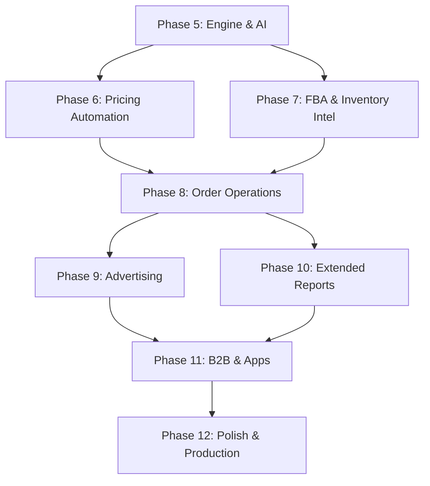

# Nexus Commerce — Phase 5+ Roadmap

## Current State Summary

**Completed Phases 1–4** have delivered 27 routes across:
- Navigation shell with collapsible sidebar (10 sections, 50+ nav items)
- Catalog management (CRUD, drafts, upload, product detail, editor with tabs)
- Inventory management (all inventory, FBA, stranded, upload, parent-child hierarchy)
- Pricing management (inline edit, alerts, margin calculation)
- Order management (filter/search, returns processing)
- Dashboard analytics (KPI cards, 30-day sales chart, activity feed, alerts)
- Reports (business reports with top products, CSV export)
- Performance (account health dashboard, seller feedback)
- Sync engine (marketplace sync logs, cron-based Amazon/eBay sync)

**27 disabled sidebar items** remain to be built.

**Existing infrastructure:**
- `apps/web` — Next.js 16 with Turbopack, App Router, server/client component split
- `apps/api` — Fastify with Amazon SP-API + eBay API + Gemini AI services
- `packages/database` — Prisma with PostgreSQL via PrismaPg adapter
- `packages/shared` — AES-256-GCM vault for credential encryption
- Schema: 16 models (Product, Variation, Image, Listing, Channel, Order, OrderItem, Return, StockLog, MarketplaceSync, FBAShipment, FBAShipmentItem, PricingRule, PricingRuleProduct, SellerFeedback, Campaign, Coupon)

---

## Phase 5 — Nexus Engine & AI Integration

**Theme:** Make the sync engine visible and controllable from the UI; leverage the existing Gemini AI service.

### 5a. eBay Sync Control Panel (`/engine/ebay`)
- **Page:** Server component showing all eBay-linked products with sync status
- **Actions:** Manual sync trigger per product, bulk sync all, pause/resume sync
- **Server actions:** `triggerEbaySync(productId)`, `bulkSyncEbay()` calling existing `EbayService`
- **Data:** Query `MarketplaceSync` where channel = EBAY, join Product

### 5b. AI Listing Generator (`/engine/ai`)
- **Page:** Client component with product selector, AI generation form, preview panel
- **Flow:** Select product → Gemini generates eBay listing data → preview → approve → publish
- **Integration:** Wire to existing `GeminiService.generateEbayListingData()` in `apps/api`
- **New API route:** `POST /api/ai/generate-listing` proxying to Fastify API
- **UI:** Split-pane with source product on left, generated listing preview on right

### 5c. Channel Connections (`/engine/channels`)
- **Page:** Channel management dashboard showing Amazon + eBay connection status
- **Features:** Test connection, view credentials (masked), last sync timestamp, error log
- **Data:** Query `Channel` model, display connection health
- **Actions:** `testConnection(channelId)` server action

### 5d. Sidebar Updates
- Enable: eBay Sync Control, AI Listing Generator, Channel Connections

### Schema Changes
None — uses existing `MarketplaceSync`, `Channel`, `Listing` models.

### Complexity: Medium
- 3 new pages, 2-3 server actions, 1 new API route
- Leverages existing Fastify services (EbayService, GeminiService, AmazonService)

---

## Phase 6 — Pricing Automation & Sales

**Theme:** Activate the pricing rule engine and sale management.

### 6a. Automate Pricing (`/pricing/automate`)
- **Page:** Rule builder UI with list of pricing rules
- **Rule types:** MATCH_LOW (match lowest competitor), PERCENTAGE_BELOW (X% below competitor), COST_PLUS_MARGIN (cost + X% margin)
- **UI:** Rule list → create/edit modal → product assignment
- **Server actions:** `createPricingRule()`, `updatePricingRule()`, `assignProductsToRule()`, `toggleRule()`
- **Data:** Uses existing `PricingRule` + `PricingRuleProduct` models
- **Background job:** New cron job in `apps/api` that evaluates active rules and updates prices

### 6b. Sale Dashboard (`/pricing/sales`)
- **Page:** Active and scheduled promotions/sales
- **Schema addition:**
```prisma
model Sale {
  id          String    @id @default(cuid())
  name        String
  discountType String   // PERCENTAGE, FIXED_AMOUNT
  discountValue Decimal @db.Decimal(10, 2)
  startDate   DateTime
  endDate     DateTime
  isActive    Boolean   @default(true)
  products    SaleProduct[]
  createdAt   DateTime  @default(now())
  updatedAt   DateTime  @updatedAt
}

model SaleProduct {
  id        String  @id @default(cuid())
  sale      Sale    @relation(fields: [saleId], references: [id])
  saleId    String
  product   Product @relation(fields: [productId], references: [id])
  productId String
  originalPrice Decimal @db.Decimal(10, 2)
  salePrice     Decimal @db.Decimal(10, 2)
  @@unique([saleId, productId])
}
```
- **UI:** Sale list with status badges, create sale wizard, product picker, date range selector

### 6c. Coupon Management (enhance existing `Coupon` model)
- **Page:** `/advertising/coupons` — list, create, edit coupons
- **UI:** Table with redemption tracking, create modal, date range, discount config

### Sidebar Updates
- Enable: Automate Pricing, Sale Dashboard, Coupons

### Complexity: Medium-High
- 3 new pages, 5+ server actions, 1 new cron job, 1 schema migration (Sale + SaleProduct)

---

## Phase 7 — FBA & Inventory Intelligence

**Theme:** FBA shipment management and inventory analytics.

### 7a. FBA Shipments (`/inventory/shipments`)
- **Page:** Shipment list with status pipeline (WORKING → SHIPPED → IN_TRANSIT → RECEIVING → CLOSED)
- **Features:** Create shipment wizard, add products, track receiving progress
- **Data:** Uses existing `FBAShipment` + `FBAShipmentItem` models
- **Server actions:** `createShipment()`, `addItemsToShipment()`, `updateShipmentStatus()`

### 7b. Inventory Age (`/inventory/age`)
- **Page:** Aging bucket analysis (0-30, 31-60, 61-90, 90+ days)
- **Data:** Derived from `Product.firstInventoryDate` field
- **UI:** Stacked bar chart (recharts), table with aging badges, export

### 7c. Inventory Health (`/inventory/health`)
- **Page:** KPI dashboard with sell-through rate, in-stock rate, excess inventory
- **Metrics:** Derived from orders + stock levels over time
- **UI:** Gauge charts, trend lines, product-level health scores

### 7d. Restock Recommendations (`/inventory/restock`)
- **Page:** Products needing restock based on sales velocity
- **Algorithm:** Average daily sales × lead time days = restock point
- **Schema addition:**
```prisma
// Add to Product model:
leadTimeDays    Int?     // Supplier lead time
reorderPoint    Int?     // Auto-calculated or manual
```
- **UI:** Table with recommended restock quantities, one-click FBA shipment creation

### 7e. Inventory Planning (`/inventory/planning`)
- **Page:** Demand forecasting dashboard
- **Data:** 30/60/90-day sales trends extrapolated forward
- **UI:** Forecast chart, seasonal adjustment toggles, export

### Sidebar Updates
- Enable: FBA Shipments, Inventory Age, Inventory Health, Restock Inventory, Inventory Planning

### Complexity: High
- 5 new pages, 5+ server actions, 1 schema migration
- Requires sales velocity calculation logic

---

## Phase 8 — Order Operations & Claims

**Theme:** Complete the order lifecycle management.

### 8a. Order Reports (`/orders/reports`)
- **Page:** Downloadable order reports with date range picker
- **Features:** Filter by status, channel, date range; CSV/PDF export
- **UI:** Date range selector, filter bar, preview table, download button

### 8b. Upload Order Files (`/orders/upload`)
- **Page:** Bulk shipping confirmation upload (CSV)
- **Flow:** Upload CSV with orderId + trackingNumber → validate → update orders
- **Server action:** `bulkUpdateShipping(rows[])`
- **UI:** Drag-and-drop upload (reuse pattern from inventory/upload)

### 8c. A-to-Z Claims (`/orders/claims`)
- **Schema addition:**
```prisma
model Claim {
  id          String   @id @default(cuid())
  order       Order    @relation(fields: [orderId], references: [id])
  orderId     String
  type        String   // A_TO_Z, CHARGEBACK
  status      String   // OPEN, UNDER_REVIEW, GRANTED, DENIED
  amount      Decimal  @db.Decimal(10, 2)
  reason      String
  buyerName   String?
  response    String?  // Seller response
  deadline    DateTime?
  createdAt   DateTime @default(now())
  updatedAt   DateTime @updatedAt
}
```
- **Page:** Claims list with status badges, response form, deadline tracking
- **UI:** FilterBar with status tabs, inline response editor

### Sidebar Updates
- Enable: Order Reports, Upload Order Files, A-to-Z Claims

### Complexity: Medium
- 3 new pages, 3 server actions, 1 schema migration (Claim model)

---

## Phase 9 — Advertising & Brand Management

**Theme:** PPC campaign management and brand content tools.

### 9a. Campaign Manager (`/advertising/campaigns`)
- **Page:** Campaign list with metrics (impressions, clicks, spend, sales, ACoS, ROAS)
- **Data:** Uses existing `Campaign` model
- **UI:** Table with sparkline charts, create/edit modal, budget management
- **Server actions:** `createCampaign()`, `updateCampaign()`, `toggleCampaignStatus()`

### 9b. A+ Content Editor (`/advertising/aplus`)
- **Page:** Rich content editor for product A+ Content
- **Integration:** Links to existing `Product.aPlusContent` JSON field
- **UI:** Block-based editor (text, image, comparison table), preview panel
- **Server action:** `updateAPlusContent(productId, content)`

### 9c. Brand Analytics (`/advertising/analytics`)
- **Page:** Search term reports, market basket analysis
- **Schema addition:**
```prisma
model SearchTermReport {
  id              String   @id @default(cuid())
  searchTerm      String
  impressions     Int
  clicks          Int
  conversions     Int
  conversionRate  Decimal  @db.Decimal(5, 2)
  reportDate      DateTime
  createdAt       DateTime @default(now())
}
```
- **UI:** Search term table with trend charts, top converting terms

### 9d. Deals & Vine (placeholder pages)
- `/advertising/deals` — Deal creation form (Lightning Deals, Best Deals)
- `/advertising/vine` — Vine enrollment status and product list
- `/advertising/stores` — Brand storefront link/status

### Sidebar Updates
- Enable: All 7 advertising items

### Complexity: High
- 5+ new pages, 5+ server actions, 1 schema migration
- A+ Content editor is the most complex component

---

## Phase 10 — Extended Reports & Analytics

**Theme:** Complete the reports section.

### 10a. Fulfillment Reports (`/reports/fulfillment`)
- FBA performance metrics, shipping times, inventory turnover
- Data from FBAShipment + Order models

### 10b. Payments (`/reports/payments`)
- **Schema addition:**
```prisma
model Payment {
  id            String   @id @default(cuid())
  type          String   // SETTLEMENT, REFUND, FEE, ADJUSTMENT
  amount        Decimal  @db.Decimal(10, 2)
  currency      String   @default("USD")
  description   String?
  orderId       String?
  settledAt     DateTime
  createdAt     DateTime @default(now())
}
```
- Settlement reports, fee breakdown, net proceeds chart

### 10c. Return Reports (`/reports/returns`)
- Return rate trends, top return reasons, product-level return analysis
- Data derived from existing `Return` model

### 10d. Tax Document Library (`/reports/tax`)
- **Schema addition:**
```prisma
model TaxDocument {
  id        String   @id @default(cuid())
  type      String   // VAT_INVOICE, 1099_K, ANNUAL_SUMMARY
  period    String   // e.g., "2026-Q1", "2025"
  country   String
  fileUrl   String
  createdAt DateTime @default(now())
}
```
- Document list with download links, EU VAT focus

### 10e. Custom Reports (`/reports/custom`)
- Report builder with dimension/metric selection
- Drag-and-drop column picker, date range, export

### 10f. Voice of the Customer (`/performance/voc`)
- Product-level customer experience metrics
- Data derived from returns + feedback

### Sidebar Updates
- Enable: All 6 reports items + Voice of the Customer

### Complexity: Medium-High
- 6 new pages, 2 schema migrations

---

## Phase 11 — B2B, Apps & Global

**Theme:** Complete remaining sidebar sections.

### 11a. B2B Quotes (`/b2b/quotes`)
- Quote management for business buyers
- Uses existing `Product.b2bPrice` and `Product.b2bMinQty` fields

### 11b. B2B Opportunities (`/b2b/opportunities`)
- Product opportunity suggestions for B2B marketplace

### 11c. Marketplace Appstore (`/apps`)
- Catalog of available integrations/apps

### 11d. Selling Partner API (`/apps/api`)
- SP-API credential management, webhook configuration
- Integration with existing `packages/shared/vault.ts` for encryption

### 11e. Multi-Channel Fulfillment (`/inventory/mcf`)
- MCF order creation for non-Amazon channels

### 11f. Removal Orders (`/inventory/removals`)
- FBA removal/disposal order management

### 11g. Global Selling (`/inventory/global`)
- Multi-marketplace inventory view across regions

### Sidebar Updates
- Enable: All remaining disabled items (B2B, Apps, MCF, Removals, Global)

### Complexity: Medium
- 7 pages, mostly CRUD with existing schema

---

## Phase 12 — Platform Polish & Production Readiness

**Theme:** Cross-cutting concerns for production deployment.

### 12a. Authentication & RBAC
- **Package:** NextAuth.js v5 with Prisma adapter
- **Schema additions:**
```prisma
model User {
  id            String    @id @default(cuid())
  email         String    @unique
  name          String?
  passwordHash  String
  role          UserRole  @default(VIEWER)
  createdAt     DateTime  @default(now())
  updatedAt     DateTime  @updatedAt
  sessions      Session[]
}

model Session {
  id           String   @id @default(cuid())
  userId       String
  user         User     @relation(fields: [userId], references: [id])
  token        String   @unique
  expiresAt    DateTime
  createdAt    DateTime @default(now())
}

enum UserRole {
  ADMIN
  MANAGER
  VIEWER
}
```
- **Middleware:** Route protection, role-based page access
- **UI:** Login page, user settings, team management

### 12b. Notification System
- **Schema addition:**
```prisma
model Notification {
  id        String   @id @default(cuid())
  userId    String?
  type      String   // LOW_STOCK, SYNC_FAILED, RETURN_REQUESTED, PRICE_ALERT
  title     String
  message   String
  isRead    Boolean  @default(false)
  actionUrl String?
  createdAt DateTime @default(now())
}
```
- **UI:** Bell icon in TopBar with dropdown, notification center page
- **Triggers:** Low stock, sync failures, new returns, price alerts

### 12c. Global Search
- **UI:** Cmd+K search modal searching products, orders, SKUs
- **Implementation:** Server action with multi-model Prisma queries
- **Keyboard shortcut:** `useEffect` listener for Cmd+K / Ctrl+K

### 12d. Dark Mode
- Tailwind `dark:` variant classes
- Toggle in TopBar, localStorage persistence

### 12e. Production Observability
- Error boundary components for graceful error handling
- Structured logging in Fastify API
- Health check endpoint (`GET /health`)
- Database connection monitoring

### 12f. CI/CD Pipeline
- GitHub Actions workflow: lint → type-check → build → test
- Docker Compose for local development
- Environment variable validation at startup

### Complexity: High
- Auth is the most impactful cross-cutting change
- Notifications require event triggers throughout existing code

---

## Recommended Implementation Order



**Priority rationale:**
1. **Phase 5 (Engine & AI)** — Highest value. The sync engine and AI generator are the core differentiator of Nexus Commerce. The Fastify services already exist; this phase just wires them to the UI.
2. **Phase 6 (Pricing Automation)** — High value. Automated repricing is a top seller need. Schema models already exist.
3. **Phase 7 (FBA & Inventory Intel)** — High value. FBA shipment management and restock recommendations directly impact revenue.
4. **Phase 8 (Order Operations)** — Medium value. Completes the order lifecycle. Bulk shipping upload saves significant time.
5. **Phase 9 (Advertising)** — Medium value. Campaign management is important but less urgent than core operations.
6. **Phase 10 (Extended Reports)** — Medium value. Builds on existing recharts infrastructure.
7. **Phase 11 (B2B & Apps)** — Lower value. Niche features for specific seller segments.
8. **Phase 12 (Polish & Production)** — Critical for launch but can be parallelized. Auth should be added before any multi-user deployment.

---

## Schema Migration Summary

| Phase | New Models | Modified Models |
|-------|-----------|----------------|
| 5 | None | None |
| 6 | Sale, SaleProduct | Product (add saleProducts relation) |
| 7 | None | Product (add leadTimeDays, reorderPoint) |
| 8 | Claim | Order (add claims relation) |
| 9 | SearchTermReport | None |
| 10 | Payment, TaxDocument | None |
| 11 | None | None |
| 12 | User, Session, Notification | All models (add userId for multi-tenancy) |

---

## Technical Debt to Address

1. **Prisma reserved keyword:** `prisma.return` requires bracket notation `(prisma as any)['return']` — consider renaming model to `ReturnRequest` in next migration
2. **Stale Prisma types:** IDE shows false errors for newer schema fields — ensure `prisma generate` runs in CI/CD
3. **Duplicate pages:** `/products/[id]` and `/catalog/[id]` both exist — remove `/products/[id]` redirect
4. **Duplicate logs:** `/logs` and `/engine/logs` both exist — remove `/logs`
5. **`(prisma as any)` casts:** Several pages use `any` casts for Prisma queries — fix by ensuring generated client is in sync
