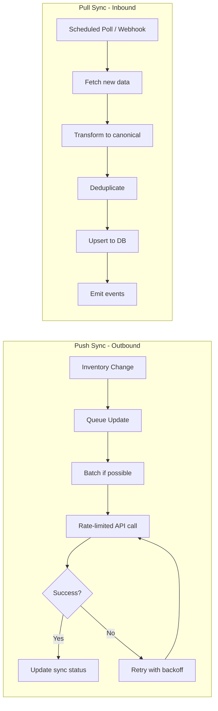
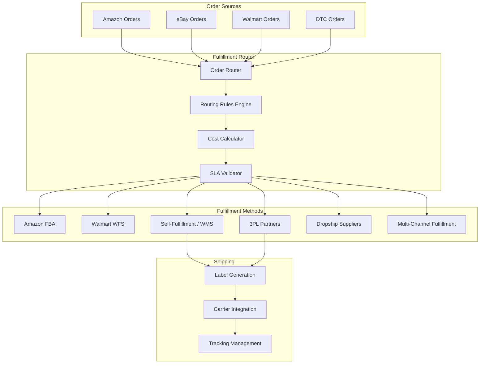
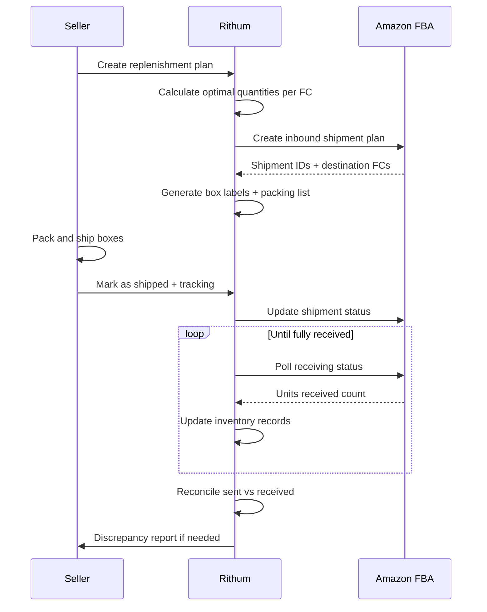
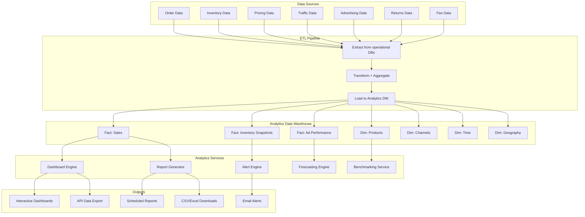
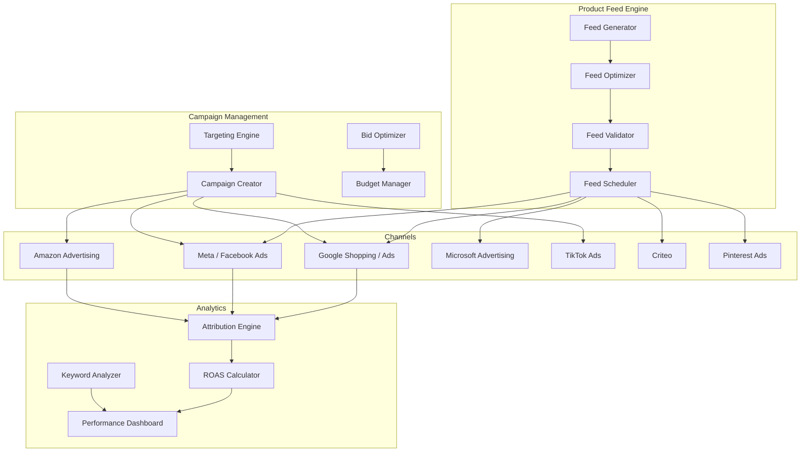
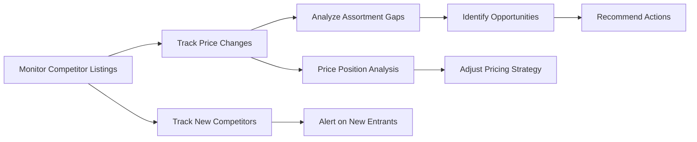
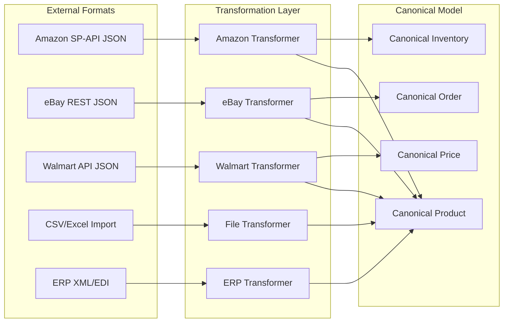
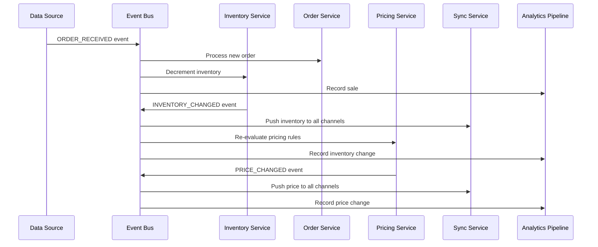

Every marketplace integration in Rithum follows a **standardized connector pattern**. Each connector implements a common interface but handles the channel-specific protocol, authentication, data format, and rate limiting internally.

```mermaid
graph TB
    subgraph Connector Interface
        direction TB
        IF_CAT[catalogSync]
        IF_INV[inventoryUpdate]
        IF_ORD[orderFetch / orderAcknowledge]
        IF_PRC[priceUpdate]
        IF_FUL[shipmentConfirm]
        IF_RET[returnProcess]
        IF_RPT[reportFetch]
    end

    subgraph Amazon Connector
        AMZ_AUTH[SP-API OAuth + STS]
        AMZ_RATE[Rate Limiter - burst/restore model]
        AMZ_FEED[Feed Submission Engine]
        AMZ_RPT[Report Polling Engine]
        AMZ_NOTIF[SQS Notification Listener]
        AMZ_RETRY[Exponential Backoff Retry]
    end

    subgraph eBay Connector
        EBAY_AUTH[OAuth2 User Token + App Token]
        EBAY_RATE[Rate Limiter - calls/day model]
        EBAY_INV_API[Inventory API v1]
        EBAY_TRAD[Trading API - legacy]
        EBAY_FEED[Feed API - bulk]
        EBAY_NOTIF[Platform Notifications]
    end

    subgraph Walmart Connector
        WALM_AUTH[RSA-SHA256 Signature Auth]
        WALM_RATE[Rate Limiter - calls/min]
        WALM_FEED[Bulk Feed Upload]
        WALM_API[Marketplace API v3]
    end

    IF_CAT --> AMZ_FEED
    IF_CAT --> EBAY_INV_API
    IF_CAT --> WALM_FEED
    IF_INV --> AMZ_FEED
    IF_INV --> EBAY_INV_API
    IF_INV --> WALM_API
    IF_ORD --> AMZ_RPT
    IF_ORD --> EBAY_TRAD
    IF_ORD --> WALM_API
```



#### 3.5.2 Supported Marketplaces (Major Categories)

| Category | Channels | Integration Depth |
|----------|----------|-------------------|
| **General Marketplaces** | Amazon (20+ regions), eBay (20+ sites), Walmart, Mercado Libre, Rakuten, Cdiscount, Allegro, Bol.com, Catch, Fruugo, Wish, Newegg | Full: catalog + inventory + orders + pricing |
| **Specialty Marketplaces** | Etsy, Wayfair, Overstock, Houzz, Reverb, Poshmark, StockX | Full or partial |
| **Retail/Dropship** | Target Plus, Home Depot, Lowes, Best Buy, Costco, Kroger | Dropship-specific: orders + fulfillment |
| **Social Commerce** | TikTok Shop, Facebook/Instagram Shops, Pinterest | Catalog + orders |
| **International** | Zalando, OTTO, Kaufland, Shopee, Lazada, Flipkart, JD.com, Tmall | Varies by region |
| **DTC Platforms** | Shopify, BigCommerce, WooCommerce, Magento | Bidirectional sync |
| **Advertising** | Google Shopping, Microsoft Advertising, Meta Ads, Amazon Advertising, Criteo | Feed + campaign management |

#### 3.5.3 Per-Channel Integration Depth

**Amazon Integration (Deepest)**

| Capability | API Used | Sync Direction |
|-----------|----------|----------------|
| Product Listing | SP-API Listings Items | Push |
| Catalog Enrichment | SP-API Catalog Items | Pull |
| Inventory Update | SP-API Inventory - FBA + FBM | Push |
| Order Download | SP-API Orders | Pull |
| Order Acknowledgment | SP-API Orders | Push |
| Shipment Confirmation | SP-API Feeds | Push |
| Pricing Update | SP-API Pricing / Feeds | Push |
| Buy Box Monitoring | SP-API Pricing | Pull |
| FBA Inbound Shipments | SP-API FBA Inbound | Push/Pull |
| Advertising Campaigns | Amazon Ads API | Push/Pull |
| Reports | SP-API Reports | Pull |
| Notifications | SQS/SNS Notifications | Pull via event |
| A+ Content | SP-API A+ Content | Push |
| Brand Analytics | SP-API Brand Analytics | Pull |

**eBay Integration**

| Capability | API Used | Sync Direction |
|-----------|----------|----------------|
| Product Listing | Inventory API / Trading API | Push |
| Inventory Update | Inventory API | Push |
| Order Download | Fulfillment API / Trading API | Pull |
| Shipment Confirmation | Fulfillment API | Push |
| Pricing Update | Inventory API via offer | Push |
| Promoted Listings | Marketing API | Push/Pull |
| Returns | Post-Order API | Pull/Push |
| Category Mapping | Taxonomy API | Pull |
| Item Specifics | Taxonomy API | Pull |

#### 3.5.4 Connector Sync Patterns



**Sync Frequency by Data Type:**

| Data Type | Push Frequency | Pull Frequency |
|-----------|---------------|----------------|
| Inventory | Near real-time, under 5 min | Every 15-30 min |
| Prices | Near real-time, under 5 min | Every 15-30 min |
| Orders | N/A, pull only | Every 5-15 min |
| Catalog | On change | Daily full sync |
| Reports | N/A | Daily/weekly scheduled |

---

### 3.6 Fulfillment Management

#### 3.6.1 Overview

Rithum's fulfillment module orchestrates the shipping process across multiple fulfillment methods: self-fulfillment, FBA (Fulfillment by Amazon), WFS (Walmart Fulfillment Services), 3PL providers, and dropship networks.

#### 3.6.2 Fulfillment Architecture



#### 3.6.3 Multi-Channel Fulfillment (MCF)

A key Rithum capability is using Amazon FBA to fulfill orders from non-Amazon channels:

```
eBay Order Received
    |
    +-- Check: Is product in FBA inventory?
    |   +-- Yes -> Create MCF order via Amazon SP-API
    |   |         Amazon ships directly to eBay buyer
    |   |         Tracking uploaded to eBay
    |   |
    |   +-- No -> Route to self-fulfillment or 3PL
    |
    +-- Cost comparison: MCF fee vs self-ship cost
        +-- Route to cheapest option meeting SLA
```

#### 3.6.4 FBA Inbound Shipment Management



#### 3.6.5 Shipping Carrier Integrations

Rithum integrates with major carriers for label generation and tracking:

- **US**: UPS, FedEx, USPS, DHL, OnTrac, LaserShip
- **EU**: Royal Mail, DPD, Hermes, GLS, PostNL, Correos, Poste Italiane
- **Global**: DHL Express, FedEx International, UPS International
- **Aggregators**: ShipStation, Shippo, EasyPost, Pirate Ship

---

### 3.7 Analytics & Reporting

#### 3.7.1 Overview

Rithum provides a comprehensive analytics platform that aggregates data across all channels into unified dashboards and reports. The analytics engine processes billions of data points to provide actionable insights.

#### 3.7.2 Analytics Architecture



#### 3.7.3 Report Categories

| Category | Reports | Key Metrics |
|----------|---------|-------------|
| **Sales** | Sales Summary, Sales by Channel, Sales by Product, Sales by Geography, Sales Trend | Revenue, Units, AOV, Conversion Rate |
| **Inventory** | Stock Levels, Aging Analysis, Sell-Through Rate, Restock Recommendations, Stranded Inventory | Days of Supply, Turn Rate, In-Stock %, Excess Units |
| **Pricing** | Price Change History, Competitive Price Analysis, Buy Box Win Rate, Margin Analysis | Buy Box %, Price Position, Margin %, Price Changes/Day |
| **Orders** | Order Volume, Fulfillment Performance, Cancellation Rate, Return Rate | Orders/Day, Ship Time, Defect Rate, Return % |
| **Advertising** | Campaign Performance, ACOS/ROAS, Keyword Performance, Ad Spend | Impressions, Clicks, CTR, ACOS, ROAS, TACoS |
| **Financial** | P&L by Product, Fee Analysis, Settlement Reports, Tax Reports | Gross Margin, Net Margin, Fee %, Tax Liability |
| **Performance** | Account Health, Seller Metrics, Customer Feedback, Policy Compliance | ODR, Late Ship %, Valid Tracking %, Feedback Score |

#### 3.7.4 Dashboard Widgets

Rithum's dashboard provides real-time widgets:

```
+------------------------------------------------------------------+
|  DASHBOARD                                                        |
+---------------+---------------+---------------+---------------+   |
| Total Sales   | Orders Today  | Units Sold    | Avg Order     |   |
| $45,230       | 127           | 342           | $35.61        |   |
| ^ 12.3%       | ^ 8.1%        | ^ 15.2%       | v 2.1%        |   |
+---------------+---------------+---------------+---------------+   |
|                                                                   |
|  +----------------------------+  +----------------------------+   |
|  | Sales by Channel 7d        |  | Inventory Health           |   |
|  | ============ Amazon 62%    |  | In-Stock: 94.2%            |   |
|  | ====== eBay 24%            |  | Stranded: 12 SKUs          |   |
|  | === Walmart 9%             |  | Low Stock: 28 SKUs         |   |
|  | == Other 5%                |  | Excess: 45 SKUs            |   |
|  +----------------------------+  +----------------------------+   |
|                                                                   |
|  +----------------------------+  +----------------------------+   |
|  | Revenue Trend 30d          |  | Top Products               |   |
|  |  /\  /\/\                  |  | 1. Widget Pro - $8,420     |   |
|  | /  \/    \/\               |  | 2. Gadget X - $6,110      |   |
|  |            \/              |  | 3. Tool Kit - $4,890      |   |
|  +----------------------------+  +----------------------------+   |
|                                                                   |
|  +----------------------------+  +----------------------------+   |
|  | Buy Box Performance        |  | Action Items               |   |
|  | Win Rate: 78.3%            |  | ! 5 price alerts           |   |
|  | Lost to Price: 15.2%       |  | ! 3 listing errors         |   |
|  | Lost to Stock: 6.5%        |  | ! 12 low stock warnings    |   |
|  +----------------------------+  +----------------------------+   |
+------------------------------------------------------------------+
```

#### 3.7.5 Forecasting & Intelligence

Rithum uses ML-based forecasting for:

- **Demand Forecasting**: Predict future sales by SKU/channel using historical data, seasonality, and trend analysis
- **Restock Recommendations**: When to reorder and how much, based on lead times and forecasted demand
- **Price Elasticity**: How price changes affect demand for each product
- **Seasonal Trends**: Identify and prepare for seasonal demand patterns
- **Anomaly Detection**: Alert on unusual sales spikes/drops, inventory discrepancies, or pricing anomalies

---

### 3.8 Digital Marketing & Advertising

#### 3.8.1 Overview

Rithum's digital marketing module manages product advertising across search engines, social media, and marketplace advertising platforms. It handles feed management, campaign creation, bid optimization, and performance tracking.

#### 3.8.2 Marketing Architecture



#### 3.8.3 Product Feed Management

Product feeds are the backbone of digital marketing. Rithum generates optimized feeds for each advertising channel:

| Channel | Feed Format | Key Optimizations |
|---------|------------|-------------------|
| **Google Shopping** | XML / TSV via Merchant Center | Title optimization, GTIN validation, price accuracy, image quality |
| **Meta Commerce** | CSV / XML via Commerce Manager | Product set segmentation, dynamic creative optimization |
| **Microsoft Shopping** | TSV via Merchant Center | Bing-specific title optimization |
| **Amazon Ads** | Internal via Advertising API | ASIN targeting, keyword harvesting |
| **Criteo** | XML feed | Category mapping, bid optimization |
| **Pinterest** | TSV / XML | Visual-first optimization, pin-friendly titles |

**Feed Optimization Process:**

```
Raw Product Data
    |
    +-- Title Optimization
    |   +-- Channel-specific character limits
    |   +-- Keyword insertion: brand + product type + key attributes
    |   +-- A/B testing of title variants
    |   +-- Performance-based title selection
    |
    +-- Image Optimization
    |   +-- White background enforcement for Google
    |   +-- Lifestyle image selection for Meta
    |   +-- Resolution/size validation
    |   +-- Alt text generation
    |
    +-- Category Mapping
    |   +-- Auto-classification via ML
    |   +-- Google Product Category mapping
    |   +-- Meta Product Category mapping
    |   +-- Custom label assignment
    |
    +-- Price and Availability
    |   +-- Real-time price sync
    |   +-- Sale price scheduling
    |   +-- Out-of-stock suppression
    |   +-- Price drop annotations
    |
    +-- Custom Labels
        +-- Margin tier: high/medium/low
        +-- Best seller flag
        +-- Seasonal relevance
        +-- Clearance/new arrival
```

#### 3.8.4 Amazon Advertising Management

Rithum provides deep Amazon Advertising integration:

| Feature | Description |
|---------|-------------|
| **Sponsored Products** | Keyword and ASIN-targeted product ads |
| **Sponsored Brands** | Brand awareness campaigns with custom headlines |
| **Sponsored Display** | Retargeting and audience-based display ads |
| **Campaign Automation** | Auto-create campaigns from product catalog |
| **Bid Optimization** | AI-driven bid adjustments based on ACOS targets |
| **Keyword Harvesting** | Auto-discover converting search terms from auto campaigns |
| **Negative Keywords** | Auto-negate non-converting terms |
| **Budget Pacing** | Distribute daily budget evenly or front-load |
| **Dayparting** | Adjust bids by time of day/day of week |
| **Portfolio Management** | Group campaigns by brand/category with shared budgets |

---

### 3.9 Brand Analytics & Intelligence

#### 3.9.1 Overview

Rithum provides brand-level intelligence that goes beyond individual seller metrics. This module helps brands understand their market position, competitive landscape, and consumer behavior across channels.

#### 3.9.2 Brand Analytics Capabilities

| Capability | Description | Data Source |
|-----------|-------------|-------------|
| **Market Share** | Brand share of category sales | Aggregated marketplace data |
| **Search Analytics** | Top search terms driving traffic to products | Amazon Brand Analytics, Google Search Console |
| **Competitive Intelligence** | Competitor pricing, assortment, and positioning | Price monitoring, catalog analysis |
| **Consumer Demographics** | Age, gender, income of buyers | Amazon Demographics, Meta Audience Insights |
| **Purchase Behavior** | Repeat purchase rate, basket analysis | Order history analysis |
| **Content Performance** | Which product content drives conversion | A/B testing, traffic analysis |
| **Channel Performance** | Compare performance across all channels | Cross-channel analytics |
| **MAP Monitoring** | Track unauthorized sellers and MAP violations | Price monitoring across channels |

#### 3.9.3 Competitive Intelligence Flow



---

## 4. Data Architecture & Flow Patterns

### 4.1 Canonical Data Model Philosophy

Rithum's most important architectural decision is the **canonical data model**. All external data (from marketplaces, ERPs, feeds) is normalized into an internal canonical format before any processing occurs. This decouples the core business logic from channel-specific formats.



### 4.2 Event-Driven Data Flow

All state changes in Rithum emit events that trigger downstream processing:



### 4.3 Data Consistency Model

| Data Type | Consistency Model | Rationale |
|-----------|------------------|-----------|
| **Inventory** | Eventually consistent, under 5 min | Speed of propagation vs accuracy tradeoff |
| **Orders** | Strongly consistent internally | Financial accuracy required |
| **Prices** | Eventually consistent, under 5 min | Channel API latency |
| **Catalog** | Eventually consistent, under 1 hour | Less time-sensitive |
| **Analytics** | Eventually consistent, under 15 min | Batch processing acceptable |

### 4.4 Data Retention & Archival

| Data Type | Hot Storage | Warm Storage | Cold/Archive |
|-----------|------------|-------------|--------------|
| **Orders** | 90 days | 2 years | 7 years for compliance |
| **Inventory Snapshots** | 30 days | 1 year | 3 years |
| **Price History** | 90 days | 2 years | 5 years |
| **Analytics** | 30 days real-time | 2 years aggregated | Indefinite |
| **Audit Logs** | 90 days | 2 years | 7 years |
| **Product Data** | Active | N/A | Indefinite |

---

## 5. API Architecture

### 5.1 Rithum REST API

Rithum exposes a comprehensive REST API for programmatic access to all platform features. The API follows RESTful conventions with JSON payloads.

#### 5.1.1 API Structure

```
Base URL: https://api.channeladvisor.com/v1

Authentication: OAuth 2.0 client_credentials grant

Endpoints:

/products
  GET    /products                    -- List products, paginated
  POST   /products                    -- Create product
  GET    /products/{id}               -- Get product details
  PUT    /products/{id}               -- Update product
  DELETE /products/{id}               -- Delete product
  POST   /products/bulk               -- Bulk create/update
  GET    /products/{id}/variations    -- Get variations

/inventory
  GET    /inventory                   -- List inventory
  PUT    /inventory/{sku}             -- Update quantity
  POST   /inventory/bulk              -- Bulk update
  GET    /inventory/{sku}/locations   -- Multi-location inventory

/orders
  GET    /orders                      -- List orders, filtered
  GET    /orders/{id}                 -- Get order details
  PUT    /orders/{id}/ship            -- Mark as shipped
  PUT    /orders/{id}/cancel          -- Cancel order
  POST   /orders/{id}/refund          -- Process refund
  GET    /orders/{id}/returns         -- Get returns

/pricing
  GET    /pricing/{sku}               -- Get current prices
  PUT    /pricing/{sku}               -- Update price
  POST   /pricing/bulk                -- Bulk price update
  GET    /pricing/rules               -- Get repricing rules

/listings
  GET    /listings                    -- List channel listings
  GET    /listings/{id}               -- Get listing details
  PUT    /listings/{id}/activate      -- Activate listing
  PUT    /listings/{id}/deactivate    -- Deactivate listing

/reports
  GET    /reports/types               -- Available report types
  POST   /reports/generate            -- Generate report
  GET    /reports/{id}/status         -- Check report status
  GET    /reports/{id}/download       -- Download report

/channels
  GET    /channels                    -- List connected channels
  GET    /channels/{id}/status        -- Channel connection status
```

#### 5.1.2 API Design Patterns

| Pattern | Implementation |
|---------|---------------|
| **Pagination** | Cursor-based with `pageToken` and `pageSize` |
| **Filtering** | OData-style `$filter` query parameter |
| **Sorting** | `$orderby` parameter |
| **Field Selection** | `$select` parameter for sparse responses |
| **Rate Limiting** | Token bucket with `X-RateLimit-*` headers |
| **Versioning** | URL path versioning: `/v1/`, `/v2/` |
| **Error Format** | RFC 7807 Problem Details JSON |
| **Bulk Operations** | Async with job ID polling |
| **Webhooks** | Event-driven push notifications |

#### 5.1.3 Webhook Events

```
Webhook Events:
  order.created          -- New order received from any channel
  order.shipped          -- Order marked as shipped
  order.cancelled        -- Order cancelled
  order.returned         -- Return initiated
  inventory.low_stock    -- SKU below threshold
  inventory.out_of_stock -- SKU reached zero
  price.changed          -- Price updated on a channel
  listing.error          -- Listing submission failed
  listing.activated      -- Listing went live
  sync.completed         -- Sync cycle completed
  sync.failed            -- Sync cycle failed
```

### 5.2 Integration API Patterns

#### 5.2.1 Inbound Integration (ERP/WMS