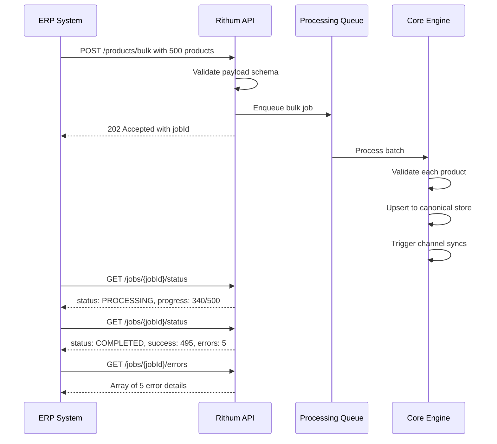
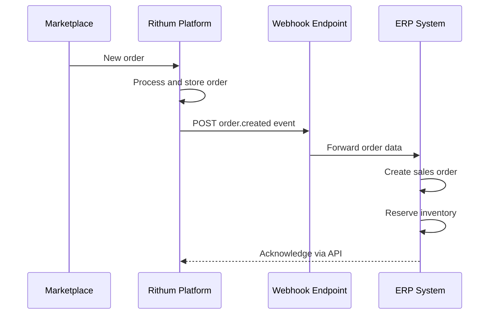
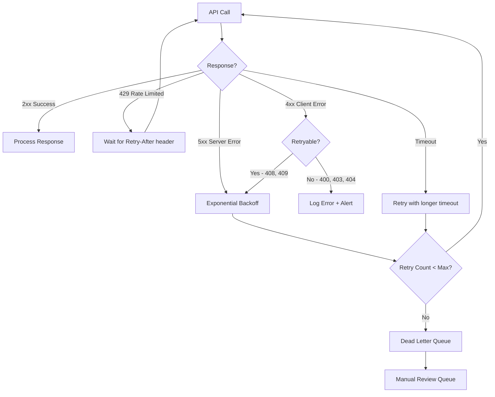
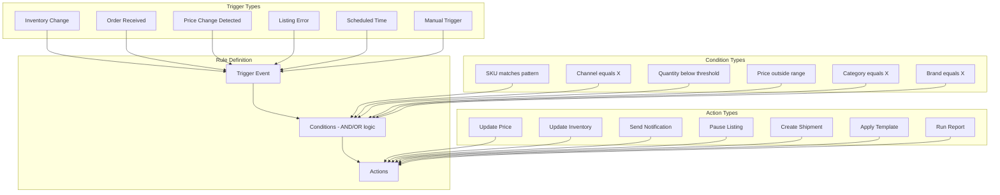
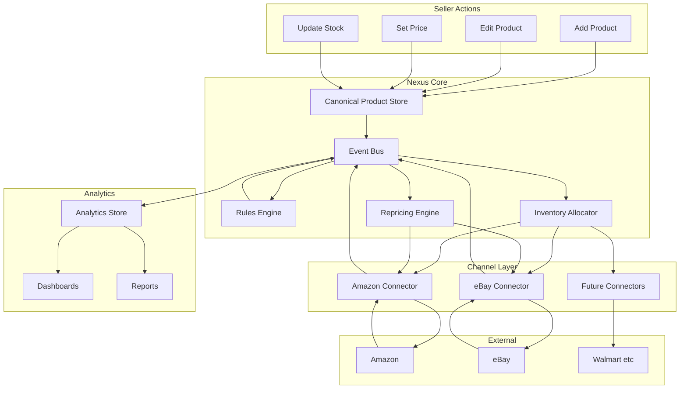

### 5.2 Integration API Patterns

#### 5.2.1 Inbound Integration (ERP/WMS to Rithum)



#### 5.2.2 Outbound Integration (Rithum to ERP/WMS)



---

## 6. Integration Patterns & Connectors

### 6.1 Connector Design Pattern

Each marketplace connector in Rithum follows a standardized design pattern:

```
interface MarketplaceConnector {
  // Authentication
  authenticate(): Promise<AuthToken>
  refreshToken(): Promise<AuthToken>
  
  // Catalog Operations
  createListing(product: CanonicalProduct): Promise<ListingResult>
  updateListing(listingId: string, product: CanonicalProduct): Promise<void>
  deleteListing(listingId: string): Promise<void>
  getListing(listingId: string): Promise<ChannelListing>
  
  // Inventory Operations
  updateInventory(sku: string, quantity: number, locationId?: string): Promise<void>
  bulkUpdateInventory(updates: InventoryUpdate[]): Promise<BulkResult>
  getInventory(sku: string): Promise<InventoryLevel>
  
  // Order Operations
  fetchOrders(since: Date): Promise<CanonicalOrder[]>
  acknowledgeOrder(orderId: string): Promise<void>
  shipOrder(orderId: string, shipment: ShipmentData): Promise<void>
  cancelOrder(orderId: string, reason: string): Promise<void>
  
  // Pricing Operations
  updatePrice(sku: string, price: PriceData): Promise<void>
  bulkUpdatePrices(updates: PriceUpdate[]): Promise<BulkResult>
  getCompetitivePricing(sku: string): Promise<CompetitivePrice[]>
  
  // Reports
  requestReport(type: ReportType): Promise<string>  // returns reportId
  getReportStatus(reportId: string): Promise<ReportStatus>
  downloadReport(reportId: string): Promise<ReportData>
}
```

### 6.2 Rate Limiting Strategies

Each marketplace has different rate limiting models. Rithum handles them all:

| Marketplace | Rate Limit Model | Rithum Strategy |
|------------|-----------------|-----------------|
| **Amazon SP-API** | Burst + restore (e.g., 5 burst, 1/sec restore) | Token bucket with per-operation tracking |
| **eBay** | Daily call limits (e.g., 5000/day) + per-second | Sliding window counter + request queuing |
| **Walmart** | Calls per minute (e.g., 20/min for some endpoints) | Fixed window with backpressure |
| **Google** | Quota per project per day | Daily budget allocation across operations |
| **Meta** | Calls per hour with business-level limits | Hourly window with priority queuing |

### 6.3 Error Handling & Retry Strategy



### 6.4 Data Transformation Pipeline

For each channel, data flows through a transformation pipeline:

```
Canonical Data
    |
    v
+-------------------+
| Field Mapping     |  Map canonical fields to channel fields
+-------------------+
    |
    v
+-------------------+
| Value Transform   |  Convert values (e.g., condition codes, units)
+-------------------+
    |
    v
+-------------------+
| Validation        |  Check channel-specific required fields
+-------------------+
    |
    v
+-------------------+
| Enrichment        |  Add channel-specific data (policies, categories)
+-------------------+
    |
    v
+-------------------+
| Format            |  Serialize to channel format (JSON, XML, TSV)
+-------------------+
    |
    v
Channel API Call
```

---

## 7. Workflow Engine & Automation

### 7.1 Rules Engine Architecture

Rithum's rules engine is the backbone of automation. It allows sellers to define business rules that trigger actions based on conditions.



### 7.2 Common Automation Workflows

| Workflow | Trigger | Condition | Action |
|----------|---------|-----------|--------|
| **Low Stock Alert** | Inventory change | Quantity < 10 | Email notification + increase price 5% |
| **Out of Stock** | Inventory = 0 | Any channel | Pause all channel listings |
| **Restock** | Inventory increase from 0 | Was paused | Reactivate all channel listings |
| **Price Match** | Competitor price change | Competitor < our price | Adjust to match minus $0.01 |
| **New Order** | Order received | Any | Decrement inventory + notify warehouse |
| **Return Received** | Return completed | Item sellable | Increment inventory + relist |
| **Listing Error** | Sync failure | 3+ consecutive failures | Alert + pause auto-sync |
| **Seasonal Pricing** | Scheduled (Nov 1) | Category = Holiday | Apply 15% discount |

### 7.3 Scheduled Jobs

Rithum runs numerous scheduled jobs:

| Job | Frequency | Purpose |
|-----|-----------|---------|
| **Full Inventory Sync** | Every 15 min | Reconcile inventory across all channels |
| **Order Pull** | Every 5-15 min | Fetch new orders from all channels |
| **Price Sync** | Every 15 min | Push price changes to channels |
| **Catalog Sync** | Daily | Full catalog reconciliation |
| **Report Generation** | Daily/Weekly | Generate scheduled reports |
| **Feed Submission** | 2-4x daily | Submit product feeds to ad channels |
| **Competitive Price Check** | Every 30 min | Monitor competitor pricing |
| **Account Health Check** | Daily | Check seller metrics across channels |
| **Stale Listing Cleanup** | Weekly | Remove/update stale listings |
| **Analytics Aggregation** | Hourly | Roll up transactional data |

---

## 8. User Interface Architecture

### 8.1 UI Organization

Rithum's UI is organized into major functional areas, each accessible from a primary navigation:

```
+------------------------------------------------------------------+
| RITHUM                                    Search | Alerts | User  |
+----------+-------------------------------------------------------+
|          |                                                        |
| NAV      |  CONTENT AREA                                         |
|          |                                                        |
| Home     |  +--------------------------------------------------+ |
|          |  | Page Header + Breadcrumbs + Actions               | |
| Products |  +--------------------------------------------------+ |
|  Catalog |  |                                                    | |
|  Import  |  | Filters / Tabs / Search                           | |
|          |  |                                                    | |
| Inventory|  +--------------------------------------------------+ |
|  Manage  |  |                                                    | |
|  FBA     |  | Data Table / Dashboard / Form                     | |
|  Alerts  |  |                                                    | |
|          |  | - Sortable columns                                | |
| Orders   |  | - Inline editing                                  | |
|  Manage  |  | - Bulk selection                                  | |
|  Returns |  | - Row expansion                                   | |
|          |  |                                                    | |
| Pricing  |  +--------------------------------------------------+ |
|  Reprice |  |                                                    | |
|  Rules   |  | Pagination: 25 | 50 | 100 | 250 per page         | |
|          |  |                                                    | |
| Marketing|  +--------------------------------------------------+ |
|  Feeds   |                                                        |
|  Ads     |                                                        |
|          |                                                        |
| Analytics|                                                        |
|  Reports |                                                        |
|  Dashbd  |                                                        |
|          |                                                        |
| Settings |                                                        |
|  Account |                                                        |
|  Channels|                                                        |
|  API     |                                                        |
+----------+-------------------------------------------------------+
```

### 8.2 Key UI Patterns

| Pattern | Usage | Implementation |
|---------|-------|---------------|
| **Data Table** | Product list, order list, inventory | Virtualized table with sort, filter, column toggle, inline edit |
| **Bulk Actions** | Multi-select + action bar | Floating action bar on selection |
| **Inline Edit** | Price, quantity, status changes | Click-to-edit with optimistic update |
| **Slide-Out Panel** | Order details, product preview | Right-side panel overlay |
| **Wizard** | Product creation, shipment creation | Multi-step form with validation |
| **Dashboard Cards** | KPI display | Stat card with trend indicator |
| **Charts** | Sales trends, inventory health | Line, bar, pie, sparkline charts |
| **Filter Bar** | All list views | Composable filter chips with saved presets |
| **Search** | Global and per-section | Typeahead with recent searches |
| **Notifications** | Alerts, errors, success | Toast notifications + bell icon dropdown |

### 8.3 Navigation Hierarchy

Rithum's navigation follows a **section > subsection > action** hierarchy:

```
Level 1: Section (e.g., Inventory)
  Level 2: Subsection (e.g., Manage Inventory)
    Level 3: View/Action (e.g., Edit Product, Bulk Update)
```

Each section has:
- **Primary view**: The default table/dashboard when clicking the section
- **Sub-views**: Filtered or specialized views
- **Actions**: Create, import, export, bulk operations
- **Settings**: Section-specific configuration

---

## 9. Security & Compliance

### 9.1 Authentication & Authorization

| Layer | Mechanism |
|-------|-----------|
| **User Auth** | SSO via SAML 2.0 / OAuth 2.0, MFA support |
| **API Auth** | OAuth 2.0 client_credentials with scoped tokens |
| **Channel Auth** | Per-channel OAuth/API key stored encrypted |
| **Role-Based Access** | Admin, Manager, Operator, Viewer roles |
| **Tenant Isolation** | Row-level security in database |

### 9.2 Data Security

| Concern | Implementation |
|---------|---------------|
| **Encryption at Rest** | AES-256 for all stored data |
| **Encryption in Transit** | TLS 1.3 for all API communication |
| **Credential Storage** | HSM-backed key management for channel credentials |
| **PII Handling** | Buyer data encrypted, access-logged |
| **Audit Trail** | All data changes logged with user, timestamp, before/after |

### 9.3 Compliance

| Standard | Relevance |
|----------|-----------|
| **SOC 2 Type II** | Security, availability, processing integrity |
| **GDPR** | EU customer data handling |
| **PCI DSS** | Payment data (if handling card data) |
| **CCPA** | California consumer privacy |
| **VAT Compliance** | EU cross-border VAT calculation |

---

## 10. Comparison: Rithum vs Nexus Commerce

### 10.1 Feature Parity Matrix

| Feature Area | Rithum | Nexus Commerce Current | Gap |
|-------------|--------|----------------------|-----|
| **Product Catalog** | Full PIM with 400+ channel transforms | Basic product CRUD with 5-tab editor | Need: channel transforms, category mapping, listing quality score |
| **Inventory Management** | Multi-location, allocation engine, safety stock, oversell prevention | Single-location, basic stock tracking | Need: allocation engine, multi-location, safety stock buffers |
| **Order Management** | Multi-channel aggregation, routing, returns, refunds | Basic order table from Amazon | Need: order routing, returns workflow, multi-channel orders |
| **Pricing** | Algorithmic repricing, Buy Box strategy, margin optimization | Basic price parity sync (Amazon to eBay) | Need: repricing engine, strategies, price validation |
| **Marketplace Integrations** | 400+ channels with standardized connectors | Amazon SP-API + eBay REST (2 channels) | Need: connector abstraction layer, more channels |
| **Fulfillment** | FBA, WFS, 3PL, MCF, carrier integration | Basic FBA awareness, no fulfillment routing | Need: fulfillment router, MCF, carrier integration |
| **Analytics** | Full BI with forecasting, benchmarking | Basic dashboard with stat cards | Need: analytics DW, report builder, forecasting |
| **Digital Marketing** | Feed management, campaign automation, bid optimization | None | Need: feed generator, ad channel integrations |
| **Automation** | Rules engine with triggers, conditions, actions | Cron-based 3-phase sync job | Need: rules engine, event-driven automation |
| **API** | Full REST API with webhooks | Fastify API with 3 route groups | Need: comprehensive API, webhooks |
| **AI/ML** | Content optimization, demand forecasting, bid optimization | Gemini AI for eBay listing generation | Strength: AI listing generation is ahead of basic Rithum |

### 10.2 Architectural Alignment

| Rithum Pattern | Nexus Commerce Equivalent | Alignment |
|---------------|--------------------------|-----------|
| Hub-and-spoke with connectors | Direct service calls to Amazon/eBay | Partial - need connector abstraction |
| Canonical data model | Prisma Product model | Good - already normalized |
| Event-driven processing | Cron-based sync | Gap - need event bus |
| Multi-tenant SaaS | Single-tenant | N/A for now |
| Microservices | Monolithic Fastify + Next.js | Acceptable for scale |
| Analytics data warehouse | Same PostgreSQL DB | Gap - need analytics layer |
| Rules engine | Hardcoded sync logic | Gap - need configurable rules |

### 10.3 What Nexus Commerce Does Better

| Area | Advantage |
|------|-----------|
| **AI Listing Generation** | Gemini AI generates optimized eBay listings from Amazon data - more advanced than Rithum's basic content tools |
| **Developer Experience** | Modern stack (Next.js 14, TypeScript, Prisma, TanStack Table) vs Rithum's legacy .NET/Java stack |
| **UI/UX** | Amazon Seller Central-inspired UI is more intuitive than Rithum's enterprise UI |
| **Setup Simplicity** | Single docker-compose vs Rithum's complex enterprise deployment |
| **Cost** | Self-hosted vs Rithum's $1,000-$10,000+/month SaaS pricing |

---

## 11. Key Takeaways for Nexus Commerce

### 11.1 Critical Architecture Patterns to Adopt

1. **Connector Abstraction Layer**: Create a `MarketplaceConnector` interface that all channel integrations implement. This is the single most important architectural pattern from Rithum. Currently, `AmazonService` and `EbayService` have different interfaces. They should implement a common contract.

2. **Canonical Data Model**: The existing Prisma `Product` model is a good start but needs enrichment. Add channel-specific override fields and a `ChannelListing` model that stores per-channel transformed data separately from the canonical product.

3. **Event-Driven Processing**: Replace the cron-based sync with an event-driven architecture. When inventory changes, emit an event that triggers updates to all channels. Use a lightweight event bus (even an in-process EventEmitter for now, graduating to Redis pub/sub or BullMQ later).

4. **Inventory Allocation Engine**: The current system treats inventory as a single number. Implement allocation rules that distribute available quantity across channels with safety stock buffers.

5. **Price Validation Pipeline**: Before any price change reaches a channel, it should pass through validation rules (floor, ceiling, MAP, max change %). This prevents catastrophic pricing errors.

### 11.2 Priority Implementation Roadmap

Based on the Rithum study, here is the recommended priority order for Nexus Commerce:

```
Phase 1: Foundation (Connector Abstraction)
  - Create MarketplaceConnector interface
  - Refactor AmazonService and EbayService to implement it
  - Add ChannelListing model for per-channel data
  - Implement basic event emitter for state changes

Phase 2: Inventory Intelligence
  - Multi-location inventory support
  - Safety stock buffer configuration
  - Channel allocation rules
  - Oversell prevention logic
  - Low stock alerts

Phase 3: Pricing Engine
  - Repricing rule builder UI
  - Buy Box monitoring (Amazon)
  - Price validation pipeline
  - Cross-channel price parity with offsets
  - Price change audit log

Phase 4: Order Management
  - Multi-channel order aggregation
  - Order routing rules
  - Returns management workflow
  - Shipment tracking integration
  - Order lifecycle state machine

Phase 5: Analytics & Reporting
  - Sales analytics dashboard
  - Inventory health metrics
  - Pricing performance reports
  - Channel comparison analytics
  - Scheduled report generation

Phase 6: Marketing & Feeds
  - Google Shopping feed generator
  - Meta Commerce feed
  - Amazon Advertising integration
  - Campaign performance tracking

Phase 7: Advanced Automation
  - Visual rules engine builder
  - Trigger-condition-action workflows
  - Scheduled automation
  - Anomaly detection alerts
```

### 11.3 Data Model Enhancements Needed

Based on the Rithum study, the following additions to the Prisma schema would bring Nexus Commerce closer to Rithum's capabilities:

```
New Models Needed:
  - InventoryLocation      -- Multi-warehouse support
  - InventoryAllocation    -- Per-channel allocation rules
  - ChannelListingOverride -- Per-channel product data overrides
  - PriceHistory           -- Audit trail of all price changes
  - RepricingRule          -- Configurable repricing strategies
  - AutomationRule         -- Trigger-condition-action rules
  - AutomationLog          -- Execution history of rules
  - ReportSchedule         -- Scheduled report definitions
  - ReportExecution        -- Report generation history
  - WebhookEndpoint        -- Outbound webhook configuration
  - WebhookDelivery        -- Webhook delivery log
  - FeedSubmission         -- Product feed submission tracking
  - CompetitorPrice        -- Tracked competitor pricing data

Enhancements to Existing Models:
  Product:
    - Add: mapPrice, competitorCount, buyBoxOwner, listingQualityScore
    - Add: channelOverrides relation
  
  Order:
    - Add: fulfillmentMethod, routedTo, acknowledgedAt, shippingCost
    - Add: channel-specific order IDs (ebayOrderId, walmartOrderId)
  
  Channel:
    - Add: syncFrequency, lastFullSync, errorCount, healthStatus
    - Add: rateLimitConfig JSON
  
  MarketplaceSync:
    - Add: syncType (FULL/INCREMENTAL/PRICE/INVENTORY)
    - Add: itemsProcessed, itemsFailed, duration
    - Add: errorDetails JSON
```

### 11.4 End-to-End Data Flow (Target State)



### 11.5 Summary

Rithum/ChannelAdvisor is the gold standard for multichannel commerce platforms. Its architecture is built on decades of marketplace integration experience. The key lessons for Nexus Commerce are:

1. **Abstract the channels** — Never let channel-specific logic leak into core business logic
2. **Normalize everything** — Canonical data model is non-negotiable
3. **Events over cron** — React to changes, don't poll for them
4. **Validate before execute** — Every outbound change passes through validation
5. **Audit everything** — Every state change is logged for debugging and compliance
6. **Allocate intelligently** — Inventory distribution is a strategic decision, not just a number
7. **Price scientifically** — Repricing is algorithmic, not manual
8. **Measure obsessively** — Analytics drives every business decision

The current Nexus Commerce codebase has a solid foundation with its Prisma data model, Amazon SP-API integration, eBay publishing pipeline, and AI-powered listing generation. The path forward is to layer Rithum's architectural patterns on top of this foundation, starting with the connector abstraction and event-driven processing.
