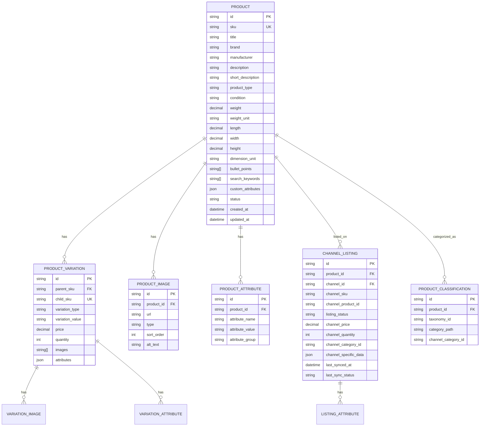
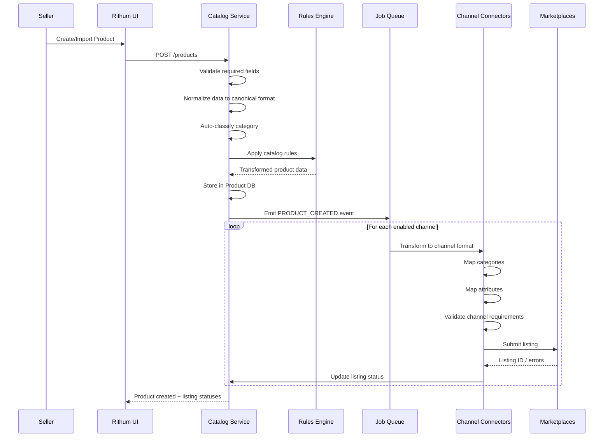
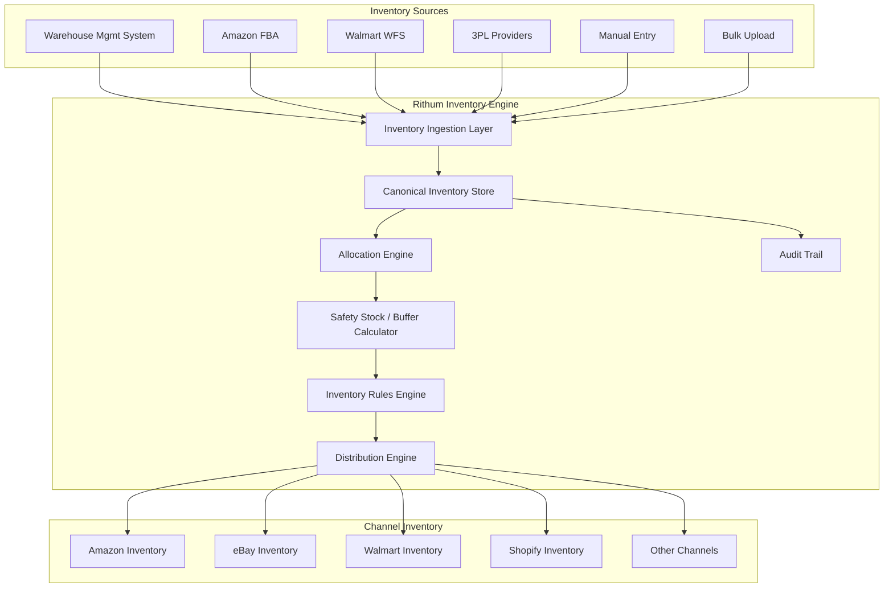
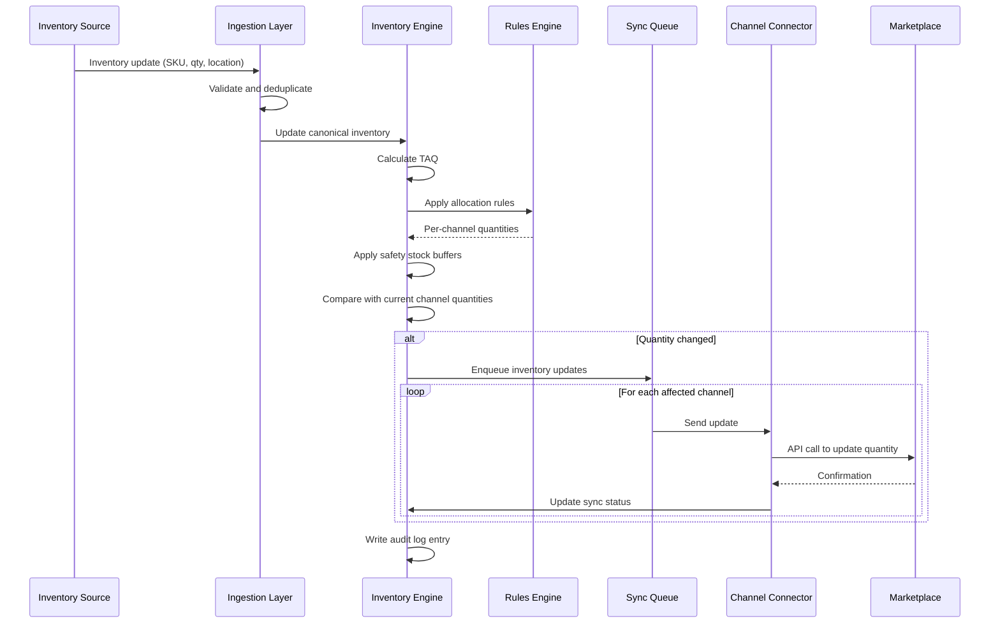
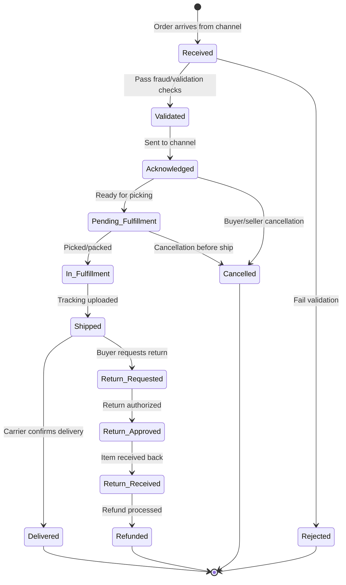
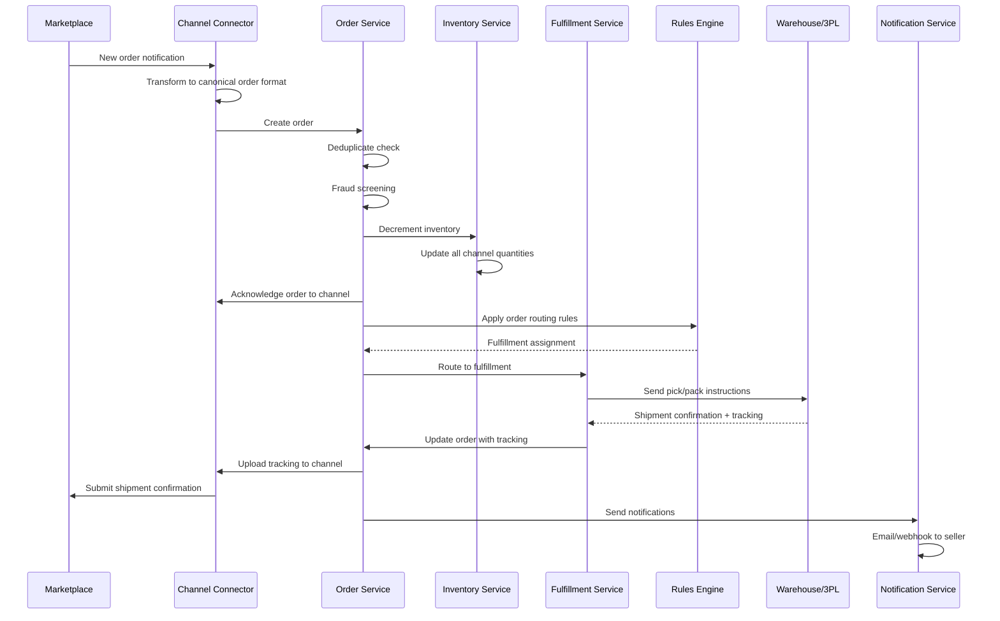
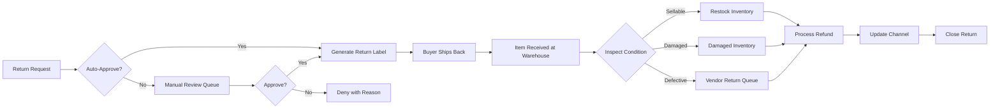
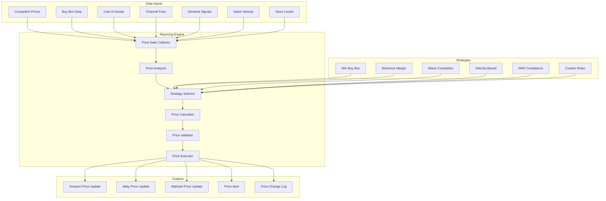

# Rithum (formerly ChannelAdvisor) — Complete Architecture Study

> **Purpose**: Comprehensive analysis of Rithum's platform architecture, processes, data flows, and operational model. This document serves as the reference blueprint for building Nexus Commerce with feature parity and architectural alignment to the industry-leading multichannel commerce platform.

> **Context**: Rithum was formed in 2024 from the merger of ChannelAdvisor (founded 2001, IPO 2013, acquired by CommerceHub 2022) and CommerceHub. It is the world's largest multichannel commerce network, connecting brands/retailers to 400+ marketplaces, retailers, and digital marketing channels globally.

---

## Table of Contents

1. [Platform Overview & Philosophy](#1-platform-overview--philosophy)
2. [High-Level System Architecture](#2-high-level-system-architecture)
3. [Core Module Deep Dives](#3-core-module-deep-dives)
   - 3.1 Product/Catalog Management
   - 3.2 Inventory Management
   - 3.3 Order Management
   - 3.4 Pricing & Repricing Engine
   - 3.5 Marketplace Integrations
   - 3.6 Fulfillment Management
   - 3.7 Analytics & Reporting
   - 3.8 Digital Marketing & Advertising
   - 3.9 Brand Analytics & Intelligence
4. [Data Architecture & Flow Patterns](#4-data-architecture--flow-patterns)
5. [API Architecture](#5-api-architecture)
6. [Integration Patterns & Connectors](#6-integration-patterns--connectors)
7. [Workflow Engine & Automation](#7-workflow-engine--automation)
8. [User Interface Architecture](#8-user-interface-architecture)
9. [Security & Compliance](#9-security--compliance)
10. [Comparison: Rithum vs Nexus Commerce](#10-comparison-rithum-vs-nexus-commerce)
11. [Key Takeaways for Nexus Commerce](#11-key-takeaways-for-nexus-commerce)

---

## 1. Platform Overview & Philosophy

### 1.1 What Rithum Does

Rithum operates as a **multichannel commerce middleware platform** — it sits between a seller/brand's internal systems (ERP, WMS, PIM) and the external marketplace/retail/advertising ecosystem. Its core value proposition:

```
┌─────────────────────────────────────────────────────────────────┐
│                     SELLER / BRAND                               │
│  ERP · WMS · PIM · OMS · Accounting · Shipping                  │
└──────────────────────────┬──────────────────────────────────────┘
                           │
                    ┌──────▼──────┐
                    │   RITHUM    │
                    │  Platform   │
                    │             │
                    │ • Normalize │
                    │ • Transform │
                    │ • Optimize  │
                    │ • Automate  │
                    │ • Analyze   │
                    └──────┬──────┘
                           │
    ┌──────────────────────┼──────────────────────────┐
    │                      │                          │
┌───▼───┐  ┌──────▼──────┐  ┌────▼────┐  ┌──────▼──────┐
│Amazon │  │eBay/Walmart │  │ Google  │  │ Retail      │
│       │  │Etsy/Shopify │  │ Meta    │  │ Dropship    │
│       │  │Mercado/Bol  │  │ TikTok  │  │ Networks    │
└───────┘  └─────────────┘  └─────────┘  └─────────────┘
```

### 1.2 Core Platform Pillars

Rithum's architecture is built around **seven operational pillars**:

| Pillar | Function | Rithum Module |
|--------|----------|---------------|
| **Where to Sell** | Marketplace/channel expansion | Marketplaces, Retail |
| **What to Sell** | Product data management | Catalog, PIM |
| **How Much** | Pricing optimization | Repricing, Algorithmic Pricing |
| **How Many** | Inventory distribution | Inventory Management |
| **How to Ship** | Fulfillment orchestration | Fulfillment, Shipping |
| **How to Grow** | Marketing & advertising | Digital Marketing, SEO |
| **How to Know** | Analytics & intelligence | Analytics, Reporting, Brand Analytics |

### 1.3 Platform Scale

- **400+** marketplace and retail channel integrations
- **$36B+** GMV processed annually
- **3,500+** brand and retailer customers
- **100M+** SKUs managed across the network
- **Billions** of transactions processed per year
- **Global** presence: NA, EU, APAC, LATAM

---

## 2. High-Level System Architecture

### 2.1 Architectural Pattern: Hub-and-Spoke with Event-Driven Core

Rithum uses a **hub-and-spoke architecture** where the central platform acts as the hub, and each marketplace/channel is a spoke connected via dedicated connectors. Internally, the platform uses an **event-driven microservices architecture**.

```mermaid
graph TB
    subgraph Seller Systems
        ERP[ERP System]
        WMS[Warehouse Mgmt]
        PIM[Product Info Mgmt]
        OMS[Order Mgmt System]
    end

    subgraph Rithum Platform Core
        API[REST API Gateway]
        EVTBUS[Event Bus / Message Queue]
        
        subgraph Services
            CATSVC[Catalog Service]
            INVSVC[Inventory Service]
            ORDSVC[Order Service]
            PRCSVC[Pricing Service]
            FLFSVC[Fulfillment Service]
            MKTSVC[Marketing Service]
            ANASVC[Analytics Service]
            RULESVC[Rules Engine]
        end
        
        subgraph Data Layer
            PRODDB[(Product DB)]
            INVDB[(Inventory DB)]
            ORDDB[(Order DB)]
            ANLDB[(Analytics DW)]
            CACHE[(Redis Cache)]
            QUEUE[(Job Queue)]
        end
    end

    subgraph Channel Connectors
        AMZCON[Amazon Connector]
        EBAYCON[eBay Connector]
        WALMCON[Walmart Connector]
        GOOGCON[Google Connector]
        METACON[Meta Connector]
        GENCON[Generic REST Connector]
    end

    subgraph Marketplaces
        AMZ[Amazon]
        EBAY[eBay]
        WALM[Walmart]
        GOOG[Google Shopping]
        META[Meta Commerce]
        OTHER[400+ Others]
    end

    ERP --> API
    WMS --> API
    PIM --> API
    OMS --> API

    API --> EVTBUS
    EVTBUS --> CATSVC
    EVTBUS --> INVSVC
    EVTBUS --> ORDSVC
    EVTBUS --> PRCSVC
    EVTBUS --> FLFSVC
    EVTBUS --> MKTSVC
    EVTBUS --> ANASVC

    CATSVC --> PRODDB
    INVSVC --> INVDB
    ORDSVC --> ORDDB
    ANASVC --> ANLDB

    RULESVC --> EVTBUS

    CATSVC --> AMZCON
    CATSVC --> EBAYCON
    CATSVC --> WALMCON
    INVSVC --> AMZCON
    INVSVC --> EBAYCON
    ORDSVC --> AMZCON
    ORDSVC --> EBAYCON
    PRCSVC --> AMZCON
    PRCSVC --> EBAYCON
    MKTSVC --> GOOGCON
    MKTSVC --> METACON

    AMZCON --> AMZ
    EBAYCON --> EBAY
    WALMCON --> WALM
    GOOGCON --> GOOG
    METACON --> META
    GENCON --> OTHER
```



### 2.2 Key Architectural Principles

1. **Channel Abstraction**: Every marketplace is abstracted behind a uniform connector interface. The core platform never speaks marketplace-specific protocols directly.

2. **Canonical Data Model**: All product, inventory, order, and pricing data is normalized into a canonical internal format. Channel-specific transformations happen at the connector layer.

3. **Event-Driven Processing**: State changes (inventory update, order received, price change) emit events that trigger downstream processing across services.

4. **Idempotent Operations**: All sync operations are designed to be safely retried. Every operation has a unique transaction ID.

5. **Eventually Consistent**: The system embraces eventual consistency — a price change in the platform may take seconds to minutes to propagate to all channels.

6. **Multi-Tenant SaaS**: Single codebase serving thousands of sellers, with tenant isolation at the data layer.

### 2.3 Infrastructure Stack (Inferred)

| Layer | Technology |
|-------|-----------|
| **Cloud** | AWS (primary), with multi-region deployment |
| **Compute** | Kubernetes-orchestrated microservices |
| **API Gateway** | Custom gateway with rate limiting, auth, routing |
| **Message Queue** | Apache Kafka / AWS SQS for event streaming |
| **Primary DB** | PostgreSQL / SQL Server for transactional data |
| **Analytics DB** | Columnar store (Redshift/Snowflake) for reporting |
| **Cache** | Redis for inventory counts, session data, rate limits |
| **Search** | Elasticsearch for product catalog search |
| **File Storage** | S3 for product images, feeds, reports |
| **CDN** | CloudFront for static assets and image delivery |
| **Monitoring** | Datadog/New Relic for APM, custom dashboards |

---

## 3. Core Module Deep Dives

### 3.1 Product / Catalog Management

#### 3.1.1 Overview

The catalog module is the **foundation of the entire platform**. It manages the canonical product data that gets transformed and distributed to every connected channel. Rithum treats the product catalog as a **Product Information Management (PIM)** system.

#### 3.1.2 Data Model — Canonical Product



#### 3.1.3 Catalog Processes

**Product Creation Flow:**



**Key Catalog Capabilities:**

| Capability | Description |
|-----------|-------------|
| **Bulk Import** | CSV/Excel/XML import with field mapping wizard. Supports 100K+ SKUs per upload. |
| **Template System** | Channel-specific listing templates with variable substitution. E.g., eBay HTML templates. |
| **Category Mapping** | Automatic and manual mapping from internal taxonomy to each channel's category tree. |
| **Attribute Mapping** | Maps canonical attributes to channel-specific required/optional attributes. |
| **Variation Management** | Parent/child SKU relationships with variation themes (size, color, material). |
| **Image Management** | CDN-hosted images with automatic resizing per channel requirements. |
| **Content Optimization** | AI-powered title/description optimization per channel's SEO rules. |
| **Listing Quality Score** | Scores each listing's completeness and optimization level per channel. |
| **Clone/Duplicate** | Clone products across channels with channel-specific overrides. |
| **Bulk Edit** | Edit attributes across thousands of SKUs simultaneously. |
| **Feed Management** | Generate and submit product data feeds in each channel's required format. |

#### 3.1.4 Channel-Specific Transformations

Rithum maintains a **transformation layer** for each channel that converts canonical product data:

```
Canonical Product
    │
    ├── Amazon Transform
    │   ├── Map to Amazon Browse Node
    │   ├── Generate Flat File / JSON feed
    │   ├── Apply Amazon-specific attributes (bullet_point, search_terms)
    │   ├── Validate against Amazon's Product Type Definition
    │   └── Submit via SP-API Listings Items API
    │
    ├── eBay Transform
    │   ├── Map to eBay Category ID
    │   ├── Generate Item Specifics from attributes
    │   ├── Apply eBay HTML description template
    │   ├── Set eBay-specific policies (return, shipping, payment)
    │   └── Submit via Inventory API or Trading API
    │
    ├── Walmart Transform
    │   ├── Map to Walmart Product Type
    │   ├── Generate Walmart-specific attributes
    │   ├── Apply Walmart content guidelines
    │   └── Submit via Walmart Marketplace API
    │
    └── Google Shopping Transform
        ├── Map to Google Product Category
        ├── Generate Shopping feed (XML/TSV)
        ├── Apply Google Merchant Center requirements
        └── Submit via Content API for Shopping
```

---

### 3.2 Inventory Management

#### 3.2.1 Overview

Rithum's inventory module is one of its most critical and complex systems. It manages **real-time inventory quantities across all channels** while preventing overselling and optimizing stock distribution.

#### 3.2.2 Inventory Architecture



#### 3.2.3 Inventory Concepts

**Total Available Quantity (TAQ) Calculation:**

```
TAQ = Physical Stock
    + In-Transit Stock
    - Reserved (pending orders)
    - Safety Stock Buffer
    - Damaged/Defective Hold
    - Channel-Specific Reserves
```

**Inventory Distribution Strategies:**

| Strategy | Description | Use Case |
|----------|-------------|----------|
| **Equal Distribution** | Split TAQ equally across all channels | Simple multi-channel |
| **Percentage Allocation** | Assign % of TAQ to each channel | Prioritize high-performing channels |
| **Velocity-Based** | Allocate based on sales velocity per channel | Optimize for sell-through |
| **Fixed Allocation** | Set fixed quantities per channel | Limited inventory, exclusive deals |
| **Shared Pool** | All channels share the full TAQ (first-come-first-served) | Maximum availability, higher oversell risk |
| **Waterfall** | Priority-ordered channels get first allocation | Channel prioritization |

#### 3.2.4 Inventory Sync Process



#### 3.2.5 Oversell Prevention

Rithum implements multiple layers of oversell prevention:

1. **Real-Time Decrement**: When an order is received from any channel, inventory is immediately decremented across all channels before the order is even acknowledged.

2. **Safety Stock Buffer**: Configurable per-SKU or per-channel buffer that's subtracted from available quantity.

3. **Velocity-Based Buffer**: Automatically increases buffer for fast-selling items during peak periods.

4. **Channel Sync Latency Compensation**: Accounts for the delay between sending an update and the channel reflecting it.

5. **Order Velocity Monitoring**: If orders are coming in faster than sync can propagate, the system proactively reduces quantities.

#### 3.2.6 Multi-Location Inventory

```
Location A (Warehouse NJ)     Location B (FBA)     Location C (3PL CA)
├── SKU-001: 50 units         ├── SKU-001: 30       ├── SKU-001: 20
├── SKU-002: 100 units        ├── SKU-002: 0        ├── SKU-002: 50
└── SKU-003: 25 units         └── SKU-003: 75       └── SKU-003: 0

                    ┌─────────────────────┐
                    │  Aggregated View     │
                    │  SKU-001: 100 total  │
                    │  SKU-002: 150 total  │
                    │  SKU-003: 100 total  │
                    └─────────────────────┘
```

---

### 3.3 Order Management

#### 3.3.1 Overview

Rithum's Order Management System (OMS) aggregates orders from all connected channels into a single unified view, manages the order lifecycle, and orchestrates fulfillment routing.

#### 3.3.2 Order Lifecycle



#### 3.3.3 Order Processing Pipeline



#### 3.3.4 Order Routing Rules

Rithum's order routing engine determines **which warehouse/fulfillment center** should handle each order:

| Rule Type | Logic | Example |
|-----------|-------|---------|
| **Proximity** | Route to nearest warehouse to buyer | Buyer in CA → Ship from CA warehouse |
| **Inventory** | Route to location with stock | If FBA out of stock → route to FBM |
| **Cost** | Route to cheapest fulfillment option | Compare FBA fees vs self-ship cost |
| **Channel** | Channel-specific routing | Amazon orders → FBA; eBay orders → self-ship |
| **Priority** | Preferred fulfillment center first | Primary warehouse → overflow to 3PL |
| **SLA** | Route based on delivery promise | 2-day promise → nearest warehouse with stock |
| **Product** | Route by product attributes | Hazmat → specialized warehouse |

#### 3.3.5 Returns Management



---

### 3.4 Pricing & Repricing Engine

#### 3.4.1 Overview

Rithum's repricing engine is one of its most sophisticated modules. It provides **algorithmic, rule-based, and AI-driven pricing** that automatically adjusts prices across channels to win the Buy Box, maintain margins, and respond to competitive dynamics.

#### 3.4.2 Repricing Architecture



#### 3.4.3 Repricing Strategies

**1. Buy Box Winner Strategy (Amazon-specific)**

```
Target: Win the Amazon Buy Box

Algorithm:
1. Fetch current Buy Box price and Buy Box winner
2. If we own the Buy Box → maintain current price
3. If we don't own the Buy Box:
   a. Calculate: competitor_price - $0.01 (penny below)
   b. Check against floor price (cost + min margin)
   c. If viable → set new price
   d. If below floor → set to floor price
   e. If competitor is FBA and we are FBM → apply FBA advantage offset
4. Apply velocity modifier:
   - High velocity + low stock → increase price
   - Low velocity + high stock → decrease price (within bounds)
```

**2. Margin Maximizer Strategy**

```
Target: Maximize profit margin while maintaining sales velocity

Algorithm:
1. Calculate current margin: (price - cost - fees) / price
2. If margin < target_margin:
   a. Increase price by increment
   b. Monitor sales velocity for 24h
   c. If velocity drops > threshold → revert
3. If margin > target_margin + buffer:
   a. Decrease price to gain velocity
   b. Find optimal price/velocity equilibrium
4. Apply channel-specific fee calculations:
   - Amazon: referral fee + FBA fee + storage
   - eBay: final value fee + promoted listing fee
   - Walmart: referral fee
```

**3. Competitive Matching Strategy**

```
Target: Stay within X% of lowest competitor

Parameters:
- match_type: LOWEST | AVERAGE | SPECIFIC_SELLER
- offset_type: PERCENTAGE | FIXED_AMOUNT
- offset_value: e.g., -2% or -$0.50
- floor_price: minimum acceptable price
- ceiling_price: maximum price

Algorithm:
1. Identify target competitor price
2. Calculate: target_price = competitor_price * (1 + offset)
3. Clamp to [floor_price, ceiling_price]
4. If MAP (Minimum Advertised Price) exists → max(target_price, MAP)
```

#### 3.4.4 Price Validation Rules

Before any price change is executed, it passes through validation:

| Rule | Check | Action on Fail |
|------|-------|----------------|
| **Floor Price** | price >= cost + min_margin | Block + alert |
| **Ceiling Price** | price <= max_price | Cap at ceiling |
| **MAP Compliance** | price >= MAP | Set to MAP |
| **Max Change %** | abs(change) <= max_change_pct | Block + alert |
| **Max Change $** | abs(change) <= max_change_amt | Block + alert |
| **Frequency Limit** | changes_today < max_daily_changes | Queue for tomorrow |
| **Channel Min** | price >= channel_minimum | Set to channel min |
| **Sanity Check** | price > $0 AND price < $999,999 | Block + alert |

#### 3.4.5 Cross-Channel Price Parity

Rithum manages price relationships across channels:

```
Base Price (canonical): $29.99

Channel Rules:
├── Amazon:  base_price (must match or channel penalizes)
├── eBay:    base_price + $2.00 (higher fees)
├── Walmart: base_price - $0.50 (price match guarantee)
├── Shopify: base_price + $5.00 (DTC premium)
└── Google:  base_price (feed price must match landing page)
```

---

### 3.5 Marketplace Integrations

#### 3.5.1 Connector Architecture