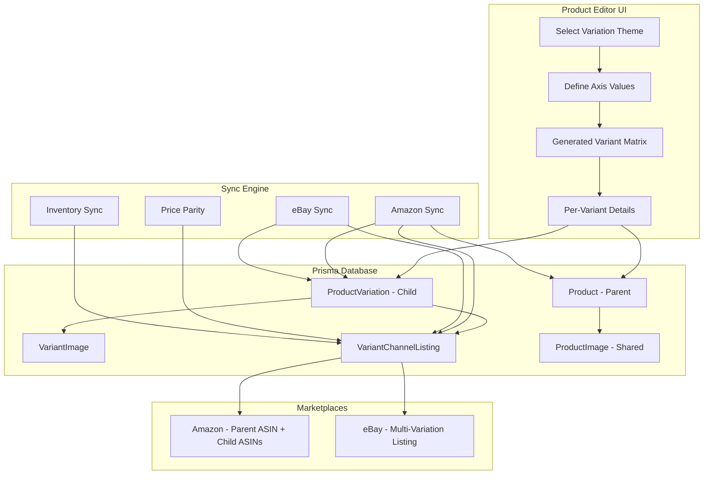

# Rithum Product Listing Architecture — Part 2

> Continuation of [rithum-product-listing-architecture.md](rithum-product-listing-architecture.md) — covers API representation completion and the full Nexus Commerce replication strategy.

---

## 5. API Representation (continued)

### 5.1 REST API — Product with Variants Response (continued)

The second variant in the response:

```json
      {
        "id": "pv_cuid_002",
        "childSku": "NIKE-AM90-WHT-09",
        "price": 134.99,
        "costPrice": 54.00,
        "minPrice": 104.99,
        "maxPrice": 164.99,
        "quantity": 19,
        "isActive": true,
        "variationAttributes": {
          "Color": "White",
          "Size": "9"
        },
        "identifiers": {
          "UPC": "012345678902",
          "EAN": "0012345678902"
        },
        "weight": {
          "value": 1.1,
          "unit": "lb"
        },
        "dimensions": {
          "length": 12.5,
          "width": 8.5,
          "height": 5.0,
          "unit": "in"
        },
        "fulfillmentMethod": "FBA",
        "images": [
          {
            "url": "https://cdn.example.com/am90-white-front.jpg",
            "type": "MAIN",
            "sortOrder": 0
          },
          {
            "url": "https://cdn.example.com/am90-white-swatch.jpg",
            "type": "SWATCH",
            "sortOrder": 1
          }
        ],
        "channelListings": [
          {
            "channel": "AMAZON",
            "channelProductId": "B08XYZ5678",
            "channelSku": "NIKE-AM90-WHT-09",
            "channelPrice": 134.99,
            "channelQuantity": 19,
            "listingStatus": "ACTIVE",
            "lastSyncedAt": "2026-04-22T18:30:00Z",
            "lastSyncStatus": "SUCCESS"
          }
        ]
      }
    ],
    "variantCount": 2,
    "totalInventory": 27,
    "createdAt": "2026-01-15T10:00:00Z",
    "updatedAt": "2026-04-22T18:30:00Z"
  }
}
```

### 5.2 API — Create Product with Variants (POST)

```json
POST /api/products

{
  "parentSku": "NIKE-AM90",
  "title": "Nike Air Max 90 Running Shoe",
  "brand": "Nike",
  "manufacturer": "Nike Inc.",
  "description": "The iconic Air Max 90...",
  "bulletPoints": [
    "Visible Max Air unit for impact cushioning",
    "Waffle outsole with durable rubber"
  ],
  "productType": "SHOES",
  "condition": "NEW",
  "variationTheme": "SizeColor",
  "images": [
    { "url": "https://cdn.example.com/hero.jpg", "type": "MAIN" }
  ],
  "variants": [
    {
      "childSku": "NIKE-AM90-BLK-10",
      "price": 129.99,
      "quantity": 8,
      "variationAttributes": { "Color": "Black", "Size": "10" },
      "identifiers": { "UPC": "012345678901" },
      "fulfillmentMethod": "FBA"
    },
    {
      "childSku": "NIKE-AM90-WHT-09",
      "price": 134.99,
      "quantity": 19,
      "variationAttributes": { "Color": "White", "Size": "9" },
      "identifiers": { "UPC": "012345678902" },
      "fulfillmentMethod": "FBA"
    }
  ]
}
```

### 5.3 API — List Products (Flat with Expansion)

When listing products, the API supports both flat and nested views:

**Flat view (default)** — returns parent-level summary:

```json
GET /api/products?view=flat

{
  "products": [
    {
      "id": "pg_cuid123456",
      "parentSku": "NIKE-AM90",
      "title": "Nike Air Max 90 Running Shoe",
      "brand": "Nike",
      "status": "ACTIVE",
      "variationTheme": "SizeColor",
      "variantCount": 6,
      "totalInventory": 81,
      "priceRange": { "min": 129.99, "max": 134.99 },
      "mainImageUrl": "https://cdn.example.com/hero.jpg",
      "channels": ["AMAZON", "EBAY"],
      "updatedAt": "2026-04-22T18:30:00Z"
    }
  ],
  "pagination": { "page": 1, "pageSize": 25, "total": 142 }
}
```

**Expanded view** — includes variants inline:

```json
GET /api/products?view=expanded&include=variants,channelListings

// Returns full nested structure as shown in 5.1
```

### 5.4 API — Inventory Table View (Parent + Children)

For the inventory management table (TanStack Table with row expansion), the API returns a flat array where parents contain `subRows`:

```json
GET /api/inventory

{
  "items": [
    {
      "id": "pg_cuid123456",
      "sku": "NIKE-AM90",
      "name": "Nike Air Max 90 Running Shoe",
      "asin": null,
      "imageUrl": "https://cdn.example.com/hero.jpg",
      "price": 0,
      "stock": 0,
      "status": "Active",
      "isParent": true,
      "variationName": null,
      "variationValue": null,
      "brand": "Nike",
      "fulfillment": null,
      "condition": "New",
      "createdAt": "2026-01-15T10:00:00Z",
      "subRows": [
        {
          "id": "pv_cuid_001",
          "sku": "NIKE-AM90-BLK-10",
          "name": "Nike Air Max 90 Running Shoe",
          "asin": "B08XYZ1234",
          "imageUrl": "https://cdn.example.com/am90-black-front.jpg",
          "price": 129.99,
          "stock": 8,
          "status": "Active",
          "isParent": false,
          "variationName": "Color-Size",
          "variationValue": "Black-10",
          "brand": null,
          "fulfillment": "FBA",
          "condition": "New",
          "createdAt": "2026-01-15T10:00:00Z"
        },
        {
          "id": "pv_cuid_002",
          "sku": "NIKE-AM90-WHT-09",
          "name": "Nike Air Max 90 Running Shoe",
          "asin": "B08XYZ5678",
          "imageUrl": "https://cdn.example.com/am90-white-front.jpg",
          "price": 134.99,
          "stock": 19,
          "status": "Active",
          "isParent": false,
          "variationName": "Color-Size",
          "variationValue": "White-9",
          "brand": null,
          "fulfillment": "FBA",
          "condition": "New",
          "createdAt": "2026-01-15T10:00:00Z"
        }
      ]
    }
  ]
}
```

---

## 6. Replication Strategy for Nexus Commerce

### 6.1 Current State Analysis

The existing Nexus Commerce codebase has a **partial implementation** of the parent-child model. Here is what exists and what needs to change:

#### What Already Exists (Strengths)

| Component | Current State | File |
|-----------|--------------|------|
| **Prisma Product model** | Has parent-level fields: sku, name, brand, manufacturer, bulletPoints, aPlusContent, keywords, images, fulfillmentMethod, pricing fields | `packages/database/prisma/schema.prisma` |
| **ProductVariation model** | Has child-level fields: sku, name (attribute), value, price, stock | `packages/database/prisma/schema.prisma` |
| **InventoryItem type** | Supports parent/child with isParent flag, subRows for TanStack Table expansion | `apps/web/src/types/inventory.ts` |
| **Inventory columns** | Parent shows dash for price/stock, children show inline edit inputs | `apps/web/src/components/inventory/columns.tsx` |
| **VariationsTab** | UI for adding variations with attribute presets (Color, Size, Material, Style, Pattern) | `apps/web/src/app/catalog/[id]/edit/tabs/VariationsTab.tsx` |
| **VariationSelector** | Amazon-style color swatches and size buttons on PDP | `apps/web/src/app/products/[id]/VariationSelector.tsx` |
| **Product editor schema** | Zod schema with variations array | `apps/web/src/app/catalog/[id]/edit/schema.ts` |

#### What Needs to Change (Gaps)

| Gap | Current | Rithum Target | Priority |
|-----|---------|---------------|----------|
| **Variation Theme** | No concept of variation theme — each variation has independent name/value | Formal variation theme (SizeColor, Size, Color) that defines the axes | HIGH |
| **Multi-axis variations** | Single axis only (each variation has ONE name:value pair) | Multi-axis matrix (Color=Black AND Size=10 on same variant) | HIGH |
| **Variant identifiers** | UPC/EAN on parent only | UPC/EAN per variant (each child has unique barcode) | HIGH |
| **Variant images** | No variant-specific images | Each variant can have its own images with parent fallback | MEDIUM |
| **Variant weight/dimensions** | On parent only | Per-variant with parent fallback | MEDIUM |
| **Channel listing per variant** | Listing model links to Product, not ProductVariation | Each variant has its own channel listing with channel-specific ID | HIGH |
| **Standalone detection** | No explicit handling | Products with 0 variations treated as standalone (parent = purchasable) | MEDIUM |
| **Variant fulfillment** | On parent only | Per-variant fulfillment method | LOW |
| **Marketplace sync per variant** | MarketplaceSync links to Product | Sync status per variant per channel | HIGH |

### 6.2 Prisma Schema Changes

Here is the recommended schema evolution to achieve Rithum-level parent-child architecture:

```prisma
// ── ENHANCED: Product becomes the Parent/Group entity ──────────────

model Product {
  id         String  @id @default(cuid())
  sku        String  @unique          // Parent SKU (grouping identifier)
  name       String                   // Shared title
  basePrice  Decimal @db.Decimal(10, 2) // Default price (used for standalone)
  totalStock Int     @default(0)      // Aggregated from variants (computed)

  // Marketplace mapping (PARENT-LEVEL)
  amazonAsin String?                  // Parent ASIN (non-buyable on Amazon)
  ebayItemId String?                  // eBay listing ID (shared across variations)
  ebayTitle  String?

  // Shared identifiers (used only for standalone products)
  upc          String?
  ean          String?
  brand        String?
  manufacturer String?

  // Physical attributes (defaults, variants can override)
  weightValue Decimal? @db.Decimal(10, 3)
  weightUnit  String?
  dimLength   Decimal? @db.Decimal(10, 2)
  dimWidth    Decimal? @db.Decimal(10, 2)
  dimHeight   Decimal? @db.Decimal(10, 2)
  dimUnit     String?

  // Shared content (inherited by all variants)
  bulletPoints String[]
  aPlusContent Json?
  keywords     String[]

  // Fulfillment default
  fulfillmentMethod FulfillmentMethod?

  // NEW: Variation theme
  variationTheme String?              // e.g., "Size", "Color", "SizeColor", null for standalone

  // Pricing intelligence (parent-level defaults)
  costPrice       Decimal? @db.Decimal(10, 2)
  minPrice        Decimal? @db.Decimal(10, 2)
  maxPrice        Decimal? @db.Decimal(10, 2)
  buyBoxPrice     Decimal? @db.Decimal(10, 2)
  competitorPrice Decimal? @db.Decimal(10, 2)

  // Inventory intelligence
  firstInventoryDate DateTime?

  // B2B pricing
  b2bPrice  Decimal? @db.Decimal(10, 2)
  b2bMinQty Int?

  // Status
  status String @default("ACTIVE")    // DRAFT, ACTIVE, INACTIVE

  // Relations
  variations          ProductVariation[]
  images              ProductImage[]       // Parent-level shared images
  listings            Listing[]
  stockLogs           StockLog[]
  marketplaceSyncs    MarketplaceSync[]
  fbaShipmentItems    FBAShipmentItem[]
  pricingRuleProducts PricingRuleProduct[]

  createdAt DateTime @default(now())
  updatedAt DateTime @updatedAt
}

// ── ENHANCED: ProductVariation becomes the Child/Purchasable entity ──

model ProductVariation {
  id        String  @id @default(cuid())
  product   Product @relation(fields: [productId], references: [id], onDelete: Cascade)
  productId String
  sku       String  @unique           // Child SKU (unique, purchasable)

  // NEW: Multi-axis variation attributes (replaces single name/value)
  variationAttributes Json             // e.g., {"Color": "Black", "Size": "10"}

  // KEPT for backward compat but deprecated in favor of variationAttributes
  name      String?                    // Legacy: single attribute name
  value     String?                    // Legacy: single attribute value

  // Pricing (always per-variant)
  price     Decimal  @db.Decimal(10, 2)
  costPrice Decimal? @db.Decimal(10, 2)
  minPrice  Decimal? @db.Decimal(10, 2)  // Repricing floor
  maxPrice  Decimal? @db.Decimal(10, 2)  // Repricing ceiling
  mapPrice  Decimal? @db.Decimal(10, 2)  // Minimum Advertised Price

  // Inventory (always per-variant)
  stock     Int      @default(0)

  // NEW: Per-variant identifiers
  upc       String?
  ean       String?
  gtin      String?

  // NEW: Per-variant physical attributes (override parent)
  weightValue Decimal? @db.Decimal(10, 3)
  weightUnit  String?
  dimLength   Decimal? @db.Decimal(10, 2)
  dimWidth    Decimal? @db.Decimal(10, 2)
  dimHeight   Decimal? @db.Decimal(10, 2)
  dimUnit     String?

  // NEW: Per-variant fulfillment
  fulfillmentMethod FulfillmentMethod?

  // NEW: Per-variant marketplace IDs
  amazonAsin String?                   // Child ASIN (buyable)
  ebayVariationId String?              // eBay variation identifier

  // NEW: Per-variant images
  images    VariantImage[]

  // NEW: Per-variant channel listings
  channelListings VariantChannelListing[]

  // Status
  isActive  Boolean  @default(true)

  createdAt DateTime @default(now())
  updatedAt DateTime @updatedAt

  @@index([productId])
}

// ── NEW: Variant-specific images ────────────────────────────────────

model VariantImage {
  id          String           @id @default(cuid())
  variant     ProductVariation @relation(fields: [variantId], references: [id], onDelete: Cascade)
  variantId   String
  url         String
  alt         String?
  type        String           // MAIN, SWATCH, ALT, LIFESTYLE
  sortOrder   Int              @default(0)
  createdAt   DateTime         @default(now())
  updatedAt   DateTime         @updatedAt

  @@index([variantId])
}

// ── NEW: Per-variant channel listing ────────────────────────────────

model VariantChannelListing {
  id               String           @id @default(cuid())
  variant          ProductVariation @relation(fields: [variantId], references: [id], onDelete: Cascade)
  variantId        String
  channelId        String           // References Channel.id
  channelSku       String?          // SKU as known by the channel
  channelProductId String?          // Channel-specific ID (child ASIN, eBay variation spec)
  channelPrice     Decimal          @db.Decimal(10, 2)
  channelQuantity  Int              @default(0)
  channelCategoryId String?
  channelSpecificData Json?         // Any channel-specific fields
  listingStatus    String           @default("PENDING") // PENDING, ACTIVE, INACTIVE, ERROR
  lastSyncedAt     DateTime?
  lastSyncStatus   String?          // SUCCESS, FAILED, PENDING

  @@unique([variantId, channelId])
  @@index([variantId])
  @@index([channelId])
}
```

### 6.3 Migration Strategy

The schema changes should be applied in phases to avoid breaking existing functionality:

**Phase 1: Add new fields (non-breaking)**
- Add `variationTheme` to Product
- Add `variationAttributes` JSON to ProductVariation
- Add `upc`, `ean`, `gtin` to ProductVariation
- Add `amazonAsin`, `ebayVariationId` to ProductVariation
- Add `costPrice`, `minPrice`, `maxPrice`, `mapPrice` to ProductVariation
- Add physical attribute fields to ProductVariation
- Add `fulfillmentMethod` to ProductVariation
- Add `isActive` to ProductVariation
- Add `status` to Product
- Create `VariantImage` model
- Create `VariantChannelListing` model

**Phase 2: Migrate existing data**
- For products with variations: copy parent UPC/EAN to first variant if applicable
- Populate `variationAttributes` JSON from existing `name`/`value` fields
- Create `VariantChannelListing` records from existing `Listing` + `MarketplaceSync` data

**Phase 3: Update application code**
- Update product editor to use `variationAttributes` JSON
- Update inventory table to read from variant-level channel listings
- Update sync job to create per-variant channel listings

**Phase 4: Deprecate legacy fields**
- Mark `name`/`value` on ProductVariation as deprecated
- Migrate all reads to use `variationAttributes`

### 6.4 UI Changes Required

#### 6.4.1 Variations Tab Enhancement

The current `VariationsTab` needs to support multi-axis variation themes:

```
Current UI:
+-------+-----------+-------+-------+-------+
| SKU   | Attribute | Value | Price | Stock |
+-------+-----------+-------+-------+-------+
| V-01  | Color     | Red   | 29.99 | 10    |
| V-02  | Size      | XL    | 29.99 | 15    |
+-------+-----------+-------+-------+-------+

Target UI (Rithum-style):
Step 1: Select Variation Theme
  [Size] [Color] [SizeColor] [Material] [Custom...]

Step 2: Define Axis Values
  Color: [Black] [White] [Red] [+ Add]
  Size:  [S] [M] [L] [XL] [+ Add]

Step 3: Generated Matrix (auto-created)
+------------------+-------+--------+-------+-------+-------+
| SKU              | Color | Size   | Price | Stock | UPC   |
+------------------+-------+--------+-------+-------+-------+
| PROD-BLK-S       | Black | S      | 29.99 | 0     |       |
| PROD-BLK-M       | Black | M      | 29.99 | 0     |       |
| PROD-BLK-L       | Black | L      | 29.99 | 0     |       |
| PROD-BLK-XL      | Black | XL     | 29.99 | 0     |       |
| PROD-WHT-S       | White | S      | 29.99 | 0     |       |
| PROD-WHT-M       | White | M      | 29.99 | 0     |       |
| PROD-WHT-L       | White | L      | 29.99 | 0     |       |
| PROD-WHT-XL      | White | XL     | 29.99 | 0     |       |
| PROD-RED-S       | Red   | S      | 29.99 | 0     |       |
| ...              | ...   | ...    | ...   | ...   | ...   |
+------------------+-------+--------+-------+-------+-------+

Bulk actions: [Set All Prices] [Set All Stock] [Generate SKUs]
```

#### 6.4.2 Inventory Table Enhancement

The existing inventory table already supports parent/child expansion. Enhancements needed:

- Show variation attributes as columns when expanded (Color, Size)
- Show per-variant channel listing status
- Show per-variant marketplace IDs (ASIN, eBay ID)
- Allow inline edit of per-variant UPC/EAN

#### 6.4.3 Product Detail Page Enhancement

The existing `VariationSelector` already groups by attribute name and renders color swatches. For multi-axis:

- Show multiple selector rows (one per axis)
- Cross-reference availability: if Black+XL is out of stock, show it as unavailable
- Update price display when variant selection changes

### 6.5 Sync Job Changes

The current sync job in `apps/api/src/jobs/sync.job.ts` needs to be updated:

**Current flow:**
```
Phase 0: Amazon catalog -> upsert Product (parent-level)
Phase 1: Product without ebayItemId -> generate eBay listing -> publish
Phase 2: Price parity check at product level
```

**Target flow:**
```
Phase 0: Amazon catalog sync
  - Fetch active catalog (GET_MERCHANT_LISTINGS_ALL_DATA report)
  - For each SKU in report:
    - Detect if child SKU (has parent-child relationship in Amazon)
    - If child: upsert ProductVariation with amazonAsin
    - If parent/standalone: upsert Product
  - Enrich each variant with SP-API Listings Items API
  - Store per-variant: price, quantity, UPC, images, attributes

Phase 1: eBay listing sync
  - For products with variants and no eBay listing:
    - Generate multi-variation eBay listing via Gemini AI
    - Create eBay inventory items for each variant
    - Create eBay offer for each variant
    - Publish as multi-variation listing
    - Store eBay variation IDs per variant
  - For standalone products:
    - Same as current flow

Phase 2: Price parity (per-variant)
  - For each variant with both Amazon and eBay listings:
    - Compare variant's Amazon price vs eBay price
    - If different: update eBay offer for that specific variant
    - Record sync status per variant per channel

Phase 3: Inventory sync (per-variant)
  - For each variant:
    - Compare canonical quantity vs channel quantity
    - Push updates to each channel for that variant
```

### 6.6 Implementation Roadmap

```
Step 1: Schema Migration
  [ ] Add variationTheme to Product model
  [ ] Add variationAttributes JSON to ProductVariation
  [ ] Add per-variant identifiers (upc, ean, gtin)
  [ ] Add per-variant marketplace IDs (amazonAsin, ebayVariationId)
  [ ] Add per-variant pricing fields (costPrice, minPrice, maxPrice, mapPrice)
  [ ] Add per-variant physical attributes
  [ ] Add per-variant fulfillmentMethod
  [ ] Create VariantImage model
  [ ] Create VariantChannelListing model
  [ ] Run migration and seed data

Step 2: Backend Updates
  [ ] Update Amazon catalog sync to detect parent/child relationships
  [ ] Update product enrichment to store data at variant level
  [ ] Update eBay publishing to create multi-variation listings
  [ ] Update price parity to work per-variant
  [ ] Add inventory sync per-variant

Step 3: UI Updates
  [ ] Enhance VariationsTab with variation theme selector
  [ ] Add multi-axis variation matrix generator
  [ ] Add per-variant UPC/EAN fields
  [ ] Add per-variant image upload
  [ ] Update inventory table to show variant-level channel data
  [ ] Update VariationSelector for multi-axis cross-referencing
  [ ] Update product detail page for variant-specific images

Step 4: API Updates
  [ ] Add /api/products endpoint with nested variant response
  [ ] Add /api/products/{id}/variants endpoint
  [ ] Add /api/inventory with parent/child structure
  [ ] Add variant-level channel listing endpoints
```

### 6.7 Data Flow Diagram — Target State



### 6.8 Key Design Decisions

| Decision | Choice | Rationale |
|----------|--------|-----------|
| **Store variation attributes as JSON** | `variationAttributes Json` on ProductVariation | Flexible for any number of axes without schema changes. Matches Rithum's approach. |
| **Keep legacy name/value fields** | Deprecated but not removed | Backward compatibility during migration. Existing UI and sync code still works. |
| **Per-variant channel listings** | New `VariantChannelListing` model | Each variant needs its own channel-specific ID, price, quantity, and sync status. This is how Rithum tracks it. |
| **Variant images as separate model** | New `VariantImage` model | Keeps parent images (shared) separate from variant images (specific). Enables image inheritance logic. |
| **Variation theme on parent** | `variationTheme String?` on Product | Defines the axes for the entire product group. Null means standalone. |
| **Standalone = parent with no variants** | Check `variations.length === 0` | Matches Rithum behavior. Parent fields (price, stock, UPC) are used directly. |

---

## Summary

Rithum's parent-child product architecture is built on these principles:

1. **Strict 2-level hierarchy**: Parent (group) -> Children (purchasable variants)
2. **Clear field ownership**: Shared content on parent, unique commerce data on children
3. **Variation themes**: Formal definition of which attributes create the matrix
4. **Multi-axis support**: Size-Color generates a full matrix of variants
5. **Image inheritance**: Children inherit parent images, can override with their own
6. **Per-variant channel listings**: Each child has its own marketplace ID, price, quantity, and sync status
7. **Standalone handling**: Products with no variants are treated as parent = purchasable

The Nexus Commerce codebase already has a solid foundation with the `Product`/`ProductVariation` models and the parent/child inventory table. The key enhancements needed are: **variation themes**, **multi-axis attributes (JSON)**, **per-variant identifiers**, **per-variant channel listings**, and **variant-specific images**.
