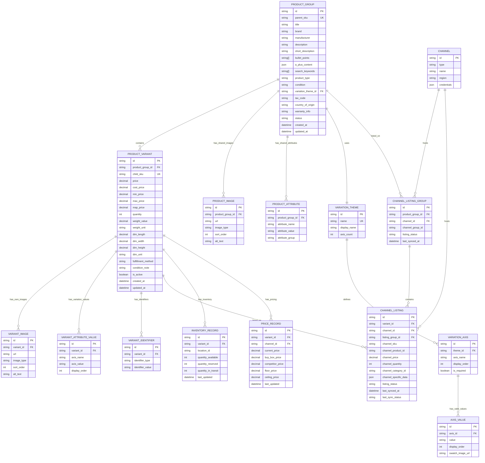
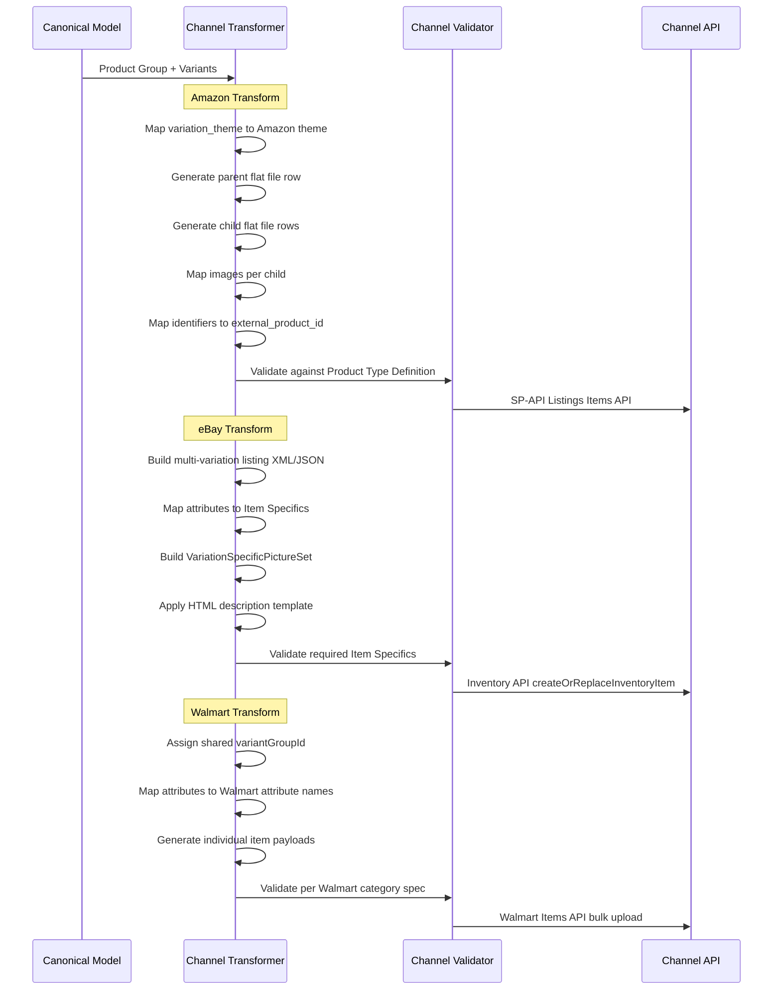

# Rithum Product Listing Architecture — Parent-Child Variant Model

> **Purpose**: Deep analysis of how Rithum (formerly ChannelAdvisor) structures products and their variants under a parent product, how this maps to marketplace channels, and how to replicate this architecture in Nexus Commerce.

---

## Table of Contents

1. [Parent-Child Product Hierarchy](#1-parent-child-product-hierarchy)
2. [Variant Architecture](#2-variant-architecture)
3. [Product Listing Data Model](#3-product-listing-data-model)
4. [Marketplace Channel Mapping](#4-marketplace-channel-mapping)
5. [API Representation](#5-api-representation)
6. [Replication Strategy for Nexus Commerce](#6-replication-strategy-for-nexus-commerce)

---

## 1. Parent-Child Product Hierarchy

### 1.1 Core Concept

Rithum organizes every product using a **strict parent-child hierarchy** where:

- A **Parent Product** (also called a "Product Group" or "Listing Parent") represents the abstract product concept — e.g., "Nike Air Max 90 Running Shoe"
- **Child Products** (also called "Variants", "SKUs", or "Child SKUs") represent the specific purchasable items — e.g., "Nike Air Max 90 - Black - Size 10"

This is a **1:N relationship** — one parent has one or more children. A product with no variations is treated as a **standalone product** (parent with zero children, where the parent itself is the purchasable SKU).

```
Product Group: Nike Air Max 90 Running Shoe
|
+-- Parent SKU: NIKE-AM90 (non-purchasable, grouping entity)
    |
    +-- Child SKU: NIKE-AM90-BLK-08  (Black, Size 8)   $129.99  qty: 15
    +-- Child SKU: NIKE-AM90-BLK-09  (Black, Size 9)   $129.99  qty: 22
    +-- Child SKU: NIKE-AM90-BLK-10  (Black, Size 10)  $129.99  qty: 8
    +-- Child SKU: NIKE-AM90-WHT-08  (White, Size 8)   $134.99  qty: 12
    +-- Child SKU: NIKE-AM90-WHT-09  (White, Size 9)   $134.99  qty: 19
    +-- Child SKU: NIKE-AM90-WHT-10  (White, Size 10)  $134.99  qty: 5
```

### 1.2 Parent vs Child Field Ownership

Rithum enforces a clear separation of which data lives at the parent level versus the child level:

#### Fields Owned by the PARENT (Shared/Inherited)

| Field | Description | Inherited by Children? |
|-------|-------------|----------------------|
| **Product Group ID** | Internal unique identifier for the product group | Yes - children reference this |
| **Title** | Primary product title | Yes - children inherit, can append variation suffix |
| **Brand** | Brand name | Yes |
| **Manufacturer** | Manufacturer name | Yes |
| **Description** | Full product description / HTML content | Yes |
| **Bullet Points** | Feature bullet points (up to 5 for Amazon) | Yes |
| **A+ Content** | Enhanced brand content (rich HTML/JSON) | Yes |
| **Search Keywords** | Backend search terms | Yes |
| **Category / Classification** | Product type, browse node, category path | Yes |
| **Variation Theme** | Defines which attributes create variations (e.g., Size-Color) | Yes - defines the variation axes |
| **Main Image** | Primary product image (hero shot) | Yes - default, children can override |
| **Condition** | New, Used, Refurbished | Yes |
| **Tax Code** | Tax classification | Yes |
| **Warranty** | Warranty information | Yes |
| **Country of Origin** | Manufacturing country | Yes |

#### Fields Owned by Each CHILD (Unique per Variant)

| Field | Description | Overrides Parent? |
|-------|-------------|-------------------|
| **Child SKU** | Unique seller SKU for this variant | N/A - always unique |
| **Marketplace IDs** | ASIN (Amazon), Item ID (eBay), etc. per channel | N/A - channel-specific |
| **Variation Attributes** | The specific values (e.g., Color=Black, Size=10) | N/A - defines the variant |
| **Price** | Selling price for this specific variant | Yes - each child has its own price |
| **Cost Price** | Cost of goods for this variant | Yes |
| **Inventory Quantity** | Stock level for this specific variant | Yes - always per-child |
| **UPC / EAN / GTIN** | Barcode identifier (unique per variant) | Yes - each variant has its own |
| **Weight** | Shipping weight (may vary by size) | Can override parent |
| **Dimensions** | L x W x H (may vary by size) | Can override parent |
| **Images** | Variant-specific images (e.g., color-specific photos) | Can override or supplement parent |
| **Listing Status** | Active/Inactive per channel per variant | Yes |
| **Min/Max Price** | Repricing bounds for this variant | Yes |
| **Buy Box Price** | Current Buy Box price (Amazon) | Yes |
| **Fulfillment Method** | FBA/FBM per variant | Can override parent default |

### 1.3 Standalone Products (No Variations)

When a product has no variations, Rithum treats it as a **standalone** — the parent IS the purchasable item:

```
Standalone Product: USB-C Cable 6ft
|
+-- SKU: USBC-6FT  (this is both parent and purchasable)
    Price: $12.99
    Quantity: 150
    UPC: 012345678901
```

In this case, price, quantity, UPC, and all other child-level fields are stored directly on the parent record. The system detects `variationCount === 0` and treats the parent as a leaf node.

### 1.4 Hierarchy Depth

Rithum uses a **strictly 2-level hierarchy** — Parent and Child. There is no grandchild level. This matches all major marketplace requirements:

```
ALLOWED:
  Parent -> Child (1 level of nesting)
  Parent -> (no children, standalone)

NOT ALLOWED:
  Parent -> Child -> Grandchild (too deep)
```

---

## 2. Variant Architecture

### 2.1 Variation Themes

A **Variation Theme** defines which product attributes create the variation matrix. Rithum supports both single-axis and multi-axis variation themes:

#### Single-Axis Themes

| Theme | Axis | Example Values |
|-------|------|---------------|
| **Size** | Size | S, M, L, XL, XXL |
| **Color** | Color | Red, Blue, Black, White |
| **Material** | Material | Cotton, Polyester, Silk |
| **Style** | Style | Classic, Modern, Vintage |
| **Pattern** | Pattern | Solid, Striped, Plaid |
| **Scent** | Scent | Lavender, Vanilla, Citrus |
| **Flavor** | Flavor | Chocolate, Vanilla, Strawberry |
| **Count** | Package Count | 1-Pack, 3-Pack, 6-Pack |

#### Multi-Axis Themes (Matrix)

| Theme | Axes | Matrix Size Example |
|-------|------|-------------------|
| **Size-Color** | Size + Color | 5 sizes x 4 colors = 20 variants |
| **Size-Style** | Size + Style | 5 sizes x 3 styles = 15 variants |
| **Color-Material** | Color + Material | 4 colors x 3 materials = 12 variants |
| **Size-Color-Material** | Size + Color + Material | 3 x 4 x 2 = 24 variants |

### 2.2 Variation Theme Configuration

```
Variation Theme: SizeColor
|
+-- Axis 1: Size
|   +-- Valid Values: [XS, S, M, L, XL, XXL, 2XL, 3XL]
|   +-- Display Order: sequential
|   +-- Required: true
|
+-- Axis 2: Color
    +-- Valid Values: [Black, White, Navy, Red, Grey, Blue]
    +-- Display Order: alphabetical
    +-- Required: true
    +-- Has Swatch Image: true

Generated Variant Matrix:
+-------+-------+-------+------+------+------+
|       | Black | White | Navy | Red  | Grey | Blue |
+-------+-------+-------+------+------+------+
| XS    | v001  | v002  | v003 | v004 | v005 | v006 |
| S     | v007  | v008  | v009 | v010 | v011 | v012 |
| M     | v013  | v014  | v015 | v016 | v017 | v018 |
| L     | v019  | v020  | v021 | v022 | v023 | v024 |
| XL    | v025  | v026  | v027 | v028 | v029 | v030 |
+-------+-------+-------+------+------+------+
```

### 2.3 Attribute Inheritance Model

```mermaid
graph TB
    subgraph Parent Product
        P_TITLE[Title: Nike Air Max 90]
        P_BRAND[Brand: Nike]
        P_DESC[Description: The iconic Air Max...]
        P_BULLETS[Bullet Points: 5 items]
        P_CAT[Category: Athletic Shoes]
        P_THEME[Variation Theme: Size-Color]
        P_IMG[Main Image: hero-shot.jpg]
        P_KEYWORDS[Keywords: running shoe, athletic]
    end

    subgraph Child Variant 1
        C1_SKU[SKU: AM90-BLK-10]
        C1_ASIN[ASIN: B08XYZ1234]
        C1_COLOR[Color: Black]
        C1_SIZE[Size: 10]
        C1_PRICE[Price: $129.99]
        C1_QTY[Quantity: 8]
        C1_UPC[UPC: 012345678901]
        C1_IMG[Images: black-front.jpg, black-side.jpg]
        C1_WEIGHT[Weight: 1.2 lb]
    end

    subgraph Child Variant 2
        C2_SKU[SKU: AM90-WHT-09]
        C2_ASIN[ASIN: B08XYZ5678]
        C2_COLOR[Color: White]
        C2_SIZE[Size: 9]
        C2_PRICE[Price: $134.99]
        C2_QTY[Quantity: 19]
        C2_UPC[UPC: 012345678902]
        C2_IMG[Images: white-front.jpg, white-side.jpg]
        C2_WEIGHT[Weight: 1.1 lb]
    end

    P_TITLE -->|inherited| C1_SKU
    P_TITLE -->|inherited| C2_SKU
    P_BRAND -->|inherited| C1_SKU
    P_BRAND -->|inherited| C2_SKU
    P_DESC -->|inherited| C1_SKU
    P_DESC -->|inherited| C2_SKU
    P_CAT -->|inherited| C1_SKU
    P_CAT -->|inherited| C2_SKU
    P_IMG -->|default, overridden| C1_IMG
    P_IMG -->|default, overridden| C2_IMG
```



### 2.4 Image Inheritance Rules

Images follow a specific inheritance pattern:

```
Parent Images (shared across all variants):
  MAIN    -> hero-shot.jpg        (default for all variants)
  ALT_1   -> lifestyle-1.jpg      (inherited by all)
  ALT_2   -> detail-shot.jpg      (inherited by all)

Child-Specific Images (override per variant):
  Variant "Black":
    SWATCH  -> black-swatch.jpg   (color swatch thumbnail)
    MAIN    -> black-front.jpg    (overrides parent MAIN)
    ALT_1   -> black-side.jpg     (variant-specific)
    ALT_2   -> (inherits parent detail-shot.jpg)

  Variant "White":
    SWATCH  -> white-swatch.jpg
    MAIN    -> white-front.jpg    (overrides parent MAIN)
    ALT_1   -> white-side.jpg
    ALT_2   -> (inherits parent detail-shot.jpg)

Resolution Order:
  1. Check child for image type
  2. If not found, fall back to parent image
  3. If parent also missing, no image
```

---

## 3. Product Listing Data Model

### 3.1 Complete Entity Relationship Diagram



### 3.2 Key Schema Details

#### Product Group (Parent) Table

```sql
CREATE TABLE product_group (
    id              VARCHAR PRIMARY KEY,
    parent_sku      VARCHAR UNIQUE NOT NULL,
    title           VARCHAR(500) NOT NULL,
    brand           VARCHAR(200),
    manufacturer    VARCHAR(200),
    description     TEXT,
    short_description TEXT,
    bullet_points   TEXT[],          -- Array of up to 5 bullet points
    a_plus_content  JSONB,           -- Rich content as structured JSON
    search_keywords TEXT[],          -- Backend search terms
    product_type    VARCHAR(200),    -- e.g., "SHOES", "ELECTRONICS"
    condition       VARCHAR(50),     -- NEW, USED_LIKE_NEW, etc.
    variation_theme VARCHAR(100),    -- e.g., "SizeColor", "Size", "Color"
    tax_code        VARCHAR(50),
    country_of_origin VARCHAR(2),    -- ISO country code
    warranty_info   TEXT,
    status          VARCHAR(20) DEFAULT 'DRAFT', -- DRAFT, ACTIVE, INACTIVE
    created_at      TIMESTAMP DEFAULT NOW(),
    updated_at      TIMESTAMP DEFAULT NOW()
);
```

#### Product Variant (Child) Table

```sql
CREATE TABLE product_variant (
    id                VARCHAR PRIMARY KEY,
    product_group_id  VARCHAR NOT NULL REFERENCES product_group(id),
    child_sku         VARCHAR UNIQUE NOT NULL,
    
    -- Pricing (always per-variant)
    price             DECIMAL(10,2) NOT NULL,
    cost_price        DECIMAL(10,2),
    min_price         DECIMAL(10,2),    -- Repricing floor
    max_price         DECIMAL(10,2),    -- Repricing ceiling
    map_price         DECIMAL(10,2),    -- Minimum Advertised Price
    
    -- Inventory (always per-variant)
    quantity          INTEGER DEFAULT 0,
    
    -- Physical (can override parent)
    weight_value      DECIMAL(10,3),
    weight_unit       VARCHAR(10),
    dim_length        DECIMAL(10,2),
    dim_width         DECIMAL(10,2),
    dim_height        DECIMAL(10,2),
    dim_unit          VARCHAR(10),
    
    -- Fulfillment
    fulfillment_method VARCHAR(10),    -- FBA, FBM, WFS
    
    -- Status
    is_active         BOOLEAN DEFAULT true,
    
    created_at        TIMESTAMP DEFAULT NOW(),
    updated_at        TIMESTAMP DEFAULT NOW()
);
```

#### Variant Attribute Values (Variation Axes)

```sql
CREATE TABLE variant_attribute_value (
    id            VARCHAR PRIMARY KEY,
    variant_id    VARCHAR NOT NULL REFERENCES product_variant(id),
    axis_name     VARCHAR(100) NOT NULL,  -- e.g., "Color", "Size"
    axis_value    VARCHAR(200) NOT NULL,  -- e.g., "Black", "10"
    display_order INTEGER DEFAULT 0,
    
    UNIQUE(variant_id, axis_name)  -- One value per axis per variant
);
```

#### Variant Identifiers (UPC, EAN, GTIN)

```sql
CREATE TABLE variant_identifier (
    id               VARCHAR PRIMARY KEY,
    variant_id       VARCHAR NOT NULL REFERENCES product_variant(id),
    identifier_type  VARCHAR(20) NOT NULL,  -- UPC, EAN, GTIN, ISBN
    identifier_value VARCHAR(50) NOT NULL,
    
    UNIQUE(variant_id, identifier_type)
);
```

---

## 4. Marketplace Channel Mapping

### 4.1 How Parent-Child Maps to Each Marketplace

Each marketplace has its own terminology and structure for product variations. Rithum's connector layer translates the canonical parent-child model to each channel's specific format.

#### Amazon Mapping

```
Rithum Model          ->  Amazon Model
-----------------------------------------
Product Group         ->  Parent ASIN (non-buyable)
  parent_sku          ->  Parent SKU
  title               ->  item_name
  brand               ->  brand
  bullet_points       ->  bullet_point (5 max)
  description         ->  product_description
  variation_theme     ->  variation_theme (e.g., "SizeColor")
  category            ->  browse_node_id + product_type

Product Variant       ->  Child ASIN (buyable)
  child_sku           ->  seller_sku
  price               ->  standard_price
  quantity            ->  quantity
  Color attribute     ->  color_name
  Size attribute      ->  size_name
  UPC                 ->  external_product_id (type=UPC)
  weight              ->  item_weight
  images              ->  main_image_url, other_image_url1-8

Amazon-Specific Rules:
  - Parent ASIN is NOT purchasable (no price, no quantity)
  - Each child ASIN must have a unique UPC/EAN
  - variation_theme must match Amazon's allowed themes for the category
  - Maximum 2000 child ASINs per parent
  - Child inherits parent's category, brand, description
  - Child can have its own images (swatch_image, main_image)
```

#### eBay Mapping

```
Rithum Model          ->  eBay Model
-----------------------------------------
Product Group         ->  Multi-Variation Listing (single Item ID)
  parent_sku          ->  SKU (listing-level)
  title               ->  Title (80 chars max)
  description         ->  Description (HTML)
  category            ->  CategoryID
  variation_theme     ->  Variation Specifics definition

Product Variant       ->  Variation within the listing
  child_sku           ->  Variation SKU
  price               ->  Variation Price
  quantity            ->  Variation Quantity
  Color attribute     ->  NameValueList: Color=Black
  Size attribute      ->  NameValueList: Size=10
  UPC                 ->  VariationProductListingDetails.UPC
  images              ->  VariationSpecificPictureSet

eBay-Specific Rules:
  - Single Item ID for the entire variation group
  - All variations share the same title and description
  - Each variation has its own price and quantity
  - Item Specifics define the variation axes
  - VariationSpecificPictureSet links images to specific attribute values
  - Maximum 250 variations per listing (eBay limit)
  - Variation names must match eBay's recommended Item Specifics
```

#### Walmart Mapping

```
Rithum Model          ->  Walmart Model
-----------------------------------------
Product Group         ->  Variant Group (groupId)
  parent_sku          ->  (no direct parent SKU concept)
  title               ->  productName
  brand               ->  brand
  description         ->  shortDescription + longDescription
  variation_theme     ->  variantGroupId + variantAttributeNames

Product Variant       ->  Individual Item (each has its own Walmart ID)
  child_sku           ->  sku
  price               ->  price.amount
  quantity            ->  inventory.quantity
  Color attribute     ->  variantAttributeValue (e.g., color)
  Size attribute      ->  variantAttributeValue (e.g., clothingSize)
  UPC                 ->  productIdentifiers.productId (type=GTIN)
  images              ->  images.imageUrl

Walmart-Specific Rules:
  - Each variant is a separate item with its own Walmart Item ID
  - Variants are grouped by variantGroupId
  - All items in a group must share the same variantGroupId
  - Each item must have a unique GTIN/UPC
  - Walmart requires specific attribute names per category
  - No concept of a non-purchasable parent
```

### 4.2 Channel Transformation Flow



### 4.3 Variation Theme Mapping Across Channels

| Rithum Theme | Amazon | eBay | Walmart |
|-------------|--------|------|---------|
| Size | size_name | Size | clothingSize |
| Color | color_name | Color | color |
| SizeColor | size_name + color_name | Size + Color | clothingSize + color |
| Material | material_type | Material | material |
| Style | style_name | Style | clothingStyle |
| Pattern | pattern_name | Pattern | pattern |
| Flavor | flavor_name | Flavor | flavor |
| Scent | scent_name | Scent | scent |
| Count | item_count | Count | count |
| SizeColorMaterial | size + color + material | Size + Color + Material | clothingSize + color + material |

---

## 5. API Representation

### 5.1 REST API — Product with Variants Response

Rithum's API returns products with their variants nested in a parent-child structure:

```json
{
  "product": {
    "id": "pg_cuid123456",
    "parentSku": "NIKE-AM90",
    "title": "Nike Air Max 90 Running Shoe",
    "brand": "Nike",
    "manufacturer": "Nike Inc.",
    "description": "The iconic Air Max 90 features the classic waffle outsole...",
    "bulletPoints": [
      "Visible Max Air unit for impact cushioning",
      "Waffle outsole with durable rubber",
      "Padded collar for comfort",
      "Leather and synthetic upper",
      "Classic color-blocking design"
    ],
    "searchKeywords": ["running shoe", "athletic shoe", "nike air max"],
    "productType": "SHOES",
    "condition": "NEW",
    "variationTheme": "SizeColor",
    "status": "ACTIVE",
    "images": [
      {
        "url": "https://cdn.example.com/nike-am90-hero.jpg",
        "type": "MAIN",
        "sortOrder": 0
      },
      {
        "url": "https://cdn.example.com/nike-am90-lifestyle.jpg",
        "type": "LIFESTYLE",
        "sortOrder": 1
      }
    ],
    "attributes": {
      "countryOfOrigin": "VN",
      "taxCode": "A_GEN_TAX",
      "warranty": "1 year manufacturer warranty"
    },
    "variants": [
      {
        "id": "pv_cuid_001",
        "childSku": "NIKE-AM90-BLK-10",
        "price": 129.99,
        "costPrice": 52.00,
        "minPrice": 99.99,
        "maxPrice": 159.99,
        "quantity": 8,
        "isActive": true,
        "variationAttributes": {
          "Color": "Black",
          "Size": "10"
        },
        "identifiers": {
          "UPC": "012345678901",
          "EAN": "0012345678901"
        },
        "weight": {
          "value": 1.2,
          "unit": "lb"
        },
        "dimensions": {
          "length": 13.0,
          "width": 9.0,
          "height": 5.0,
          "unit": "in"
        },
        "fulfillmentMethod": "FBA",
        "images": [
          {
            "url": "https://cdn.example.com/am90-black-front.jpg",
            "type": "MAIN",
            "sortOrder": 0
          },
          {
            "url": "https://cdn.example.com/am90-black-swatch.jpg",
            "type": "SWATCH",
            "sortOrder": 1
          }
        ],
        "channelListings": [
          {
            "channel": "AMAZON",
            "channelProductId": "B08XYZ1234",
            "channelSku": "NIKE-AM90-BLK-10",
            "channelPrice": 129.99,
            "channelQuantity": 8,
            "listingStatus": "ACTIVE",
            "lastSyncedAt": "2026-04-22T18:30:00Z",
            "lastSyncStatus": "SUCCESS"
          },
          {
            "channel": "EBAY",
            "channelProductId": "394857261034",
            "channelSku": "NIKE-AM90-BLK-10",
            "channelPrice": 131.99,
            "channelQuantity": 8,
            "listingStatus": "ACTIVE",
            "lastSyncedAt": "2026-04-22T18:32:00Z",
            "lastSyncStatus": "SUCCESS"
          }
        ]
      },
      {
        "id": "pv_cuid_002",
        "childSku": "NIKE-AM90-WHT-09",
        "price": 134.99,
        "costPrice": 54.00,
        "minPrice": 104.99,
        "maxPrice": 164.99,
        "quantity":